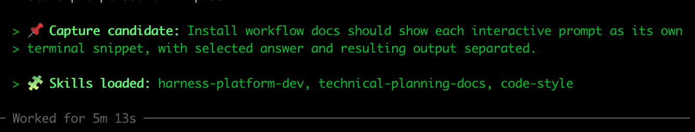

# RoboRepo

Claude Code & Codex global harness configuration with CLI support.

The repo installs shared rules, skills, hooks, MCP helpers, and maintenance commands into the local filesystem paths the harnesses already read. Core install comes first; the onboarding workflow lets each machine opt into any combination of behavior groups.

Primary goals:

- keep Claude and Codex configuration aligned (where desired)
- reduce token overuse
- reproduce same harness configs across machines
- keep user-owned local config safe during updates

## Start Here

Supports macOS and Linux;
Windows support is there, but not really tested.

[Setup default configs and CLI](docs/guides/first-time-setup.md)

## Using the roborepo CLI

After [installing roborepo](docs/guides/first-time-setup.md), you will have a `roborepo` command line tool.

You can use roborepo CLI to add items and configuation to your globalsetup that will work with both claude and codex.

Get started

REPO TABLE

[View roborepo commands](docs/reference/services/roborepo-cli.md)

## Global Behavior

Once you install the `roborepo` core, you will be prompted to install default packages and configurations. You can opt in/out of each one.

Run `roborepo onboard` to edit your settings.

- [Token Optimization / Efficiency](#token-optimization--efficiency)
- [Automatic Skill Helpers](#automatic-skill-helpers)
- [Commands](#commands)
- [Chat-Time Output](#chat-time-output)
- [Hooks](#hooks)
- [Harness Specifics](#harness-specifics)
  - [Codex](#codex)
  - [Claude](#claude)

### Token Optimization / Efficiency

|                                                         |                                                                                                   |
| ------------------------------------------------------- | ------------------------------------------------------------------------------------------------- |
| [jcodemunch-mcp](docs/reference/services/jcodemunch.md) | Code indexer that lets agents find relevant source through symbol search and targeted context.    |
| [jdocmunch-mcp](docs/reference/services/jdocmunch.md)   | Documentation indexer that lets agents query headings and sections instead of reading whole docs. |
| Caveman plugin                                          | Makes default agent output terse to reduce token usage.                                           |
| Minimal verification                                    | Agents run the narrowest useful check and report a `pass/fail` receipt.                           |

### Automatic Skill Helpers

|                              |                                                                                                                                         |
| ---------------------------- | --------------------------------------------------------------------------------------------------------------------------------------- |
| code-style                   | General cross-language coding conventions: naming, file organization, helper placement, comments, exports, readability.                 |
| javascript-typescript        | TypeScript/JavaScript utility code: ESM, lint/type errors, exports/imports, helpers, type safety, JS/TS style.                          |
| react                        | React, Next.js, Remix, and Vite React work touching JSX/TSX, components, hooks, client state, effects, routing UI, and React tests.     |
| test-harness                 | Choosing, running, and explaining tests; debugging CI failures; deciding scoped vs. full checks.                                        |
| supabase-integration-testing | Remote/real Supabase integration tests: RLS policies, RPC calls, migrations, service-role setup, anon access, unmocked DB/API behavior. |
| roborepo-support             | Working on this repo itself: shared skills, global rules, hooks, settings, and Claude/Codex parity.                                     |

### Commands

Use these when you want to intentionally start a named workflow.

|                       |                                                                                     |     |
| --------------------- | ----------------------------------------------------------------------------------- | --- |
| `/blog`               | Write a long-form architecture blog post about a real design decision.              |
| `/frontend-design`    | Apply Claude's frontend design workflow to build or review a substantial UI change. |
| `/technical-planning` | Create or revise a durable technical planning document.                             |
| `/inventory`          | Scan this repo and refresh its Project Context handoff docs (glossary, inventory).  |
| `/tighten`            | Clean up code against this project's own patterns with specific, anchored callouts. |

**Plain-Language Triggers**: Some named workflows can also be started in ordinary chat: "capture this", "write a blog post about this", "make this a durable technical plan", "run inventory", or "tighten this."

### Chat-Time Output

Lighter-weight behaviors that only generate messages in the conversation — no files written, no workflow started.

|                                                                     |                                                                                                                    |
| ------------------------------------------------------------------- | ------------------------------------------------------------------------------------------------------------------ |
| [Convention capture](docs/reference/services/convention-capture.md) | Agents surface newly confirmed conventions as inline recommendations during the chat.                              |
| Impact awareness                                                    | When you propose a change, agents flag (`> 🧭 Impact:`) how it collides with or duplicates existing functionality. |
| Skill visibility                                                    | Agents report which skills shaped a response (`> 🧩 Skills loaded:`) so behavior changes are traceable.            |

### Hooks

Hooks are shell commands the harness runs on its own when an event fires — a session
starts, or a tool is about to run. They steer the agent without the agent having to
remember to do anything. The defaults fall into two jobs:

|                |                                                                                                                                                                                              |
| -------------- | -------------------------------------------------------------------------------------------------------------------------------------------------------------------------------------------- |
| Session nudges | On session start, tell the agent what's available — caveman mode, jcodemunch/jdocmunch index state.                                                                                          |
| Tool guards    | Before a tool runs, redirect or tidy it — block `Grep`/`Glob` (and source-file `grep`/`cat`/`find` in Bash) toward jcodemunch, trim noisy Bash output, flag writes into managed config dirs. |
| Telemetry      | When enabled, capture metadata-only session/tool events for later analysis. Turn it on later with `roborepo telemetry enable`.                                                               |

Most of this is Claude-side, where the hook system is richer; Codex runs a single
session-start nudge and leans on its rules file for the rest. Full breakdown:
[Claude Hooks](docs/reference/services/claude-hooks.md), [Codex Hooks](docs/reference/services/codex-hooks.md).

### Harness Specifics

#### Codex

- **Plugins:** GitHub
- **[Hooks](docs/reference/services/codex-hooks.md) (unique):** caveman activation runs as a session hook here; jcodemunch enforcement lives in the rules file, not in tool hooks
- **Rules:** pre-approved safe commands for tests, builds, Docker, and local doctor checks
- **Model/features:** `gpt-5.5`, medium reasoning, hooks, JavaScript REPL, idle-sleep prevention

#### Claude

- **[Hooks](docs/reference/services/claude-hooks.md) (unique):** caveman comes from the `caveman` plugin instead of a hook; tool-level guards (block `Grep`/`Glob`, trim Bash output, guard writes into managed dirs) exist only here
- **Behavior flags:** thinking/away-summary stay quiet; dangerous-mode prompt skipped

## Maintaining the Harnesses

Harness source lives under `globals/`, with the data that drives the build/install scripts under
`manifests/`:

- `globals/agents/skills/` — shared skill source, global and exportable
- `globals/claude/` — Claude global rules, hooks, commands, settings baseline, and skill links
- `globals/codex/` — Codex global rules, hooks, settings baseline, and managed markers
- `manifests/inventory/` — the supplied catalog you add items to: MCP presets, slash commands,
  skill-invocation policy, and agent permission profiles
- `manifests/platform/` — install/verify/render plumbing: the `.tsv` path tables, content checks,
  the CLI usage catalog, and merge prompts
- `manifests/platform/presets.json` — preset bundle source of truth for onboarding/apply/remove

Every element is authored once and fanned out to both harnesses by the build/link step. New here?
Start with [How the Harnesses Work, and How We Build Parity](docs/reference/internal/harnesses-explained.md)
for the build/parity model; see **Under The Hood** below for the full doc set.

## Reference

### User Docs

- [First-Time Setup](docs/guides/first-time-setup.md)
- [Setup and Daily Use](docs/guides/setup-and-daily-use.md)
- [Install Workflow Choices](docs/guides/install-workflows.md)
- [roborepo CLI Commands](docs/reference/services/roborepo-cli.md)
- [roborepo CLI Reference](docs/reference/services/roborepo.md)
- [Documentation Index](docs/README.md)

### Under The Hood

- [How the Harnesses Work, and How We Build Parity](docs/reference/internal/harnesses-explained.md)
- [Harness Anatomy and Parity](docs/reference/internal/harness-anatomy.md)
- [How It Works](docs/reference/services/architecture.md)
- [Config Collision Handling](docs/reference/internal/config-collision-handling.md)
- [Rules Parity and Layering](docs/reference/internal/rules-parity-and-layering.md)
- [Skills And Slash Commands](docs/reference/internal/skills-and-commands.md)
- [Claude Hooks](docs/reference/services/claude-hooks.md)
- [Codex Hooks](docs/reference/services/codex-hooks.md)
