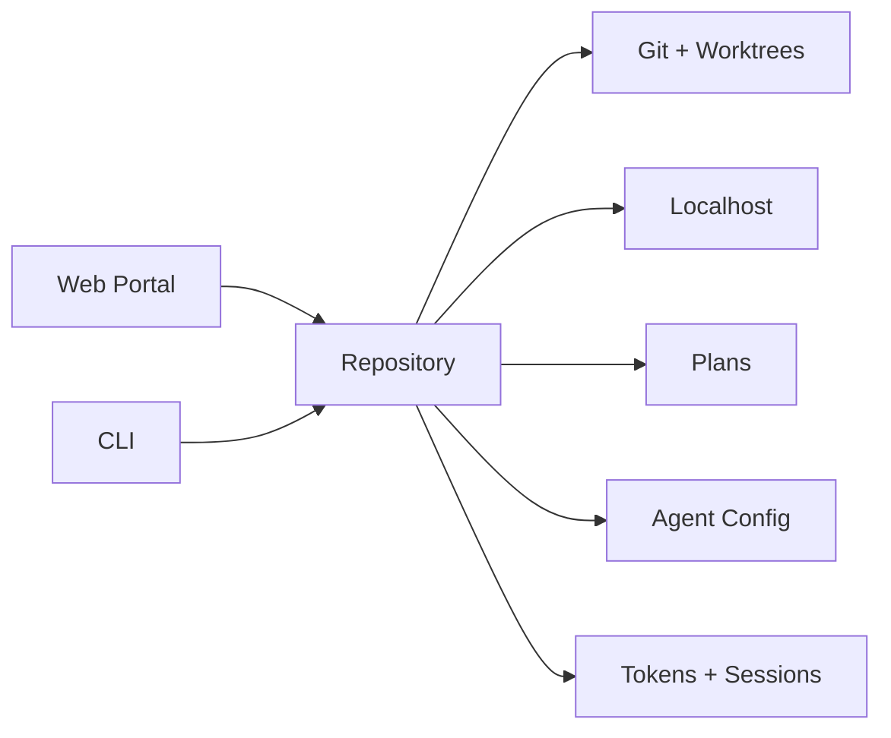
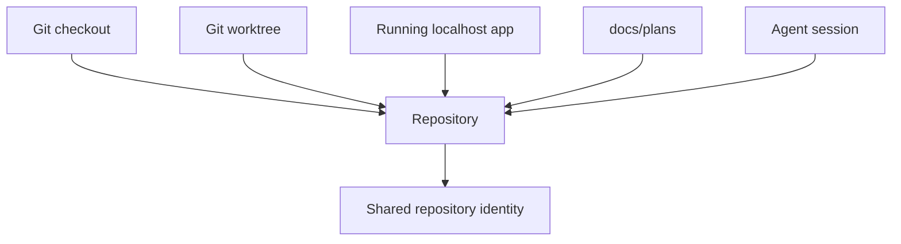
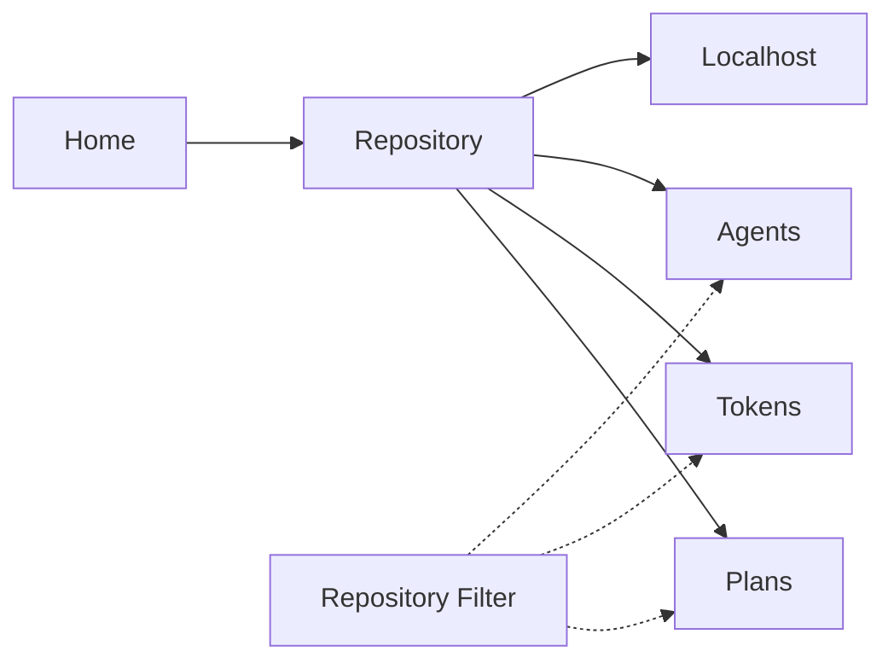
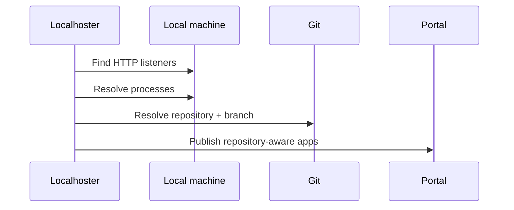
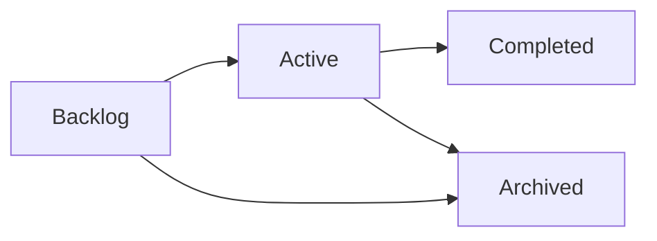
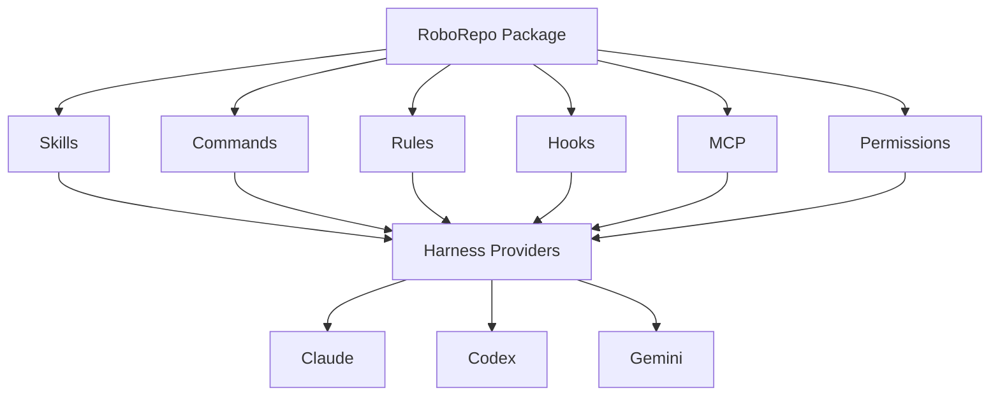
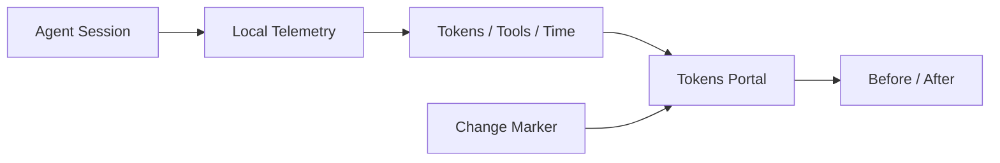
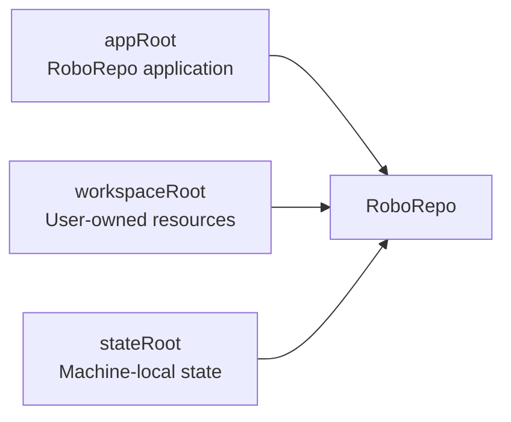
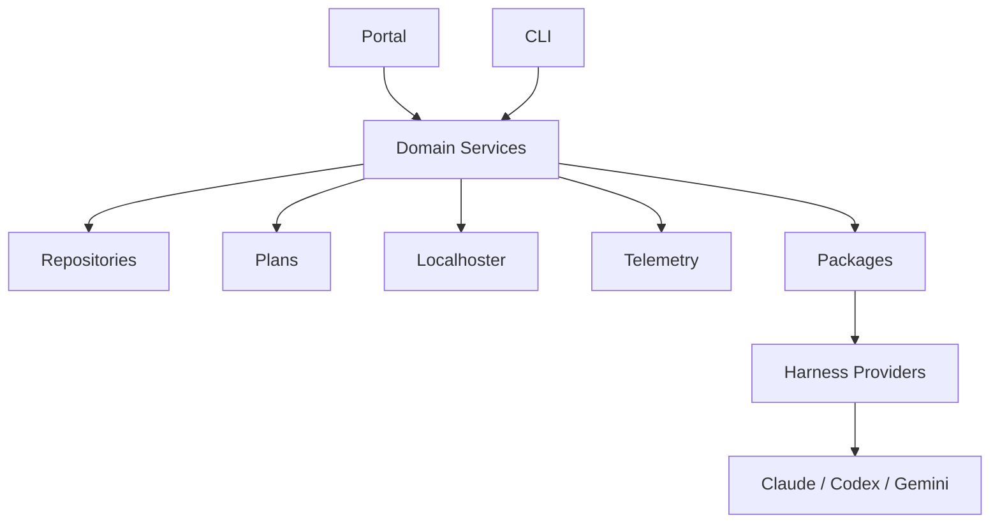

# RoboRepo

**Admin panel for your local dev environment.**

RoboRepo sits at the intersection of **Git**, **localhost activity**, **agent configuration**, **development planning**, and **token/session telemetry**.



|                  |                                                    |
| ---------------- | -------------------------------------------------- |
| **Repositories** | Git, branches, worktrees, local activity           |
| **Localhoster**  | Running apps, ports, health, Docker, processes     |
| **Plans**        | Plan docs, lifecycle, readiness, dependencies      |
| **Agents**       | Skills, rules, hooks, MCP, permissions, packages   |
| **Telemetry**    | Tokens, sessions, tools, models, changes over time |

---

## Install

Requires **Node.js 20+**.

```sh
npm install -g codethings-roborepo-alpha
roborepo web
```

The first `roborepo web` performs the same one-time machine setup as `roborepo init` — it creates the
workspace/state directories, detects your installed agent harnesses, and records initialization —
then opens the portal. On later runs `web` just starts the portal. `roborepo init` remains the
explicit alternative first-run entry point if you prefer the terminal handoff.

Then use either entry point:

| Interface  | Start with     |
| ---------- | -------------- |
| Web portal | `roborepo web` |
| Terminal   | `roborepo`     |

```sh
roborepo web
roborepo
roborepo doctor
```

[First-time setup →](docs/user/guides/first-time-setup.md)  
[CLI reference →](docs/user/reference/roborepo-cli.md)

---

## Portal

```text
RoboRepo
├── Agents
├── Plans
├── Localhoster
└── Tokens
```

<!-- Screenshot: full portal / navigation -->

The portal runs locally on your machine.

```sh
roborepo web
```

---

## Repositories

RoboRepo maintains a canonical identity for repositories observed across its tools.



Repository-aware data can include:

| Git            | Runtime      | Development         |
| -------------- | ------------ | ------------------- |
| Branch         | Running apps | Plans               |
| Commit         | Ports / URLs | Plan lifecycle      |
| Dirty state    | Health       | Agent configuration |
| Ahead / behind | Docker       | Token activity      |
| Worktrees      | CPU / memory | Sessions            |

<!-- Screenshot: repository-aware Localhoster card -->

### Coming soon

A repository-first Home and shared repository scope are planned.



---

## Localhoster

Discover running local HTTP applications and associate them with repositories.

```sh
roborepo localhoster
roborepo localhoster --open
```

| Observes  | Examples                          |
| --------- | --------------------------------- |
| HTTP      | origin, title, health             |
| Git       | branch, dirty state, ahead/behind |
| Worktrees | linked checkout context           |
| Process   | PID, CPU, memory, uptime          |
| Docker    | container and Compose metadata    |



<!-- Screenshot: Localhoster -->

[Localhoster reference →](docs/user/reference/localhoster.md)

---

## Plans

RoboRepo discovers repository planning documents under:

```text
docs/plans/
├── backlog/
├── active/
├── completed/
└── archived/
```

The Plans portal surfaces:

|                 |                                |
| --------------- | ------------------------------ |
| Lifecycle       | backlog → active → completed   |
| Readiness       | deterministic validation       |
| Priority        | plan metadata                  |
| Dependencies    | blockers and relationships     |
| Git state       | reviewed commit / current HEAD |
| Agent workflows | create, review, start, sync    |



<!-- Screenshot: Plans portal -->

[Plan Docs walkthrough →](docs/user/guides/plan/lifecycle/plan-docs.md)  
[Plans reference →](docs/user/reference/plans-portal.md)

---

## Agent Configuration

Manage shared agent behavior across supported harnesses.



Common actions:

```sh
roborepo library
roborepo package list
roborepo package enable <package>
roborepo package disable <package>
```

Automatic helpers:

| Helper                         | Applies when                         |
| ------------------------------ | ------------------------------------ |
| `code-style`                   | Cross-language code conventions      |
| `javascript-typescript`        | JavaScript, TypeScript, ESM, JSX/TSX |
| `react`                        | React components, hooks, and tests   |
| `supabase-integration-testing` | Real Supabase integration tests      |
| `test-harness`                 | Choosing and validating test runs    |

<!-- Screenshot: Agents / Config -->

[Config control panel →](docs/user/reference/config-control-panel.md)  
[Supported harnesses →](docs/user/guides/harnesses/supported-harnesses.md)

---

## Tokens + Sessions

Telemetry is **local and opt-in**.

```sh
roborepo telemetry enable
roborepo web
```

Track:

| Usage        | Activity  | Context    |
| ------------ | --------- | ---------- |
| Tokens       | Sessions  | Repository |
| Tool calls   | Testing   | Harness    |
| MCP usage    | Changes   | Model      |
| Context cost | Anomalies | Time       |



<!-- Screenshot: Tokens portal -->

[Telemetry walkthrough →](docs/user/guides/telemetry.md)

---

## Workspace

RoboRepo separates the application from user-owned configuration and machine state.



```sh
roborepo workspace status
roborepo workspace use <path>
roborepo workspace validate
roborepo workspace import <path>
```

| Root            | Contains                                          |
| --------------- | ------------------------------------------------- |
| `appRoot`       | installed RoboRepo application                    |
| `workspaceRoot` | skills, commands, packages, MCP config, overrides |
| `stateRoot`     | telemetry, local settings, caches, runtime state  |

[Architecture →](docs/user/reference/architecture.md)

---

## CLI

`roborepo` is the terminal interface to the same system.

```sh
roborepo
```

```text
roborepo
├── init
├── web
├── library
├── localhoster
├── workspace
├── package
├── skill
├── telemetry
├── harness
└── doctor
```

The README covers common entry points. See the reference for the full command surface.

[Full CLI reference →](docs/user/reference/roborepo-cli.md)

---

## Architecture



| Layer             | Responsibility                        |
| ----------------- | ------------------------------------- |
| Repository domain | canonical repository identity         |
| Domain modules    | Plans, Localhoster, telemetry, config |
| Packages          | configurable RoboRepo functionality   |
| Harness providers | harness-specific implementations      |
| Portal            | browser interface                     |
| CLI               | terminal interface                    |

[Architecture →](docs/user/reference/architecture.md)  
[Harness architecture →](docs/internal/harnesses-explained.md)

---

## Development

```sh
git clone https://github.com/kirinmurphy/roborepo.git
cd roborepo

npm test
./bin/roborepo --help
```

Requires **Node.js 20+**.

Use the checkout-local executable while developing:

```sh
./bin/roborepo
```

A separately installed global `roborepo` command can remain pointed at the packaged installation.

### Documentation

|                   |                                                                                            |
| ----------------- | ------------------------------------------------------------------------------------------ |
| First-time setup  | [docs/user/guides/first-time-setup.md](docs/user/guides/first-time-setup.md)               |
| CLI               | [docs/user/reference/roborepo-cli.md](docs/user/reference/roborepo-cli.md)                 |
| Localhoster       | [docs/user/reference/localhoster.md](docs/user/reference/localhoster.md)                   |
| Plans             | [docs/user/reference/plans-portal.md](docs/user/reference/plans-portal.md)                 |
| Telemetry         | [docs/user/guides/telemetry.md](docs/user/guides/telemetry.md)                             |
| Agent config      | [docs/user/reference/config-control-panel.md](docs/user/reference/config-control-panel.md) |
| Architecture      | [docs/user/reference/architecture.md](docs/user/reference/architecture.md)                 |
| Documentation map | [docs/internal/docs-map.md](docs/internal/docs-map.md)                                     |

---

## License

MIT
