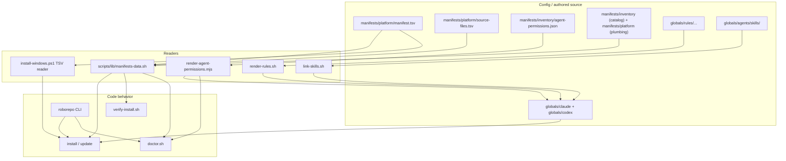
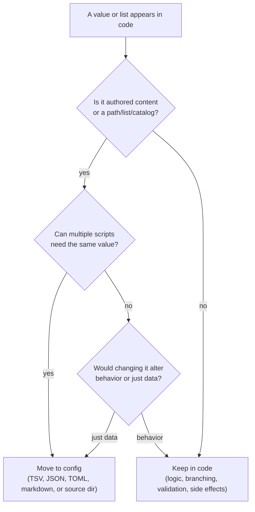
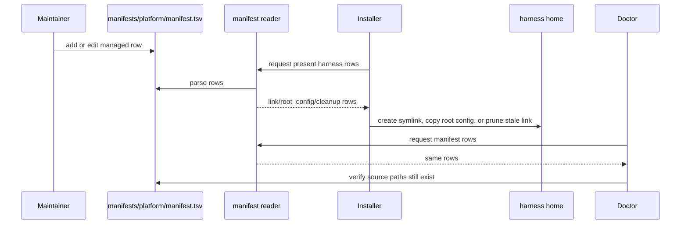

# Config-Code Separation

This repo keeps dynamic values and authored content in data files, while scripts keep the
behavior: parsing, validation, prompting, linking, copying, pruning, and reporting.

## Definition List

| Term | Definition |
| --- | --- |
| **config** | Lists, mappings, authored content, baseline files, flags, and defaults that can change without changing behavior. |
| **code** | Logic that interprets config: branching, validation, prompting, filesystem mutation, command dispatch, and error handling. |
| **manifest** | `manifests/platform/manifest.tsv`, the managed home-path inventory. It says what roborepo manages and how each row behaves. |
| **reader** | A small parser that turns config files into script-friendly rows or objects. Bash uses `scripts/lib/manifests-data.sh`; PowerShell parses the manifest in `install-windows.ps1`. |
| **consumer** | A script that reads config and performs behavior, such as install, verify, doctor, or sync. |
| **authored source** | Human-maintained repo content under `globals/`, such as rules, skills, hooks, commands, and baseline harness config. |
| **generated output** | Files rendered from authored source, such as `globals/claude/CLAUDE.md` and `globals/codex/AGENTS.md`. |

## Current Boundary

| Area | Config or source of truth | Code that interprets it |
| --- | --- | --- |
| Managed home paths | `manifests/platform/manifest.tsv` | `install/main.sh`, `install-claude.sh`, `install-codex.sh`, `install-windows.ps1`, `verify-install.sh`, `doctor.sh` |
| Required repo files | `manifests/platform/source-files.tsv` | `doctor.sh` |
| Agent permission profiles | `manifests/inventory/agent-permissions.json` | `scripts/build/render-agent-permissions.mjs`, `install/main.sh`, `doctor.sh` |
| Agent rules | `globals/rules/{shared,claude,codex}/` | `scripts/build/render-rules.sh` |
| Rule render targets | `manifests/platform/rule-targets.tsv` | `scripts/build/render-rules.sh` |
| CLI menu/usage catalog | `manifests/platform/cli-commands.json` | `scripts/cli/main.mjs` |
| MCP presets | `manifests/inventory/mcp-presets.json` | `scripts/cli/mcp.mjs` |
| Harness presence metadata | `manifests/platform/harnesses.tsv` | `install/main.sh`, `install-codex.sh` |
| Verify content assertions | `manifests/platform/verify-content.tsv` | `verify-install.sh` |
| Shell snippet installs | `manifests/platform/shell-snippets.tsv` | `install-shell-snippets.sh` |
| Merge prompts | `manifests/platform/prompts/*.md` | `install-lib.sh` |
| Global harness config | `globals/claude/`, `globals/codex/`, `globals/agents/` | Installers, verify, doctor, write guard |
| Shared skills | `globals/agents/skills/` | `scripts/build/link-skills.sh`, `roborepo skill export-to-local` |
| Repo-local skills | `local/skills/` | `scripts/build/link-skills.sh`, doctor checks |
| CLI implementation | command modules under `scripts/cli/` | `scripts/cli/main.mjs` dispatch |

## Relationship Diagram

## Decision Boundary

Use this rule when deciding whether a value belongs in config or code.

## Manifest Workflow

## Row Kind Table

| Manifest kind | Config says | Code does | Reverse sync |
| --- | --- | --- | --- |
| `link` | Home path should point at repo source. | Preflight conflicts, create symlink, verify target. | Syncs home back to repo unless `nosync`. |
| `root_config` | Home path starts from repo baseline but becomes user-owned. | Copy file, adopt on collision, verify active local file. | Skips unless `--include-root-config`. |
| `cleanup` | Old managed path should no longer be linked to repo. | Remove old repo symlink only. | Never synced. |

## Remaining Candidates

| Candidate | Current location | Possible config file | Why it may help | Keep in code |
| --- | --- | --- | --- | --- |
| Windows-only installer details | `scripts/install/install-windows.ps1` | Existing manifests, plus small Windows-specific catalog if needed | More parity with POSIX install readers. | PowerShell filesystem behavior and Windows path handling. |
| Long hook command bodies | `globals/claude/settings.json`, `globals/codex/hooks.json` | `manifests/platform/hooks/*.sh` or `globals/*/hooks/` scripts | Easier testing and quoting than embedded shell strings. | Hook registration shape and harness-specific event wiring. |
| Non-root conflict prompt text | `scripts/install/main.sh` | `manifests/platform/prompts/non-root-conflict.md` | Keeps all user-facing merge guidance together. | Conflict detection and abort behavior. |

## What Should Stay Code

| Behavior | Why |
| --- | --- |
| Collision handling | It is operational logic with side effects and user choices. |
| Dry-run handling | It changes execution flow, not just values. |
| Symlink creation and cleanup | OS/filesystem behavior belongs in script logic. |
| Interactive prompt loops | They control terminal state and stdin, especially sync's FD-3 manifest loop. |
| Validation and parse checks | They turn config into pass/fail behavior. |
| CLI dispatch | It decides which module runs and how exit codes propagate. |

## Related

- `docs/architecture/manifest-and-symlinks.md`
- `docs/plans/sync-from-home-manifest.md`
