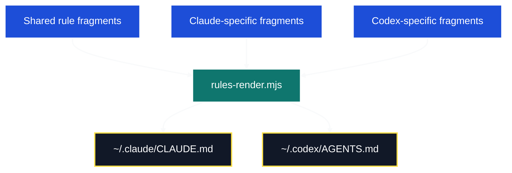
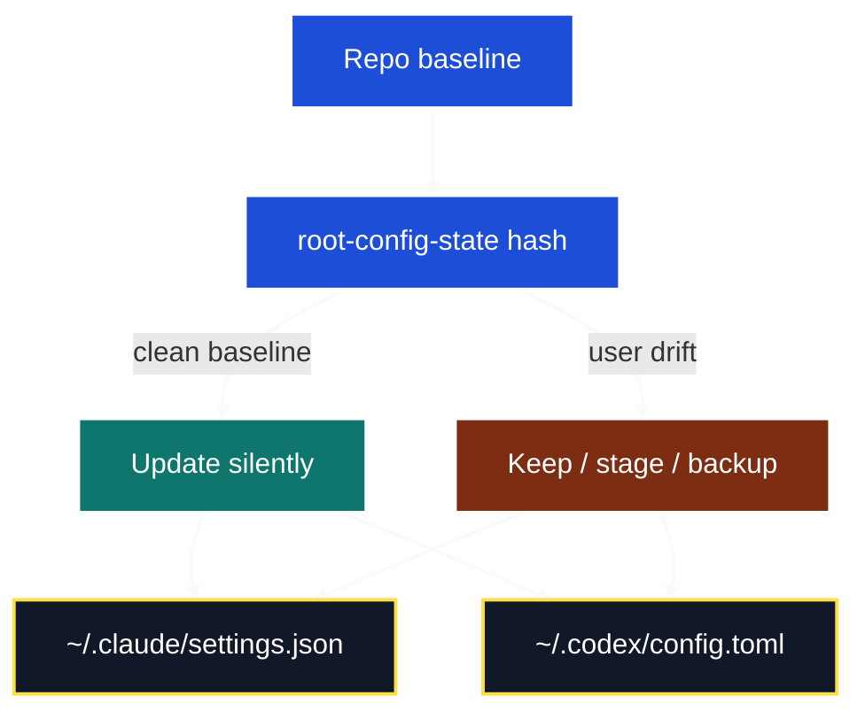
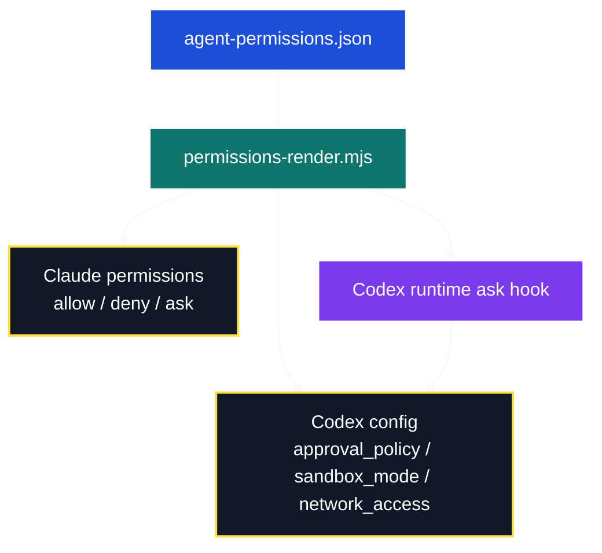
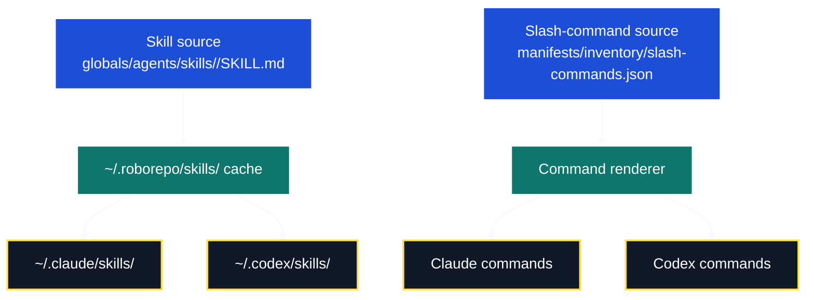
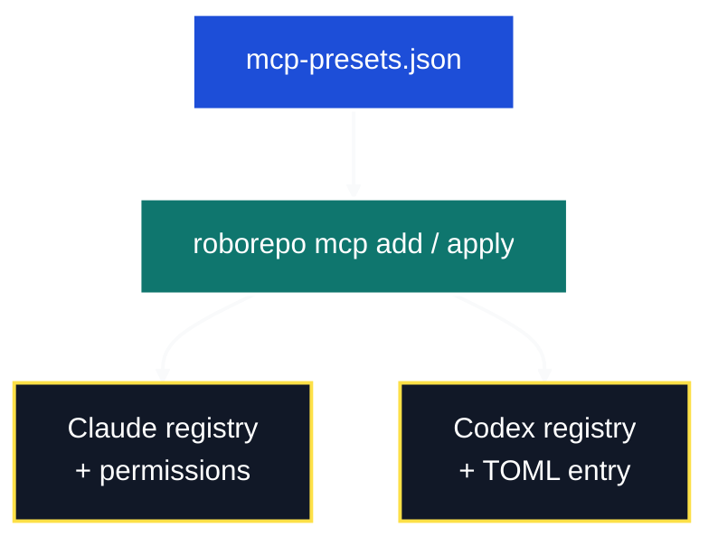
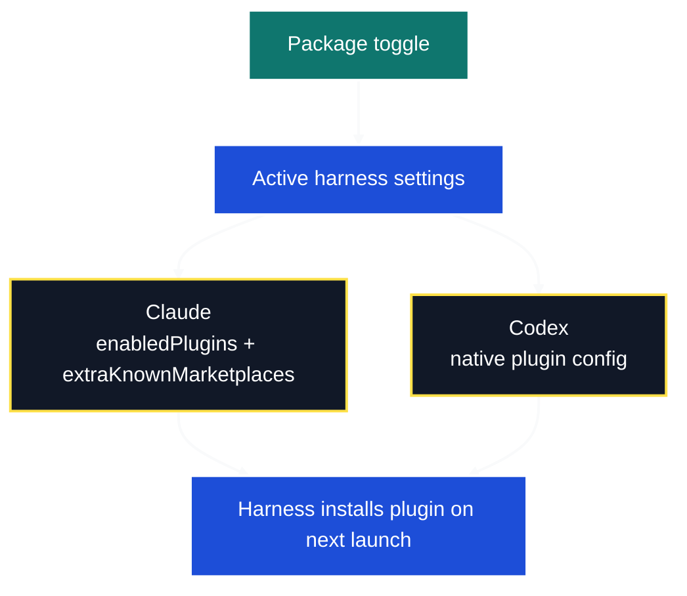
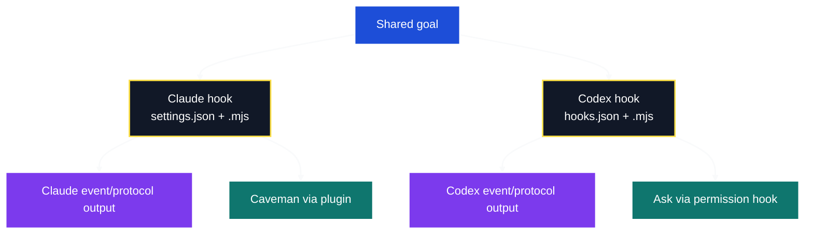

# Cross-Harness Behavior Assessment

This note breaks the harness surface into the same questions, section by section:

1. What Claude expects
2. What Codex expects
3. How roborepo wraps the difference
4. How user data survives install and update

The point is not to describe every file in the tree. The point is to make the parity boundary visible: where the two harnesses are already aligned, where roborepo can generate or symlink its way through, and where the right answer is to keep the user’s state separate from repo-managed defaults.

## Table Of Contents

| Section | What it covers |
| --- | --- |
| [1. Rules](#1-rules) | Always-on harness instructions: global defaults, verification posture, and shared behavior. |
| [2. Config](#2-config) | Root mutable config: model, sandbox, hooks, MCP, plugins, and other session-level state. |
| [3. Permissions](#3-permissions) | Allowed, denied, and ask-before-run behavior across the two harnesses. |
| [4. Skills / Commands](#4-skills--commands) | Reusable skills, explicit slash commands, and how they fan out to each harness. |
| [5. MCP](#5-mcp) | Server registration and how roborepo keeps native registries in sync. |
| [6. Plugins](#6-plugins) | Plugin enablement, marketplace state, and delayed native install. |
| [7. Hooks](#7-hooks) | Event-driven behavior that diverges too far to share a single renderer. |

## 1) Rules

### Extent

Always-on harness instructions:

- global behavior defaults
- verification posture
- temp-file hygiene
- skill-loading guidance
- communication style

These are the “everything starts here” rules, not project-local instructions.

### Diagram



### What Claude expects

Claude reads `~/.claude/CLAUDE.md`.

In roborepo terms, Claude’s live file is a rendered Markdown document. The important detail is not the filename; it is that Claude expects a single always-on markdown rules file at that path.

### What Codex expects

Codex reads `~/.codex/AGENTS.md`.

Same intent, different filename and slightly different house style. Codex’s file is also a rendered markdown document, but the home directory and the surrounding config model are different.

### Parity wrapper

Roborepo wraps rules with generation, not hand-copying.

```text
globals/rules/shared/*.md
globals/rules/claude/*.md
globals/rules/codex/*.md
        ↓
scripts/cli/rules-render.mjs
        ↓
~/.claude/CLAUDE.md
~/.codex/AGENTS.md
```

Shared fragments hold common behavior. Harness-specific fragments hold the real divergences. The renderer owns the generated block.

### Persist user data on install

- If the target file is genuinely user-authored, roborepo backs it up once under `~/.roborepo/backups/pre-install/<harness>/` before the first replacement.
- The managed block is then injected into the existing file, so user text outside the managed block can remain in place.
- If the live file is already roborepo-managed, install rewrites the managed block in place and does not treat that file as a user original.
- The installer is not trying to preserve arbitrary user edits inside the managed block; it preserves the non-managed remainder of the file and re-owns the managed span.

### Persist user data on update

- Update re-renders managed rules from source.
- User-authored text outside the managed block should remain untouched if the file is treated as drifted/user-owned.
- If the user intentionally replaces the whole file, that becomes root-config-style local ownership and should be handled by collision policy, not by rule rendering.

## 2) Config

### Extent

Mutable root harness config:

- model and native profile defaults
- sandbox / approval posture
- hook wiring
- MCP and plugin wiring
- other session-level preferences that are not rules

This is the layer where user state and repo defaults collide most often.

### Diagram



### What Claude expects

Claude reads `~/.claude/settings.json`.

That file is the active machine-local config. It can contain permissions, hooks, MCP entries, plugin toggles, and other settings that Claude applies at startup.

### What Codex expects

Codex reads `~/.codex/config.toml`.

Codex treats this as mutable root config too, but the shape is TOML and some behaviors live in separate files or runtime hooks instead of one central JSON object.

### Parity wrapper

Roborepo does not force these two files to look the same.

Instead it uses a drift-aware root-config layer:

```text
repo baseline
  ↓
root-config-state hash
  ↓
clean baseline change? → update silently
user drift?           → keep/stage/backup
```

The wrapper is “preserve if user-owned, regenerate if clean, surface if ambiguous.”

### Persist user data on install

- If the file has never been written by roborepo, capture the original before replacing it.
- If the file already matches roborepo’s last write, treat a new baseline as a normal update.
- If the file drifted after roborepo last wrote it, do not overwrite it blindly.

### Persist user data on update

- Clean baseline changes can be applied silently.
- Drifted files should stay in place and be staged or backed up, not silently merged.
- Codex personal profiles are the clean escape hatch for long-lived user settings: roborepo should leave `~/.codex/<name>.config.toml` alone.
- Claude has no native equivalent profile layer, so its user-owned root config must be protected by collision handling instead.

## 3) Permissions

### Extent

Command/tool/network policy:

- allowed commands
- denied commands
- ask-before-run commands
- sandbox defaults

This is where the same policy ends up expressed in very different native shapes.

### Diagram



### What Claude expects

Claude expects permission lists in `settings.json`.

The core shape is:

```json
{
  "permissions": {
    "allow": [],
    "deny": [],
    "ask": []
  }
}
```

### What Codex expects

Codex expects session defaults in `config.toml` plus shell rule entries in the generated rules layer.

The important split is:

- `approval_policy`
- `sandbox_mode`
- `network_access`
- rule-layer allow/deny entries

Codex also needs runtime classification for true per-command `ask`.

### Parity wrapper

Roborepo keeps one permission manifest and renders two outputs.

```text
manifests/inventory/agent-permissions.json
        ↓
permissions-render.mjs
   ├─ Claude: settings.json permissions.allow/deny/ask
   └─ Codex: config.toml defaults + rules/default.rules + runtime ask hook
```

That is the wrapper: one source of intent, two native outputs, and a Codex hook for the part TOML rules cannot express.

### Persist user data on install

- Preserve personal overrides in `~/.roborepo/command-overrides.json`.
- Treat user-owned root config as the source of local choice, not repo intent.
- If a config file already has drift, keep the user copy and stage the repo version instead of replacing it.

### Persist user data on update

- Re-render the baseline from the manifest, but do not erase user overrides.
- Keep the root-config hash so roborepo can tell “baseline changed” from “user changed.”
- On Codex, let runtime ask handling fill the gap that static rules cannot cover.

## 4) Skills / Commands

### Extent

Reusable workflows:

- skills
- explicit slash commands
- skill-backed command entry points

This area is mostly about placement and fan-out, not content transformation.

### Diagram



### What Claude expects

Claude expects:

- skills in its native skills directory
- commands in its native `commands/` directory

### What Codex expects

Codex expects the same conceptual structure, but under its own home paths.

The practical difference is where the files live and how they are linked or rendered.

### Parity wrapper

Skills are symlinked.
Commands are rendered or stamped from manifest source.

```text
globals/agents/skills/<name>/SKILL.md
        ↓
~/.roborepo/skills/<name>
        ├─ ~/.claude/skills/<name>  -> symlink
        └─ ~/.codex/skills/<name>   -> symlink

manifests/inventory/slash-commands.json
        ↓
generated command files in both harnesses
```

That split is intentional: if the content is identical, link it; if the command is explicit entry-point wiring, generate it.

### Persist user data on install

- Leave unrecognized native skills alone.
- Do not claim ownership of skills that were created outside roborepo.
- Preserve existing command files only when the installer is operating on a user-owned path with collision handling; otherwise the generated command is authoritative.

### Persist user data on update

- Re-link owned skills from the cache and re-render owned commands.
- Keep out-of-band skills visible as adoptable drift rather than deleting them.
- A user who customizes native skill storage should not lose it just because roborepo updates its own owned set.

## 5) MCP

### Extent

Model Context Protocol server registration:

- adding a server
- applying the current registry
- keeping harness-specific registration in sync
- making sure Claude’s permission layer matches the tool registry

This is not a plain “render a file” problem. It is a stateful registration problem.

### Diagram



### What Claude expects

Claude expects MCP registration in its native config and tool registry.

The practical consequence is that Claude often needs matching permissions when a server is added.

### What Codex expects

Codex expects MCP entries in its TOML config and uses its own native registry shape.

The server list is the same intent, but the storage format is not.

### Parity wrapper

Roborepo wraps MCP with a front-door command:

```sh
roborepo mcp add <name-or-url>
roborepo mcp apply
```

The wrapper does the state mutation once and fans it out to both harnesses. That keeps the user from hand-editing two different native registries.

### Persist user data on install

- Record the desired server in the manifest state.
- Apply it to both harnesses in their native form.
- Preserve any existing user-owned root config that already contains unrelated MCP entries.

### Persist user data on update

- Re-apply the manifest state instead of reconstructing from the live machine.
- Keep manually added servers visible as machine state, not repo state.
- If the user has a local profile or config overlay, roborepo should not flatten it away while syncing the shared server set.

## 6) Plugins

### Extent

Harness plugin lifecycle:

- enabling
- marketplace registration
- native install on next launch
- keeping user choice separate from repo defaults

This is mostly a settings problem, with a delayed native action after launch.

### Diagram



### What Claude expects

Claude expects plugin enablement in `settings.json` through:

- `enabledPlugins`
- `extraKnownMarketplaces`

Claude then installs the plugin natively on its next launch.

### What Codex expects

Codex has its own plugin and marketplace commands and stores plugin state in its own native config model.

The important part is not that it uses the same file shape as Claude. It does not. The important part is that the choice survives across runs and the harness later installs the plugin itself.

### Parity wrapper

Roborepo treats plugin support as package state, not as a shared file format.

```text
package toggle
  ↓
settings mutation in the active harness
  ↓
native harness installs the plugin later
```

The wrapper writes the enablement bit and the marketplace hint, then leaves the actual plugin download to the harness.

### Persist user data on install

- Add plugin state only to the active user config.
- Do not write plugin payloads into repo-managed source.
- Leave unrelated user config untouched.

### Persist user data on update

- Reapply the user’s plugin choice from config state.
- Do not clear marketplace registrations unless the plugin is being disabled.
- Preserve the fact that a plugin may be enabled before it is actually installed by the harness.

## 7) Hooks

### Extent

Lifecycle and tool-event behavior:

- session start nudges
- tool-use guards
- output minimization
- telemetry capture
- permission decisions

This is the sharpest parity boundary because the harnesses do not expose the same hook semantics.

### Diagram



### What Claude expects

Claude expects hook wiring in `settings.json` and hook bodies as `.mjs` scripts.

Claude also exposes JSON-style control output in its hook protocol, so the hook can directly control tool flow.

### What Codex expects

Codex expects hook wiring in `hooks.json` and `.mjs` scripts.

Codex uses plain-text or its own hook protocol shape, and some behaviors that look like hooks in Claude are handled elsewhere in Codex.

### Parity wrapper

There is no single shared hook renderer.

The wrapper is “same intent, per-harness implementation”:

```text
shared goal
  ├─ Claude hook + settings wiring
  └─ Codex hook + hooks.json wiring
```

For some behaviors, the wrapper is not a generator at all:

- caveman on Claude comes from the plugin, not a hook
- Codex ask-per-command comes from a runtime permission hook
- source-exploration enforcement is stronger on Claude than on Codex today

### Persist user data on install

- Back up genuine user-authored hook/config files before first replacement.
- Keep managed hook blocks separate from user-added settings.
- Do not assume every hook shape can be round-tripped across harnesses.

### Persist user data on update

- Update the managed hook definitions, not the whole file.
- Preserve user-added config that sits outside the managed block.
- Accept that some hook behavior is intentionally duplicated by hand because the harness protocols differ too much to share cleanly.

## Bottom line

The sections fall into three buckets:

| Bucket | Areas | Wrapper |
| --- | --- | --- |
| Render or link it | Rules, skills / commands | Generator or symlink |
| State-managed config | Config, permissions, MCP, plugins | Drift-aware merge plus native updates |
| Implement separately | Hooks | Per-harness authoring |

That is the practical parity model: keep user-owned data separate from repo-managed defaults, render only where the semantics line up, and stop forcing a shared abstraction when the harnesses diverge on behavior.
