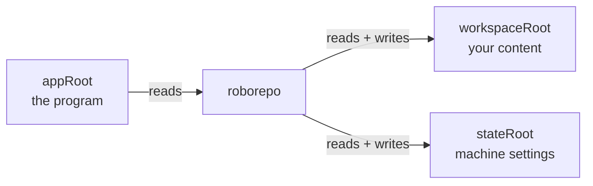
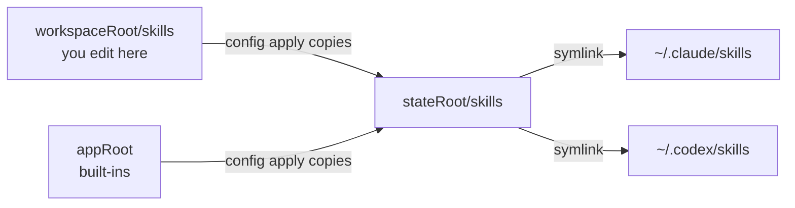
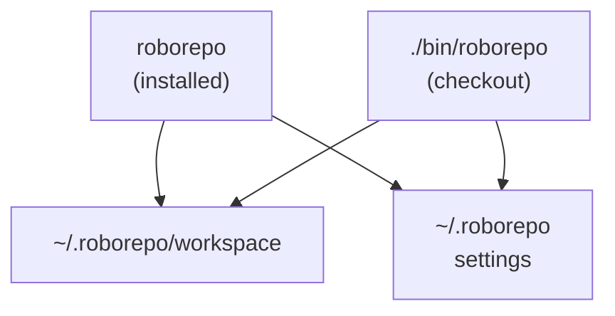
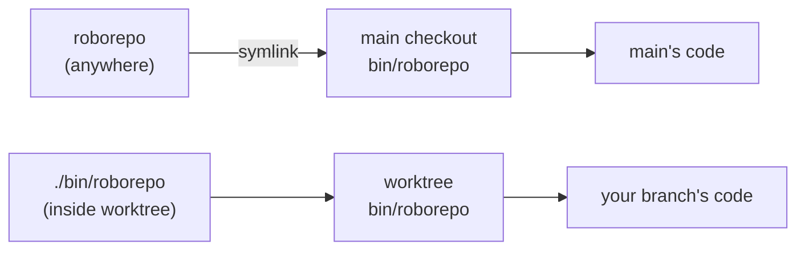
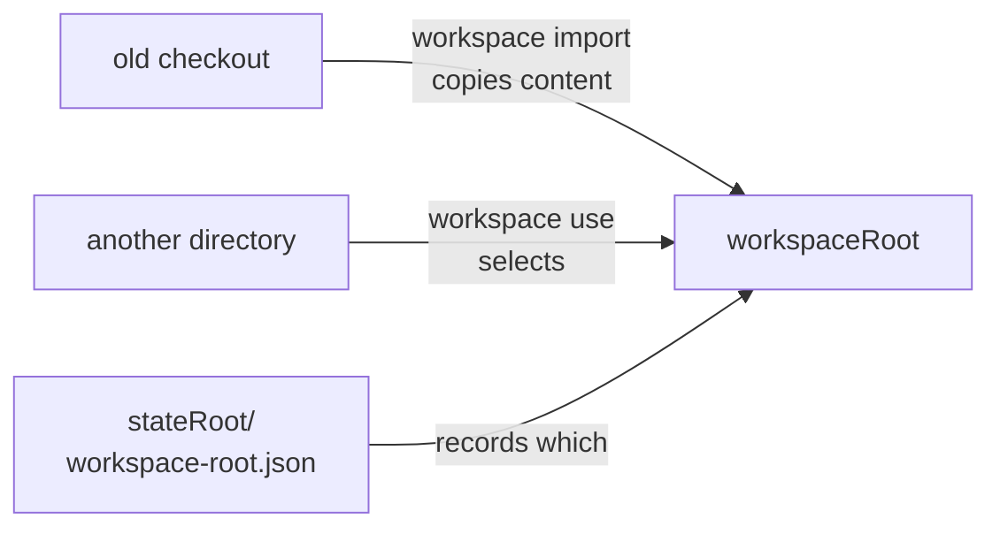

# Application, Workspace, and State Roots

## Purpose

RoboRepo keeps three directories apart: the program, your custom content, and this machine's
settings. Knowing which is which tells you what a command reads, what it writes, what survives a
reinstall, and what to carry to a new machine.

## Concept model

| Root | Holds | Owner | Survives reinstall |
| --- | --- | --- | --- |
| `appRoot` | Program: CLI, built-in skills, manifests, portal | RoboRepo | No — replaced |
| `workspaceRoot` | Your skills, commands, MCP servers, package configs, overrides | You | Yes |
| `stateRoot` | This machine's settings: enabled packages, install record, package assets | Machine | Yes, but rebuildable |

The split exists so an upgrade can replace the program without touching your content.

Two terms recur below:

| Term | Meaning |
| --- | --- |
| Package mode | Running from an installed tarball; `appRoot` is read-only |
| Development mode | Running from a Git checkout; `appRoot` is the checkout |



`appRoot` is immutable at runtime. `setup` and `config apply` leave it byte-identical; they write
only into `workspaceRoot` and `stateRoot`.

## Happy path

Installing and writing your first custom skill:

1. Install the package. `appRoot` is now the npm directory.
2. Run `roborepo setup`. Creates `~/.roborepo` (`stateRoot`) and `~/.roborepo/workspace`
   (`workspaceRoot`).
3. Write a skill to `~/.roborepo/workspace/skills/<name>/SKILL.md`.
4. Run `roborepo config apply`. Reads built-ins from `appRoot` plus your skill from
   `workspaceRoot`, copies the result into `<stateRoot>/skills`, and links it into your harness
   homes.
5. Upgrade later. `appRoot` is replaced; steps 2–3 output is untouched.

Authoring and applying are separate: `workspaceRoot` is where you edit, `<stateRoot>/skills` is what
your agent actually loads.



## Where each root resolves

```sh
roborepo version        # prints mode and all three roots
roborepo workspace status
```

Resolution order, highest precedence first (`scripts/cli/roots.mjs`):

| Root | Override | Otherwise |
| --- | --- | --- |
| `appRoot` | `ROBOREPO_APP_ROOT` | Directory containing the running CLI |
| `stateRoot` | `ROBOREPO_STATE_ROOT`, then `ROBOREPO_STATE_DIR` | `~/.roborepo` |
| `workspaceRoot` | `ROBOREPO_WORKSPACE_ROOT`, then the `workspace use` pointer | `<stateRoot>/workspace` |

Mode is detected by looking for `.git` or `local/skills` in `appRoot`. `ROBOREPO_MODE=package` or
`development` forces it.

## Directory contents

```text
~/.roborepo/                 stateRoot
├── config-state/            per-harness applied config
├── install-state.json       which install last wrote to your home dir
├── presets/                 onboarding answers
├── runtime/                 assets installed by enabled packages, per package id
├── skills/                  applied skills, copied here and linked into harness homes
└── workspace/               workspaceRoot (package mode)
    ├── skills/
    ├── commands/
    ├── mcp/servers.json
    ├── packages/
    ├── overrides/
    └── workspace.json       marks the directory as a workspace
```

## Two entry points, two modes

A machine used for both daily work and RoboRepo development has two copies of the program.

| Invocation | Mode | `appRoot` | `workspaceRoot` |
| --- | --- | --- | --- |
| `roborepo` | package | npm install dir | `~/.roborepo/workspace` |
| `./bin/roborepo` | development | the checkout | `~/.roborepo/workspace` |

Only `appRoot` differs. Both entry points resolve the same `workspaceRoot` and `stateRoot`, so one
machine has one workspace and one set of settings no matter which copy runs.



```console
$ cd <checkout> && ./bin/roborepo workspace status
mode: development
appRoot: <checkout>
workspaceRoot: ~/.roborepo/workspace
stateRoot: ~/.roborepo
workspace.json: ~/.roborepo/workspace/workspace.json
```

Mode still controls what a command may write. `appRoot` is writable in a development checkout, so
built-in source edits and `skill new` for a built-in skill require one; in package mode those are
refused. Personal workspace content is unaffected either way.

This assumes `roborepo` resolves to an installed package. It can instead be a symlink into a
checkout, in which case it runs in development mode too — see
[Which code a command actually runs](#which-code-a-command-actually-runs).

## Which code a command actually runs

`bin/roborepo` resolves its own real path, walks up one directory, and executes that copy's CLI. The
command name does not follow your working directory — the location of the executable decides which
code runs.

This matters when a global `roborepo` is a symlink into a checkout rather than an installed package:

```sh
$ ls -l "$(command -v roborepo)"
~/.local/bin/roborepo -> <checkout>/bin/roborepo
```

Every `roborepo` invocation then runs that checkout's code, from anywhere on the machine. Inside a
Git worktree the two entry points diverge:

| Invoked from a worktree | Runs the code in |
| --- | --- |
| `roborepo` | The checkout the symlink points at — **not** the worktree |
| `./bin/roborepo` | The worktree |



So testing a branch requires `./bin/roborepo` from inside that worktree. Typing `roborepo` there
silently exercises the other checkout. This applies to the portal too: the web UI is served by
whichever CLI process started it, so `roborepo web` from a worktree serves the symlinked checkout's
portal code, not the branch's.

```sh
command -v roborepo   # which file the name resolves to
type -a roborepo      # every match, to spot shadowing
roborepo version      # appRoot confirms which copy actually ran
```

`roborepo version` is the reliable check — its `appRoot` line names the code that ran.

## Moving to a different workspace

`workspaceRoot` is relocatable — useful for keeping custom content in a synced or version-controlled
directory.

```sh
roborepo workspace use ~/Dropbox/roborepo-workspace   # create/select, records pointer
roborepo workspace status                             # confirm
roborepo workspace validate                           # check for conflicts
```

The pointer is stored in `<stateRoot>/workspace-root.json` and reused while `stateRoot` stays put.
`ROBOREPO_WORKSPACE_ROOT` overrides it per shell without changing the recorded choice.

To pull content out of an older checkout or pre-workspace layout:

```sh
roborepo workspace import <old-checkout> --dry-run
roborepo workspace import <old-checkout>
```

Import reads `globals/agents/skills`, `globals/commands`, `globals/packages`, and the MCP inventory
from the source, then prints what it copied.



## Required rules

- Never write to `appRoot` at runtime; it is replaced on upgrade.
- A custom skill or command may not shadow a built-in one — `workspace validate` rejects it.
  Built-in *packages* are the exception: they can be replaced with a typed `replace` entry in
  `overrides/resources.json`.
- Moving `stateRoot` orphans the workspace pointer; re-run `workspace use`.

## Edge cases

**Upgrading the package.** The npm directory is version-specific, so harness symlinks pointing at
the old one go stale. `install-state.json` records the previous install root so `repair` and
`uninstall` can reclaim those links. Its value is expected to be out of date — that is what makes
reclaim possible.

```sh
roborepo repair
```

**Shared workspace, two machines.** `stateRoot` is machine-local. Point both machines at one synced
`workspaceRoot`, but let each build its own `stateRoot` rather than copying it, or you import stale
install records and absolute paths.

**A stale `roborepo` on `PATH`.** A leftover development symlink can shadow the installed command.

```sh
command -v roborepo
type -a roborepo
```

## Glossary

| Term | Meaning |
| --- | --- |
| Built-in | Content shipped in `appRoot`. Skills and commands cannot be shadowed; packages can be replaced via a typed override |
| Workspace pointer | `<stateRoot>/workspace-root.json`, recording the selected workspace |
| Override | An entry in `workspaceRoot/overrides/resources.json` that replaces a built-in resource |
