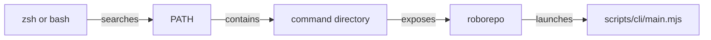
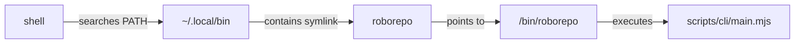
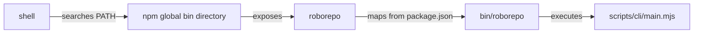

# How the `roborepo` Command Gets Onto `PATH`

## Purpose

RoboRepo can expose the `roborepo` command in two different ways:

- a repo-checkout install manages the command and shell `PATH` itself
- a global npm install lets npm manage the command

This reference explains which files are changed, where the executable lives, and how to tell which installation is currently active.

The shell does not receive a special `roborepo` namespace. It finds an executable named `roborepo` by searching the directories listed in `PATH`.

## Concept Model



There are two command-exposure paths:

| Install method | Command owner | Shell profile modified by RoboRepo? |
| --- | --- | --- |
| Repo checkout | RoboRepo installer | Yes |
| `npm install -g codethings-roborepo-alpha` | npm | No |

## Repo-Checkout Install

Running:

```sh
./scripts/install/main.sh
```

eventually runs:

```text
scripts/install/install-global-commands.sh
```

unless RoboRepo is running in package mode.

### Command symlink

The installer creates:

```text
~/.local/bin/roborepo
```

as a symbolic link to:

```text
<checkout>/bin/roborepo
```

The resulting command path is:



`bin/roborepo` is a Bash wrapper. It resolves its real location, finds the repository root, verifies that `node` is available, and executes:

```text
scripts/cli/main.mjs
```

while preserving the caller's current working directory.

### `PATH` insertion

The installer ensures the following exact line exists in the selected shell profile:

```sh
export PATH="${HOME}/.local/bin:${PATH}"
```

For zsh on macOS, the selected profile is:

```text
~/.zshrc
```

The installer appends:

```sh
# Harness config global commands
export PATH="${HOME}/.local/bin:${PATH}"
```

It does not append the line again when the exact `PATH` entry is already present.

Before modifying the profile, the installer creates a backup under its RoboRepo backup directory.

### Bash on macOS

For Bash, the installer chooses the profile that a new shell is expected to load:

1. `~/.bash_profile` when it already exists
2. otherwise `~/.bashrc` when it already exists
3. otherwise `~/.bash_profile`

The profile can also be selected explicitly with `ROBOREPO_SHELL_PROFILE`.

### Related shell-snippet installer

`scripts/install/install-shell-snippets.sh` is separate from command exposure.

It may add managed `source` lines to `~/.zshrc` for shell helpers declared by RoboRepo packages, but it is not what makes the `roborepo` command available on `PATH`.

## Global npm Install

Running:

```sh
npm install -g codethings-roborepo-alpha
```

uses the package's `bin` declaration:

```json
{
  "bin": {
    "roborepo": "bin/roborepo"
  }
}
```

npm creates the global `roborepo` executable in the global npm binary directory.

RoboRepo deliberately does not create `~/.local/bin/roborepo` or modify a shell profile in package mode. `scripts/install/main.sh` skips those steps because npm owns command exposure.

The npm path is therefore:



The npm global binary directory must already be reachable through the user's existing `PATH`.

## Happy Path

### Repo checkout

1. Run `./scripts/install/main.sh`.
2. RoboRepo creates `~/.local/bin` if necessary.
3. RoboRepo links `~/.local/bin/roborepo` to `<checkout>/bin/roborepo`.
4. RoboRepo adds `~/.local/bin` to the selected shell profile if necessary.
5. Open a new shell, or reload the profile.
6. The shell resolves `roborepo` through `~/.local/bin`.

### npm

1. Run `npm install -g codethings-roborepo-alpha`.
2. npm exposes the package's `roborepo` binary in its global binary directory.
3. The existing shell `PATH` resolves that directory.
4. Running `roborepo` invokes the packaged `bin/roborepo`.

## Required Rules

- Repo-checkout installs own `~/.local/bin/roborepo` and the corresponding `PATH` insertion.
- Package-mode installs must leave command exposure to npm.
- The repo-checkout installer must not overwrite an unrelated existing `~/.local/bin/roborepo`.
- Re-running the installer must not duplicate the managed `PATH` line.
- `bin/roborepo` must resolve its own real location so the checkout symlink can work from any current directory.

## Verify the Active Command

Use:

```sh
command -v roborepo
```

Then inspect the resolved file:

```sh
ls -l "$(command -v roborepo)"
```

For a repo-checkout install, the expected command location is:

```text
~/.local/bin/roborepo
```

and that path should link to:

```text
<checkout>/bin/roborepo
```

For an npm install, `command -v roborepo` should instead resolve through the active npm installation's binary directory.

To check whether the repo-managed `PATH` entry is present:

```sh
grep -F 'export PATH="${HOME}/.local/bin:${PATH}"' ~/.zshrc
```

## Edge Cases

### Both install methods exist

A repo-checkout installation and a global npm installation can exist at the same time.

The shell uses whichever `roborepo` executable appears first in `PATH`.

Use `command -v roborepo` to determine which one currently wins.

### Existing unrelated command

If `~/.local/bin/roborepo` already exists and is not managed by the current or previously recorded RoboRepo checkout, the repo installer treats it as a conflict instead of replacing it.

A dangling symlink from an old RoboRepo checkout can be reclaimed and relinked.

### Checkout moved

Because `~/.local/bin/roborepo` points to the checkout, moving the repository can leave a dangling symlink.

Re-running the repo installer can reclaim the stale link and point it at the current checkout.

## Source References

The behavior described here is implemented in:

| File | Responsibility |
| --- | --- |
| `package.json` | Declares the npm `roborepo` binary |
| `bin/roborepo` | Shell wrapper that launches the Node CLI |
| `scripts/install/main.sh` | Chooses package mode vs. repo-managed shell setup |
| `scripts/install/install-global-commands.sh` | Creates the repo symlink and manages the shell `PATH` entry |
| `scripts/install/install-shell-snippets.sh` | Manages separate zsh helper `source` lines |
| `docs/user/guides/first-time-setup.md` | User-facing installation workflow |
