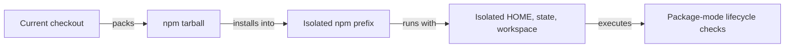

# RoboRepo Test Scenarios

## Purpose

Use this runbook when you know **what you want to test** but not which RoboRepo environment to use.

Start with the decision table. It tells you which entry point, state setup, and harness condition to use. Each scenario below then gives exact commands to start, verify, run, and reset the environment.

This document chooses the environment. For the repository's broader test suite and publish matrix, see `docs/internal/testing.md`.

## Choose Your Test

| I want to test... | Use |
| --- | --- |
| Current checkout behavior | `./bin/roborepo` |
| Currently installed npm package | `roborepo` |
| Dev vs installed npm against the same user state | Alternate `./bin/roborepo` and `roborepo` |
| Fresh onboarding from the installed npm package | Isolated `ROBOREPO_STATE_ROOT` + `roborepo init` |
| Fresh onboarding from current checkout source | Isolated `ROBOREPO_STATE_ROOT` + `./bin/roborepo init` |
| Current checkout packaged like npm before publishing | `npm run test:package-install` |
| Clean-machine lifecycle with zero harnesses | `npm run test:clean-machine` |
| Harness discovery as tools appear | `roborepo harness refresh` between harness states |
| A transferable tested package for another Mac | `npm run prepare:new-mac-install -- --output-dir <dir>` |

## Before Any Manual Test

Identify which RoboRepo code and roots are active.

For the installed package:

```sh
roborepo version
```

For the current checkout:

```sh
./bin/roborepo version
```

The output should identify:

```text
mode: ...
appRoot: ...
workspaceRoot: ...
stateRoot: ...
```

Do not infer the active code path from the current directory. The bare `roborepo` command and `./bin/roborepo` can coexist and intentionally use different application roots.

## Scenario 1: Test Current Checkout Behavior

### When To Use

Use this when you changed RoboRepo source and want to exercise the current checkout directly.

### Start

From the repository root:

```sh
./bin/roborepo version
```

Verify that `mode` is `development` and `appRoot` points at the checkout.

Then run the command or portal behavior under test:

```sh
./bin/roborepo <command>
```

For the portal:

```sh
./bin/roborepo web
```

### Verify

Confirm the user-visible behavior you changed.

Use the smallest relevant automated check from `docs/internal/testing.md` before or alongside manual verification.

### Reset

No special reset is required if you intentionally used the normal shared `~/.roborepo` state.

If the test should not affect normal RoboRepo state, use Scenario 4 instead.

## Scenario 2: Test the Installed npm Package

### When To Use

Use this when you want to verify the package currently installed on the machine, independent of uncommitted or unpublished checkout changes.

### Start

```sh
roborepo version
```

Verify that `mode` is `package`.

Then run:

```sh
roborepo <command>
```

For the portal:

```sh
roborepo web
```

### Verify

Confirm that the behavior matches the installed package version and `appRoot` shown by `roborepo version`.

### Reset

No special reset is required unless the workflow mutates RoboRepo state and you need a fresh user. For that case, use Scenario 4.

## Scenario 3: Compare Development Against the Installed Package

### When To Use

Use this when you want to answer:

**Did current source change behavior while the user's RoboRepo state stayed the same?**

### Start

First verify both entry points:

```sh
./bin/roborepo version
roborepo version
```

Expected relationship:

```text
./bin/roborepo -> mode: development
roborepo       -> mode: package
```

Do not override `ROBOREPO_STATE_ROOT` for this comparison. Both entry points should intentionally see the same normal state.

### Run

Run the same behavior from development:

```sh
./bin/roborepo <command>
```

Then run the same behavior from the installed package:

```sh
roborepo <command>
```

For portal comparisons, stop the first server before starting the second on the same port.

### Verify

Compare the externally visible result:

- CLI output
- portal behavior
- generated config
- package state
- harness discovery
- other user-facing effects relevant to the change

### Reset

None. Shared state is intentional in this scenario.

If one side must not affect the other, use separate isolated state roots instead.

## Scenario 4: Test Fresh Onboarding

### When To Use

Use this when prior RoboRepo initialization, enabled packages, repository history, or workspace state must not influence the test.

This isolates **RoboRepo state**. It does not hide installed harness binaries or remove existing harness homes.

### Start: Installed Package

```sh
export ROBOREPO_STATE_ROOT=/tmp/roborepo-onboarding
rm -rf "$ROBOREPO_STATE_ROOT"

roborepo version
roborepo init
```

### Start: Current Checkout

```sh
export ROBOREPO_STATE_ROOT=/tmp/roborepo-onboarding
rm -rf "$ROBOREPO_STATE_ROOT"

./bin/roborepo version
./bin/roborepo init
```

### Verify

For the installed package:

```sh
roborepo workspace status
roborepo harness list
roborepo doctor
```

For development source:

```sh
./bin/roborepo workspace status
./bin/roborepo harness list
./bin/roborepo doctor
```

Confirm that `stateRoot` points at the disposable location.

### Reset

```sh
rm -rf "$ROBOREPO_STATE_ROOT"
unset ROBOREPO_STATE_ROOT
```

Repeat the start sequence for another first-run test.

## Scenario 5: Test Current Source as an npm Package

### When To Use

Use this after changes that may behave differently once RoboRepo is packed and installed.

Typical examples:

- package contents
- package-mode path resolution
- initialization
- install/uninstall lifecycle
- immutable `appRoot` expectations
- behavior that works from a Git checkout but may fail from an npm prefix

### Run

```sh
npm run test:package-install
```

### What It Does



The test uses the current checkout, not the registry-published version.

### Verify

Success is the command exiting cleanly and reporting the package-install smoke as passing.

### Reset

None. The test uses a temporary sandbox and removes it when complete.

## Scenario 6: Test a Clean Machine With No Harnesses

### When To Use

Use this when the question depends on RoboRepo starting without Claude, Codex, or Gemini already available.

Examples:

- zero-harness onboarding
- uninstall behavior on a pristine machine
- package installation without ambient development state
- harness-count transition regressions

### Run

```sh
npm run test:clean-machine
```

### What It Tests

```text
zero harnesses
installed but never launched
launched once
multiple registered providers
```

It also exercises install, initialization, doctor, and uninstall behavior.

### Verify

The command should report the clean-machine container checks as passing.

### Reset

None. The environment is disposable.

### Important Boundary

A fresh `ROBOREPO_STATE_ROOT` is not equivalent to this scenario.

Fresh RoboRepo state does not change whether `claude`, `codex`, or other harness executables exist on the host machine.

## Scenario 7: Test Harness Discovery as a Harness Appears

### When To Use

Use this when changing or validating harness discovery behavior.

| Stage | Executable | Native harness home/config |
| --- | --- | --- |
| Zero | absent | absent |
| Installed, never launched | present | absent |
| Launched once | present | present |
| Multiple harnesses | multiple present | multiple homes |

### Steps

1. Record the starting state.

   ```sh
   roborepo harness refresh
   roborepo harness list
   roborepo doctor
   ```

2. Change one harness condition.

3. Refresh discovery.

   ```sh
   roborepo harness refresh
   ```

4. Inspect the result.

   ```sh
   roborepo harness list
   roborepo doctor
   ```

5. Record what changed between stages.

### Verify

Verify which providers RoboRepo reports and whether subsequent configuration commands succeed.

For deterministic automated coverage of the full harness-count matrix:

```sh
npm run test:clean-machine
```

### Reset

Restore the machine or disposable harness setup to the desired starting condition before repeating the stage.

Do not use state deletion alone as a substitute for changing harness availability.

## Scenario 8: Prepare a Tested Package for Another Mac

### When To Use

Use this when you need a specific package artifact that has already passed the repository's package smoke checks and can be transferred to another Mac.

### Start

From a clean checkout:

```sh
npm run prepare:new-mac-install -- --output-dir <dir>
```

### Verify

The output directory should contain the retained npm tarball and its verification metadata.

Follow `docs/user/guides/install-workflows.md` for transfer, checksum verification, installation, and first-run steps on the target Mac.

### Reset

Remove the retained artifact directory when it is no longer needed.

## Which State Should I Use?

| Goal | State choice |
| --- | --- |
| Normal development | Existing `~/.roborepo` |
| Compare dev and installed package | Same existing `~/.roborepo` |
| Test a first-time user | Fresh `ROBOREPO_STATE_ROOT` |
| Keep two manual tests independent | Different `ROBOREPO_STATE_ROOT` values |
| Test zero harnesses deterministically | Clean-machine test, not state isolation |

## Common Mistakes

### I ran `roborepo` from the checkout and assumed it used checkout source

Run:

```sh
roborepo version
./bin/roborepo version
```

### I cleared RoboRepo state and expected Claude or Codex to disappear

`ROBOREPO_STATE_ROOT` isolates RoboRepo's own state. Harness executables and harness-native homes are separate machine state.

Use the clean-machine test when harness absence is part of the requirement.

### I used the published npm package when I meant to test unpublished source

Use:

```sh
./bin/roborepo
```

for direct source behavior, or:

```sh
npm run test:package-install
```

to test the current checkout as a package artifact.

### I manually recreated an npm package sandbox

Prefer:

```sh
npm run test:package-install
```

The repository already isolates prefix, home, state, and workspace for this purpose.

## Verification Reference

| Question | Verification |
| --- | --- |
| Did current checkout behavior work? | Relevant targeted test + `./bin/roborepo <command>` when live verification matters |
| Does package mode work from current source? | `npm run test:package-install` |
| Does clean-machine lifecycle work? | `npm run test:clean-machine` |
| Does the real installed machine look healthy? | `roborepo doctor --installed` |
| Did harness discovery change correctly? | `roborepo harness refresh` + `roborepo harness list` |
| Is a transferable package artifact valid? | `npm run prepare:new-mac-install -- --output-dir <dir>` |
| Is the repository ready to publish? | Follow `docs/internal/testing.md` |

## Related Documentation

| Need | Document |
| --- | --- |
| Choose and run automated tests | `docs/internal/testing.md` |
| Install, update, uninstall, and new-Mac package workflow | `docs/user/guides/install-workflows.md` |
| Understand root resolution | `docs/user/reference/architecture.md` |
| Look up CLI commands | `docs/user/reference/roborepo-cli.md` |
| Navigate maintainer documentation | `docs/internal/docs-map.md` |
