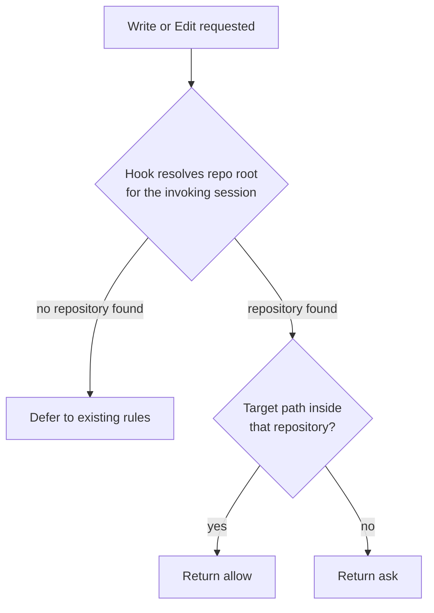

# Repo-Scoped Write Permissions

## Summary

File write permissions are scoped to a fixed directory tree that is hardcoded in a repository-tracked
manifest. Replace it with a scope that means "the repository the agent is working in", so that writes
inside the current repository proceed without prompting and writes outside it prompt.

Two separate problems sit behind this. The scope path is one machine's layout shipped as everyone's
default, and even on that machine the scope is broader than intended — it spans every repository in
the tree rather than the one in use.

## Context

Permission scope lives in `manifests/inventory/agent-permissions.json` as two pairs of behaviors.
Each pair splits one question into two:

| Behavior | Question it answers |
| --- | --- |
| `read-files` / `write-files` | Whether the tool may be used at all, across every path |
| `read-scope` / `write-scope` | Where it may be used without prompting |

Both must pass. The gate exists separately because not every harness can express path scoping, and
`write-files` deliberately emits no unscoped rule of its own — a bare `Write` or `Edit` entry
out-ranks every path-scoped rule and silently defeats the scoping it exists to enable.

## Goals

- A write scope that means the repository currently being worked in, on any contributor's machine.
- Writes outside the current repository prompt rather than proceeding silently.
- No contributor's absolute home path in any tracked file, including generated artifacts.
- Explicit, verified behavior for each of the three harnesses rather than a Claude-only fix.

## Non-goals

- Changing the gate/scope split. The two-behavior model stays *for this plan*; whether the pair
  should collapse into one user-facing row is [[permissions-ui-revamp]]'s decision, not this one's.
- Changing read scope semantics. Reads outside the repository are not the problem this plan solves.
- Per-project permission profiles. Permissions remain global machine state.

## Current state

`write-scope` and `read-scope` both carry `~/projects/**` as their first path. That value is a
personal directory layout committed to the repository.

Scope paths are expanded at render time by `expandHome()` in
`scripts/harnesses/permissions-render.mjs`, then written into static harness configuration. The
generated artifact `generated/claude/settings.json` is tracked in Git and contains the expanded
absolute path, so one contributor's home directory is committed to the repository:

```json
"Write(//Users/<user>/projects/**)",
"Edit(//Users/<user>/projects/**)"
```

Three consequences follow:

- A contributor whose repositories live anywhere other than `~/projects` gets a write scope that
  matches nothing. Every write prompts, with no visible cause.
- Within that tree the scope is too broad. An agent working in one repository can write into a
  sibling repository without prompting, because both sit under `~/projects`.
- Expansion happens once, at install. Nothing re-resolves the path per session.

The three harnesses express scope differently, and only one of them consumes the path list at all:

| Harness | Scope mechanism | Consumes `paths` |
| --- | --- | --- |
| Claude | `Write(//path/**)` rules in `settings.json` | Yes |
| Codex | `sandbox_mode` derived from the `write-files` gate | No |
| Gemini | Tool-name matching in the Policy Engine | No |

`codexSandboxMode()` in `scripts/harnesses/permissions-render.mjs` maps the gate to
`workspace-write` or `read-only` — a single coarse mode with no path list. `policy-toml.mjs` skips
`tools-scoped` behaviors entirely, on the stated grounds that rendering a path-scoped allow as an
unscoped allow would be strictly more permissive than intended.

## Proposed design

Resolve the boundary at tool-call time in a `PreToolUse` hook instead of at render time in a path
glob.



The manifest keeps a coarse allowlist for locations that are correct regardless of repository —
agent scratch directories — and drops the personal tree entirely. The repository boundary itself is
never written as a path.

Per harness:

- **Claude** — implement the hook; remove `~/projects/**` from `write-scope`.
- **Codex** — `sandbox_mode: workspace-write` already scopes writes to the workspace. Verify what
  Codex treats as the workspace root and whether that matches the repository boundary; if it does,
  no hook is needed and the existing mode is the correct expression.
- **Gemini** — the Policy Engine has no path predicate. Decide whether the gate alone is acceptable
  or the harness is documented as unable to express repository scoping.

### Why the boundary cannot stay declarative

A path glob cannot express "the current repository", which is why the boundary moves into a hook.

Claude Code's permission rules do not expand variables — paths are literal strings, so a rule
referencing a project-directory variable never resolves at runtime. The supported anchors all
resolve to fixed locations:

| Anchor | Resolves to |
| --- | --- |
| `//path` | Absolute path from filesystem root |
| `~/path` | Home directory |
| `/path` | The directory of the settings file that defines the rule |
| `path` or `./path` | Current working directory |

The `/path` form looks project-relative and is not: in a user-level settings file it resolves
relative to that settings file's own directory. RoboRepo writes user-level settings, so this anchor
would point somewhere unrelated to the user's work.

There is also no "allow inside X, deny everything else" primitive. Rules are positive globs
evaluated deny, then ask, then allow, defaulting to a prompt when nothing matches.

## What shipped

The runtime half of this plan is merged. The `repo-scope` behavior kind now carries the boundary as
platform intent, and each provider enforces it in its own mechanism — the platform renders no path
for it at all.

- [x] Prototype a `PreToolUse` hook resolving the repository root for the invoking session, and
      measure its added latency per `Write`/`Edit` call.
      Shipped as `globals/harnesses/claude/hooks/repo-write-scope.mjs`. The root is found by walking
      up from `cwd` for a `.git` entry, in-process.
- [x] Decide the behavior when no repository is found: defer to existing rules, or prompt.
      Defers. Every failure path — unparseable input, missing `file_path`, no repository, unreadable
      manifest — exits silently so the static rules decide. A hook that cannot determine the answer
      must not manufacture one in either direction.
- [x] Decide the behavior for a path inside a nested worktree or submodule.
      A worktree resolves to itself, not to its primary checkout: `.git` is a file there rather than
      a directory and either marks a root. Writing from a worktree into its primary checkout is an
      outside-repository write.
- [x] Add the platform-side behavior and keep the boundary out of the shared renderer.
      `repo-write-boundary` (`kind: "repo-scope"`, bucket `ask`) states the intent;
      `scripts/harnesses/permissions-render.mjs` skips the kind rather than flattening it into a
      path glob.

### What the post-merge review changed here

Two things moved under this plan without closing it (see [[infra-post-merge-integration-review]]).

The tracked artifact no longer contains a *contributor's* home. `83c18ce` replaced it with a
placeholder (`/Users/you`), which fixed the fake-`HOME` test drift but created a worse bug: that
artifact is also the install baseline, and the root-config merge is additive, so every new install
inherited a rule naming a directory that does not exist on that machine — permanently. Commit
`204a0dc` stops that by dropping foreign-home rules during the merge.

So the goal "no contributor's absolute home path in any tracked file" is now met only in the narrow
sense that the committed string is a fake name rather than a real one. The underlying defect this
plan targets is unchanged: `~/projects/**` is still in both scopes, still expands at render time,
and the tracked artifact still carries an expanded absolute path. Removing the path from the
manifest — this plan's actual fix — would make both the placeholder and the merge filter unnecessary.

`write-scope` also now renders `Edit` rules only. Claude matches path-scoped rules under
`Edit(path)`, which covers every file-editing tool including `Write`; the `Write(path)` rules this
plan's "Current state" section quotes were inert and are gone. The gate/scope table above is still
accurate; only the rendered verb changed.

### Measured latency

The hook's own work is ~0.09ms — the in-process root walk, against ~155ms to spawn
`git rev-parse --show-toplevel`. The walk is why its own share is negligible.

The cost that matters is Node process startup, ~127-165ms measured bare, putting the hook around
300ms per call. That is inherent to command hooks and shared with every other one; it is not
specific to this hook's logic. `roborepo-write-guard.mjs` already runs on the same `Write`/`Edit`
events, so merging the two would drop the added cost to roughly the walk itself.

`scripts/test/repo-write-scope-check.mjs` covers the decision table in 10 cases plus manifest-driven
bucket resolution, malformed-input safety, and a regression bound on the hook's own work.

## Implementation plan

- [ ] Verify what Codex treats as the workspace root under `sandbox_mode: workspace-write`, and
      whether it already matches the intended boundary. Requires a real Codex session; the current
      mapping in `codexSandboxMode()` is documented as the intent's expression but unverified
      against actual sandbox behavior.
- [ ] Give `scripts/harnesses/gemini/policy-toml.mjs` an explicit `repo-scope` case. It currently
      falls through `if (b.kind !== "commands") continue` and is dropped with no comment, unlike the
      `tools-scoped` skip immediately above it, which documents its reasoning. Whatever the decision,
      record it in code the way the neighbouring skips are.
- [ ] Remove `~/projects/**` from `write-scope` in `manifests/inventory/agent-permissions.json`.
      Still present, and `read-scope` carries it too — decide whether reads keep it or lose it.
- [ ] Regenerate `generated/claude/settings.json` and confirm no absolute home path remains. The
      tracked artifact still contains three expanded rules under `/Users/<user>/projects/**`.
- [ ] Add a test asserting no tracked file contains an expanded home directory in a permission rule.
      Partially covered from the other direction: `scripts/cli/permission-home-check.mjs` (wired into
      `roborepo doctor --installed`) fails when a LIVE config carries a path rule naming a home that
      is not this machine's. That catches the symptom on a user's machine; it does not assert the
      TRACKED artifact is home-free, which is what this item asks for and what still fails today.
- [ ] Update the permission scope section of `docs/user/reference/config-control-panel.md`. It still
      states that scope is resolved at render time into static config, which is no longer true for
      writes — the repository boundary is now decided per call.
- [ ] Merge the hook into `globals/system/hooks/claude/roborepo-write-guard.mjs` so `Write`/`Edit`
      pays one process startup rather than two. Before doing so, verify that Claude Code accepts
      both `permissionDecision` and `additionalContext` in a single `hookSpecificOutput` response —
      the scope hook returns the former and the guard the latter. If it does not, decide which wins
      and record why.

## Validation

- [x] A write inside the current repository proceeds without a prompt.
- [x] A write to a sibling repository under the same parent directory prompts.
- [x] A write to an agent scratch directory proceeds without a prompt.
- [ ] `rg` over tracked files finds no expanded home directory inside a permission rule.
- [ ] `roborepo doctor --installed` passes, including the generated-permissions drift check.
- [ ] The behavior above is confirmed on each harness that ships a write scope, not on Claude alone.

## Verification

`scripts/test/repo-write-scope-check.mjs` passes against merged main. It builds real checkouts on
disk — a repository, a sibling repository, and a linked worktree — and runs the hook as a
subprocess, asserting the decision for each.

The three checked validation criteria above are covered there directly. The unchecked ones are not
satisfied: `~/projects/**` is still in the manifest and its expanded form is still in
`generated/claude/settings.json`, so the `rg` criterion fails by inspection today.

Not verified: Codex and Gemini behavior. Codex's mapping is reasoned from its documented sandbox
model rather than observed in a session, and Gemini has no `repo-scope` case at all. The claim that
this plan's behavior holds on any harness other than Claude is currently unsupported.

## Risks

- **Hook latency.** The hook runs on every `Write` and `Edit`. Resolving a repository root per call
  adds a process spawn unless the result is cached for the session. Measure before committing to the
  design.
- **Hook failure mode.** If the hook errors or is missing, writes fall back to whatever the static
  rules allow. That fallback must be no more permissive than the intended scope.
- **Loss of declarative auditability.** Today the write scope is readable in `settings.json`. Moving
  the boundary into script logic makes it harder to inspect, which raises the value of the tests
  above.
- **Harness divergence.** Three harnesses with three mechanisms may not reach identical behavior.
  Where they cannot, the difference should be documented rather than left implicit.

## Resolved questions

- **Worktrees resolve to themselves.** Covered by two test cases: a worktree writing inside itself
  allows, and a worktree writing into its primary checkout asks.
- **Writes outside the repository prompt rather than being denied.** The bucket is not the hook's to
  assume — it reads `repo-write-boundary` from the manifest and layers personal overrides, so the
  portal control governs it. Setting it to `allow` switches the boundary off, and the hook then emits
  nothing rather than an allow that would out-rank the static rules.
- **Scratch directories are recognized by the hook, not left to the manifest allowlist alone.** The
  repository check runs first, before the scratch exemption, because a checkout can live under a
  scratch path — cloning into `/tmp` is normal. Testing scratch first would return "allowed" for
  every path in such a clone, including a write into a sibling clone beside it. A target with its own
  repository root is therefore never treated as scratch.

## Open questions

- Is there a supported way to inspect a Codex workspace root, or must it be determined empirically?
- Does `read-scope` keep `~/projects/**` once `write-scope` loses it? Reads outside the repository
  were explicitly a non-goal, but leaving the personal path in the manifest keeps a contributor's
  home directory in a tracked artifact, which is a goal.
