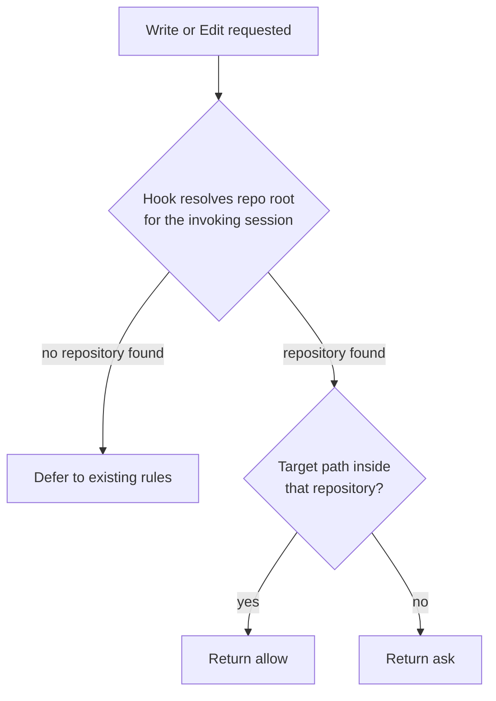

# Repo-Scoped Write Permissions

## Summary

File write permissions are scoped to a fixed directory tree that is hardcoded in a repository-tracked
manifest. Replace it with a scope that means "the repository the agent is working in", so that writes
inside the current repository proceed without prompting and writes outside it prompt.

Two separate problems sit behind this. The scope path is one machine's layout shipped as everyone's
default, and even on that machine the scope is broader than intended — it spans every repository in
the tree rather than the one in use.

The plan has since grown a read half and a credential denylist. Removing the personal path took the
quiet zone for *reads* with it, which forced a decision the original scope deliberately deferred;
and neither the boundary nor the scope list can protect a `.env` sitting inside the checkout, which
only a deny rule reaches.

## Context

Permission scope lives in `manifests/inventory/agent-permissions.json` as two pairs of behaviors.
Each pair splits one question into two:

| Behavior | Question it answers |
| --- | --- |
| `read-files` / `write-files` | Whether the tool may be used at all, across every path |
| `read-scope` / `write-scope` | Where it may be used without prompting |

Both must pass. The gate exists separately because not every harness can express path scoping, and
`write-files` deliberately emits no unscoped rule of its own — a bare `Write` or `Edit` entry
out-ranks every path-scoped rule and silently defeats the scoping it exists to enable.

## Goals

- A write scope that means the repository currently being worked in, on any contributor's machine.
- Writes outside the current repository prompt rather than proceeding silently.
- No contributor's absolute home path in any tracked permission rule, including generated artifacts.
  Secret denies stay home-relative with Claude's `~/...` anchor.
- Credential patterns covered by the `read-secrets` denylist are unreadable everywhere, including
  inside the current repository. Broader unknown-sensitive files are protected by the read/write
  scope boundary, not by a universal credential detector.
- Reads quiet across the repository family; writes still bounded to the checkout in use.
- Explicit, verified behavior for each of the three harnesses rather than a Claude-only fix.

## Non-goals

- Changing the gate/scope split. The two-behavior model stays *for this plan*; whether the pair
  should collapse into one user-facing row is [[permissions-ui-revamp]]'s decision, not this one's.
- Per-project permission profiles. Permissions remain global machine state.

Read scope **was** a non-goal and is no longer. Removing `~/projects/**` to satisfy the
no-home-paths goal took the quiet zone for reads with it, so reads had to be re-answered rather
than left to prompt on every file. See "Read scope decision" below.

## Original state

`write-scope` and `read-scope` both carry `~/projects/**` as their first path. That value is a
personal directory layout committed to the repository.

Scope paths are expanded at render time by `expandHome()` in
`scripts/harnesses/permissions-render.mjs`, then written into static harness configuration. The
generated artifact `generated/claude/settings.json` is tracked in Git and contains the expanded
absolute path, so one contributor's home directory is committed to the repository:

```json
"Write(//Users/<user>/projects/**)",
"Edit(//Users/<user>/projects/**)"
```

Three consequences follow:

- A contributor whose repositories live anywhere other than `~/projects` gets a write scope that
  matches nothing. Every write prompts, with no visible cause.
- Within that tree the scope is too broad. An agent working in one repository can write into a
  sibling repository without prompting, because both sit under `~/projects`.
- Expansion happens once, at install. Nothing re-resolves the path per session.

The three harnesses express scope differently, and only one of them consumes the path list at all:

| Harness | Scope mechanism | Consumes `paths` |
| --- | --- | --- |
| Claude | `Write(//path/**)` rules in `settings.json` | Yes |
| Codex | `roborepo-workspace` permission profile derived from the `write-files` gate | Uses profile-defined workspace roots |
| Gemini | Tool-name matching in the Policy Engine | No |

`codexSandboxMode()` in `scripts/harnesses/permissions-render.mjs` maps the gate to either a
write-capable permission profile or `:read-only`. The write profile extends `:workspace`, includes
the runtime workspace root that Codex supplies, and adds profile-defined roots loaded from
`docs/plans/plans-config.json` so the configured `worktreeRoot` covers this repo's managed
worktrees at `<worktreeRoot>/<repo-name>`, without granting every repo under the worktree parent.
Live permission rewrites derive the repo name from the current repo's own plan-config location, so
package-mode `roborepo update` and `roborepo config apply` can materialize
`~/.worktrees/<current-repo-name>` for any repo that carries that config. Codex still receives
concrete `workspace_roots`; the dynamic part is the Codex provider's render context, not Codex's
profile syntax.
`policy-toml.mjs` skips `tools-scoped` behaviors entirely, on the stated grounds that rendering a
path-scoped allow as an unscoped allow would be strictly more permissive than intended.

## Current state

The repo-scoped Claude implementation and deterministic checks are now in the working tree.
`~/projects/**` is gone from read/write scope, the repository boundary is represented as
`repo-scope`, and the generated Claude artifact no longer embeds the packer's home directory in
either allow or deny rules. Credential denies render as `Read(~/.ssh/**)` and related home-relative
anchors.

The deterministic pre-browser chain now catches three failure classes:

| Check | Failure caught |
| --- | --- |
| `repo-write-scope-check` | Hook decision table, worktree family reads, outside-repo prompts |
| `core-hook-wiring-check` | Hook matcher or generated settings drift |
| `test:package-install` | Packed-package drift under an isolated `HOME` |

The clean-machine Docker runner has been added as the next layer. It skips locally when Docker is
unavailable, runs strictly in CI on Ubuntu, and has passed locally against Docker Desktop. Its
colliding-prefix case caught an uninstall false positive where the npm-owned
`$HOME/.local/bin/roborepo` symlink was reported as managed state before npm removed it.

## Proposed design

Resolve the boundary at tool-call time in a `PreToolUse` hook instead of at render time in a path
glob.



The manifest keeps a coarse allowlist for locations that are correct regardless of repository —
agent scratch directories — and drops the personal tree entirely. The repository boundary itself is
never written as a path.

Per harness:

- **Claude** — implement the hook; remove `~/projects/**` from `write-scope`.
- **Codex** — `default_permissions: roborepo-workspace` scopes writes to the runtime workspace root
  plus this repo's profile-defined worktree root from `docs/plans/plans-config.json`. No hook is
  needed for the common worktree path because `<worktreeRoot>/<repo-name>` covers the repo's
  managed worktrees.
- **Gemini** — the Policy Engine has no path predicate. Decide whether the gate alone is acceptable
  or the harness is documented as unable to express repository scoping.

### Why the boundary cannot stay declarative

A path glob cannot express "the current repository", which is why the boundary moves into a hook.

Claude Code's permission rules do not expand variables — paths are literal strings, so a rule
referencing a project-directory variable never resolves at runtime. The supported anchors all
resolve to fixed locations:

| Anchor | Resolves to |
| --- | --- |
| `//path` | Absolute path from filesystem root |
| `~/path` | Home directory |
| `/path` | The directory of the settings file that defines the rule |
| `path` or `./path` | Current working directory |

The `/path` form looks project-relative and is not: in a user-level settings file it resolves
relative to that settings file's own directory. RoboRepo writes user-level settings, so this anchor
would point somewhere unrelated to the user's work.

There is also no "allow inside X, deny everything else" primitive. Rules are positive globs
evaluated deny, then ask, then allow, defaulting to a prompt when nothing matches.

## What shipped

The runtime half of this plan is merged. The `repo-scope` behavior kind now carries the boundary as
platform intent, and each provider enforces it in its own mechanism — the platform renders no path
for it at all.

- [x] Prototype a `PreToolUse` hook resolving the repository root for the invoking session, and
      measure its added latency per `Write`/`Edit` call.
      Shipped as `globals/harnesses/claude/hooks/repo-write-scope.mjs`. The root is found by walking
      up from `cwd` for a `.git` entry, in-process.
- [x] Decide the behavior when no repository is found: defer to existing rules, or prompt.
      Defers. Every failure path — unparseable input, missing `file_path`, no repository, unreadable
      manifest — exits silently so the static rules decide. A hook that cannot determine the answer
      must not manufacture one in either direction.
- [x] Decide the behavior for a path inside a nested worktree or submodule.
      A worktree resolves to itself, not to its primary checkout: `.git` is a file there rather than
      a directory and either marks a root. Writing from a worktree into its primary checkout is an
      outside-repository write.
- [x] Add the platform-side behavior and keep the boundary out of the shared renderer.
      `repo-write-boundary` (`kind: "repo-scope"`, bucket `ask`) states the intent;
      `scripts/harnesses/permissions-render.mjs` skips the kind rather than flattening it into a
      path glob.

### What the post-merge review changed here

Two things moved under this plan without closing it (see [[infra-post-merge-integration-review]]).

The tracked artifact no longer contains a *contributor's* home. `83c18ce` replaced it with a
placeholder (`/Users/you`), which fixed the fake-`HOME` test drift but created a worse bug: that
artifact is also the install baseline, and the root-config merge is additive, so every new install
inherited a rule naming a directory that does not exist on that machine — permanently. Commit
`204a0dc` stops that by dropping foreign-home rules during the merge.

So the goal "no contributor's absolute home path in any tracked file" is now met only in the narrow
sense that the committed string is a fake name rather than a real one. The underlying defect this
plan targets is unchanged: `~/projects/**` is still in both scopes, still expands at render time,
and the tracked artifact still carries an expanded absolute path. Removing the path from the
manifest — this plan's actual fix — would make both the placeholder and the merge filter unnecessary.

`write-scope` also now renders `Edit` rules only. Claude matches path-scoped rules under
`Edit(path)`, which covers every file-editing tool including `Write`; the `Write(path)` rules this
plan's "Current state" section quotes were inert and are gone. The gate/scope table above is still
accurate; only the rendered verb changed.

### Measured latency

The hook's own work is ~0.09ms — the in-process root walk, against ~155ms to spawn
`git rev-parse --show-toplevel`. The walk is why its own share is negligible.

The cost that matters is Node process startup, inherent to command hooks and shared with every
other one. End-to-end measurement of the real hook, 25 calls each:

| Path | Per call |
| --- | --- |
| `Read`, inside the worktree | ~83ms |
| `Read`, resolving the repository family | ~98ms |
| `Write`, inside the worktree | ~89ms |

Family resolution costs ~15ms, which is why it reads `.git` pointer files directly instead of
spawning `git`. The earlier ~300ms figure came from a bare-Node startup measurement rather than the
hook itself and overstated it by roughly 3x.

### Path comparison is realpath-based

Containment is a string comparison, so both sides must spell a path the same way — and they do not
by default. On macOS `os.tmpdir()` yields `/var/folders/...` while git records the resolved
`/private/var/folders/...` in its pointer files, because `/var` is a symlink. The same mismatch
appears for any checkout under a symlinked parent, which is not exotic.

Both sides are therefore resolved before comparison. Targets that do not exist yet — the normal case
for a `Write` creating a file, sometimes several directories deep — resolve to their nearest
existing ancestor with the missing segments re-appended.

`scripts/test/repo-write-scope-check.mjs` covers the decision table in 10 cases plus manifest-driven
bucket resolution, malformed-input safety, and a regression bound on the hook's own work.

## Read scope decision

Removing `~/projects/**` from `write-scope` lost nothing — the hook grants a strictly narrower
zone (the checkout in use, not every sibling under one tree). Removing it from `read-scope` was
different: nothing replaced it, because the hook matches `Write|Edit` only. Reads of ordinary
project files fell through to a prompt.

Three layers now answer file access, and they are independent — none substitutes for another:

| Layer | Question | Mechanism |
| --- | --- | --- |
| `read-secrets` | *What is it?* Credential material, denied anywhere including in-repo | Static deny rules |
| Repository boundary | *Where am I?* In the repo family, or outside it | `repo-scope`, per call |
| Scratch allowlist | Fixed dirs correct regardless of repo | Static allow rules |

An enumerated denylist catches known-sensitive files and cannot catch unknown ones — a tax
document, a client repo under NDA. That is why "deny secrets, then allow reads everywhere" was
rejected: it protects what was thought of and silently exposes the rest.

### Decisions

- **Reads span the repo family; writes do not.** Reading main from a worktree to compare against a
  branch is routine and harmless. Writing from a worktree into main is how one session clobbers
  another's work, and is rare precisely because isolation is the reason to branch. Reads resolve to
  the family and stay quiet; writes keep today's per-worktree boundary and prompt.
- **Deny, not ask, for credentials.** Prompting on `~/.ssh` trains approval reflex on the one
  category that must never be approved.
- **No read-scope mode setting.** A three-state control (`repo` / `everywhere` / `off`) was
  designed and rejected as unnecessary abstraction: one rule per operation is easier to hold in the
  head, and the second mode can be added if cross-tree reads become frequent.

### Repo family resolution

A linked worktree's `.git` is a file pointing at the primary checkout, so the family is readable
without a process spawn — the same property that makes the existing root walk cheap. Today
`repositoryRoot()` stops at the worktree, which stays correct for writes; reads need the walk to
continue to the common directory.

## Implementation plan

- [x] Move Codex from legacy `sandbox_mode: workspace-write` output to a `roborepo-workspace`
      permission profile, and load profile-defined workspace roots from `docs/plans/plans-config.json`
      so the configured `worktreeRoot` covers this repo's managed worktrees.
- [ ] Decide whether Codex should enforce the **read** family at all. It ships a PreToolUse hook
      (`globals/system/hooks/codex/permission-check.mjs`) whose header records that Codex's
      `PreToolUsePermissionDecisionWire` is genuinely 3-valued — verified against the shipped 0.140
      binary — so a hook *could* express the boundary. Two gaps stop it today: that hook handles
      shell commands only (it exits unless `tool_name` is `exec_command`/`shell`/`local_shell`/
      `bash`), and the workspace profile bounds writes without restricting reads at all. Reaching
      read parity means knowing Codex's file-read tool name and whether PreToolUse fires for it.
- [x] Give `scripts/harnesses/gemini/policy-toml.mjs` an explicit `repo-scope` case.
      Skipped deliberately and commented in the style of the neighbouring `tools-scoped` skip: the
      Policy Engine has neither a path predicate nor a hook surface, so there is nothing to render.
- [x] Remove `~/projects/**` from `write-scope` and `read-scope`.
      Both lost it. Reads are re-answered by the repo-family work below rather than by a path.
- [x] Regenerate `generated/claude/settings.json` and confirm no absolute home path remains.
      Rendered by invoking `renderClaudeSettings` directly against worktree files — the `roborepo`
      binary resolves to the primary checkout regardless of cwd, so the CLI cannot render a
      worktree's manifest.
- [x] Add a test asserting no permission **allow** rule contains a home directory.
      `scripts/test/permission-rule-home-path-check.mjs`. It parses the settings JSON and checks
      buckets structurally; deny rules are exempt by construction, since `read-secrets` is
      home-relative on purpose. Verified to fail when a bad allow is reintroduced.
- [x] Add the `read-secrets` credential denylist.
      Needed no renderer change: `tools-scoped` already routes `deny` through the same
      `~`-expanding path as `allow`. Confirmed by probe before the manifest was edited.
- [x] Update the permission scope section of `docs/user/reference/config-control-panel.md`.
      Render-time vs tool-call-time is now a table, and the denylist has its own section.
- [x] Resolve a worktree to its repository family for **reads**, and extend the hook matcher to
      `Read`. Writes keep the per-worktree boundary. The family is read from `.git`, `commondir`,
      and `.git/worktrees/*/gitdir` — plain file reads, no `git` spawn. The relation is symmetric:
      a worktree reaches its primary through the pointer, the primary reaches its worktrees through
      the directory.
- [x] Measure the added cost on the `Read` path. ~83ms in-worktree, ~98ms cross-family, against
      ~89ms for a write — see "Measured latency". Family resolution costs ~15ms.
- [x] Carve `.env.example` out of `read-secrets`. The `.env` variants are now enumerated rather than
      globbed, because Claude rules have no negation: a readable exception has to be a narrower
      deny, not an allow that a deny would out-rank.
- [x] Keep generated credential denies machine-portable.
      Claude accepts `~/path` permission anchors directly, so generated source artifacts now keep
      `Read(~/.ssh/**)` and related deny rules home-relative rather than expanding them to the home
      directory of whoever packed the npm tarball. This fixed `test:package-install`, whose sandbox
      changes `HOME` and caught the drift before any browser or live-harness testing.
- [x] Give the `Read|Write|Edit` matcher a source of truth and a drift check. Core hook wiring now
      lives in `globals/harnesses/claude/hooks-claude.json`, following the fragment pattern package
      hooks already use, and `scripts/test/core-hook-wiring-check.mjs` asserts the tracked artifact
      agrees with it. The fragment is inert to the package machinery — fragments are resolved from
      an explicit `component.source` in the catalog, never by globbing.
- [x] Have the install/render path apply the core fragment rather than only checking it.
      `scripts/harnesses/claude/index.mjs` now merges `globals/harnesses/claude/hooks-claude.json`
      inside the provider permission renderer, and `scripts/build/render-agent-permissions.mjs`
      renders generated candidates through provider adapters. `generated/claude/settings.json` is
      still what install exports, but it is now derived from the core fragment.
- [ ] **Deferred — do not merge the two hooks as originally specified.** Both blockers cleared, but
      the justification did not survive them:
      - *Mechanically possible.* Claude Code accepts both `permissionDecision` and
        `additionalContext` in one `hookSpecificOutput` and honors both, so neither field loses.
      - *Architecturally wrong in that direction.* `repo-write-scope.mjs` is provider code
        (`globals/harnesses/claude/`, manifest row 39); `roborepo-write-guard.mjs` is platform
        (`globals/system/hooks/claude/`, row 38). Merging provider into platform puts Claude's
        permission enforcement in a platform directory, which the platform/provider seam forbids.
        A merge would have to go provider-ward — but the guard's symlink concern is not
        provider-specific, so that direction strands shared logic in a Claude-only file.
      - *No longer worth it.* The cost was estimated at ~300ms/call from a bare-Node figure.
        Measured on the real hook it is ~83-98ms, and the two hooks no longer share a matcher: the
        guard stays on `Write|Edit` and says nothing about reads, so merging would put its work on
        the `Read` path for no benefit.
      Revisit only if per-call cost becomes a real complaint, and record which side wins first.

## Validation

- [x] A write inside the current repository proceeds without a prompt.
- [x] A write to a sibling repository under the same parent directory prompts.
- [x] A write to an agent scratch directory proceeds without a prompt.
- [x] No permission allow rule contains a home directory, enforced by test rather than by `rg`.
- [x] Credential paths are denied, and the deny survives the gate/scope resolution.
- [x] A read of the primary checkout from a worktree proceeds without a prompt.
- [x] A read of a sibling worktree proceeds without a prompt, in both directions.
- [x] A read of an unrelated repository still prompts.
- [x] A write into the primary checkout from a worktree still prompts.
- [x] A payload with no `tool_name` falls back to the narrower write boundary.
- [ ] `roborepo doctor --installed` passes, including the generated-permissions drift check.
- [ ] The behavior above is confirmed on each harness that ships a write scope, not on Claude alone.

## Verification

`scripts/test/repo-write-scope-check.mjs` passes against merged main. It builds real checkouts on
disk — a repository, a sibling repository, and a linked worktree — and runs the hook as a
subprocess, asserting the decision for each.

The three write-boundary validation criteria are covered there directly.

`~/projects/**` is gone from the manifest and from `generated/claude/settings.json`.
`scripts/test/permission-rule-home-path-check.mjs` enforces it, and was checked in both directions —
it passes on the current tree and fails when a home-anchored allow rule is reintroduced. A test that
has only been seen to pass is not known to be able to fail.

`scripts/test/repo-write-scope-check.mjs` now builds its worktree fixtures with **real `git`**
rather than hand-written pointer files. That matters: the family resolution parses `.git`,
`commondir`, and `.git/worktrees/*/gitdir` directly, so fabricated fixtures would have tested the
parser against this test's own assumptions about the format instead of against git's actual output.
Building them for real is what surfaced the `/var` vs `/private/var` symlink mismatch, which a
hand-written fixture would have hidden.

`scripts/test/core-hook-wiring-check.mjs` was checked against all four drifts it exists to catch,
each producing a diagnostic naming the specific disagreement: the matcher silently reverted to
`Write|Edit`, the scope hook entry deleted outright, the guard widened onto `Read`, and a wired hook
script missing from both the provider and platform directories.

That last pair matters because `repo-write-scope-check.mjs` invokes the hook **directly**, bypassing
the matcher entirely — so every one of its cases would still pass with `Read` silently dropped from
the wiring. The two tests cover different halves: one checks the hook decides correctly, the other
that it is asked at all.

These also passed against the change: `core-hook-wiring-check`, `repo-write-scope-check`,
`permission-rule-home-path-check`, `package-catalog-check`, `cli-command-catalog-check`,
`config-synthetic-provider-check`, `root-config-write-policy-check`,
`gemini-adapter-characterization-check`, `hook-composition-check`, `plan-docs-check`, and
`test:package-install`.

`test:package-install` is now a required guard for this plan class. It installs a packed tarball
under an isolated `HOME`, runs package-mode `doctor`, and caught the expanded-home deny drift that
local repo `doctor` could not see.

The clean-machine sandbox opportunity is now installed as
`scripts/test/clean-machine-install-sandbox.mjs` and `npm run test:clean-machine-install-sandbox`.
It skips locally when Docker is unavailable, but CI runs it strictly on the Ubuntu leg.

Not verified:

- **Codex and Gemini behavior.** Codex's mapping is reasoned from its documented sandbox model
  rather than observed in a session; Gemini's `repo-scope` case is now explicit but is a documented
  skip, not parity. The claim that this plan's behavior holds on any harness other than Claude
  remains unsupported.
- **The hook live on this machine.** `roborepo update` aborts partway through the Claude harness
  install on an interactive conflict prompt over `~/.claude/hooks`, so `~/.claude/hooks/provider/`
  does not exist and `repo-write-scope.mjs` is not installed here. The subsequent "hooks provider
  claude: unchanged" line in the update report is a downstream symptom of that abort, not a
  drift-check bug. Smoke-testing needs a real terminal session.
- **`read-secrets` against a live harness.** The rules render correctly and are ordered into the
  `deny` bucket; that they actually block a read has not been observed in a session.

## Risks

- **Hook latency.** The hook runs on every `Write` and `Edit`. Resolving a repository root per call
  adds a process spawn unless the result is cached for the session. Measure before committing to the
  design.
- **Hook failure mode.** If the hook errors or is missing, writes fall back to whatever the static
  rules allow. That fallback must be no more permissive than the intended scope.
- **Loss of declarative auditability.** Today the write scope is readable in `settings.json`. Moving
  the boundary into script logic makes it harder to inspect, which raises the value of the tests
  above.
- **Harness divergence.** Three harnesses with three mechanisms may not reach identical behavior.
  Where they cannot, the difference should be documented rather than left implicit.

## Resolved questions

- **Worktrees resolve to themselves.** Covered by two test cases: a worktree writing inside itself
  allows, and a worktree writing into its primary checkout asks.
- **Writes outside the repository prompt rather than being denied.** The bucket is not the hook's to
  assume — it reads `repo-write-boundary` from the manifest and layers personal overrides, so the
  portal control governs it. Setting it to `allow` switches the boundary off, and the hook then emits
  nothing rather than an allow that would out-rank the static rules.
- **Scratch directories are recognized by the hook, not left to the manifest allowlist alone.** The
  repository check runs first, before the scratch exemption, because a checkout can live under a
  scratch path — cloning into `/tmp` is normal. Testing scratch first would return "allowed" for
  every path in such a clone, including a write into a sibling clone beside it. A target with its own
  repository root is therefore never treated as scratch.

## Open questions

- Is there a supported way to inspect a Codex workspace root, or must it be determined empirically?
- Does the repo family extend to submodules, or stop at the superproject? Not exercised by the
  current tests either way.

### Answered

- **Does `read-scope` keep `~/projects/**`?** No — both scopes lost it. Reads are re-answered by the
  repository family rather than by a path, so the no-home-paths goal and quiet reads are both met.
- **Should `.env.example` be readable?** Yes. The manifest no longer uses `//**/.env.*`; it denies
  known secret-bearing variants (`.env`, `.env.local`, `.env.*.local`, and environment-specific
  `.env.development`/`.env.production`/`.env.staging`/`.env.test`) while leaving committed templates
  such as `.env.example` and `.env.sample` readable. The rendered Claude deny rules and
  `permission-rule-home-path-check.mjs` cover this behavior by checking the generated denylist and
  ensuring allow rules do not regain home-scoped paths.
  See "Read scope decision".
- **Can one hook response carry both a permission decision and added context?** Yes. Both fields are
  documented for `PreToolUse` and both are honored, which is what unblocks the hook merge.
