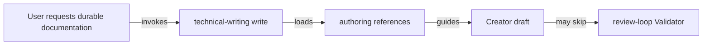
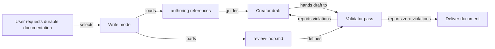
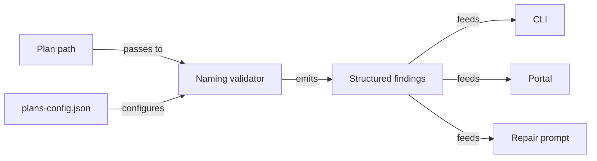
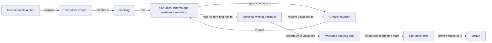

# Make Skill Reference Loading and Validation Reliable

## Summary

RoboRepo's documentation skills currently rely too heavily on agents following chains of references correctly. In repeated document-authoring sessions, important instructions have been skipped even when the user explicitly asked the agent to use the relevant skills. The failures have included incorrect plan filenames, incomplete plan frontmatter, omitted technical-writing Validator behavior, and missed representation or framework-specific guidance.

This plan makes critical skill requirements harder to skip. The main design rule is:

> **References provide depth; `SKILL.md` provides gates.**

Rules that determine whether an artifact is valid must be visible from the skill entry point, required references must be loaded by the mode that needs them, and rules that can be checked deterministically should be enforced in code rather than left entirely to model memory.

The work applies first to `plan-docs` and `technical-writing`, then establishes a reusable pattern for other RoboRepo skills.

## Goals

- [ ] Make required reference loading explicit and difficult to bypass during skill execution.
- [ ] Make `technical-writing write` include the Creator/Validator completion loop instead of requiring a separately inferred review step.
- [ ] Make plan naming, frontmatter, lifecycle, and other deterministic plan rules mechanically enforceable where practical.
- [ ] Ensure plan creation resolves the repository namespace and target filename before drafting begins.
- [ ] Make validator output observable enough that users can tell whether validation actually ran and what it checked.
- [ ] Preserve focused references instead of flattening every detailed instruction into `SKILL.md`.
- [ ] Establish a convention that can be applied to additional skills when similar failures are observed.
- [ ] Add regression coverage proving that required references and validation gates cannot silently disappear from the workflow.
- [ ] Report which references a session actually read, not merely which ones the skill declares, so a skipped reference is observable rather than assumed.

## Non-goals

- Rework the package multi-source distribution design.
- Move all reference content into top-level `SKILL.md` files.
- Require every skill to read every reference on every invocation.
- Build a general-purpose LLM workflow engine.
- Make qualitative technical-writing judgments fully deterministic.
- Change the lifecycle semantics of plan documents.
- Replace Markdown skill instructions with application code where model judgment is still required.
- Broadly refactor the telemetry pipeline. Only the privacy hash is consolidated, and only because Phase 8 depends on matching it.
- Consolidate helpers inside `scripts/cli/telemetry-capture.mjs` such as `toolMetadata`, `resolveCallId`, or session-activity tracking. That module's header documents a deliberate minimal-import constraint because it runs on every `PreToolUse`/`PostToolUse` hook; apparent duplication there is intentional, and widening its import graph regresses hook cost. The shared hash module is exempt because it depends only on `node:crypto`.
- Restructure `scripts/cli/telemetry.mjs` (1873 lines). Its size is a separate concern with its own risk profile.

## Current State

### Reference loading is mode-dependent

`technical-writing/SKILL.md` currently defines two named modes: `write` and `review`. There is no separate `edit` or `revise` entry point, and this plan should not add one. `write` is the artifact-producing mode and should cover creating, editing, revising, restructuring, and updating durable documentation. `review` is the read-only evaluation mode for inspecting an existing document and reporting violations without changing it.

Today, `write` requires `doc-shapes.md`, `section-guidance.md`, `representation.md`, and `anti-patterns.md`. The Creator/Validator instructions live in `references/review-loop.md`, but that reference is explicitly required by `review`, not `write`.



An agent can therefore follow the documented `write` reference list literally and still deliver a document without ever loading the Validator contract.

### Critical plan rules are deep in references

`globals/packages/plan-docs/skills/plan-docs/SKILL.md` correctly requires `references/plan-schema.md` for named modes. The schema contains artifact-validity rules that are easy to miss when they remain only in the deeper reference:

| Rule area | Current contract |
| --- | --- |
| Frontmatter | `id`, `priority`, `next_action`, `blocked_by`, `depends_on`, `related`, and `reviewed_commit` are the supported plan fields |
| Forbidden metadata | lifecycle/status timestamps and similar derived metadata do not belong in frontmatter |
| Lifecycle | lifecycle comes from `docs/plans/<lifecycle>/`, not a `status` field |
| Naming | filename is `<namespace>-<slug>.md`; project namespaces come from `docs/plans/plans-config.json` |
| Identity | new plans use an opaque 6–8 character lowercase base36 ID that survives renames and moves |
| H1 | title is reader-facing prose rather than a mechanically expanded filename |

The entry-point skill says to read the schema, but it does not restate the critical creation gates. The current programmatic validator also does not enforce filename/namespace correctness.

### Programmatic plan validation is incomplete

The plan-docs validator already handles frontmatter parsing, IDs, priorities, required sections, lifecycle readiness, dependencies, and blockers. Its finding catalog does not currently enforce filename/namespace correctness. A structurally valid plan can therefore use an invalid or inconsistent filename and still receive a finding-free validation result.

`docs/plans/plans-config.json` is currently a prose-only contract. A repository-wide search finds it referenced from `plan-schema.md` and the `plan-start` skill, but no module under `modules/plan-docs/` reads it. Namespace correctness is therefore enforced today only by whether the authoring agent remembered to open the file — which is the failure mode this plan exists to close.

### The naming convention already holds in every non-terminal lifecycle

A filename inventory at `reviewed_commit`, matched against the universal namespaces in `plan-schema.md` plus the project namespaces in `plans-config.json`, shows where legacy names actually live:

| Lifecycle | Plans with an unrecognized namespace prefix |
| --- | --- |
| `backlog` | 0 |
| `active` | 0 |
| `archived` | 0 |
| `completed` | 28 |

Every non-conforming filename sits in `completed/`. This makes the legacy-compatibility question a scoping decision rather than a migration project: naming findings scoped to non-terminal lifecycles cannot regress a single existing plan.

`docs/plans/backlog/` also contains three non-plan entries — `.DS_Store`, `roborepo-repository-plans.zip`, and a `roborepo_lifecycle_epic/` directory. Filename validation must skip non-Markdown entries rather than report them as malformed plans.

### Technical-writing validation is procedural rather than enforced

`globals/packages/technical-writing/skills/technical-writing/references/review-loop.md` defines two distinct roles:

| Role | Responsibility |
| --- | --- |
| Creator | Writes and revises the document |
| Validator | Reads applicable rules and reports violations only |

The Validator must not rewrite the document, each pass must be surfaced in chat, and the loop continues until the Validator reports no violations or reaches the documented pass cap. Today, running that loop still depends on the authoring agent remembering to load it.

There is also a concrete scope mismatch: `technical-writing write` requires `references/representation.md`, but `review-loop.md` does not include `representation.md` in its explicit Validator rule list. A document can therefore be authored under a representation rule that the Validator is not clearly required to check.

`globals/packages/technical-writing/skills/technical-writing/agents/openai.yaml` currently contains only a description. It does not encode a separate executable Validator contract, so this plan must not assume the agent metadata already provides role separation. Across every `agents/openai.yaml` in the repository only two keys appear at all — `description` and `interface` — so there is no existing role or policy field to extend. `skill-audit.mjs` documents the one behavioral key the Codex side recognizes, `policy.allow_implicit_invocation`, which governs invocation rather than Validator role separation.

### A structural skill audit already exists

`scripts/cli/skill-audit.mjs` (182 lines, invoked as `roborepo skill audit`) already walks every package-backed `SKILL.md`, parses frontmatter, emits per-skill structural findings, and renders `docs/internal/skill-invocation-audit.md` from a generated marker. Its current findings cover unsupported frontmatter keys, dynamic shell lines, side-effect keywords, and missing trigger descriptions.

This is the existing home for Phase 7's structural check, and it removes the plan's earlier uncertainty about audit ownership. Related tooling already in place: `skill-trigger-check.mjs` validates skill descriptions against the fixtures in `manifests/inventory/skill-trigger-tests.json`, and the repository has an established `*-characterization-check.mjs` test convention that Phase 6 should follow rather than invent.

### Omitted references can materially change implementation plans

The paired skills contain implementation constraints that materially affect a plan when they apply: `technical-writing` requires verb-labeled Mermaid edges and representation choices matched to content; framework-less JavaScript markup uses real HTML `<template>` elements instead of nested DOM builders; shared CLI/portal logic belongs in shared domain code rather than presentation layers; and test changes should begin with the smallest repository-native check that proves the behavior.

Reference loading therefore affects implementation correctness, not only formatting quality.

## Proposed Design

### 1. Treat critical rules as entry-point gates

A skill may keep detailed instructions in references, but its `SKILL.md` must name the conditions that must be true before the task can be called complete.

| Level | Purpose | Example |
| --- | --- | --- |
| Entry-point gate | Prevent invalid completion | “Do not deliver a durable document until the Validator loop passes.” |
| Required reference | Full procedure and examples | `references/review-loop.md` |
| Deterministic validator | Enforce machine-checkable invariants | filename namespace or frontmatter validation |

Do not duplicate an entire reference into `SKILL.md`; repeat only enough of the invariant to make skipping the reference visibly noncompliant.

### 2. Keep two technical-writing entry points with a clear boundary

Keep the mode surface intentionally small:

| Entry point | Owns | Does not own |
| --- | --- | --- |
| `write` | create, edit, revise, restructure, and update durable documentation; then validate it | read-only review with no requested edits |
| `review` | inspect an existing document and report violations without modifying it | document creation or revision |

Do not add a separate `edit` or `revise` mode. Those are normal forms of `write`, and splitting them into more entry points would make mode selection harder without adding a meaningful workflow distinction.

Change the `write` contract so it always reads `review-loop.md` and includes validation before delivery.



Required behavior:

- The Creator owns document edits.
- The Validator is read-only and returns findings.
- The Validator checks every applicable technical-writing rule, not an arbitrary subset.
- Every Validator pass is surfaced to the user.
- A failed pass returns to the Creator.
- The revised artifact, not the original draft, is validated on the next pass.
- The document is not presented as complete until the loop reaches zero findings or the documented pass cap is reached.
- `write` covers both new documents and requested edits/revisions to existing documents.
- Do not introduce a separate `edit` or `revise` mode.
- `review` remains available only for read-only evaluation of an existing document without modifying it.

### 3. Resolve plan identity before drafting

For `plan-docs create`, add an explicit pre-draft checkpoint.


Before writing plan body content, the agent must establish the plan identity and minimal frontmatter contract. Creation still begins in `docs/plans/backlog/`; if the user also asked to start the plan, the workflow validates the backlog plan first and then runs the start workflow to move the same stable ID into `docs/plans/active/`.

| Field or decision | Required behavior |
| --- | --- |
| `id` | Generate one opaque 6–8 character lowercase base36 ID; never derive it from the title or filename |
| `priority` | Use only `high`, `medium`, `low`, or `none` |
| `next_action` | Non-empty for a ready backlog plan and for an active plan |
| `blocked_by` | Always an array |
| `depends_on` | Always an array |
| `related` | Always an array |
| `reviewed_commit` | Record only a commit deliberately reviewed against the plan; leave empty when no such review occurred |
| Lifecycle | Derive from the folder; never add a `status` field |
| Namespace | Prefer the more-specific project namespace from `docs/plans/plans-config.json` |
| Filename | `<namespace>-<specific-slug>.md`, with no lifecycle/status/date/version suffix |
| H1 | Reader-facing outcome prose, not a filename transformation |

Do not add `status`, `validated`, `updated_at`, `created_at`, `owner`, `percent_complete`, `estimated_hours`, or `tags` unless the plan schema is intentionally changed first.

### 4. Add deterministic filename and namespace findings to plan-docs

Extend the plan-docs finding catalog and validation pipeline for rules code can prove.

| Finding | Condition |
| --- | --- |
| `INVALID_PLAN_FILENAME` | Filename is not lowercase hyphenated Markdown with namespace + slug |
| `UNKNOWN_PLAN_NAMESPACE` | Prefix is neither a universal namespace nor a configured project namespace |
| `FORBIDDEN_PLAN_FILENAME_SUFFIX` | Filename encodes prohibited lifecycle/status/date/version-style suffixes |

Do not mechanically judge whether an H1 is good prose. Programmatic validation may verify that one H1 exists; technical-writing review owns prose quality.

### 5. Keep one source of truth for deterministic rules

The plan-docs domain should expose a shared naming validator consumed by plan snapshot validation, lifecycle readiness checks, repair prompts, CLI presentation, portal presentation, and tests.



This matches the existing findings architecture, which is already intended to prevent validation wording from drifting across consumers.

### 6. Make qualitative Validator coverage explicit

For a single durable technical document, the Validator should resolve this rule set explicitly:

| Rule source | When required |
| --- | --- |
| Core Writing Philosophy in `SKILL.md` | Always |
| `doc-shapes.md` | Non-plan documents |
| `plan-docs` schema | Plans under `docs/plans` instead of generic doc shapes |
| `section-guidance.md` | Durable document review |
| `representation.md` | Durable document review |
| `anti-patterns.md` | Durable document review |
| `doc-organization.md` | Only when revising a documentation set |
| applicable paired skills | When explicitly requested or materially relevant to the implementation guidance |

The report format remains:

```text
<rule/reference> — <location> — <violation>
```

A successful pass explicitly reports that no violations were found.

### 7. Make paired-skill references part of validation scope

When the user explicitly asks for paired implementation skills, those skills are not merely brainstorming context.

| Skill | Plan impact |
| --- | --- |
| `plan-docs` | schema, lifecycle, filename, namespace, readiness |
| `technical-writing` | organization, representations, reader clarity, review loop |
| `code-style` | module ownership, orchestration/execution boundaries, reuse |
| `javascript-typescript` | ESM/JS conventions and framework-less markup rules when applicable |
| `test-harness` | test selection, observable behavior, regression strategy |

References remain conditional. For example, `javascript-typescript/references/framework-less-markup.md` is required only when implementation touches framework-less DOM structure.

### 8. Make plan creation run both validation layers

A plan is both a managed lifecycle artifact and a durable technical document. `plan-docs create` should therefore orchestrate both validation layers instead of expecting the user to remember a second command.



The two validators have different ownership:

- `plan-docs` checks deterministic schema, lifecycle, relationship, naming, and repository-consistency rules.
- `technical-writing` checks qualitative document rules such as organization, representation, anti-patterns, and reader clarity.

A clean technical-writing report must not override a plan-docs finding, and a mechanically valid plan must not bypass the qualitative Validator.

### 9. Add reference-loading observability

For workflows RoboRepo itself generates or launches, record or surface selected skill, selected mode, required reference paths, applicable paired skills, and validation result.

Do not capture private model reasoning. If a harness cannot prove a reference was actually read, report the expected reference set rather than falsely claiming execution evidence.

### 10. Strengthen skill authoring conventions

Durable RoboRepo skills should follow one consistent contract:

| Rule | Purpose |
| --- | --- |
| Put concise completion gates in `SKILL.md` | Makes invalid completion visibly noncompliant even before a deep reference is read |
| Put procedures, examples, and edge cases in references | Preserves depth without bloating the entry point |
| List every required reference for each named mode | Removes inference from reference routing |
| Load mandatory completion references from the artifact-producing mode | Prevents a required finishing step from becoming unreachable |
| Do not require a second inferred mode to finish the first | Keeps the user-facing invocation contract simple |
| Mechanically enforce deterministic invariants | Moves filename/frontmatter/schema correctness out of model memory |
| Keep qualitative review in a read-only Validator pass | Separates authoring from grading |
| Add regression coverage for routing and validators | Prevents future skill edits from silently dropping the contract |

## Affected Repository Files

Verified current implementation surfaces at `reviewed_commit`:

| Area | Current path | Planned use |
| --- | --- | --- |
| technical-writing mode routing | `globals/packages/technical-writing/skills/technical-writing/SKILL.md` | make `write` load the review loop and define write/review boundaries |
| technical-writing Validator | `globals/packages/technical-writing/skills/technical-writing/references/review-loop.md` | include the complete applicable rule set, including representation |
| technical-writing agent metadata | `globals/packages/technical-writing/skills/technical-writing/agents/openai.yaml` | investigate whether existing metadata can strengthen role separation without inventing unsupported schema |
| plan-docs entry point | `globals/packages/plan-docs/skills/plan-docs/SKILL.md` | surface creation completion gates |
| plan schema | `globals/packages/plan-docs/skills/plan-docs/references/plan-schema.md` | remain authoritative for frontmatter, naming, namespace, and lifecycle rules |
| create workflow | `globals/packages/plan-docs/skills/plan-docs/references/workflow-create.md` | create in backlog, use minimal frontmatter, validate readiness |
| start workflow | `globals/packages/plan-docs/skills/plan-docs/references/workflow-start.md` | move a validated selected plan from backlog to active while preserving ID |
| validate workflow | `globals/packages/plan-docs/skills/plan-docs/references/workflow-validate.md` | include naming/namespace and repository-consistency checks |
| findings catalog | `modules/plan-docs/findings.mjs` | add structured naming findings |
| plan-doc domain orchestration | `modules/plan-docs/index.mjs` | consume naming validation without embedding all naming rules in this already-large module |
| lifecycle policy | `modules/plan-docs/lifecycle-policy.mjs` | consume naming findings where lifecycle readiness needs them |
| repair prompt | `modules/plan-docs/repair-prompt.mjs` | receive the same structured findings rather than duplicate rule text |
| plan tests | `scripts/test/plan-docs-check.mjs`, `scripts/test/plan-docs-findings-check.mjs`, `scripts/test/plan-docs-repair-check.mjs` | regression coverage for new plan rules |
| skill structural audit | `scripts/cli/skill-audit.mjs` | add a reference-reachability finding to the existing audit rather than creating a new subsystem |
| skill trigger fixtures | `scripts/cli/skill-trigger-check.mjs`, `manifests/inventory/skill-trigger-tests.json` | existing precedent for fixture-driven skill metadata checks |
| namespace source | `docs/plans/plans-config.json` | becomes a code-read input instead of a prose-only contract |
| telemetry capture | `scripts/cli/telemetry-capture.mjs` | source of observed read events; consume without widening its import graph |
| shared privacy hash | `scripts/cli/telemetry-schemas/hash.mjs` (new) | one `privacyHash()` consumed by capture, seed-demo, classify, snapshot-schema, and `telemetry.mjs` |

Prefer a focused new module such as `modules/plan-docs/naming.mjs` for deterministic filename/namespace logic rather than adding another responsibility to `modules/plan-docs/index.mjs`. Confirm the final module boundary against local conventions during implementation.

## Implementation Plan

### Phase 1 — Fix technical-writing completion semantics

- [ ] Define `technical-writing write` as the single artifact-producing mode for create, edit, revise, restructure, and update requests.
- [ ] Do not add separate `edit` or `revise` entry points.
- [ ] Add `references/review-loop.md` to the required reference set for `technical-writing write`.
- [ ] Add an entry-point gate stating that durable write/revise work is not complete until the Creator/Validator loop passes or reaches its documented cap.
- [ ] Define `technical-writing review` as read-only evaluation that reports violations without editing the document.
- [ ] Make successful and failed Validator report behavior explicit in the top-level workflow.

### Phase 2 — Strengthen plan-docs creation gates

- [ ] Add an explicit pre-draft namespace/filename/H1 checkpoint to `plan-docs create`.
- [ ] State at the entry point that `docs/plans/plans-config.json` must be read before creating or renaming a plan when present.
- [ ] Keep detailed naming rules authoritative in `plan-schema.md`.
- [ ] Keep `plan-docs create` backlog-only; when the user also requested start, validate the new backlog plan and then invoke the start workflow to move the same stable ID into `active`.
- [ ] Ensure lifecycle remains folder-derived and is never duplicated into frontmatter.

### Phase 3 — Add programmatic naming validation

- [ ] Add a shared naming-validation unit in the plan-docs domain (`modules/plan-docs/naming.mjs`).
- [ ] Load the universal namespaces from `plan-schema.md` plus project namespaces read from `docs/plans/plans-config.json`; this is the first code path to read that file.
- [ ] Add the three finding definitions to `modules/plan-docs/findings.mjs` using its documented "TO ADD A RULE" path, with `kind: "schema"` and `severity: "advisory"`.
- [ ] Scope naming findings to non-terminal lifecycles (`backlog`, `active`); suppress them for `completed` and `archived`, where all 28 legacy names live.
- [ ] Skip non-Markdown directory entries so `.DS_Store`, `.zip`, and nested directories are never reported as malformed plans.
- [ ] Feed findings through existing validation, portal/API, and repair-prompt paths — the catalog comment confirms all three consume the same source.
- [ ] Add deterministic fixtures for repositories with and without `plans-config.json`.

### Phase 4 — Tighten the technical-writing Validator contract

- [ ] Update `review-loop.md` to enumerate the minimum applicable reference set rather than relying only on “read every rule.”
- [ ] Fix the current Validator scope mismatch by adding `representation.md` to the Validator's explicit rule list (line 8-10 of `review-loop.md` names `SKILL.md`, `anti-patterns.md`, `doc-shapes.md`, `section-guidance.md`, and `doc-organization.md`, but omits it).
- [ ] Define how paired implementation skills contribute constraints to validation.
- [ ] Keep the Validator read-only.
- [ ] Require each pass to identify reference/rule, document location, and violation.
- [ ] Preserve the 10-pass cap.
- [ ] Leave `agents/openai.yaml` unchanged. Repository-wide, those files carry only `description` and `interface` keys, and the only documented behavioral key is `policy.allow_implicit_invocation`, which governs invocation rather than Validator role separation. Role separation stays in `review-loop.md`.

### Phase 5 — Integrate plan creation with both validators

- [ ] Update `plan-docs create` instructions so a durable plan runs plan-docs validation and the technical-writing Validator before delivery.
- [ ] Define retry ordering: plan-docs findings or technical-writing violations return to the Creator; the revised draft is rechecked.
- [ ] If the user requested the plan be started, run the start workflow only after the backlog artifact has passed the required creation checks.
- [ ] Preserve the same stable `id` across the backlog-to-active move.
- [ ] Surface the technical-writing Validator report on every pass as required by `review-loop.md`.

### Phase 6 — Add skill-routing regression coverage

- [ ] Add characterization tests for the reference matrices declared by `technical-writing` and `plan-docs`, following the existing `scripts/test/*-characterization-check.mjs` convention and registering them as `test:*` scripts in `package.json`.
- [ ] Parse the mode/reference matrix directly from `SKILL.md` prose; do not introduce a parallel manifest. Pair this with the Phase 7 audit finding so prose that no longer parses fails loudly rather than yielding an empty reference set that trivially passes.
- [ ] Test that `technical-writing write` includes `review-loop.md`.
- [ ] Test that create/edit/revise requests resolve to `write` rather than requiring separate modes.
- [ ] Test that `technical-writing review` remains read-only and does not imply document mutation.
- [ ] Test that `plan-docs create` requires naming/schema references and repository namespace configuration.
- [ ] Test that plan creation runs deterministic plan validation and the technical-writing Validator contract before an optional start transition.
- [ ] Test naming findings through the plan-docs domain.
- [ ] Prefer externally meaningful workflow/config output over internal helper-call assertions.

### Phase 7 — Add skill authoring guidance and structural audit support

- [ ] Document the “references provide depth; `SKILL.md` provides gates” convention in maintainer guidance.
- [ ] Extend `scripts/cli/skill-audit.mjs` with a reference-reachability finding: a reference required by a non-artifact-producing mode but unreachable from the artifact-producing mode. The audit already parses every package-backed `SKILL.md` and emits structural findings, so add a finding to its existing `findings()` function rather than creating a new module.
- [ ] Add a companion finding for an unparseable mode/reference matrix, so reformatted prose surfaces as an audit failure instead of silently defeating the Phase 6 tests.
- [ ] Regenerate `docs/internal/skill-invocation-audit.md` through the existing generated-marker path; do not hand-edit it.
- [ ] Keep audit findings structural rather than attempting to judge arbitrary prose semantics mechanically.

### Phase 8 — Add lightweight runtime observability

Step one consolidates the privacy hash, because Phase 8 depends on hashing a reference path exactly the way capture already hashed it. Matching against a sixth ad-hoc copy of the algorithm is how the silent zero-match failure below actually happens.

- [ ] Add a single `privacyHash(value)` to a dependency-free module (`scripts/cli/telemetry-schemas/hash.mjs`) and route all existing call sites through it.
- [ ] Delete the sync-by-comment note at `scripts/cli/telemetry.mjs:1080` once both sides call the shared helper.
- [ ] Add an assertion to the existing telemetry tests that pins the hash algorithm and width, so a change cannot silently desynchronize cross-file joins.
- [ ] Build on existing telemetry capture; do not add a new diagnostics surface.
- [ ] Resolve the live installed skill directory before hashing reference paths, so hashes match what the agent actually read. Verify against a real captured session before building any reporting on top — a wrong path root produces zero matches with no error.
- [ ] Match required reference paths against captured `file_path_hash` values to report which references were actually read, not only which were required.
- [ ] Preserve the existing privacy property: presence-test known reference paths; do not add plain-text path capture.
- [ ] Keep reference-presence matching inline in Phase 8. The primitive — given known paths, which did this session read — would generalize to plan-doc reads and plan-touched-file checks, but extract it only when a second consumer exists rather than designing for a hypothetical one.
- [ ] If this adds framework-less portal markup, follow the existing real-HTML `<template>` + slot-fill convention; do not build nested multi-element structures with JavaScript DOM-builder calls or runtime HTML strings.
- [ ] Do not claim a model read a reference when the harness cannot prove it.
- [ ] Do not capture or persist private model reasoning.

## Validation

### Focused behavior

- [ ] `technical-writing write` owns create/edit/revise/update behavior and requires `review-loop.md`.
- [ ] No separate `edit` or `revise` mode is introduced.
- [ ] `technical-writing review` continues to work independently as a read-only evaluation mode.
- [ ] `plan-docs create` requires namespace resolution before target filename creation.
- [ ] Invalid plan filenames emit structured findings.
- [ ] Unknown project namespaces emit structured findings.
- [ ] Valid existing plans do not gain false-positive naming findings.
- [ ] Legacy plan IDs remain untouched.
- [ ] Plan lifecycle still derives only from the folder.
- [ ] Repair prompts receive the same naming findings exposed by the domain.
- [ ] All five former hash sites produce identical output for the same input after consolidation.
- [ ] A test fails if the hash algorithm or truncation width changes.
- [ ] `telemetry-capture.mjs` gains no imports beyond the `node:crypto`-only hash module.
- [ ] Existing telemetry captures remain readable; consolidation changes no stored hash value.

### Test design

- Use repository-native test scripts discovered from `package.json`.
- For each behavior change or bug fix, add or identify the smallest regression check first and run it before implementation to prove it catches the old behavior.
- Assert observable reference matrices, findings, generated repair information, or user-visible workflow behavior rather than incidental internal calls.
- Use isolated temporary plan repositories for plan naming/lifecycle fixtures.
- Do not write tests against real user plan state.
- Run the full suite after focused checks because plan validation and skill-routing conventions are shared infrastructure.

### Candidate verification commands

```bash
npm run test:plans
npm run test:plans-findings
npm run test:plans-repair
npm test
```

Phase 8 hash consolidation touches shared telemetry surfaces, so run the telemetry checks that already cover those call sites:

```bash
npm run test:telemetry
npm run test:telemetry-schemas
npm run test:telemetry-classify
npm run test:telemetry-capture-v3
```

Do not invent a new lint, formatter, or typecheck command solely for this work.

## Risks and Mitigations

| Risk | Mitigation |
| --- | --- |
| Entry-point skills become bloated by duplicated references | Repeat only completion gates; keep procedural depth in references |
| Every invocation loads too much context | Keep reference matrices mode-specific and conditional |
| Programmatic validation becomes over-opinionated | Enforce only deterministic naming/schema rules in code |
| Qualitative Validator becomes another authoring pass | Preserve a read-only violations-only contract |
| Paired skills make Validator scope unbounded | Include only explicitly requested or materially applicable paired skills |
| Agents claim references were read when that cannot be proven | Distinguish expected reference set from verified execution evidence |
| Existing plans are broken by stricter naming checks | Characterize current inventory first and treat legacy exceptions deliberately |
| Skill updates drift across harnesses | Keep source skill/reference content canonical and test rendered/routed outputs |
| A hash-width change silently empties every cross-file join | Consolidate to one `privacyHash()` and pin algorithm and width with a test assertion |
| Hashing the repository source path instead of the installed skill path yields zero matches with no error | Resolve the live installed skill directory first and verify against a real captured session before building reporting on top |
| Consolidation creeps into the hot capture path and regresses hook cost | Extract only the `node:crypto`-only hash; the non-goals forbid touching capture's other helpers |

## Resolved Decisions

Every question carried by the previous revision has been resolved against the repository. They are recorded as decisions, not open items:

| Former question | Resolution |
| --- | --- |
| Should filename findings be advisory for legacy plans? | Resolved by inventory. All 28 legacy names are in `completed/`; none are in `backlog`, `active`, or `archived`. Scope findings to non-terminal lifecycles and no existing plan regresses. |
| Where should structural reference-reachability checks live? | Resolved by inspection. `scripts/cli/skill-audit.mjs` already performs structural `SKILL.md` auditing; extend its `findings()` rather than adding a module. |
| Should the reference matrix move to a machine-readable manifest? | No, not yet. Keep the matrix in `SKILL.md` prose as the single source of truth and have Phase 6 parse it. A manifest would create a second copy that can silently drift from the prose the agent actually reads — a green test while the real skip occurs. Revisit only when a second consumer needs it. |
| Which surface hosts reference-loading observability? | Existing telemetry capture. No new diagnostics surface is required. |

### Reference-loading observability is achievable from existing capture

`scripts/cli/telemetry-capture.mjs` already records every read-shaped tool call — `READ_TOOL_NAMES` covers `Read`, `Grep`, `Glob`, `WebFetch`, and `WebSearch` — and stores the target path as `file_path_hash`, an unsalted SHA-256 truncated to 24 hex characters.

Because the hash is unsalted and derived only from the path string, a consumer can hash a known reference path and test for its presence in a session's captured reads. This makes Phase 8 able to report **observed** reference loading rather than merely the expected reference set, which is the difference between catching a skipped reference and restating the rule.

| Constraint | Consequence for Phase 8 |
| --- | --- |
| Hashes derive from the absolute path the agent actually used | Resolve the live installed skill path before hashing, not the repository source path; hashing the wrong root yields zero matches silently |
| Paths are stored hashed, never in plain text | Matching is presence-testing against known references only; the pipeline cannot enumerate arbitrary read paths, and this privacy property must be preserved |
| Capture observes tool calls, not model reasoning | Report which reference files were read; never infer or claim comprehension |

### The privacy hash is duplicated across five sites

Phase 8 must reproduce capture's hash exactly to match anything. That algorithm — `sha256`, hex, truncated to 24 characters — is currently written out independently in five places:

| Site | Line | Form |
| --- | --- | --- |
| `scripts/cli/telemetry-capture.mjs` | 563 | `function hash(value)` |
| `scripts/cli/telemetry.mjs` | 1084 | `function captureRepositoryHash(value)` |
| `scripts/cli/telemetry-seed-demo.mjs` | 18 | `const hash = (value) => ...` |
| `scripts/cli/telemetry-classify.mjs` | 130, 139 | `commandSignature`, `failureSignature` |
| `scripts/cli/telemetry-schemas/snapshot-schema.mjs` | 25 | inline |

Consistency is currently maintained by a comment at `telemetry.mjs:1080` explaining that the value must line up with `telemetry-capture.mjs`. That comment is the whole enforcement mechanism.

**Changing the width in one file breaks cross-file joins without failing anything.** Hashes simply stop matching, and every join returns zero rows — indistinguishable from "the agent read nothing." Phase 8 would inherit that failure mode directly, which is why the consolidation is sequenced first rather than treated as unrelated cleanup.

## Repository Review

Repository state for this revision was deliberately reviewed at:

```text
28d64aa
```

Verified facts used by this plan:

| Fact | Repository evidence |
| --- | --- |
| `technical-writing write` does not require `review-loop.md` | `globals/packages/technical-writing/skills/technical-writing/SKILL.md` |
| the current Validator list omits `representation.md` | `globals/packages/technical-writing/skills/technical-writing/references/review-loop.md` |
| OpenAI skill metadata currently carries only a description | `globals/packages/technical-writing/skills/technical-writing/agents/openai.yaml` |
| plan creation begins in backlog and start moves selected work to active | `globals/packages/plan-docs/skills/plan-docs/references/workflow-create.md`, `globals/packages/plan-docs/skills/plan-docs/references/workflow-start.md` |
| `agent-config` is the project namespace covering skills and harness configuration | `docs/plans/plans-config.json` |
| structured findings feed validation/lifecycle errors/repair prompts from one catalog | `modules/plan-docs/findings.mjs` |
| plan-focused and full-suite verification commands exist | `package.json` |
| a structural skill audit already exists and renders a generated report | `scripts/cli/skill-audit.mjs`, `docs/internal/skill-invocation-audit.md` |
| fixture-driven skill metadata checking has existing precedent | `scripts/cli/skill-trigger-check.mjs`, `manifests/inventory/skill-trigger-tests.json` |
| no code reads `plans-config.json`; it is a prose-only contract today | repository-wide search: only `plan-schema.md` and the `plan-start` skill reference it |
| all 28 legacy-named plans are in `completed/`; backlog, active, and archived are fully conforming | filename inventory against universal + project namespaces |
| `agents/openai.yaml` files carry only `description` and `interface` keys | `globals/packages/*/skills/*/agents/openai.yaml` |
| universal namespaces include `git`, `infra`, and `os` | `plan-schema.md` |
| telemetry capture records read-shaped tool calls with an unsalted path hash | `scripts/cli/telemetry-capture.mjs` (`READ_TOOL_NAMES`, `file_path_hash`, `hash()`) |
| the same sha256/24-character hash is reimplemented in five modules, kept aligned only by a comment | `telemetry-capture.mjs:563`, `telemetry.mjs:1080-1084`, `telemetry-seed-demo.mjs:18`, `telemetry-classify.mjs:130,139`, `telemetry-schemas/snapshot-schema.mjs:25` |
| the capture module documents a deliberate minimal-import constraint for the hot hook path | `scripts/cli/telemetry-capture.mjs:18-23` |

## Success Criteria

The plan is successful when:

- A normal technical-writing create/edit/revise request resolves to `write` and cannot legitimately finish without the Validator loop.
- Read-only document evaluation remains available through `review` without introducing extra authoring modes.
- Plan creation resolves naming and namespace before drafting.
- Programmatic plan validation catches deterministic filename/namespace violations.
- The technical-writing Validator has an explicit applicable rule set and surfaces every pass.
- Applicable paired skills influence both authoring and review.
- Tests protect the critical reference matrices and naming validators.
- Maintainers have a reusable pattern for future skills: entry-point gates, detailed references, deterministic validators, and qualitative review.
