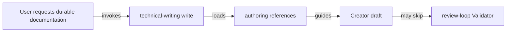
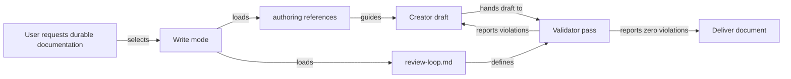
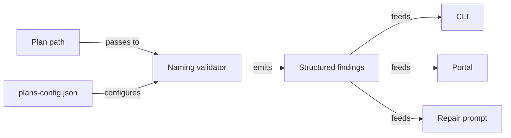
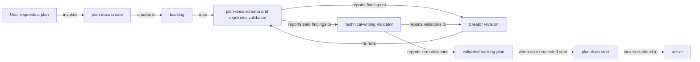
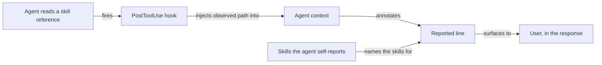
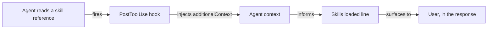

# Make Skill Reference Loading and Validation Reliable

## Summary

RoboRepo's documentation skills currently rely too heavily on agents following chains of references correctly. In repeated document-authoring sessions, important instructions have been skipped even when the user explicitly asked the agent to use the relevant skills. The failures have included incorrect plan filenames, incomplete plan frontmatter, omitted technical-writing Validator behavior, and missed representation or framework-specific guidance.

This plan makes critical skill requirements harder to skip. The main design rule is:

> **References provide depth; `SKILL.md` provides gates.**

Rules that determine whether an artifact is valid must be visible from the skill entry point, required references must be loaded by the mode that needs them, and rules that can be checked deterministically should be enforced in code rather than left entirely to model memory.

The work applies first to `plan-docs` and `technical-writing`, then establishes a reusable pattern for other RoboRepo skills.

## Goals

- [x] Make required reference loading explicit and difficult to bypass during skill execution.
- [x] Make `technical-writing write` include the Creator/Validator completion loop instead of requiring a separately inferred review step.
- [x] Make plan naming, frontmatter, lifecycle, and other deterministic plan rules mechanically enforceable where practical.
- [x] Ensure plan creation resolves the repository namespace and target filename before drafting begins.
- [x] Make validator output observable enough that users can tell whether validation actually ran and what it checked.
- [x] Preserve focused references instead of flattening every detailed instruction into `SKILL.md`.
- [x] Establish a convention that can be applied to additional skills when similar failures are observed.
- [x] Add regression coverage proving that required references and validation gates cannot silently disappear from the workflow.
- [x] Report which references a session actually read, not merely which ones the skill declares, so a skipped reference is observable rather than assumed.
- [ ] Deliver that report where it is useful — the chat-time line at the end of a response — rather than as a durable record nobody reads back.

## Non-goals

- Rework the package multi-source distribution design.
- Move all reference content into top-level `SKILL.md` files.
- Require every skill to read every reference on every invocation.
- Build a general-purpose LLM workflow engine.
- Make qualitative technical-writing judgments fully deterministic.
- Change the lifecycle semantics of plan documents.
- Replace Markdown skill instructions with application code where model judgment is still required.
- Broadly refactor the telemetry pipeline. Only the privacy hash is consolidated, and only because Phase 8 depends on matching it.
- Consolidate helpers inside `scripts/cli/telemetry-capture.mjs` such as `toolMetadata`, `resolveCallId`, or session-activity tracking. That module's header documents a deliberate minimal-import constraint because it runs on every `PreToolUse`/`PostToolUse` hook; apparent duplication there is intentional, and widening its import graph regresses hook cost. The shared hash module is exempt because it depends only on `node:crypto`.
- Restructure `scripts/cli/telemetry.mjs` (1873 lines). Its size is a separate concern with its own risk profile.
- Build a queryable history of skill and reference use. Which skills shaped a turn matters while the response is on screen and is not consulted afterward, so the deliverable is the reported line, not a log. This plan adds no store and consumes only capture data already written for other reasons.
- Replace the agent's self-report with measurement. Reading a file is not the same as applying its rules, and a skill can shape a turn with no file read at all.

## Current State

### Reference loading is mode-dependent

`technical-writing/SKILL.md` currently defines two named modes: `write` and `review`. There is no separate `edit` or `revise` entry point, and this plan should not add one. `write` is the artifact-producing mode and should cover creating, editing, revising, restructuring, and updating durable documentation. `review` is the read-only evaluation mode for inspecting an existing document and reporting violations without changing it.

Today, `write` requires `doc-shapes.md`, `section-guidance.md`, `representation.md`, and `anti-patterns.md`. The Creator/Validator instructions live in `references/review-loop.md`, but that reference is explicitly required by `review`, not `write`.



An agent can therefore follow the documented `write` reference list literally and still deliver a document without ever loading the Validator contract.

### Critical plan rules are deep in references

`globals/packages/plan-docs/skills/plan-docs/SKILL.md` correctly requires `references/plan-schema.md` for named modes. The schema contains artifact-validity rules that are easy to miss when they remain only in the deeper reference:

| Rule area | Current contract |
| --- | --- |
| Frontmatter | `id`, `priority`, `next_action`, `blocked_by`, `depends_on`, `related`, and `reviewed_commit` are the supported plan fields |
| Forbidden metadata | lifecycle/status timestamps and similar derived metadata do not belong in frontmatter |
| Lifecycle | lifecycle comes from `docs/plans/<lifecycle>/`, not a `status` field |
| Naming | filename is `<namespace>-<slug>.md`; project namespaces come from `docs/plans/plans-config.json` |
| Identity | new plans use an opaque 6–8 character lowercase base36 ID that survives renames and moves |
| H1 | title is reader-facing prose rather than a mechanically expanded filename |

The entry-point skill says to read the schema, but it does not restate the critical creation gates. The current programmatic validator also does not enforce filename/namespace correctness.

### Programmatic plan validation is incomplete

The plan-docs validator already handles frontmatter parsing, IDs, priorities, required sections, lifecycle readiness, dependencies, and blockers. Its finding catalog does not currently enforce filename/namespace correctness. A structurally valid plan can therefore use an invalid or inconsistent filename and still receive a finding-free validation result.

`docs/plans/plans-config.json` is currently a prose-only contract. A repository-wide search finds it referenced from `plan-schema.md` and the `plan-start` skill, but no module under `modules/plan-docs/` reads it. Namespace correctness is therefore enforced today only by whether the authoring agent remembered to open the file — which is the failure mode this plan exists to close.

### The naming convention already holds in every non-terminal lifecycle

A filename inventory at `reviewed_commit`, matched against the universal namespaces in `plan-schema.md` plus the project namespaces in `plans-config.json`, shows where legacy names actually live:

| Lifecycle | Plans with an unrecognized namespace prefix |
| --- | --- |
| `backlog` | 0 |
| `active` | 0 |
| `archived` | 0 |
| `completed` | 28 |

Every non-conforming filename sits in `completed/`. This makes the legacy-compatibility question a scoping decision rather than a migration project: naming findings scoped to non-terminal lifecycles cannot regress a single existing plan.

`docs/plans/backlog/` also contains three non-plan entries — `.DS_Store`, `roborepo-repository-plans.zip`, and a `roborepo_lifecycle_epic/` directory. Filename validation must skip non-Markdown entries rather than report them as malformed plans.

### Technical-writing validation is procedural rather than enforced

`globals/packages/technical-writing/skills/technical-writing/references/review-loop.md` defines two distinct roles:

| Role | Responsibility |
| --- | --- |
| Creator | Writes and revises the document |
| Validator | Reads applicable rules and reports violations only |

The Validator must not rewrite the document, each pass must be surfaced in chat, and the loop continues until the Validator reports no violations or reaches the documented pass cap. Today, running that loop still depends on the authoring agent remembering to load it.

There is also a concrete scope mismatch: `technical-writing write` requires `references/representation.md`, but `review-loop.md` does not include `representation.md` in its explicit Validator rule list. A document can therefore be authored under a representation rule that the Validator is not clearly required to check.

`globals/packages/technical-writing/skills/technical-writing/agents/openai.yaml` currently contains only a description. It does not encode a separate executable Validator contract, so this plan must not assume the agent metadata already provides role separation. Across every `agents/openai.yaml` in the repository only two keys appear at all — `description` and `interface` — so there is no existing role or policy field to extend. `skill-audit.mjs` documents the one behavioral key the Codex side recognizes, `policy.allow_implicit_invocation`, which governs invocation rather than Validator role separation.

### A structural skill audit already exists

`scripts/cli/skill-audit.mjs` (182 lines, invoked as `roborepo skill audit`) already walks every package-backed `SKILL.md`, parses frontmatter, emits per-skill structural findings, and renders `docs/internal/skill-invocation-audit.md` from a generated marker. Its current findings cover unsupported frontmatter keys, dynamic shell lines, side-effect keywords, and missing trigger descriptions.

This is the existing home for Phase 7's structural check, and it removes the plan's earlier uncertainty about audit ownership. Related tooling already in place: `skill-trigger-check.mjs` validates skill descriptions against the fixtures in `manifests/inventory/skill-trigger-tests.json`, and the repository has an established `*-characterization-check.mjs` test convention that Phase 6 should follow rather than invent.

### Skill reporting already exists and is self-reported

The `skill-visibility` package renders one line at the end of a response naming the skills that shaped it. Its entire rule set is that line plus a caveat: "This is self-reported, not harness-verified." It is enabled through the `chat-time-output` category, whose contract is inline notes only — no files written, no workflow started.

This is the surface where skill and reference information is useful, and its stated weakness is the failure this plan closes. An agent that skipped a required reference is the same agent that will not report the skip.

Separately, `scripts/cli/telemetry-capture.mjs` already records a `file_path_hash` on every read-shaped tool call, for reasons unrelated to skills. Nothing consumes it for reference checking today.

### Omitted references can materially change implementation plans

The paired skills contain implementation constraints that materially affect a plan when they apply: `technical-writing` requires verb-labeled Mermaid edges and representation choices matched to content; framework-less JavaScript markup uses real HTML `<template>` elements instead of nested DOM builders; shared CLI/portal logic belongs in shared domain code rather than presentation layers; and test changes should begin with the smallest repository-native check that proves the behavior.

Reference loading therefore affects implementation correctness, not only formatting quality.

## Proposed Design

### 1. Treat critical rules as entry-point gates

A skill may keep detailed instructions in references, but its `SKILL.md` must name the conditions that must be true before the task can be called complete.

| Level | Purpose | Example |
| --- | --- | --- |
| Entry-point gate | Prevent invalid completion | “Do not deliver a durable document until the Validator loop passes.” |
| Required reference | Full procedure and examples | `references/review-loop.md` |
| Deterministic validator | Enforce machine-checkable invariants | filename namespace or frontmatter validation |

Do not duplicate an entire reference into `SKILL.md`; repeat only enough of the invariant to make skipping the reference visibly noncompliant.

### 2. Keep two technical-writing entry points with a clear boundary

Keep the mode surface intentionally small:

| Entry point | Owns | Does not own |
| --- | --- | --- |
| `write` | create, edit, revise, restructure, and update durable documentation; then validate it | read-only review with no requested edits |
| `review` | inspect an existing document and report violations without modifying it | document creation or revision |

Do not add a separate `edit` or `revise` mode. Those are normal forms of `write`, and splitting them into more entry points would make mode selection harder without adding a meaningful workflow distinction.

Change the `write` contract so it always reads `review-loop.md` and includes validation before delivery.



Required behavior:

- The Creator owns document edits.
- The Validator is read-only and returns findings.
- The Validator checks every applicable technical-writing rule, not an arbitrary subset.
- Every Validator pass is surfaced to the user.
- A failed pass returns to the Creator.
- The revised artifact, not the original draft, is validated on the next pass.
- The document is not presented as complete until the loop reaches zero findings or the documented pass cap is reached.
- `write` covers both new documents and requested edits/revisions to existing documents.
- Do not introduce a separate `edit` or `revise` mode.
- `review` remains available only for read-only evaluation of an existing document without modifying it.

### 3. Resolve plan identity before drafting

For `plan-docs create`, add an explicit pre-draft checkpoint.


Before writing plan body content, the agent must establish the plan identity and minimal frontmatter contract. Creation still begins in `docs/plans/backlog/`; if the user also asked to start the plan, the workflow validates the backlog plan first and then runs the start workflow to move the same stable ID into `docs/plans/active/`.

| Field or decision | Required behavior |
| --- | --- |
| `id` | Generate one opaque 6–8 character lowercase base36 ID; never derive it from the title or filename |
| `priority` | Use only `high`, `medium`, `low`, or `none` |
| `next_action` | Non-empty for a ready backlog plan and for an active plan |
| `blocked_by` | Always an array |
| `depends_on` | Always an array |
| `related` | Always an array |
| `reviewed_commit` | Record only a commit deliberately reviewed against the plan; leave empty when no such review occurred |
| Lifecycle | Derive from the folder; never add a `status` field |
| Namespace | Prefer the more-specific project namespace from `docs/plans/plans-config.json` |
| Filename | `<namespace>-<specific-slug>.md`, with no lifecycle/status/date/version suffix |
| H1 | Reader-facing outcome prose, not a filename transformation |

Do not add `status`, `validated`, `updated_at`, `created_at`, `owner`, `percent_complete`, `estimated_hours`, or `tags` unless the plan schema is intentionally changed first.

### 4. Add deterministic filename and namespace findings to plan-docs

Extend the plan-docs finding catalog and validation pipeline for rules code can prove.

| Finding | Condition |
| --- | --- |
| `INVALID_PLAN_FILENAME` | Filename is not lowercase hyphenated Markdown with namespace + slug |
| `UNKNOWN_PLAN_NAMESPACE` | Prefix is neither a universal namespace nor a configured project namespace |
| `FORBIDDEN_PLAN_FILENAME_SUFFIX` | Filename encodes prohibited lifecycle/status/date/version-style suffixes |

Do not mechanically judge whether an H1 is good prose. Programmatic validation may verify that one H1 exists; technical-writing review owns prose quality.

### 5. Keep one source of truth for deterministic rules

The plan-docs domain should expose a shared naming validator consumed by plan snapshot validation, lifecycle readiness checks, repair prompts, CLI presentation, portal presentation, and tests.



This matches the existing findings architecture, which is already intended to prevent validation wording from drifting across consumers.

### 6. Make qualitative Validator coverage explicit

For a single durable technical document, the Validator should resolve this rule set explicitly:

| Rule source | When required |
| --- | --- |
| Core Writing Philosophy in `SKILL.md` | Always |
| `doc-shapes.md` | Non-plan documents |
| `plan-docs` schema | Plans under `docs/plans` instead of generic doc shapes |
| `section-guidance.md` | Durable document review |
| `representation.md` | Durable document review |
| `anti-patterns.md` | Durable document review |
| `doc-organization.md` | Only when revising a documentation set |
| applicable paired skills | When explicitly requested or materially relevant to the implementation guidance |

The report format remains:

```text
<rule/reference> — <location> — <violation>
```

A successful pass explicitly reports that no violations were found.

### 7. Make paired-skill references part of validation scope

When the user explicitly asks for paired implementation skills, those skills are not merely brainstorming context.

| Skill | Plan impact |
| --- | --- |
| `plan-docs` | schema, lifecycle, filename, namespace, readiness |
| `technical-writing` | organization, representations, reader clarity, review loop |
| `code-style` | module ownership, orchestration/execution boundaries, reuse |
| `javascript-typescript` | ESM/JS conventions and framework-less markup rules when applicable |
| `test-harness` | test selection, observable behavior, regression strategy |

References remain conditional. For example, `javascript-typescript/references/framework-less-markup.md` is required only when implementation touches framework-less DOM structure.

### 8. Make plan creation run both validation layers

A plan is both a managed lifecycle artifact and a durable technical document. `plan-docs create` should therefore orchestrate both validation layers instead of expecting the user to remember a second command.



The two validators have different ownership:

- `plan-docs` checks deterministic schema, lifecycle, relationship, naming, and repository-consistency rules.
- `technical-writing` checks qualitative document rules such as organization, representation, anti-patterns, and reader clarity.

A clean technical-writing report must not override a plan-docs finding, and a mechanically valid plan must not bypass the qualitative Validator.

### 9. Deliver reference loading as chat-time output, not as a queryable log

Which skills shaped a turn is information with a short shelf life. A user reads it while the
response is in front of them and does not return to it afterward, so a durable record answers a
question nobody asks later. The delivery surface is the reported line at the end of a response; the
capture spool is evidence feeding that line, never the deliverable.

The `skill-visibility` package already owns that line and already carries the weakness this plan
exists to close:

```text
> 🧩 **Skills loaded:** [comma-separated skill names, or "none"]
```

Its own rule text states the limit — "This is self-reported, not harness-verified." An agent that
skipped a required reference is precisely the agent that will not report having skipped it.

| | `skill-visibility` today | Captured reads | Unified |
| --- | --- | --- | --- |
| Question answered | which skills shaped this turn | which reference files were opened | both |
| Basis | agent introspection | the read path in a `PostToolUse` hook payload | observation annotating the self-report |
| Granularity | skill names | individual references | skills, each with its reference tally |
| Reaches the user | in the response | nowhere | in the response |
| Fails when | the agent forgets | telemetry is disabled | degrades to the self-report alone |



Required behavior:

- The agent's self-report names the skills. Measurement annotates it and never replaces it — a
  skill can shape a turn through rules already in context, with no file read to observe.
- A reference that no captured read matches is reported as **not seen**, never as *not read*.
  Capture can begin mid-session, and a reference read in an earlier turn is real but unmatched.
- A disagreement between the two halves is the most valuable output the system produces. Render it
  rather than reconciling it silently.
- With telemetry disabled, the line renders exactly as it does today.
- Persist nothing. The observation is turn-scoped context injected by a hook and consumed in the
  same response. No store, no log, no retained per-turn record.

Rendered forms, in order of how much the pipeline can prove:

```text
> 🧩 **Skills loaded:** plan-docs, technical-writing
> 🧩 **Skills loaded:** plan-docs (5 refs), technical-writing (5 refs)
> 🧩 **Skills loaded:** technical-writing — 4 of 5 refs read, review-loop.md not seen
```

The third line is the one this plan exists to produce. Every gate in the preceding phases assumes
an agent that follows instructions; that line is what appears when one did not, while the user
still cares.

### 10. Strengthen skill authoring conventions

Durable RoboRepo skills should follow one consistent contract:

| Rule | Purpose |
| --- | --- |
| Put concise completion gates in `SKILL.md` | Makes invalid completion visibly noncompliant even before a deep reference is read |
| Put procedures, examples, and edge cases in references | Preserves depth without bloating the entry point |
| List every required reference for each named mode | Removes inference from reference routing |
| Load mandatory completion references from the artifact-producing mode | Prevents a required finishing step from becoming unreachable |
| Do not require a second inferred mode to finish the first | Keeps the user-facing invocation contract simple |
| Mechanically enforce deterministic invariants | Moves filename/frontmatter/schema correctness out of model memory |
| Keep qualitative review in a read-only Validator pass | Separates authoring from grading |
| Add regression coverage for routing and validators | Prevents future skill edits from silently dropping the contract |

## Affected Repository Files

Verified current implementation surfaces at `reviewed_commit`:

| Area | Current path | Planned use |
| --- | --- | --- |
| technical-writing mode routing | `globals/packages/technical-writing/skills/technical-writing/SKILL.md` | make `write` load the review loop and define write/review boundaries |
| technical-writing Validator | `globals/packages/technical-writing/skills/technical-writing/references/review-loop.md` | include the complete applicable rule set, including representation |
| technical-writing agent metadata | `globals/packages/technical-writing/skills/technical-writing/agents/openai.yaml` | investigate whether existing metadata can strengthen role separation without inventing unsupported schema |
| plan-docs entry point | `globals/packages/plan-docs/skills/plan-docs/SKILL.md` | surface creation completion gates |
| plan schema | `globals/packages/plan-docs/skills/plan-docs/references/plan-schema.md` | remain authoritative for frontmatter, naming, namespace, and lifecycle rules |
| create workflow | `globals/packages/plan-docs/skills/plan-docs/references/workflow-create.md` | create in backlog, use minimal frontmatter, validate readiness |
| start workflow | `globals/packages/plan-docs/skills/plan-docs/references/workflow-start.md` | move a validated selected plan from backlog to active while preserving ID |
| validate workflow | `globals/packages/plan-docs/skills/plan-docs/references/workflow-validate.md` | include naming/namespace and repository-consistency checks |
| findings catalog | `modules/plan-docs/findings.mjs` | add structured naming findings |
| plan-doc domain orchestration | `modules/plan-docs/index.mjs` | consume naming validation without embedding all naming rules in this already-large module |
| lifecycle policy | `modules/plan-docs/lifecycle-policy.mjs` | consume naming findings where lifecycle readiness needs them |
| repair prompt | `modules/plan-docs/repair-prompt.mjs` | receive the same structured findings rather than duplicate rule text |
| plan tests | `scripts/test/plan-docs-check.mjs`, `scripts/test/plan-docs-findings-check.mjs`, `scripts/test/plan-docs-repair-check.mjs` | regression coverage for new plan rules |
| skill structural audit | `scripts/cli/skill-audit.mjs` | add a reference-reachability finding to the existing audit rather than creating a new subsystem |
| skill trigger fixtures | `scripts/cli/skill-trigger-check.mjs`, `manifests/inventory/skill-trigger-tests.json` | existing precedent for fixture-driven skill metadata checks |
| namespace source | `docs/plans/plans-config.json` | becomes a code-read input instead of a prose-only contract |
| telemetry capture | `scripts/cli/telemetry-capture.mjs` | source of observed read events; consume without widening its import graph |
| shared privacy hash | `scripts/cli/telemetry-schemas/hash.mjs` (new) | one `privacyHash()` consumed by capture, seed-demo, classify, snapshot-schema, and `telemetry.mjs` |
| reference-read measurement | `scripts/cli/telemetry-skill-references.mjs` (new) | matches required reference paths against captured reads; needs the Phase 9 consumer or removal |
| chat-time reporting line | `globals/packages/skill-visibility/rules.md`, `globals/packages/skill-visibility/package.config.json` | the delivery surface; gains the reference tally and an optional relationship to the telemetry package |

Prefer a focused new module such as `modules/plan-docs/naming.mjs` for deterministic filename/namespace logic rather than adding another responsibility to `modules/plan-docs/index.mjs`. Confirm the final module boundary against local conventions during implementation.

## Implementation Plan

### Phase 1 — Fix technical-writing completion semantics

- [x] Define `technical-writing write` as the single artifact-producing mode for create, edit, revise, restructure, and update requests.
- [x] Do not add separate `edit` or `revise` entry points.
- [x] Add `references/review-loop.md` to the required reference set for `technical-writing write`.
- [x] Add an entry-point gate stating that durable write/revise work is not complete until the Creator/Validator loop passes or reaches its documented cap.
- [x] Define `technical-writing review` as read-only evaluation that reports violations without editing the document.
- [x] Make successful and failed Validator report behavior explicit in the top-level workflow.

### Phase 2 — Strengthen plan-docs creation gates

- [x] Add an explicit pre-draft namespace/filename/H1 checkpoint to `plan-docs create`.
- [x] State at the entry point that `docs/plans/plans-config.json` must be read before creating or renaming a plan when present.
- [x] Keep detailed naming rules authoritative in `plan-schema.md`.
- [x] Keep `plan-docs create` backlog-only; when the user also requested start, validate the new backlog plan and then invoke the start workflow to move the same stable ID into `active`.
- [x] Ensure lifecycle remains folder-derived and is never duplicated into frontmatter.

### Phase 3 — Add programmatic naming validation

- [x] Add a shared naming-validation unit in the plan-docs domain (`modules/plan-docs/naming.mjs`).
- [x] Load the universal namespaces from `plan-schema.md` plus project namespaces read from `docs/plans/plans-config.json`; this is the first code path to read that file.
- [x] Add the three finding definitions to `modules/plan-docs/findings.mjs` using its documented "TO ADD A RULE" path, with `kind: "schema"` and `severity: "advisory"`.
- [x] Scope naming findings to non-terminal lifecycles (`backlog`, `active`); suppress them for `completed` and `archived`, where all 28 legacy names live.
- [x] Skip non-Markdown directory entries so `.DS_Store`, `.zip`, and nested directories are never reported as malformed plans.
- [x] Feed findings through existing validation, portal/API, and repair-prompt paths — the catalog comment confirms all three consume the same source.
- [x] Add deterministic fixtures for repositories with and without `plans-config.json`.

### Phase 4 — Tighten the technical-writing Validator contract

- [x] Update `review-loop.md` to enumerate the minimum applicable reference set rather than relying only on “read every rule.”
- [x] Fix the current Validator scope mismatch by adding `representation.md` to the Validator's explicit rule list (line 8-10 of `review-loop.md` names `SKILL.md`, `anti-patterns.md`, `doc-shapes.md`, `section-guidance.md`, and `doc-organization.md`, but omits it).
- [x] Define how paired implementation skills contribute constraints to validation.
- [x] Keep the Validator read-only.
- [x] Require each pass to identify reference/rule, document location, and violation.
- [x] Preserve the 10-pass cap.
- [x] Leave `agents/openai.yaml` unchanged. Repository-wide, those files carry only `description` and `interface` keys, and the only documented behavioral key is `policy.allow_implicit_invocation`, which governs invocation rather than Validator role separation. Role separation stays in `review-loop.md`.

### Phase 5 — Integrate plan creation with both validators

- [x] Update `plan-docs create` instructions so a durable plan runs plan-docs validation and the technical-writing Validator before delivery.
- [x] Define retry ordering: plan-docs findings or technical-writing violations return to the Creator; the revised draft is rechecked.
- [x] If the user requested the plan be started, run the start workflow only after the backlog artifact has passed the required creation checks.
- [x] Preserve the same stable `id` across the backlog-to-active move.
- [x] Surface the technical-writing Validator report on every pass as required by `review-loop.md`.

### Phase 6 — Add skill-routing regression coverage

- [x] Add characterization tests for the reference matrices declared by `technical-writing` and `plan-docs`, following the existing `scripts/test/*-characterization-check.mjs` convention and registering them as `test:*` scripts in `package.json`.
- [x] Parse the mode/reference matrix directly from `SKILL.md` prose; do not introduce a parallel manifest. Pair this with the Phase 7 audit finding so prose that no longer parses fails loudly rather than yielding an empty reference set that trivially passes.
- [x] Test that `technical-writing write` includes `review-loop.md`.
- [x] Test that create/edit/revise requests resolve to `write` rather than requiring separate modes.
- [x] Test that `technical-writing review` remains read-only and does not imply document mutation.
- [x] Test that `plan-docs create` requires naming/schema references and repository namespace configuration.
- [x] Test that plan creation runs deterministic plan validation and the technical-writing Validator contract before an optional start transition.
- [x] Test naming findings through the plan-docs domain.
- [x] Prefer externally meaningful workflow/config output over internal helper-call assertions.

### Phase 7 — Add skill authoring guidance and structural audit support

- [x] Document the “references provide depth; `SKILL.md` provides gates” convention in maintainer guidance.
- [x] Extend `scripts/cli/skill-audit.mjs` with a reference-reachability finding: a reference required by a non-artifact-producing mode but unreachable from the artifact-producing mode. The audit already parses every package-backed `SKILL.md` and emits structural findings, so add a finding to its existing `findings()` function rather than creating a new module.
- [x] Add a companion finding for an unparseable mode/reference matrix, so reformatted prose surfaces as an audit failure instead of silently defeating the Phase 6 tests.
- [x] Regenerate `docs/internal/skill-invocation-audit.md` through the existing generated-marker path; do not hand-edit it.
- [x] Keep audit findings structural rather than attempting to judge arbitrary prose semantics mechanically.

### Phase 8 — Consolidate the privacy hash and measure reference reads

Step one consolidates the privacy hash, because measuring a reference read depends on hashing its path exactly the way capture already hashed it. Matching against a sixth ad-hoc copy of the algorithm is how the silent zero-match failure below actually happens.

- [x] Add a single `privacyHash(value)` to a dependency-free module (`scripts/cli/telemetry-schemas/hash.mjs`) and route all existing call sites through it.
- [x] Delete the sync-by-comment note at `scripts/cli/telemetry.mjs:1080` once both sides call the shared helper.
- [x] Add an assertion to the existing telemetry tests that pins the hash algorithm and width, so a change cannot silently desynchronize cross-file joins.
- [x] Build on existing telemetry capture; do not add a new diagnostics surface.
- [x] Resolve the live installed skill directory before hashing reference paths, so hashes match what the agent actually read. Verify against a real captured session before building any reporting on top — a wrong path root produces zero matches with no error.
- [x] Match required reference paths against captured `file_path_hash` values to report which references were actually read, not only which were required.
- [x] Preserve the existing privacy property: presence-test known reference paths; do not add plain-text path capture.
- [x] Do not claim a model read a reference when the harness cannot prove it.
- [x] Do not capture or persist private model reasoning.

Phase 8 produced `scripts/cli/telemetry-skill-references.mjs` and its coverage. That module had no consumer: nothing rendered its output, so the measurement reached no one. **Phase 9 replaced rather than consumed it** — reading the path from the hook payload needs no telemetry, no hashing, and no spool, so the module was deleted. What survives from Phase 8 is the privacy-hash consolidation, which fixed a real latent bug and has five live callers.

### Phase 9 — Deliver the measurement through the existing chat-time line

`skill-visibility` already owns the surface where this information is useful and already declares the weakness — its rule text says "self-reported, not harness-verified." Phase 9 keeps that line and hardens what fills it, rather than adding a second reporting surface. See Design §9.

The delivery mechanism is to inform the agent *during* the turn rather than append to the response after it. A `PostToolUse` hook that sees a reference read emits `hookSpecificOutput.additionalContext`, which lands in the agent's context; the agent then writes the line it already writes, from observation instead of memory. `globals/system/hooks/claude/roborepo-write-guard.mjs` uses this exact mechanism today.



A prototype was run against real hook payloads before this phase was written. Findings:

| Question | Answer |
| --- | --- |
| Does the hook need telemetry? | No. The read path arrives in the hook payload as `tool_input.file_path`; no capture, hashing, or spool lookup is involved |
| Which path does the payload carry? | The harness-native path the agent used, e.g. `~/.claude/skills/<skill>/references/<file>.md` |
| Does `realpath` help? | No — it resolves to `~/.roborepo/skills/...`, the wrong root. Match the literal path as given |
| Does an unrelated read stay silent? | Yes, exit 0 with no output |

**This removes the degraded-mode problem entirely.** The earlier design matched hashed paths from the telemetry spool, so the line's accuracy depended on the telemetry package being enabled and the two halves could disagree silently. Reading the path from the hook payload has no such dependency: `skill-visibility` gains verification on its own, and the annotation is present whenever the package is.

- [x] Add a `PostToolUse` hook to `skill-visibility` that recognizes a read under a harness skill root and emits the observed `<skill>/<reference>` as `additionalContext`.
- [x] Match the literal payload path. Do not resolve symlinks: the managed cache root is not what the agent read.
- [x] Stay silent for any read outside a skill reference directory, and exit 0 without output.
- [x] Extend `skill-visibility`'s rule text so the reported line carries a per-skill reference tally when observations were injected, and reads as it does today when none were.
- [x] Keep the agent's self-report authoritative for *which skills applied*. Observation annotates that list and never replaces it, because a skill can shape a turn through rules already in context with no file read to observe.
- [x] Render an unobserved reference as "not seen", never as "not read". A reference read in an earlier turn is real but uninjected.
- [x] Surface a disagreement between the self-report and the observations rather than reconciling it silently — that discrepancy is the output with the most value.
- [x] ~~Persist nothing.~~ **Amended during implementation:** persist exactly one integer per session and nothing else. See "Deviation: the session observation counter" below.
- [x] Respect the `chat-time-output` category contract: no files written, no workflow started.
- [x] Confirm injected context survives to the end of a long turn. This is the one remaining unknown and the only thing that can invalidate the approach. **Confirmed 2026-08-19**; see Verification.
- [x] Mirror the hook for Codex, matching the parity principle in `roborepo-support`.
- [x] Add coverage for a reference read, an unrelated read, a symlinked path, and a turn with no observations.

#### Deviation: the session observation counter

The plan required persisting nothing. Implementation showed that constraint makes the feature's own main failure mode undetectable, so it was relaxed by exactly one integer per session.

The problem: injected context is ordinary context, and compaction can summarize it away. An agent that has lost its injections cannot tell that apart from a reference it never read — both are simply absent — so it would compute a tally that silently undercounts real reads. That is the exact failure this line exists to prevent, reintroduced one level down.

The fix: each injection carries a per-session sequence number, so a gap is positive evidence that observations were dropped. The agent then reports observation as unavailable instead of guessing:

```text
> 🧩 **Skills loaded:** plan-docs, technical-writing — reference observation unavailable (context compacted)
```

What is stored is one integer at `<stateRoot>/skill-visibility/<session>.count`. No reference name or path ever reaches disk, and `skill-reference-observer-check.mjs` asserts the counter files contain digits and nothing else. The spirit of the original constraint — never build a queryable log of what an agent read — holds; the letter of it was too strict to detect its own failure.

#### Decide the fate of the Phase 8 module

`scripts/cli/telemetry-skill-references.mjs` matches hashed reference paths against the telemetry spool. The hook path above obsoletes it for this use: it needs no telemetry, no hashing, and no turn-boundary reconstruction.

- [x] **Deleted.** A repository-wide search found exactly one consumer: its own check. Both files and the `test:telemetry-skill-references` script are removed, and `test-roborepo.sh` now runs `skill-reference-observer-check.mjs` in that slot. The privacy-hash consolidation stays — `privacyHash` was verified to have five live production callers (`telemetry-classify`, `telemetry-seed-demo`, `telemetry-capture`, `snapshot-schema`, `telemetry.mjs`) plus the test that pins its algorithm and width.

#### Rejected: a package dependency system

Making `skill-visibility` formally depend on `telemetry` was considered while the design still read hashed paths from the spool. The hook path removes the dependency altogether, so this is moot — but the cost reasoning is recorded because it applies to any future cross-package requirement: no package in this repository declares a relationship to any other. The config schema carries `schemaVersion`, `id`, `label`, `description`, `lifecycle`, `presentation`, and `resources`, none of them relational. Supporting one would mean inventing dependency declaration, resolution, enable/disable cascade, and cycle handling.

Worth recording for whoever picks this up: capture is a single pipeline, not separable per field. `file_path_hash` and token counts are fields on the same record written by the same hook, so there is no "skills-only" capture mode to enable independently of the telemetry package.

## Validation

### Focused behavior

- [x] `technical-writing write` owns create/edit/revise/update behavior and requires `review-loop.md`.
- [x] No separate `edit` or `revise` mode is introduced.
- [x] `technical-writing review` continues to work independently as a read-only evaluation mode.
- [x] `plan-docs create` requires namespace resolution before target filename creation.
- [x] Invalid plan filenames emit structured findings.
- [x] Unknown project namespaces emit structured findings.
- [x] Valid existing plans do not gain false-positive naming findings.
- [x] Legacy plan IDs remain untouched.
- [x] Plan lifecycle still derives only from the folder.
- [x] Repair prompts receive the same naming findings exposed by the domain.
- [x] All five former hash sites produce identical output for the same input after consolidation.
- [x] A test fails if the hash algorithm or truncation width changes.
- [x] `telemetry-capture.mjs` gains no imports beyond the `node:crypto`-only hash module.
- [x] Existing telemetry captures remain readable; consolidation changes no stored hash value.

### Test design

- Use repository-native test scripts discovered from `package.json`.
- For each behavior change or bug fix, add or identify the smallest regression check first and run it before implementation to prove it catches the old behavior.
- Assert observable reference matrices, findings, generated repair information, or user-visible workflow behavior rather than incidental internal calls.
- Use isolated temporary plan repositories for plan naming/lifecycle fixtures.
- Do not write tests against real user plan state.
- Run the full suite after focused checks because plan validation and skill-routing conventions are shared infrastructure.

### Candidate verification commands

```bash
npm run test:plans
npm run test:plans-findings
npm run test:plans-repair
npm test
```

Phase 8 hash consolidation touches shared telemetry surfaces, so run the telemetry checks that already cover those call sites:

```bash
npm run test:telemetry
npm run test:telemetry-schemas
npm run test:telemetry-classify
npm run test:telemetry-capture-v3
```

Do not invent a new lint, formatter, or typecheck command solely for this work.

## Risks and Mitigations

| Risk | Mitigation |
| --- | --- |
| Entry-point skills become bloated by duplicated references | Repeat only completion gates; keep procedural depth in references |
| Every invocation loads too much context | Keep reference matrices mode-specific and conditional |
| Programmatic validation becomes over-opinionated | Enforce only deterministic naming/schema rules in code |
| Qualitative Validator becomes another authoring pass | Preserve a read-only violations-only contract |
| Paired skills make Validator scope unbounded | Include only explicitly requested or materially applicable paired skills |
| Agents claim references were read when that cannot be proven | Distinguish expected reference set from verified execution evidence |
| Existing plans are broken by stricter naming checks | Characterize current inventory first and treat legacy exceptions deliberately |
| Skill updates drift across harnesses | Keep source skill/reference content canonical and test rendered/routed outputs |
| A hash-width change silently empties every cross-file join | Consolidate to one `privacyHash()` and pin algorithm and width with a test assertion |
| Hashing the repository source path instead of the installed skill path yields zero matches with no error | Resolve the live installed skill directory first and verify against a real captured session before building reporting on top |
| Consolidation creeps into the hot capture path and regresses hook cost | Extract only the `node:crypto`-only hash; the non-goals forbid touching capture's other helpers |

## Resolved Decisions

Every question carried by the previous revision has been resolved against the repository. They are recorded as decisions, not open items:

| Former question | Resolution |
| --- | --- |
| Should filename findings be advisory for legacy plans? | Resolved by inventory. All 28 legacy names are in `completed/`; none are in `backlog`, `active`, or `archived`. Scope findings to non-terminal lifecycles and no existing plan regresses. |
| Where should structural reference-reachability checks live? | Resolved by inspection. `scripts/cli/skill-audit.mjs` already performs structural `SKILL.md` auditing; extend its `findings()` rather than adding a module. |
| Should the reference matrix move to a machine-readable manifest? | No, not yet. Keep the matrix in `SKILL.md` prose as the single source of truth and have Phase 6 parse it. A manifest would create a second copy that can silently drift from the prose the agent actually reads — a green test while the real skip occurs. Revisit only when a second consumer needs it. |
| Which surface hosts reference-loading observability? | Existing telemetry capture. No new diagnostics surface is required. |

### Reference-loading observability is achievable from existing capture

`scripts/cli/telemetry-capture.mjs` already records every read-shaped tool call — `READ_TOOL_NAMES` covers `Read`, `Grep`, `Glob`, `WebFetch`, and `WebSearch` — and stores the target path as `file_path_hash`, an unsalted SHA-256 truncated to 24 hex characters.

Because the hash is unsalted and derived only from the path string, a consumer can hash a known reference path and test for its presence in a session's captured reads. This makes Phase 8 able to report **observed** reference loading rather than merely the expected reference set, which is the difference between catching a skipped reference and restating the rule.

| Constraint | Consequence for Phase 8 |
| --- | --- |
| Hashes derive from the absolute path the agent actually used | Resolve the live installed skill path before hashing, not the repository source path; hashing the wrong root yields zero matches silently |
| Paths are stored hashed, never in plain text | Matching is presence-testing against known references only; the pipeline cannot enumerate arbitrary read paths, and this privacy property must be preserved |
| Capture observes tool calls, not model reasoning | Report which reference files were read; never infer or claim comprehension |

### The privacy hash is duplicated across five sites

Phase 8 must reproduce capture's hash exactly to match anything. That algorithm — `sha256`, hex, truncated to 24 characters — is currently written out independently in five places:

| Site | Line | Form |
| --- | --- | --- |
| `scripts/cli/telemetry-capture.mjs` | 563 | `function hash(value)` |
| `scripts/cli/telemetry.mjs` | 1084 | `function captureRepositoryHash(value)` |
| `scripts/cli/telemetry-seed-demo.mjs` | 18 | `const hash = (value) => ...` |
| `scripts/cli/telemetry-classify.mjs` | 130, 139 | `commandSignature`, `failureSignature` |
| `scripts/cli/telemetry-schemas/snapshot-schema.mjs` | 25 | inline |

Consistency is currently maintained by a comment at `telemetry.mjs:1080` explaining that the value must line up with `telemetry-capture.mjs`. That comment is the whole enforcement mechanism.

**Changing the width in one file breaks cross-file joins without failing anything.** Hashes simply stop matching, and every join returns zero rows — indistinguishable from "the agent read nothing." Phase 8 would inherit that failure mode directly, which is why the consolidation is sequenced first rather than treated as unrelated cleanup.

## Repository Review

Repository state for this revision was deliberately reviewed at:

```text
28d64aa
```

Verified facts used by this plan:

| Fact | Repository evidence |
| --- | --- |
| `technical-writing write` does not require `review-loop.md` | `globals/packages/technical-writing/skills/technical-writing/SKILL.md` |
| the current Validator list omits `representation.md` | `globals/packages/technical-writing/skills/technical-writing/references/review-loop.md` |
| OpenAI skill metadata currently carries only a description | `globals/packages/technical-writing/skills/technical-writing/agents/openai.yaml` |
| plan creation begins in backlog and start moves selected work to active | `globals/packages/plan-docs/skills/plan-docs/references/workflow-create.md`, `globals/packages/plan-docs/skills/plan-docs/references/workflow-start.md` |
| `agent-config` is the project namespace covering skills and harness configuration | `docs/plans/plans-config.json` |
| structured findings feed validation/lifecycle errors/repair prompts from one catalog | `modules/plan-docs/findings.mjs` |
| plan-focused and full-suite verification commands exist | `package.json` |
| a structural skill audit already exists and renders a generated report | `scripts/cli/skill-audit.mjs`, `docs/internal/skill-invocation-audit.md` |
| fixture-driven skill metadata checking has existing precedent | `scripts/cli/skill-trigger-check.mjs`, `manifests/inventory/skill-trigger-tests.json` |
| no code reads `plans-config.json`; it is a prose-only contract today | repository-wide search: only `plan-schema.md` and the `plan-start` skill reference it |
| all 28 legacy-named plans are in `completed/`; backlog, active, and archived are fully conforming | filename inventory against universal + project namespaces |
| `agents/openai.yaml` files carry only `description` and `interface` keys | `globals/packages/*/skills/*/agents/openai.yaml` |
| universal namespaces include `git`, `infra`, and `os` | `plan-schema.md` |
| telemetry capture records read-shaped tool calls with an unsalted path hash | `scripts/cli/telemetry-capture.mjs` (`READ_TOOL_NAMES`, `file_path_hash`, `hash()`) |
| the same sha256/24-character hash is reimplemented in five modules, kept aligned only by a comment | `telemetry-capture.mjs:563`, `telemetry.mjs:1080-1084`, `telemetry-seed-demo.mjs:18`, `telemetry-classify.mjs:130,139`, `telemetry-schemas/snapshot-schema.mjs:25` |
| the capture module documents a deliberate minimal-import constraint for the hot hook path | `scripts/cli/telemetry-capture.mjs:18-23` |

## Success Criteria

The plan is successful when:

- A normal technical-writing create/edit/revise request resolves to `write` and cannot legitimately finish without the Validator loop.
- Read-only document evaluation remains available through `review` without introducing extra authoring modes.
- Plan creation resolves naming and namespace before drafting.
- Programmatic plan validation catches deterministic filename/namespace violations.
- The technical-writing Validator has an explicit applicable rule set and surfaces every pass.
- Applicable paired skills influence both authoring and review.
- Tests protect the critical reference matrices and naming validators.
- A skipped reference is visible to the user in the response that skipped it, not only discoverable afterward.
- The reported line still works, unchanged, when telemetry is disabled.
- Maintainers have a reusable pattern for future skills: entry-point gates, detailed references, deterministic validators, and qualitative review.

## Verification

All eight phases are implemented. Evidence below is from the implementation branch, not from the plan's own claims.

### Checks run

```text
node scripts/test/plan-docs-check.mjs                                ok
node scripts/test/plan-docs-findings-check.mjs                       ok
node scripts/test/plan-docs-repair-check.mjs                         ok
node scripts/test/skill-reference-matrix-characterization-check.mjs  ok
node scripts/test/telemetry-schemas-check.mjs                        ok
node scripts/test/telemetry-classify-check.mjs                       ok
node scripts/test/telemetry-capture-v3-check.mjs                     ok
node scripts/test/telemetry-correctness-check.mjs                    ok
node scripts/test/telemetry-time-axis-check.mjs                      ok
node scripts/test/skill-reference-observer-check.mjs                  ok
node scripts/test/package-catalog-check.mjs                          ok
roborepo skill audit --check                                         ok
node scripts/test/orphan-test-check.mjs                              ok (98 reachable, 5 exempt)
bash scripts/test/test-roborepo.sh --quiet (pre-merge)               396 passed, 1 failed
bash scripts/test/test-roborepo.sh --quiet (post-merge)              403 passed, 2 failed
bash scripts/test/test-install-collisions.sh                         all passed
npm run test:install-collisions                                      all passed
```

Both post-merge failures reproduce in the `main` checkout and are environmental; the pre-merge
single failure was the flaky `cli-surface` check. Neither is a Phase 9 regression — see "Not
verified" below for the evidence behind both claims.

`test-install-collisions.sh` is a second suite, separate from `test-roborepo.sh`. Phase 9 ships this
package's first hook *scripts*, which the apply engine copies into `~/.claude/hooks/` and
`~/.codex/hooks/` at install time — the surface that suite exists to cover. It was initially missed and
run afterwards.

**It was missed because nothing ran it.** The suite had no `package.json` script, `npm test` is only
`test-roborepo.sh --quiet`, and `ci.yml` ran only that same file — so a 60KB suite covering symlink-vs-copy
behavior, collision handling, and layout migration executed exactly when a person remembered it existed.
`test-roborepo.sh` even defers coverage to it in a comment ("the pty/keypress path is covered by
test-install-collisions.sh"), meaning that deferred coverage ran nowhere in CI.

Phase 9 closes that: `npm run test:install-collisions` now exists, and `ci.yml` runs the suite as its own
step. Kept separate from `npm test` rather than folded in, because it is slow and a distinct step keeps a
failure legible.

The suite count is unchanged across Phase 9: `telemetry-skill-references-check.mjs` was removed and
`skill-reference-observer-check.mjs` took its slot in `test-roborepo.sh`. The single failure is the
pre-existing CLI-surface one recorded below.

### The new checks were shown to catch the old behavior

A test that passes against the fixed code proves nothing on its own, so each new guard was run against a
deliberately reverted implementation:

| Guard | Reverted change | Result |
| --- | --- | --- |
| `skill-reference-matrix-characterization-check.mjs` | removed `review-loop.md` from the `write` reference list | failed with the intended message |
| `roborepo skill audit` | same revert | reported `reference unreachable from \`write\`: references/review-loop.md` |
| `plan-docs-findings-check.mjs` | namespace matcher no longer required a trailing hyphen | failed on `portalized-thing.md` |

### Naming validation against the real repository

The naming rules were run over all 99 entries in this repository's four lifecycle folders: **0 findings**. The
first implementation produced 11 false positives — every hyphenated namespace (`agent-config`,
`usage-statusline`) was rejected because the prefix was read as text up to the first hyphen. The rule now matches
the longest declared namespace followed by a hyphen, and `testRepositoryPlansProduceNoNamingFindings` pins the
result so a future tightening cannot silently start flagging correct plans.

### Phase 8's path-root risk was real, and was measured

The plan flagged that hashing the repository or cache path instead of the path the agent actually opens would
yield zero matches with no error. Checked against the live spool (3,622 captured reads with a path hash):

| Candidate root | Result |
| --- | --- |
| `~/.claude/skills/<skill>/references/<file>.md` | matched captured reads |
| `~/.roborepo/skills/<skill>/references/<file>.md` | matched nothing |

Agents open the harness-native path; the roborepo cache is only what it resolves to. `telemetry-skill-references.mjs`
hashes the harness roots, and an end-to-end run against the real spool reported six of six declared references as
observed. Had the cache root been used, the report would have been empty and indistinguishable from a session that
read nothing.

### Deviations from the plan as written

| Plan text | What was implemented | Why |
| --- | --- | --- |
| Naming findings scoped to non-terminal lifecycles | Also scoped to repositories that declare namespaces in `plans-config.json` | `plan-schema.md` treats universal namespaces as a fallback rather than a default. Without this, every plan in an unconfigured repository reports a finding on first scan — `plan-docs-check.mjs`'s own fixtures did exactly that. |
| Phase 2 lists `create` as requiring schema, lifecycle, writing-guidelines, and workflow-create | `references/workflow-validate.md` was added to `create`'s reference list | The Phase 7 audit reported it as unreachable from `create`. Creation now ends in validation, so the mode producing the plan must reach the reference describing the checks — the same rule Phase 1 applies to `write` and `review-loop.md`. |
| Design §7 defines how paired skills contribute to validation | Both `plan-docs` and `technical-writing` now declare a **Paired Skills** table at the entry point, instructing the load rather than describing the relationship | The original text said "pair with `technical-writing`", which reads as background and does not get acted on — the user was naming the paired skills manually on every request. `technical-writing` is unconditional for plan work; `code-style`, `javascript-typescript`, and `test-harness` carry written load conditions. The Validator's trigger was also reworded so an explicit user request is one path to relevance rather than the leading condition. |
| Phase 7 documents the reference convention in maintainer guidance | `roborepo-support` gained a "Pairing another skill" subsection, and `skill-audit.mjs` gained three paired-skill findings enforcing it | Pairing fails the same way references do — by being mentioned rather than required — so the convention and its enforcement belong beside the reference rules rather than in a separate authoring script. The lint immediately found one more instance: `javascript-typescript` said "Pair with `react`" as prose, which is now a declared table. |

### Phase 9: injected context survives a long turn

The approach rested on one untested assumption — that `additionalContext` injected mid-turn is still present when
the agent writes its final message. It was tested directly, because no automated check can observe it.

Method: the shipped hook plus a unique token was installed into live `~/.claude/settings.json`, two skill
references were read at the start of a turn, and the turn continued through eleven further tool calls and roughly
6k tokens of unrelated output before the injections were checked.

| Checked | Harness | Result |
| --- | --- | --- |
| 2026-08-19 | Claude Code, Opus 5 | **Survived.** Both injections readable verbatim at the end of the turn, skill and reference names intact |

The injection surfaced as a `PostToolUse:Read hook additional context` system message, so the `[skill-visibility]`
tag inside the text is what distinguishes it from other hooks' injections — worth keeping for that reason.

The probe is committed at `scripts/dev/skill-observation-probe/` with install/restore scripts, and the procedure
plus this dated finding live in `docs/user/reference/skill-reference-observation.md`. It is deliberately not wired
into CI: the assertion needs a live model in a real session, and a CI version would be either flaky or hollow.

**Not tested: survival across compaction.** Injected lines are ordinary context and are expected to be
summarizable away. That is what the session observation counter detects rather than prevents.

### Phase 9: the Codex mirror was verified, not assumed

The parity task assumed Codex supports the same `hookSpecificOutput` contract. `docs/user/reference/codex-hooks.md`
only established that for `PreToolUse` + `permissionDecision`, which is a different event and a different field, so
the shipped Codex 0.140 binary was checked the same way that earlier finding was — `strings` over the compiled CLI.

`PostToolUseHookSpecificOutputWire` exists as its own struct, and the serialization block containing the
`PostToolUse` event enum lists `hookEventName`, `additionalContext`, `permissionDecision`, and `updatedInput`. The
Codex hook is therefore shipped, not deferred as a recorded gap.

Like the `permissionDecision` finding before it, this is reverse-engineered from the binary rather than published
documentation, so it is worth re-checking across Codex versions.

### The new Phase 9 check was shown to catch the old behavior

`skill-reference-observer-check.mjs` was run against a hook deliberately reverted to call
`fs.realpathSync` — the one mistake the design exists to avoid. It failed, and surfaced a second failure mode the
plan had not anticipated: `realpathSync` throws on a nonexistent path, so a realpath-based hook would crash on any
read of a missing file rather than merely reporting the wrong root.

### Not verified

- **The updated skills and hooks are not installed.** These edits are in repository source; `~/.claude/skills/` and
  `~/.claude/hooks/` still carry the previous state. `roborepo update` has not been run, so no live session routes
  through the new gates or the new hook yet.
- **The rendered line has not been observed end to end.** The hook injects correctly and the rules text describes
  what to do with the injection, but no session has yet run with the package installed to confirm an agent actually
  renders a per-skill tally or the compaction-unavailable form. That needs `roborepo update` first.
- **The `cli-surface` failure this plan recorded as standing was flaky, not standing.** Earlier revisions of this
  note described `lifecycle: CLI surface help/menu/removed routes work in sandbox` as a durable failure and named an
  assertion for it — first `telemetry package should show product label in Package Library`, then
  `root menu missing Agent Config section`. Neither identification survives.

  What the check actually does: `cli-surface-integration-check.mjs` drives five PTY flows through `expect`, with
  per-flow budgets of 5–20 seconds. The remote-sync flow alone runs roughly thirty interactive steps that spawn real
  git commands across a multi-repository fixture. Under load those steps stretch past the budget, and `expect`
  abandons the flow partway — which surfaces as whichever assertion happened to be next, or as a result file that
  was never written. That is why the "failing assertion" kept changing.

  Measured directly: four concurrent runs of the check failed two and passed two. Run alone on this branch it
  passes; run alone on `main` it passes. The suite invokes it serially, so a normal `test-roborepo.sh` run is
  unaffected — every failing observation recorded in this plan came from a run made while something else was
  running.

  A fix was attempted and reverted. Raising the budgets to 20/40/90 seconds made it worse: the same four concurrent
  runs then hung past ten minutes instead of failing in about two, because these timeouts bound a *stuck* flow
  rather than a slow one. The right fix is exclusive execution — a lock, or excluding the check from parallel runs —
  not a larger ceiling. Left undone deliberately rather than guessed at.

- **Two failures remain in the post-merge suite, both pre-existing on `main`.** After merging `main` into this
  branch, `test-roborepo.sh` reports `403 passed, 2 failed`:

  ```text
  FAIL: harness: registry, discovery, state, and runtime
  FAIL: config: synthetic third-provider harnesses list and root-config paths
  ```

  Both fail on `Error: validated executable must be detected`. Running `harness-registry-check.mjs` in the `main`
  checkout — which carries none of this plan's changes — reproduces the identical error, so both are environmental
  (a harness-discovery check depending on an executable absent from this machine) rather than anything this work
  introduced. The count rose from 396 to 403 because `main` added checks and this plan added two.
