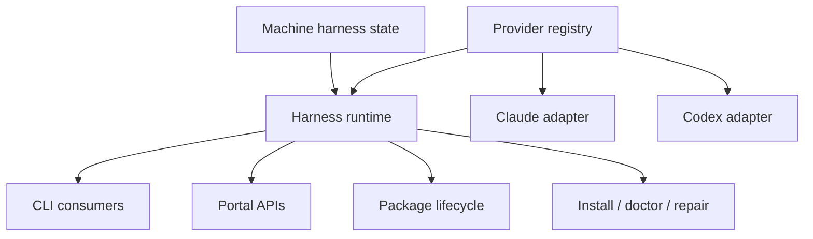
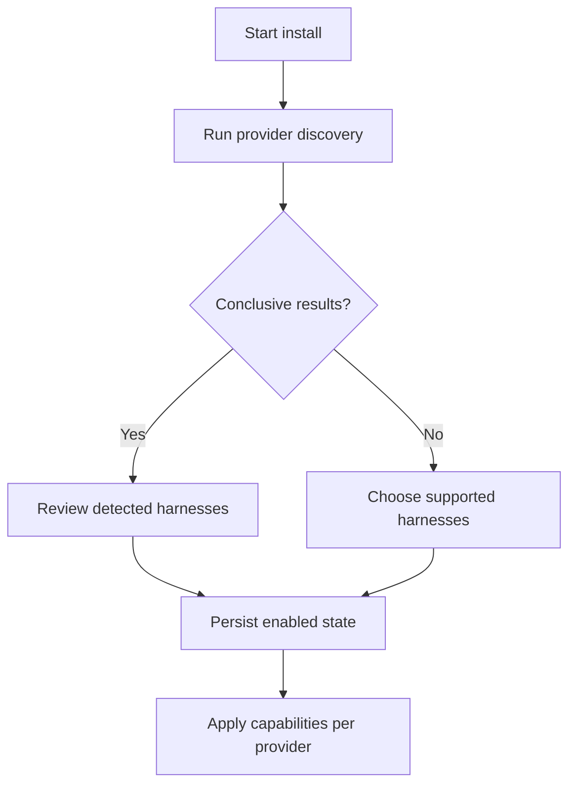

# Discoverable Harness Provider Architecture

## Summary

Replace RoboRepo's fixed Claude/Codex assumptions with an app-owned harness-provider registry and a
small adapter contract.

RoboRepo should:

- discover which supported harnesses are installed;
- retain an explicit install-workflow selection when automatic detection is inconclusive;
- expose the discovered collection to CLI and portal consumers;
- show harness choices only when the action and provider capabilities make them meaningful;
- keep harness-specific paths, parsing, rendering, installation, telemetry, and launch behavior
  inside the owning provider;
- allow a new app-owned provider to be added without adding a new branch throughout core code.

The provider collection is dynamic at runtime, but executable provider code remains shipped and
owned by RoboRepo. A user workspace may enable, disable, or configure a known provider; it must not
name an arbitrary JavaScript module for RoboRepo to execute.

## Why this work exists

RoboRepo already behaves like an abstraction over Claude Code and Codex, but the abstraction is
mostly implicit. Harness names, home directories, config formats, hook layouts, transcript
locations, telemetry parsing, and UI labels are repeated across installers, CLI modules, portal
state, tests, and generated output.

This makes a third harness expensive to add. The implementation would need to know about the new
harness in many central orchestrators even when those orchestrators only need to ask a generic
question such as:

- Which supported harnesses are installed?
- Where is this harness's active root config?
- Can this harness install skills or commands?
- How does this harness merge a package config fragment?
- Can this harness capture telemetry?
- How is one of its transcripts found and parsed?

The goal is not to pretend every harness has identical features. The goal is to give core
consumers a stable vocabulary for shared actions while providers report unsupported or
harness-specific capabilities honestly.

## Goals

- Make the installed harness collection discoverable and persisted.
- Define a versioned schema for provider identity, detection, paths, capabilities, and adapter
  bindings.
- Define a constrained, enumerated adapter interface.
- Move Claude/Codex implementation details behind their providers.
- Make CLI choices, filters, summaries, and help derive from the runtime collection.
- Make portal harness filters and configuration views derive from API data.
- Preserve native-only behavior through capabilities and provider-specific detail rather than
  flattening it.
- Keep authored source, generated output, active harness config, and machine-local state clearly
  separated.
- Add contract tests so every provider satisfies the same core invariants.

## Non-goals

- Loading executable providers from user workspaces, npm packages, or arbitrary file paths.
- Guaranteeing feature parity between harnesses.
- Replacing package manifests with provider manifests.
- Migrating every provider-specific config format into one universal config format.
- Automatically installing a detected harness.
- Treating a home directory alone as conclusive proof that a harness is usable.
- Building a public provider marketplace.
- Redesigning the Config page's harness grid axes in this implementation.
- Implementing a new third harness as part of the abstraction migration.
- Changing the telemetry event's canonical `harness` field to a different concept.

## Terminology

| Term | Meaning |
|---|---|
| Provider | RoboRepo-owned metadata and executable adapter for one supported harness |
| Supported harness | A provider included in the installed RoboRepo application |
| Discovered harness | A supported provider for which local evidence was found |
| Enabled harness | A discovered or manually selected harness RoboRepo should manage |
| Available harness | An enabled provider that can perform a requested capability |
| Unknown harness | Local evidence that does not match an app-owned provider |
| Capability | A stable, enumerated operation or surface the provider may support |
| Adapter | Executable provider methods behind the shared contract |
| Core orchestrator | Harness-neutral workflow used by CLI, portal, packages, or install logic |

## Current state

### Existing registry seed

`manifests/platform/harnesses.tsv` currently records:

```tsv
claude	claude	claude	Claude
codex	codex	codex	Codex
```

`scripts/lib/manifests-data.sh` reads those rows, but `_manifest_home_root` still maps the only valid
tokens with a fixed shell `case`, and `scripts/install/main.sh` still assigns `has_claude` and
`has_codex` independently.

This is presence metadata, not yet a provider contract.

### Fixed path maps

`scripts/cli/paths.mjs` centralizes several paths, which is useful, but its public maps still encode
the closed set:

```js
export const harnessHome = {
  claude: path.join(os.homedir(), ".claude"),
  codex: path.join(os.homedir(), ".codex"),
};
```

The same file fixes root-config baselines and active paths and exports Claude- and Codex-specific
special paths. Consumers import those maps and then branch again.

### Provider logic embedded in shared modules

Representative examples:

- `scripts/cli/package-harness-config.mjs` switches on `component.harness` and implements both
  Claude JSON status-line merging and Codex TOML status-line merging.
- `scripts/cli/root-config-merge.mjs` chooses a parser/merger with
  `harness === "codex"`.
- `scripts/cli/config.mjs` defaults invalid provider input to Claude, constructs provider-specific
  hook and live-rule paths, and recognizes fixed config IDs.
- `scripts/cli/telemetry-transcript-locate.mjs` owns both transcript directory layouts.
- `scripts/cli/telemetry.mjs` directly wires Claude and Codex telemetry hooks during the
  telemetry-only install.
- `scripts/cli/mcp.mjs`, `mcp-claude.mjs`, and `mcp-codex.mjs` expose fixed flags and dispatch.
- `scripts/cli/hook-composition.mjs`, `rules-render.mjs`, `slash-commands.mjs`,
  `skill-links.mjs`, and package lifecycle code make closed-set assumptions.
- `scripts/build/render-agent-permissions.mjs` writes three fixed Claude/Codex targets.

### Separate installers

`scripts/install/install-claude.sh` and `scripts/install/install-codex.sh` duplicate the common
install sequence around provider-specific targets. `scripts/install/main.sh`,
`scripts/install/uninstall.sh`, `scripts/install/repair.sh`, `scripts/verify-install.sh`, and
`scripts/doctor.sh` also contain direct harness branches.

The provider-specific scripts are not inherently a problem. The problem is that central
orchestration must name each one.

### Package schema

Package configuration already declares harness targets in places such as:

```json
{
  "harnesses": ["claude", "codex"]
}
```

Package components include harness-scoped hooks, commands, config fragments, and probes. Current
validators often treat Claude/Codex as the enum rather than validating IDs against a registry and
capabilities.

### Telemetry

Telemetry already stores `event.harness` as data and derives `available_harnesses` from captured
events in `scripts/cli/telemetry-analyze.mjs`. This is the most dynamic existing consumer.

However:

- capture installation is fixed to `~/.claude` and `~/.codex`;
- event normalization contains Codex-only fields in central analysis;
- transcript lookup branches between two layouts;
- session fallback behavior defaults to Claude;
- fixtures cover only Claude and Codex;
- UI labels use raw harness IDs rather than provider display metadata.

The telemetry filter itself already follows the desired display rule:
`portal/telemetry/app.js` hides the harness filter unless more than one harness is present in the
data.

### Portal Config surface

`scripts/cli/config.mjs` and `portal/config/*` shape configuration data around fixed Claude and
Codex columns and snapshots. Adding a third provider would expand the grid horizontally.

This plan makes the data dynamic without changing the axes. A follow-up should evaluate rendering
providers as rows and resource categories as columns before the provider count grows.

### Generated and authored content

The repository correctly distinguishes:

- authored shared rules under `globals/system/rules/shared/`;
- authored provider deltas under `globals/system/rules/claude/` and `codex/`;
- provider baselines and markers under `globals/harnesses/<id>/`;
- generated files under `generated/<id>/`;
- active user files under each harness home.

The provider design must preserve this source/generated boundary. Provider adapters resolve and
render those locations; they do not make active home files authoritative repository source.

### Grounding notes (reviewed at `c1ce2b9`)

Three research passes across install/paths, root-config/packages/hooks/MCP, and telemetry/portal
confirmed this section's claims are accurate, and surfaced detail worth tracking explicitly:

- **The hardcoding is not symmetric duplication in every case — some of it is genuinely asymmetric
  behavior.** `scripts/install/uninstall.sh`'s `remove_mcp_servers()` (shells to the `claude` CLI,
  prunes `~/.claude.json`) and `strip_package_hooks()` (operates only on
  `~/.claude/settings.json`) have no Codex equivalents at all, because Codex stores MCP servers in
  `config.toml` `[mcp_servers.*]` tables and hooks in a dedicated `hooks.json` sidecar rather than
  embedding either in its root config the way Claude does. The provider contract must model this as
  distinct capability results (including `unsupported`/`degraded`), not force parity or treat it as
  duplication to be collapsed.
- **Two harness enums already risk drifting from each other**: `HARNESSES` in
  `scripts/cli/package-catalog.mjs` and `SLASH_COMMAND_HARNESSES` in
  `scripts/cli/skill-command-config.mjs` are independently maintained closed sets. A single
  capability/registry source should replace both rather than migrating one and leaving the other.
- **Default-to-Claude fallbacks are wider than initially cataloged**, also present in:
  `scripts/cli/config.mjs` (`loadConfigSource`'s `harness = "claude"` default parameter),
  `scripts/cli/portal-routes-telemetry.mjs` and `portal/telemetry/api.js` (`/api/session` harness
  query param), `scripts/cli/telemetry.mjs` (transcript title lookups), and the ternary
  `harness === "codex" ? … : …` shape repeated in `root-config-merge.mjs` and
  `local-config-repair.mjs`, where every value other than the literal string `"codex"` — including
  typos and future provider IDs — silently resolves to Claude's code path.
- **No JSON Schema validator dependency and no `*.schema.json` precedent existed in this repo before
  Phase 1.** `scripts/harnesses/provider-manifest.schema.json` is the first schema file; Phase 1
  paired it with a hand-rolled structural validator in `scripts/harnesses/contract.mjs` (matching
  the repo's existing pattern of hand-written validators like `package-catalog.mjs`'s
  `validateHarness`) rather than adding a new dependency for a document-shaped check the repo can
  already express in plain JS.

## Proposed architecture

### Ownership model



The registry describes what RoboRepo supports. Machine state describes what was detected and what
the user enabled. The runtime combines both and exposes provider instances. Consumers never import
Claude or Codex adapters directly.

### Suggested source layout

```text
scripts/
  harnesses/
    contract.mjs
    registry.mjs
    discovery.mjs
    state.mjs
    provider-manifest.schema.json
    claude/
      index.mjs
      config.mjs
      hooks.mjs
      mcp.mjs
      telemetry.mjs
      transcripts.mjs
    codex/
      index.mjs
      config.mjs
      hooks.mjs
      mcp.mjs
      telemetry.mjs
      transcripts.mjs
globals/
  harnesses/
    claude/
      provider.json
      MANAGED_BY_ROBOREPO.md
    codex/
      provider.json
      config.starter.toml
      MANAGED_BY_ROBOREPO.md
```

Do not create generic `utils.mjs` buckets. Shared contract, discovery, registry, and state modules
have distinct ownership. Provider execution files split by responsibility when they approach the
repository's 150–200 line guidance.

### Provider manifest

Use JSON for declarative metadata and a RoboRepo-owned static import table for executable adapters.
The manifest is inspectable by shell, Node, the portal, packaging checks, and docs generation
without executing provider code.

Example `globals/harnesses/claude/provider.json`:

```json
{
  "$schema": "../../../scripts/harnesses/provider-manifest.schema.json",
  "schemaVersion": 1,
  "id": "claude",
  "displayName": "Claude Code",
  "commandName": "claude",
  "adapter": "claude",
  "detection": {
    "executables": ["claude"],
    "homeCandidates": ["~/.claude"],
    "configCandidates": ["~/.claude/settings.json"],
    "minimumConfidence": "probable"
  },
  "paths": {
    "home": "~/.claude",
    "rootConfig": "~/.claude/settings.json",
    "rules": "~/.claude/CLAUDE.md",
    "skills": "~/.claude/skills",
    "commands": "~/.claude/commands"
  },
  "capabilities": [
    "root-config",
    "rules",
    "skills",
    "slash-commands",
    "hooks",
    "mcp",
    "telemetry-capture",
    "telemetry-transcripts",
    "session-launch"
  ]
}
```

The actual schema must:

- reject unknown top-level keys;
- require a lowercase stable ID;
- validate capabilities against the central enum;
- keep paths declarative and home-relative;
- prohibit arbitrary executable module paths;
- distinguish required detection evidence from optional evidence;
- define whether each path is a file or directory;
- support platform-specific detection and paths without duplicating the whole provider;
- allow provider-specific metadata only under a namespaced `extensions` object.

### Trusted adapter registry

Executable bindings remain explicit:

```js
import { claudeProvider } from "./claude/index.mjs";
import { codexProvider } from "./codex/index.mjs";

const PROVIDERS = new Map([
  [claudeProvider.id, claudeProvider],
  [codexProvider.id, codexProvider],
]);

export function listProviders() {
  return [...PROVIDERS.values()];
}

export function getProvider(id) {
  const provider = PROVIDERS.get(id);
  if (!provider) throw new Error(`unsupported harness: ${id}`);
  return provider;
}
```

This is intentionally static application code. Adding an app-owned provider requires one import
and one registry row, but does not require edits to consumers.

### Capability vocabulary

Start with capabilities demonstrated by current code:

```js
export const HARNESS_CAPABILITIES = Object.freeze([
  "root-config",
  "rules",
  "permissions",
  "skills",
  "slash-commands",
  "hooks",
  "mcp",
  "package-config",
  "telemetry-capture",
  "telemetry-rate-limits",
  "telemetry-transcripts",
  "session-launch",
  "session-resume",
]);
```

Capabilities are not marketing labels. A declared capability means the adapter implements the
corresponding contract methods and passes its contract suite.

Do not define an oversized single adapter in which every method is optional. Group methods into
small capability adapters:

```js
export function defineHarnessProvider({ manifest, adapters }) {
  validateProviderManifest(manifest);
  validateCapabilityAdapters(manifest.capabilities, adapters);
  return Object.freeze({ id: manifest.id, manifest, adapters });
}
```

Example provider composition:

```js
export const claudeProvider = defineHarnessProvider({
  manifest: claudeManifest,
  adapters: {
    discovery: claudeDiscovery,
    paths: claudePaths,
    rootConfig: claudeRootConfig,
    hooks: claudeHooks,
    telemetry: claudeTelemetry,
    transcripts: claudeTranscripts,
  },
});
```

### Shared method shapes

Keep orchestration inputs and results provider-neutral:

```js
export function discoverHarnesses({ providers, environment }) {
  return providers.map((provider) => ({
    providerId: provider.id,
    ...provider.adapters.discovery.detect(environment),
  }));
}
```

```js
export function installPackageConfig({ provider, component, context }) {
  requireCapability(provider, "package-config");
  return provider.adapters.rootConfig.mergePackageComponent({
    component,
    paths: provider.adapters.paths.resolve(context),
    context,
  });
}
```

Adapter results must be structured rather than console-only:

```js
{
  ok: true,
  changed: true,
  providerId: "codex",
  action: "merge-package-config",
  paths: ["~/.codex/config.toml"],
  warnings: []
}
```

CLI formatters may print this result. Portal handlers may serialize it. Provider methods should not
emit presentation-specific text unless the operation is explicitly a streamed installer.

### Discovery model

Discovery needs multiple evidence types because a directory may remain after uninstall and an
executable may be available through a transient toolchain.

```js
{
  providerId: "claude",
  status: "detected",
  confidence: "confirmed",
  evidence: [
    { kind: "executable", value: "claude", resolvedPath: "/usr/local/bin/claude" },
    { kind: "home", value: "~/.claude" },
    { kind: "config", value: "~/.claude/settings.json" }
  ],
  warnings: []
}
```

Use these confidence rules:

| Evidence | Suggested confidence | Default behavior |
|---|---:|---|
| Executable plus recognized config/home | Confirmed | Enable by default during first install |
| Executable only | Probable | Offer selected by default; explain missing config |
| Recognized active config only | Probable | Offer; do not assume executable can launch |
| Empty home directory only | Possible | Show unselected in install workflow |
| No evidence | Absent | Hide from ordinary runtime choices |

The provider owns evidence collection; the core owns confidence normalization and state policy.

Discovery should run:

- during first install;
- when `roborepo harness refresh` is requested;
- when doctor reports stale provider state;
- after RoboRepo is upgraded with a new provider;
- when an action explicitly requests a provider not present in cached state.

Do not scan the whole filesystem. Providers declare bounded executable names and known locations.

### Persisted machine state

Store runtime selection under the machine-local `stateRoot`, not the portable workspace:

`~/.roborepo/harnesses/state.json`

```json
{
  "schemaVersion": 1,
  "lastDiscoveredAt": "2026-07-25T18:00:00.000Z",
  "providers": {
    "claude": {
      "enabled": true,
      "selectionSource": "discovery",
      "confidence": "confirmed",
      "evidence": []
    },
    "codex": {
      "enabled": true,
      "selectionSource": "user",
      "confidence": "probable",
      "evidence": []
    }
  }
}
```

`selectionSource` distinguishes `discovery`, `user`, and `migration`. Refresh must not silently
re-enable a provider the user explicitly disabled.

Do not persist absolute executable paths or sensitive command arguments unless required. Recompute
ephemeral resolved paths during refresh.

### Disable vs. withdraw

RoboRepo does not own Claude or Codex — it does not make sense for "disable" to mean the harness
stops working. `enabled: false` (Phase 2) means only "RoboRepo stops managing this provider going
forward": no future root-config writes, no skill/command linking, no hook wiring. It is a state
bit, reversible by flipping it back, and never touches a file on disk by itself.

That is a distinct, larger operation from **withdraw**: actively unmerging RoboRepo's previously
written content back out of a provider's live config — reversing what install/apply already put
there (root config keys, hook wiring, linked skills/commands, MCP entries). Withdraw is the
provider-agnostic generalization of logic that already exists asymmetrically today (see the
grounding notes: `uninstall.sh`'s `remove_mcp_servers()` and `strip_package_hooks()` are
Claude-only), so it belongs in Phase 4 alongside uninstall's provider-ization, not as a Phase 2 side
effect.

Keep the two explicitly separate operations:

- `roborepo harness disable <id>` — flips the state bit only (Phase 2, already implemented).
- `roborepo harness withdraw <id>` (Phase 4) — unmerges RoboRepo's managed content from that
  provider's live config, using the same per-capability adapter methods uninstall uses
  (`hooks.write` with removal semantics, `mcp.remove`, `rootConfig.merge` in reverse, skill/command
  unlink). Prompts or requires `--yes` by default since it mutates live files; supports `--dry-run`
  like other mutating commands in this CLI.

A flag flip must never silently rewrite live config. `disable` alone leaves existing RoboRepo
content in place (stale but inert, since RoboRepo will not touch it further); `withdraw` is the
explicit, confirmable action that actually removes it.

### Runtime queries

Core consumers should use a narrow query surface:

```js
export function createHarnessRuntime({ registry, state }) {
  function enabledProviders() {
    return registry.list().filter((provider) => state.isEnabled(provider.id));
  }

  function providersFor(capability) {
    return enabledProviders().filter((provider) =>
      provider.manifest.capabilities.includes(capability)
    );
  }

  return Object.freeze({
    enabledProviders,
    providersFor,
    get: registry.get,
  });
}
```

Rules:

- zero matches: explain how to refresh or enable a provider;
- one match: select it implicitly when the command is unambiguous;
- multiple matches in an interactive CLI: prompt;
- multiple matches in a non-interactive CLI: require `--harness <id>` when the action cannot safely
  apply to all;
- all-provider operations: iterate only providers that declare the capability;
- explicit unsupported provider: fail; never fall back to Claude.

### CLI surface

Add a harness namespace compatible with the separate CLI-surface plan:

```text
roborepo harness list
roborepo harness inspect <id>
roborepo harness refresh
roborepo harness enable <id>
roborepo harness disable <id>
```

The CLI command catalog should use a dynamic argument provider:

```json
{
  "name": "--harness",
  "values": {
    "provider": "harness.list",
    "capability": "telemetry-capture",
    "enabledOnly": true
  }
}
```

Replace closed flags such as `--only-claude` and `--only-codex` with
`--harness <id>` or repeatable `--harness <id>`. If backward compatibility is not required, remove
the old flags in the same migration rather than retaining two selection models.

Human-readable output uses `displayName`; stable command arguments and persisted data use `id`.

### Install workflow



Refactor the current `has_claude`/`has_codex` logic into a loop over discovery results. The common
installer owns sequencing; adapters or provider-scoped scripts own native actions.

Shell should consume normalized provider records emitted by Node as TSV or JSON rather than
reimplementing the provider schema. Avoid parsing complex JSON with ad hoc shell expressions.

Example:

```bash
while IFS=$'\t' read -r provider_id display_name; do
  node "${repo_root}/scripts/cli/main.mjs" harness apply "${provider_id}"
done < <(node "${repo_root}/scripts/cli/main.mjs" harness enabled --format tsv)
```

The install workflow must support one, multiple, or zero detected harnesses. Zero should install the
RoboRepo CLI and workspace safely, then explain how to enable a provider later.

### Package targeting and lifecycle

Package manifests keep stable harness IDs, but validators resolve them against the provider
registry.

Add optional capability constraints:

```json
{
  "harnesses": {
    "include": ["claude", "codex"],
    "requires": ["skills", "hooks"]
  }
}
```

Do not require every package to enumerate all future providers. Support these distinct intents:

| Intent | Representation |
|---|---|
| Works anywhere with required capabilities | `requires` only |
| Tested only on named providers | `include` plus `requires` |
| Shared component with provider overrides | shared component plus keyed override |
| Native-only package | one provider in `include` |

Provider adapters own native merge/unmerge behavior. `scripts/cli/package-harness-config.mjs`
becomes an orchestrator and no longer parses Claude JSON or Codex TOML itself.

### Rules, hooks, commands, skills, permissions, and MCP

Migrate each resource independently behind its capability contract:

| Resource | Core owns | Provider owns |
|---|---|---|
| Rules | Shared fragment selection and operation ordering | Native target, provider fragments, render shape |
| Hooks | Package hook intent and composition request | Event mapping, native config format, merge/unmerge |
| Commands | Command metadata and collision policy | Native command support, path, wrapper format |
| Skills | Shared cache ownership | Native skill directory/link behavior and metadata support |
| Permissions | Abstract allow/ask/deny behavior | Native representation and unsupported semantics |
| MCP | Server intent and selected providers | Native config store, scope mapping, add/remove |
| Root config | Conflict policy, backups, drift state | Format parse/merge/render and active/baseline paths |

The contract must allow `unsupported` and `degraded` results. For example, Codex currently lacks a
direct equivalent for some Claude permission behavior; the provider should report that rather than
the core silently translating it.

### Telemetry

Keep `harness` as the canonical provider ID on normalized events.

Split telemetry into:

1. provider capture adapter;
2. provider raw-event parser;
3. shared normalized event schema;
4. shared analysis;
5. provider transcript adapter;
6. provider-specific optional extensions.

Example parser contract:

```js
export function parseTelemetryRecord({ provider, record, context }) {
  requireCapability(provider, "telemetry-capture");
  return provider.adapters.telemetry.parse(record, context);
}
```

Provider-specific data belongs under a namespaced extension:

```json
{
  "harness": "codex",
  "event": "turn.completed",
  "details": {
    "provider": {
      "codex": {
        "rateLimits": {}
      }
    }
  }
}
```

Replace central properties such as `codex_provider_rate_limits` with either:

- a normalized rate-limit view produced only when a provider declares
  `telemetry-rate-limits`; or
- provider extension data rendered through provider metadata.

The portal should receive:

```json
{
  "availableHarnesses": [
    { "id": "claude", "displayName": "Claude Code" },
    { "id": "codex", "displayName": "Codex" }
  ]
}
```

The filter remains hidden for zero or one available harness and appears for two or more. "Available"
here means distinct harness values present in the queried telemetry data, not currently-enabled
providers — a harness disabled after producing history must stay filterable for that historical
data, so enable/disable state must never hide past events. Filtering
continues to use the stable ID in URLs and API requests.

Remove default-to-Claude behavior from `/api/session` and `portal/telemetry/api.js`. A session
request must carry a known harness ID because transcript location is provider-specific.

### Portal Config data

Return provider collections rather than fixed object keys:

```json
{
  "harnesses": [
    {
      "id": "claude",
      "displayName": "Claude Code",
      "enabled": true,
      "capabilities": ["root-config", "rules", "hooks"],
      "configEntries": []
    }
  ]
}
```

The browser renders the array. It must not contain `if (harness === "codex")` presentation logic.
Provider-specific labels, source paths, availability, and warnings come from the server view model.

For the initial migration, preserve the existing grid orientation but generate columns from the
array. Record the axes change as explicit follow-up work.

### Harness management panel

Add a panel below the existing Claude/Codex grid (Phase 7) showing, per provider: discovery status
(`detected`/`absent`), confidence, evidence (what RoboRepo found and where), and RoboRepo's managed
state (enabled/disabled). This is the GUI form of `roborepo harness list`/`inspect` — same runtime
data, no new backend concept.

Include the withdraw action (see "Disable vs. withdraw" above) here, not on the main grid: it is
infrastructure-level and mutates live config, so it belongs in a clearly separate, lower-attention
part of the page rather than beside routine per-resource toggles.

Bottom placement is deliberate — this panel is for occasional harness lifecycle management, not the
frequent interactions the top grid supports.

### Portal and CLI selection rule

Use the same rule everywhere:

| Runtime providers relevant to action | Behavior |
|---:|---|
| 0 | Explain that no enabled provider supports the action |
| 1 | Do not show a redundant selector; use that provider |
| 2+ | Show filter/selector with “All” only when the operation supports all-provider execution |

Filtering telemetry is safe across all providers. Mutating root config may require one explicit
provider at a time. The UI must derive whether “All” is valid from action metadata, not assume it.

### API validation

Every server route accepting a harness must:

- reject unknown provider IDs;
- reject disabled providers for mutations;
- verify the requested capability;
- never coerce an invalid value to Claude;
- return a structured error with valid choices.

Example:

```js
export function resolveRequestProvider(runtime, id, capability) {
  const provider = runtime.get(id);
  requireEnabledProvider(runtime, provider.id);
  requireCapability(provider, capability);
  return provider;
}
```

### Migration compatibility

Existing persisted telemetry and package manifests already use stable `claude` and `codex` IDs, so
they do not need identifier migration.

On first run:

- create provider state from current presence checks;
- mark the selection source as `migration`;
- preserve existing active configurations;
- do not re-run merge operations merely to populate state;
- retain current generated directory names;
- warn on package harness IDs for which no provider is installed in this RoboRepo version.

## Implementation plan

### Phase 1: Contract and schemas

- [x] Add the provider manifest JSON Schema. `scripts/harnesses/provider-manifest.schema.json`.
- [x] Add the capability enum and capability-to-required-method mapping.
  `scripts/harnesses/contract.mjs` (`HARNESS_CAPABILITIES`, `CAPABILITY_REQUIRED_METHODS`).
- [x] Define structured action, warning, unsupported, and error result schemas.
  `scripts/harnesses/schemas.mjs` (`validateAdapterActionResult`, `unsupported`/`degraded` status).
- [x] Define discovery result and persisted harness-state schemas. `scripts/harnesses/schemas.mjs`
  (`validateDiscoveryResult`, `validateHarnessState`).
- [x] Add manifest fixtures for Claude, Codex, invalid IDs, invalid capabilities, missing adapter
  bindings, and extension fields. `scripts/test/fixtures/harnesses/`.
- [x] Add app-owned Claude and Codex provider manifests without changing current behavior.
  `globals/harnesses/claude/provider.json`, `globals/harnesses/codex/provider.json` — data-only,
  no consumer reads them yet.
- [x] Validate provider manifests in `doctor`, packaging verification, and the main test suite.
  `scripts/doctor.sh` (`check_harness_manifests`), `scripts/test/harness-manifest-check.mjs`, wired
  into `test-roborepo.sh` and `npm run test:harness-manifest`.

### Phase 2: Registry, state, and discovery

- [x] Add the trusted static adapter registry. `scripts/harnesses/registry.mjs`
  (`listHarnessProviders`, `getHarnessProvider`, `hasHarnessProvider`) — static
  `claude`/`codex` adapter map, stub adapter bodies for capabilities not yet migrated
  (`scripts/harnesses/stub-adapter.mjs`, `scripts/harnesses/{claude,codex}/index.mjs`).
- [x] Add provider definition validation at startup/test time. `scripts/doctor.sh`
  (`check_harness_registry`, constructs the real registry), `npm run test:harness-registry`
  (`scripts/test/harness-registry-check.mjs`), wired into `test-roborepo.sh`.
- [x] Implement bounded executable, home, and config evidence helpers.
  `scripts/harnesses/discovery.mjs` (`collectEvidence`, `resolveExecutable` via
  `which`/`where`, home-relative existence checks — never a filesystem scan).
- [x] Implement normalized discovery confidence. `scripts/harnesses/discovery.mjs`
  (`normalizeConfidence`, `detectHarnessProvider`) — matches the plan's confidence table.
- [x] Persist enabled state under `stateRoot`. `scripts/cli/state-paths.mjs`
  (`harnessStatePath` = `~/.roborepo/harnesses/state.json`), `scripts/harnesses/state.mjs`
  (`readHarnessState`/`writeHarnessState`).
- [x] Preserve explicit disable choices across refresh. `scripts/harnesses/state.mjs`
  (`applyDiscoveryToState` keeps `selectionSource: "user"` + `enabled: false` across a
  discovery merge); covered by `harness-registry-check.mjs` and `harness-cli-check.mjs`.
- [x] Add `harness list`, `inspect`, `refresh`, `enable`, and `disable`. `scripts/cli/harness.mjs`
  + `manifests/platform/cli/command-definitions/harness/*.json`.
- [x] Add zero-, one-, and multi-provider CLI behavior tests.
  `scripts/test/harness-registry-check.mjs` (module-level, synthetic third provider proves no
  hardcoded two-provider assumption), `scripts/test/harness-cli-check.mjs` (real CLI process,
  `npm run test:harness-cli`).

### Phase 3: Paths and config adapters

- [x] Replace exported fixed path maps in `scripts/cli/paths.mjs` with provider path resolution.
  `scripts/harnesses/paths.mjs` (`resolveHarnessPath`, `hasHarnessPath`) resolves manifest paths;
  `paths.mjs`'s `harnessHome`/`rootConfigActive`/`claudeJsonPath`/`codexHooksPath` now derive from
  the registry (`pathById()`), keeping the exact same plain-object-keyed-by-id export shape so
  every existing consumer (12 files) is unaffected. `rootConfigBaseline` stays hardcoded — it is
  repo build output (`generated/<id>/...`), not a harness home-relative location the manifest
  models.
- [x] Move Claude JSON merge/render behavior into the Claude provider.
  `scripts/harnesses/claude/index.mjs` `adapters.rootConfig.merge`/`.render` wrap the existing,
  characterization-tested `mergeClaudeSettings`/`normalizeRootConfigContent` — ownership moved
  behind the contract without re-porting the implementation.
- [x] Move Codex TOML merge/render behavior into the Codex provider.
  `scripts/harnesses/codex/index.mjs`, same pattern (`mergeCodexConfig`/`normalizeRootConfigContent`).
- [x] Fixed a real default-to-Claude bug while wiring this: `mergeRootConfig`'s dispatch was a bare
  `harness === "codex" ? codex : claude` ternary, so any unrecognized harness string silently
  mis-merged as Claude. Now throws `unsupported harness: <id>`. Pinned in
  `scripts/test/root-config-merge-characterization-check.mjs`.
- [x] Added `scripts/test/root-config-merge-characterization-check.mjs` as a pre-refactor safety
  net: pins `mergeClaudeSettings`/`mergeCodexConfig`'s exact behavior (TOML comment reattachment —
  including the actual current behavior that a shared key's LOCAL comment is dropped in favor of
  the repo's, not a guessed "correct" behavior — bracket-in-value sections, permissions
  allow/deny dedupe, the Claude-only `model` key strip) so the refactor was checked byte-for-byte.
  Wired into `test-roborepo.sh` / `npm run test:root-config-merge-characterization`; kept
  permanently as a regression guard, matching the repo's existing characterization-test convention
  (`system-package-ownership-characterization-check.mjs`).
- [x] Fixed 3 test sandboxes in `test-roborepo.sh` (`pkg_app`, `new_harness`, `mcp_harness`) that
  copied only `scripts/cli/` into an isolated temp root — `paths.mjs` now reaches into
  `scripts/harnesses/` and `globals/harnesses/`, so those sandboxes now copy those directories too.
  Caught by `cli-surface-integration-check.mjs` failing in the full suite (not by the targeted
  checks, which don't build an isolated sandbox).
- [ ] Refactor `root-config-state.mjs` and `local-config-repair.mjs` to accept resolved providers.
  Not yet done: both already iterate `Object.keys(rootConfigActive)` (now registry-derived, so
  already provider-count-agnostic in practice), but `local-config-repair.mjs`'s
  `diffConfigKeys`/`harness === "codex" ? diffTomlKeys : diffJsonKeys` ternary is a real
  default-to-JSON-diff gap for an unrecognized harness, lower severity than the merge dispatch bug
  (read-only diff display, not a write-path correctness bug) but still open.
- [x] Refactor `package-harness-config.mjs` into a short orchestrator.
  `mergeHarnessConfig`/`unmergeHarnessConfig` now read the component config once and dispatch to
  `getHarnessProvider(component.harness).adapters.rootConfig.mergePackageComponent`/
  `unmergePackageComponent` (added to the Phase 1 contract's `package-config` capability, which
  previously required only `mergePackageComponent`) instead of branching on
  `component.harness === "claude"/"codex"`. Claude's status-line logic moved to
  `scripts/harnesses/claude/index.mjs`; Codex's TOML table/array/scalar helpers and ownership-scalar
  logic moved to `scripts/harnesses/codex/index.mjs`. Added
  `scripts/test/package-harness-config-characterization-check.mjs` as the pre-refactor safety net
  (Claude statusLine conflict preservation, Codex TUI status_line dedupe/table-creation-from-scratch,
  color-scalar ownership-provenance round-trip) — all pass unchanged post-refactor.
- [x] Fixed a second real import-cycle discovered while doing this:
  `scripts/cli/paths.mjs` (registry-dependent since the path-resolution item above) is imported,
  directly or transitively, by nearly every root-config module a provider adapter would naturally
  need (`state-paths.mjs` for `stateRoot`, `root-config-writes.mjs` for `writeRootConfig`). Any of
  those imported from inside `claude/index.mjs`/`codex/index.mjs` cycles back through
  `registry.mjs` into the importing module itself. Fixed at the root: split `paths.mjs`'s
  registry-independent basics (`appRoot`/`stateRoot`/`workspaceRoot`/workspace scaffolding) into a
  new leaf module, `scripts/cli/roots.mjs`, with zero harness-registry dependency; `paths.mjs`
  re-exports everything from it unchanged, so none of the 12+ existing consumers see any
  difference. `state-paths.mjs` now imports `stateRoot` from `roots.mjs` directly. Provider adapters
  needing `writeRootConfig` (which still routes through the registry-dependent half of `paths.mjs`)
  return `{ changed, content }` instead of writing directly; the orchestrator
  (`package-harness-config.mjs`), which sits above both the provider and `paths.mjs` in the
  dependency graph, performs the actual write — this is also a cleaner separation of concerns
  (provider computes; core orchestrator decides how/whether to persist).
- [x] Refactor `root-config-state.mjs` and `local-config-repair.mjs` to accept resolved providers.
  Both already iterate `Object.keys(rootConfigActive)` (now registry-derived, so already
  provider-count-agnostic). Fixed `local-config-repair.mjs`'s `diffConfigKeys` — same
  default-to-Claude-shaped bug as `mergeRootConfig` (silently fell through to the JSON diff path for
  any unrecognized harness); now throws `unsupported harness: <id>`.
- [x] Ensure backup, conflict, drift, and restore state remains keyed by stable provider ID.
  `root-config-state.mjs` confirmed already keyed by an opaque harness-id string with no branching —
  no code change needed.
- [x] Add round-trip and conflict tests per provider beyond the characterization checks above.
  `scripts/test/harness-package-config-roundtrip-check.mjs`: authors a package config, enables
  (merge), disables (unmerge), re-enables, and asserts final state matches first-enable state
  byte-for-byte, for both Claude and Codex, plus a Codex case with an unowned neighbor `status_line`
  entry that must survive the whole cycle untouched (conflict/coexistence case). Wired as
  `npm run test:harness-package-config-roundtrip` and into `test-roborepo.sh`.

### Phase 4: Install, uninstall, verify, doctor, and repair

- [x] Make Node provider discovery the source consumed by shell installers.
  Added `roborepo harness detected` (`scripts/cli/harness.mjs`'s `harnessDetected`, backed by the
  provider registry) as the row source: `id<TAB>homePath<TAB>present<TAB>displayName<TAB>
  rootConfigPath`. `scripts/lib/manifests-data.sh`'s `harness_present`/new `harness_detected_rows`
  shell to it (cached once per process, no associative arrays — this repo's shell targets bash 3.2
  / macOS system bash), falling back to a plain home-dir check when `scripts/cli/`/`scripts/
  harnesses/` aren't present (sandbox safety). Retired `manifests/platform/harnesses.tsv`, the
  second hardcoded harness enum the grounding notes flagged as a drift risk. Presence is
  deliberately strict (home-dir existence only, not discovery's broader executable-on-PATH
  signal) so this is a behavior-preserving swap — see
  `docs/plans/backlog/harness-presence-signal-expansion-plan.md` for broadening it later.
- [x] Replace `has_claude`/`has_codex` with provider iteration.
  `scripts/install/main.sh` now builds `present_harness_ids`/`present_harness_rows`/
  `all_harness_rows` from `harness_detected_rows` and loops over them for skill linking,
  root-config export, and the summary; `has_claude`/`has_codex` booleans stay as derived
  convenience flags for the two remaining early-exit checks, not as the source of truth.
- [ ] Retain provider-scoped shell scripts only where they implement native execution.
- [x] Make base-skill linking iterate providers with the `skills` capability.
  `main.sh`'s "Base Skill" section loops `present_harness_rows` instead of two `[[ $has_X -eq 1 ]]`
  branches.
- [x] Make post-install config export iterate providers with `root-config`.
  `main.sh` derives each provider's `generated/<id>/<basename>` source path from `harness
  detected`'s `rootConfigPath` column (basename convention) instead of hardcoding
  `claude/settings.json`/`codex/config.toml` as a literal pair.
- [x] Make summary output derive from provider display metadata.
  The "Core Install Complete" section prints one line per row in `all_harness_rows`, using each
  provider's manifest `displayName`, instead of two hardcoded `echo` lines.
- [x] Refactor Windows installer provider detection and paths through the same manifest data.
  `install-windows.ps1`'s hardcoded `$hasClaude`/`$hasCodex` detection, `Get-PresentHarnesses`,
  and the per-harness install/summary blocks now iterate a `$KnownHarnessIds` array + a
  `$HarnessPresence` hashtable instead of parallel booleans and two copy-pasted `if` blocks. Not
  yet derived from the Node provider registry the way the bash installers are (`harness_detected_rows`)
  — Claude's Windows home (`%APPDATA%\Claude`) is an absolute environment-variable path, not
  `~`-relative like every other platform, and `scripts/harnesses/paths.mjs`'s `expandHome()` has no
  token for that. Modeling it properly needs a provider-manifest schema change (a `platforms.win32`
  path override plus a new path-expansion form), left as follow-up rather than bundled into this
  iteration-only pass. Verified with PowerShell 7.7-preview (no Windows machine available): the
  file's AST parses clean via `[System.Management.Automation.Language.Parser]::ParseFile`, and the
  detection/`Get-PresentHarnesses`/summary logic was dry-run in isolation (dot-sourced function
  definitions, mocked `$env:APPDATA`/`$env:USERPROFILE`) against both a Claude-only and an
  unknown-harness-id scenario.
- [x] Refactor uninstall to provider iteration; add `harness withdraw`.
  `scripts/install/uninstall.sh`'s hardcoded `.claude`/`.codex` pairs (`check_no_active_remnants`,
  `remove_skill_links` call sites, `remove_install_backups`, `assert_under_harness_home`'s security
  allowlist) now iterate `harness_detected_rows`. Extracted the file's reusable functions into a new
  sourceable `scripts/install/uninstall-lib.sh` (matching the `install-lib.sh`/`manifests-data.sh`
  convention) so both `uninstall.sh` and the new `scripts/install/withdraw.sh` can share them.
  Migrated `remove_mcp_servers`/`strip_package_hooks`'s real logic into real Claude provider
  adapters (`mcp.remove`, `hooks.write` with removal semantics —
  `scripts/harnesses/claude/index.mjs`, replacing the throwing stubs), each with a dedicated
  characterization test
  (`scripts/test/harness-{mcp-remove,hooks-write-remove}-characterization-check.mjs). Codex has no
  adapter for either capability yet (asymmetric — separate `hooks.json` sidecar and `config.toml`
  `[mcp_servers.*]` tables, matching the grounding notes). Added `roborepo harness withdraw <id>
  [--dry-run] [--yes]` (`scripts/install/withdraw.sh`, wired as a `repoScript` command like
  `maintenance uninstall`): actively unmerges RoboRepo's content from ONE provider's live config,
  reusing `uninstall-lib.sh`'s functions scoped to that provider, reporting `hooks.write`/
  `mcp.remove` as unsupported for a provider that lacks the adapter rather than silently
  no-opping. Prompts for confirmation unless `--yes`; requires `--yes` or `--dry-run` in a
  non-interactive shell. Distinct from `harness disable` (Phase 2, state-bit only, never touches
  files) per the plan's "Disable vs. withdraw" section.
- [ ] Refactor repair, verify, and doctor to provider iteration.
- [x] Test zero, Claude-only, Codex-only, both, disabled, stale-home, and executable-only scenarios.
  Added dedicated `main.sh` presence scenarios to `test-roborepo.sh`: zero harnesses present,
  Claude-only, Codex-only (each asserting no crash, correct summary line, and correct base-skill
  linking), alongside "both" coverage every other install scenario in the file already exercised.
  The zero-harness scenario caught a real bug introduced earlier in this Phase 4 pass:
  `main.sh` iterated `"${present_harness_rows[@]}"`/`"${present_harness_ids[*]}"` with no
  length guard, and this repo's target bash (3.2, macOS system bash) throws "unbound variable"
  under `set -u` when expanding an empty array with `[@]` or `[*]` — fixed by guarding every such
  expansion with `${#arr[@]} -gt 0` first (`main.sh`'s `has_claude`/`has_codex` derivation and its
  three `present_harness_rows`/`all_harness_rows` loops). Audited every other file touched in this
  phase (`uninstall.sh`, `uninstall-lib.sh`, `withdraw.sh`, `repair.sh`, `doctor.sh`) for the same
  pattern — none of the others had it (they use `while read` over process substitution rather than
  array iteration, or were already guarded). "Disabled" and "stale-home" scenarios are already
  covered by existing suites (`harness-cli-check.mjs`'s enable/disable round-trip;
  `test-roborepo.sh`'s relocation-resilient uninstall/repair blocks). "Executable-only" (a harness
  binary on PATH with no home directory) is intentionally out of scope for install/uninstall/repair
  per the strict-presence decision — see `harness-presence-signal-expansion-plan.md`.

### Phase 5: Package resources

- [x] Change package harness validation from a hardcoded enum to registry lookup.
  `scripts/cli/package-catalog.mjs`'s `validateHarness`/`validateHarnesses` now call
  `hasHarnessProvider()` (`scripts/harnesses/registry.mjs`) instead of a local
  `HARNESSES = new Set(["claude", "codex"])`. Added
  `scripts/test/package-catalog-harness-check.mjs` as the characterization/regression test (wired
  into `test-roborepo.sh` and `npm run test:package-catalog-harness`): pins rejection of an
  unregistered harness id and acceptance of registered ones. Left `SLASH_COMMAND_HARNESSES`/
  `SLASH_COMMAND_HARNESS_NAMES` (`scripts/cli/skill-command-config.mjs`) untouched here — that map
  is slash-command render data (genDir/liveDir/skillPath per harness), not a validation enum, so it
  belongs to the "slash-command rendering through provider command adapters" item below, not this
  one. Fixed two sandbox gaps this surfaced (mirroring Phase 3/4's `paths.mjs -> registry.mjs ->
  globals/harnesses/` pattern): `package-catalog-check.mjs`'s dev-mode `package dev create`
  subprocess sandbox now copies `globals/harnesses/` alongside `scripts/`.
- [x] Add capability requirements to package schema.
  Design decision (confirmed with user after reviewing real packages): package-level
  `requires`/`include` targeting from the plan's original example was NOT needed and was NOT
  built. Evidence: `caveman`'s `plugin` resource (Claude-only, no `harness` field -- implied by
  resource type) sits alongside a `hooks` resource explicitly scoped `harness: "codex"` in the SAME
  package; `jcodemunch` similarly mixes an unscoped `mcp` resource with Claude-only `permissions`
  and Codex-only `codex_tool_approvals`. Per-resource (or type-implied) targeting was already the
  real shape of every existing package -- a package-level blanket `requires` can't express "this
  resource is Claude-only, that resource is Codex-only, same package," so it was dropped rather
  than built and left unused. What shipped instead: `validateHarness`/`validateHarnesses`
  (`package-catalog.mjs`) now take an optional `requiredCapability` and check it against
  `getHarnessProvider(harness).manifest.capabilities` -- so a `hooks` resource targeting a harness
  whose manifest doesn't declare the `hooks` capability now fails package validation instead of
  silently no-opping at install time. Wired at every existing harness-targeting call site: hooks
  (`"hooks"`), harness-config (`"package-config"`), slash-command/entrypoint `harnesses` arrays
  (`"slash-commands"`), rules (`"rules"`, still via the existing `allowBoth`/`"both"` shape, not
  newly made optional -- see next item's note). With today's two providers declaring the same
  capability set this never fires yet; proven with a fabricated codex manifest (capabilities minus
  `"hooks"`) run in a subprocess against a copied `scripts/`/`globals/harnesses/` tree, since
  `scripts/harnesses/{claude,codex}/index.mjs` resolve their `provider.json` relative to their own
  `import.meta.url`, never via `ROBOREPO_APP_ROOT` -- an in-process re-import from the same test
  file resolves the cached first-import's `roots.mjs`/`paths.mjs`, not the edited manifest, so this
  needed a real subprocess with its own copied tree. Same
  `scripts/test/package-catalog-harness-check.mjs` test file as the item above.
- [ ] Refactor hook composition through provider hook adapters.
- [ ] Refactor rules rendering through provider rule targets.
- [ ] Refactor slash-command rendering and collision checks through provider command adapters.
- [ ] Refactor skill linking through provider skill paths.
- [ ] Refactor permission rendering through provider permission adapters.
- [ ] Refactor MCP add/remove/list/scope mapping through provider MCP adapters.
- [ ] Replace `--only-claude`/`--only-codex` with repeatable `--harness`.
- [ ] Add package lifecycle contract fixtures for supported, unsupported, and degraded capabilities.

### Phase 6: Telemetry

- [ ] Move capture wiring into provider telemetry adapters.
- [ ] Move raw Claude and Codex parsing into provider adapters.
- [ ] Keep normalized analysis independent of the provider count.
- [ ] Normalize rate-limit capability or namespace provider-specific rate-limit extensions.
- [ ] Move transcript roots, location, and parsing into transcript adapters.
- [ ] Reject missing/unknown harness IDs in session lookup instead of defaulting to Claude.
- [ ] Return provider display metadata with available telemetry harnesses.
- [ ] Keep filters hidden when fewer than two harnesses exist.
- [ ] Add a synthetic third-provider fixture to prove the shared analysis and filter do not encode a
  two-provider assumption.

### Phase 7: CLI and Config portal

- [ ] Add dynamic harness argument providers to the CLI catalog.
- [ ] Scope choices by enabled state and required capability.
- [ ] Update root help and provider summaries from registry metadata.
- [ ] Change Config API objects keyed by `claude`/`codex` into provider arrays.
- [ ] Generate Config grid columns from API data.
- [ ] Move provider-specific presentation strings into server view models.
- [ ] Add one-provider, two-provider, and synthetic-three-provider Config UI tests.
- [ ] Confirm mutations reject unsupported capabilities and unknown IDs.

### Phase 8: Build outputs and documentation

- [ ] Refactor `render-rules.sh`, `render-agent-permissions.mjs`,
  `render-slash-commands.mjs`, and source-file verification around provider targets.
- [ ] Keep generated outputs under `generated/<provider-id>/`.
- [ ] Update `manifests/platform/manifest.tsv`, `rule-targets.tsv`, `verify-content.tsv`, and
  `source-files.tsv`, or replace overlapping provider columns with provider manifests.
- [ ] Remove `manifests/platform/harnesses.tsv` only after all shell consumers migrate.
- [ ] Update architecture, installation, telemetry, package, skills/commands, and daily-use docs.
- [ ] Generate or validate provider reference documentation from manifests.
- [ ] Run a repository-wide fixed-harness search and classify every remaining occurrence as
  provider implementation, fixture, documentation example, or migration defect.

## Code touchpoint inventory

This is the minimum migration inventory found at the reviewed commit. Each phase must repeat
repository-wide discovery because later work may add callers.

| Area | Current touchpoints |
|---|---|
| Provider metadata | `manifests/platform/harnesses.tsv`, `scripts/lib/manifests-data.sh` |
| Shared paths | `scripts/cli/paths.mjs`, `state-paths.mjs` |
| Installation | `scripts/install/main.sh`, `install-claude.sh`, `install-codex.sh`, `install-windows.ps1`, `install-lib.sh`, `state-lib.sh` |
| Maintenance | `scripts/install/uninstall.sh`, `repair.sh`, `scripts/verify-install.sh`, `scripts/doctor.sh` |
| Root config | `config.mjs`, `root-config-merge.mjs`, `root-config-state.mjs`, `root-config-writes.mjs`, `root-config-view.mjs`, `local-config-repair.mjs` |
| Packages | `package-catalog.mjs`, `packages.mjs`, `package-commands.mjs`, `package-harness-config.mjs`, `package-probes.mjs`, package `package.config.json` files |
| Hooks | `hook-composition.mjs`, `globals/system/hooks/<id>/`, package `hooks-<id>.json` files |
| Rules | `rules-render.mjs`, `scripts/build/render-rules.sh`, `manifests/platform/rule-targets.tsv`, `globals/system/rules/<id>/` |
| Permissions | `permissions-render.mjs`, `scripts/build/render-agent-permissions.mjs`, `manifests/inventory/agent-permissions.json` |
| Skills/commands | `skill-links.mjs`, `skills.mjs`, `slash-commands.mjs`, `skill-new-options.mjs`, `scripts/build/link-skills.sh`, `render-slash-commands.mjs` |
| MCP | `mcp.mjs`, `mcp-parse.mjs`, `mcp-config.mjs`, `mcp-claude.mjs`, `mcp-codex.mjs`, `mcp-presets.mjs`, `manifests/inventory/mcp-servers.json` |
| Telemetry capture | `telemetry.mjs`, `telemetry-capture.mjs`, `telemetry-schemas/*`, `globals/packages/telemetry/` |
| Telemetry analysis | `telemetry-analyze.mjs`, `telemetry-metrics.mjs`, `telemetry-policy.mjs`, `telemetry-insights.mjs`, `telemetry-compare.mjs` |
| Transcripts | `telemetry-transcript.mjs`, `telemetry-transcript-locate.mjs` |
| Telemetry API/UI | `portal-routes-telemetry.mjs`, `portal/telemetry/*` |
| Config API/UI | `config.mjs`, `config-source-lookup.mjs`, `config-source-render.mjs`, `config-dashboard.mjs`, `portal-routes-config.mjs`, `portal/config/*` |
| CLI discovery | `manifests/platform/cli-commands.json`, `scripts/cli/index.mjs`, `main.mjs`, `config-cli-print.mjs` |
| Build/packaging | `manifests/platform/{manifest,source-files,verify-content,presets}.tsv`, `scripts/build/*`, `package.json` |
| Tests | install collision tests, package lifecycle/catalog tests, root-config tests, hook tests, MCP tests, telemetry fixtures/checks, portal state checks |

## Validation

### Contract

- Every provider manifest passes schema validation.
- Every declared capability has its required adapter methods.
- Undeclared adapter capabilities are rejected or explicitly marked internal.
- Duplicate IDs and unknown adapter binding IDs fail fast.
- A workspace cannot inject an executable adapter path.

### Discovery and state

- Executable plus native config is detected as confirmed.
- Executable-only and config-only evidence produce the documented confidence.
- An empty old home directory is not silently enabled.
- Explicitly disabled providers remain disabled after refresh.
- Adding an app-owned synthetic provider requires no consumer changes.
- Zero detected providers leaves the RoboRepo CLI usable.

### Behavior

- Claude-only and Codex-only installs preserve current generated and active output.
- Dual-provider installs remain idempotent.
- Package enable/disable/reconcile produces the same Claude and Codex native files as before the
  refactor.
- Unsupported capabilities produce actionable structured output.
- Explicit unknown harness IDs fail rather than falling back.

### Portal and CLI

- A selector is hidden for one relevant provider.
- A selector appears for two or more relevant providers.
- “All” appears only for all-provider-safe operations.
- Stable IDs are used in commands and URLs; display names are used in labels.
- Config and Telemetry render a synthetic third provider without source changes.

### Repository-native checks

Run the existing commands defined in `package.json`, including the main test suite and relevant
focused checks. At minimum:

```bash
npm test
node scripts/test/package-lifecycle-check.mjs
node scripts/test/hook-composition-check.mjs
node scripts/test/telemetry-correctness-check.mjs
node scripts/test/telemetry-portal-state-check.mjs
node scripts/test/root-config-state-check.mjs
./scripts/build/render-rules.sh --check
node scripts/build/render-agent-permissions.mjs --check
./scripts/doctor.sh
```

Use the exact current script names at implementation time; do not add substitute lint or typecheck
commands that the repository does not define.

### Final fixed-assumption audit

The remaining hits from searches such as these must be reviewed:

```bash
rg -n 'has_claude|has_codex|only-claude|only-codex' scripts portal modules
rg -n 'harness === "claude"|harness === "codex"' scripts portal modules
rg -n '\["claude", "codex"\]' scripts portal modules manifests
rg -n '~/.claude|~/.codex' scripts portal modules
```

Valid remaining hits should be limited to:

- Claude or Codex provider implementation;
- provider-specific fixtures;
- migration documentation;
- user-facing examples explicitly about that provider.

## Risks and mitigations

| Risk | Mitigation |
|---|---|
| Adapter becomes a large optional-method object | Split by enumerated capability and validate required methods |
| Declarative provider loading permits code injection | Keep executable bindings in a static app-owned registry |
| Discovery mistakes stale files for an install | Collect multiple evidence types and preserve confidence |
| Refresh overrides user intent | Persist selection source and preserve explicit disables |
| Universal schema erases native features | Use capabilities plus namespaced provider extensions |
| Core still accumulates provider branches | Add a synthetic third provider to contract and consumer tests |
| Shell and Node disagree about provider data | Make Node emit normalized provider rows consumed by shell |
| Refactor changes active user config | Characterize current output and compare provider adapter output byte-for-byte |
| Package “all harnesses” silently includes an untested provider | Distinguish capability-based targeting from explicit tested-provider inclusion |
| Config grid becomes too wide | Keep dynamic data now; handle axis orientation in the follow-up below |
| Provider-specific telemetry leaks into shared schema | Normalize shared fields or namespace extensions |
| Broad migration becomes unreviewable | Land vertical phases with contract tests and output characterization |
| Naming collision with `localhoster-docker-process-providers`' unrelated provider/capability vocabulary | Use `harnessProvider`/`harnessCapabilities` explicitly throughout; do not build a shared generic provider framework — the two contracts and lifecycles are unrelated |

## Follow-up work

### Config grid orientation

After the API returns a provider array, evaluate flipping the Agents/Config homepage grid:

- current: one column per harness;
- candidate: one row per harness, with stable resource/category columns;
- alternative: harness selector with one provider detail view.

Base the decision on actual content density with one, two, and three providers. Do not block the
provider abstraction on this presentation change.

### Third-provider proof

After the migration, implement one real third provider in a separate plan. The synthetic provider
proves contract independence but does not test real native configuration complexity.

### External provider ecosystem

Only after multiple app-owned providers validate the contract should RoboRepo evaluate signed or
third-party provider distribution. That requires a separate trust, compatibility, sandboxing, and
versioning design.

## Open questions

1. Should a provider detected with `possible` confidence appear in ordinary CLI/portal filters
   before the user enables it, or only in `harness list` and install review?
2. Should capability-only package targeting include newly added providers automatically, or require
   an explicit package schema opt-in such as `futureProviders: true`?
3. Should provider discovery consider native application bundles on macOS when no CLI executable is
   on `PATH`, or are known config/home paths sufficient for the currently supported terminal
   harnesses?

These do not block Phase 1. They must be resolved before discovery-selection policy and
capability-only package targeting are finalized.
