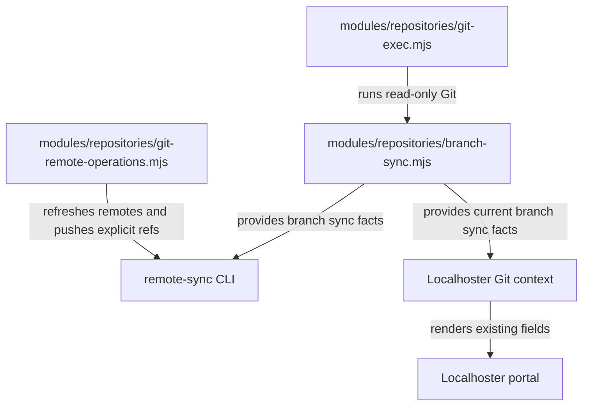
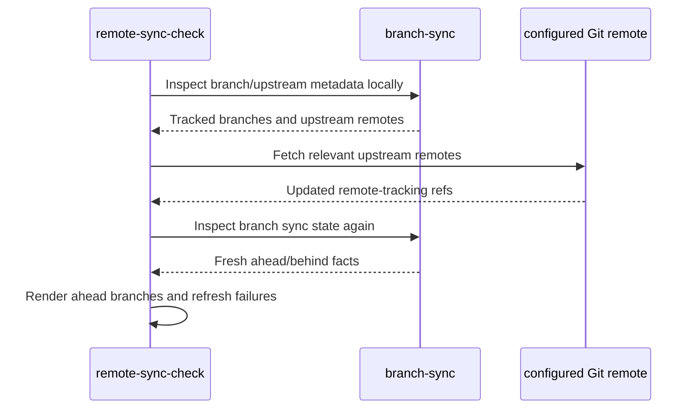
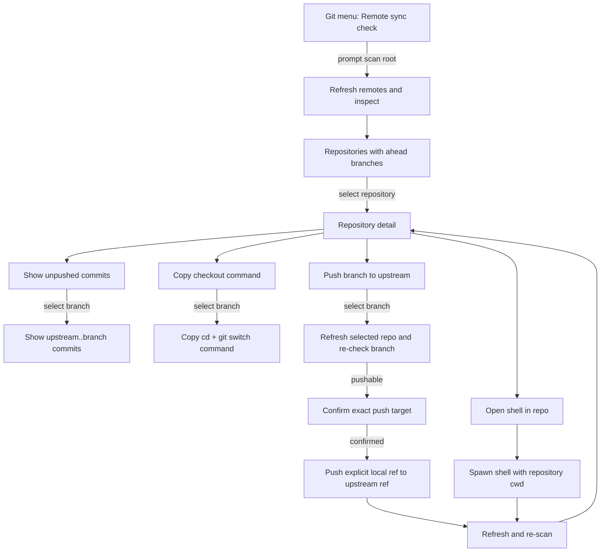

# Verify Local Commits Against Fresh Remote State

## Summary

Refocus `roborepo git remote-sync-check` as a local-commit safety check: refresh the configured remotes, then report local tracked branches that still contain commits not present on their upstream branch.

The branch/upstream/ahead/behind calculation should move into `modules/repositories/` as shared repository-domain logic. The CLI will consume all tracked branches from that service. Localhoster will consume the same service for its current-branch ahead/behind data while preserving its existing portal presentation and its existing no-network refresh behavior.

The CLI's interactive path should remain compact and repository-first. Selecting a repository exposes four actions: show unpushed commits, open a shell in the repository, copy a checkout command, or push a selected branch to its configured upstream after explicit confirmation.

## Context

The command exists to answer a safety question before work is left behind on a machine:

> Which tracked local branches still contain committed work that has not reached their remote upstream?

The important Git terms are:

| Term | Meaning in this plan |
| --- | --- |
| Local branch | A ref under `refs/heads/` in the local repository. |
| Upstream | The branch's configured tracking target, such as `origin/main`. |
| Remote-tracking ref | The local cached ref representing the last fetched state of an upstream branch. |
| Ahead | Commits reachable from the local branch but not from its upstream ref. |
| Behind | Commits reachable from the upstream ref but not from the local branch. |
| Fresh comparison | Ahead/behind calculated after the CLI successfully refreshes the relevant remote refs. |

A GitHub API call is not required. Git already stores local branches, configured upstreams, remote-tracking refs, and commit objects. The comparison is a local Git graph operation. The CLI only needs network access to run `git fetch` first so those remote-tracking refs represent current remote state.

## Goals

- Make `remote-sync-check` fetch remote state automatically before presenting safety results.
- Report only tracked local branches with `ahead > 0` after a successful refresh.
- Include diverged branches in the report when they are locally ahead; local-only commits still matter even when the branch is also behind.
- Keep the default CLI report terse and grouped by repository.
- Add a repository-first interactive workflow without printing long shell commands under every result.
- Require explicit confirmation before every push.
- Never force-push from this workflow.
- Put branch/upstream/ahead/behind collection in `modules/repositories/` so the CLI and Localhoster share one implementation.
- Preserve Localhoster's existing current-branch Git presentation, ahead/behind values, and remote-freshness presentation.
- Keep Localhoster scans offline: a Localhoster refresh must never fetch or push.
- Keep Git inspection provider-neutral; configured Git remotes may point to GitHub or another Git host.

## Non-goals

- Redesigning the Localhoster portal Git/GitHub row, tooltip, badges, or interaction.
- Reporting branches that are only behind their upstream.
- Reporting whether branches are merged into `main`, `master`, or another default branch.
- Recommending branch deletion or merge cleanup.
- Treating uncommitted/staged/untracked files as part of this check.
- Treating a branch with no remote upstream as an ahead branch.
- Resolving branches whose configured upstream ref is gone; broader `git inventory` diagnostics remain responsible for missing-upstream/local-only states.
- Pulling, rebasing, merging, deleting branches, or changing upstream configuration.
- Adding a `--no-fetch` mode to `remote-sync-check`.
- Migrating unrelated private Git helpers covered by `docs/plans/backlog/git-exec-consolidation.md`.

## Current State

| Area | Current behavior |
| --- | --- |
| `scripts/maintenance/git-inventory.mjs` | Owns both `git inventory` and `remoteSyncCheck()`, repository discovery, a private unrestricted `spawnSync("git", ...)` helper, branch enumeration, upstream lookup, ahead/behind calculation, fetch behavior, and several renderers. |
| `remoteSyncCheck()` | Defaults to compact output but derives inclusion from broad Git hygiene todos: missing remotes/upstreams, behind branches, unmerged branches, local-only branches, and ahead branches. |
| Fetch behavior | `--fetch` is optional and currently runs `git fetch --all --prune`; without it the report can compare against stale remote-tracking refs. |
| `modules/repositories/git-exec.mjs` | Provides hardened async/sync read-only Git execution with timeouts, buffer limits, no optional locks, no prompts, and an explicit subcommand allow-list. It intentionally rejects `fetch` and `push`. |
| `modules/localhoster/git.mjs` | Reads current checkout/ref data locally, derives the current branch's upstream, calculates current-branch ahead/behind through the hardened executor, and records `fetchedAt` from `FETCH_HEAD`. It never contacts a remote. |
| `modules/localhoster/git-refs.mjs` | Owns pure parsing for Localhoster's HEAD, packed refs, upstream config, ahead/behind output, and short SHA values. |
| Localhoster portal | Already presents current-branch Git state including ahead/behind and remote freshness. No visual change is required for this feature. |
| CLI manifest | `manifests/platform/cli/command-definitions/git/remote-sync-check.command.json` injects `--compact` for interactive invocation and uses the generic captured-output/Enter-to-return flow. |

The current test coverage reflects the broad todo-based remote-sync behavior. `scripts/test/git-inventory-check.mjs` uses an invalid remote to exercise missing-upstream output rather than real fetch/ahead/push behavior. Localhoster's read-only behavior is characterized separately in `scripts/test/localhoster-git-check.mjs`.

`docs/plans/backlog/git-exec-consolidation.md` is related but does not own this feature. That plan migrates older read-only Git helpers. This plan introduces shared branch-sync facts plus narrowly scoped network operations required by the remote-sync workflow.

## Proposed Design

### Shared ownership



The shared repository layer owns facts and narrowly scoped Git operations. Consumer-specific presentation stays with each consumer.

| Module | Responsibility |
| --- | --- |
| `modules/repositories/branch-sync.mjs` | Collect all local branch names, configured remote upstreams, remote/ref metadata, and ahead/behind state from local Git data. |
| `modules/repositories/git-exec.mjs` | Continue to enforce the read-only Git policy. Add only the read-only command needed by branch collection. |
| `modules/repositories/git-remote-operations.mjs` | Expose explicit network/mutation functions such as remote refresh and push-to-configured-upstream; do not expose a general arbitrary Git command surface. |
| `scripts/maintenance/git-remote-sync.mjs` | Scan repositories, refresh them, build the safety projection, and render direct output modes. |
| `scripts/cli/git-remote-sync-menu.mjs` | Own repository/action/branch menus, confirmation, shell launch, clipboard behavior, and action-result pauses. |
| `modules/localhoster/git.mjs` | Continue to own current checkout, dirty state, drift, timestamps, and Localhoster-specific Git context while consuming shared branch-sync facts for current-branch upstream/ahead/behind. |
| `scripts/maintenance/git-inventory.mjs` | Keep the broader inventory behavior. Reuse shared branch-sync facts where doing so removes duplicate ahead/behind logic without changing inventory output. |

### Branch-sync data contract

The shared collector should return facts, not presentation strings:

```js
{
  fetchedAt,
  branches: [
    {
      name: "main",
      upstream: "origin/main",
      upstreamRemote: "origin",
      upstreamRemoteRef: "refs/heads/main",
      ahead: 2,
      behind: 0,
      trackingState: "ok"
    }
  ]
}
```

`trackingState` must distinguish at least a valid comparison from no remote upstream, a gone upstream ref, and an inspection error. Unknown state must never be normalized to `ahead: 0` or `behind: 0`.

The collector should enumerate local branches in one `git for-each-ref` invocation. Git's ref formatting can expose the local ref name, short upstream, tracking counts, upstream remote name, and remote ref for every branch in one pass. Add `for-each-ref` to `GIT_READONLY_COMMANDS`; do not add `fetch` or `push` to that allow-list.

Branches that track another local branch (`remote = .`) are not remote-backed for this feature and must not enter the remote-safety projection.

### Localhoster compatibility

Localhoster remains an offline consumer:

1. Resolve the current branch as it does today.
2. Collect shared branch-sync facts from local refs only.
3. Select the record matching the current branch.
4. Populate the existing `upstream`, `ahead`, and `behind` fields from that record.
5. Keep existing dirty-state, commit, base-drift, `upstreamTipAt`, worktree, and `fetchedAt` behavior.
6. Render the existing portal UI unchanged.

This should replace Localhoster's duplicate current-branch upstream/ahead/behind calculation rather than add a second branch-sync call beside it.

Localhoster's per-scan cache remains the deduplication boundary: several running apps from one repository should still pay for one repository Git collection per Localhoster refresh.

### CLI freshness contract

The CLI is intentionally different from Localhoster: `remote-sync-check` must refresh remote state before claiming that a branch is ahead or clean.



Remote refresh should:

- fetch each distinct remote referenced by tracked branches;
- prune stale remote-tracking refs so a deleted upstream is not treated as current;
- disable automatic maintenance and recursive submodule fetching for this safety scan;
- allow `FETCH_HEAD` to update because Localhoster's existing freshness signal reads its modification time;
- use an operation-appropriate network timeout rather than the 1.5-second read-only timeout;
- avoid an interactive credential prompt during a multi-repository scan; authentication failure becomes an explicit refresh failure;
- continue scanning other repositories when one repository cannot refresh.

The public `--fetch` flag becomes unnecessary and should be removed from `remote-sync-check` usage/help. `git inventory` may retain its independent optional fetch behavior.

### Safety projection

After a successful remote refresh, a branch appears in the safety report when:

```text
remote upstream exists
AND tracking comparison succeeded
AND ahead > 0
```

`behind` does not remove a branch from the report. A branch that is `2 ahead / 3 behind` still contains two local commits that matter for machine-loss safety.

A repository with no matching branches is omitted from the normal result.

A repository whose remote refresh failed is not treated as clean. Direct mode should report it separately as unverified; direct mode should set a non-zero exit status when any repository could not be refreshed. Verified ahead branches are an informational safety result, not a command failure: direct mode should exit zero when all refreshes succeeded, even if one or more branches are ahead. Interactive mode should display refresh failures but continue to offer actions for repositories whose state was verified.

### Direct CLI output

Target compact shape:

```text
Remote Sync Check
Root: <root>

Local branches with commits ahead of remote

1) ./roborepo
   - main — 2 ahead
   - integration/localhoster-docker-process-providers — 3 ahead

2) ./visa_planner
   - workflow-viewer — 1 ahead
```

When every scanned tracked branch is verified and none is ahead:

```text
Local branches with commits ahead of remote

None.
```

When refresh fails, do not print a normal-looking clean result for that repository:

```text
Could not verify remote state

1) ./example
   - origin — authentication failed
```

Do not show clean counts, `need sync` counts, dirty state, merge/delete recommendations, behind-only branches, or long checkout commands in compact output.

Structured output should expose the same verified safety projection plus refresh failures. Human renderers and the interactive menu must consume that projection rather than each implementing their own filtering rules.

Direct-mode exit status should follow verification health only:

| Condition | Exit status |
| --- | --- |
| All requested repositories were refreshed, with or without ahead branches | `0` |
| One or more repositories could not refresh remote state | non-zero |
| Invalid arguments or unexpected command/runtime failures | non-zero |

### Interactive workflow

When invoked from the RoboRepo Git menu, the command should own its terminal interaction through inherited stdio.



Repository list target shape:

```text
Remote Sync Check

> ./roborepo — 2 branches ahead
  ./visa_planner — 1 branch ahead

Navigation
  Back
```

Repository detail target shape:

```text
./roborepo

  main — 2 ahead
  integration/localhoster-docker-process-providers — 3 ahead

Actions
> Show unpushed commits
  Open shell in repo
  Copy checkout command
  Push branch to upstream

Navigation
  Back
```

The first screen remains repository-level. Branch-specific actions ask for a branch only after the action is selected. `Open shell in repo` is repository-level and must not silently switch branches.

### Action contracts

| Action | Behavior |
| --- | --- |
| Show unpushed commits | Select an ahead branch, then show commits in its `<upstream>..<branch>` range using a concise hash/subject format. No checkout. |
| Open shell in repo | Spawn the user's shell with inherited stdio and `cwd` set to the repository. Do not switch branches. On shell exit, refresh and re-scan before returning to repository detail. |
| Copy checkout command | Select an ahead branch, generate a shell-safe `cd <repo> && git switch <branch>` command, copy it with macOS `pbcopy`, and print the command as a fallback if clipboard copy fails. |
| Push branch to upstream | Select a branch, refresh that repository again, verify the branch is still ahead and not behind, show the exact destination, require a default-No confirmation, then push the selected local ref to its configured remote ref without checkout. |

Push must never force. If the selected branch is also behind after the pre-push refresh, explain that it must be reconciled manually and return to the repository detail menu without attempting a push.

A normal push can still lose a race if the remote changes after the pre-push fetch; Git's non-fast-forward rejection is the final safety guard. Surface that failure and leave the branch in the report.

After a successful push, refresh and re-scan. The branch disappears when its ahead count reaches zero. If no ahead branches remain in the repository, return to the repository list. If no verified repositories remain ahead, show the empty state.

### CLI manifest

Update `manifests/platform/cli/command-definitions/git/remote-sync-check.command.json` so menu invocation becomes command-owned:

- change `interactiveArgs` from `--compact` to `--menu`;
- set `interactiveStdio: true`;
- remove the captured-result `continuePrompt` / `continueKey` behavior from this command;
- update usage/help to remove `--fetch` and include `--menu`;
- point execution at the dedicated remote-sync module rather than `git-inventory.mjs`.

Keep the generic menu implementation Git-agnostic. `scripts/cli/interactive-menu.mjs`, `scripts/cli/interactive-menu-items.mjs`, and `scripts/cli/prompts.mjs` should only change if implementation proves a missing generic primitive.

Because inherited-stdio commands are responsible for their own terminal interaction, `git-remote-sync-menu.mjs` should also write a small JSON result to `ROBOREPO_INTERACTIVE_RESULT_FILE` when that environment variable is present. Use it to suppress misleading generic success notices or to return a precise notice such as "Remote sync check complete". The generic menu should not need Git-specific changes for this.

## Implementation Plan

### Phase 1 — Characterize shared branch-sync facts

- [x] Add a focused shared-repository test for all-branch sync collection using real temporary Git repositories and local bare remotes.
- [x] Cover a tracked branch that is equal, ahead, behind, and diverged.
- [x] Cover multiple tracked local branches in one repository and verify one branch enumeration call can provide their tracking metadata.
- [x] Cover a branch with no upstream, a branch tracking another local branch, and a gone upstream ref; preserve those states instead of converting them to zero counts.
- [x] Cover linked-worktree Git-dir resolution so the shared collector works from an ordinary checkout or worktree root.
- [x] Add `for-each-ref` to the hardened read-only Git allow-list with a regression assertion that `fetch` and `push` remain rejected there.

### Phase 2 — Extract the shared repository-domain collector

- [x] Add `modules/repositories/branch-sync.mjs` with named exports and pure parsing separated from orchestration if the module would otherwise exceed the repository's file-size guidance.
- [x] Export the shared branch-sync API through `modules/repositories/index.mjs`.
- [x] Return branch facts and explicit unknown/gone/no-remote states; do not return user-facing strings.
- [x] Reuse existing `resolveGitDir`/worktree handling and the per-scan cache conventions rather than introducing a second repository-identity model.
- [x] Migrate Localhoster's current-branch upstream/ahead/behind lookup to the shared collector.
- [x] Remove the now-redundant current-branch ahead/behind subprocess path from `modules/localhoster/git.mjs` while preserving its other Git context fields.
- [x] Preserve Localhoster portal output with regression tests; no template or styling change is expected.

### Phase 3 — Add narrow remote operations

- [x] Add a hardened internal Git-process layer or equivalent reusable primitive so read-only and network operations share timeout/buffer/environment handling without weakening `defaultRunGit`'s policy boundary.
- [x] Add `modules/repositories/git-remote-operations.mjs` with explicit refresh and push functions rather than a generic arbitrary network-Git executor.
- [x] Refresh only distinct remotes actually used by tracked branches.
- [x] Fetch with pruning, no recursive submodule fetch, and no automatic maintenance while preserving normal `FETCH_HEAD` updates.
- [x] Use deterministic noninteractive authentication failure handling and a network-appropriate timeout.
- [x] Push an explicit local branch ref to its configured upstream remote ref without checking out the branch.
- [x] Reject/return a structured result for force-required or diverged cases instead of escalating to force push.

### Phase 4 — Rebuild the direct remote-sync command around fresh state

- [x] Move `remoteSyncCheck()` and remote-sync renderers into `scripts/maintenance/git-remote-sync.mjs`.
- [x] Extract only the root/repository scanning utility needed by both Git maintenance commands instead of moving inventory-specific diagnostics into the shared repository domain.
- [x] Perform local upstream discovery, remote refresh, then a second branch-sync collection before filtering.
- [x] Replace `repoRemoteSyncTodos()` as the remote-sync inclusion rule with the explicit `ahead > 0` safety projection.
- [x] Remove `--fetch` from this command because refresh is mandatory.
- [x] Stop compact output from reporting missing remotes/upstreams, behind-only branches, merge/delete cleanup, dirty state, clean counts, and `need sync` counts.
- [x] Preserve refresh failures as unverified results and use a non-zero direct-mode exit status when any repository could not be refreshed.
- [x] Keep JSON/Markdown/table output aligned with the same projection rather than retaining the old todo semantics in alternate formats.
- [x] Keep `git inventory` behavior unchanged except for safe reuse of shared branch facts.

### Phase 5 — Add the command-owned interactive workflow

- [x] Add `--menu` handling and require a TTY for menu mode.
- [x] Implement the command-owned menu in `scripts/maintenance/git-remote-sync.mjs` using the existing `selectMenu`, confirmation, and Enter-pause primitives.
- [x] In menu mode, write the inherited-stdio result-file payload when `ROBOREPO_INTERACTIVE_RESULT_FILE` is present so the parent Git menu gets a precise completion notice and no captured-output pause.
- [x] Show affected repositories first, then repository detail with the four agreed actions.
- [x] Make Show commits, Copy checkout command, and Push ask for a branch after the action is selected.
- [x] Keep Open shell repository-level and never switch branches automatically.
- [x] Re-fetch and re-inspect after shell exit and after successful push.
- [x] Re-fetch immediately before push confirmation; block the push action when the branch is now behind.
- [x] Confirm the exact local branch and configured remote destination with a default-No prompt.
- [x] Use `pbcopy` for the macOS clipboard with a visible command fallback.
- [x] Keep action failures inside the workflow rather than terminating the parent Git menu with a stack trace.

### Phase 6 — CLI and integration regression coverage

- [x] Replace the old invalid-remote remote-sync assertions in `scripts/test/git-inventory-check.mjs` with local bare-remote fixtures that exercise actual fetch freshness and ahead detection.
- [x] Prove the command catches a remote commit that would have been missed by a stale remote-tracking ref before the automatic fetch.
- [x] Prove a local ahead commit is shown after refresh and disappears after a confirmed push.
- [x] Prove direct mode exits zero when refresh succeeds and verified ahead branches are present.
- [x] Prove behind-only branches are omitted and diverged branches are reported but cannot be pushed through this workflow.
- [x] Prove a fetch/authentication failure is surfaced as unverified rather than clean and exits non-zero.
- [x] Extend `scripts/test/cli-command-catalog-check.mjs` for the new manifest module, `--menu`, and inherited-stdio metadata.
- [x] Extend `scripts/test/cli-surface-integration-check.mjs` using its existing PTY/`expect` pattern for repository-first navigation, action selection, push cancellation, confirmed push, inherited-stdio result notice, and return-to-menu behavior.
- [x] Run the Localhoster Git characterization suite to prove no portal-facing Git behavior changed.

## Validation

Use the smallest checks while implementing each layer, then run the full suite because the repository-domain Git executor and CLI surface are shared code.

```text
node --check modules/repositories/branch-sync.mjs
node --check modules/repositories/git-remote-operations.mjs
node --check modules/localhoster/git.mjs
node --check scripts/maintenance/git-remote-sync.mjs
node scripts/cli/main.mjs git remote-sync-check --help
npm run test:repositories
npm run test:localhoster-git
node scripts/test/git-inventory-check.mjs
node scripts/test/cli-command-catalog-check.mjs
node scripts/test/cli-surface-integration-check.mjs
npm test
scripts/doctor.sh --quiet
```

Acceptance criteria:

- Direct `remote-sync-check` refreshes relevant configured remotes before evaluating ahead state.
- A fetch failure can never produce a reassuring clean result for the affected repository.
- Direct mode exits zero for verified ahead branches and non-zero for refresh failures, invalid arguments, or unexpected command/runtime failures.
- Compact output contains only verified branches with `ahead > 0` plus a separate refresh-failure section when necessary.
- Behind-only branches do not appear; diverged branches appear because they contain local commits.
- A diverged branch cannot be pushed through this workflow and the workflow never force-pushes.
- Interactive mode starts with repositories and exposes exactly the four agreed repository actions plus navigation.
- Interactive inherited-stdio mode returns a precise parent-menu notice through `ROBOREPO_INTERACTIVE_RESULT_FILE` without reintroducing captured-output pauses.
- Push requires an explicit default-No confirmation and does not require checkout.
- A successful push is followed by refresh/re-scan and removes the branch when it reaches zero ahead.
- Localhoster continues to perform no network Git operations during its normal refresh cycle.
- Localhoster's current branch, ahead/behind, freshness, dirty-state, and drift presentation remain unchanged.
- `git inventory` retains its broader diagnostics.

## Implementation Notes

Session 2026-08-08:

- Worktree: `plan-k9m4x2q-git-remote-sync-local-commit-safety`
- Base branch: `main`
- Starting commit: `643f198bdc1091863bd27dbed8ffe748cf4e3b3f`
- Added shared branch-sync facts in `modules/repositories/branch-sync.mjs`, exported through the repository barrel.
- Added `for-each-ref` to the read-only Git allow-list; `fetch` and `push` remain rejected by `defaultRunGit`.
- Added explicit remote refresh and push helpers in `modules/repositories/git-remote-operations.mjs`.
- Moved active `remote-sync-check` execution to `scripts/maintenance/git-remote-sync.mjs`; the old inventory command remains broader and unchanged.
- Updated Localhoster Git context to consume shared current-branch sync facts while preserving its offline scan behavior.
- Updated CLI manifest for command-owned interactive stdio with `--menu`; menu handling currently lives in the dedicated maintenance command module instead of a separate `scripts/cli/git-remote-sync-menu.mjs` wrapper, because all menu actions need direct access to the command's refresh/projection helpers and no generic CLI primitive was missing.
- Added real local bare-remote characterization for shared branch facts and remote operations.
- Updated `git-inventory-check` so direct remote-sync coverage uses local remotes, verifies mandatory fetch freshness, omits behind-only branches, reports ahead branches, and treats refresh failure as unverified/non-zero.
- Added remote-sync-specific PTY coverage for the repository list, repository detail actions, branch selection, unpushed commit display, and menu return flow.

Verification:

- `node --check modules/repositories/branch-sync.mjs` passed.
- `node --check modules/repositories/git-remote-operations.mjs` passed.
- `node --check modules/localhoster/git.mjs` passed.
- `node --check scripts/maintenance/git-remote-sync.mjs` passed.
- `node scripts/cli/main.mjs git remote-sync-check --help` passed.
- `npm run test:repositories` passed.
- `npm run test:repositories-branch-sync` passed.
- `npm run test:localhoster-git` passed.
- `node scripts/test/git-inventory-check.mjs` passed.
- `node scripts/test/cli-command-catalog-check.mjs` passed.
- `node scripts/test/cli-surface-integration-check.mjs` passed.
- `scripts/doctor.sh --quiet` passed.
- `npm test` passed with Node 22 prepended to the normal PATH (`392 passed, 0 failed`).

## Risks

- Automatic fetch adds network latency to a command that was previously able to run entirely from cached refs. The command's safety contract justifies that cost; failures must be bounded by explicit network timeouts and must not block inspection of other repositories.
- `--prune` mutates remote-tracking refs by removing branches that no longer exist on the remote. It does not delete local branches, and the refresh needs this behavior to avoid treating a deleted remote branch as current.
- The CLI refresh intentionally updates `FETCH_HEAD`. Suppressing that write would make Localhoster's existing remote-freshness age stale after the CLI had actually fetched.
- Authentication and remote-helper configuration can fail independently of local Git inspection. Keep those failures distinct from branch-sync state.
- A remote can change between the pre-push fetch and the push. Never force; rely on normal non-fast-forward rejection and then refresh again.
- A linked worktree shares refs/configuration with its main repository while keeping a distinct checkout. Shared branch collection must use the repository identity/worktree utilities already present instead of assuming `.git` is always a directory.
- Multiple independent clones of the same remote can contain different unpushed work. Do not deduplicate separate clones merely because they normalize to the same remote repository ID.
