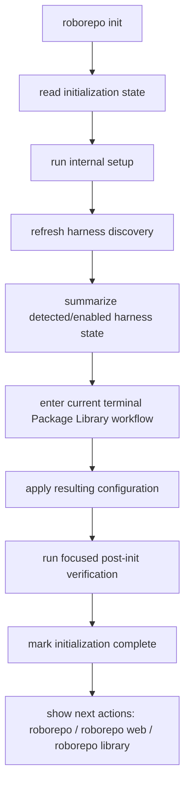
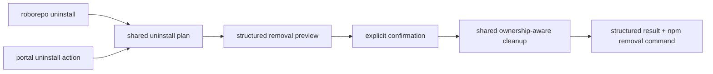

# Make npm Installation Lead Into a Coherent RoboRepo Lifecycle

## Summary

Make the package-installed RoboRepo experience begin and end with a small, understandable command surface.

npm owns the RoboRepo application files. RoboRepo owns initialization, the configuration it projects into supported agent harnesses, its machine-local state, and safe cleanup of those projections. A new installation should therefore require only:

```sh
npm install -g codethings-roborepo-alpha
roborepo init
```

`roborepo init` becomes the user-facing first-run workflow. The existing `setup` command remains an internal primitive for creating workspace/state structures, and `config apply` remains the explicit reconciliation primitive rather than a step a new user must know. A friendly top-level `roborepo library` command opens the same package-management workflow as `roborepo package manage`.

Removal follows the same ownership boundary. `roborepo uninstall` removes RoboRepo-managed machine integration while preserving user-authored workspace content by default, then tells the user how to remove the application with the package manager. The portal exposes the same managed-cleanup workflow.

This plan also makes zero, one, two, or any supported number of harnesses a deliberate first-run and UI state. It does not broaden the definition of harness presence; the existing `harness-presence-signal-expansion` plan still owns that decision.

## Context

The npm package now supplies a real `roborepo` executable without requiring a source checkout. The package smoke test already proves that an installed tarball can run the lower-level sequence `setup`, `harness refresh`, `harness list`, `config apply`, and `doctor`. Those are useful implementation and verification primitives, but they are too much lifecycle vocabulary for a first-time user.

The current CLI already has much of the machinery needed for a simpler product surface:

- `setup` is an internal command backed by `scripts/cli/workspace.mjs`.
- `config apply` re-renders enabled package and harness configuration.
- `package manage` is titled **Package Library** and routes into the live item-level package wizard in `scripts/cli/presets.mjs`.
- `maintenance uninstall` is an advanced hidden command backed by the existing uninstall scripts.
- `scripts/harnesses/state.mjs` persists machine-local provider discovery and enablement state.
- bare `roborepo` currently opens the normal root menu unconditionally. `scripts/cli/main.mjs` still calls `maybeRunPresetOnboarding()` first, but that function (`scripts/cli/presets.mjs`) is now a vestigial no-op: it only strips a legacy `--no-presets-onboard` flag from argv and never runs onboarding. There is no first-run branch anywhere in the startup path.

The current lifecycle still exposes two different ownership models during removal. npm removes the package files it installed, while RoboRepo-generated files and state live elsewhere. Current npm releases do not implement package uninstall lifecycle scripts, so RoboRepo cannot rely on `npm uninstall` to call custom cleanup code. The product must teach and implement that boundary explicitly.

This document continues to own the broader lifecycle scope already assigned to plan `46up8y7a`: apply/reconcile behavior, repair, verification, data preservation, shell integration, replacement, and uninstall. The first phases below prioritize the user-facing lifecycle needed for package installs; the broader hardening remains later work in the same lifecycle plan rather than a competing plan.

## Goals

- Make npm the sole owner of package-mode application install, version replacement, and application removal.
- Add `roborepo init` as the single user-facing first-run workflow.
- Persist explicit initialization state so first-run behavior is not inferred from directory existence.
- Make an interrupted initialization resumable and distinguish it from a completed installation.
- Route a bare interactive `roborepo` invocation into `init` when the installation is not initialized.
- Keep explicit commands available without reinstating the old forced-onboarding gate.
- Keep `setup` internal and keep `config apply` available as an advanced/manual reconciliation primitive.
- Add `roborepo library` as a friendly top-level alias for `roborepo package manage`.
- Do not restore `roborepo onboard` as a public command.
- Allow initialization to succeed with zero detected harnesses.
- Make CLI and portal agent-related surfaces behave correctly for zero, one, two, and N harnesses without hardcoding Claude/Codex pairs.
- Add a public `roborepo uninstall` workflow for RoboRepo-managed cleanup.
- Preserve the portable/user-authored workspace by default during managed cleanup.
- Add the same managed-uninstall action to the portal, backed by the same cleanup service as the CLI.
- Explain during setup and in uninstall documentation that npm application removal does not remove separately stored RoboRepo configuration/workspace content.
- Use the new Mac as a manual acceptance environment for zero-to-N harness permutations after the automated package smoke remains green.

## Non-goals

- Building the dedicated browser onboarding experience or the Browser-versus-Terminal choice. Plan `v6lvuu2` owns that follow-up.
- Changing which preloaded package defaults become live before confirmation. Plan `v6lvuu2` owns staged first-run package selection.
- Reintroducing a public `roborepo onboard` command.
- Renaming or redefining `roborepo update` in this slice. Package mode currently aliases it to `config apply`; a clearer self-update story can be handled separately.
- Broadening harness-presence semantics from strict home existence to executable/config confidence. `harness-presence-signal-expansion` owns that behavior.
- Installing Claude, Codex, Gemini, or other harnesses for the user.
- Having the portal or `roborepo uninstall` remove the npm package itself.
- Publishing a stable npm release or adding Homebrew distribution.
- Rebuilding the entire existing shell-based uninstall implementation before the user-facing lifecycle can ship.

## Current State

### Application and configuration ownership

RoboRepo already separates three roots:

| Layer | Current meaning | Intended lifecycle owner |
| --- | --- | --- |
| `appRoot` | Immutable installed application or development checkout | npm/package manager in package mode; checkout in development mode |
| `workspaceRoot` | Editable portable user workspace; defaults to `<stateRoot>/workspace` | User |
| `stateRoot` | Machine-local RoboRepo state; defaults to `~/.roborepo` | RoboRepo on behalf of the user |

The default placement of `workspaceRoot` under `stateRoot` is important for uninstall: current `remove_runtime_state()` recursively removes the entire state root, so the existing hidden uninstall path cannot be promoted directly as the safe user-facing uninstall workflow. Workspace preservation must be enforced before `roborepo uninstall` becomes public.

### Existing first-run primitives

The current package-oriented sequence is:

```text
setup
→ harness refresh
→ harness list
→ config apply
→ doctor
```

`setup` already has `kind: internal` in the command catalog and only initializes workspace/state structures. `config apply` is a public command that invokes the update script to materialize enabled packages and harness configuration.

`package manage` already reuses the item-level wizard implemented in `scripts/cli/presets.mjs`; its command title is **Package Library**. The old top-level `onboard` command is removed, while the internal `onboard` sub-action remains an implementation detail of the package-management workflow.

### Harness-count behavior

The provider registry currently contains Claude, Codex, and Gemini and is data-driven through `listHarnessProviders()`.

The user-facing surfaces do not all mean the same thing when they say “harness”:

| Surface | Current cohort | Consequence |
| --- | --- | --- |
| `roborepo harness list` | All registered providers + persisted machine state | Correct for showing supported providers and their detected/enabled state |
| Agents `/config` grid | All registered providers | A zero-harness machine still receives one column per registered provider |
| ↳ source of that cohort | `configSnapshotHarnesses()` in `scripts/cli/config.mjs` maps `listHarnessProviders()` straight to `{id, displayName, rulesFile, settingsFile, hooksFile}` | It never reads `harnessStatePath`, so the snapshot carries no detected/enabled signal at all; `portal/config/templates.js` renders one column per entry off `snap.harnesses` |
| Tokens `/tokens` filter | Harnesses observed in telemetry data | Filter is hidden when zero or one harness is observed; N buttons are generated dynamically |
| install/uninstall shell gating | Strict harness home-directory presence | Intentionally narrower than richer discovery confidence |

This plan must not collapse these cohorts into one generic “harness list.” Each surface must state which cohort it presents and render zero/one/N intentionally.

### Existing uninstall behavior

`roborepo maintenance uninstall` is an advanced hidden command. The underlying uninstall code already contains ownership-aware removal for symlinks, generated rules, root config, backups, hooks, package projections, and remnant checks.

The unsafe promotion point is state removal. `remove_runtime_state()` in `scripts/install/uninstall-lib.sh` removes several specific state files, then finishes with a recursive removal of the state root itself:

```sh
remove_path "${state_dir}/command-overrides.json" "remove"
remove_path "${state_dir}/enabled-packages.json" "remove"
remove_path "${state_dir}/telemetry" "remove"
remove_path "${state_dir}/telemetry-backups" "remove"
remove_path "${state_dir}/backups" "remove"
remove_path "${state_dir}" "remove"   # <- takes <stateRoot>/workspace with it
```

`remove_path` runs `rm -rf`, so that final line deletes the default workspace at `<stateRoot>/workspace` along with everything else. A public uninstall must classify state and preserve user-owned workspace content rather than recursively deleting the root.

Note that `workspaceRoot` is only *usually* nested: `scripts/cli/roots.mjs` resolves it from a `workspace-root.json` override before falling back to `path.join(stateRoot, "workspace")`. Cleanup must therefore resolve the effective workspace path rather than assume the nested default, and must handle a relocated workspace that sits entirely outside `stateRoot`.

npm application uninstall is a separate operation:

```sh
npm uninstall -g codethings-roborepo-alpha
```

That removes the npm-managed package, not the separately stored RoboRepo projections and user state. Current npm releases do not provide an uninstall lifecycle hook that RoboRepo can use to automatically bridge those two operations.

## Proposed Design

### 1. Public lifecycle vocabulary

Make the normal user-facing lifecycle small:

| Command | User meaning | Notes |
| --- | --- | --- |
| `roborepo init` | Set up this RoboRepo installation for first use | New public orchestration command |
| `roborepo library` | Browse/change RoboRepo functionality | Friendly alias of `roborepo package manage` |
| `roborepo doctor` | Diagnose installation/configuration health | Existing public diagnostic |
| `roborepo uninstall` | Remove RoboRepo-managed machine integration | Preserves workspace by default; does not remove npm package |
| `npm uninstall -g codethings-roborepo-alpha` | Remove the RoboRepo application | Package-manager operation, not a RoboRepo command |

Keep these implementation primitives available without teaching them as the normal first-run path:

| Primitive | Role |
| --- | --- |
| `roborepo setup` | Internal workspace/state initialization |
| `roborepo config apply` | Explicit desired-state reconciliation |
| `roborepo harness refresh` | Refresh machine harness discovery |
| `roborepo package manage` | Canonical package namespace action behind `library` |

Do not resurrect `roborepo onboard`.

### 2. Explicit initialization state

Add a machine-local state record through `scripts/cli/state-paths.mjs`, for example:

```json
{
  "schemaVersion": 1,
  "workflowVersion": 1,
  "status": "in-progress",
  "startedAt": "ISO-8601",
  "completedAt": null
}
```

The exact filename should live under `stateRoot` and be owned by a focused lifecycle/initialization module. The record must not duplicate package selections, harness discovery state, or workspace contents.

Required states:

| State | Meaning | Bare `roborepo` behavior |
| --- | --- | --- |
| missing | initialization has never started | offer/start `init` |
| `in-progress` | initialization began but did not finish | offer/resume `init` |
| `complete` | core first-run workflow finished successfully | open normal root menu |

Mark initialization complete only after the required initialization workflow succeeds. An exception, Ctrl-C, or user exit before completion leaves the state resumable.

### 3. `roborepo init` orchestration

The first implementation should compose existing primitives rather than duplicate their logic.



Milestone 1 deliberately uses the current terminal Package Library handoff and current package-default semantics. Plan `v6lvuu2` later replaces that handoff with Browser-versus-Terminal choice plus staged package-default review before apply.

`init` must be idempotent. Re-running it after completion should not reset package selections or delete state. It should present a concise already-initialized outcome and allow the user to review setup or open the Library without silently replaying destructive work.

### 4. Bare `roborepo` first-run routing

Do not restore the old forced onboarding gate that blocked arbitrary commands.

Instead:

- bare `roborepo` + interactive terminal + missing/in-progress initialization state routes to `init`;
- bare `roborepo` + completed initialization opens the normal root menu;
- explicit `roborepo init` always enters the initialization workflow;
- explicit diagnostics/help such as `version`, `doctor`, and `--help` remain usable before initialization;
- automation must not be forced through an interactive wizard merely because initialization is incomplete.

Keep the first-run routing in a focused lifecycle module called from `scripts/cli/main.mjs`; do not put initialization business rules into the command resolver or interactive menu renderer.

### 5. `roborepo library` as the friendly package front door

Add a top-level public command:

```sh
roborepo library
```

It must dispatch to the same implementation as:

```sh
roborepo package manage
```

There is one package-management workflow and one source of truth. `library` is vocabulary for users who have not learned the package model yet; `package ...` remains the detailed namespace for list/inspect/enable/disable/reconcile/development operations.

Help/menu presentation should teach both without duplicating them:

```text
Customize
  library       Browse and manage RoboRepo packages
```

`package manage` remains discoverable under the package namespace.

### 6. Zero-to-N harness contract

Initialization must treat zero harnesses as a normal state:

```text
No supported agent harnesses are currently detected.
RoboRepo is initialized; install or launch a supported harness later and refresh discovery.
```

Do not broaden the existing presence signal in this plan. Consume the state already produced by `harness refresh`, and leave richer executable/config/home semantics to `harness-presence-signal-expansion`.

Define presentation cohorts explicitly:

| Surface | Cohort to present | Zero | One | N |
| --- | --- | --- | --- | --- |
| `init` summary | machine discovery state | valid empty message | one named harness | concise list/count |
| `harness list` | supported providers + state | all supported shown as absent/disabled | same table, one detected | same data-driven table |
| Agents primary machine view | persisted discovery entries whose `confidence` is not `absent`; preserve each entry's enabled/disabled state | explicit “no agents detected” state | one provider presentation | generated provider presentation |
| Tokens harness filter | harnesses with observable telemetry | no harness filter + empty-data guidance | no redundant filter | generated all + per-harness controls |
| package/config internals | registered provider catalog where required | may still know all providers | same | same |

The Agents API may retain the full supported-provider catalog for configuration metadata, but the primary user presentation must not imply that every registered provider is installed. Add explicit machine-state fields or a separate presentation list instead of making the browser infer presence from filenames.

Tests must include a synthetic extra provider where the current provider-test seams allow it, so “N” means data-driven rather than exactly the three providers registered today.

### 7. User-facing managed uninstall

Add:

```sh
roborepo uninstall [--dry-run] [--yes] [--delete-workspace]
```

The workflow must preview the ownership boundary before mutation. Interactive execution requires confirmation; noninteractive destructive execution refuses unless `--yes` is explicit. `--dry-run` never mutates.

Default behavior:

| Remove | Preserve |
| --- | --- |
| RoboRepo-managed harness projections | user-authored workspace |
| generated skills/commands/rules that have ownership proof | repositories/project checkouts |
| RoboRepo-owned root-config content when safe | unmanaged harness files |
| disposable machine-local caches/install metadata | drifted/user-modified config that cannot be proven safe to remove |
| RoboRepo-owned shell/profile entries | unrelated shell configuration |

The current broad `rm -rf stateRoot` behavior must be replaced by selective cleanup. Because the default workspace is nested under `stateRoot`, “preserve workspace” must be mechanically true, not just documented.

Cleanup must resolve the effective workspace root the same way `scripts/cli/roots.mjs` does — honoring the `workspace-root.json` override — and handle both placements:

| Workspace placement | Required cleanup behavior |
| --- | --- |
| nested default `<stateRoot>/workspace` | remove state entries selectively; never `rm -rf` the state root itself |
| relocated outside `stateRoot` | leave the relocated tree untouched unconditionally |

#### Workspace disposition policy (resolved)

Two things are easily conflated here and must stay separate:

| Thing | What it is | Policy |
| --- | --- | --- |
| the workspace tree | real user-authored content | preserved by default; deletable only in the nested case, only on explicit opt-in |
| `workspace-root.json` | a machine-local pointer holding a path string | never a separate question; its fate follows the tree |

The pointer is not independently meaningful — it matters only if the workspace it names still exists. Asking about it would make the user answer a second question about a bookkeeping file they have never heard of, immediately after they already expressed intent about their data. Derive it instead:

- workspace preserved → preserve `workspace-root.json`, so a relocated workspace stays discoverable after reinstall;
- nested workspace deleted via explicit opt-in → the pointer describes a path that no longer exists, so remove it too and say so in the result.

**Deletion is offered only for a nested workspace.** A relocated workspace lives at a path the user deliberately chose — possibly a synced or backed-up folder — and RoboRepo did not create that location, so it must not take responsibility for removing it. For a relocated workspace, never offer deletion in the prompt and never honor `--delete-workspace` against it; preserve it, print its path, and let the user delete it themselves.

Interactive prompt shape for the nested case:

```text
Managed cleanup will remove RoboRepo harness projections,
generated rules, and machine-local state.

Your workspace will be preserved:
  ~/.roborepo/workspace  (18 files)

  [Enter] preserve workspace (recommended)
  [d]     also delete workspace
```

`--delete-workspace` is the noninteractive equivalent so automation opts in explicitly rather than being prompted. It is destructive, so it composes with the existing rule: noninteractive deletion refuses unless `--yes` is also explicit. Under `--dry-run` it reports the intended deletion without mutating.

Consequence accepted: default managed uninstall leaves the workspace bytes behind, so it is not a zero-trace removal. That is the intended reading of the ownership thesis — RoboRepo removes what it created, and it did not create the user's workspace content. Users wanting zero trace have `--delete-workspace` and a printed path.

After managed cleanup completes, print the package-manager step:

```text
RoboRepo-managed configuration has been removed.
Your workspace was preserved.

Remove the application with:
  npm uninstall -g codethings-roborepo-alpha
```

Do not have RoboRepo invoke npm on the user's behalf. This keeps package-manager ownership explicit and avoids self-removal/version-manager ambiguity.

`maintenance uninstall` should no longer represent a separate cleanup implementation. Make it an advanced compatibility entry to the same shared cleanup path or replace it with a clear redirect to `roborepo uninstall`.

### 8. Portal uninstall action

Expose **Uninstall RoboRepo** in a Maintenance panel on the existing `/config` surface without creating a new top-level page solely for this feature.

The portal and CLI must consume one shared cleanup planner/executor:



The portal flow must:

1. fetch a dry-run/preview;
2. show what will be removed and what will be preserved;
3. require explicit destructive confirmation;
4. execute the same cleanup semantics as the CLI;
5. return/display the npm removal command;
6. allow the HTTP response to finish before stopping the portal process or deleting its PID state.

Do not shell out from browser JavaScript. Keep mutation handling server-side behind the portal's existing origin/token protection.

### 9. Installation and removal messaging

The package installation itself should not run the old checkout installer.

The practical user workflow is:

```text
npm install -g codethings-roborepo-alpha

RoboRepo installed.
Run `roborepo init` to get started.
```

Do not depend on npm install-script output as the sole onboarding instruction; package-manager script output can be suppressed or restricted. Make the same next-step instruction visible in the package README/install guide and when a user runs bare `roborepo`.

During first-run completion and in uninstall documentation, state the storage boundary plainly:

```text
The npm package and your RoboRepo configuration have separate lifecycles.
Removing the npm package does not remove your RoboRepo workspace or managed harness configuration.
Run `roborepo uninstall` first when you want a full managed cleanup.
```

### 10. Broader lifecycle hardening retained by this plan

After the first-run/uninstall product surface is coherent, continue the still-open lifecycle work already owned here:

- ownership inventory across every harness resource type;
- collision and backup policy;
- moved-checkout repair;
- shell/PATH cleanup;
- same-version reinstall;
- upgrade/downgrade state compatibility;
- dry-run/noninteractive result consistency;
- repository-mode/package-mode parity.

The two previously reproduced narrow removal defects—apply orphan cleanup and package-owned slash-command cleanup—are already fixed and should remain regression coverage, not pending tasks.

## Code Touchpoints

### CLI catalog and orchestration

- `manifests/platform/cli/command-definitions/`
  - add public root definitions for `init`, `library`, and `uninstall`;
  - keep `internal/setup.command.json` internal;
  - route `library` to the same package-management implementation as `package manage`;
  - stop presenting advanced maintenance uninstall as a separate user workflow.
- `scripts/cli/main.mjs`
  - add first-run routing before the normal root menu (the `resolved.kind === "root-menu"` branch);
  - retire the no-op `maybeRunPresetOnboarding()` argv hook rather than stacking new logic beside it;
  - do not reinstate the old global onboarding gate.
- New focused lifecycle/initialization module under `scripts/cli/`
  - read/write initialization state;
  - orchestrate setup, discovery, library handoff, apply, verification, completion;
  - keep command composition separate from execution helpers.
- `scripts/cli/state-paths.mjs`
  - own the initialization-state path.

### Package and configuration

- `scripts/cli/presets.mjs`
  - reuse the current Package Library wizard;
  - do not expose its internal `onboard` token as a public command.
- `scripts/cli/config.mjs`
  - `configSnapshotHarnesses()` currently maps `listHarnessProviders()` with no state input; add the machine cohort by reading persisted discovery state (`harnessStatePath` via `scripts/harnesses/state.mjs`) without losing registered-provider metadata.
- `scripts/cli/package-projection-cleanup.mjs`
  - continue as the ownership-aware package projection cleanup path.

### Harnesses

- `scripts/harnesses/registry.mjs`
- `scripts/harnesses/state.mjs`
- `scripts/harnesses/discovery.mjs`
- `scripts/cli/harness.mjs`
  - keep provider iteration data-driven;
  - consume existing discovery state without redefining presence in this plan.

### Uninstall

- `scripts/install/uninstall.sh`
- `scripts/install/uninstall-lib.sh`
  - split selective machine-state cleanup from workspace preservation;
  - expose structured/shared cleanup behavior usable from the CLI/portal adapter;
  - retain ownership and drift safety checks.
- New focused shared uninstall planner/executor module if required to serve both CLI and portal without duplicating policy.

### Portal

- `scripts/cli/portal-server.mjs`
  - register the protected uninstall preview/execute route or delegate to a focused maintenance route module.
- `scripts/cli/portal-routes-config.mjs` or a new focused maintenance route module
  - keep app-level maintenance out of unrelated rendering code.
- `portal/config/`
  - add the first maintenance action without hand-building multi-element markup in JavaScript;
  - use real HTML `<template>` markup and the existing portal slot-fill conventions.
- `portal/config/templates.js`
  - make provider presentation consume the intended machine cohort.
- `portal/telemetry/app.js`
  - preserve dynamic observed-harness filtering and add/verify zero-data behavior.

### Documentation

- `README.md`
- `docs/user/guides/first-time-setup.md`
- `docs/user/guides/install-workflows.md`
- `docs/user/reference/roborepo-cli.md`
- `docs/user/reference/roborepo.md`

Document the public lifecycle vocabulary and remove first-run instructions that require users to know internal primitives.

## Implementation Plan

### Phase 1 — Pin the public lifecycle contract

- [x] Add an initialization-state path and focused read/write helpers with schema validation.
- [x] Add tests for missing, in-progress, and complete initialization state.
- [x] Add `roborepo init` to the command catalog and keep `setup` internal.
- [x] Implement `init` as a short orchestrator over existing setup/discovery/library/apply/verification functions rather than copying their logic.
- [x] Leave initialization in-progress on interruption or failed required step.
- [x] Make completed `init` idempotent and non-destructive.
- [x] Route bare interactive `roborepo` into `init` only when initialization is missing/in-progress.
- [x] Keep explicit help/version/doctor and automation paths usable without a forced onboarding gate.
- [x] Retire the vestigial `maybeRunPresetOnboarding()` call in `scripts/cli/main.mjs`: replace it with the new first-run routing rather than layering a second startup hook beside a no-op. Keep `--no-presets-onboard` accepted-and-ignored, or drop it deliberately as a documented removal.

### Phase 2 — Add the Library front door

- [x] Add `roborepo library` as a root command that executes the same Package Library workflow as `roborepo package manage`.
- [x] Keep detailed package operations under the `package` namespace.
- [x] Update root help and interactive menu copy to teach **Library** first and **packages** inside that workflow.
- [x] Add command-catalog and PTY coverage proving the alias does not fork behavior.

#### Phases 1-2 implementation notes

Landed on branch `plan-46up8y7a-install-lifecycle`.

| Decision | Reasoning |
| --- | --- |
| `library` and `package manage` share a `packageLibrary` execution preset in `manifests/platform/cli-commands.json` | The plan requires the alias not fork behavior. Duplicating the execution block in two definition files would satisfy that on day one and drift later; one preset makes divergence structurally impossible. |
| `package manage` lost `promoteToRoot` | With `library` at root, keeping the promotion listed the same workflow twice in root help. `package manage` stays reachable and documented under the package namespace. |
| `init` does not call `config apply` after the Library handoff | `presetsOnboard` already applies the selection (and already handles the non-interactive default-apply path), so a following apply would re-run the same update script for no benefit. |
| `maybeRunPresetOnboarding` deleted rather than left in place | It had decayed to an argv filter. `--no-presets-onboard` is still accepted-and-ignored in `main.mjs` so existing scripts do not break on an unknown flag. |
| Corrupt initialization record reads as `missing` | Never-started and unreadable have the same recovery — run `init` — and a malformed state file must not be able to lock a user out of their first run. |

Test-suite changes were setup fixes, not assertion weakening: the PTY checks drive a bare `roborepo`, which now reaches `init` on an uninitialized sandbox, so those sandboxes are seeded already-initialized. Menu assertions that hardcoded a row label or keypress count were re-anchored to indentation and offset, since those shift whenever a primary action is added.

Not yet done in this slice: no documentation updates (Phase 6 owns them), and `roborepo uninstall` does not exist yet, so the `init` completion message describes the storage boundary without yet being able to point at a working managed-cleanup command.

### Phase 3 — Make zero-to-N harness presentation explicit

- [ ] Add `machineHarnesses` (or an equivalent explicit presentation field) to the config snapshot without removing the registered provider catalog needed for supported-provider metadata; populate it from persisted discovery entries whose `confidence` is not `absent` and preserve each entry's enabled flag.
- [ ] Make the Agents primary provider presentation show a truthful zero state when `machineHarnesses` is empty.
- [ ] Verify one-provider and N-provider layouts are generated from data rather than fixed columns.
- [ ] Preserve Tokens' observed-telemetry cohort and add a clear zero-data state; keep the harness filter hidden for one observed harness and generated for N.
- [ ] Add focused tests for zero, one, two, all currently registered providers, and a synthetic extra provider where the test seam supports it.
- [ ] Do not change strict-vs-rich harness detection semantics in this phase.

### Phase 4 — Promote safe managed uninstall

- [ ] Characterize the current hidden uninstall against a workspace at the default `<stateRoot>/workspace` path, capturing the existing destructive behavior as a failing test before changing it.
- [ ] Remove the final `remove_path "${state_dir}"` from `remove_runtime_state()` and replace recursive state-root deletion with a selective ownership-based cleanup plan that preserves workspace content by default.
- [ ] Resolve the effective workspace root through the same `workspace-root.json` override logic as `scripts/cli/roots.mjs`; cover both the nested default and a workspace relocated outside `stateRoot`.
- [ ] Implement the resolved workspace-disposition policy: preserve by default; tie `workspace-root.json`'s fate to the tree's rather than prompting for it separately.
- [ ] Add `--delete-workspace` opt-in, honored only for a nested workspace, refusing noninteractively without `--yes`, and non-mutating under `--dry-run`.
- [ ] Never offer or honor workspace deletion for a relocated workspace; preserve it and print its path.
- [ ] Define structured preview/result data shared by CLI and portal adapters.
- [ ] Add public `roborepo uninstall` with dry-run/preview and explicit confirmation.
- [ ] Repoint or retire `roborepo maintenance uninstall` so there is one cleanup implementation.
- [ ] Keep drifted/unmanaged harness content intact and report what was skipped.
- [ ] Print the exact npm application-removal command after successful managed cleanup.
- [ ] Verify repeated managed uninstall is safe.

### Phase 5 — Add portal cleanup

- [ ] Add protected preview and execute endpoints using the existing portal origin/token mutation guard.
- [ ] Add an **Uninstall RoboRepo** Maintenance panel to the existing `/config` surface for the first implementation; do not create a new top-level portal page for this action.
- [ ] Render removal/preservation preview from structured server data.
- [ ] Require explicit destructive confirmation.
- [ ] Ensure the response reaches the browser before the portal server stops/removes its own runtime state.
- [ ] Display the npm removal command after cleanup.
- [ ] Keep workspace deletion out of the portal action entirely: the portal exposes preserve-only cleanup and shows the preserved workspace path. `--delete-workspace` stays a deliberate CLI opt-in rather than a button in a browser.

### Phase 6a — First-run vocabulary documentation

Split from the original Phase 6 and done alongside Phases 1-2: `init` and `library` shipped on the
branch, so leaving their documentation until after Phases 3-5 would have merged behavior that no
document described. The remaining Phase 6b items genuinely depend on later phases.

- [x] Make package-install guidance end with `roborepo init`, not a checklist of internal commands.
- [x] Document `roborepo library` as the normal way to change functionality later.
- [x] Document the first-run routing contract: bare interactive invocation enters `init`, explicit commands are never gated, an interrupted `init` resumes, a completed `init` is a no-op report.
- [x] Correct the stale claim in `docs/user/reference/roborepo.md` that the CLI "gates normal commands until onboarding has completed" — that gate was removed before this plan and the sentence had outlived it.
- [x] Correct `docs/user/guides/install-workflows.md`'s claim that the installer starts the package chooser itself.
- [x] Document that zero detected harnesses is a valid initialization outcome.

### Phase 6b — Uninstall documentation and real-new-Mac acceptance

- [ ] Document the two-part uninstall ownership model, including that managed uninstall preserves the workspace by default and that `--delete-workspace` is the explicit nested-only opt-in.
- [ ] State that npm removal alone leaves separately stored RoboRepo state/configuration.
- [ ] Generate a fresh Packaging 01 transfer artifact from the final tested commit.
- [ ] Run the real-new-Mac harness-count matrix below before restoring old workspace content or cloning the development repository.
- [ ] Record any presence-signal observations in `harness-presence-signal-expansion` rather than broadening this plan mid-test.

### Phase 7 — Continue broader lifecycle hardening

- [ ] Complete the resource ownership/removal inventory across skills, commands, MCP, hooks, root config, shell entries, backups, state, and caches.
- [ ] Finish collision/back-up policy characterization and deterministic dry-run/noninteractive behavior.
- [ ] Finish moved-checkout and stale-path repair coverage.
- [ ] Finish shell/PATH deduplication and package-manager-shim ownership cleanup.
- [ ] Define same-version reinstall and versioned upgrade/downgrade state behavior.
- [ ] Run the same core lifecycle matrix in development and installed-package modes.

## Validation

### Automated behavior

Add focused regression coverage first, then run the existing repository-native checks relevant to the shared lifecycle:

```sh
node scripts/test/cli-command-catalog-check.mjs
node scripts/test/cli-surface-integration-check.mjs
npm run test:harness-cli
npm run test:harness-registry
npm run test:telemetry-portal-state
npm run test:package-lifecycle
npm run test:package-install
bash scripts/doctor.sh --quiet
npm test
```

Required assertions:

- uninitialized bare `roborepo` enters the first-run path in an interactive TTY;
- explicit diagnostic/help commands remain callable before initialization;
- interrupted `init` remains resumable;
- completed `init` is idempotent;
- `library` and `package manage` reach the same package-management implementation and persisted state;
- zero detected harnesses is a successful initialization state;
- Agents and Tokens handle zero/one/N according to their documented cohorts;
- a synthetic additional provider does not require UI/CLI source edits;
- managed uninstall preserves workspace bytes at the default nested location;
- managed uninstall leaves a workspace relocated outside `stateRoot` fully untouched;
- `--delete-workspace` removes a nested workspace, and leaves a relocated one intact;
- `--delete-workspace` without `--yes` refuses noninteractively, and mutates nothing under `--dry-run`;
- `workspace-root.json` survives when the workspace is preserved and is removed when a nested workspace is deleted;
- unmanaged/drifted harness content survives managed uninstall;
- the config snapshot's Agents cohort reflects persisted discovery state, not the raw registered-provider list;
- the portal and CLI produce the same removal plan for the same fixture;
- npm package-install smoke still passes with no harness executables visible.

### Real-new-Mac matrix

Run the package artifact before cloning the repository and observe both CLI and portal after each transition:

| Stage | Machine condition | Verify |
| --- | --- | --- |
| 0 | RoboRepo installed; no supported harness installed | `init` succeeds; Agents zero state; Tokens zero-data state; no crash or fake installed provider |
| 1 | one harness executable installed but never launched | refresh/list/Agents reflect the current discovery contract exactly; record strict-vs-rich surprises without changing semantics here |
| 2 | that harness launched once/home initialized | one-harness CLI and Agents state; package configuration applies safely |
| 3 | second harness installed/initialized | two-harness presentation and filters |
| N | all currently registered providers available | generated N-provider presentation; no Claude/Codex-only assumptions |

Also verify:

```sh
roborepo version
roborepo
roborepo init
roborepo library
roborepo doctor
roborepo web
```

For uninstall, perform the destructive test only after preserving any wanted workspace fixture:

```sh
roborepo uninstall
npm uninstall -g codethings-roborepo-alpha
```

Confirm the application command disappears while the preserved workspace remains readable.

## Acceptance Criteria

- A package-mode user can understand the first-use flow as `npm install` → `roborepo init`.
- `setup` is not presented as a normal user-facing first-run command.
- bare interactive `roborepo` sends an uninitialized installation into `init` and a completed installation into the normal menu.
- initialization state is explicit, versioned, resumable, and separate from package/harness/workspace data.
- zero detected harnesses is a valid completed initialization.
- `roborepo library` and `roborepo package manage` are two entry points to one package-management implementation.
- `roborepo onboard` remains removed from the public CLI.
- agent-related CLI/portal surfaces render zero, one, and N providers according to an explicitly defined cohort rather than hardcoded provider counts.
- `roborepo uninstall` removes only proven RoboRepo-managed machine integration and preserves user-authored workspace content by default.
- workspace deletion is an explicit opt-in available only for a nested workspace; a relocated workspace is never deleted by RoboRepo, and the `workspace-root.json` pointer follows the tree instead of prompting separately.
- the portal exposes the same managed-uninstall semantics and cannot silently delete the npm application.
- successful managed uninstall tells the user to remove the package with npm.
- docs clearly state that npm package removal and RoboRepo-managed state cleanup are separate lifecycle operations.
- the existing package-install smoke and relevant lifecycle/harness/portal tests remain green.

## Risks

- The default workspace currently sits inside `stateRoot`, and `remove_runtime_state()` ends with `remove_path "${state_dir}"` (an `rm -rf`); any leftover recursive state-root deletion destroys user-authored content despite correct UI copy.
- `workspaceRoot` is overridable via `workspace-root.json`, so cleanup keyed to the nested default silently misclassifies a relocated workspace — in one direction leaving state behind, in the other deleting a tree the user placed deliberately.
- “Registered,” “detected,” “enabled,” “home present,” and “observed in telemetry” are different harness cohorts. Reusing the wrong one can create misleading zero/one/N UI.
- A portal uninstall request can terminate the process serving its own response if shutdown ordering is not explicit.
- Existing shell uninstall logic has mature ownership checks; replacing too much of it at once would increase cleanup risk. Share policy incrementally rather than doing a wholesale rewrite for architectural purity.
- Package-mode `roborepo update` still reads like an application updater even though it aliases `config apply`; leaving the name unchanged is intentional scope control, but documentation must not imply it updates the npm package.
