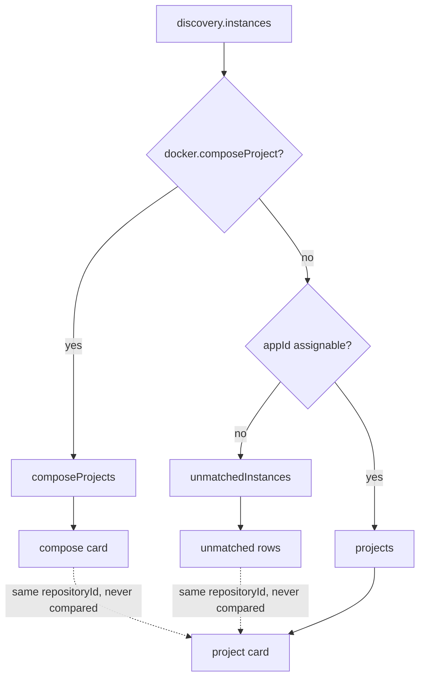
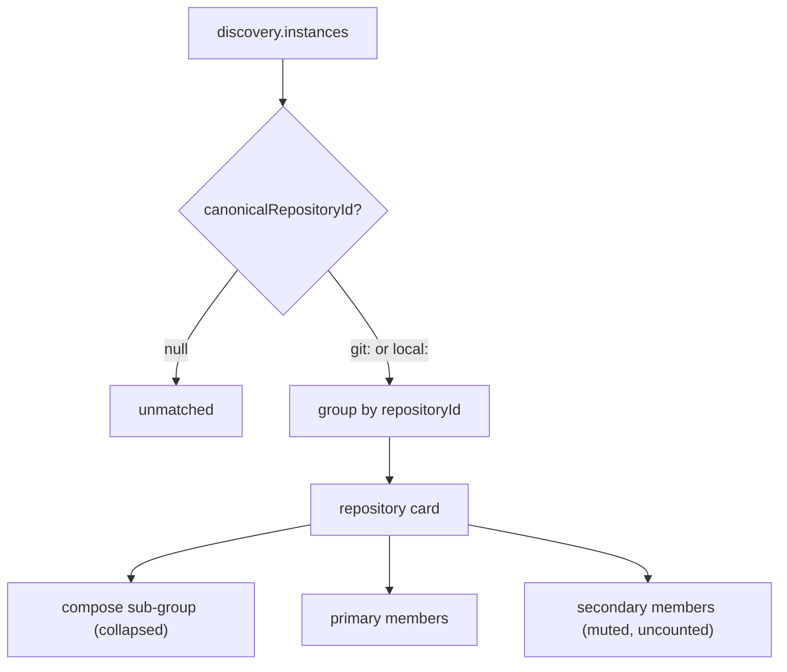

# Localhoster Repository Card Merge

## Summary

`/localhoster` renders one card per *discovery mechanism* rather than one card per *project*. A
single repository that runs a Compose stack, a dev server, and a tunnel currently produces three
unrelated cards in three different sections of the page. This plan merges them into one card per
repository, with the individual containers and listeners as members inside it.

The grouping key already exists and is already correct: `repositoryId`, produced by
`canonicalRepositoryId` in `modules/repositories/identity.mjs`. Nothing about identity resolution
needs to change. The defect is purely that three render paths each build cards independently and
none consults the others.

## Context

The preceding plan (`localhoster-compose-project-grouping`, active) established the entity model:
one project entity keyed by the strongest available identity, with only a real `repositoryId`
making a project canonical and promotable to other pages. It also fixed Docker CPU/RSS accounting
and added three-tier Compose repo resolution.

That work made `repositoryId` reliable enough to group on. This plan spends it.

`/localhoster` is the full-observability surface — it shows what is actually running on this
machine. Project-centric pages elsewhere show only resolved projects. That division stays.

## Current state

`buildLocalhosterSnapshot` (`modules/localhoster/snapshot.mjs:6`) emits three sibling collections
that consumers read by name (`snapshot.mjs:136-140`):

| Collection | Populated when | Card built by |
|---|---|---|
| `projects` | instance resolved to an identity **and** got an `appId` | `tpl-card` |
| `composeProjects` | instance carries `docker.composeProject` | `tpl-compose-project-card` |
| `unmatchedInstances` | identity resolved but no `appId` could be assigned | unmatched list |

The Compose branch returns early (`snapshot.mjs:52`), so a Compose container never reaches the
identity/app path. The `unmatchedInstances` branch returns early too (`snapshot.mjs:66`). Each
instance lands in exactly one bucket and the buckets never consult each other — even when two
instances in different buckets carry the same `repositoryId`.

Observed on the development machine:

```text
git:github.com/ryanem/menugoats
    COMPOSE    menugoats      ports 54321-54324   (11 Supabase containers)
    UNMATCHED  node           port 3000
    UNMATCHED  ngrok          port 4040
                                         -> three cards, one repository

local:616846d49a69fc81
    UNMATCHED  localhostr     port 4321
    UNMATCHED  node           port 63359
    UNMATCHED  deno           port 63409
                                         -> three cards, one repository
```

Both clusters already carry a correct shared `repositoryId`. The page has the information required
to group them and discards it.



## Goals

- One card per repository, containing every instance that resolves to it, regardless of which
  discovery mechanism found it.
- Docker-ness becomes a property of a member, not a top-level card distinction.
- Compose grouping becomes a sub-grouping inside a card rather than its own card type.
- The card's headline CPU number stays meaningful for threshold alerting.
- Existing identity resolution, history, and retention behavior are untouched.

## Non-goals

- Changing how `repositoryId` is derived. `modules/repositories/identity.mjs` is correct as-is.
- Changing the promotion gate for other pages. That gate checks for `git:` and stays.
- Adding CPU/memory time-series. `history.jsonl` stores discrete state-change events only
  (`modules/localhoster/history.mjs:187-205`); there is no sampled resource series and this plan
  does not add one.
- Surfacing non-HTTP host services (bare Postgres/Redis). Tracked separately; see Open questions.

## Resolved decisions

Confirmed in discussion before this plan was written. Do not re-litigate.

| # | Decision | Resolution |
|---|---|---|
| 1 | Merge on `local:` ids as well as `git:`? | **Yes.** Both are persistent and both denote a real repository. Cards built on `local:` show local-only provenance. |
| 2 | Tool processes (e.g. ngrok) that resolve only via inherited cwd | **Deferred.** Intended as uncounted secondary members, but no field separates them from a real dev server — see "Member tiering is deferred" below. All members currently count. |
| 3 | Compose containers inside a merged card | **Stay grouped** as one collapsed sub-group, not flattened into the member list. |
| 4 | `process:` identities | **Stay unmatched.** `canonicalRepositoryId` returns `null` for them — no repository exists to be a member of. |

### Why `local:` merges

`canonicalRepositoryId` returns `local:<hash>` for a directory that has a `.git` but no usable
remote (`modules/repositories/identity.mjs:91-99`). That id is **persistent** — the salt is pinned
stable and the hash is over the realpath — but **not portable**, since the same repository on
another machine has a different path and therefore a different id.

Portability matters at the boundary where a project is promoted to other pages, and that gate
already checks for `git:`. Applying the same constraint to card merging would enforce it in a place
that does not need it, and would leave a genuine cluster permanently fragmented on the one surface
whose entire purpose is showing what runs on *this* machine.

Known cost: moving an un-pushed repository to a different directory changes its `local:` id, so the
old card disappears and a new one appears. Acceptable — it only affects repositories with no remote.

### Member tiering is deferred

The intent was a mechanical tier rule, never a name blocklist: primary for anything that answered
the HTTP probe or is a Compose container, secondary for anything that resolved to the repository by
inherited working directory alone. `ngrok` would fall secondary without ever being named.

**That rule does not survive live data.** ngrok serves its own inspector UI on port 4040, so it
answers the probe exactly like a dev server does. Compared field by field on this machine:

| Field | `ngrok:4040` | `node:3000` |
|---|---|---|
| probe status | 302 | 307 |
| title | `null` | `null` |
| identity | `git:github.com/ryanem/menugoats` | `git:github.com/ryanem/menugoats` |
| confidence | high | high |
| relative cwd | `.` | `.` |
| process command | `ngrok` | `node` |

Every field agrees except the command name. Tiering on command name is the name blocklist the rule
was written to avoid — it needs maintenance and misses unknown tools.

So tiering ships as **all members count**. The merge itself is the substantive win and is correct
without it. The exclusion still matters for the threshold work (25% warn / 60% alert of machine CPU
exists to answer "is my app misbehaving", and a tunnel's CPU tracks its own traffic), so it returns
once a real signal exists — see Open questions.

There is one honest distinction the data does support, and it is rendering-only rather than tiering:
a member that answered **no page title** (`!member.entrypoint` — a runtime, a socket, an internal
API) is not something you open. Those carry `.is-support`: a desaturated title plus a quiet outlined
"No page" pill. Deliberately **not** an opacity dim, which `.is-offline` already owns — opacity is
unreadable in absolute terms, so a lone support member read as possibly-offline. The label states
only what the data says and claims nothing about health. `deno` under `localhostr_web` is the live
example on this machine.

### Card structure is load-bearing

The repository card's DOM shape encodes three requirements that fight each other, and each was
arrived at by breaking it the other way first. Recorded here because none of it is recoverable by
reading the markup.

**The card is a plain `<article>` wrapper, not the `<details>` itself.**

```text
<article class="instance-card repository-card">
  <details class="repository-disclosure">
    <summary>  title row + drill-down control  </summary>
    members drawer
  </details>
  git row                                 ← outside <details>
</article>
```

`<details>` renders only `<summary>` when closed, so anything that must survive collapse has to sit
outside it entirely. The requirements — git row persistent, members behind the toggle, members
*above* git — are unsatisfiable while the card itself is the `<details>`: document order forces the
persistent row above the drawer. Wrapping is what resolves it. Two earlier attempts failed here — a
flex `order` on a row inside the block-level `<summary>` (inert), and moving the git row outside
`<summary>` but still inside `<details>` (hidden on collapse).

**Neither the card nor the members drawer may set `overflow: hidden`.** Both had it for rounded
corners; both clipped the absolutely-positioned action menus. Bands round their own outer corners
instead.

**Action menus are hidden by default and revealed on wiring**, not rendered and retracted
(`revealActionMenuIfUsable` in `templates.js`). Menus are assembled subtractively, so a card kind
that loses every item — a Compose card nested as a member, whose only two entries are favorite and
hide — ends up with a live trigger over an empty panel. Affirmative reveal means a missed call site
renders no menu rather than a lying one. This needs `.card-head .action-menu[hidden] { display:none }`
in `styles.css`: the container's `display:flex` outranks the UA `[hidden]` rule, so without it the
attribute is inert and every menu renders regardless.

## Proposed design

One card per `repositoryId`. A card holds **members**; a member is either a container (with its
ports) or a bare listener (with its port).



Proposed card shape, using the live `menugoats` cluster:

```text
github.com/ryanem/menugoats                              CPU 4.8%
  > compose menugoats                     4 containers
    ngrok:4040
    node:3000
```

Aggregate CPU sums `cpuPercentOfHost` across every member and Compose group. Per the preceding
plan, `docker stats` reports CPU as a percentage of one core, which is not summable —
`cpuPercentOfHost` is the normalized field to aggregate and threshold against.

### Ordering

```text
favorites
repo-backed (git:)      online
repo-backed (git:)      offline
repo-backed (local:)    online
repo-backed (local:)    offline
compose-only / process-only (no repositoryId)
unmatched singletons
```

Offline already sinks within its group; that behavior is preserved.

## Implementation plan

- [x] Add a `repositoryId`-keyed grouping pass in `modules/localhoster/snapshot.mjs` emitting a new
      `repositories` collection (`buildRepositories`).
- [ ] ~~Classify each member as primary or secondary.~~ Deferred — no separating signal exists; see
      "Member tiering is deferred".
- [x] Compute per-card aggregate CPU from `cpuPercentOfHost`, null when nothing reported a usable
      number so an unmeasured card renders "unknown" rather than a confident 0%.
- [x] Preserve `composeProject` as a sub-grouping key within a card; reuses the existing
      `groupByContainer` helper for the sub-group's contents.
- [x] Keep `projects`, `composeProjects`, and `unmatchedInstances` populated during the transition
      so existing consumers and `findCurrentInstanceByOpaqueKey` (`snapshot.mjs:147`) keep working.
- [x] Migrate the portal render paths in `portal/localhoster/` onto `repositories`. `app.js` renders
      `snapshot.repositories` first, then filters `projects`/`composeProjects`/`unmatchedInstances`
      to entries **without** a `repositoryId` so nothing double-renders. Verified against live data:
      4 repositories, 0 standalone leftovers, 0 instances appearing both as a member and as their
      own card, and the unmatched bucket correctly dropped 13 → 10 as three listeners became members.
- [ ] ~~Unify `tpl-card` and `tpl-compose-project-card` into one template.~~ Not done, and now
      deliberate: a member keeps its own card kind. A listener stays a full instance card (quick
      links, association, alias, history keep working) and a Compose stack stays its own sub-card,
      since `docker compose down` stops those containers as one unit. Merging is a grouping change,
      not a redesign of what a member is. The three kinds share `.card-head` and the band structure,
      which is where the actual duplication was. Revisit only if the kinds converge further.
- [ ] Apply the ordering rule above.
- [ ] Remove the three legacy collections once no consumer reads them.
- [ ] Update snapshot tests for the new shape.

## Validation

Snapshot layer, verified by `scripts/test/localhoster-repository-merge-check.mjs` and a live
`discoverInstances` run on the development machine:

- [x] All 10 localhoster suites pass (9 pre-existing + the new merge check).
- [x] `menugoats` merges to exactly one card holding the Compose sub-group plus `node:3000` and
      `ngrok:4040` as members — three cards collapsed to one.
- [x] `local:616846d49a69fc81` merges to exactly one card with three members.
- [x] `process:`-identity listeners never become members.
- [x] A repository with no remote reports `identityKind: "local"` and `providerUrl: null`.
- [x] git-backed repositories sort ahead of path-derived ones.
- [x] The three legacy collections stay populated.

Portal layer, still to verify:

- [ ] `/localhoster` renders the merged cards.
- [ ] Existing history events still resolve against their instances.

## Risks

- **Consumer breakage.** `projects`, `composeProjects`, and `unmatchedInstances` are read by name
  in several places, including `findCurrentInstanceByOpaqueKey`. The staged approach (populate both
  shapes, migrate, then delete) keeps this from becoming a single large cutover.
- **Snapshot test churn.** Some existing snapshot tests encode the three-collection shape and will
  need rewriting rather than patching.
- **Misattributed secondary members.** Inherited-cwd resolution will occasionally place an
  unrelated process on a card. The secondary tier bounds the damage but does not eliminate it.
- **Pre-existing test noise.** `npm test` intermittently fails in bundle apply / doctor / rules /
  skill sync-global, independent of this work — verified against baseline commit `9e04213`, with
  the failing set shifting between runs. Do not treat these as regressions from this plan.

## Open questions

- **What signal separates a tool process from an application?** Required before member tiering can
  return, and before CPU thresholds can exclude tunnels. Probe status, title, identity, confidence,
  and relative cwd all fail to separate `ngrok:4040` from `node:3000` on live data. Candidates worth
  investigating: whether the process's own cwd (rather than an inherited parent's) is the repository
  root; whether the port appears in the repository's own configuration; process ancestry.
- Which history events should surface on a merged card? Events carry an `associationKey`
  (`modules/localhoster/history.mjs:191`); a merged card spans several. Display-only, deferrable
  until the card exists.
- Non-Docker, non-HTTP host services (bare Postgres/Redis) are dropped by `discovery.mjs`'s
  probe-required filter and never reach `unmatchedInstances`, contradicting the locked
  full-observability principle. Separate plan.
- Supabase containers do not set `com.docker.compose.service`, so `groupByContainer` falls back to
  raw names like `supabase_db_menugoats` that redundantly repeat the project prefix. Display-only
  fix, worth folding into the card template work.
- Docker instances have `elapsedSeconds: null` because `docker stats` carries no uptime; could be
  sourced from `docker ps` Status.
