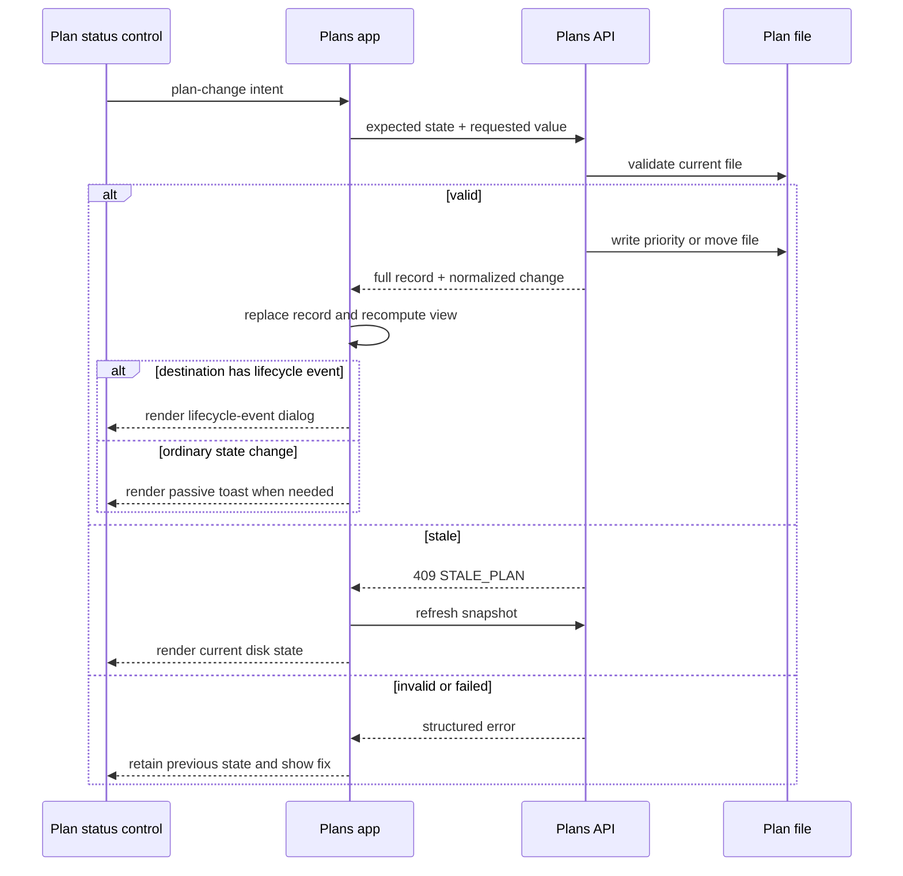

# Plan Lifecycle Toggle Control

## Summary

Add editable lifecycle and priority controls to both Plans list cards and the plan detail drawer. Lifecycle changes move the Markdown file between canonical lifecycle folders; priority changes continue to update frontmatter. Wire lifecycle-aware card actions and lifecycle dropdown changes through the same mutation path.

Both mutations must:

- validate before changing the file or UI;
- reject stale browser state and refresh from disk;
- derive the displayed list exclusively from current files, lifecycle tab, filters, and sorting;
- show either a lifecycle-event dialog or a passive bottom-right toast after a successful mutation;
- reuse the same status-section component and mutation orchestration on cards and in the detail drawer.

## Goals

- Make lifecycle editable with the same interaction model as priority.
- Keep lifecycle derived only from file location.
- Make list order, filters, counts, and visible cards match the filesystem snapshot.
- Provide useful, recoverable errors without optimistic UI drift.
- Make every list-card status element available in the detail drawer.
- Reuse one status component rather than maintaining card and drawer variants.
- Give users direct navigation to the updated plan or its new filtered view after a card disappears.
- Make card actions shortcuts into the same lifecycle behavior exposed by the dropdown.
- Separate lifecycle events, lifecycle next steps, and ordinary lifecycle state changes.
- Keep the lifecycle dropdown visible in every canonical state while showing priority only for backlog and active plans.

## Non-goals

- Add lifecycle or status frontmatter.
- Support arbitrary destination folders.
- Move plans between repositories.
- Rename plan files during lifecycle changes.
- Add React or another UI framework.
- Automatically repair a plan that fails destination lifecycle requirements.
- Preserve the current dirty-card behavior after a successful mutation.
- Implement document-warning validation or generated repair prompts in the first milestone.
- Add direct “Start in Codex” or “Start in Claude” integrations; the lifecycle-event dialog must leave room for them.

## Current State

Reviewed against commit `3ba2ce81760a3309b549a40c51c20a359a201505`.

### Lifecycle model

`modules/plan-docs/index.mjs` derives lifecycle from location:

| Location                    | Lifecycle      |
| --------------------------- | -------------- |
| `docs/plans/backlog/*.md`   | `backlog`      |
| `docs/plans/active/*.md`    | `active`       |
| `docs/plans/completed/*.md` | `completed`    |
| `docs/plans/archived/*.md`  | `archived`     |
| `docs/plans/*.md`           | `unclassified` |

The `plan-docs` schema prohibits a duplicate `status` frontmatter property. The stable frontmatter `id` survives file movement.

### Priority mutation

The current priority flow spans:

- `portal/plans/elements/plan-card.js`
- `portal/plans/app.js`
- `portal/plans/api.js`
- `scripts/cli/portal-routes-plans.mjs`
- `scripts/cli/plans.mjs`
- `modules/plan-docs/index.mjs`

The server validates the priority, repository boundary, and expected `mtimeMs` before updating frontmatter. It returns the priority and new modification time.

The UI currently mutates the in-memory record. If the changed priority no longer matches the active filters, `dirtyKeys` force-includes the card until the user changes a filter or tab. This intentionally prevents the card from disappearing, but conflicts with the new requirement that the list immediately reflect its filters.

### Card and detail drawer

`<plan-card>` renders the status section. It contains:

- lifecycle-dependent readiness;
- priority dropdown when applicable;
- blocked state;
- review state;
- modification time;
- progress;
- next action.

The detail drawer renders lifecycle, priority, next action, review, and task totals as static definition-list rows. It does not reuse the card status section and does not permit priority changes.

### Toast

The page already has one fixed bottom-right `#toast`, but `showToast()` accepts plain text only and hides it after 1.2 seconds. It cannot render links or preserve enough context to reopen a moved plan.

### Existing plan actions

`portal/plans/templates.js` defines lifecycle-valid Plan Docs prompt actions. The current recommended action copies its prompt directly. Lifecycle mutation and prompt generation are separate, so clicking the action cannot currently move a plan or present contextual post-transition actions.

## Decisions

### One shared status component

Create a light-DOM `<plan-status>` custom element and use it in both `<plan-card>` and the detail drawer.

It owns:

- lifecycle dropdown;
- priority dropdown;
- readiness, blocked, and review indicators;
- modification time;
- progress and next action;
- per-control loading and error presentation;
- mutation events.

It receives the plan record as a property and emits bubbling events:

```js
status.addEventListener("plan-change", ({ detail }) => {
  handlePlanChange(detail);
});
```

The event detail contains only mutation intent:

```js
{
  property: "lifecycle",
  value: "active",
  record
}
```

The element does not import page state, call APIs, inspect filters, render global toasts, or decide whether it remains visible. Those are page orchestration responsibilities.

### Same status content on both surfaces

The drawer must show the entire shared status section, not a reduced metadata approximation. Static duplicate rows for lifecycle, priority, next action, review, and task totals should be removed from drawer metadata after the shared section is mounted.

Plan identity can remain in drawer metadata:

- stable plan ID;
- repository/path;
- other detail-only data added later.

Priority remains hidden for `completed` and `archived` plans on both surfaces, matching current card behavior. Lifecycle remains editable on every canonical lifecycle, including completed and archived. Implement the priority and lifecycle controls as one shared widget within `<plan-status>` so the card and detail drawer use identical behavior and presentation.

### Lifecycle state, event, and next step are distinct

Use three separate concepts:

| Concept             | Meaning                                                           | Example                                      |
| ------------------- | ----------------------------------------------------------------- | -------------------------------------------- |
| Lifecycle state     | Current canonical folder                                          | `backlog`, `active`, `completed`, `archived` |
| Lifecycle event     | A successful move into a state with contextual follow-up behavior | Any move to `active` or `completed`          |
| Lifecycle next step | An action offered after the event or while already in that state  | Copy the `/plan-docs start` prompt           |

Only moves to `active` and `completed` are lifecycle events in this milestone. Model the mapping as configuration so later states can opt into an event without changing the mutation controller.

Moving to `backlog` or `archived` is an ordinary lifecycle state change. It succeeds through the same mutation endpoint but does not open a lifecycle-event dialog.

### Actions by current state

| Current state | Visible action             | Behavior                                                                                          |
| ------------- | -------------------------- | ------------------------------------------------------------------------------------------------- |
| Backlog       | **Start** primary CTA      | Move to Active through the shared lifecycle mutation, then open the Active lifecycle-event dialog |
| Active        | **Start** primary CTA      | Do not move the file; open the Active next-step dialog for the existing plan                      |
| Active        | **Archive** default button | Move to Archived, then use passive toast behavior                                                 |
| Completed     | None currently defined     | Lifecycle dropdown remains available                                                              |
| Archived      | None                       | Lifecycle dropdown remains available                                                              |

Do not add a **Complete** shortcut until its desired placement and wording are defined. Moving to Completed through the lifecycle dropdown still triggers the Completed lifecycle event.

CTA styling belongs to the contextual next-step action, not every lifecycle transition. Archive remains a normal/default button because it changes state without initiating a lifecycle event.

The action and dropdown are only two entry points. They must call the same page-level lifecycle mutation function and receive the same validation, stale-state handling, record replacement, and post-success event behavior.

### Lifecycle remains folder-derived

Do not write lifecycle to frontmatter. A successful lifecycle change performs one file move:

```text
docs/plans/<old-lifecycle>/<filename>.md
                         ↓
docs/plans/<new-lifecycle>/<filename>.md
```

`unclassified` is a recovery classification, not a workflow state. It remains a valid source so a misplaced root plan can be moved into a canonical folder, but it is never offered as a destination.

Migrate existing unclassified plans to `backlog` as part of rollout. Hide the Unclassified lifecycle tab when none remain. If a root-level plan later appears through a manual or external file operation, surface it in a warning/recovery view with its lifecycle dropdown and no lifecycle CTA.

Do not silently treat unclassified as backlog: its presence means the document is outside the supported workflow and needs an explicit destination.

### Filesystem truth controls UI truth

The client must not update the record until the server mutation succeeds.

If the file does not move or the priority is not written:

- leave the current client snapshot unchanged;
- keep the dropdown on its previous value;
- show the control’s local error state;
- show the page error banner;
- explain what failed and how the user can fix it.

After success, replace the old snapshot record with the complete record returned by the server and render from the normal lifecycle/filter/sort pipeline. Do not force-include the changed record.

## Proposed Design

### Shared domain mutation result

Both mutation endpoints should return a complete public plan record:

```js
{
  change: {
    property: "lifecycle",
    previousValue: "backlog",
    newValue: "active"
  },
  record
}
```

Returning the full record is necessary because lifecycle movement changes:

- `key`;
- `relativePath`;
- lifecycle;
- `mtimeMs`;
- validation warnings;
- readiness;
- available plan-doc actions;
- potentially review state and other derived values.

Priority should use the same result shape even though fewer fields usually change. This gives the UI one mutation-success path.

The entry point is client context, not mutation semantics. A card action may request a lifecycle change or open the next-step dialog without a change, but successful lifecycle changes always return this normalized result before the UI decides which outcome surface to show.

### Lifecycle event configuration

Keep transition outcomes declarative:

```js
const lifecycleEvents = {
  active: {
    dialog: "active",
  },
  completed: {
    dialog: "completed",
  },
};
```

This map answers whether a destination triggers an event and which dialog content to render. It must not duplicate filesystem validation or movement rules.

The Active dialog contains:

- confirmation that the plan moved to Active when a transition occurred;
- a brief explanation of what `/plan-docs start` does;
- **Copy Start Prompt** with the existing action icon;
- **View Plan**, which closes the dialog before opening the updated plan;
- a muted **Revert to {previousValue}** action at the bottom when opened after a transition.

When opened from an already-Active plan’s **Start** CTA:

- do not mutate lifecycle;
- omit transition confirmation and Revert;
- show the same `/plan-docs start` explanation and **Copy Start Prompt** action.

The Completed event dialog contains transition confirmation, **View Plan**, and muted **Revert to {previousValue}**. Its contextual Plan Docs next step remains an open content decision; do not invent a completion prompt in this milestone.

### Endpoint surface

Add:

```text
POST /api/plans/lifecycle
```

Request:

```js
{
  (id, key, lifecycle, expectedLifecycle, mtimeMs, repositoryId);
}
```

Update the priority request to include stable identity and expected state:

```js
{
  (id, key, priority, expectedPriority, mtimeMs, repositoryId);
}
```

The server must validate allowable values at the start of each request. The toast never validates domain values; it receives only a successful, server-normalized result.

### Stable identity and stale state

Plan keys include paths and therefore change after a move. Resolve a mutation in two stages:

1. Locate the expected record by `key`.
2. Re-scan the named repository and resolve the stable plan `id`.

The mutation is stale if the current record’s repository, path, lifecycle or priority, or modification time differs from the expected request state.

A moved file should not degrade into a generic missing-file response. If the stable `id` now exists elsewhere in the same repository, return a structured stale conflict that identifies the current lifecycle and path.

If no matching stable ID exists, report that the plan can no longer be found and recommend refreshing or restoring the file.

### Lifecycle move validation

Perform every check before `fs.renameSync()`:

1. Validate the requested lifecycle against `backlog`, `active`, `completed`, and `archived`.
2. Resolve the repository and current plan by stable ID.
3. Confirm expected repository, path, lifecycle, priority where relevant, and `mtimeMs`.
4. Resolve real repository and source paths.
5. Construct the destination from the canonical lifecycle map and existing filename.
6. Confirm source and destination stay inside the same real repository.
7. Confirm the destination directory is canonical.
8. Confirm no file or symlink already occupies the destination path.
9. Validate the plan against destination lifecycle rules.
10. Move the file with `rename`.
11. Invalidate the source cache entry and rebuild the updated plan record from disk.

Because source and destination are inside one repository, `rename` is the intended atomic operation. If it throws, do not update server cache or client state.

### Destination lifecycle validation

| Destination | Required behavior                                                                                                                                                     |
| ----------- | --------------------------------------------------------------------------------------------------------------------------------------------------------------------- |
| Backlog     | Allow draft, ready, or blocked plans. Require `next_action` under the existing actionable-lifecycle rule.                                                             |
| Active      | Require remaining actionable work, non-empty `next_action`, implementation context, success criteria, and explicit blockers when present.                             |
| Completed   | Require no required unchecked tasks, blockers, unresolved required decisions, or `next_action`; require verification evidence or an explicit verification limitation. |
| Archived    | Allow explicitly; archival does not imply completion. Require `next_action` to be empty under the lifecycle schema.                                                   |

Return all failed requirements together so the user can fix them in one edit.

Example:

> “Couldn’t move ‘Lifecycle Controls’ to Completed. The plan still has 3 unchecked tasks and a next action. Complete or remove those items, then try again.”

### Error contract

Use structured errors:

| HTTP  | Code                     | Meaning                                                         |
| ----- | ------------------------ | --------------------------------------------------------------- |
| `400` | `INVALID_CHANGE`         | Unsupported property or value                                   |
| `409` | `STALE_PLAN`             | File or relevant plan state changed after the browser loaded it |
| `409` | `DESTINATION_EXISTS`     | A file already occupies the target path                         |
| `422` | `LIFECYCLE_REQUIREMENTS` | Plan does not satisfy destination rules                         |
| `404` | `PLAN_NOT_FOUND`         | Stable plan ID no longer exists in the repository               |
| `500` | `MOVE_FAILED`            | Filesystem move failed after validation                         |

Response:

```js
{
  error: {
    code: "LIFECYCLE_REQUIREMENTS",
    message: "Couldn’t move “Lifecycle Controls” to Completed.",
    resolution: "Complete or remove the unchecked tasks and clear next_action.",
    details: [
      "3 required tasks remain unchecked.",
      "next_action must be empty."
    ]
  }
}
```

`portal/shared/api.js` should preserve the status, code, resolution, and details on its thrown error instead of reducing the response to a message string.

## Client Mutation Flow



### One page-level mutation handler

Replace `handlePriorityChange()` with a property-agnostic orchestrator:

```js
async function handlePlanChange({ property, value, record }) {
  const previousView = currentViewFor(record);
  const result = await mutations[property](record, value);
  replaceRecord(record.key, result.record);
  const removedFromView = previousView.visible && !isVisible(result.record);
  render();
  presentChangeOutcome({ result, removedFromView });
  return result.record;
}
```

`currentViewFor()` and `isVisible()` are pure helpers using:

- selected lifecycle;
- `matchesFilters()`;
- the current snapshot.

No dynamic callback is required on the toast. The page already owns the filter state and can determine visibility exactly.

### Visibility rule

An item is visible when both are true:

```js
const isVisible = (record) =>
  record.plan.lifecycle === state.selectedLifecycle &&
  matchesFilters(record, state.filters, null);
```

For ordinary changes, show the passive toast only when a successful mutation changes the record from visible to not visible. Lifecycle events use their dialog regardless of whether the record remains visible.

| Mutation           | Current view           | Result                    | Outcome                          |
| ------------------ | ---------------------- | ------------------------- | -------------------------------- |
| Backlog → Active   | Backlog tab            | Card disappears           | Active lifecycle-event dialog    |
| Active → Completed | Active tab             | Card disappears           | Completed lifecycle-event dialog |
| Active → Archived  | Active tab             | Card disappears           | Passive toast                    |
| Low → High         | Priority filter = Low  | Card disappears           | Passive toast                    |
| Low → High         | Priority filter = All  | Card remains and reorders | None                             |
| Low → High         | Priority filter = High | Card was not visible      | None                             |
| Priority unchanged | Any                    | No effective change       | None                             |

The additional filtered-list action appears only when the relevant current filter equals `change.previousValue`:

- lifecycle: **View {newValue} plans**;
- priority: **View {newValue} priority plans**.

This condition describes the common removal case without putting filter logic inside the toast. The page computes it from normalized filter state and passes an already-resolved action descriptor to the outcome controller.

### Remove dirty-card retention

Delete `dirtyKeys`, `includeDirtyCards()`, and the dirty-card styling for successful mutations.

The list must immediately reflect:

- the real file location;
- the selected lifecycle;
- all active filters;
- the normal `planSort()` result.

This also means a priority change can immediately reorder a card when no filter removes it.

## Outcome Surfaces

### Lifecycle-event dialog

Create one template-backed singleton dialog controller. It receives:

- the normalized lifecycle change, or an already-in-state next-step request;
- the updated full record;
- event configuration;
- existing prompt-generation and copy handlers.

It does not mutate files or validate lifecycle values. For a transition, render it only after server success. Closing the dialog never reverts the state.

**View Plan** must close the dialog first, then open the updated plan by stable ID or returned key. Revert performs a new guarded lifecycle mutation from the current state to `change.previousValue`; it is not a client-side rollback.

### Passive toast

Replace the text-only toast with a template-backed page controller. It remains a singleton because only one notification is displayed at a time.

Lifecycle copy:

> “[Title]” lifecycle was set to Archived. Undo · View plan · View archived plans

Priority copy:

> “[Title]” priority was set to High. Undo · View plan · View high-priority plans

The toast is fixed at the bottom-right with the existing 20px gutter. It contains real buttons or links styled as underlined text, not HTML inserted into a string.

Actions:

- **Undo** performs a new guarded mutation to `change.previousValue`.
- **View plan** opens the detail drawer using the returned record’s new `key`.
- **View {newValue} plans** appears only when the current lifecycle filter matched the previous lifecycle and selects the returned lifecycle.
- **View {newValue} priority plans** appears only when the current priority filter matched the previous priority and sets the returned priority filter.

The filtered-list action must call the same state setters used by existing controls. Do not manually construct partial URLs in the toast.

For priority, existing filter state is preserved except `priority`. For lifecycle, existing filters are preserved and the lifecycle tab changes. If those other filters still exclude the plan, the list is accurate; **View plan** remains the direct escape hatch.

Undo uses the latest returned record as its expected state. If the plan changed again, normal stale-conflict recovery applies; never force a reversal.

Use a longer dismissal interval than the current copied-message toast because the user must be able to read and act on two links. Target 6–8 seconds, pause dismissal while focused or hovered, and allow manual dismissal. Reusing the same viewport slot for “copied” and plan-update notifications is acceptable, but the controller must reset its timer and content between notifications.

## Detail Drawer Behavior

### Priority change

- Keep the drawer open.
- Replace the snapshot record with the server-returned record.
- Re-render the shared status section and drawer content.
- If the record was visible behind the drawer and the priority filter now excludes it, show the same priority toast.

### Lifecycle change

- Hide the stale drawer before opening a lifecycle-event dialog.
- Remove the card through normal rendering.
- For moves to Active or Completed, open the corresponding lifecycle-event dialog.
- For ordinary moves that remove the item from the current view, show the passive toast.
- **View Plan** reopens the drawer with the returned key and updated path.

Closing avoids leaving a detail surface open for a record whose path, lifecycle actions, and key have changed.

### Failure

- Keep the drawer open.
- Keep both controls at their prior values.
- Show the error beside the affected dropdown and in the global warning banner.

### Stale conflict

- Fetch a complete fresh snapshot automatically.
- Re-render the list, counts, filters, and open drawer from the current record when its stable ID still exists.
- Show:

> “This plan changed outside the portal, so the update wasn’t applied. The page has been refreshed.”

- Include the current lifecycle or priority when useful.
- If the plan no longer exists, close the drawer and explain that it was removed or renamed outside the portal.

## File-Level Implementation

### Domain and server

- `modules/plan-docs/index.mjs`
  - Add lifecycle constants and canonical destination resolution.
  - Add stable-ID repository lookup.
  - Add destination lifecycle validation.
  - Add `movePlanLifecycle()`.
  - Refactor priority mutation to return a rebuilt full record.
  - Add structured domain errors.
- `scripts/cli/plans.mjs`
  - Add `updatePlanLifecycle()`.
  - Normalize both mutations into the shared result contract.
  - Rebuild or invalidate cached snapshots only after successful disk mutation.
- `scripts/cli/telemetry.mjs`
  - Pass the lifecycle handler into the portal server.
- `scripts/cli/portal-routes-plans.mjs`
  - Add `/api/plans/lifecycle`.
  - Serialize structured errors and their HTTP status.

### Portal

- `portal/plans/api.js`
  - Add `updatePlanLifecycle()`.
  - Expand priority mutation request identity.
- `portal/plans/elements/plan-status.js`
  - Add the shared status custom element.
  - Own dropdown loading and local error states.
  - Emit `plan-change`.
- `portal/plans/elements/plan-card.js`
  - Mount `<plan-status>`.
  - Remove local priority-dropdown implementation.
- `portal/plans/elements/index.js`
  - Register the new element.
- `portal/plans/index.html`
  - Add real status, lifecycle-event dialog, and toast templates.
  - Add a drawer status mount.
- `portal/plans/templates.js`
  - Remove duplicated status metadata rows.
  - Add toast template filling if kept outside a dedicated controller module.
- `portal/plans/state.js`
  - Add pure record visibility and record replacement helpers.
  - Preserve normal filter and sort behavior.
- `portal/plans/app.js`
  - Add the shared mutation orchestrator.
  - Add stale-refresh recovery.
  - Add the lifecycle-event dialog and passive-toast controllers.
  - Route existing lifecycle actions through the shared mutation behavior.
  - Open Active’s next-step dialog without mutation when **Start** is used from Active.
  - Remove dirty-card retention.
  - Wire the same status events from card and drawer.
- `portal/plans/styles.css`
  - Make status styles surface-neutral.
  - Add drawer placement.
  - Add dialog hierarchy, muted Revert styling, linked toast layout, hover/focus behavior, and responsive gutter.
  - Remove dirty-card styles.

## Follow-up Milestone: Lifecycle Validation Assistance

Keep destination validation in the core mutation path, but defer richer document remediation UI.

The follow-up milestone should:

- surface all lifecycle-readiness warnings before a move;
- block moves whose canonical destination requirements are not satisfied;
- explain each missing field, incomplete task, blocker, or unresolved decision;
- offer **Generate prompt to resolve warnings**;
- generate a repository-aware prompt containing the plan path, requested destination, validation findings, and instruction to update the document without moving it prematurely;
- refresh and revalidate after the agent or user edits the plan.

Examples include missing required frontmatter before Backlog → Active and incomplete tasks or remaining `next_action` before Active → Completed.

## Validation

### Domain tests

Extend `scripts/test/plan-docs-check.mjs` to cover:

- every valid lifecycle source/destination pair;
- unclassified source to a canonical lifecycle;
- unclassified rejected as a destination;
- existing unclassified plans migrated to backlog during rollout;
- stable ID unchanged after movement;
- key and relative path changed after movement;
- frontmatter unchanged by lifecycle movement;
- source removed and destination created;
- destination collision rejected without moving either file;
- stale `mtimeMs`, lifecycle, path, priority, and stable ID conflicts;
- file moved externally before request returns `STALE_PLAN`;
- repository-boundary and symlink escape rejection;
- lifecycle requirement errors returned together;
- failed rename leaves cache and public record unchanged;
- priority returns a complete rebuilt record;
- public responses do not expose absolute paths.

### Portal state tests

Add focused tests for pure helpers:

- lifecycle move makes a visible card invisible;
- priority change under matching priority filter makes it invisible;
- priority change under `all` keeps it visible and reorders it;
- a record not previously visible does not generate a removal toast;
- returned old key is replaced by new key exactly once;
- lifecycle and priority filtered-list actions use valid normalized values.
- moves to Active and Completed select lifecycle-event dialogs;
- moves to Backlog and Archived select passive-toast behavior only when removed from view;
- Active **Start** opens the next-step dialog without a lifecycle mutation;
- filtered-list action appears only when the matching current filter equals `change.previousValue`;
- Undo and Revert submit guarded inverse mutations rather than editing client state.

### Manual portal checks

- Both cards and drawer show identical status sections.
- Both surfaces can change lifecycle and priority.
- Lifecycle success moves the real file.
- Invalid lifecycle movement leaves disk and UI unchanged and explains the fix.
- External edits and moves cause friendly stale recovery.
- Lifecycle counts, filtered counts, ordering, and empty states update immediately.
- Passive lifecycle toast opens the moved plan and destination tab.
- Backlog **Start** moves the file through the same endpoint as the dropdown and opens the Active dialog.
- Active **Start** leaves the file in Active and opens the same prompt UI without transition copy.
- Active **Archive** uses default button styling and passive-toast behavior.
- Active and Completed event dialogs remain open after state mutation until dismissed.
- **View Plan** closes the event dialog before opening the plan drawer.
- Event-dialog Revert is muted and follows all normal stale-state safeguards.
- Priority toast appears only when the active filter removes the card.
- Completed and Archived surfaces hide priority while always showing lifecycle.
- Archived has no trigger action.
- Unclassified is absent from normal navigation when no misplaced plans exist.
- Toast actions are keyboard accessible and remain available while focused.
- Narrow and wide layouts preserve the bottom-right gutter without covering critical controls.

Run:

```sh
npm run test:plans
git diff --check
```

Also run any repository-native portal test command added during implementation.

## Risks and Mitigations

| Risk                                            | Mitigation                                                                          |
| ----------------------------------------------- | ----------------------------------------------------------------------------------- |
| Path-based key becomes stale after move         | Return the rebuilt record and use stable ID for conflict recovery                   |
| Destination collision overwrites a plan         | Reject if any file or symlink occupies the destination                              |
| Client shows a move that failed                 | Update snapshot only after server success                                           |
| Drawer and card behavior drift                  | Use one `<plan-status>` element and one page-level mutation handler                 |
| Filter logic is duplicated in toast             | Compute visibility through the existing matcher                                     |
| External file edits race with mutation          | Validate stable identity, expected state, and `mtimeMs` immediately before mutation |
| Lifecycle validation becomes scattered          | Keep lifecycle rules in the plan-docs domain module                                 |
| Toast links inject unsafe text                  | Fill text slots and bind real elements; do not use `innerHTML`                      |
| CTA and dropdown behavior drift                 | Route both through the same lifecycle mutation orchestrator                         |
| Undo overwrites a newer external edit           | Implement Undo and Revert as guarded inverse mutations                              |
| Unclassified becomes a permanent pseudo-backlog | Migrate current files and retain it only as a warning/recovery classification       |

## Acceptance Criteria

- Lifecycle and priority dropdowns appear and behave identically in the list card and detail drawer.
- Every card status-section element is available in the detail drawer through shared rendering.
- Lifecycle is derived exclusively from canonical folder placement.
- Invalid or failed mutations do not change client state.
- Successful lifecycle changes move the file and immediately remove it from the old lifecycle view.
- Successful priority changes remove the card only when current filters exclude the new record.
- Moves to Active or Completed open a lifecycle-event dialog after success.
- Ordinary state or priority changes show a passive toast only when current filters remove the record.
- Backlog and Active **Start** actions reuse the same Active next-step dialog, with Backlog first moving the plan through the shared lifecycle mutation.
- Passive toasts provide Undo and View Plan; the filtered-list action appears only when the prior filter matched the changed value.
- Event dialogs provide View Plan and a muted guarded Revert after a transition.
- List contents, ordering, filter counts, and lifecycle counts always derive from the updated snapshot.
- Stale portal state triggers a `409`, automatic refresh, and friendly explanation.
- The moved plan remains addressable through stable ID and the server-returned new key.
- Priority is visible only for Backlog and Active; lifecycle is always visible for canonical states.
- Unclassified is treated as a recoverable placement warning, never a selectable destination.
- `npm run test:plans` and `git diff --check` pass.

## Open Question

- Define the contextual next-step content for the Completed lifecycle-event dialog. Until then, it contains confirmation, View Plan, and muted Revert only.
