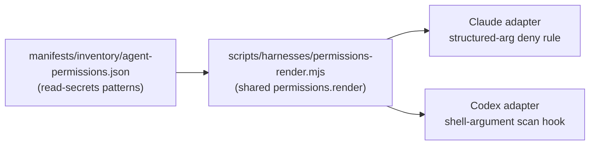

# Block Codex Sandbox Reads of Credential Paths

## Summary

Codex's sandbox has no equivalent to Claude's `read-secrets` denylist. Under the `roborepo-workspace`
permission profile, a Codex session can read any file the user's OS account can read — `.ssh` keys,
`.aws` credentials, browser data, secrets in unrelated repositories — with no prompt and no deny.
Writes are correctly confined to the configured workspace roots; reads are not confined at all.

This plan implements full credential-read parity with Claude on Codex, enforced through the
existing harness provider contract rather than as a standalone Codex-only patch, so the guarantee
("every provider denies reads of `read-secrets` paths") is structurally required of every provider,
not opportunistically added to one.

## Context

[[ia1q1z9]] (repo-scoped write permissions) closed with Codex's write-scope verified and its
read-family question resolved as "no hook needed" — Codex's sandbox already reads wide and writes
narrow by construction, the same shape Claude achieves with `read-secrets` plus a PreToolUse hook.
That resolution was correct for the *write-scope parity* goal that plan was scoped to, but it
surfaced this gap as an explicit known follow-up rather than closing it.

Claude blocks credential paths through `manifests/inventory/agent-permissions.json`'s
`read-secrets` behavior, denied via structured tool arguments (`Read`, `Grep`, `Glob` all take a
path parameter the permission system parses directly). Codex has no structured file-read tool —
everything is a shell command string (`cat`, `sed`, `less`, arbitrary one-liners), and its existing
PreToolUse hook, `globals/system/hooks/codex/permission-check.mjs`, matches only on **command-token
prefixes** (`git push`, etc. — see `matchesPrefix()`), never on file-path arguments inside a
command. Blocking `.ssh` reads means catching an open-ended set of commands by their *arguments*,
not their leading tokens, which the current matcher was not built to do.

Verified live against the shipped Codex 0.140.0 binary from within the `roborepo-workspace`
sandbox profile:

| Path | Read | Write |
| --- | --- | --- |
| Active worktree | allowed | allowed |
| Sibling worktree of this repo (`~/.worktrees/roborepo/...`) | allowed | allowed |
| Primary checkout (outside `~/.worktrees`) | allowed | blocked (`Operation not permitted`) |
| `$HOME` (arbitrary file) | allowed | blocked (`Operation not permitted`) |
| `/etc/hosts` | allowed | — |
| `~/.ssh/config` | allowed | — |

The generated profile also has `network.enabled = false` today, so a credential read inside the
sandbox currently has no in-sandbox network path to exfiltrate it. `network.enabled` is a
per-profile setting (`scripts/harnesses/permissions-render.mjs`), not a permanent guarantee.

### Existing provider-capability contract

`scripts/harnesses/contract.mjs` already defines the mechanism this plan uses: every provider
manifest declares `capabilities` (`root-config`, `rules`, `permissions`, `hooks`, etc.), and
`validateCapabilityAdapters` fails a provider at validation time if it declares a capability without
implementing the required methods — not a silent no-op. `permissions` is already a required
capability (`adapters.permissions.render`), and both Claude's and Codex's providers already route
through the same shared module, `scripts/harnesses/permissions-render.mjs`, for it.

This is parity in outcome, not in execution: each provider enforces `read-secrets` in its own
idiom — Claude via a structured tool-argument deny rule, Codex via a shell-argument-scanning
PreToolUse hook — but both are driven from the same manifest data and both are required by the same
capability, checked structurally rather than left to convention.

## Goals

- Every harness provider that ships a `permissions` capability denies reads of `read-secrets`
  paths, with no partial or best-effort exception for any one provider.
- Codex's guard reaches credential paths regardless of which shell command or argument form is used
  to reach them (direct, `xargs`, shell variable expansion, globs) — full coverage, not a narrower
  literal-first-argument guard that only catches the common case.
- The guarantee is expressed through the provider contract (`scripts/harnesses/contract.mjs`), so a
  provider that declares `permissions` without a credential-read guard fails validation rather than
  silently shipping a gap.

## Non-goals

- General-purpose shell-argument parsing for every Codex hook behavior — this plan scopes to
  credential-path denial only, not a rewrite of `permission-check.mjs`'s command-matching model for
  every rule it enforces.
- Matching Claude's read-family (repo-wide read) boundary on Codex — that question was already
  resolved in [[ia1q1z9]]; this plan does not reopen it.
- Building network-layer sandboxing beyond what `network.enabled` already provides — this plan
  assumes that setting may change and builds the read guard independently of it, but does not
  redesign network sandboxing itself.

## Current state

`globals/system/hooks/codex/permission-check.mjs` handles `exec_command`/`shell`/`local_shell`/
`bash` tool calls, tokenizes the command by whitespace, and checks whether the leading tokens match
a rule from `manifests/inventory/agent-permissions.json`. It has no concept of a file-path argument
appearing anywhere other than the command's leading position, and no allowlist/denylist keyed on
path patterns.

`manifests/inventory/agent-permissions.json`'s `read-secrets` behavior lists credential path
patterns (`.ssh`, `.aws`, `.env` variants, etc.) but only Claude's renderer consumes it — Codex's
hook does not read this behavior at all today.

Gemini has no path-scoping surface at all (established in [[ia1q1z9]]'s Implementation plan: "the
Policy Engine has neither a path predicate nor a hook surface, so there is nothing to render") and
does not implement the `permissions` capability's path-aware behaviors the way Claude and Codex do.
This plan does not change that; Gemini is out of scope for the same reason it was out of scope for
write-scope.

## Proposed design

Full coverage, chosen over a narrower literal-first-argument guard: extend
`globals/system/hooks/codex/permission-check.mjs` to tokenize **every** argument in a shell command
(not just its leading words), test each path-like argument against `read-secrets`' patterns after
resolving shell variable expansion and glob patterns against the sandbox's known roots, and deny the
whole command if any argument resolves to a credential path. This is deliberately the higher-cost,
higher-coverage shape — it reaches `cat ~/.ssh/config`, `sed -n 1p ~/.ssh/id_rsa`, and indirect forms
like `xargs cat < filelist` or `$HOME/.ssh/*`, not just the common direct case.

Shell quoting, multi-command lines (`&&`, `|`), and expansion correctness are the real
implementation risk (see Risks) — the design goal is to fail closed (ask or deny) on a command the
matcher cannot confidently parse, rather than fail open and silently let an unparsed form through.

To make this a structural guarantee rather than a Codex-only patch:

- `manifests/inventory/agent-permissions.json`'s `read-secrets` behavior becomes the single source
  of credential patterns both providers already partially share — no new pattern list, Codex's
  matcher reads the same behavior Claude's renderer already reads.
- `scripts/harnesses/contract.mjs`'s `CAPABILITY_REQUIRED_METHODS.permissions` gains a documented
  expectation (in code comments and/or a new required method, TBD during implementation) that a
  provider's `permissions.render` output — or its adapter — accounts for `read-secrets`, so a future
  provider (or a regression in an existing one) is caught by `validateCapabilityAdapters` rather than
  discovered the way this gap was: by manual review after the fact.

## Implementation plan

- [ ] Design the exact contract shape: whether `read-secrets` enforcement becomes a new required
      method under the existing `permissions` capability, or a documented sub-requirement checked by
      a dedicated test rather than `validateCapabilityAdapters` itself. Resolve this before writing
      the Codex matcher, since it determines what "done" means for the contract half of this plan.
- [ ] Add a focused test file establishing the credential paths the guard must block — direct reads,
      `xargs`, variable expansion, and glob forms — and the ordinary commands it must not falsely
      block, before implementing the matcher.
- [ ] Extend `globals/system/hooks/codex/permission-check.mjs` with the path-argument scanner.
- [ ] Wire the contract-level check chosen above so a provider declaring `permissions` without
      credential-read enforcement fails validation or a dedicated parity test.
- [ ] Verify live against the shipped Codex binary the same way [[ia1q1z9]] verified write-scope —
      not just unit-level matcher tests, since shell quoting/expansion behavior only shows up when a
      real shell runs the command.
- [ ] Update `docs/user/reference/config-control-panel.md`'s permission scope section to document
      the Codex-side credential guard alongside Claude's `read-secrets` section, and to record that
      Gemini remains out of scope for the same reason as write-scope.

## Validation

- [ ] A Codex session under `roborepo-workspace` is denied (or asked) when a command's arguments
      reach a `read-secrets`-listed path, across direct reads, `xargs`, shell variable expansion,
      and glob forms.
- [ ] Ordinary repository commands touching non-credential paths are unaffected — run the existing
      Codex hook test coverage and confirm no new false positives.
- [ ] A provider that declares the `permissions` capability without credential-read enforcement is
      caught by the contract-level check added in the Implementation plan, not just by manual review.
- [ ] The guard's behavior is documented in `docs/user/reference/config-control-panel.md`.

## Risks

- A path-argument scanner is inherently heuristic against shell syntax. The fail-closed design
  (Proposed design) mitigates the worst case — an unparsed command is denied/asked rather than
  silently let through — but a determined bypass through a form the matcher does not recognize is
  still possible; this plan cannot claim mathematically complete coverage, only best-effort coverage
  with a safe default on the unknown case.
- Extending the required-methods contract in `scripts/harnesses/contract.mjs` affects every current
  and future provider that declares `permissions`, not just Codex — a mis-scoped requirement here
  could force unrelated work on Claude's or a future provider's adapter. Resolve the exact contract
  shape (first Implementation plan item) carefully before wiring enforcement.
- Scope creep toward general shell-argument parsing for `permission-check.mjs` beyond credential
  paths, which this plan explicitly excludes (see Non-goals).
