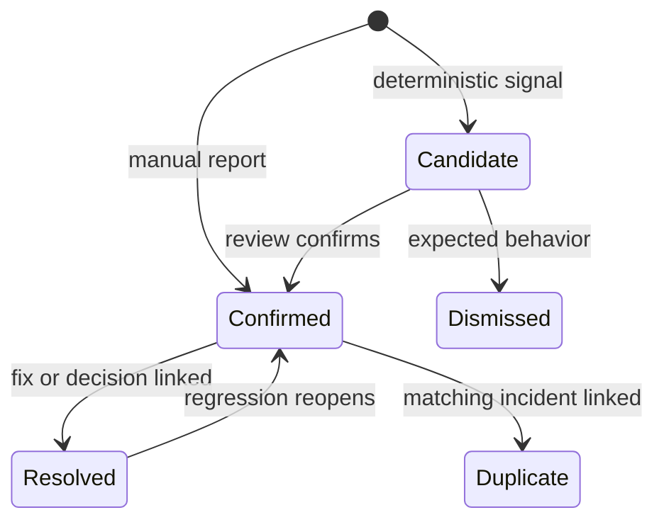
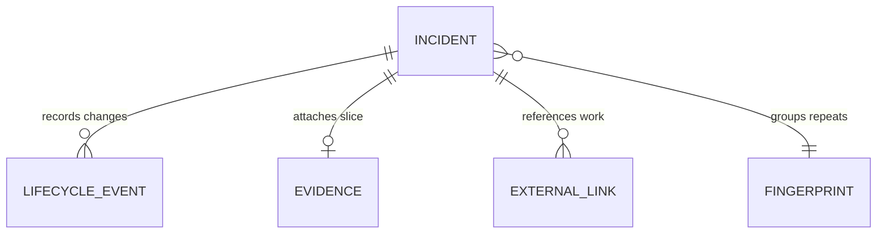
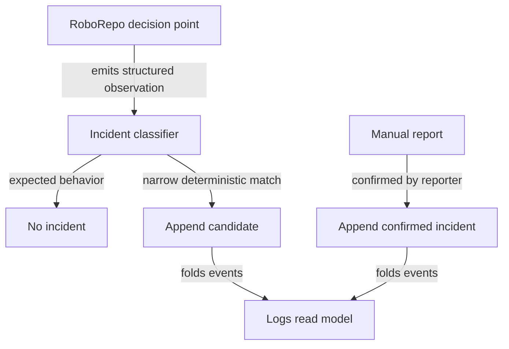

# Rough Draft: Harness Incident Logging and Evidence Capture

> **Rough draft.** This plan records the proposed boundaries and implementation path, but its open
> decisions must be resolved before the work is considered ready to start.
>
> Repository references and naming were reviewed against commit
> `2a56135734a21c6c8ad9435f76f2e9e092b81201`. The `agent-config` filename namespace comes from
> `docs/plans/plans-config.json` at that commit; the working checkout may not yet contain that
> newer configuration file.

## Summary

RoboRepo needs a low-friction way to record evidence that its agent configuration may have behaved
incorrectly without interrupting the task where the problem appeared. Examples include an
unexpected permission block, a missing skill activation, a rule-compliance mismatch, a hook
failure, or required verification happening at the wrong point in a task.

The proposed feature is a built-in **Harness Incidents** system exposed through
`roborepo incident`. It stores global, append-only incident records under RoboRepo state, attaches
repository and harness metadata for filtering, captures only bounded evidence, and adds a local
portal page labeled **Logs**. It shares identity and privacy utilities with telemetry where useful,
but it has separate storage, commands, lifecycle, and semantics.

Automatic capture is limited to deterministic signals RoboRepo directly observes. Behavioral
claims such as “this skill should have loaded” remain manual reports or unconfirmed candidates
until a later evaluator can compare expected configuration with observed activity.

## Goals

- Provide an always-installed CLI command for recording harness-maintenance incidents.
- Capture narrowly selected agent-configuration failures without collecting general application
  errors.
- Let a user or agent attach a small evidence slice from the current chat or tool result.
- Preserve open, dismissed, duplicate, and resolved history without deleting the original record.
- Store incidents globally while retaining repository, harness, model, session, configuration, and
  component metadata for filtering.
- Keep automatic capture deterministic, local, bounded, and free of additional model calls.
- Provide a Logs portal page for reviewing, grouping, editing, and resolving incidents.
- Allow selected incidents to link to GitHub issues, pull requests, and commits without requiring
  GitHub for local operation.

## Non-goals

- General application, build, test, or shell error logging.
- Full transcript storage or continuous semantic analysis of every message.
- Automatic claims that a skill, rule, or model caused an outcome.
- Automatic GitHub issue creation or repository commits for every incident.
- Automatic remediation of harness configuration.
- Replacing telemetry markers, experiment analysis, or token measurement.
- Requiring an LLM call on hook or CLI hot paths.

## Current state

RoboRepo already has several useful foundations, but no incident domain:

| Existing capability | Current owner | Relevance |
| --- | --- | --- |
| Global state root | `scripts/cli/state-paths.mjs` | Provides the location pattern for machine-level incident history. |
| CLI command catalog | `manifests/platform/cli/command-definitions/` | Registers built-in commands independently of optional packages. |
| Permission enforcement | `globals/system/hooks/codex/permission-check.mjs` | Directly knows matched RoboRepo permission rules and missing-manifest failures. |
| Managed-write guidance | `globals/system/hooks/claude/roborepo-write-guard.mjs` | Directly knows when managed harness files are involved. |
| Hook composition | `scripts/cli/hook-composition.mjs` | Defines how system and package hook fragments are installed. |
| Transcript adapters | `scripts/harnesses/transcript-locate.mjs` and `scripts/harnesses/transcript-parse.mjs` | Can locate bounded session evidence when a harness exposes transcripts. |
| Repository identity | `modules/repositories/` | Supplies normalized repository identity without persisting raw local paths. |
| Local portal | `scripts/cli/portal-server.mjs` and `portal/` | Supplies loopback-only pages, APIs, and mutation-token protection. |
| Telemetry | `scripts/cli/telemetry-*.mjs` | Already captures session metadata, configuration snapshots, markers, and experiments when enabled. |

Telemetry is optional and measures sessions, changes, and outcomes. Harness incidents instead
represent maintenance reports with ownership and resolution history. An installation must still be
able to report incidents when telemetry is disabled or absent.

The telemetry capture path provides a performance baseline. Its `PreToolUse` and `PostToolUse`
handler parses transcript state and resolves Git metadata.

## Concept model

| Term | Meaning |
| --- | --- |
| Incident | A durable report that expected harness behavior and observed behavior may differ. |
| Candidate | A deterministic signal worth review but not yet confirmed as a configuration defect. |
| Observation | A structured fact emitted by a RoboRepo-owned decision point, such as a missing permission manifest. |
| Evidence slice | A bounded excerpt containing the signal and minimal surrounding context. |
| Component | The implicated skill, rule, hook, permission behavior, command, package, or harness provider. |
| Resolution event | An append-only status change that records why and when an incident was resolved, dismissed, or linked elsewhere. |
| Fingerprint | A stable hash of normalized category, component, signal, harness, and policy identity used to group repeats. |

The incident record is the source of truth. Portal counts, current status, duplicate groups, and
repository views are derived from the append-only record stream.



### Happy path

1. The user or agent runs `roborepo incident report` when a likely harness problem appears.
2. The CLI validates the category, expected behavior, observed behavior, metadata, and bounded
   evidence slice.
3. The CLI appends a confirmed incident, stores its evidence separately, and prints the incident
   ID plus correction actions.
4. The Logs portal folds lifecycle events and groups repeated fingerprints for review.
5. A maintainer reviews, edits, dismisses, or links the incident to maintenance work.
6. After a fix or explicit decision, the maintainer resolves the incident with a reason and
   optional commit, issue, or pull-request link.
7. A later recurrence reopens the same history or creates a grouped occurrence without deleting
   earlier evidence.

## Proposed design

### Domain boundary

Harness incidents and telemetry remain separate domains with intentionally shared foundations:

| Concern | Harness incidents | Telemetry | Shared |
| --- | --- | --- | --- |
| Purpose | Configuration maintenance and unexpected agent behavior | Measurement, experiments, cost, and outcomes | Repository and session identity |
| Availability | Built in and always callable | Optional package and capture state | Harness provider metadata |
| Storage | `~/.roborepo/incidents/` | `~/.roborepo/telemetry/` | Versioned JSON schemas and redaction rules |
| Write frequency | Only on reports or narrow signals | Multiple lifecycle and tool events | Append-only persistence helpers where generic |
| Model use | None by default | Optional analysis synthesis | Explicit user-triggered evaluation only |
| Lifecycle | Candidate, confirmed, dismissed, duplicate, resolved | Captures, markers, experiments | Cross-links by stable IDs |

Shared code must remain domain-neutral. Incident modules must not import the telemetry command or
depend on telemetry being enabled. Configuration snapshot IDs may be attached when already
available; otherwise the incident stores a compact effective-config identity or `null`.

### Storage and event model

Add incident paths to `scripts/cli/state-paths.mjs`:

```text
~/.roborepo/incidents/
  incidents.jsonl
  evidence/
    <evidence-id>.json
  cursors/
    <harness>-<session-hash>.json
```

`incidents.jsonl` contains both creation and lifecycle events. Creation records are immutable.
Edits, confirmations, resolutions, dismissals, duplicate links, and reopenings append new events.
The read model folds events by `incident_id`; partial final lines are ignored and reported as a
data-quality warning.

Evidence lives separately so list and count operations do not load excerpts. Evidence filenames
use generated opaque IDs, never repository names, session IDs, or user text. Writes use restrictive
file permissions and atomic temporary-file replacement where a complete file is required.



The initial creation schema should contain:

```json
{
  "schema": 1,
  "event": "incident.created",
  "incident_id": "inc_...",
  "ts": "2026-08-11T18:00:00.000Z",
  "source": "manual",
  "state": "confirmed",
  "category": "skill-trigger",
  "severity": "warning",
  "component": {
    "type": "skill",
    "id": "test-harness",
    "revision": "..."
  },
  "expected": "Final validation runs after implementation is complete",
  "observed": "The full suite ran while implementation was still changing",
  "signal": "verification-timing-mismatch",
  "fingerprint": "sha256:...",
  "evidence_id": "ev_...",
  "session": {
    "harness": "codex",
    "session_id_hash": "sha256:...",
    "model": "..."
  },
  "repository": {
    "repository_id": "git:...",
    "label": "roborepo",
    "branch": "main",
    "sha": "..."
  },
  "config_snapshot_id": "...",
  "links": []
}
```

Raw session IDs and transcript paths should remain inside local evidence locators only when the
harness requires them for retrieval. List APIs return hashes or opaque locators by default.

### Categories and deterministic signals

The initial category vocabulary is closed and versioned:

| Category | Examples | Automatic eligibility |
| --- | --- | --- |
| `permission` | Missing manifest, policy mismatch, unexpected deny or prompt | Yes, only when RoboRepo can identify the expected policy or an internal failure. |
| `hook` | Hook crash, invalid JSON, missing installed hook asset | Yes, from a RoboRepo-owned wrapper or health check. |
| `tool-availability` | Configured MCP server or built-in tool missing | Yes when effective config proves it should be present; otherwise candidate/manual. |
| `skill-trigger` | Required skill did not appear to load | Manual initially. |
| `rule-compliance` | Agent behavior contradicted an active rule | Manual initially. |
| `verification` | Required checks skipped, premature, or repeated without justification | Deterministic candidates for known operations; confirmation required. |
| `config-drift` | Installed assets differ from effective managed configuration | Yes from apply, update, repair, inspect, or doctor paths. |
| `other` | Harness-maintenance issue outside the initial vocabulary | Manual only. |

Expected permission prompts and denials are observations, not incidents. For example, a command
configured as `ask` must not create an incident merely because the harness prompted. A missing
manifest, malformed policy, decision disagreement across harnesses, or observed result that differs
from the effective rule can create a candidate.

### Evidence capture

An evidence slice is evidence of an observation, not proof of root cause. Its schema contains:

- the exact structured error or tool result, truncated to a fixed byte limit;
- at most one relevant assistant action before the signal;
- at most one assistant response after the signal when available;
- a harness-native locator containing session, turn, and tool-call identifiers when exposed;
- redaction metadata and hashes of omitted content;
- capture reason, byte count, and truncation flags.

Default limits should be 3 KiB total, 1 KiB per message, and no more than three content items.
Secrets, authorization headers, environment values, and sensitive path segments are redacted before
writing. The full transcript is never copied into incident storage.

Two capture paths are required:

1. **Manual report.** `roborepo incident report --from-current-chat` asks the harness adapter for
   the current signal and bounded neighbors. If transcript access is unavailable, the caller can
   provide `--evidence-file -` or structured `--expected` and `--observed` values.
2. **Automatic candidate.** A RoboRepo-owned hook or command supplies a structured signal directly.
   It must not search earlier transcript history. A later chat-tail scanner may inspect only newly
   appended bytes using a per-session cursor, a narrow allowlist, and a disabled-by-setting escape
   hatch if the open decisions approve it.

Automatic matching should prefer structured hook results and stable error codes. String patterns
are acceptable only for harness errors RoboRepo tests as fixtures. Generic strings such as
`error`, `failed`, `denied`, or nonzero exit status are insufficient.

### CLI and agent workflow

Register `incident` in the built-in command catalog rather than an optional package manifest.
Proposed commands:

```text
roborepo incident report
roborepo incident list
roborepo incident show <incident-id>
roborepo incident edit <incident-id>
roborepo incident confirm <incident-id>
roborepo incident dismiss <incident-id> --reason <text>
roborepo incident resolve <incident-id> --reason <text> [--commit <sha>] [--url <url>]
roborepo incident reopen <incident-id> --reason <text>
roborepo incident link <incident-id> --url <url>
roborepo incident evidence delete <incident-id>
roborepo incident export [--redact]
roborepo incident doctor
```

`report` supports category, severity, component, expected, observed, signal, evidence source, and
optional review flags. The default interaction writes immediately, prints the incident ID and
saved fields, and explains how to edit, dismiss, or delete the evidence attachment. `--review`
prints the proposed record and evidence slice before saving. Noninteractive callers use `--json`.

`/harness-log` may be provided as an agent convenience that structures the current conversation
and invokes `roborepo incident report`. The CLI remains authoritative so every harness has the same
persistence and validation behavior even when slash commands or skills are unavailable.

### Automatic instrumentation

Capture signals at the point of knowledge:



- Extend `globals/system/hooks/codex/permission-check.mjs` to emit incident observations for
  missing or invalid RoboRepo policy state. Do not log normal matched decisions.
- Add a small standalone incident-writer runtime asset usable by installed system hooks without
  importing the full CLI.
- Route RoboRepo-owned hook execution through a wrapper that can record process failure, invalid
  JSON, and missing assets. Harness-native hooks outside RoboRepo ownership remain out of scope.
- Emit drift observations from existing apply, update, repair, and inspection code where expected
  and installed state are already compared.
- Reuse the tested concepts in `scripts/cli/telemetry-classify.mjs` when designing an
  incident-owned deterministic verification classifier. The incident path must remain functional
  when telemetry is disabled and must only emit candidates for explicit rules such as repeated
  full-suite runs without an intervening edit.
- Do not infer missing skill activation from absence alone. A reliable future evaluator needs the
  triggering prompt, effective skill inventory, trigger rule, and observed loading evidence.

### Logs portal

Add a `Logs` page to `PAGES` in `scripts/cli/portal-server.mjs`, a focused route module in
`scripts/cli/portal-routes-incidents.mjs`, and a `portal/logs/` client.

The first version should provide:

- counts by current state and severity;
- filters for repository, harness, model, category, component, severity, and state;
- stable fingerprint grouping with first seen, last seen, and occurrence count;
- expected-versus-observed detail;
- a bounded evidence drawer with redaction and truncation indicators;
- edit, confirm, dismiss, mark duplicate, resolve, reopen, and link actions;
- links to known configuration snapshots, commits, pull requests, or GitHub issues;
- export of selected sanitized incidents.

The portal remains loopback-only. All mutations use the existing origin check and per-server
mutation token. Evidence endpoints reject path input and resolve only opaque evidence IDs.

### Resolution and durable history

Resolved incidents are archived logically, not deleted. A resolution event records reason,
timestamp, optional commit SHA, and optional issue or pull-request URL. Reopening appends another
event and retains the earlier resolution.

Local global history is the primary record and must be included in RoboRepo backup/export behavior.
Selected incidents may be promoted to GitHub issues after sanitization. Promotion is explicit and
out of scope for the first implementation; the schema reserves typed links so it can be added
without changing incident identity.

Repository files are not the default incident store. Writing every report into a checkout would
dirty unrelated working trees and risk committing private evidence. Commits and issues provide
durable shared history only for incidents that become project work.

## Performance and context cost

No automatic path should invoke a model. Deterministic matching, JSON serialization, and local file
writes consume no tokens. Token cost occurs only when the current agent authors a manual report or
the user explicitly requests semantic evaluation.

| Path | Model-token cost | Expected runtime work | Constraint |
| --- | --- | --- | --- |
| Direct RoboRepo observation | None | Normalize fields and append one JSONL line | Only on an actual narrow signal. |
| Manual `/harness-log` | Uses the current conversation context; no separate call required | Validate fields and write bounded evidence | Do not summarize the full chat. |
| `--review` | No additional call unless the caller chooses to revise with a model | Render proposed JSON and excerpt | User interaction only. |
| Chat-tail candidate scanner | None if pattern based | Read only bytes after a stored cursor | Must not reread a full transcript. |
| Semantic skill/rule evaluator | Additional model call and evidence tokens | Load selected config plus bounded slice | Explicit, deferred, and separately metered. |
| Portal list/filter | None | Fold JSONL or read a cached index | Evidence files load only on demand. |

Performance budgets for the first implementation:

- no added process on tool events that contain no incident signal;
- under 5 ms median added work inside an already-running RoboRepo hook process for classification
  and append, measured on a representative macOS development machine;
- no Git subprocesses or full transcript reads on the incident hot path;
- no evidence attachment larger than 3 KiB by default;
- portal list response under 250 ms for 10,000 lifecycle events on a warm local process;
- bounded storage with a documented retention policy and warning before pruning or compaction.

These are proposed budgets and require a benchmark fixture before becoming release criteria.

## Implementation plan

### Phase 1: Schema, persistence, and CLI

- [ ] Add incident and evidence paths to `scripts/cli/state-paths.mjs` with
  `ROBOREPO_STATE_DIR` support.
- [ ] Add focused modules for schemas, validation, ID generation, persistence, event folding,
  redaction, and fingerprinting under `scripts/cli/incidents/`.
- [ ] Define versioned creation, lifecycle, evidence, component, repository, and link schemas.
- [ ] Implement atomic evidence writes and append-only lifecycle writes with restrictive modes.
- [ ] Add built-in `incident` command definitions under
  `manifests/platform/cli/command-definitions/incident/`.
- [ ] Implement `report`, `list`, `show`, `edit`, `confirm`, `dismiss`, `resolve`, `reopen`, `link`,
  `evidence delete`, `export`, and `doctor` in a thin command orchestrator with execution functions
  split by domain.
- [ ] Add JSON output for agent callers and stable exit codes for validation failures.
- [ ] Add backup/export coverage without coupling incident availability to telemetry.

### Phase 2: Manual chat evidence

- [ ] Define a harness-provider capability for locating the current turn and bounded neighbors.
- [ ] Implement adapters only for harnesses whose transcript formats expose stable locators.
- [ ] Add `--from-current-chat`, `--evidence-file -`, `--review`, and explicit no-evidence flows.
- [ ] Add deterministic redaction and truncation before persistence.
- [ ] Add `/harness-log` only as a thin convenience over the CLI, not a second storage path.
- [ ] Show the saved record after write with exact edit, dismiss, and evidence-delete actions.

### Phase 3: RoboRepo-owned automatic candidates

- [ ] Add a dependency-light incident writer suitable for copied system-hook assets.
- [ ] Instrument missing or malformed permission policy in
  `globals/system/hooks/codex/permission-check.mjs`.
- [ ] Define a system-hook wrapper contract for exit failure, invalid output, and missing assets.
- [ ] Emit configuration-drift observations from the existing state-comparison paths.
- [ ] Add a narrow fixture-backed signal registry; reject generic error text and arbitrary nonzero
  tool exits.
- [ ] Decide whether chat-tail scanning is enabled, opt-in, or deferred before implementing it.
- [ ] Add fingerprint-based suppression so identical automatic candidates append an occurrence
  event rather than duplicate full evidence continuously.

### Phase 4: Logs portal

- [ ] Add the Logs page and navigation entry to the shared portal manifest.
- [ ] Add read APIs for summaries, filters, incident detail, groups, and evidence.
- [ ] Add mutation APIs for edit, confirm, dismiss, duplicate, resolve, reopen, and link actions.
- [ ] Build filters and grouped incident rows in `portal/logs/` using existing shared components.
- [ ] Add expected-versus-observed detail and an on-demand evidence drawer.
- [ ] Enforce loopback origin, mutation-token, opaque-ID, and path-traversal protections.

### Phase 5: Hardening and documentation

- [ ] Benchmark append, event-folding, portal list, and bounded transcript-tail paths.
- [ ] Test concurrent writers, interrupted final lines, corrupt evidence, missing transcripts,
  unsupported harness capabilities, and state migration.
- [ ] Add privacy, storage, retention, export, and recovery documentation.
- [ ] Add CLI and portal reference documentation plus a short reporting walkthrough.
- [ ] Run a cross-harness case study using permission, skill-trigger, hook, and verification
  incidents without treating configuration correlation as causation.
- [ ] Revisit explicit GitHub promotion only after the local workflow proves useful.

## Validation

The feature is acceptable when all of the following are demonstrated:

- A user can create and retrieve a confirmed incident with telemetry disabled.
- Every incident contains filterable repository, harness, model, component, and configuration
  metadata when the harness exposes those values, and explicit `null` values otherwise.
- An expected permission prompt or denial creates no incident.
- A missing or malformed RoboRepo permission manifest creates one grouped candidate without
  exposing the shell command or local path.
- A generic application test failure creates no automatic harness incident.
- Manual current-chat capture stores no more than the configured evidence limit and preserves a
  usable locator when supported.
- Redaction fixtures cover secrets, authorization values, environment assignments, and sensitive
  user paths.
- Concurrent writers do not lose complete events or corrupt the read model.
- Resolve, dismiss, duplicate, and reopen actions preserve the complete lifecycle history.
- Incident edits append revision events instead of rewriting the creation event.
- Evidence deletion removes the attachment and appends a tombstone containing its prior hash,
  unless the open deletion decision selects a different explicitly tested policy.
- The Logs portal can filter 10,000 lifecycle events within the agreed local performance budget.
- Portal mutation endpoints reject missing tokens, non-loopback origins, unknown evidence IDs, and
  traversal attempts.
- Hot-path benchmarks show no model call, no Git subprocess, and no full transcript read.
- CLI and portal show the same current state and occurrence count for the same incident.
- Backup and restore preserve active and resolved incidents plus their evidence attachments.

Verification should use repository-native commands discovered at implementation time. At minimum,
add focused Node checks for schemas, persistence, folding, fingerprints, redaction, and classifier
fixtures; shell-level CLI assertions in `scripts/test/test-roborepo.sh`; portal route security tests;
and targeted browser coverage for Logs filtering and lifecycle actions if the repository's browser
test harness is available.

## Risks

| Risk | Impact | Mitigation |
| --- | --- | --- |
| Ordinary failures are mislabeled as harness defects | Logs become noisy and untrusted | Closed categories, structured signals, candidates, fixture-backed patterns, and manual confirmation. |
| Evidence exposes sensitive chat content | Private data persists unexpectedly | Small defaults, redaction before write, separate attachments, opaque IDs, review mode, and evidence deletion. |
| Hooks add latency to every tool call | Agent work slows down | Instrument direct decision points, avoid general scans, and benchmark the dependency-light writer. |
| Absence is mistaken for proof a skill did not load | Incorrect causal claims | Keep skill/rule reports manual or candidate-only until expected and observed evidence are both available. |
| Global JSONL grows indefinitely | Slow reads and excess disk use | Occurrence events, retention policy, compaction with backup, and portal index caching. |
| Incident and telemetry code become coupled | Disabling telemetry breaks maintenance logging | Separate storage and commands; share only domain-neutral helpers and identifiers. |
| Concurrent sessions interleave writes | Lost or malformed lifecycle history | Single-line append discipline, corruption-tolerant reads, concurrency tests, and an optional lock only for compaction. |

## Open questions

| Decision | Options | Current recommendation | Decision criterion |
| --- | --- | --- | --- |
| Default manual evidence | Save bounded evidence immediately; require `--with-evidence`; metadata only | Save immediately with `--review` available | Reporting must stay fast without surprising users about stored content. |
| Chat-tail scanner | Default on; opt-in; defer | Defer until direct signals and manual capture are evaluated | Measured recall must justify privacy and hook cost. |
| Retention | Size cap; age cap; manual-only cleanup | No silent deletion before backup/export exists | Bound disk growth while preserving maintenance history. |
| Evidence deletion | Remove attachment and retain hash/tombstone; short recoverable grace period | Remove attachment and retain a tombstone | A user deletion request must have clear, inspectable effect. |
| Model identity | Latest model only; model history; omit unstable values | Record normalized history when exposed | Cross-harness values must be stable enough for filtering. |
| Fingerprint scope | Global; per repository; per repository and harness | Group per repository and harness, with optional global similarity | Groups should reveal repeats without merging unrelated policy contexts. |
| `/harness-log` surface | Skill; native harness command; both | Both where supported, each delegating to the CLI | The workflow should remain available across harness capability differences. |
| GitHub promotion | Portal action; CLI command; manual copy | Defer; reserve typed links in schema | Local evidence must be reviewed and sanitized before leaving the machine. |
| Incident deletion | Permanent delete; evidence-only delete plus tombstone | Evidence-only delete plus tombstone | History integrity must be balanced against user-controlled deletion. |
