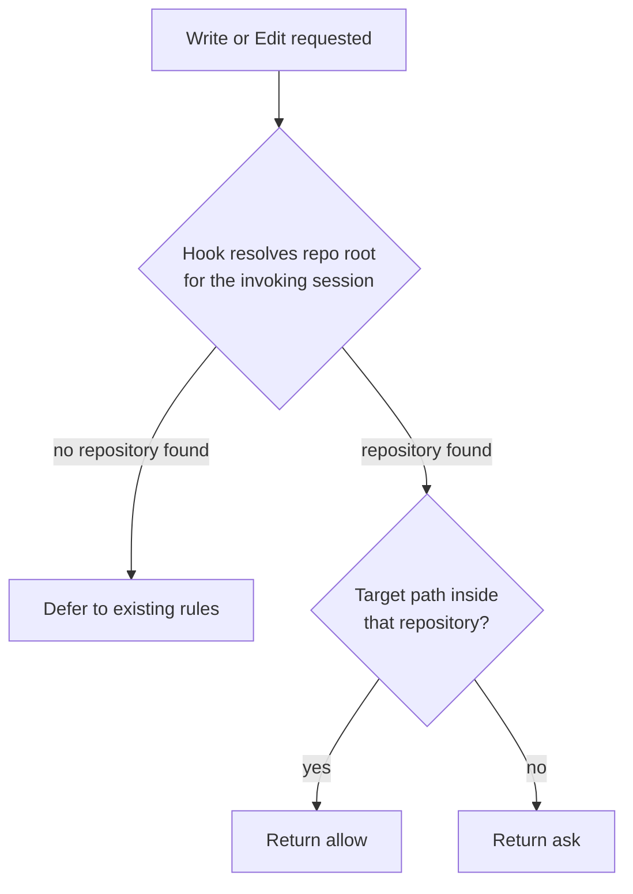

# Repo-Scoped Write Permissions

## Summary

File write permissions are scoped to a fixed directory tree that is hardcoded in a repository-tracked
manifest. Replace it with a scope that means "the repository the agent is working in", so that writes
inside the current repository proceed without prompting and writes outside it prompt.

Two separate problems sit behind this. The scope path is one machine's layout shipped as everyone's
default, and even on that machine the scope is broader than intended — it spans every repository in
the tree rather than the one in use.

## Context

Permission scope lives in `manifests/inventory/agent-permissions.json` as two pairs of behaviors.
Each pair splits one question into two:

| Behavior | Question it answers |
| --- | --- |
| `read-files` / `write-files` | Whether the tool may be used at all, across every path |
| `read-scope` / `write-scope` | Where it may be used without prompting |

Both must pass. The gate exists separately because not every harness can express path scoping, and
`write-files` deliberately emits no unscoped rule of its own — a bare `Write` or `Edit` entry
out-ranks every path-scoped rule and silently defeats the scoping it exists to enable.

## Goals

- A write scope that means the repository currently being worked in, on any contributor's machine.
- Writes outside the current repository prompt rather than proceeding silently.
- No contributor's absolute home path in any tracked file, including generated artifacts.
- Explicit, verified behavior for each of the three harnesses rather than a Claude-only fix.

## Non-goals

- Changing the gate/scope split. The two-behavior model stays.
- Changing read scope semantics. Reads outside the repository are not the problem this plan solves.
- Per-project permission profiles. Permissions remain global machine state.

## Current state

`write-scope` and `read-scope` both carry `~/projects/**` as their first path. That value is a
personal directory layout committed to the repository.

Scope paths are expanded at render time by `expandHome()` in
`scripts/harnesses/permissions-render.mjs`, then written into static harness configuration. The
generated artifact `generated/claude/settings.json` is tracked in Git and contains the expanded
absolute path, so one contributor's home directory is committed to the repository:

```json
"Write(//Users/<user>/projects/**)",
"Edit(//Users/<user>/projects/**)"
```

Three consequences follow:

- A contributor whose repositories live anywhere other than `~/projects` gets a write scope that
  matches nothing. Every write prompts, with no visible cause.
- Within that tree the scope is too broad. An agent working in one repository can write into a
  sibling repository without prompting, because both sit under `~/projects`.
- Expansion happens once, at install. Nothing re-resolves the path per session.

The three harnesses express scope differently, and only one of them consumes the path list at all:

| Harness | Scope mechanism | Consumes `paths` |
| --- | --- | --- |
| Claude | `Write(//path/**)` rules in `settings.json` | Yes |
| Codex | `sandbox_mode` derived from the `write-files` gate | No |
| Gemini | Tool-name matching in the Policy Engine | No |

`codexSandboxMode()` in `scripts/harnesses/permissions-render.mjs` maps the gate to
`workspace-write` or `read-only` — a single coarse mode with no path list. `policy-toml.mjs` skips
`tools-scoped` behaviors entirely, on the stated grounds that rendering a path-scoped allow as an
unscoped allow would be strictly more permissive than intended.

## Proposed design

Resolve the boundary at tool-call time in a `PreToolUse` hook instead of at render time in a path
glob.



The manifest keeps a coarse allowlist for locations that are correct regardless of repository —
agent scratch directories — and drops the personal tree entirely. The repository boundary itself is
never written as a path.

Per harness:

- **Claude** — implement the hook; remove `~/projects/**` from `write-scope`.
- **Codex** — `sandbox_mode: workspace-write` already scopes writes to the workspace. Verify what
  Codex treats as the workspace root and whether that matches the repository boundary; if it does,
  no hook is needed and the existing mode is the correct expression.
- **Gemini** — the Policy Engine has no path predicate. Decide whether the gate alone is acceptable
  or the harness is documented as unable to express repository scoping.

### Why the boundary cannot stay declarative

A path glob cannot express "the current repository", which is why the boundary moves into a hook.

Claude Code's permission rules do not expand variables — paths are literal strings, so a rule
referencing a project-directory variable never resolves at runtime. The supported anchors all
resolve to fixed locations:

| Anchor | Resolves to |
| --- | --- |
| `//path` | Absolute path from filesystem root |
| `~/path` | Home directory |
| `/path` | The directory of the settings file that defines the rule |
| `path` or `./path` | Current working directory |

The `/path` form looks project-relative and is not: in a user-level settings file it resolves
relative to that settings file's own directory. RoboRepo writes user-level settings, so this anchor
would point somewhere unrelated to the user's work.

There is also no "allow inside X, deny everything else" primitive. Rules are positive globs
evaluated deny, then ask, then allow, defaulting to a prompt when nothing matches.

## Implementation plan

- [ ] Prototype a `PreToolUse` hook resolving the repository root for the invoking session, and
      measure its added latency per `Write`/`Edit` call.
- [ ] Decide the behavior when no repository is found: defer to existing rules, or prompt.
- [ ] Decide the behavior for a path inside a nested worktree or submodule.
- [ ] Verify what Codex treats as the workspace root under `sandbox_mode: workspace-write`, and
      whether it already matches the intended boundary.
- [ ] Decide and record Gemini's position: gate-only, or documented as unable to scope.
- [ ] Remove `~/projects/**` from `write-scope` in `manifests/inventory/agent-permissions.json`.
- [ ] Regenerate `generated/claude/settings.json` and confirm no absolute home path remains.
- [ ] Add a test asserting no tracked file contains an expanded home directory in a permission rule.
- [ ] Update the permission scope section of `docs/user/reference/config-control-panel.md`.

## Validation

- A write inside the current repository proceeds without a prompt.
- A write to a sibling repository under the same parent directory prompts.
- A write to an agent scratch directory proceeds without a prompt.
- `rg` over tracked files finds no expanded home directory inside a permission rule.
- `roborepo doctor --installed` passes, including the generated-permissions drift check.
- The behavior above is confirmed on each harness that ships a write scope, not on Claude alone.

## Risks

- **Hook latency.** The hook runs on every `Write` and `Edit`. Resolving a repository root per call
  adds a process spawn unless the result is cached for the session. Measure before committing to the
  design.
- **Hook failure mode.** If the hook errors or is missing, writes fall back to whatever the static
  rules allow. That fallback must be no more permissive than the intended scope.
- **Loss of declarative auditability.** Today the write scope is readable in `settings.json`. Moving
  the boundary into script logic makes it harder to inspect, which raises the value of the tests
  above.
- **Harness divergence.** Three harnesses with three mechanisms may not reach identical behavior.
  Where they cannot, the difference should be documented rather than left implicit.

## Open questions

- Does the repository root resolve correctly when the agent runs from a Git worktree rather than the
  primary checkout? RoboRepo itself uses worktrees, so this is a normal case, not an edge case.
- Should writes outside the repository prompt, or be denied outright? This plan assumes prompt.
- Do agent scratch directories belong in the manifest allowlist, or should the hook recognize them?
- Is there a supported way to inspect a Codex workspace root, or must it be determined empirically?
