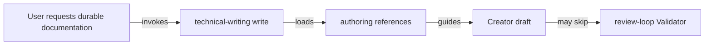
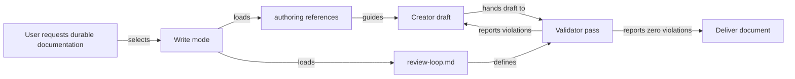
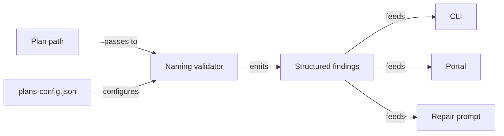

# Make Skill Reference Loading and Validation Reliable

## Summary

RoboRepo's documentation skills currently rely too heavily on agents following chains of references correctly. In repeated document-authoring sessions, important instructions have been skipped even when the user explicitly asked the agent to use the relevant skills. The failures have included incorrect plan filenames, incomplete plan frontmatter, omitted technical-writing Validator behavior, and missed representation or framework-specific guidance.

This plan makes critical skill requirements harder to skip. The main design rule is:

> **References provide depth; `SKILL.md` provides gates.**

Rules that determine whether an artifact is valid must be visible from the skill entry point, required references must be loaded by the mode that needs them, and rules that can be checked deterministically should be enforced in code rather than left entirely to model memory.

The work applies first to `plan-docs` and `technical-writing`, then establishes a reusable pattern for other RoboRepo skills.

## Goals

- [ ] Make required reference loading explicit and difficult to bypass during skill execution.
- [ ] Make `technical-writing write` include the Creator/Validator completion loop instead of requiring a separately inferred review step.
- [ ] Make plan naming, frontmatter, lifecycle, and other deterministic plan rules mechanically enforceable where practical.
- [ ] Ensure plan creation resolves the repository namespace and target filename before drafting begins.
- [ ] Make validator output observable enough that users can tell whether validation actually ran and what it checked.
- [ ] Preserve focused references instead of flattening every detailed instruction into `SKILL.md`.
- [ ] Establish a convention that can be applied to additional skills when similar failures are observed.
- [ ] Add regression coverage proving that required references and validation gates cannot silently disappear from the workflow.

## Non-goals

- Rework the package multi-source distribution design.
- Move all reference content into top-level `SKILL.md` files.
- Require every skill to read every reference on every invocation.
- Build a general-purpose LLM workflow engine.
- Make qualitative technical-writing judgments fully deterministic.
- Change the lifecycle semantics of plan documents.
- Replace Markdown skill instructions with application code where model judgment is still required.

## Current State

### Reference loading is mode-dependent

`technical-writing/SKILL.md` currently defines two named modes: `write` and `review`. There is no separate `edit` or `revise` entry point, and this plan should not add one. `write` is the artifact-producing mode and should cover creating, editing, revising, restructuring, and updating durable documentation. `review` is the read-only evaluation mode for inspecting an existing document and reporting violations without changing it.

Today, `write` requires `doc-shapes.md`, `section-guidance.md`, `representation.md`, and `anti-patterns.md`. The Creator/Validator instructions live in `references/review-loop.md`, but that reference is explicitly required by `review`, not `write`.



An agent can therefore follow the documented `write` reference list literally and still deliver a document without ever loading the Validator contract.

### Critical plan rules are deep in references

`plan-docs` correctly requires `plan-schema.md`, which contains important creation rules: filename shape, repository namespaces, H1 behavior, opaque IDs, allowed frontmatter, and folder-derived lifecycle. These are artifact-validity rules, but several are not surfaced as explicit creation gates in the entry-point skill or enforced by the current programmatic validator.

### Programmatic plan validation is incomplete

The plan-docs validator already handles frontmatter parsing, IDs, priorities, required sections, lifecycle readiness, dependencies, and blockers. Its finding catalog does not currently enforce filename/namespace correctness. A structurally valid plan can therefore use an invalid or inconsistent filename and still receive a finding-free validation result.

### Technical-writing validation is procedural rather than enforced

`references/review-loop.md` defines two distinct roles:

| Role | Responsibility |
| --- | --- |
| Creator | Writes and revises the document |
| Validator | Reads applicable rules and reports violations only |

The Validator must not rewrite the document, each pass must be surfaced in chat, and the loop continues until the Validator reports no violations or reaches the documented pass cap. Today, running that loop still depends on the authoring agent remembering to load it.

### Omitted references can materially change implementation plans

Recent review exposed substantive constraints that were easy to miss when references were not loaded: Mermaid edges require verb labels, data-model-heavy designs may need an ER diagram, framework-less portal markup should use the repo's real `<template>` convention, shared CLI/portal behavior should remain in shared domain code, and verification should use the smallest repository-native test that proves the behavior.

This shows that reference loading affects implementation correctness, not only formatting quality.

## Proposed Design

### 1. Treat critical rules as entry-point gates

A skill may keep detailed instructions in references, but its `SKILL.md` must name the conditions that must be true before the task can be called complete.

| Level | Purpose | Example |
| --- | --- | --- |
| Entry-point gate | Prevent invalid completion | “Do not deliver a durable document until the Validator loop passes.” |
| Required reference | Full procedure and examples | `references/review-loop.md` |
| Deterministic validator | Enforce machine-checkable invariants | filename namespace or frontmatter validation |

Do not duplicate an entire reference into `SKILL.md`; repeat only enough of the invariant to make skipping the reference visibly noncompliant.

### 2. Keep two technical-writing entry points with a clear boundary

Keep the mode surface intentionally small:

| Entry point | Owns | Does not own |
| --- | --- | --- |
| `write` | create, edit, revise, restructure, and update durable documentation; then validate it | read-only review with no requested edits |
| `review` | inspect an existing document and report violations without modifying it | document creation or revision |

Do not add a separate `edit` or `revise` mode. Those are normal forms of `write`, and splitting them into more entry points would make mode selection harder without adding a meaningful workflow distinction.

Change the `write` contract so it always reads `review-loop.md` and includes validation before delivery.



Required behavior:

- The Creator owns document edits.
- The Validator is read-only and returns findings.
- The Validator checks every applicable technical-writing rule, not an arbitrary subset.
- Every Validator pass is surfaced to the user.
- A failed pass returns to the Creator.
- The revised artifact, not the original draft, is validated on the next pass.
- The document is not presented as complete until the loop reaches zero findings or the documented pass cap is reached.
- `write` covers both new documents and requested edits/revisions to existing documents.
- Do not introduce a separate `edit` or `revise` mode.
- `review` remains available only for read-only evaluation of an existing document without modifying it.

### 3. Resolve plan identity before drafting

For `plan-docs create`, add an explicit pre-draft checkpoint.


Before writing plan body content, the agent must establish lifecycle destination, namespace, filename, H1, opaque ID, priority, relationship arrays, and a concrete next action.

### 4. Add deterministic filename and namespace findings to plan-docs

Extend the plan-docs finding catalog and validation pipeline for rules code can prove.

| Finding | Condition |
| --- | --- |
| `INVALID_PLAN_FILENAME` | Filename is not lowercase hyphenated Markdown with namespace + slug |
| `UNKNOWN_PLAN_NAMESPACE` | Prefix is neither a universal namespace nor a configured project namespace |
| `FORBIDDEN_PLAN_FILENAME_SUFFIX` | Filename encodes prohibited lifecycle/status/date/version-style suffixes |

Do not mechanically judge whether an H1 is good prose. Programmatic validation may verify that one H1 exists; technical-writing review owns prose quality.

### 5. Keep one source of truth for deterministic rules

The plan-docs domain should expose a shared naming validator consumed by plan snapshot validation, lifecycle readiness checks, repair prompts, CLI presentation, portal presentation, and tests.



This matches the existing findings architecture, which is already intended to prevent validation wording from drifting across consumers.

### 6. Make qualitative Validator coverage explicit

For a single durable technical document, the Validator should account for:

- Core Writing Philosophy in `SKILL.md`
- `doc-shapes.md`, or `plan-docs` schema when the artifact is a plan
- `section-guidance.md`
- `representation.md`
- `anti-patterns.md`
- `doc-organization.md` when revising a documentation set
- applicable paired skills that materially constrain the artifact

The report format remains:

```text
<rule/reference> — <location> — <violation>
```

A successful pass explicitly reports that no violations were found.

### 7. Make paired-skill references part of validation scope

When the user explicitly asks for paired implementation skills, those skills are not merely brainstorming context.

| Skill | Plan impact |
| --- | --- |
| `plan-docs` | schema, lifecycle, filename, namespace, readiness |
| `technical-writing` | organization, representations, reader clarity, review loop |
| `code-style` | module ownership, orchestration/execution boundaries, reuse |
| `javascript-typescript` | ESM/JS conventions and framework-less markup rules when applicable |
| `test-harness` | test selection, observable behavior, regression strategy |

References remain conditional. For example, `javascript-typescript/references/framework-less-markup.md` is required only when implementation touches framework-less DOM structure.

### 8. Add reference-loading observability

For workflows RoboRepo itself generates or launches, record or surface selected skill, selected mode, required reference paths, applicable paired skills, and validation result.

Do not capture private model reasoning. If a harness cannot prove a reference was actually read, report the expected reference set rather than falsely claiming execution evidence.

### 9. Strengthen skill authoring conventions

Durable RoboRepo skills should follow this convention:

1. Put concise completion gates in `SKILL.md`.
2. Put detailed procedures, examples, and edge cases in references.
3. For each named mode, list all required references explicitly.
4. A reference containing a mandatory completion step must be loaded by the mode that produces the artifact.
5. Do not require an agent to infer that it should invoke a second mode to finish the first.
6. Mechanically enforce deterministic invariants.
7. Keep qualitative review in a separate read-only Validator pass.
8. Add regression tests for reference routing and deterministic validators.

## Implementation Plan

### Phase 1 — Fix technical-writing completion semantics

- [ ] Define `technical-writing write` as the single artifact-producing mode for create, edit, revise, restructure, and update requests.
- [ ] Do not add separate `edit` or `revise` entry points.
- [ ] Add `references/review-loop.md` to the required reference set for `technical-writing write`.
- [ ] Add an entry-point gate stating that durable write/revise work is not complete until the Creator/Validator loop passes or reaches its documented cap.
- [ ] Define `technical-writing review` as read-only evaluation that reports violations without editing the document.
- [ ] Make successful and failed Validator report behavior explicit in the top-level workflow.

### Phase 2 — Strengthen plan-docs creation gates

- [ ] Add an explicit pre-draft namespace/filename/H1 checkpoint to `plan-docs create`.
- [ ] State at the entry point that `docs/plans/plans-config.json` must be read before creating or renaming a plan when present.
- [ ] Keep detailed naming rules authoritative in `plan-schema.md`.
- [ ] Ensure explicit user requests to start newly created work can transition it to `active` without changing its stable ID.
- [ ] Ensure lifecycle remains folder-derived and is never duplicated into frontmatter.

### Phase 3 — Add programmatic naming validation

- [ ] Add a shared naming-validation unit in the plan-docs domain.
- [ ] Load universal namespaces plus repository project namespaces.
- [ ] Add structured finding definitions for invalid filename shape, unknown namespace, and prohibited suffixes.
- [ ] Feed findings through existing validation, portal/API, and repair-prompt paths.
- [ ] Add deterministic fixtures for repositories with and without `plans-config.json`.

### Phase 4 — Tighten the technical-writing Validator contract

- [ ] Update `review-loop.md` to enumerate the minimum applicable reference set rather than relying only on “read every rule.”
- [ ] Explicitly include `representation.md` in Validator coverage.
- [ ] Define how paired implementation skills contribute constraints to validation.
- [ ] Keep the Validator read-only.
- [ ] Require each pass to identify reference/rule, document location, and violation.
- [ ] Preserve the 10-pass cap.

### Phase 5 — Add skill-routing regression coverage

- [ ] Add characterization tests for the reference matrix declared by `technical-writing`.
- [ ] Add characterization tests for the reference matrix declared by `plan-docs`.
- [ ] Test that `technical-writing write` includes `review-loop.md`.
- [ ] Test that create/edit/revise requests resolve to `write` rather than requiring separate modes.
- [ ] Test that `technical-writing review` remains read-only and does not imply document mutation.
- [ ] Test that `plan-docs create` requires naming/schema references and repository namespace configuration.
- [ ] Test naming findings through the plan-docs domain.
- [ ] Prefer externally meaningful workflow/config output over internal helper-call assertions.

### Phase 6 — Add skill authoring guidance and audit support

- [ ] Document the “references provide depth; `SKILL.md` provides gates” convention in maintainer guidance.
- [ ] Review skill scaffolding generated by RoboRepo and add completion-gate/reference-matrix prompts where useful.
- [ ] Evaluate whether `skill-audit` can detect structural problems such as a mandatory completion reference unreachable from an artifact-producing mode.
- [ ] Keep audit findings structural rather than attempting to judge arbitrary prose semantics mechanically.

### Phase 7 — Add lightweight runtime observability

- [ ] Identify workflows where RoboRepo controls the prompt/reference set strongly enough to report expected resources accurately.
- [ ] Surface selected skill, mode, required references, and validation result in an existing diagnostics/reporting surface where appropriate.
- [ ] Do not claim a model read a reference when the harness cannot prove it.
- [ ] Do not capture or persist private model reasoning.

## Validation

### Focused behavior

- [ ] `technical-writing write` owns create/edit/revise/update behavior and requires `review-loop.md`.
- [ ] No separate `edit` or `revise` mode is introduced.
- [ ] `technical-writing review` continues to work independently as a read-only evaluation mode.
- [ ] `plan-docs create` requires namespace resolution before target filename creation.
- [ ] Invalid plan filenames emit structured findings.
- [ ] Unknown project namespaces emit structured findings.
- [ ] Valid existing plans do not gain false-positive naming findings.
- [ ] Legacy plan IDs remain untouched.
- [ ] Plan lifecycle still derives only from the folder.
- [ ] Repair prompts receive the same naming findings exposed by the domain.

### Test design

- Use repository-native test scripts discovered from `package.json`.
- Add the smallest regression test first for each changed behavior.
- Assert observable reference matrices, findings, generated repair information, or user-visible workflow behavior rather than incidental internal calls.
- Use isolated temporary plan repositories for plan naming/lifecycle fixtures.
- Do not write tests against real user plan state.
- Run the full suite after focused checks because plan validation and skill-routing conventions are shared infrastructure.

### Candidate verification commands

```bash
npm run test:plans
npm run test:plans-findings
npm run test:plans-repair
npm test
```

Do not invent a new lint, formatter, or typecheck command solely for this work.

## Risks and Mitigations

| Risk | Mitigation |
| --- | --- |
| Entry-point skills become bloated by duplicated references | Repeat only completion gates; keep procedural depth in references |
| Every invocation loads too much context | Keep reference matrices mode-specific and conditional |
| Programmatic validation becomes over-opinionated | Enforce only deterministic naming/schema rules in code |
| Qualitative Validator becomes another authoring pass | Preserve a read-only violations-only contract |
| Paired skills make Validator scope unbounded | Include only explicitly requested or materially applicable paired skills |
| Agents claim references were read when that cannot be proven | Distinguish expected reference set from verified execution evidence |
| Existing plans are broken by stricter naming checks | Characterize current inventory first and treat legacy exceptions deliberately |
| Skill updates drift across harnesses | Keep source skill/reference content canonical and test rendered/routed outputs |

## Open Questions

- Should new filename findings initially be advisory for legacy plans that predate the naming convention, or should compatibility be determined from repository inventory before implementation?
- Should the reference matrix remain encoded only in Markdown instructions, or should RoboRepo eventually expose a small machine-readable skill workflow manifest that can be validated without parsing prose?
- Is `skill-audit` the right place for structural reference reachability checks, or should those checks live in package validation/build tooling?
- Which existing diagnostics surface is the best home for expected skill/reference-set reporting?

None of these questions blocks Phase 1 or Phase 2.

## Success Criteria

The plan is successful when:

- A normal technical-writing create/edit/revise request resolves to `write` and cannot legitimately finish without the Validator loop.
- Read-only document evaluation remains available through `review` without introducing extra authoring modes.
- Plan creation resolves naming and namespace before drafting.
- Programmatic plan validation catches deterministic filename/namespace violations.
- The technical-writing Validator has an explicit applicable rule set and surfaces every pass.
- Applicable paired skills influence both authoring and review.
- Tests protect the critical reference matrices and naming validators.
- Maintainers have a reusable pattern for future skills: entry-point gates, detailed references, deterministic validators, and qualitative review.
