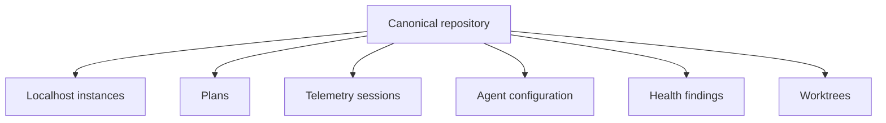

# RoboRepo Canonical Repository Identity and Activity Correlation — Implementation Plan v2

## Purpose

Create one local repository identity system that allows Localhoster instances, telemetry sessions, plans, agent configuration, health findings, worktrees, and future portal features to refer to the same repository reliably.

This work makes a repository a first-class RoboRepo entity rather than a label independently inferred by each page.

The plan delivers:

- A canonical repository registry.
- Shared identity resolution.
- Discovery provenance and confidence.
- Cross-domain repository associations.
- A distinction between knowing about a repository and enabling domain-specific monitoring.
- Plan-source enrollment from repositories discovered elsewhere.
- Plumbing for a persistent, site-level repository scope.
- Browser-safe repository summaries for future homepage and repository-detail experiences.

The plan does not yet build repository-centric homepage cards, the repository popup/detail page, or redesign every domain page around the global selector. It establishes the data and API contracts those interfaces will require.

## Product Outcome

Today, several subsystems may independently describe the same repository:

- Plans finds `/Users/kirin/projects/roborepo` under a user-selected project folder.
- Localhoster finds one or more processes running from that repository.
- Telemetry records agent sessions whose working directories are inside it.
- Agent Config may later inspect repository-local configuration.
- Doctor may produce findings scoped to it.

After this implementation, those records share one repository ID:

```text
git:github.com/kirinmurphy/roborepo
```

Each domain retains its own records and behavior. The canonical identity is a shared foreign key, not one giant combined repository document.



This enables:

- Consistent repository names and provider links.
- Repository filtering shared across pages.
- A future repository popup and detail page.
- Homepage repository summaries.
- Links between an active app, its plans, configuration, telemetry, and health.
- Multiple localhost processes and worktrees associated with one underlying repository.
- Clear treatment of unresolved or partially configured repositories.

## Confirmed Product Decisions

- Implement identity unification now.
- Treat repositories as first-class entities throughout RoboRepo.
- Connect localhost instances to repositories represented in other RoboRepo domains.
- Prefer reliable structural evidence over prompt-content guessing.
- Ship identity and association plumbing before repository-centric UI.
- Preserve Telemetry's local/privacy-oriented data model.
- Records that cannot be associated remain visible as unresolved; they are never discarded.
- Automatically discovered repositories may be registered without automatically enabling every domain.
- Localhoster discovery must not silently enable Plans directory scanning.
- Plans project folders remain user-controlled monitoring sources.
- Provide an explicit path from a discovered repository to Plans enrollment.
- Prepare for a visible, site-level repository selector that persists across portal navigation.
- Default the future global repository scope to **All repositories** for each new browser session.
- Keep page-specific filters independent from the future global repository scope.
- Preserve the existing plan and telemetry repository filters until their replacement is deliberately implemented.
- Defer repository-centric homepage cards and the repository popup/detail UI to a later iteration.

## Core Product Model

### Repository registry

The registry answers:

> What repositories does RoboRepo know about?

A repository may enter the registry through Plans, Localhoster, Telemetry, Agent Config, Doctor, a future worktree feature, or an explicit user action.

### Domain associations

Domain records refer to the canonical repository ID:

- A Localhoster instance belongs to a repository.
- A plan belongs to a repository.
- A telemetry session may belong to a repository.
- A repository-local config finding belongs to a repository.
- A worktree belongs to its canonical repository and has its own local root.

### Domain enrollment

Enrollment answers:

> Which features has the user enabled for this repository?

Discovering a repository does not automatically authorize all ongoing scans. A Localhoster-discovered repository can be known and active while Plans monitoring remains disabled.

### User scope

The future global selector answers:

> Which repository am I currently viewing across RoboRepo?

It affects domain queries and presentation but does not change registry membership or monitoring configuration.

These concerns must remain separate:

| Concern | Example |
| --- | --- |
| Discovery | Localhoster sees a server launched inside `arcade` |
| Identity | The server resolves to `git:github.com/kirinmurphy/arcade` |
| Enrollment | The user chooses whether Plans scans `arcade/docs/plans` |
| Activity | `arcade` currently has one listening process |
| Scope | The portal is filtered to show `arcade` across pages |

## Repository Lifecycle and Status

Repository status is multi-dimensional. Do not implement it as one mutually exclusive enum.

Recommended fields:

```json
{
  "visibility": "visible",
  "resolution": "resolved",
  "activity": "active",
  "enrollments": {
    "plans": {
      "enabled": false
    }
  }
}
```

Meanings:

| State | Meaning |
| --- | --- |
| Discovered | Seen by at least one RoboRepo subsystem |
| Resolved | Confidently assigned a canonical identity |
| Unresolved | Activity exists but cannot be confidently assigned |
| Monitored | Enabled for at least one ongoing domain scan |
| Active | Has a current process, current session, or defined recent activity |
| Inactive | Known but without current/recent activity |
| Hidden | Known but intentionally omitted from ordinary lists |

A repository can be discovered, resolved, active, and not monitored by Plans at the same time.

## Existing Signals

### Localhoster

`modules/localhoster/identity.mjs` already:

- Finds the nearest Git root from a process working directory.
- Normalizes SSH and HTTPS remotes to `git:<host>/<owner>/<repo>`.
- Falls back to `path:<realpath>` and then a low-confidence process identity.
- Labels evidence and confidence.

Localhoster settings schema version 2 also supports user-confirmed identity aliases with cycle protection.

Localhoster can discover repositories without any prior Plans configuration. It may discover several processes belonging to one repository, and it may later discover processes launched from worktrees of that repository.

### Plans

Plan discovery:

- Uses user-selected project folders as scan sources.
- Finds those folders or child folders that are Git repositories.
- Searches for plan content under each repository's `docs/plans` structure.
- Identifies repository boundaries.
- Gathers Git HEAD, branch, per-file last-commit date, and file state.
- Already supports filtering visible plans by repository.

Plans does not yet publish one shared canonical repository identity. Its project-folder control currently serves as monitoring configuration, while its repository filter controls result presentation. Those are separate concepts even if the existing page places them together.

### Telemetry

Telemetry records repository label, hashed working-directory/Git-root information, hashed remote information, branch, commit, and session ID. Existing raw remote hashes cannot be directly joined to Localhoster's normalized clear-text remote identity unless normalization and hashing are performed consistently.

Telemetry already has a repository-oriented page filter. The shared identity model should replace domain-specific repository identification without removing page-specific filters prematurely.

### Agent Config

Agent Config is currently primarily global, but future repository-local configuration and context-cost warnings should use the same repository ID. Global resources must remain unassociated.

### Doctor and health

Repository-scoped checks can attach a repository ID. Installation-level, global configuration, and other system-wide findings remain global.

## Discovery Sources and Provenance

Every domain can contribute evidence to the repository registry:

| Source | What it discovers | Automatic registry entry | Automatic domain enrollment |
| --- | --- | --- | --- |
| Plans sources | Repositories under user-approved scan roots | Yes | Plans is already enabled through the source |
| Localhoster | Repositories owning running processes | Yes | Localhost tracking only; not Plans |
| Telemetry | Repositories associated with agent sessions | Yes when identity is sufficiently reliable | Telemetry association only |
| Agent Config | Repositories with detected local config | Yes when confidently resolved | Config inspection only |
| Doctor | Repositories checked during scoped health work | Yes when confidently resolved | No additional enrollment |
| Manual action | Repository explicitly added or linked by user | Yes | Only the feature explicitly selected |

Record provenance rather than reducing discovery to a single `discoveredBy` value:

```json
{
  "discoveries": [
    {
      "source": "localhoster",
      "firstSeenAt": "ISO-8601",
      "lastSeenAt": "ISO-8601",
      "evidence": "git-remote",
      "confidence": "high"
    },
    {
      "source": "plans",
      "firstSeenAt": "ISO-8601",
      "lastSeenAt": "ISO-8601",
      "evidence": "configured-scan-root",
      "confidence": "high"
    }
  ]
}
```

This lets future UI explain why RoboRepo knows about a repository and whether a relationship was automatic or user-confirmed.

## Canonical Identity Model

Use these identity forms:

```text
git:<normalized-host>/<owner>/<repository>
local:<opaque-stable-id>
```

The Git identity is portable across machines. A local ID represents repositories without a usable remote and avoids exposing absolute paths to consumers.

Do not use display names as identity. Do not automatically merge repositories because their folder names match.

GitHub credentials are not required for local association. The resolver can read the local repository's configured remote. Provider credentials may later enrich metadata but must not be necessary for identity.

### Repository registry record

Store a versioned machine-local registry under the RoboRepo state root, for example:

```text
<stateRoot>/repositories/registry.json
```

Recommended record:

```json
{
  "id": "git:github.com/kirinmurphy/roborepo",
  "kind": "git",
  "displayName": "roborepo",
  "providerUrl": "https://github.com/kirinmurphy/roborepo",
  "normalizedRemote": "git:github.com/kirinmurphy/roborepo",
  "localRoots": [
    {
      "rootId": "opaque-local-root-id",
      "rootHash": "hash",
      "kind": "primary",
      "firstSeenAt": "ISO-8601",
      "lastSeenAt": "ISO-8601"
    }
  ],
  "discoveries": [],
  "enrollments": {
    "plans": {
      "enabled": true,
      "sourceId": "plans-source-id"
    }
  },
  "aliases": [],
  "visibility": "visible",
  "createdAt": "ISO-8601",
  "updatedAt": "ISO-8601"
}
```

Keep absolute local roots out of browser/API payloads. If the registry needs a real path for local discovery and domain scanning, store it only in machine-local state and expose an opaque hash or ID outward.

### Local roots and worktrees

One canonical Git repository may have multiple local roots:

- A primary clone.
- Additional clones on the same machine.
- Git worktrees.

Do not create a separate canonical repository merely because a process runs inside a worktree. Resolve the shared remote to the same repository ID, then retain the worktree root and branch as local/runtime metadata.

Where two distinct clones use the same remote, keep both local-root records under the same canonical repository. Domain records may reference both `repositoryId` and a local `rootId` when location-specific behavior matters.

## Shared Resolver

Move repository discovery and remote normalization into a domain-neutral module, such as:

```text
modules/repositories/
  identity.mjs
  registry.mjs
  schema.mjs
  associations.mjs
  enrollment.mjs
```

Responsibilities:

- Resolve Git roots, including worktrees where `.git` is a file.
- Determine the main worktree/common Git directory when needed.
- Read the configured `origin` remote when available.
- Normalize SSH, HTTPS, case, trailing slash, `.git`, query, and fragment variations.
- Produce a canonical Git ID.
- Produce stable local fallback identities without using a folder name alone.
- Register local-root hashes and last-seen timestamps.
- Track discovery source, confidence, and evidence.
- Resolve confirmed aliases transitively and reject cycles.
- Resolve worktrees to the underlying canonical repository.
- Return confidence, evidence type, and association provenance.
- Avoid domain-specific presentation logic.

Localhoster should import this module rather than owning the canonical implementation.

## Normalization Rules

- Lowercase the host.
- Remove credentials and transport-specific syntax.
- Remove query strings, fragments, trailing slashes, and terminal `.git`.
- Preserve owner/repository path casing unless a provider-specific rule proves case-insensitivity; comparisons may use a normalized comparison key.
- Reject empty paths and traversal-like paths.
- Prefer `origin`; allow an explicit future override for repositories whose canonical upstream is not origin.
- Generate provider URLs only for recognized hosts or through a safe URL builder.

Add fixtures covering GitHub SSH/HTTPS forms, ports, worktrees, missing remotes, malformed values, and repositories with multiple remotes.

## Confidence and Evidence

| Evidence | Confidence | Automatic association |
| --- | --- | --- |
| Same normalized Git remote | High | Yes |
| User-confirmed alias | High | Yes |
| Same Git-root hash on the same machine | High locally | Yes |
| Current working directory inside a resolved Git root | High locally | Yes |
| Path identity explicitly aliased to Git identity | High | Yes |
| Worktree linked through Git common-directory metadata | High locally | Yes |
| Process working directory without Git | Medium locally | Register separately |
| Same repository/folder name | Low | No |
| Prompt or chat text mentions a repository | Suggestion only | No |

Every association result should expose its evidence and confidence so future UI can explain why records were connected.

Low-confidence candidates may power future suggestions. They must never silently merge registry entries.

## Registry Persistence

- Use a strict versioned schema.
- Write atomically through a sibling temporary file and rename.
- Serialize concurrent writes or use optimistic revision checks.
- Preserve unknown future-safe fields only if the project's schema conventions permit it; otherwise fail clearly.
- Maintain `firstSeenAt` and `lastSeenAt` without rewriting the file unnecessarily.
- Keep aliases explicit and reversible.
- Detect alias cycles before committing a mutation.
- Back up the previous schema during migrations.
- Preserve discovery provenance and enrollment history.
- Do not delete a repository merely because its process stops or a scan source is removed.
- Allow a user to hide a known repository without deleting its historical associations.

The registry is machine-local state, not authored package content. Cross-machine portability comes primarily from the canonical Git ID; local path mappings are rediscovered per machine.

## Plans Sources and Repository Enrollment

Plans project folders are configuration, not ordinary page filters.

A source means:

> Search this user-approved folder for repositories and plan content.

A repository filter means:

> Of the plans already discovered, show only those belonging to this repository.

Keep these as separate contracts even if both controls remain on the Plans page during the first implementation.

### Existing source behavior

Preserve the current behavior:

- The user selects one or more project folders.
- Plans finds Git repositories at those folders or beneath them.
- Plans searches each repository for supported `docs/plans` content.
- The user can filter the resulting plans by repository.

Identity adoption must not reduce this capability or convert all sources into individually selected repositories.

### Enrollment from Localhoster

When Localhoster discovers a repository that is not covered by a Plans source:

- Add or update the repository in the shared registry.
- Mark Plans monitoring as disabled or uncovered.
- Do not scan it automatically.
- Make the relationship available to a future action such as **Include plans**.

The enrollment action should:

1. Resolve the exact local repository root.
2. Determine whether an existing Plans source already covers it.
3. If covered, refresh the registry/domain state without adding a duplicate source.
4. If not covered, offer the exact repository root as the narrow default.
5. Optionally allow the user to choose a parent directory if they intentionally want broader discovery.
6. Add or update the Plans source configuration.
7. Trigger a Plans refresh.
8. Record that Plans monitoring was explicitly enabled.

Do not silently add a broad parent directory. A parent source can expose unrelated repositories and should require an explicit choice.

### Future Plans page organization

In a later UI iteration, move source management into a distinct surface such as:

```text
Plans → Manage sources
```

The ordinary Plans page should focus on plans and display filters. Repository detail can eventually show whether Plans monitoring is enabled and which source covers it.

This UI move is not required for the identity plumbing.

## Domain Adoption

### Localhoster

- Replace direct use of `modules/localhoster/identity.mjs` with the shared resolver.
- Preserve existing public identity strings where they already match the canonical format.
- Migrate or delegate existing Localhoster aliases into the shared registry without losing confirmed associations.
- Include `repositoryId`, local `rootId` when applicable, confidence, and evidence in server-side snapshots.
- Associate multiple processes and ports with one repository.
- Associate worktree processes with the canonical repository while retaining worktree-specific branch/root metadata.
- Keep process-only instances unresolved or locally identified.
- Report whether the repository is covered by a Plans source without enabling it automatically.

### Plans

- Resolve a repository record once per discovered repository.
- Add `repositoryId` to repository summaries and plan records.
- Reuse the canonical display name and provider URL where appropriate.
- Keep non-Git plan roots usable through a local identity.
- Do not expose absolute discovery roots in browser payloads.
- Publish source coverage/enrollment state to the repository layer.
- Preserve plan timestamps and current repository filtering behavior.

### Telemetry capture

For new records:

- Resolve repository identity from the event working directory at capture time when possible.
- Write a stable local registry reference or privacy-safe repository key into the event.
- Continue recording the existing hashed root/remote fields during a defined migration window if current reports depend on them.
- Normalize the remote before hashing so equivalent SSH and HTTPS remotes correlate.
- Never store prompt or tool-result content for identity resolution.

The capture path must remain cheap. Cache working-directory-to-repository resolution and invalidate it conservatively when Git metadata changes.

### Telemetry reads and historical association

Do not rewrite the entire spool as a prerequisite.

At read time:

- Prefer the new repository reference.
- Otherwise match legacy normalized-remote hashes known to the registry.
- Otherwise match local Git-root hashes on the same machine.
- Otherwise leave the record unresolved.

Expose association provenance such as `direct`, `legacy-remote-hash`, `legacy-root-hash`, or `unresolved`.

Keep telemetry time, harness, model, anomaly, and other filters page-specific. Repository scope is orthogonal to them.

### Agent Config

- Attach `repositoryId` to repository-local files, resources, and warnings.
- Keep global configuration and global resource warnings unassociated.
- Allow future config APIs to query one repository without changing global configuration behavior.
- Do not infer a repository from matching filenames or resource names.

### Doctor and health

- Attach a `repositoryId` to findings only when the check is repository-scoped.
- Keep global installation and global resource warnings unassociated.
- Never force every warning into a repository.
- If a repository check uses a particular clone or worktree, retain its local `rootId` internally.

## Global Repository Scope

The identity plumbing should support a future site-level repository selector. Building the full UI is deferred, but its behavior and query contract should be decided now.

### Recommended behavior

- Display the selector persistently in the portal shell.
- Default to **All repositories** on a new browser session.
- Preserve a selected repository while navigating between portal pages.
- Encode the selection in the URL so views are linkable and restorable.
- Provide a conspicuous **All repositories** reset.
- Keep page-specific filters below the global scope.
- Clearly label unassociated/global records rather than silently mixing or hiding them.
- If a page has no data for the selected repository, show an explicit empty state and retain the visible scope.

Example:

```text
Repository: roborepo
Telemetry: Last 7 days · Codex · All models
```

### URL contract

Use one consistent query parameter or route-level state contract, for example:

```text
?repository=git%3Agithub.com%2Fkirinmurphy%2Froborepo
```

The exact encoding should follow existing portal routing conventions. The canonical repository ID—not the display name—must be the stored value.

Internal navigation should preserve the repository parameter. Links intentionally opening a global view may explicitly clear it.

### Existing page filters

Do not immediately delete existing Plans or Telemetry repository filters.

Adopt in phases:

1. Make both filters consume canonical repository IDs.
2. Add the shared scope state.
3. Have pages initialize from and synchronize with that scope.
4. Remove duplicated page-level repository controls only after the global selector is complete and usable.

This avoids coupling identity migration to a broad portal navigation redesign.

### Global and unresolved data

When one repository is selected:

- Repository-associated records from other repositories are filtered out.
- Truly global warnings remain available in a clearly labeled global section when relevant to the page.
- Unresolved records are not presented as belonging to the selected repository.
- The interface may offer a separate unresolved count or link.

## Browser-Safe API Contracts

Create one repository summary shape:

```json
{
  "repositoryId": "git:github.com/kirinmurphy/roborepo",
  "displayName": "roborepo",
  "providerUrl": "https://github.com/kirinmurphy/roborepo",
  "resolution": "resolved",
  "activity": "active",
  "confidence": "high",
  "evidence": "git-remote",
  "discoveredBy": ["localhoster", "plans"],
  "capabilities": {
    "localhoster": true,
    "plans": true,
    "telemetry": true,
    "agentConfig": false,
    "health": false
  },
  "enrollments": {
    "plans": true
  }
}
```

`capabilities` means that associated domain data exists or can be queried. `enrollments` means an ongoing user-controlled scan or feature is enabled. Do not treat these as synonyms.

Domain APIs may embed this summary or return `repositoryId` plus a top-level repository lookup. Prefer a lookup when the same repository appears many times in one payload.

Recommended repository endpoints or service contracts:

```text
GET /api/repositories
GET /api/repositories/:repositoryId
GET /api/repositories/:repositoryId/associations
POST /api/repositories/:repositoryId/plans-enrollment
PATCH /api/repositories/:repositoryId
```

Exact route naming may follow existing portal conventions. Separate read-only summaries from mutations.

Do not expose:

- Absolute local paths.
- Raw Git configuration.
- Credentials embedded in malformed remotes.
- Telemetry prompt or result content.
- Internal alias graphs beyond what a management UI explicitly needs.
- Machine-local paths inside shareable URLs.

## Future Repository Popup and Detail Page

The registry and domain contracts should support one consistent repository entity anywhere it appears.

Future repository references—plan cards, telemetry sessions, active apps, configuration findings—should open the same compact popup or link to the same detail page.

Potential detail content:

- Repository name and provider link.
- Discovery sources and association confidence.
- Known local roots and worktrees.
- Active and known localhost instances.
- Active, recent, and associated plans.
- Repository-local agent configuration.
- Token use and telemetry warnings.
- Doctor and health findings.
- Plans monitoring state and source coverage.

Potential actions:

- Open provider page.
- Open an active localhost instance.
- Include or exclude Plans monitoring.
- Resolve or unlink an ambiguous association.
- Hide or restore the repository.

This experience is explicitly deferred. The v2 plumbing must avoid API or schema choices that make it difficult.

## Homepage Integration Boundary

The future homepage may list repositories that have any of:

- Active or previously identified localhost ports.
- Associated plans.
- Associated agent configuration.
- Associated telemetry.
- Repository-scoped health findings.

It may then link to active app instances and the repository detail page.

For the current homepage implementation:

- Basic domain widgets may ship independently.
- Identity-aware APIs may expose repository IDs and summaries.
- Do not require repository cards or global scope UI to complete this plan.
- Do not duplicate identity or association logic inside homepage code.

## CLI Surface Note

This plan is pure plumbing plus browser-safe API contracts; it defines no user-facing `roborepo` command. If a later increment adds one (for example a `roborepo repositories` inspection verb), it must be authored into the recursive command catalog introduced by `roborepo-cli-surface-implementation-plan` (`manifests/platform/cli/`, `scripts/cli/command-catalog.mjs`), not the retired flat `manifests/platform/cli-commands.json`. That catalog exists only after the CLI-surface work merges. No such command is planned here, so this plan is otherwise independent of the CLI-surface work and can proceed in parallel.

## Migration

1. Inventory current repository labels, IDs, filters, Plans sources, and Localhoster aliases.
2. Introduce the shared resolver with behavior-equivalence tests against Localhoster's current resolver.
3. Add the registry and versioned schema without changing UI.
4. Add discovery provenance, lifecycle dimensions, local roots, and per-domain enrollment.
5. Import confirmed Localhoster aliases into the shared registry, retaining a migration marker and backup.
6. Register repositories currently found through configured Plans sources.
7. Adopt the resolver in Localhoster and Plans.
8. Add new repository references to Telemetry capture.
9. Add read-time matching for legacy Telemetry records.
10. Attach repository IDs to repository-local Agent Config and structured Doctor findings where applicable.
11. Add browser-safe repository summaries to domain and homepage APIs.
12. Convert existing Plans and Telemetry repository filters to canonical IDs without changing their visible behavior.
13. Add Plans source-coverage calculation and the server-side enrollment operation.
14. Verify multiple ports, clones, and worktrees associate correctly.
15. Remove duplicated resolver code only after parity and migration tests pass.

Migration must be idempotent. Re-running it must not duplicate registry entries, aliases, discovery records, enrollment records, local roots, or backups.

Do not remove existing fields until all current consumers have migrated. This compatibility window is internal migration safety, not a commitment to preserve obsolete public behavior indefinitely.

## Failure Handling

- A malformed registry must not stop the portal from serving unrelated global data.
- Report registry errors as structured health findings.
- If Git commands or files are unavailable, fall back to local identity or unresolved status.
- If two records conflict, do not silently merge them; retain both and surface an actionable conflict.
- If an alias target disappears, keep the alias record but mark it unresolved until repaired.
- If historical telemetry cannot be associated confidently, leave it unassociated.
- If a Localhoster process lacks a recoverable working directory, retain the instance as unresolved.
- If Plans enrollment cannot write or validate its source configuration, do not mark monitoring enabled.
- If a configured Plans source disappears, retain the repository and historical associations while marking source coverage unavailable.
- If a selected global repository no longer exists or is hidden, reset safely to **All repositories** and explain the state in the future UI.

## Performance

- Cache resolution by real working directory plus relevant Git metadata signature.
- Resolve each repository once per Plans scan.
- Avoid registry writes when only `lastSeenAt` would change within a short debounce window.
- Keep Telemetry read-time legacy matching indexed by hash.
- Keep browser payloads deduplicated and path-free.
- Index domain records by `repositoryId`.
- Calculate Plans source coverage without recursively rescanning all sources for every Localhoster refresh.
- Batch registry updates produced by process discovery.
- Avoid provider API calls in the identity-critical path.

## Validation

Add focused tests for:

- SSH/HTTPS normalization equivalence.
- Worktree `.git` files and common-directory resolution.
- Multiple worktrees resolving to one canonical repository.
- Multiple clones of one remote retaining distinct local roots.
- Missing, malformed, and multiple remotes.
- Registry atomic writes, revisions, migrations, and corruption handling.
- Discovery provenance from multiple domains.
- Discovered, monitored, active, unresolved, hidden, and combined states.
- Alias confirmation, transitive resolution, removal, and cycle rejection.
- Localhoster behavior parity after resolver extraction.
- Multiple Localhoster ports associating with one repository.
- Plans receiving the same ID as Localhoster for the same Git repository.
- Repositories found under broad Plans sources.
- A Localhoster-discovered repository remaining unenrolled in Plans.
- Plans enrollment reusing an existing covering source.
- Plans enrollment adding the exact repository root by default.
- Enrollment failure leaving the repository unmonitored.
- New Telemetry records receiving repository references.
- Legacy Telemetry association through normalized remote hash and local root hash.
- Agent Config and Doctor associating only repository-scoped records.
- No association based only on a matching name.
- No automatic association from prompt text.
- Unresolved records remaining visible.
- Browser/API payloads containing no absolute paths or remote credentials.
- Cross-domain summaries using one repository ID.
- Existing Plans and Telemetry repository filters retaining behavior after canonical-ID adoption.
- Repository query scope composing correctly with time, model, harness, and status filters.

Run the existing Localhoster, Plans, Telemetry, Doctor, Config/context-cost, portal routing, and full test suites after focused tests pass.

## Acceptance Criteria

- Localhoster, Plans, and new Telemetry records resolve the same Git repository to the same canonical ID.
- Equivalent SSH and HTTPS remotes correlate.
- Multiple processes, ports, clones, and worktrees can associate with one canonical repository without losing location-specific metadata.
- Existing confirmed Localhoster aliases migrate without loss.
- Repositories discovered through any supported domain appear once in the registry with provenance.
- Automatic discovery does not automatically enable unrelated domain monitoring.
- A Localhoster-discovered repository can be explicitly enrolled in Plans.
- Existing Plans sources continue discovering child repositories and plan content.
- Plans source configuration and repository result filtering remain separate concepts.
- Historical telemetry is associated only when current hashes support a confident match.
- Every association exposes confidence and provenance.
- Name-only and prompt-text matches never cause automatic merges.
- Non-Git and unresolved activity remains usable and visible.
- Repository-local Config and Doctor data can use the shared repository ID while global findings remain global.
- Existing repository filters use canonical IDs without losing current behavior.
- APIs support a future persistent global repository scope.
- Portal payloads do not expose absolute paths or sensitive remote data.
- Identity plumbing is available to the homepage without requiring repository-centric UI.
- The registry and APIs can support a future repository popup and detail page without schema replacement.

## Deferred Work

- The visible site-level repository selector and portal-shell navigation behavior.
- Removing redundant page-level repository selectors after the global selector ships.
- Repository cards combining active apps, chats, plans, warnings, configuration, and health.
- Repository popup and full detail page.
- Repository-centric homepage organization.
- Worktree-specific UI and actions.
- Suggested alias UI based on low-confidence evidence.
- Prompt-content semantic association.
- Cloud synchronization of machine-local registry mappings.
- Cross-machine synchronization for repositories without a Git remote.
- Provider APIs for richer repository metadata.
- Cross-domain activity timelines.

## Recommended Delivery Sequence

### Phase 1: Shared identity foundation

- Extract and test the resolver.
- Add canonical IDs, registry persistence, aliases, provenance, and local roots.
- Migrate Localhoster without visible behavior changes.

### Phase 2: Domain convergence

- Adopt canonical IDs in Plans and Telemetry.
- Add historical telemetry resolution.
- Add repository-local Agent Config and Doctor associations where supported.
- Convert existing repository filters to canonical IDs.

### Phase 3: Discovery and enrollment

- Register discoveries from every domain.
- Add Plans source-coverage calculation.
- Add explicit Plans enrollment for repositories discovered elsewhere.
- Validate multiple ports, clones, and worktrees.

### Phase 4: Portal-ready contracts

- Add browser-safe repository summaries and association endpoints.
- Add query support for repository scope across domain APIs.
- Make homepage consumers reuse those contracts.

### Future UI iteration

- Add the global repository selector.
- Add repository popup/detail views.
- Add repository-centric homepage summaries.
- Consolidate duplicate page-level repository controls only after the shared interface is proven.
