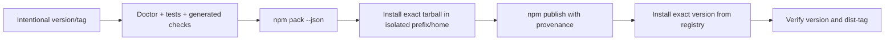

# RoboRepo Packaging 03: Publish npm Releases

## Scope ownership

This plan exclusively owns npm registry distribution: package identity and metadata, prerelease and
stable publication, release automation, registry verification, dist-tags, provenance, and npm-channel
documentation.

It does not own local new-Mac transfer artifacts, general install lifecycle correctness, or Homebrew.
It reuses the package-install smoke runner and lifecycle contract owned by the other plans in this
suite rather than creating channel-specific variants.

## Summary

Turn the existing unpublished npm package skeleton into a repeatable, verifiable release channel.
Define package identity and versioning, publish prereleases and stable releases through CI, verify the
registry artifact independently, and document installation and rollback without coupling runtime
behavior to the repository checkout.

## Context

The root `package.json` already declares an unpublished package, a `roborepo` binary, a runtime
`files` allowlist, ESM mode, and a Node engine requirement. `npm pack` and a manual isolated global
installation have worked. The repository does not yet have a publish workflow, registry credentials
or trusted-publishing configuration, a finalized package name, or a release policy.

The new-Mac plan proves a local tarball works. npm distribution adds a registry, immutable published
versions, dist-tags, and release provenance. It should reuse the same pack/install smoke test rather
than creating a second package-validation path.

## Goals

- Finalize the public npm package name and metadata.
- Define prerelease, stable, and rollback/dist-tag policy.
- Publish from a controlled CI workflow tied to an intentional Git tag or release action.
- Use npm trusted publishing or the narrowest supported credential model.
- Verify the exact registry artifact after publication in a clean environment.
- Prevent publishing with a dirty tree, stale generated files, failing tests, or an unexpected
  package file set.
- Document npm install, update, version inspection, and uninstall.
- Keep workspace and state outside the npm installation directory.

## Non-goals

- Homebrew distribution.
- General lifecycle implementation owned by `infra-packaging-02-install-lifecycle`.
- New-Mac workspace transfer.
- Automated semantic-release adoption unless separately justified.
- Supporting multiple npm packages or plugin packages in this story.

## Current state

- `package.json` uses `codethings-roborepo-alpha` at `0.1.0-beta.0` and is not private.
- `bin/roborepo` is the package executable.
- The package uses an explicit `files` allowlist.
- `npm run pack:dry-run` and `npm run pack:smoke` exist; both stop at producing a tarball.
- CI runs doctor, the repository suite, and package catalog/lifecycle checks on macOS and Linux,
  plus a Windows installer parse job, but has no publication job.
- No npm version has been published and no stable release contract exists.

## Proposed design

### Release channels

| Channel | Version shape | npm dist-tag | Purpose |
| --- | --- | --- | --- |
| Development artifact | Unpublished tarball | None | Local and CI validation |
| Prerelease | `x.y.z-beta.n` or agreed prerelease label | `beta` | Intentional external testing |
| Stable | `x.y.z` | `latest` | Supported release |

Published versions are immutable. Corrective work produces a new version; it never replaces an
existing registry artifact.

### Release workflow

The workflow must compare the locally packed manifest with the published artifact's file set or
integrity metadata where npm exposes it. A publish job must never infer a release from every merge to
`main`.

### Package metadata and provenance

- Confirm the final package scope/name is available and owned by the intended npm account.
- Add repository, bugs, homepage, license, keywords, and supported Node metadata intentionally.
- Keep the explicit runtime file allowlist; do not publish the whole repository.
- Publish with npm provenance/trusted publishing when supported by the selected account and workflow.
- Record source commit, package version, and release notes in the GitHub release or equivalent
  durable record.

## Implementation plan

### Phase 1 — Package identity and release policy

- [ ] Decide and verify the final npm package name.
- [ ] Define version bump ownership and prerelease/stable numbering.
- [ ] Define `beta` and `latest` dist-tag movement rules.
- [ ] Complete package metadata and installation documentation links.
- [ ] Document how an accidental dist-tag change is corrected without replacing a version.

### Phase 2 — Prepublish validation

- [ ] Reuse `npm run test:package-install` against the exact tarball to be published.
- [ ] Require clean generated output, full tests, doctor, and package allowlist checks.
- [ ] Fail when package contents differ from the reviewed allowlist or contain excluded local files.
- [ ] Emit a machine-readable release manifest containing version, commit, integrity, and file list.

### Phase 3 — Trusted publication workflow

- [ ] Add a manually triggered or tag-driven GitHub Actions release workflow.
- [ ] Configure npm trusted publishing or narrowly scoped automation credentials.
- [ ] Require the expected branch/tag relationship and protected environment approval where useful.
- [ ] Publish prereleases under `beta` without moving `latest`.
- [ ] Prevent duplicate-version publication attempts from appearing successful.

### Phase 4 — Registry verification and stable release

- [ ] Install the published prerelease by exact version into a fresh prefix and home.
- [ ] Run version/setup/workspace/apply/doctor against the registry artifact.
- [ ] Verify npm integrity, package version, binary resolution, and dist-tag.
- [ ] Run the beta on at least one real clean-machine or clean-user-profile installation for an explicit soak period and record findings.
- [ ] Validate migration from an existing clone or portable workspace before the first stable release.
- [ ] Promote a separately published stable version to `latest` only after explicit approval.
- [ ] Add rollback guidance using dist-tags and installation of an earlier exact version.

### Phase 5 — Documentation

- [ ] Document `npm install -g`, exact-version install, update, uninstall, and command resolution.
- [ ] Explain the separation between application files, workspace, and state.
- [ ] Document how developers keep the global package alongside `./bin/roborepo` checkout usage.
- [ ] Add maintainer release and incident-recovery steps.

## Validation

- A prerelease publishes only from the intended release workflow.
- `npm view` reports the expected metadata, version, integrity, and dist-tag.
- Installing by exact registry version in a clean environment passes the shared package smoke test.
- A beta release does not change `latest`.
- A stable release installs without source-checkout access and preserves workspace/state across
  application replacement.
- Stable publication is gated on recorded real-machine beta use and a successful migration from an existing clone or workspace.
- Re-running the workflow for an already published version fails clearly without corrupting tags.
- Release documentation identifies the exact source commit and package version.

## Risks

- The current package scope may not match the npm account or desired long-term name.
- A broad npm token could expose unrelated packages; trusted publishing should be preferred.
- Dist-tag mistakes can expose prereleases as stable even when version bytes are correct.
- Package allowlist drift can omit runtime files or publish private development material.
- Registry verification that installs by tag instead of exact version can test the wrong artifact.

## Decisions

- npm is the first public package-manager release channel.
- Publication is explicit, not automatic on every merge to `main`.
- The exact packed artifact is validated before publication and the exact registry version is
  validated afterward.
- Homebrew remains independently planned and consumes a released application artifact rather than
  npm implementation details.
