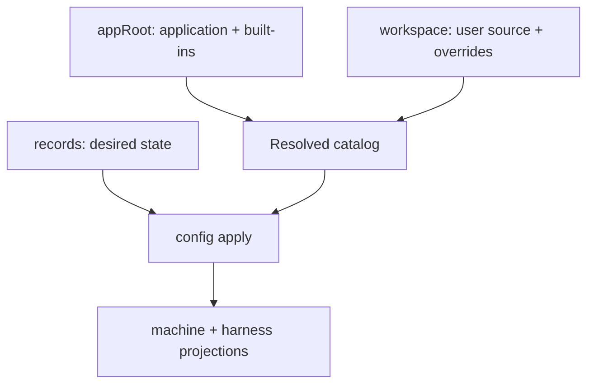

# Preserve User Data Across Installations and Macs

## Summary

RoboRepo needs to preserve user-owned source content and durable user intent independently of the
installed application and the Mac on which it runs. Today, user-owned source shares storage with a
mixture of durable choices, generated output, local observations, caches, process state, and
recovery data.

This plan introduces one versioned portable profile with two distinct internal layers:

```text
profile/
  profile.json
  workspace/
  records/
```

- `workspace/` contains user-authored or imported package/resource source and explicit overrides.
- `records/` contains durable user intent and portable history, such as desired package state,
  preferences, and canonical repository enrollment.

The installed npm package remains the source of RoboRepo code and built-in packages. Generated
Claude/Codex configuration, local repository paths, install records, caches, PIDs, and derived
indexes remain machine state. A `.rrbackup` archive snapshots the profile, validates each component,
records application compatibility metadata, and restores the profile without copying the
application or generated harness files.

## Goals

- Define a precise ownership model for application, profile, workspace, records, and machine data.
- Preserve all initial-release user-owned RoboRepo content beneath one backupable profile container.
- Keep built-in packages, user packages, overrides, desired state, and generated output distinct.
- Support checksummed `.rrbackup` creation, inspection, dry-run restore, and atomic restore.
- Validate restored intent against the installed application and resolved package catalog.
- Preserve canonical repository identity without restoring stale checkout paths as current facts.
- Survive npm install, upgrade, uninstall, reinstall, and checkout/package-mode transitions.
- Reuse feature-owned schemas and ownership markers instead of duplicating them in backup code.
- Keep CLI orchestration separate from archive, validation, migration, and filesystem operations.
- Prove the new-Mac journey with the real packed npm artifact and isolated homes.

## Non-goals

- Installing RoboRepo itself from a backup.
- Bundling an npm or Homebrew artifact inside `.rrbackup`.
- Live synchronization of one profile between concurrently active Macs.
- Provider-specific Dropbox, iCloud Drive, Google Drive, or S3 integration.
- Git automation for workspace content.
- Multiple named profiles or profile-account identity.
- Selective per-record merge restore.
- Automatic rebasing of an override onto a changed built-in package.
- Automatic vendoring of externally referenced package source.
- Session prompts, captured output, terminal state, or worktrees in default backups.
- Credentials, tokens, private keys, provider sessions, or environment variables in backups.
- Scheduled backups, retention, encryption, or a backup-management portal in the initial release.

## Concept model

### Root terms

These names are code-level storage domains, not package lifecycle states.

| Term            | Meaning                                                                                          | Default or source                                        |
| --------------- | ------------------------------------------------------------------------------------------------ | -------------------------------------------------------- |
| `appRoot`       | Replaceable application source containing the CLI, built-in catalog, manifests, and runtime docs | npm package, release extraction, or development checkout |
| `stateRoot`     | Parent boundary for RoboRepo-owned local data                                                    | `~/.roborepo`                                            |
| `profileRoot`   | Portable, user-owned backup boundary                                                             | Proposed: `<stateRoot>/profile`                          |
| `workspaceRoot` | User-owned package/resource source                                                               | Proposed: `<profileRoot>/workspace`                      |
| `recordsRoot`   | Durable user intent and portable history                                                         | Proposed: `<profileRoot>/records`                        |
| `machineRoot`   | Device-specific, generated, derived, runtime, and recovery state                                 | Proposed: `<stateRoot>/machine`                          |

`stateRoot` becomes a parent container. It must not be described as uniformly machine-local after it
contains `profileRoot`.

### Package and resource layers

| Layer                 | Example                                                            | Source of truth                             | Portable? |
| --------------------- | ------------------------------------------------------------------ | ------------------------------------------- | --------: |
| Built-in catalog      | `technical-writing` shipped by RoboRepo                            | `<appRoot>/globals/packages`                |        No |
| User package source   | A package created or copied by the user                            | `<workspaceRoot>/packages`                  |       Yes |
| Explicit override     | User replacement for a built-in resource/package                   | `<workspaceRoot>/overrides` and user source |       Yes |
| Resolved catalog      | Built-ins plus user packages after override resolution             | Computed                                    | Recompute |
| Desired package state | Packages the user wants enabled                                    | Feature-owned versioned record              |       Yes |
| Observed/live state   | What currently exists in harness config                            | Harness inspection                          |        No |
| Generated projection  | Managed skills, commands, hooks, rules, MCP config, runtime assets | `config apply` output                       |        No |

The workspace does not contain every available package. It contains only user-owned source and
explicit user changes. Enabling an unchanged built-in writes desired state under `records/`; it does
not copy that built-in into the workspace.



### Source of truth rules

- `appRoot` is replaceable application input, never restored user data.
- `workspaceRoot` is authoritative for copied user source and overrides.
- `recordsRoot` is authoritative for durable user choices.
- The resolved catalog and generated projections are derived.
- Machine observations never become portable facts merely because they are durable on disk.
- Feature owners define record schemas; backup owns containment, archive integrity, and restore
  orchestration.

## Current state

### Root behavior at the reviewed commit

At `2a56135734a21c6c8ad9435f76f2e9e092b81201`, `scripts/cli/roots.mjs` resolves:

| Root            | Current behavior                                                                      |
| --------------- | ------------------------------------------------------------------------------------- |
| `appRoot`       | Installed npm package or development checkout                                         |
| `workspaceRoot` | `ROBOREPO_WORKSPACE_ROOT`, selected `workspace-root.json`, or `~/.roborepo/workspace` |
| `stateRoot`     | `ROBOREPO_STATE_ROOT`, legacy override, or `~/.roborepo`                              |

Development and package modes now share the same default workspace.

The current user guide calls `stateRoot` machine-local state. That definition conflicts with
durable desired package state.

### Packaging behavior

The repository now provides a deterministic npm publication workflow and an isolated package smoke
test in `scripts/test/package-install-smoke.mjs`. Package files are controlled by an explicit
runtime allowlist. `config apply` removes stale
RoboRepo-owned skill, command, and runtime projections using existing ownership markers while
preserving unmanaged content.

The npm artifact installs the application and built-in catalog. It does not contain user profile
data.

### Persisted-data classification

The current persisted files fall into these proposed target classes. Exact portable schemas remain
owned by their feature plans:

| Data                                                                        | Target class                                       | Default backup treatment            |
| --------------------------------------------------------------------------- | -------------------------------------------------- | ----------------------------------- |
| Workspace manifest and copied user source                                   | Profile workspace                                  | Include                             |
| Explicit built-in overrides                                                 | Profile workspace                                  | Include                             |
| External package source reference                                           | Profile record/reference                           | Report unresolved; do not vendor    |
| Versioned desired package state                                             | Profile records                                    | Include                             |
| Command permission overrides and supported user preferences                 | Profile records                                    | Include                             |
| Canonical repository identity, aliases, visibility, enrollment              | Profile records                                    | Include                             |
| Repository local roots, discovery evidence, activity, last-seen data        | Machine                                            | Exclude                             |
| Portable Localhoster names, favorites, links, and preferences               | Profile records                                    | Include after schema split          |
| Localhoster processes, ports, paths, health, and operational history        | Machine                                            | Exclude                             |
| Plans presentation preferences                                              | Profile records                                    | Include                             |
| Plan/repository discovery roots and scan state                              | Machine                                            | Exclude                             |
| Source telemetry and user markers                                           | Open initial-release decision                      | Include only if confirmed           |
| Telemetry SQLite/indexes, cursors, derived analysis, usage snapshots        | Machine                                            | Exclude                             |
| Session UI preferences                                                      | Profile records when a feature-owned schema exists | Include                             |
| Session prompts, output, processes, terminals, and worktrees                | Sensitive machine history                          | Exclude                             |
| Harness detection, capability, and availability                             | Machine observation                                | Exclude                             |
| Managed skills, commands, rules, hooks, MCP registrations, runtime assets   | Generated projection                               | Exclude                             |
| Install state, package-manager location, recovery checkpoints, PIDs, caches | Machine                                            | Exclude                             |
| Credentials and secrets                                                     | Prohibited                                         | Reject or omit with explicit report |

### Existing backup and recovery paths

Current telemetry and install lifecycle backups are machine-recovery mechanisms. Current uninstall
logic removes paths including `~/.roborepo/backups`, `~/.roborepo/telemetry-backups`, and
`~/.roborepo-backups`.

These paths are not durable destinations for portable `.rrbackup` archives under their current
ownership contract.

## Scope ownership and related plans

This plan owns profile containment, backup format, archive safety, compatibility inspection,
migration orchestration, and restore transactions. It consumes schemas and lifecycle guarantees
from other plans.

### Direct dependencies

| Plan                                         | This plan consumes                                                                                   |
| -------------------------------------------- | ---------------------------------------------------------------------------------------------------- |
| `46up8y7a` — install lifecycle               | Profile preservation and ownership behavior across install, update, repair, uninstall, and reinstall |
| `package-registry-live-state-reconciliation` | Final versioned desired package-state schema and migration                                           |
| `user-managed-packages-and-add-workflows`    | Copied versus external source semantics, user package schema, and export ownership                   |
| `pljvmyh` — repository scope                 | Portable canonical identity and private machine-local root/path boundary                             |

Archive primitives can be implemented before every dependency completes. Migration and restore
must target the final feature-owned schemas rather than create competing interim formats.

### Adjacent plans

| Area                                     | Boundary                                                                                       |
| ---------------------------------------- | ---------------------------------------------------------------------------------------------- |
| New-Mac/npm/Homebrew plans               | Supply and install application artifacts; backup restores user data only                       |
| Package CLI test guide                   | Supplies representative user-package fixtures and journeys                                     |
| Harness parity/presence/capability plans | Destination harness applicability is recalculated, never restored                              |
| Session-launch plans                     | Operational and sensitive session records remain excluded by default                           |
| Plan lifecycle navigation                | Portable plan identity may survive; paths and terminal execution state do not                  |
| Telemetry performance                    | Derived analysis remains rebuildable regardless of source-event inclusion                      |
| Windows path schema                      | Portable schemas must not assume macOS path syntax, even if the initial release ships on macOS |

## Proposed design

### Target layout

```text
~/.roborepo/
  profile/
    profile.json
    workspace/
      workspace.json
      packages/
      skills/
      commands/
      mcp/
      overrides/
    records/
      packages/
      config/
      repositories/
      localhoster/
      plans/
  machine/
    install/
    config/
    repositories/
    localhoster/
    plans/
    telemetry/
    sessions/
    skills/
    runtime/
    portal/
    recovery/
```

The directory names below `records/` are ownership domains, not permission to copy arbitrary
feature directories. Each included file must be declared by a versioned profile-component schema.
This prevents a future feature from silently placing secrets or local paths in the backupable tree.

### Profile containment

The initial release makes the workspace a child of the profile. This preserves the requested simple
backup boundary and guarantees copied user source and durable intent travel together.

The current independent `workspace use <path>` selector must migrate to one of these outcomes:

1. Copy the selected workspace into `<profileRoot>/workspace`, leave the source untouched, and make
   the profile copy authoritative.
2. If external sources remain supported, represent them as explicit external references and report
   them as unresolved dependencies during backup inspection.

Arbitrary workspace paths cannot remain silently authoritative while backup claims that `profile/`
is complete.

### Profile manifest

```json
{
  "kind": "roborepo-profile",
  "schemaVersion": 1,
  "profileId": "default",
  "components": {
    "workspace": 1,
    "packages": 1,
    "repositories": 1
  }
}
```

Rules:

- Component versions identify feature-owned schema versions independently of the container.
- Directory names are fixed relative paths for format version 1.
- The manifest contains no username, home directory, hostname, application path, local checkout
  path, backup destination, credential, or provider account.
- `profileId` is an opaque local profile identifier, not an account or device identity.

### Application compatibility

The backup manifest records the application that produced it:

```json
{
  "application": {
    "package": "codethings-roborepo-alpha",
    "version": "0.1.0-beta.0"
  }
}
```

Restore compares the profile with the installed resolved catalog and reports:

- desired built-in package missing from the installed release;
- package requiring a newer release;
- override target missing from the installed release;
- override based on an older built-in revision when provenance exists;
- desired resource unsupported by harnesses found on the destination Mac;
- profile or component schema newer than the installed application can read.

Application identity is compatibility metadata. Restore never writes to `appRoot` and never
downloads another application version automatically.

### Portable and machine projections

Repository, Localhoster, Plans, package state, and telemetry currently mix portable and machine
fields. Their owning plans/modules must expose one of these interfaces:

- a persisted portable schema written directly under `records/`; or
- a pure `projectPortableRecord(currentRecord)` function used during migration until the persisted
  schema split lands.

The long-term source of truth must be the split schema, not repeated backup-time field filtering.
Backup validates declared component records but does not redesign them.

### Telemetry policy

If source telemetry remains an initial-release product requirement:

- include append-only source JSONL and user markers only;
- exclude SQLite, indexes, collector cursors, usage snapshots, and derived analysis;
- record a stable complete-newline byte boundary for each JSONL file;
- copy only through that boundary;
- validate every copied line;
- reset destination collectors and rebuild derived indexes after restore.

If telemetry is not required for initial portability, omit the entire telemetry component. Do not
ship a partial or ambiguous default. This is the only open data-category decision that materially
changes archive snapshot complexity.

## Backup format and workflows

### Archive layout

```text
manifest.json
checksums.json
profile/
  profile.json
  workspace/
  records/
```

`manifest.json` includes format version, backup ID, creation time, source application identity,
profile schema version, included component versions, and source platform. `checksums.json` maps
normalized archive-relative paths to SHA-256 digests in deterministic path order.

### Create

```sh
roborepo backup create --output <directory>
```

1. Resolve and validate `profileRoot` and the output directory.
2. Refuse an output inside the profile or a profile nested inside `appRoot`.
3. Inventory only files declared by the profile/component schemas.
4. Establish telemetry boundaries when telemetry is included.
5. Copy the profile into a new temporary staging directory without following links.
6. Validate the staged profile and scan for prohibited content.
7. Write manifest and checksums.
8. Create the archive at a temporary output path.
9. Reopen it, validate entries and checksums, then atomically rename it.
10. Remove scoped temporary data.

Default output behavior must not choose an installer-owned backup directory. If no safe default is
defined, require `--output` in the initial release.

### Inspect

```sh
roborepo backup inspect <archive>
```

Inspection is read-only and reports format/component versions, source application, included data
categories, workspace/package counts, external source dependencies, checksum status, unsafe paths,
prohibited content, catalog compatibility, and whether the current application can restore it.

### Dry-run restore

```sh
roborepo backup restore <archive> --dry-run
```

The dry run performs the complete validation path and classifies each component as:

- add;
- identical;
- replace;
- conflict;
- invalid;
- unsupported future schema;
- incompatible or missing catalog item;
- unresolved external source;
- unresolved repository on this Mac;
- excluded machine data.

The initial release supports restore into an empty profile or explicit whole-profile replacement. It does not
invent semantic merge behavior for feature records.

### Apply restore

```sh
roborepo backup restore <archive> --replace-profile
```

1. Repeat inspect and dry-run validation.
2. Create a bounded machine-local recovery checkpoint for the current profile.
3. Extract into a new sibling staging directory.
4. Validate the extracted profile again.
5. Atomically swap the staged profile into place.
6. Rebuild selected derived indexes and reconcile current machine observations.
7. Run workspace and installed-catalog validation.
8. Run the shared `config apply` domain function only when explicitly requested; otherwise print the
   exact follow-up command.
9. Roll back the profile swap if a required post-swap validation fails.

Restore never installs generated projections from the archive. `config apply` recreates the current
desired projections and preserves unmanaged harness content using existing ownership markers.

## Migration

### One-way layout migration

Add a versioned migration from current top-level `stateRoot` paths into `profile/` and `machine/`:

1. Inventory known persisted paths and versions.
2. Validate source records before mutation.
3. Classify each path and field as profile, machine, recovery, obsolete, prohibited, or unresolved.
4. Produce a dry-run report.
5. Create a recovery checkpoint.
6. Build complete temporary profile and machine trees.
7. Apply feature-owned schema migrations/projections.
8. Validate both trees.
9. Atomically activate them and record migration completion.
10. Retain the old layout in bounded recovery until explicit cleanup.

Runtime code should not maintain indefinite dual reads. Migration retries must be idempotent and an
interruption must leave either the old layout usable or the new layout complete.

### Existing workspace selection

For a selected workspace outside `stateRoot`, dry run reports its source, resource counts, size,
links, external dependencies, and destination conflicts. Apply copies validated content into the
profile and leaves the original untouched. It then makes the profile copy authoritative.

### Package lifecycle behavior

- `npm install -g` initializes only missing structures and preserves an existing profile.
- Upgrade replaces `appRoot`, preserves the profile, validates compatibility, and rematerializes
  only through normal apply behavior.
- Downgrade preserves the profile and fails clearly on unreadable newer schemas.
- `npm uninstall -g` removes the application and owned projections but preserves the profile.
- Reinstall discovers the existing profile.
- Checkout mode and npm mode use the same profile.
- Setup after restore does not reset restored desired package state.
- Uninstall never deletes user-owned `.rrbackup` archives.

The install lifecycle plan owns the implementation of these guarantees. This plan adds the profile
and restore scenarios that verify them.

## Security and integrity requirements

- Reject absolute archive paths, `..`, NUL bytes, ambiguous separators, and drive prefixes.
- Reject duplicate normalized paths.
- Reject symlinks, hard links, device files, sockets, and FIFOs.
- Never follow links while staging or extracting.
- Enforce file-count, per-file, total-uncompressed-size, and compression-ratio limits.
- Extract only into a newly created narrow temporary directory.
- Verify all checksums before profile mutation.
- Validate every JSON/JSONL record with its owning schema.
- Refuse unsupported future format, profile, or component versions.
- Reject prohibited filenames and credential-shaped content with an explicit report.
- Never include active harness config, MCP credentials, SSH/Git credentials, or environment values.
- Refuse restore targets equal to or containing `appRoot`, a filesystem root, or the user home.
- Use temporary-file-plus-rename writes and directory swaps where filesystem semantics allow.
- Keep rollback and recovery paths explicit, bounded, and outside the archive destination.

## Implementation architecture

Suggested ownership:

```text
modules/profile/
  manifest.mjs
  paths.mjs
  inventory.mjs
  validate.mjs
  migrate.mjs
modules/backup/
  policy.mjs
  manifest.mjs
  archive-paths.mjs
  checksums.mjs
  snapshot.mjs
  create.mjs
  inspect.mjs
  restore-plan.mjs
  restore.mjs
scripts/cli/
  profile.mjs
  backup.mjs
```

Implementation rules from the repository code-style guidance:

- CLI modules parse arguments and render structured domain results.
- `create`, `inspect`, `migrate`, and `restore` are short orchestrators.
- Path validation, checksum generation, component validation, filesystem copies, archive reads, and
  telemetry boundaries are independently testable execution functions.
- Archive limits and data classification live in explicit configuration/schema modules.
- Shared modules return results or typed errors and do not call `process.exit()`.
- Use named ESM exports and existing atomic-write helpers where practical.
- Split modules by responsibility near the 150-line soft limit and before the 200-line hard cap.
- Interactive CLI and direct CLI routes invoke the same handlers.

Add commands through the existing command-definition/catalog mechanism. Update the npm runtime
allowlist and `docs/user` documentation because repository-only `docs/plans` files are not shipped
in the package.

## Implementation plan

### Implementation stage 1 — Root contract and inventory

- [ ] Define `stateRoot` as the parent, `profileRoot` as portable, and `machineRoot` as device-local.
- [ ] Add normalized root resolution and unsafe nesting checks.
- [ ] Add `profile.json` initialization and validation.
- [ ] Inventory every current persisted path and field by ownership class.
- [ ] Add a test that fails when a new persisted path lacks classification.
- [ ] Update root-domain code comments and `docs/user/guides/infra/root-domains.md` together.
- [ ] Add `roborepo profile status` and `roborepo profile validate`.

Exit criteria:

- Every known persisted record has an owner and portability class.
- No writer creates an unclassified top-level state entry.
- Development and package modes resolve the same independent profile model.

### Implementation stage 2 — Feature-owned portable records

- [ ] Adopt the final desired package-state schema from its owning plan.
- [ ] Adopt copied/external source semantics from the user-managed package plan.
- [ ] Split repository identity/enrollment from private local roots and observations.
- [ ] Split portable Localhoster choices from operational state.
- [ ] Split portable Plans preferences from discovery roots and scan state.
- [ ] Decide telemetry inclusion; split source records if included.
- [ ] Classify session preferences separately from sensitive session history.
- [ ] Update readers, writers, schemas, and migration functions.

Exit criteria:

- Copying `profile/` to another synthetic home claims no old path, process, harness, or install fact.
- Deleting `machine/` loses no included authored content or durable intent.
- Derived state can be rebuilt from the installed app plus profile.

### Implementation stage 3 — Layout migration

- [ ] Implement inventory and dry-run reporting.
- [ ] Build and validate complete temporary target trees.
- [ ] Apply feature-owned schema migrations.
- [ ] Copy an external selected workspace without mutating its source.
- [ ] Add interruption recovery and idempotent retry tests.
- [ ] Remove temporary dual-read behavior after successful migration.
- [ ] Coordinate profile preservation with install/uninstall lifecycle code.

Exit criteria:

- Interrupted migration leaves one complete authoritative layout.
- No user-authored source is deleted.
- Re-running a completed migration makes no changes.

### Implementation stage 4 — Backup create and inspect

- [ ] Implement archive policy, bounded staging, path safety, and checksums.
- [ ] Implement stable JSONL boundaries if telemetry is included.
- [ ] Implement deterministic manifest/component inventory.
- [ ] Implement atomic `.rrbackup` creation outside installer recovery paths.
- [ ] Implement read-only inspection and prohibited-content scanning.
- [ ] Add direct and interactive CLI commands through shared handlers.

Exit criteria:

- A valid archive contains only manifest, checksums, and declared profile files.
- Inspection detects corruption, unsafe entries, unsupported schemas, and external dependencies.
- Backup never writes into or modifies `appRoot`.

### Implementation stage 5 — Restore and compatibility

- [ ] Implement full dry-run restore planning.
- [ ] Compare desired state and overrides with the installed resolved catalog.
- [ ] Restore into an empty profile.
- [ ] Support explicit whole-profile replacement with recovery checkpoint.
- [ ] Validate before extraction, before swap, and after swap.
- [ ] Rebuild derived indexes and reconcile destination machine observations.
- [ ] Roll back injected failures at each mutation boundary.
- [ ] Invoke or report the shared `config apply` flow.

Exit criteria:

- Cross-home restore preserves portable source and intent without stale machine claims.
- Failed restore leaves the prior profile byte-for-byte intact.
- Current harness projections are regenerated, not restored.

### Implementation stage 6 — Packaging and documentation

- [ ] Extend `scripts/test/package-install-smoke.mjs` with create/restore/apply scenarios.
- [ ] Test install, upgrade, uninstall, reinstall, and checkout/package-mode transitions.
- [ ] Verify profile and user-owned archives survive lifecycle operations.
- [ ] Add runtime backup/restore documentation under `docs/user`.
- [ ] Update package allowlists and dry-run package assertions.
- [ ] Run full repository and package-artifact verification.

## Validation

### Targeted automated checks

Add repository-native checks for:

- root resolution and unsafe nesting;
- persisted-data inventory completeness;
- profile/component schema validation;
- external workspace migration;
- portable/machine field separation;
- archive traversal, link, duplicate-path, size, and compression-ratio attacks;
- checksum mismatch and unsupported schemas;
- likely-secret/prohibited-file detection;
- interrupted staging, migration, archive creation, and restore;
- catalog compatibility and stale overrides;
- restore across different synthetic homes and harness availability;
- preservation of unmanaged harness files;
- uninstall/reinstall profile preservation;
- concurrent telemetry append and truncated-tail handling when telemetry is included.

Use the smallest domain checks during implementation. Because root paths, lifecycle, packaging, and
multiple feature stores are cross-cutting, phase and final gates include:

```sh
npm test
npm run pack:dry-run
node scripts/test/package-install-smoke.mjs
npm run test:plans
```

The exact smoke-test invocation should follow its current supported wrapper/arguments when the work
begins.

### Real-artifact acceptance journey

1. Pack the exact RoboRepo version.
2. Install it into an isolated npm prefix and synthetic Mac home.
3. Create copied user package source, an override, desired package state, portable preferences, and
   repository identity.
4. Create and inspect an `.rrbackup` outside `stateRoot`.
5. Install a second artifact version or reinstall the same artifact in another synthetic home.
6. Restore the profile and inspect catalog compatibility.
7. Run `config apply` and verify current projections.
8. Confirm `appRoot` remains byte-identical through restore.
9. Confirm local roots, PIDs, caches, install state, derived indexes, and sensitive sessions were not
   restored.
10. Confirm unmanaged harness content remains untouched.

## Risks and mitigations

| Risk                                                   | Mitigation                                                                                 |
| ------------------------------------------------------ | ------------------------------------------------------------------------------------------ |
| The profile contains undeclared machine or secret data | Component allowlist, inventory test, schema validation, prohibited-content scan            |
| Feature plans change schemas after archive work begins | Keep feature schemas owned by dependencies; version each component independently           |
| External workspace makes a profile backup incomplete   | Copy into profile or declare explicit unresolved external dependency                       |
| Restore applies stale built-in assumptions             | Compare backup application/catalog metadata with the installed resolved catalog            |
| Install cleanup deletes portable archives              | Default archives outside lifecycle-owned backup paths; add lifecycle regression tests      |
| Generated content is mistaken for source               | Restore only profile records; regenerate through existing ownership-aware apply flow       |
| Repository restore claims stale clones                 | Separate canonical portable records from local-root observations                           |
| Concurrent telemetry creates partial JSONL             | Copy only a validated complete-newline prefix, or omit telemetry from the initial release  |
| Cross-cutting path migration breaks domains            | Phase migrations, synthetic-root tests, domain suites, and full-suite gates                |
| Archive extraction writes outside the target           | Normalize paths, reject links/special files, bound extraction, and swap a staged directory |
| Downgrade corrupts newer profile data                  | Refuse unsupported schema versions without mutation                                        |

## Deferred follow-ups

- Scheduled backups using macOS `launchd`.
- Retention and pruning policies.
- Encrypted archives and recovery-key design.
- Dropbox/S3/provider destination adapters.
- Multiple named profiles.
- Selective component restore and semantic merge.
- Live multi-machine synchronization with explicit conflict handling.
- Automatic vendoring of external package source.
- Git workspace helpers.
- Automatic override rebase assistance.
- Automatic repository checkout discovery after restore.
- Incremental or deduplicated archives.
- Backup-management portal UI.
- Automatic installation of the application version associated with a backup.

## Open decisions

1. Decide whether source telemetry and user markers are initial-release portable data or a later optional
   component.
2. Decide whether the initial release requires `--output` or defines a safe macOS default outside `stateRoot`.
3. Confirm whole-profile replacement as the only non-empty restore mode in the initial release.
4. Confirm restore reports the follow-up `config apply` command by default and requires an explicit
   flag to run it.

## Success criteria

- A developer can distinguish built-in catalog, user workspace, resolved catalog, desired state,
  observed state, and generated projections without ambiguity.
- All initial-release portable user source and intent live beneath one versioned profile boundary.
- No application file, generated projection, local checkout path, process state, cache, install
  record, recovery checkpoint, or credential is required to restore the profile.
- Backup creation archives declared profile files without feature-specific export transformations.
- Inspection and restore still validate every feature-owned component schema.
- Restore reports application/catalog incompatibilities before mutation.
- A real npm artifact can restore a profile on a different synthetic Mac and regenerate current
  harness output while preserving unmanaged files.
- Install, upgrade, uninstall, reinstall, and checkout/package-mode transitions preserve the
  profile and user-owned backup archives.
