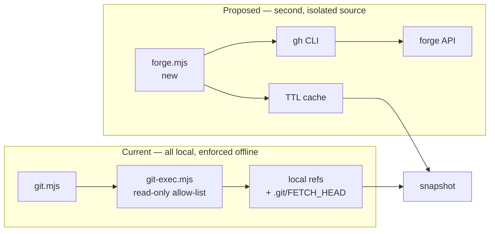

# Localhoster Remote Branch Status

## Summary

Surface, per repository card, whether the branch has an open pull request and whether its latest
commit passed CI — sourced from the hosting forge rather than local Git state.

## Context

Localhoster's git row currently answers "where am I relative to what I have on disk": branch,
uncommitted state, ahead/behind, and drift from the base branch. Every one of those is measured
against local refs.

The questions this plan adds cannot be answered that way. "Did this branch build?" and "is there a
PR open for it?" exist only on the forge's servers. That makes this the first Localhoster feature
that requires a network call on the scan path, which is why it is a plan rather than an increment.

## Current State

Git collection is deliberately, and enforceably, offline:

- `modules/localhoster/git.mjs` reads branch, HEAD, and upstream from the filesystem, then shells
  out only for `status` and `rev-list`. Its header comment states outright that nothing there
  contacts a remote.
- `modules/repositories/git-exec.mjs` enforces this with a strict allow-list —
  `GIT_READONLY_COMMANDS` currently holds `status`, `rev-list`, `symbolic-ref`, `rev-parse`,
  `merge-base`, `log` — and refuses anything else at the seam, before the subprocess runs.
- `scripts/test/localhoster-git-check.mjs` asserts both that only allow-listed subcommands run and
  that `fetch`/`pull` never appear.

A consequence worth stating: ahead/behind and base drift are measured against remote-tracking refs,
so they are only as fresh as the user's last `git fetch`. The UI already hedges this with a `+`
suffix and a "Fetched" row in the tooltip. **Forge data does not share that limitation** — it is
live at fetch time — which means the two kinds of data on one card have different freshness
semantics and must not be presented as if they agree.

## Goals

- Show whether an open PR exists for the current branch, and its number/title/draft state.
- Show whether the latest commit on the branch passed CI.
- Show the same for the repository's base branch, so a broken `main` is visible.
- Never present a failed or unavailable lookup as a passing state.
- Keep the existing offline git path exactly as it is, with its allow-list intact.

## Non-goals

- Triggering builds, re-running jobs, merging, or any write to the forge.
- Replacing local git state. Ahead/behind and drift stay locally derived.
- Supporting every forge at once. GitHub first; the seam should not preclude others.
- Running the user's tests locally. This reports what CI already decided.

## Current vs Proposed Data Flow



The two paths stay separate all the way to the snapshot. No forge call goes through
`git-exec.mjs`, and the allow-list is not widened.

## Proposed Design

### Source

Use the `gh` CLI rather than raw HTTP. It solves authentication (including SSO and token refresh)
without this repo ever handling a credential, and one call returns both facts:

```
gh pr list --head <branch> --json number,title,state,isDraft,statusCheckRollup
```

`statusCheckRollup` carries the CI verdict for the PR's head commit, so PR presence and build
status come from a single request. For a branch with no PR — including the base branch itself —
CI status needs a separate lookup against the commit.

**`gh` is not installed on this machine.** That is not an edge case to handle later: absent-CLI is
the default state and must be the first path built, degrading to a card that looks exactly like
today's.

### State model

Four states, and the distinction between the last two is the whole safety argument:

| State | Meaning | Renders |
|---|---|---|
| `passing` | CI succeeded on the head commit | green |
| `failing` | CI failed or was cancelled | red |
| `pending` | CI is queued or running | neutral/amber |
| `unknown` | no CI configured, `gh` missing, unauthenticated, rate-limited, offline, or timed out | nothing |

`unknown` must be visually indistinguishable from "no CI status feature at all". Most repositories
on a developer machine have no CI; a card that renders a marker for all of them teaches the user to
ignore the marker.

### Caching

The dashboard polls continuously; the forge API does not tolerate that. GitHub's authenticated REST
limit is 5,000 requests/hour shared across everything on the machine.

- Cache per `(repository, branch)` with a TTL measured in minutes, not seconds.
- Serve stale-while-revalidating so a scan never blocks on the network.
- Back off hard on `403`/rate-limit, and treat the backoff window as `unknown`, not as a retry loop.
- Never fan out: one lookup per repository per TTL window, matching the "N things, one call"
  discipline `docker.mjs` and `git.mjs` already follow.

### Placement

The existing severity ladder in `portal/localhoster/templates.js` (`DRIFT_RULES`) already picks one
phrase from a ranked list and stays silent otherwise. CI status is a different axis — it describes
the remote's verdict, not the user's divergence — so it should be its own indicator rather than a
new rung on that ladder. The node-graph icon beside the branch is the natural carrier.

## Implementation Plan

Four phases, each independently shippable.

- [ ] **Phase 1 — provider seam and degradation.** New `modules/localhoster/forge.mjs`, structurally
      mirroring `docker.mjs`: an orchestrator that shells out, pure exported parsers, an explicit
      timeout, and a warning classifier that distinguishes missing CLI, unauthenticated,
      rate-limited, and timed-out. Ships returning `unknown` for everything. No UI change.
- [ ] **Phase 2 — cache and scan integration.** TTL cache, stale-while-revalidate, backoff. Wire
      into the snapshot so `forge` data rides alongside `git` without touching it.
- [ ] **Phase 3 — PR surfacing.** Show open-PR presence, number, and draft state on the card.
      Valuable alone, and independent of any CI verdict.
- [ ] **Phase 4 — CI status indicator.** Colored node-graph icon for the active branch and the base
      branch, with `unknown` rendering nothing.
- [ ] **Phase 5 (optional) — baseline CI workflow.** A minimal GitHub Actions workflow in this repo,
      purely as a live fixture. Note that it only produces status for *this* repository; the feature
      must work against arbitrary repos with arbitrary workflows, so this is a test aid, not
      coverage.

## Validation

- Unit tests for the parsers against captured `gh` JSON fixtures, with no `gh` binary present —
  same pattern as `parseDockerPsOutput` in `modules/localhoster/docker.mjs`.
- A test asserting that with `gh` absent the snapshot is byte-identical to today's, so the offline
  path is provably unchanged.
- A test asserting every failure mode maps to `unknown` and never to `passing`.
- Confirm `scripts/test/localhoster-git-check.mjs` still passes unmodified — if this plan required
  editing that test, the isolation has been broken.
- `bash scripts/test/test-roborepo.sh --quiet`.
- Manual: a repo with passing CI, one with failing CI, one with no CI, and one with `gh` logged out.

## Risks

- **Stating a stale verdict as current.** A cached `passing` shown after a later failing push is the
  most damaging failure here, because it is the one a user would act on. Cache entries must carry
  the commit SHA they describe and be discarded when HEAD moves.
- **Rate-limit exhaustion affecting the user's other tools.** The 5,000/hr budget is shared with the
  user's own `gh` usage. A poorly bounded poll could break their terminal workflow, not just this
  dashboard.
- **Scope creep into a general forge integration.** The seam invites "while we're here" additions
  (issues, reviewers, checks detail). Each is a separate plan.
- **Latency on the scan path.** Docker discovery was measured at 2.1–4.0s on this machine and
  needed its timeout raised to 15s. A network call is slower and less predictable; it must never be
  awaited synchronously during a scan.

## Open Questions

- Should `gh` be a hard requirement, or should a raw-HTTP fallback with a user-supplied token exist?
  (Recommendation: `gh` only. Handling tokens directly is a materially larger security surface.)
- Should CI status be opt-in per repository, globally opt-in, or automatic when `gh` is available?
  (Recommendation: globally opt-in via settings, defaulting off, since it is the first feature that
  makes the dashboard talk to the network.)
- Is base-branch CI status worth a second lookup per repository, given it doubles the request count?
- What TTL balances freshness against the rate limit — 2 minutes, 5, or adaptive to poll interval?
- Should a failing base branch escalate to a card-level warning, or stay a quiet icon?
