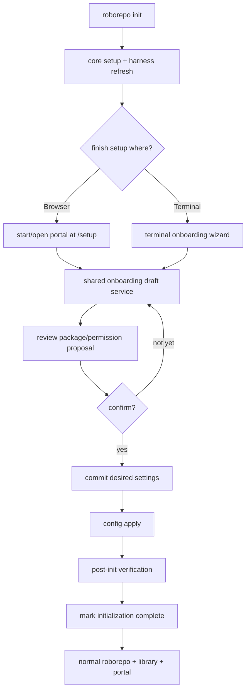

# Let Users Review First-Run Configuration in Browser or Terminal

## Summary

Turn the second half of `roborepo init` into one resumable onboarding workflow with two interfaces: browser or terminal.

After core initialization and harness discovery, the first user-facing onboarding screen asks how the user wants to continue:

```text
How would you like to finish setup?

> Open setup in browser
  Continue in terminal
```

Both choices edit the same staged onboarding draft. Preloaded package/default settings are proposals, not live configuration: the user can review and change them, then one confirmation commits the selected package/permission state, runs configuration reconciliation, verifies the result, and marks initialization complete.

The browser gets a dedicated `/setup` experience rather than dropping a first-time user into the normal portal. The terminal reuses the existing item-level Package Library wizard and shared behavior view where practical, but it operates on the onboarding draft instead of mutating live state while the user is still reviewing choices.

After initialization, `roborepo library` / `roborepo package manage` remain the normal way to edit live package settings. There is no public `roborepo onboard` command.

## Context

RoboRepo already has substantial onboarding machinery, but its current wiring reflects older checkout-install flows:

- `scripts/cli/presets.mjs` contains the live item-level multi-step wizard.
- `buildOnboardSteps()` derives its sections from `buildBehaviorView(readConfigSnapshot())`, the same server-side behavior model used by the `/config` page.
- `package manage` invokes that wizard through the internal `onboard` sub-action.
- `presetsIntro()` contains a historical first-install menu with “install additional tools,” “open in web,” telemetry-only, and done paths.
- `maybeRunPresetOnboarding()` is currently a pass-through, so there is no forced onboarding gate.
- completed plans `onboarding-wizard.md` and `onboarding-reinstatement.md` document the older install-time iterations and are implementation history, not work to restore verbatim.

Plan `46up8y7a` establishes the new package-mode lifecycle boundary: npm installs the application, `roborepo init` owns first-run initialization, bare `roborepo` routes an uninitialized user into that workflow, and package/default editing is reachable later through `roborepo library`.

This plan adds the richer onboarding UX after that lifecycle seam exists. It intentionally does not own package installation, uninstall cleanup, or harness-presence semantics.

## Goals

- Make Browser-versus-Terminal the first interactive choice after core `init` setup/discovery succeeds.
- Give browser onboarding a dedicated `/setup` route and focused first-run presentation.
- Reuse one shared onboarding domain service from both terminal and portal adapters.
- Present preloaded package/default settings as a staged proposal rather than applying them before the user confirms.
- Let the user modify the staged proposal without changing live harness files.
- Commit selections once, then run the existing configuration-apply and verification paths.
- Mark lifecycle initialization complete only after the confirmed configuration is applied and verified.
- Preserve partial onboarding state so the user can resume after exit, browser close, terminal interruption, or a recoverable apply failure.
- Keep zero detected harnesses a fully supported onboarding state.
- Render one, two, or N detected/enabled harnesses from machine state without hardcoded provider pairs.
- Teach the friendly **Library** concept while still exposing “package” terminology inside the detailed settings UI.
- Keep `roborepo library` as the post-initialization editor for live settings.
- Keep terminal and browser results equivalent for the same staged selections.
- Follow RoboRepo's framework-less portal conventions: server-owned domain logic, real HTML `<template>` markup, named ESM exports, and orchestration separated from rendering/execution.

## Non-goals

- Installing or updating the RoboRepo npm package.
- Implementing `roborepo init`, initialization-state persistence, or managed uninstall; plan `46up8y7a` owns those foundations.
- Reintroducing `roborepo onboard`.
- Creating a second package catalog, onboarding-only package definitions, or browser-only configuration state.
- Broadening harness detection from current discovery semantics.
- Automatically installing third-party harness executables.
- Redesigning the full post-initialization `/config` page.
- Making every advanced package or permission control available during first-run onboarding.
- Replacing `roborepo library` with the onboarding route after initialization.
- Adding a build step, framework, TypeScript requirement, or client-side state framework to the portal.

## Current State

### Shared behavior model already exists

The terminal wizard and portal do not need independent definitions of package behavior. `scripts/cli/config.mjs` already builds the user-facing behavior sections server-side, and `scripts/cli/presets.mjs` uses that view to build terminal onboarding steps.

That is the correct seam to preserve: onboarding should add a draft/commit layer beneath both UIs, not copy package/category logic into a new browser implementation.

### Current terminal onboarding mutates live state

The current Package Library wizard computes pending differences and applies them through package/permission mutation functions. That is appropriate for a post-installation editor, but not for first-run review if defaults must remain unapplied until final confirmation.

First-run needs a draft model:

```text
catalog defaults + current machine facts
              ↓
       onboarding draft
              ↓
       browser or terminal edits
              ↓
           confirmation
              ↓
      persist desired settings
              ↓
         config apply
```

The existing `roborepo library` behavior can continue applying live changes after initialization; the staged draft is specific to first-run onboarding.

### Current browser route is not onboarding-specific

The portal page manifest currently serves:

- `/` → Agents
- `/config` → Agents alias
- `/plans`
- `/tokens`
- `/localhoster`

There is no first-run route. `roborepo web` opens the normal portal.

The onboarding browser experience therefore needs an explicit non-normal route such as `/setup`. It should reuse shared portal chrome/components where useful without appearing as a normal primary navigation destination after initialization.

### Harness-count behavior must remain cohort-aware

The onboarding workflow cares about machine provider state, not every provider registered in code and not only providers with telemetry.

The current Agents configuration snapshot enumerates registered providers, while Tokens derives filters from observed telemetry. The lifecycle foundation will make those cohorts explicit; this plan consumes the machine/detected cohort for onboarding and does not redefine discovery.

## Proposed Design

### 1. One onboarding session, two interfaces

The workflow after `roborepo init` core setup is:



The Browser-versus-Terminal choice is presentation only. It must not select a different configuration model or mutation path.

### 2. Shared onboarding draft service

Add a focused server-side/CLI-domain module under `scripts/cli/` or another existing configuration ownership boundary. It should own:

- creating a first-run draft from catalog defaults plus current machine facts;
- reading/resuming the draft;
- updating allowed staged package/permission choices;
- validating dependency closure and unsupported combinations;
- producing a review summary;
- committing the draft to normal package/permission state;
- clearing/archiving the draft after successful initialization.

Do not put this logic in browser JavaScript or terminal rendering code.

A conceptual machine-local record:

```json
{
  "schemaVersion": 1,
  "workflowVersion": 1,
  "status": "editing",
  "revision": 1,
  "interface": "browser",
  "selectedPackages": ["..."],
  "permissionChoices": {},
  "updatedAt": "ISO-8601"
}
```

The exact schema should be minimal. Do not duplicate package manifests, provider manifests, or computed behavior sections. Persist identifiers/choices only; derive labels/descriptions/current availability from current catalogs when rendering. Increment `revision` on each successful update; browser or terminal writes based on a stale revision must fail with a conflict and reload the current draft rather than silently overwrite the other interface.

The lifecycle initialization record from plan `46up8y7a` remains authoritative for whether RoboRepo is fully initialized. The onboarding draft only records an in-progress configuration proposal.

> **Sync note (plan `32i43fdm`, portal-web-first-run-bootstrap):** the initialization record is now
> defined as *procedural machine bootstrap* — workspace/state roots, persisted harness discovery,
> and the completion marker. It is written by the shared `ensureInitialized()` primitive that both
> `roborepo init` and `roborepo web` call, *before* any package selection or onboarding interaction.
> This plan MUST NOT treat "initialization complete" as proof that staged package onboarding
> finished. Track staged-onboarding completion in the separate draft/session state described here
> (its own `status`/`completedAt`), and treat the procedural marker only as "the machine was
> bootstrapped". `roborepo web` on a fresh install now completes that procedural marker and opens
> the portal; the `/setup` route this plan builds is the place to resume package onboarding, not a
> replacement for the procedural record.

### 3. Defaults are proposals until confirmation

First-run defaults must be visible before becoming live.

The onboarding service computes a proposed selection from the current package catalog/default policy. The user may accept it unchanged or edit it.

Before confirmation:

- do not write enabled-package state as the final user choice;
- do not project skills/commands/rules/hooks into harness homes because of staged onboarding choices;
- do not mark initialization complete;
- do persist enough draft state to resume.

After confirmation:

1. validate the whole draft;
2. persist the desired package/permission state;
3. run configuration reconciliation once;
4. run post-init verification;
5. mark initialization complete;
6. clear the active draft.

If apply fails after choices are persisted, keep initialization incomplete and retain enough information to retry safely without asking the user to reconstruct the selection.

### 4. First interactive choice

After core setup/discovery, terminal `roborepo init` presents exactly the interface choice before package details:

```text
How would you like to finish setup?

> Open setup in browser
  Continue in terminal
```

Browser choice:

- start/reuse the local portal through the existing web/server machinery;
- open the dedicated `/setup` route;
- keep the terminal process useful as a status/return point rather than launching a second independent wizard.

Terminal choice:

- continue in the same process;
- use the existing wizard primitives and behavior categories;
- edit the shared onboarding draft;
- finish with a review/confirm step.

If no interactive TTY is available, `roborepo init` must stop before committing the draft and print an actionable instruction unless the caller explicitly passes `--accept-defaults`. `--accept-defaults` is the automation-only opt-in that accepts the proposed default selection, commits it, applies configuration, verifies, and completes initialization without opening either UI.

### 5. Dedicated `/setup` browser route

Add a focused onboarding surface, for example:

```text
/setup
```

It is a first-run workflow route, not a normal portal destination. Do not add it to the persistent nav after initialization.

Recommended page ownership:

```text
portal/setup/
  index.html
  app.js
  api.js
  templates.js
  styles.css
```

Use the existing portal server/chrome/template conventions:

- real HTML `<template>` elements hold reusable multi-element markup;
- `app.js` wires state/events only;
- `api.js` owns browser requests;
- `templates.js` fills/clones real templates rather than assembling nested DOM trees or HTML strings;
- shared domain calculations remain server-side.

The route should use the same origin/token mutation protections as other portal writes.

### 6. Browser onboarding information architecture

Keep first-run scope narrower than the full Agents configuration page.

Suggested sequence:

| Step | Purpose |
| --- | --- |
| Welcome | explain what RoboRepo will configure and show detected agent count |
| Agents | show zero/one/N detected/enabled machine providers and what configuration will apply |
| Library | review proposed package selections |
| Permissions | review the bounded first-run permission choices supported by the shared model |
| Review | summarize changes, preserved content, and target harnesses |
| Apply | commit, reconcile, verify |
| Complete | next actions: open portal, use `roborepo`, change later with `roborepo library` |

Do not expose every advanced package-development, MCP, telemetry-analysis, or repository-management control during onboarding.

### 7. Terminal onboarding parity

Reuse the current wizard primitives in `scripts/cli/presets.mjs`/`skill-lib.mjs` where they fit, but separate rendering from draft mutation.

The terminal should:

- derive sections from the same behavior view as the browser;
- display the same proposed active/inactive state;
- write changes to the shared draft, not live package state;
- provide a final review screen before commit;
- produce the same committed state as the browser for the same choices.

`roborepo package manage` / `roborepo library` after initialization remains a live editor; do not force every later Library change through the first-run draft/confirmation transaction.

### 8. Zero-to-N harness onboarding

Onboarding consumes the lifecycle foundation's `machineHarnesses` cohort: persisted discovery entries whose `confidence` is not `absent`, while retaining each provider's enabled/disabled state.

Expected behavior:

| Harness count | Onboarding behavior |
| --- | --- |
| 0 | show a valid empty state; explain that packages can be selected now and harnesses can be installed later |
| 1 | name the one detected/enabled provider; avoid redundant provider-selection controls |
| 2 | show both providers from data |
| N | render from provider data with no fixed column count or Claude/Codex-only copy |

Do not infer “installed” from the registered provider catalog. Do not use telemetry's observed-harness set as the onboarding cohort.

A synthetic provider test should prove that browser and terminal representations are data-driven.

### 9. Resume and re-entry

Initialization and onboarding are allowed to stop at any point before confirmation or during recoverable apply.

Required cases:

- terminal Ctrl-C while editing → draft remains; initialization remains in-progress;
- browser tab closes → rerunning `roborepo init` offers to resume;
- portal server stops → draft remains machine-local;
- user switches from terminal to browser or browser to terminal → both load the same current draft;
- apply fails → return to a retry/review state rather than marking complete;
- verification fails after apply → initialization remains incomplete and reports remediation.

Re-running `roborepo init` with a completed initialization should not create a new first-run draft. It should direct the user to `roborepo library` for normal configuration changes.

### 10. Library vocabulary

Use **Library** as the friendly first concept:

```text
Library
Choose the RoboRepo packages and behaviors you want enabled.
```

Inside the UI, explain once that Library items are backed by RoboRepo packages. This teaches the package model without making the user know it before discovering the feature.

After onboarding:

```sh
roborepo library
```

is the primary “change these choices later” instruction.

### 11. Apply and verification boundary

The onboarding UIs do not perform configuration writes themselves.

The commit path should be a short orchestrator:

```text
validate draft
→ persist desired package/permission state
→ config apply
→ focused doctor/verification
→ mark initialization complete
```

If a package toggle already has a shared mutation function, use its underlying domain operation rather than simulating browser clicks or invoking the CLI through a subprocess.

Keep the orchestration module short; move draft parsing/validation, package-state commit, portal presentation, and terminal presentation into their respective ownership modules.

## Code Touchpoints

### Lifecycle integration

- Initialization module introduced by plan `46up8y7a`
  - expose the post-core-setup onboarding handoff;
  - do not duplicate initialization status inside the onboarding service.
- `scripts/cli/main.mjs`
  - no new forced gate; `init` owns entry.
- `scripts/cli/state-paths.mjs`
  - add the machine-local onboarding draft/session path if not colocated behind a dedicated state module.

### Shared onboarding/config domain

- `scripts/cli/presets.mjs`
  - retain current behavior-view-to-terminal-step mapping where useful;
  - split first-run draft editing from live Library mutation.
- `scripts/cli/config.mjs`
  - continue to own the behavior view shared by web and terminal.
- `scripts/cli/config-mutate.mjs`
  - provide/retain reusable commit primitives; do not call browser routes from CLI code.
- New focused onboarding service
  - draft creation/read/update/validate/commit/resume.

### Terminal UI

- `scripts/cli/skill-lib.mjs`
  - reuse existing `selectMenu`/`wizard` primitives;
  - add only generic interaction behavior that is truly reusable.
- Keep terminal-specific rendering/orchestration out of the shared domain service.

### Portal server/API

- `scripts/cli/portal-server.mjs`
  - serve `/setup` as a non-normal onboarding page;
  - keep it out of persistent nav after initialization.
- New `scripts/cli/portal-routes-onboarding.mjs`
  - read/update/commit onboarding draft;
  - use existing origin/token mutation guard.
- `scripts/cli/telemetry.mjs`
  - reuse/start the portal without introducing a second server implementation;
  - add a focused way for `init` to open `/setup` rather than the normal default route if needed.

### Browser

- New `portal/setup/`
  - `index.html`
  - `app.js`
  - `api.js`
  - `templates.js`
  - `styles.css`
- `portal/shared/`
  - reuse existing chrome/widgets;
  - only add shared pieces when more than onboarding consumes them.

### Tests/docs

- `scripts/test/cli-surface-integration-check.mjs`
- `scripts/test/telemetry-portal-state-check.mjs` where shared route/state behavior overlaps
- new focused onboarding service and portal tests
- `README.md`
- `docs/user/guides/first-time-setup.md`
- `docs/user/guides/install-workflows.md`
- `docs/user/reference/roborepo-cli.md`
- `docs/user/reference/config-control-panel.md`

## Implementation Plan

### Phase 1 — Characterize and extract the shared onboarding domain

- [ ] Pin the current terminal Package Library behavior and current config behavior view with focused tests before changing first-run semantics.
- [ ] Define the minimal onboarding draft schema and machine-local storage path.
- [ ] Add pure/service tests for create, read, update, stale-revision conflict, resume, validate, commit, and clear.
- [ ] Keep package manifests and computed labels out of persisted draft state.
- [ ] Define a single draft-to-desired-state commit operation reused by browser and terminal.
- [ ] Keep post-initialization `library` mutation behavior separate from first-run staged editing.

### Phase 2 — Add staged default review

- [ ] Build a first-run proposed selection from the current package/default policy without applying it.
- [ ] Render proposed defaults as editable choices in the terminal flow.
- [ ] Add final review and explicit confirmation before any staged choice becomes live.
- [ ] Commit package/permission desired state once, then invoke configuration reconciliation.
- [ ] Keep initialization incomplete when the user exits without confirming.
- [ ] Preserve/retry the draft when apply or verification fails.

### Phase 3 — Add the interface choice to `init`

- [ ] After core setup/harness refresh, prompt Browser versus Terminal before package details.
- [ ] Terminal choice enters the draft-backed wizard.
- [ ] Browser choice starts/reuses the portal and opens `/setup`.
- [ ] Allow a resumed initialization to return to the last draft regardless of which interface created it.
- [ ] Add and test `roborepo init --accept-defaults` as the explicit noninteractive opt-in; plain non-TTY `init` must stop before commit with an actionable instruction.

### Phase 4 — Build the dedicated `/setup` portal surface

- [ ] Add the non-nav onboarding route and focused route module.
- [ ] Add browser API methods for draft read/update/review/commit.
- [ ] Build the page with real HTML templates and slot-fill helpers, not JS-built nested markup.
- [ ] Render Welcome, Agents, Library, bounded Permissions, Review, Apply, and Complete states.
- [ ] Make mutation failures visible without losing the draft.
- [ ] Keep normal portal routes usable independently of onboarding.

### Phase 5 — Zero-to-N harness parity

- [ ] Render zero detected agents as a valid onboarding state in browser and terminal.
- [ ] Render one provider without unnecessary multi-provider controls.
- [ ] Render two/N providers from machine state with no fixed provider columns/copy.
- [ ] Add a synthetic-provider fixture to prove N-provider extensibility.
- [ ] Verify the same staged package choices produce equivalent committed results for zero, one, and N harness states.
- [ ] Do not alter detection confidence/home-dir policy in this phase.

### Phase 6 — Resume, retry, and completion

- [ ] Resume after terminal interruption.
- [ ] Resume after browser close/server restart.
- [ ] Allow interface switching against one persisted draft.
- [ ] Preserve a retryable state after commit/apply/verification failure.
- [ ] Mark lifecycle initialization complete only after successful apply + verification.
- [ ] Clear the active draft after successful completion.
- [ ] Make repeated completed `init` direct the user to `roborepo library` instead of recreating onboarding.

### Phase 7 — Documentation and cleanup

- [ ] Update first-time install docs to show the Browser/Terminal choice.
- [ ] Explain that initial Library selections are proposals until confirmation.
- [ ] Document `roborepo library` as the post-init editor.
- [ ] Remove or rewrite stale current docs that describe automatic default application as the intended first-run UX.
- [ ] Keep completed onboarding plans as historical records; do not make them look like current instructions.
- [ ] Remove dead first-install intro wiring only after the new `init` handoff has equivalent coverage.

## Validation

### Domain and CLI

Add focused tests for the onboarding draft/service, then run:

```sh
node scripts/test/cli-command-catalog-check.mjs
node scripts/test/cli-surface-integration-check.mjs
npm run test:packages
npm run test:package-lifecycle
npm run test:harness-cli
bash scripts/doctor.sh --quiet
npm test
```

Required terminal assertions:

- first interactive choice offers Browser and Terminal;
- draft edits do not modify live enabled-package/harness projection state before confirmation;
- confirmation commits once;
- terminal cancellation leaves a resumable draft;
- switching interfaces does not fork the draft;
- zero/one/N harness summaries use machine state dynamically;
- completed initialization redirects repeat setup intent toward `library`.

### Portal

Add focused HTTP/state tests for:

- `/setup` route availability during initialization;
- protected mutation token/origin behavior;
- draft read/update/commit;
- server restart + draft resume;
- apply/verification failure presentation;
- completed-state redirect/closure behavior;
- no hardcoded provider count.

Because this feature adds a real route plus a browser-to-server-to-persist multi-step workflow, include a real-browser E2E check rather than relying only on mocked DOM/state tests. Reuse the repository's browser-test harness if one has landed by implementation time; otherwise add one focused browser test path instead of creating a second visual-regression framework.

### New-Mac manual acceptance

Exercise the onboarding experience on the clean machine across the same lifecycle transitions used by plan `46up8y7a`:

1. zero harnesses;
2. one harness installed but not launched;
3. one harness initialized;
4. two harnesses;
5. all currently registered providers.

For each applicable stage, run `roborepo init` from a clean/in-progress initialization fixture and complete the same package selection once in Terminal and once in Browser. Compare the resulting desired package state and live projections.

## Acceptance Criteria

- `roborepo init` asks Browser or Terminal before first-run package settings are edited.
- Browser choice opens a dedicated `/setup` workflow, not the normal portal landing page.
- Terminal and browser read/write one shared onboarding draft and commit through one shared domain path.
- preloaded package/default settings are visible proposals and do not become live until confirmation.
- cancellation/interruption before confirmation leaves live configuration unchanged and the draft resumable.
- zero harnesses is a supported onboarding state.
- one and N harnesses render from machine state without fixed Claude/Codex assumptions.
- apply/verification failure leaves initialization incomplete and retryable.
- successful confirmation commits desired state, applies configuration, verifies it, marks initialization complete, and clears the active draft.
- completed users change package selections later through `roborepo library` / `roborepo package manage`.
- no public `roborepo onboard` command is restored.
- `/setup` does not become a permanent normal navigation destination.
- browser markup follows the repo's real-HTML-template convention.
- focused tests, relevant lifecycle/package/harness checks, and the full test suite pass.

## Risks

- Reusing live package mutation functions too early can accidentally apply defaults while the UI claims they are only staged.
- A browser and terminal process editing the same draft concurrently need deterministic last-write or revision handling; silent lost updates would make interface switching unsafe.
- If the portal route is tied too tightly to current `/config` rendering, onboarding can inherit advanced controls and become as complex as the normal settings page.
- Registered-provider metadata, detected machine state, and telemetry-observed harnesses are different cohorts; onboarding must consume the machine cohort only.
- A failed apply after desired-state commit needs a retry path that distinguishes “selection saved” from “projection verified.”
- A real-browser test is warranted for this cross-step workflow, but it should reuse existing browser-test infrastructure rather than create a parallel testing stack.
