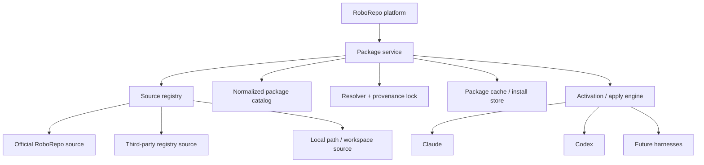
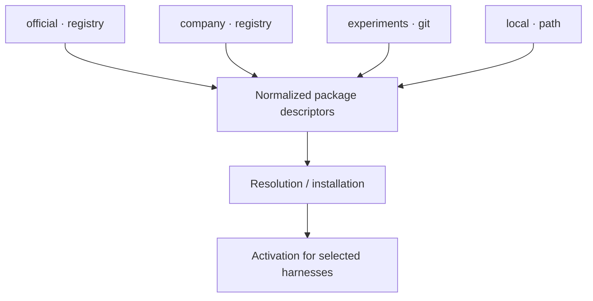
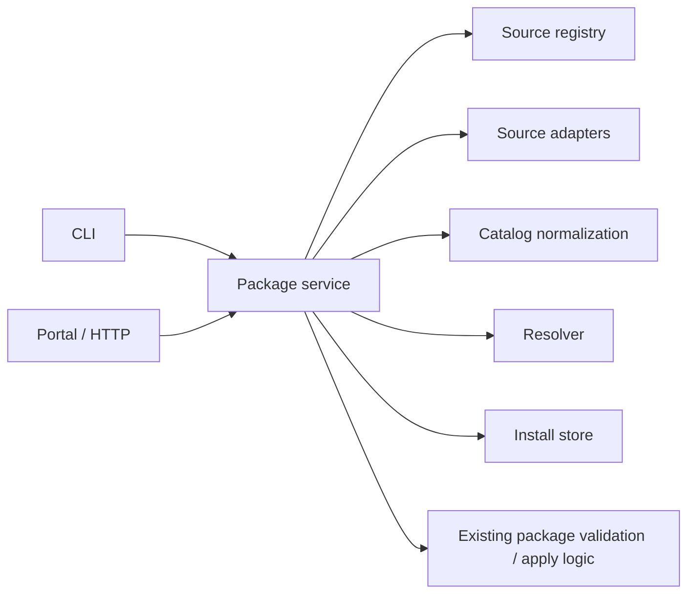
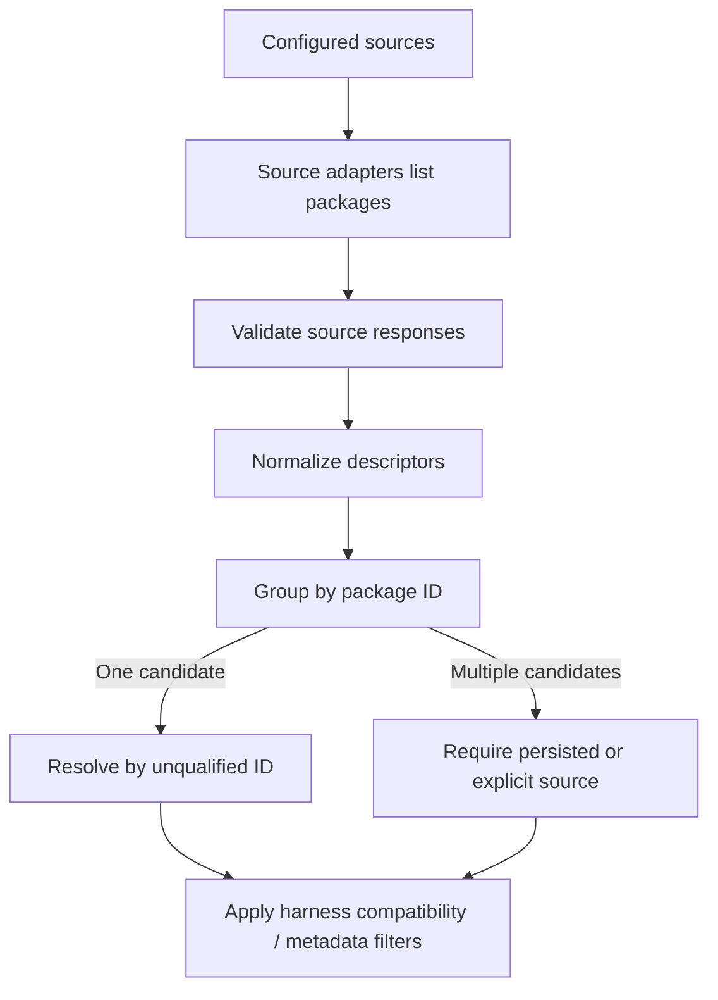
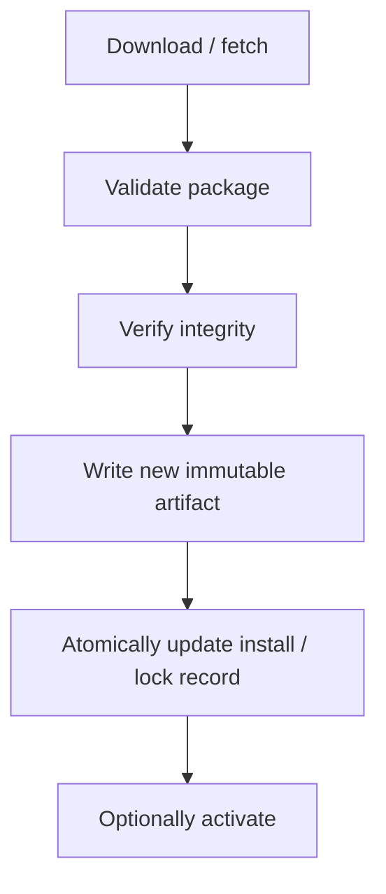

# Decouple Platform Distribution from Configurable Sources

## Summary

RoboRepo currently ships the application and its available global package library together. The package catalog then combines those built-in packages with packages found in the configured workspace. This works while the package library is small, but it couples platform releases to package-library growth and makes the workspace behave like a special escape hatch rather than one member of a general package-source model.

This plan separates those concerns.

The RoboRepo application becomes a package-management platform that can discover packages from one or more configured **package sources**. The official RoboRepo package library becomes one source. A local workspace becomes another source. Additional registries, Git repositories, or organization-specific catalogs can be added later through the same source contract.

The resulting model is:



The separation is both a product decision and an ownership boundary:

- `appRoot` owns replaceable application code.
- `stateRoot` owns RoboRepo-managed mutable state, downloads, caches, locks, and installed package copies.
- `workspaceRoot` remains user-controlled source content and can be represented as a local `path` package source.
- A platform update must not overwrite user-authored packages.
- Removing RoboRepo-managed state must not recursively delete an arbitrary user-owned workspace path.

The first implementation should preserve today's package behavior while introducing the source abstraction. Remote package distribution can then be added behind that abstraction, followed by moving optional official packages out of the npm application artifact.

## Why This Change

### Current State

RoboRepo already has the architectural roots needed for this separation:

- `scripts/cli/roots.mjs` distinguishes immutable application code, machine-local mutable state, and the portable workspace.
- `docs/architecture/config-code-separation.md` documents the same ownership boundary.
- `scripts/cli/package-catalog.mjs` currently discovers packages from two hard-coded origins: built-in packages and workspace packages.
- `package.json` currently publishes `globals/` as part of the npm package, so the application distribution contains the available global package library.
- Existing package lifecycle and catalog tests already provide characterization coverage around package discovery, harness compatibility, defaults, and application.

The architectural problem is therefore not that RoboRepo lacks separation concepts. It is that package **discovery and distribution** have not yet been generalized around them.

### Product Pressure

Keeping every optional package inside the platform artifact creates several long-term constraints:

1. Adding a package grows the RoboRepo application distribution even if most users never enable that package.
2. Updating a package can require a RoboRepo platform release even when platform code did not change.
3. Third-party and organization-specific package libraries do not fit naturally beside a single hard-coded built-in directory.
4. The workspace has special semantics rather than participating in a uniform package-source model.
5. Package provenance becomes increasingly ambiguous once local and external packages can share identifiers.
6. Uninstall and reset behavior becomes harder to explain unless RoboRepo has explicit ownership of application files, managed state, and user-authored content.

The goal is not to reproduce npm. The goal is to establish a small, stable package-source boundary that can start with simple infrastructure and support richer distribution later without changing the package model again.

## Goals

This plan must produce a package system in which:

- RoboRepo can use packages from multiple configured sources.
- The official RoboRepo library is a source, not a privileged package format.
- Local user-authored packages use the same normalized package contract as remote packages.
- A workspace can remain a convenient authoring location while becoming a `path` source internally.
- Package identity includes provenance strongly enough to prevent silent source switching.
- Discovery, installation, and activation are distinct operations.
- Optional packages can be omitted from the npm application artifact.
- Platform upgrades can replace application code without replacing user-authored packages or unrelated package state.
- Remote package installation can be deterministic and integrity-checked.
- The same domain/service layer can serve CLI and portal experiences.
- Offline behavior is predictable once catalogs or package artifacts have been cached.
- Reset and uninstall flows communicate exactly what RoboRepo owns and what will be preserved.
- Current built-in/workspace behavior can migrate incrementally rather than requiring a single large rewrite.

## Non-Goals

This plan does not require:

- Building a public marketplace with reviews, payments, ratings, moderation, or accounts.
- Mirroring npm registry protocol or npm's dependency-resolution model.
- Supporting arbitrary package code execution without an explicit trust model.
- Implementing package-to-package dependencies in the first source abstraction.
- Implementing automatic publication from third-party repositories.
- Creating an MCP package-management interface.
- Supporting every possible transport in the first release.
- Treating the user's workspace as disposable RoboRepo state.
- Preserving the current `builtin` implementation forever after the official source is available.
- Designing a general-purpose package manager outside RoboRepo's harness-configuration domain.

## Product Model

### One Package System, Multiple Sources

Do not describe the design as a two-tier package system. There is one package system with multiple sources.

A source answers a narrow set of questions:

- What packages can this source provide?
- What metadata describes each package?
- How can RoboRepo obtain a specific package revision?
- What provenance and integrity information accompanies it?
- Is the source local/live or remote/materialized?

Once a package has been normalized, downstream package validation and activation should not care whether it came from RoboRepo's official library, a company registry, a Git repository, or a local path.

Conceptually:



### Separate Discovery, Installation, and Activation

The UI and implementation must distinguish three states that are currently easy to conflate.

| State | Meaning | Example |
| --- | --- | --- |
| Available | A configured source advertises the package. | `official/code-style` appears in search. |
| Installed | RoboRepo has a resolvable local copy or live local reference with recorded provenance. | Version `1.4.0` is materialized under managed state. |
| Active | The installed package is enabled for one or more applicable harnesses/configurations. | `code-style` is applied to Claude and Codex. |

A local path package can be both available and locally resolvable without being copied into the managed install store. It still needs an installation record or equivalent resolution record if RoboRepo activates it, so the system can explain exactly what path and source produced the active package.

This distinction prevents the future package browser from treating "I can see it" as "it has modified my harness."

### Source Identity

Every source has a stable local identifier.

Examples:

```text
official
team
community
local
```

Every resolved package records both:

```text
sourceId
packageId
```

The pair is the canonical provenance identity for resolution. A human-facing qualified name may be rendered as:

```text
official/code-style
local/code-style
```

The package's own `id` remains its package identity within a source. Source qualification is not written into every package manifest merely to avoid collisions.

### Collision Behavior

RoboRepo must never silently choose between two different sources advertising the same package ID unless the user has already persisted that choice.

Rules:

1. If only one configured source supplies a package ID, unqualified selection can resolve to it.
2. If an existing installation/activation record already names a source, continue resolving against that source.
3. If multiple sources supply the same ID and no prior source is recorded, require an explicit source choice.
4. A source-priority mechanism may influence search ordering, but priority alone must not silently rewrite persisted provenance.
5. If a previously resolved source disappears, report the package as unresolved rather than substituting a different source automatically.

This favors reproducibility over convenience.

## User Experience

### First Install

A new RoboRepo installation should install the platform and only the minimal assets required to start package management.

The initial experience should be:

1. Install RoboRepo through npm.
2. RoboRepo initializes machine-local state.
3. The official package source is configured by default.
4. RoboRepo refreshes or reads the official source catalog.
5. The user chooses packages or a preset.
6. Only selected remote package artifacts are downloaded.
7. Selected packages are activated through the existing harness application flow.

If a minimal bootstrap package is genuinely required for RoboRepo to function, it may remain bundled. "Convenient to have by default" is not sufficient reason to keep an optional package in the application artifact.

### Package Browser

CLI and portal should expose the same underlying information:

- package name and description;
- source;
- available version or revision;
- installed version or revision;
- active/inactive state;
- harness compatibility;
- trust/provenance label;
- update availability;
- errors such as unavailable source, invalid manifest, or integrity mismatch.

The portal may present source labels such as **Official**, **Local**, and **Third-party**. These are presentation labels derived from source metadata; they are not separate package types.

### Source Management

The product needs a source-management surface. Exact CLI spelling can be finalized during implementation, but the domain operations should support:

```text
list sources
add source
remove source
enable/disable source
refresh source
show source details
```

A proposed CLI shape is:

```bash
roborepo package source list
roborepo package source add
roborepo package source remove <source>
roborepo package source refresh [source]
roborepo package source info <source>
```

Source removal must not implicitly delete user-authored files or silently uninstall packages. If installed packages depend on the source record for provenance, the operation should preview the effect and either preserve the installed artifact as unresolved/orphaned state or require an explicit package removal decision.

### Package Management

The package-management surface should expose the lifecycle directly:

```bash
roborepo package list
roborepo package search <query>
roborepo package info <package>
roborepo package install <package>
roborepo package update <package>
roborepo package remove <package>
roborepo package enable <package>
roborepo package disable <package>
```

Existing commands do not need to be renamed merely to match this proposed spelling. The implementation should reuse existing public commands where practical and add source/install concepts without creating two competing command families.

The important UX rule is semantic:

- **install** obtains or records a package;
- **enable** applies it to a harness/configuration;
- **disable** reverses its managed application without deleting the package artifact;
- **remove** removes the managed installed artifact/record after handling active state safely.

### Local Package Authoring

The current workspace remains useful and should become the default local source rather than disappearing.

A user should be able to:

1. Point `workspaceRoot` at a directory they control.
2. Author or clone package directories there.
3. See valid packages appear from the configured local source.
4. Enable a local package without RoboRepo copying the author's source tree into opaque managed storage.
5. Edit the source and deliberately re-apply/reload it according to existing package lifecycle behavior.

The source record could resemble:

```json
{
  "id": "local",
  "type": "path",
  "path": "~/.roborepo/workspace",
  "trust": "local"
}
```

A future user may configure additional path sources outside `workspaceRoot`. Therefore deletion safety must follow ownership metadata, not the assumption that every `path` source lives under one RoboRepo directory.

### Source Collision UX

If both `official` and `local` provide `code-style`, a command such as:

```bash
roborepo package install code-style
```

must not guess when no source has been selected previously.

It should return a concise disambiguation:

```text
Multiple sources provide "code-style":

  official/code-style
  local/code-style

Choose a qualified package name.
```

Once installed from `local`, ordinary update/enable operations can continue using the persisted source record without repeated prompts.

### Offline UX

Remote source availability and installed-package usability are separate.

When offline:

- already installed packages remain usable;
- cached catalog data may be shown with a stale/offline indicator;
- source refresh fails without corrupting the last valid catalog;
- installation of an uncached remote artifact fails clearly;
- activation should not require a network request when the resolved artifact already exists locally.

The source layer should make network availability a discovery/materialization concern, not a prerequisite for every package operation.

## Platform and Data Ownership

### Root Responsibilities

The existing three-root architecture should become the source of truth for package ownership.

| Root | Ownership | Package responsibility | Deletion policy |
| --- | --- | --- | --- |
| `appRoot` | RoboRepo application distribution | Runtime, built-in bootstrap assets, schemas/defaults needed to start | Replaceable by platform install/update |
| `stateRoot` | RoboRepo-managed machine state | source config, catalog cache, package cache, installed artifacts, locks, activation metadata | May be reset/purged through explicit RoboRepo command |
| `workspaceRoot` | User-controlled source content | default local package-authoring source | Preserve unless the user explicitly deletes content outside normal RoboRepo cleanup |

A path source elsewhere on disk inherits the same user-owned treatment as `workspaceRoot` unless RoboRepo explicitly created and marked the content as managed.

### Proposed State Layout

The exact names can adapt to current state conventions, but ownership should be obvious:

```text
stateRoot/
  package-sources.json
  packages/
    catalogs/
      official.json
      team.json
    cache/
      <content-address-or-source-key>/
    installed/
      <source-id>/
        <package-id>/
          <version-or-revision>/
    package-lock.json
```

Do not make directory paths the only database of truth. Persist explicit records so `doctor`, uninstall, and migration logic can distinguish managed artifacts from user paths.

### Package Source Configuration

Use a serializable source configuration model.

Example:

```json
{
  "version": 1,
  "sources": [
    {
      "id": "official",
      "type": "registry",
      "url": "https://example.invalid/roborepo/index.json",
      "enabled": true,
      "trust": "official"
    },
    {
      "id": "local",
      "type": "path",
      "path": "~/.roborepo/workspace",
      "enabled": true,
      "trust": "local"
    }
  ]
}
```

The production official URL is intentionally not specified in this plan. The source abstraction should not embed a host-specific URL in domain code.

Source configuration should be machine/user state rather than package source content. A portable workspace may define package content, but it should not need to own the entire machine's source registry configuration.

## Architecture

### Package Service Boundary

Introduce one shared package service/domain layer that owns source discovery, normalization, resolution, installation records, and package lifecycle coordination.

CLI and portal are clients of this layer.

Avoid implementing registry behavior directly inside CLI handlers or portal routes.

A conceptual dependency direction is:



The package service should expose plain data and typed-by-convention JavaScript objects. RoboRepo currently uses ESM JavaScript; this feature should not introduce TypeScript as a prerequisite.

### Source Adapter Contract

Use a small adapter contract rather than branching on source type throughout the catalog.

Conceptually:

```js
const createPackageSource = ({
  id,
  kind,
  list,
  resolve,
  materialize
}) => ({
  id,
  kind,
  list,
  resolve,
  materialize
})
```

The contract responsibilities should remain narrow:

```text
list()
  Return package summaries available from the source.

resolve(packageId, selector?)
  Return immutable resolution metadata for a concrete revision.

materialize(resolution, destination)
  Make a remote resolution locally usable when needed.
```

A `path` source may not need to copy files during `materialize`; it can return a verified local path. A registry source downloads or retrieves a concrete artifact into RoboRepo-managed state.

Keep source transport separate from package validation. After materialization, the existing package manifest/shape validators should validate the package exactly as they do local/built-in content.

### Normalized Package Descriptor

The catalog should normalize source-specific metadata into a common descriptor before UI filtering or harness compatibility logic.

A descriptor should carry at least:

```json
{
  "sourceId": "official",
  "packageId": "code-style",
  "displayName": "Code Style",
  "description": "...",
  "version": "1.4.0",
  "harnesses": ["claude", "codex"],
  "trust": "official",
  "location": null
}
```

`location` should only be present when a local path is meaningful and safe to expose. Remote catalog entries should not masquerade as installed local paths.

### Resolution Record and Lock

Catalog metadata is mutable: a registry can publish a new version, a Git branch can move, and a local directory can change.

Activation must therefore point at a concrete resolution record.

A package lock/provenance record should include:

```json
{
  "sourceId": "official",
  "packageId": "code-style",
  "selector": "1.4.0",
  "resolved": "1.4.0",
  "integrity": "sha256-...",
  "installedPath": "...",
  "installedAt": "2026-08-11T00:00:00Z"
}
```

For a Git source, `resolved` should be an immutable commit SHA. For a path source, the record should identify the configured source and path; an optional content fingerprint can help `doctor` report drift without pretending local authoring is immutable.

The lock is not intended to become npm's dependency lockfile. Its job is RoboRepo provenance and reproducibility.

### Catalog Composition

Replace the current hard-coded built-in/workspace merge with a general composition flow:



The first refactor can wrap today's built-in directory and workspace directory as adapters. That lets source composition land before any remote distribution behavior changes.

### Official Registry v1

The official source should start with infrastructure that is easy to inspect and replace.

A reasonable v1 is:

```text
separate package-library repository or release store
  |
  +--> versioned index document
  |
  +--> immutable package artifacts
```

The index only needs enough information for discovery and immutable resolution:

```json
{
  "schemaVersion": 1,
  "packages": [
    {
      "id": "code-style",
      "name": "Code Style",
      "latest": "1.4.0",
      "versions": {
        "1.4.0": {
          "artifact": "...",
          "integrity": "sha256-..."
        }
      }
    }
  ]
}
```

Do not make GitHub-specific API responses the domain contract. A GitHub repository/releases can host v1, while the `registry` adapter consumes a RoboRepo-owned index schema. This leaves room to move hosting later without changing package consumers.

### Source Types

Implement source types in the smallest useful order.

#### `path`

Purpose:

- current workspace;
- additional user-authored package roots;
- development/testing.

Characteristics:

- local;
- live source;
- no remote download;
- normally user-owned;
- highest transparency;
- drift is expected.

#### `registry`

Purpose:

- official RoboRepo catalog;
- organization/community catalogs using the same protocol.

Characteristics:

- remote index;
- immutable version/revision resolution;
- managed local cache/install copy;
- integrity required;
- supports refresh and offline cache.

#### `git`

Defer unless implementation cost is genuinely low after `registry`.

A Git source is useful for direct repositories, but it adds selector, branch/tag/commit, authentication, and archive rules. The adapter architecture should permit it without making it a blocker for moving the official library out of the application artifact.

### Trust and Security

Package source separation expands the trust boundary because packages can affect harness configuration and may include hooks or other executable behavior.

At minimum:

- every source has a trust classification;
- every installed remote package records source provenance;
- registry artifacts use integrity verification;
- integrity failure is fatal and does not replace the prior installed artifact;
- source collisions never silently change provenance;
- third-party source addition is explicit;
- portal and CLI display non-official provenance before installation;
- package validation runs after materialization and before activation;
- remote refresh cannot directly apply or activate a newly discovered package;
- activation continues through the existing managed apply lifecycle and its safety checks.

Future signature verification can be added to the registry protocol without being required for v1 if HTTPS transport plus immutable artifact integrity is deemed sufficient for the first official source.

### Failure and Atomicity

A failed network request, invalid catalog, invalid package manifest, or integrity mismatch must not destroy the last usable state.

Use staged writes:



Source refresh should likewise parse and validate a new catalog before replacing the cached catalog.

Activation should consume a resolved local package path. It should not intermingle network fetching with harness mutation.

## Platform Distribution

### Target npm Artifact

Today `package.json` includes `globals/` in the published `files` list. After remote official packages are proven, optional package-library content should no longer be part of the platform artifact.

The target npm package contains:

- CLI/runtime code;
- portal/runtime assets;
- harness and package schemas;
- migration/bootstrap logic;
- default source metadata required to find the official registry;
- only package assets that are strictly required for RoboRepo itself to boot or repair its package manager.

It does not contain the entire optional package library.

### Bootstrap Exception

If RoboRepo needs a small internal package to operate its own development harness or self-management, classify it explicitly as one of:

1. application runtime asset;
2. bootstrap package;
3. optional catalog package.

Do not leave an item bundled merely because it was historically under `globals/packages`.

This classification should happen before removing `globals/` from the npm package manifest.

### Independent Release Cadence

Separating distribution allows:

- platform releases without republishing unchanged optional packages;
- official package releases without republishing the CLI;
- third-party source releases on their own cadence;
- users to update one installed package without replacing RoboRepo itself.

The first implementation does not need sophisticated compatibility solving. It does need package metadata capable of declaring any minimum RoboRepo/package-schema compatibility that is already necessary to prevent an obviously incompatible package from activating.

## Uninstall, Reset, and Ownership UX

### Why RoboRepo Needs Its Own Cleanup Command

Current npm lifecycle behavior does not provide package-controlled uninstall lifecycle scripts. `npm uninstall -g <package>` removes what npm installed on the package's behalf, but RoboRepo-created machine state and user package content have different ownership.

Therefore `roborepo uninstall` should be the canonical RoboRepo cleanup experience, while npm remains responsible for removing the globally installed CLI/application package.

The product documentation should present the sequence as:

```text
roborepo uninstall
npm uninstall -g <roborepo-package-name>
```

RoboRepo should not depend on npm invoking it during uninstall.

### Interactive Cleanup

When run in a terminal, `roborepo uninstall` should preview owned paths and offer clearly scoped choices.

Proposed interaction:

```text
What would you like to remove?

  Reset RoboRepo state and keep installed package downloads
  Remove RoboRepo state and managed package downloads
  Remove all RoboRepo-managed data and preserve user workspaces
  Cancel
```

The exact labels should be adjusted to the actual state layout, but each choice must show:

- paths RoboRepo will delete;
- paths it will preserve;
- configured user-owned workspace/path sources;
- active packages that will no longer be managed.

Avoid an option named only "everything" if user-owned paths are excluded. "Everything RoboRepo owns" is more accurate.

### Non-Interactive Cleanup

Scripts and agents need deterministic flags. Proposed semantics:

```bash
roborepo uninstall --state
roborepo uninstall --reset
roborepo uninstall --purge
roborepo uninstall --dry-run
```

`--dry-run` should be available with every destructive scope.

Names can change before implementation, but the command must provide:

- explicit scope;
- machine-readable/non-interactive behavior;
- no surprise prompts when a non-interactive flag is provided;
- the same ownership engine used by the interactive flow.

### Workspace Safety

Never recursively delete `workspaceRoot` or another configured path source merely because RoboRepo has a pointer to it.

A path can be deleted only when:

- RoboRepo itself created the exact managed directory;
- ownership metadata marks it as RoboRepo-managed;
- the selected cleanup scope includes it.

User-authored workspace/path sources should be preserved and reported after cleanup.

Example:

```text
RoboRepo-managed state removed.

Preserved user-owned package sources:
  ~/projects/my-roborepo-packages
```

## Migration Strategy

### Principle

Introduce the abstraction before changing distribution.

The migration should make today's behavior pass through the new model first. Only then should official packages move out of the npm artifact.

### Existing Built-In Packages

During the compatibility phase, expose the current `appRoot` package directory through a temporary internal source adapter:

```text
sourceId: builtin
type: bundled
```

This is an implementation bridge, not a permanent public source type.

Once official remote installation is stable:

1. publish the optional built-in packages to the official source;
2. resolve existing package selections to the official package identity;
3. verify equivalent package contents/versions;
4. update provenance records;
5. remove optional packages from the application distribution;
6. delete the temporary `bundled` adapter once no runtime path depends on it.

### Existing Workspace

Represent the existing workspace through the normal `path` adapter as the default local source.

The user-facing workspace concept can remain. Internally:

```text
workspaceRoot
    |
    v
source { id: "local", type: "path", path: workspaceRoot }
```

This preserves familiar authoring behavior while removing special-case catalog logic.

### Existing Enabled Packages

Create a one-time migration that maps current enabled package state to source-aware resolution records.

For each existing package:

1. identify whether the current package resolves from built-in or workspace content;
2. persist the corresponding source ID;
3. preserve current enabled/disabled state;
4. do not auto-switch between same-ID packages from different sources;
5. report ambiguous states for manual repair rather than guessing.

The migration should be removable after the supported transition window rather than becoming a permanent compatibility layer.

## Implementation Plan

### Stage 0 — Characterize Current Package Behavior

**Goal:** lock down the behavior that source refactoring must preserve.

Work:

- Extend existing catalog tests to explicitly cover built-in/workspace precedence and duplicate behavior.
- Characterize package descriptors consumed by CLI/portal/harness filtering.
- Characterize enable/disable/apply behavior for a package from each current origin.
- Record current root/path expectations.
- Add fixtures using temporary app/state/workspace roots; do not write to real user configuration.
- Add a packaging assertion that documents the current presence of `globals/` in `npm pack --dry-run`, so the later distribution change is intentional.

Primary existing verification:

```bash
npm run test:packages
npm run test:package-catalog-harness
npm run test:package-lifecycle
npm run test:package-default-enabled
```

Exit criteria:

- package behavior needed by the refactor is represented in deterministic tests;
- tests can run with isolated roots;
- no new architecture has landed yet.

### Stage 1 — Introduce the Source Domain Model

**Goal:** replace origin-specific catalog branching with configured source adapters while preserving behavior.

Work:

- Add source configuration schema/domain functions.
- Define normalized source and package descriptor shapes.
- Implement a source registry that instantiates adapters by source type.
- Wrap current built-in packages in a temporary `bundled` adapter.
- Wrap `workspaceRoot` in the real `path` adapter.
- Refactor `package-catalog.mjs` to compose adapter results instead of reading two hard-coded origins.
- Preserve existing package validation and harness compatibility filtering after normalization.
- Make collision results explicit instead of relying on traversal order.

Suggested code boundary:

```text
scripts/
  lib/
    packages/
      source-registry.mjs
      source-config.mjs
      package-descriptor.mjs
      package-resolver.mjs
      sources/
        path-source.mjs
        bundled-source.mjs
```

Use the actual repository module conventions discovered during implementation rather than creating this exact tree if a better existing package-domain location has emerged. The important boundary is domain/service code outside CLI and portal presentation.

Tests:

- source registry unit/contract checks;
- `path` adapter fixtures;
- bundled adapter characterization;
- collision and explicit-source resolution;
- existing package test suite unchanged from the user's perspective.

Exit criteria:

- current built-in and workspace packages are both discovered through adapters;
- downstream consumers operate on normalized descriptors;
- no remote source exists yet;
- current public package behavior remains intact.

### Stage 2 — Persist Sources and Provenance

**Goal:** make source identity durable.

Work:

- Persist source configuration in `stateRoot`.
- Auto-create the default official placeholder/config and local workspace source as appropriate.
- Add source IDs to installed/active package records.
- Introduce a package lock/provenance schema.
- Add atomic read/write helpers with schema validation.
- Teach `doctor` to report invalid/missing sources, unresolved package provenance, and path-source drift.
- Add migration from current origin-only state.

Tests:

- state schema round trips;
- atomic-write failure behavior;
- ambiguous same-ID package migration;
- missing source behavior;
- no silent source substitution.

Exit criteria:

- every active package can answer "which source did this come from?";
- source choice survives restart;
- removing/reordering sources cannot silently retarget an installed package.

### Stage 3 — Separate Installed Artifacts from Source Catalogs

**Goal:** create a local install/cache boundary before adding the network.

Work:

- Add managed package install/cache directories under `stateRoot`.
- Add an install service that materializes a concrete resolution before activation.
- For `path` sources, record the live path without copying user source.
- For bundled compatibility packages, continue resolving through `appRoot`.
- Make activation accept a resolved local package reference rather than performing source discovery itself.
- Keep package validation immediately before a resolution becomes installable/activatable.
- Add remove/update primitives at the service layer even if remote updates are not yet implemented.

Tests:

- install idempotence;
- remove of inactive package;
- removal behavior for active package;
- local path source is never copied/deleted as managed state;
- invalid materialization leaves the prior install record intact.

Exit criteria:

- discovery and activation are no longer the same operation internally;
- package installs have explicit ownership;
- source adapters do not mutate harness state.

### Stage 4 — Implement Registry Source v1

**Goal:** allow a remote source to advertise and materialize immutable package versions.

Work:

- Define RoboRepo registry index schema v1.
- Implement `registry` adapter catalog fetch and schema validation.
- Implement immutable resolution by version/revision.
- Implement artifact download.
- Verify declared integrity before exposing the artifact to the install service.
- Cache the last valid catalog.
- Use temporary/staged files and atomic promotion into managed storage.
- Handle timeouts, unavailable registries, invalid JSON/schema, 404s, and integrity mismatch.
- Ensure no network operation occurs during activation when the artifact is already installed.

Tests:

- fixture HTTP server or deterministic local transport fixture;
- valid index and artifact;
- invalid index;
- unavailable registry;
- stale cache fallback;
- integrity mismatch;
- interrupted download;
- same version with changed content rejected;
- offline activation of installed package.

Exit criteria:

- a registry-hosted package can be listed, installed, and activated;
- all remote content is validated and integrity-checked;
- network failure cannot corrupt the prior catalog or installed artifact.

### Stage 5 — Establish the Official Package Source

**Goal:** make RoboRepo's optional package library independently distributable.

Work:

- Create the official package-library repository/storage.
- Publish an index using registry schema v1.
- Package existing optional global packages as immutable versioned artifacts.
- Add official-source metadata to RoboRepo's bootstrap/default state.
- Mark the official source as trusted/official in presentation.
- Verify package metadata and harness compatibility are preserved from the bundled versions.
- Document publication/versioning workflow for official packages.

Tests:

- install representative packages from the official source;
- compare expected manifests/content against current bundled package fixtures where equivalence is required;
- verify new install with no prior catalog;
- verify package update from one official version to the next.

Exit criteria:

- all optional packages intended for users are available from the official source;
- a fresh RoboRepo install can discover them without reading the old bundled library.

### Stage 6 — Remove Optional Package Library from Platform Distribution

**Goal:** complete the infrastructure separation.

Work:

- Classify remaining `globals/` content as runtime/bootstrap versus optional package content.
- Remove optional package-library paths from the npm `files` distribution.
- Delete the temporary bundled-source adapter after migration no longer needs it.
- Update install/bootstrap logic to initialize sources rather than assume package files under `appRoot`.
- Update `npm pack --dry-run` tests to assert optional library artifacts are absent.
- Verify platform install can complete when the network is unavailable, with remote package discovery deferred until connectivity exists.

Tests:

```bash
npm run pack:dry-run
npm run test:package-install
npm run test:packages
npm run test:package-lifecycle
npm test
```

Exit criteria:

- npm platform artifact does not carry the full optional package library;
- RoboRepo can boot without downloading packages;
- selected official packages install on demand;
- platform upgrade leaves package state/workspaces intact.

### Stage 7 — Add Product Surfaces for Sources and Installation

**Goal:** make the model understandable and controllable by users.

Work:

- Add source list/add/remove/refresh/info operations to the shared package service.
- Expose them through CLI.
- Add package available/installed/active/source/update fields to current CLI output.
- Add portal source filters and provenance badges where package management is exposed.
- Add explicit collision/disambiguation flow.
- Add package install/update/remove actions distinct from enable/disable.
- Preserve concise default output; detailed provenance can be available in package/source info views.

Tests:

- CLI contract tests for source operations;
- non-interactive error codes;
- portal/service tests around normalized state;
- same-ID source collision;
- source unavailable while installed package remains active/usable.

Exit criteria:

- a user can explain where an installed package came from without inspecting files;
- source management does not require editing JSON manually;
- CLI and portal expose the same domain state.

### Stage 8 — Implement Reset and Uninstall Ownership Flows

**Goal:** make removal safe after package state has multiple ownership classes.

Work:

- Build an ownership inventory from state records.
- Add `roborepo uninstall --dry-run`.
- Add interactive cleanup choices.
- Add deterministic non-interactive scopes.
- Preserve all user-owned path sources by default.
- Report preserved paths after cleanup.
- Add docs explaining that npm removes the application while RoboRepo cleanup removes RoboRepo-managed state.
- Never rely on npm uninstall lifecycle scripts.

Tests:

- temporary roots only;
- dry-run has zero filesystem mutation;
- reset leaves expected managed artifacts;
- purge deletes only records explicitly marked RoboRepo-owned;
- workspace/path source outside `stateRoot` is preserved;
- symlink/path traversal cannot expand the delete set;
- interrupted cleanup remains recoverable/idempotent.

Exit criteria:

- every destructive operation can preview its exact delete set;
- user-owned workspace content survives all normal RoboRepo cleanup scopes;
- repeated cleanup is safe.

### Stage 9 — Hardening, Documentation, and Release Validation

**Goal:** make source-based packaging the supported default.

Work:

- Run full package and harness regression suite.
- Add source architecture and registry schema documentation.
- Update user install/setup/package-management docs.
- Update maintainer release docs for independent platform and official-package publication.
- Add `doctor` checks for source config, catalog cache, install records, integrity, and unresolved provenance.
- Add telemetry only if existing local telemetry has an appropriate privacy-safe event shape; telemetry is not required for feature completion.
- Remove obsolete compatibility code and migration scripts once their one-time purpose is complete.

Verification:

```bash
npm run test:packages
npm run test:package-catalog-harness
npm run test:package-lifecycle
npm run test:package-default-enabled
npm run test:package-install
npm run pack:dry-run
npm test
```

Exit criteria:

- focused tests pass;
- full suite passes;
- fresh-install smoke test passes;
- update from the pre-separation package model passes;
- documentation reflects the source-based model;
- no optional built-in package path remains as an accidental hidden source.

## Testing Strategy

### Test Levels

Use the narrowest existing harness that proves each behavior, then widen.

| Level | Purpose | Examples |
| --- | --- | --- |
| Pure/domain | Source normalization, identity, collision, lock/schema logic | new focused `.mjs` checks |
| Adapter contract | Every source type returns equivalent normalized semantics | path, bundled migration, registry |
| Package lifecycle | Install/enable/disable/remove behavior | existing package lifecycle tests |
| Harness integration | Resolved packages still render/apply correctly per harness | existing catalog/harness characterization |
| Packaging | npm artifact contains runtime but not optional library | `pack:dry-run`, package-install smoke |
| Full regression | Cross-feature confidence after integration stages | `npm test` |

### Deterministic Fixtures

Tests must:

- use temporary directories for app/state/workspace roots;
- use fixture registries or a local deterministic HTTP server rather than the public internet;
- control package versions and integrity hashes;
- never depend on the developer's real `~/.roborepo`;
- never mutate real Claude/Codex configuration;
- clean up temporary state even after failure;
- assert public behavior and persisted contracts rather than incidental internal function order.

### Suggested New Checks

Names are proposals and should follow existing test naming conventions:

```text
scripts/test/package-source-registry-check.mjs
scripts/test/package-source-path-check.mjs
scripts/test/package-resolution-check.mjs
scripts/test/package-registry-check.mjs
scripts/test/package-provenance-check.mjs
scripts/test/package-uninstall-check.mjs
scripts/test/package-distribution-check.mjs
```

Do not create one giant source test if focused tests produce clearer failure receipts.

## Acceptance Criteria

The feature is complete when all of the following are true:

- [ ] Package catalog discovery is driven by configured source adapters rather than hard-coded built-in/workspace branches.
- [ ] The existing workspace is represented through the normal `path` source model.
- [ ] Multiple package sources can be configured at once.
- [ ] Same-ID packages from multiple sources cannot silently override one another.
- [ ] Active/installed packages persist source provenance.
- [ ] Remote package versions resolve to immutable artifacts with integrity verification.
- [ ] Remote catalog refresh cannot corrupt the last valid cache.
- [ ] Installed remote packages can be activated offline.
- [ ] Discovery, installation, and activation are separate service operations.
- [ ] CLI and portal consume the same normalized package/source domain state.
- [ ] The official RoboRepo package library is available through the registry source.
- [ ] Optional official packages are no longer bundled in the npm platform artifact.
- [ ] A platform update does not overwrite `stateRoot` package installs or user-owned path sources.
- [ ] `roborepo uninstall --dry-run` reports exactly what a selected cleanup scope would delete.
- [ ] Normal reset/purge operations preserve user-owned workspace/path-source content.
- [ ] Current package lifecycle and harness compatibility behavior remains covered by regression tests.
- [ ] Focused package tests, package-install smoke tests, package dry-run validation, and the full suite pass.
- [ ] User and maintainer documentation explain package sources, provenance, installation versus activation, and cleanup ownership.

## Risks and Mitigations

| Risk | Consequence | Mitigation |
| --- | --- | --- |
| Source abstraction becomes a speculative plugin framework | Large refactor before user value | Start with only `path`, temporary `bundled`, and `registry`; keep adapter contract narrow |
| Remote source changes package semantics | Existing harness behavior drifts | Normalize then reuse current package validation/apply pipeline |
| Same-ID packages silently shadow each other | Wrong package becomes active | Persist source provenance and require explicit disambiguation |
| Registry compromise or corrupted artifact | Untrusted config/code reaches harness | HTTPS transport, immutable resolution, integrity verification, trust labels, validation before activation |
| Network failure couples to local harness operations | Existing setup becomes unusable offline | Cache valid catalogs/artifacts; make activation local once installed |
| Platform update deletes packages | Loss of user state | Keep installs/cache in `stateRoot`; treat `appRoot` as replaceable only |
| Purge deletes a custom workspace path | User data loss | Ownership inventory; user path sources are preserved by default; dry-run required for inspection |
| Migration guesses wrong source | Provenance corruption | Report ambiguity and require repair rather than source substitution |
| Official registry hosting choice leaks into domain code | Later infrastructure migration is expensive | RoboRepo-owned registry schema and source adapter hide transport/hosting |
| Package releases become incompatible with older clients | Broken installs | Add explicit registry/package schema and minimum compatibility metadata before independent release cadence is relied upon |

## Decisions Made by This Plan

The implementation should treat these as settled unless new repository constraints invalidate them:

1. **Use one package model with multiple sources, not separate official/user package tiers.**
2. **Treat workspace as a `path` source internally.**
3. **Keep `appRoot`, `stateRoot`, and `workspaceRoot` ownership boundaries.**
4. **Separate available, installed, and active package state.**
5. **Persist package source provenance.**
6. **Do not resolve same-ID source collisions silently.**
7. **Use a small source-adapter contract.**
8. **Make the first remote source a RoboRepo-owned registry protocol, even if GitHub hosts it.**
9. **Require integrity verification for remote artifacts.**
10. **Move optional official packages out of the npm artifact only after the source/install abstraction is working.**
11. **Keep local path source content user-owned unless RoboRepo explicitly created and recorded ownership.**
12. **Use `roborepo uninstall` for RoboRepo-managed cleanup; do not depend on npm uninstall hooks.**
13. **Keep package-domain logic shared below CLI and portal surfaces.**
14. **Implement in modern ESM JavaScript and reuse current validation/apply behavior rather than introducing a new TypeScript or package runtime.**

## Open Decisions

These choices should be resolved during the relevant implementation stage, but they do not change the architecture above.

### Official Registry Hosting

Recommended starting point: a separate GitHub repository plus immutable release artifacts or an equivalent static artifact host.

The requirement is that the `registry` adapter consumes RoboRepo's index schema rather than GitHub-specific domain objects.

### Package Artifact Format

Recommended starting point: a deterministic archive containing one existing RoboRepo package directory, preserving the current package manifest/content contract.

Choose the exact archive format based on current release tooling and reproducible hashing support.

### Version Selector Surface

Recommended starting point: exact versions for install/lock and a small convenience selector such as latest for user requests. Resolve convenience selectors immediately to an exact version before installation.

Do not implement npm-style semver dependency solving unless a future package-dependency feature requires it.

### Signature Verification

Recommended v1: integrity hash plus trusted HTTPS distribution for the official source, with schema fields reserved for future signatures if helpful.

Revisit signatures before treating arbitrary public third-party registries as equally trusted.

### Source Configuration File Name

Choose the final file name/location to match current `stateRoot` configuration conventions. Do not encode source configuration in workspace package manifests.

## Documentation Changes

Update documentation as implementation lands rather than leaving all prose until the final stage.

Likely documents:

- `docs/architecture/config-code-separation.md`
  - clarify package ownership under each root;
  - document package source versus installed artifact.
- package/harness architecture documentation
  - document source adapter, normalized descriptor, resolution, and activation flow.
- user setup/package docs
  - explain official source, local workspace source, install versus enable, package updates.
- CLI reference
  - source and install lifecycle commands.
- maintainer release docs
  - separate platform publish from official package publication.
- uninstall/reset docs
  - explain RoboRepo-managed cleanup versus npm application removal.

Avoid duplicating the registry schema in several narrative docs. Keep one schema/technical reference as the source of truth and link to it.

## References

Repository state reviewed at commit:

```text
2a56135734a21c6c8ad9435f76f2e9e092b81201
```

Relevant current RoboRepo files:

- `scripts/cli/roots.mjs`
- `scripts/cli/paths.mjs`
- `scripts/cli/package-catalog.mjs`
- `scripts/cli/packages.mjs`
- `scripts/test/package-catalog-check.mjs`
- `docs/architecture/config-code-separation.md`
- `package.json`
- `globals/packages/plan-docs/skills/plan-docs/`
- `globals/packages/technical-writing/skills/technical-writing/`
- `globals/packages/code-style/skills/code-style/`
- `globals/packages/javascript-typescript/skills/javascript-typescript/`
- `globals/packages/test-harness/skills/test-harness/`

External behavior relevant to cleanup:

- npm documents that uninstall lifecycle scripts present in npm v6 are not implemented from npm v7 onward, so RoboRepo cannot rely on `npm uninstall` to invoke application-controlled cleanup: <https://docs.npmjs.com/cli/using-npm/scripts/>
- npm's uninstall command removes the package content npm installed on the package's behalf: <https://docs.npmjs.com/cli/uninstall/>

## Definition of Ready for Implementation

This backlog plan is ready to promote when:

- the source/provenance architecture above is accepted;
- the official registry v1 hosting choice is selected;
- the first implementation stage is scoped to characterization plus source-model refactoring rather than remote distribution all at once;
- no newer active plan has claimed the same package-source boundary;
- the implementation session re-checks current `main` because this plan was reviewed against the commit recorded in frontmatter.
