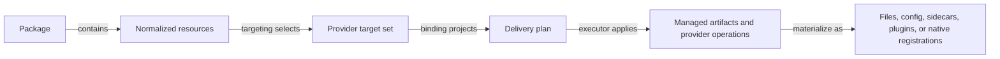

# Separate Package Resource Semantics from Provider Delivery

## Summary

RoboRepo already has the right top-level package shape: a package owns metadata, dependencies, and a heterogeneous `resources[]` array. The missing architectural boundary is lower down. Package resources such as skills, hooks, MCP registrations, rules, and harness config currently imply too much about how a provider stores or applies them.

That assumption is tolerable while Claude Code and Codex expose similar loose-file and config surfaces. It becomes fragile for providers that package several behaviors into a native plugin, extension, or other provider-owned unit. Adding those providers directly to the current model would encourage more resource-type branches, storage-mode flags, and provider-specific exceptions in shared package code.

This plan introduces an explicit **provider delivery binding** between package resource semantics and provider-specific materialization. A provider receives all package resources targeted to it, then produces a serializable delivery plan. That plan may preserve a one-resource-to-one-artifact mapping, split one resource across several artifacts, or combine several resources into one provider-native delivery unit.

The baseline deliberately does **not** redesign package manifests or rename `resource` to `contribution`. Existing `resources[]` remain the semantic unit RoboRepo understands. The goal is to make provider delivery flexible before more providers are added.

## Context

The package and harness systems already contain most of the ingredients needed for this separation:

- `scripts/cli/package-catalog.mjs` normalizes packages with heterogeneous `resources[]`.
- The package resource vocabulary currently includes `skill`, `slash-command`, `rules`, `hooks`, `permissions`, `mcp`, `plugin`, `service`, `cli-command`, `harness-config`, `runtime-asset`, and provider-specific types.
- `scripts/harnesses/provider-manifest.schema.json` declares provider paths, capabilities, detection rules, and provider-specific extensions.
- `scripts/harnesses/contract.mjs` validates both provider capabilities and the adapter methods those capabilities require.
- Claude and Codex already hide provider-specific config formats and storage details behind adapter code.
- `scripts/test/delivery-synthetic-provider-check.mjs` proves that artifact delivery can discover a synthetic provider instead of relying on a fixed provider list.

Two existing backlog plans are adjacent but do not own this boundary:

| Plan                                            | Owns                                       | Relationship to this plan                                                                                           |
| ----------------------------------------------- | ------------------------------------------ | ------------------------------------------------------------------------------------------------------------------- |
| `harness-capability-derived-resource-targeting` | Which providers should receive a resource  | Targeting happens before provider delivery; this plan consumes that decision and does not replace its resolver work |
| `antigravity-cli-provider-integration`          | Retiring Gemini and adding Antigravity CLI | Antigravity should use this delivery boundary before its provider implementation commits to loose-file delivery     |

The Antigravity plan already identifies its native plugin system as a possible better delivery target because a plugin can bundle skills, hooks, rules, MCP, and subagents. That is the concrete case this architecture must support without making `plugin` the universal meaning of a RoboRepo package.

## Goals

- Keep **Package** as RoboRepo's ownership, dependency, enable/disable, and distribution boundary.
- Keep existing **package resources** as the semantic units RoboRepo can validate and reason about.
- Separate **what a resource means** from **how a provider materializes it**.
- Allow one-to-one, one-to-many, and many-to-one mappings between package resources and provider artifacts.
- Give each provider one package-delivery entry point that receives the provider-targeted resource set together, so a plugin-oriented provider can aggregate resources.
- Keep provider delivery plans serializable and inspectable for dry-run, doctor, CLI, and HTTP consumers.
- Preserve the static trusted provider registry; package manifests must not gain arbitrary executable module or function references.
- Preserve Claude and Codex installed behavior while moving ownership of provider-specific projection behind the new boundary.
- Make a future provider addition primarily a provider manifest plus provider binding implementation, not a sweep through package core.

## Non-Goals

- Renaming `resources[]` to `contributions[]` or introducing a second semantic layer with the same purpose.
- Designing a universal ontology for every possible agent-harness feature.
- Reclassifying MCP as a generic tool protocol or hooks as a generic lifecycle ontology in this baseline.
- Implementing Antigravity, DeepSeek, Pi, Hermes, Grok, or another new provider.
- Replacing the targeting work in `harness-capability-derived-resource-targeting`.
- Delaying that plan's independent Codex permission-security fix; its per-command `ask` work can proceed separately.
- Making provider adapters loadable from arbitrary workspace code. The trusted static registry remains the execution boundary.
- Removing every legacy package compatibility shape, including derived `components`, in the same change.
- Making the current provider-native `plugin` resource portable. Existing behavior remains compatible while future plugin-based delivery is modeled below the semantic resource layer.

## Current State

### Packages already contain semantic resources

`package.config.json` already uses the structure this plan wants to preserve:

```json
{
  "id": "technical-writing",
  "resources": [
    {
      "type": "skill",
      "id": "technical-writing",
      "source": "skills/technical-writing",
      "invocation": "manual",
      "entrypoints": [
        {
          "type": "slash-command",
          "name": "technical-writing",
          "harnesses": ["claude", "codex", "gemini"]
        }
      ]
    }
  ]
}
```

`normalizePackage()` in `scripts/cli/package-catalog.mjs` normalizes those resources and currently derives a `components` compatibility view from them. The baseline therefore does not need a new package container or a new resource collection.

### Resource semantics and provider mechanics are still coupled

`normalizeResource()` knows which capability a resource needs and, for several resource kinds, validates explicit harness targets. Separately, `validateCapabilityAdapters()` in `scripts/harnesses/contract.mjs` treats a provider capability as a promise that a fixed adapter group and method set exists.

That makes a single `capabilities` declaration do more than one job:

1. describe a semantic feature the harness supports;
2. imply that RoboRepo supports a particular operation for that feature;
3. imply a particular adapter shape for delivering it.

Those meanings line up for Claude and Codex because the provider abstraction was built from their conventions. They do not need to line up for a provider whose native extension unit is a plugin containing several resource kinds.

### Provider-specific storage is already emerging

Claude and Codex demonstrate that equal semantics do not imply equal storage:

| Semantic feature          | Claude                          | Codex                           |
| ------------------------- | ------------------------------- | ------------------------------- |
| root config               | JSON                            | TOML                            |
| hooks                     | embedded in root config         | dedicated JSON sidecar          |
| MCP                       | native CLI plus sidecar JSON    | TOML table                      |
| rules / skills / commands | provider-specific managed paths | provider-specific managed paths |

Those differences currently fit behind feature-specific adapter groups and `extensions.roborepo` storage metadata. Adding more provider-specific storage modes is workable, but it does not solve the larger case where a provider wants to combine several resources into one native unit.

## Proposed Design

### Concept model

| Term                              | Meaning                                                                                                               | Status                                                                     |
| --------------------------------- | --------------------------------------------------------------------------------------------------------------------- | -------------------------------------------------------------------------- |
| **Package**                       | RoboRepo ownership, dependency, enable/disable, and distribution boundary                                             | Existing                                                                   |
| **Package resource**              | A semantic thing RoboRepo understands, such as a skill, hook set, MCP registration, rules fragment, or harness config | Existing                                                                   |
| **Provider target set**           | The resources from one package that should apply to one provider                                                      | Existing behavior; targeting policy is owned by the related targeting plan |
| **Provider delivery binding**     | Provider-owned projection from a package's target resource set to a delivery plan                                     | New                                                                        |
| **Delivery plan**                 | Serializable description of the provider-specific changes required for that package                                   | New                                                                        |
| **Delivery action**               | One inspectable unit of work in a delivery plan                                                                       | New                                                                        |
| **Provider-native delivery unit** | A provider concept such as a plugin or extension that may contain several RoboRepo resources                          | Provider-specific; not a new universal package kind                        |



The important boundary is `Provider target set -> Delivery plan`. Core package code decides package lifecycle and resource semantics. Provider code decides how those resources become native provider state.

### Provider binding works at package scope

The binding must receive the **whole target resource set for a package**, not one resource at a time. That is what permits aggregation.

Conceptual JavaScript contract:

```js
function planPackageDelivery({ pkg, resources, provider, context }) {
  return {
    packageId: pkg.id,
    providerId: provider.id,
    resources: resources.map(resourceKey),
    actions: [],
  };
}
```

The exact function and field names may follow local conventions during implementation, but the following invariants are required:

- the planner does not mutate the filesystem;
- the result is serializable;
- every action identifies which resource or resources it satisfies;
- unsupported semantic resources are reported explicitly rather than silently skipped;
- a provider may emit multiple actions for one resource;
- one action may claim multiple resources;
- the plan can be generated for install, update/repair, inspect/dry-run, and withdraw without changing the package manifest.

This batch contract is the architectural requirement. A per-resource callback alone is insufficient because it would make provider-native bundling an awkward special case later.

### Delivery actions are inspectable, not arbitrary executable references

The first implementation should define the smallest action vocabulary needed to represent current RoboRepo delivery. Do not create a speculative universal action language.

The expected baseline categories are:

| Action category    | Intended use                                                                                    |
| ------------------ | ----------------------------------------------------------------------------------------------- |
| managed path       | copy/render/link a RoboRepo-owned file or directory to a provider path                          |
| config mutation    | merge or remove RoboRepo-owned config from a provider-controlled config surface                 |
| provider operation | invoke a named operation implemented by the statically registered provider adapter              |
| native bundle      | install, update, or remove a provider-native plugin/extension that claims one or more resources |

A `provider operation` or `native bundle` action may name an operation understood by that provider adapter, but the package manifest cannot supply a module path, function name, or executable JavaScript. The static adapter registry remains the trusted code boundary.

The delivery-plan validator should reject:

- missing package or provider identity;
- actions that claim no resources;
- resource claims for resources not present in the provider target set;
- unknown action categories;
- provider operations not declared by the registered provider binding;
- unsafe target paths where the action type requires a managed path.

### Capabilities describe support; delivery binding describes RoboRepo implementation

Keep the provider manifest schema stable in this baseline. Do not introduce a provider-manifest v2 solely to rename fields.

Instead, split the meaning internally:

- resource-facing capabilities such as `skills`, `hooks`, `mcp`, `rules`, and `package-config` describe semantic support;
- operational capabilities such as telemetry and session operations continue to validate their existing adapter contracts;
- package-resource delivery is validated through the new provider delivery binding rather than by assuming every semantic capability requires one universal low-level adapter shape.

This means `validateCapabilityAdapters()` must stop treating package resource support as proof that a fixed feature-specific delivery method exists. Existing feature-specific helpers can remain and can be composed by the Claude/Codex delivery planners. The change is ownership, not a forced rewrite of working parsers and mergers.

A later schema plan may choose to separate manifest `features` and `operations` explicitly after several providers validate the distinction. This baseline should first prove the behavior without a migration whose only purpose is naming.

### Existing provider adapters compose, rather than disappear

Claude and Codex already own useful execution logic for root config, hooks, permissions, MCP, telemetry, and transcripts. The new delivery binding should compose those helpers instead of porting their parsing and merge behavior again.

The intended shape is:

```text
shared package lifecycle orchestration
  -> provider delivery planner
       -> existing provider helpers
       -> normalized serializable actions
  -> shared delivery executor
```

Provider planners should be small orchestrators. Parsing, merge math, rendering, and other single-purpose execution helpers stay in focused modules, consistent with the repo's orchestrator/execution separation.

### Existing `plugin` resources remain compatible

The current package resource vocabulary includes `plugin`. That type represents a provider-native package concept today and is not evidence that every provider should expose plugins as a universal semantic resource.

For this baseline:

- preserve existing `plugin` package behavior;
- permit a provider binding to use a native plugin as the delivery unit for _other_ semantic resources;
- do not require package authors to rewrite a portable skill/hook/MCP package as a plugin package merely because one provider delivers it that way;
- defer any rename of the existing provider-specific `plugin` resource to a later compatibility cleanup if the distinction becomes confusing in practice.

Example:

```text
RoboRepo package
  skill: review
  hooks: post-edit
  mcp: playwright

Claude delivery
  skill directory
  settings.json hook merge
  MCP registration

Plugin-oriented provider delivery
  one native plugin containing all three resources
```

The package remains one package and the semantic resources remain the same in both cases.

## Happy Path

1. The package catalog reads and normalizes a package exactly as it does today.
2. Existing targeting logic selects the resources applicable to each enabled provider. When the related targeting plan lands, its capability-derived resolver supplies this step without changing the delivery contract.
3. Core package orchestration passes one provider the complete target resource set for that package.
4. The provider delivery binding returns a validated, serializable delivery plan.
5. Dry-run and inspect consumers can render the plan without mutating provider state.
6. The package lifecycle executor applies the plan through shared managed-path/config executors and registered provider operations.
7. Update/repair regenerates the plan from current package/provider state rather than replaying hidden provider-specific side effects.
8. Withdraw generates the inverse provider delivery intent and removes only RoboRepo-owned state.
9. Doctor and tests can assert that every targeted resource is either claimed by a delivery action or reported unsupported.

## Required Invariants

- A resource that targets a provider must never disappear silently between targeting and delivery.
- A provider binding must explicitly claim or reject every resource in its target set.
- Package manifests remain declarative and cannot point at executable adapter code.
- Provider-specific delivery mechanics stay behind the trusted provider boundary.
- Provider planning is side-effect free.
- A delivery plan is serializable so CLI, HTTP, dry-run, tests, and future UI surfaces can observe the same intent.
- Install, update/repair, inspect/dry-run, and withdraw must not each invent a separate provider mapping.
- Existing Claude/Codex installed output must remain behaviorally equivalent through the migration.
- A provider may combine several resources into one native delivery unit without changing the package's semantic manifest.
- The targeting resolver and delivery planner remain separate responsibilities.

## Implementation Plan

### Phase 1 — Characterize the current package-delivery contract

- [ ] Add characterization coverage for a package that exercises more than one provider-facing resource kind in the same package.
- [ ] Pin current Claude and Codex targets and rendered/merged output before changing orchestration.
- [ ] Record which current package lifecycle paths perform install, update/repair, inspect/dry-run, and withdraw so the new planner has one explicit caller set.
- [ ] Extend the synthetic-provider coverage to fail when a targeted resource is not claimed by any delivery path, not only when a provider id is absent from a loop.

### Phase 2 — Introduce shared delivery-plan primitives

- [ ] Add a shared package-domain module under `modules/` for delivery-plan construction and validation rather than adding more multi-consumer logic to `scripts/cli/`.
- [ ] Define stable resource keys so plan actions can claim normalized resources without relying on object identity.
- [ ] Define the minimal serializable delivery-plan envelope and action categories required by current delivery behavior.
- [ ] Add validation for package/provider identity, resource claims, action shape, and unsupported-resource reporting.
- [ ] Keep exported utilities as named ESM exports and keep orchestration separate from parsing/render/merge helpers.
- [ ] Add focused tests for delivery-plan validation and resource-claim completeness.

### Phase 3 — Add the provider delivery-binding contract

- [ ] Add one package-level delivery planner to the trusted provider adapter contract.
- [ ] Pass the planner the provider-targeted resource set as a batch.
- [ ] Keep existing feature-specific adapter helpers available for planner composition.
- [ ] Adjust capability-contract validation so semantic package-resource support is no longer coupled to one fixed low-level adapter method shape.
- [ ] Preserve current operational adapter validation for telemetry/session capabilities that are not package resources.
- [ ] Reject a registered provider that advertises package-resource support but has no valid delivery binding for those resources.

### Phase 4 — Migrate Claude and Codex without behavior changes

- [ ] Implement Claude's delivery planner by composing its existing rules, skills, commands, hooks, permissions, MCP, and root-config helpers.
- [ ] Implement Codex's delivery planner the same way without copying TOML or hook merge logic into the planner.
- [ ] Route package lifecycle orchestration through delivery plans for Claude and Codex.
- [ ] Keep `scripts/cli/package-catalog.mjs`'s public catalog behavior stable; extract shared package-domain logic rather than making CLI modules the owner of new HTTP-consumable behavior.
- [ ] Preserve the derived `components` compatibility view until all consumers are confirmed migrated.
- [ ] Verify enable, update/repair, dry-run/inspect, disable/withdraw, and repeated idempotent application.

### Phase 5 — Prove a plugin-oriented provider shape synthetically

- [ ] Add a synthetic provider fixture whose binding takes at least two semantic resources and emits one native-bundle delivery action.
- [ ] Assert core package orchestration needs no new branch for that provider.
- [ ] Assert the single action claims both resources and that doctor/inspection sees neither resource as dropped.
- [ ] Assert the synthetic provider can choose loose artifacts for one package and a native bundle for another without changing package schema.

This phase validates the abstraction without adding a production provider.

### Phase 6 — Reconcile adjacent backlog work

- [ ] Update `harness-antigravity-cli-integration.md` so provider implementation depends on this plan and re-evaluates native plugin delivery before committing to loose-file paths.
- [ ] Keep `harness-capability-derived-resource-targeting.md` responsible for provider selection; update wording only where needed to describe delivery as the next stage.
- [ ] Remove obsolete provider-specific delivery assumptions exposed by the migration, but leave broad package-schema cleanup to a separate plan.

## Validation

Use the smallest existing checks while developing, then run the full suite because this is a cross-cutting package/provider refactor.

```text
npm run test:packages
npm run test:package-catalog-harness
npm run test:package-lifecycle
npm run test:harness-registry
npm run test:harness-package-config-roundtrip
node scripts/test/delivery-synthetic-provider-check.mjs
npm test
```

Acceptance criteria:

- [ ] Existing package manifests remain schema-compatible; no package is forced to rename `resources`.
- [ ] Claude and Codex characterization tests show no unintended delivery/output changes.
- [ ] Every provider-targeted resource is claimed by a delivery action or explicitly reported unsupported.
- [ ] A synthetic plugin-oriented provider can combine multiple resources into one delivery action.
- [ ] Adding that synthetic provider requires no provider-id branch in shared package orchestration.
- [ ] Delivery plans are serializable and can be inspected without performing writes.
- [ ] Repeated install/update remains idempotent.
- [ ] Withdraw removes only RoboRepo-owned state.
- [ ] Existing package targeting behavior remains unchanged unless the related targeting plan lands concurrently.
- [ ] Full `npm test` passes.

## Risks

| Risk                                                            | Mitigation                                                                                                             |
| --------------------------------------------------------------- | ---------------------------------------------------------------------------------------------------------------------- |
| The delivery-plan layer becomes a second package schema         | Keep it runtime/internal and derived from normalized package resources; package manifests remain source of truth       |
| Action vocabulary becomes an over-generalized mini build system | Start with only the action categories needed by current behavior plus the synthetic native-bundle proof                |
| Provider planners duplicate existing parser/merge logic         | Make planners orchestration-only and compose current focused adapter helpers                                           |
| The new boundary accidentally merges targeting with delivery    | Require planners to receive an already-targeted resource set; provider selection stays outside                         |
| `plugin` terminology becomes ambiguous                          | Preserve the current resource for compatibility, but call provider bundling a native delivery unit in the new contract |
| A provider silently drops resources it cannot map               | Validate resource-claim completeness and require explicit unsupported results                                          |
| Refactor expands into a provider-manifest schema migration      | Keep manifest shape stable for this baseline and revisit `features` vs `operations` only after real provider evidence  |

## Open Questions

No decision here should block the first four phases. Two naming/API choices can be settled against the code while implementing:

1. **Delivery action names.** Use the smallest vocabulary that faithfully represents the characterized Claude/Codex paths; do not lock the names in from this plan's illustrative categories.
2. **Compatibility lifetime for `components`.** Remove the derived compatibility view only after repository search confirms no remaining consumer. If that cleanup is larger than mechanical removal, create a separate follow-up instead of expanding this foundational plan.
