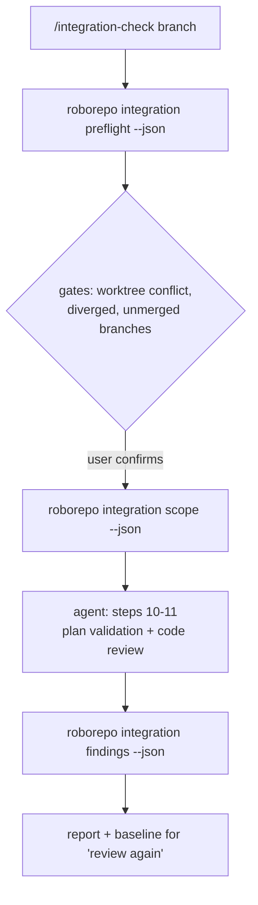

# Integration Check: Move Deterministic Work Out of the Agent

## Summary

`/integration-check` (package `integration-check`) currently runs entirely inside the agent: it
issues shell commands, reads their output, and reasons about the result. Much of that work is not
fuzzy. Whether a branch is merged, whether the tree is clean, which plan docs match the changed
files, whether a plan's frontmatter is valid for its lifecycle folder — all have exactly one
correct answer computable without a model.

This plan moves that work into repository commands, leaving the agent to orchestrate and to do the
genuinely fuzzy part: judging whether code matches documented intent, and whether it is any good.

## Context

The skill shipped as Phase 1 in `globals/packages/integration-check/skills/integration-check/`.
It is deliberately LLM-driven so the workflow could be used immediately and its steps validated
against real branches before being frozen into code. This plan is the follow-up.

Two failures from the session that produced the skill motivate it directly:

- **Merged-branch detection was reported wrong.** `git merge-base --is-ancestor` and `git cherry`
  were used to test whether three branches were merged. Both answer *identity*, not *content*, so
  all three were reported as holding unmerged work when in fact every line had been squash-merged
  into the base branch. The correct procedure — ancestry first, content comparison when ancestry
  is inconclusive — is now written into the skill as prose. Prose is exactly the wrong medium for
  a rule with one right answer.
- **Plan lifecycle inconsistencies were found by hand**, and only the ones that happened to be
  looked at. An active plan with an empty `next_action` is a schema violation that
  `modules/plan-docs/lifecycle-policy.mjs` can already detect mechanically.

The general principle: an agent re-deriving a deterministic fact each run will eventually derive
it differently. Deterministic facts belong in code, where they are computed once, tested, and
identical every time.

## Relationship to the plan-lifecycle suite

[[plan-lifecycle-suite-workflow-navigation]] (Suite 04) adds `integration` and `review` as
first-class lifecycle states, with ephemeral integration branches created during Wrap Up and a
closeout controller that owns the deterministic Git work. The two plans converge, and the ordering
matters:

- **Suite 04's Phase 1 lands `manifests/platform/plan-lifecycle.json`.** Once it exists, this
  plan's `scope` command must read in-flight lifecycle states from the manifest instead of
  hardcoding `docs/plans/active/` — otherwise plans that moved to `integration/` or `review/`
  become invisible to the workflow that exists to check them.
- **Suite 04's closeout controller and this plan's commands are the same kind of thing:**
  deterministic Git operations extracted out of agent prose. They should share modules rather than
  each grow their own. Whichever lands first should be written to be called by the other.
- **The two-tier merged test is needed by both.** Suite 04's Confirm Merge deletes worktrees and
  branches after verifying the work reached `main`; a false negative there destroys the only
  working copy of merged work. That raises the priority of extracting the test into tested code
  from "avoid a repeated mistake" to "prevent data loss."

Neither plan blocks the other. This plan can deliver Phases 1–4 against the current four-folder
lifecycle, and gains manifest-driven discovery when Suite 04 Phase 1 lands.

## Goals

- Every step of the integration-check workflow with exactly one correct answer is computed by a
  repository command, not by the agent.
- The agent receives structured data (JSON) and spends its context on judgment, not on parsing
  shell output.
- The deterministic parts are covered by the repository's own test suite, so they can regress
  loudly instead of silently.
- The skill keeps working end-to-end at every phase — no phase leaves it half-migrated.

## Non-goals

- Automating the code review itself. Steps 11 and 12 of the skill are irreducibly fuzzy.
- Automating gate decisions. Every user confirmation in the skill stays a user confirmation;
  determinism is about computing *facts*, not about removing consent.
- Committing, pushing, or deleting anything. The skill's "Never" list is unchanged by this plan.
- A general-purpose git-workflow engine. Scope is this workflow.

## Current state

The whole workflow is agent-driven. Relevant existing infrastructure that this plan should build
on rather than duplicate:

| Existing | Location | Reusable for |
| --- | --- | --- |
| `buildPlanSnapshot`, `parsePlanMarkdown`, `readPlanDocument` | `modules/plan-docs/index.mjs` | Reading and structuring active plans |
| `validateForLifecycle`, `describeDocument` | `modules/plan-docs/lifecycle-policy.mjs` | Detecting lifecycle/frontmatter inconsistencies |
| `finding`, `sortBySeverity`, `messagesOf` | `modules/plan-docs/findings.mjs` | A findings shape that already exists — reuse it rather than inventing a second one |
| `roborepo plans repair <root>` | `scripts/cli/` | Precedent for a plans-namespace command |

## Step classification

Every step of the current `SKILL.md`, classified by whether it can be computed.

| # | Step | Class | Notes |
| --- | --- | --- | --- |
| 1 | Preflight (clean tree, record start point) | **Deterministic** | `git status --porcelain` parse; pure fact |
| 2 | Locate branch / worktree conflict detection | **Deterministic** detect, **fuzzy** resolve | Detecting the conflict and reporting what a worktree holds is computable; choosing what to do stays a gate |
| 3 | Fetch + checkout in main working tree | **Deterministic** | Includes resolving which worktree is the main one |
| 4 | Sync from own remote | **Deterministic** detect | Ahead/behind/diverged is a computation; the diverged response stays a gate |
| 5 | Merge base into integration | **Deterministic** detect | "Is it behind" is computable; conflict resolution is never automated |
| 6 | Worktree audit (merged status) | **Deterministic** | The two-tier ancestry-then-content test. Highest-value target: this is where the agent got it wrong |
| 7 | Scope the diff | **Deterministic** | Commit list + changed file set |
| 8 | Regressions | **Deterministic** | Test-command discovery and execution. Runs before the fuzzy steps and gates them: a red suite means the reviewed code is about to change |
| 9 | Select relevant plans | **Deterministic** | Match plan docs against changed paths; also the lifecycle-consistency checks |
| 10 | Validate plans against code | **Fuzzy** | Requires reading code and judging whether a claim holds |
| 11 | Single-pass code review | **Fuzzy** | The actual reason a model is involved |
| 12 | Findings report | **Fuzzy** content, **deterministic** shape | Severity ranking and `file:line` structure can be schema-enforced |
| 13 | Persist baseline / "review again" diff | **Deterministic** | Storing findings and diffing two runs by stable id is bookkeeping |

Eight of thirteen steps are fully or mostly deterministic.

## Proposed design

Three commands, each emitting JSON for the agent and human-readable text for a person.



### `roborepo integration preflight <branch> [--base <branch>] [--json]`

Covers skill steps 1–6. Computes and reports, **without mutating anything**:

- working tree cleanliness, with the offending paths
- the main working tree path vs. linked worktrees
- whether the target branch is held by a linked worktree, and that worktree's full state
  (uncommitted files, unpushed commits, stashes) so a removal prompt can show real consequences
- ahead/behind/diverged against the branch's own remote
- ahead/behind against the base branch
- for every worktree branch, merged status via the two-tier test

Mutations (fetch, checkout, merge) stay with the agent behind their gates, or move to an explicit
`--apply` flag in a later phase. Read-only by default is what makes this safe to run repeatedly.

**The two-tier merged test is the core of this command:**

```text
merge-base --is-ancestor  ->  exit 0  =>  merged        (proof; stop)
                              exit 1  =>  inconclusive  (NOT "unmerged")
                                          |
                                          v
                          content comparison => merged | unmerged | behind
```

Encoding this once, in tested code, is the single highest-value item in this plan.

### `roborepo integration scope <branch> [--base <branch>] [--json]`

Covers steps 7 and 9 (step 8, the regression suite, sits between them and is not part of this
command). Emits the commit list, the changed-file set, and the subset of active plan docs
whose subject matter intersects those files — plus any lifecycle findings on those plans, reusing
`validateForLifecycle` rather than reimplementing the schema.

Plan relevance matching starts simple (path and identifier overlap between the plan's referenced
paths and the changed files) and must report *why* a plan was selected, so a wrong match is
visible rather than silent.

### `roborepo integration findings <subcommand>`

Covers step 13. Stores a findings set keyed by stable id + `file:line`, and diffs two runs into
resolved / still-open / newly-introduced. Reuses `modules/plan-docs/findings.mjs` shapes.

This is what makes "review again" cheap: without it, the agent re-derives the entire baseline from
its own context every time, which is both expensive and unreliable across a compaction boundary.

## Implementation plan

Phased so the skill works end-to-end after every phase.

- [ ] **Phase 1 — `integration preflight`.** Git-state facts as JSON, read-only. Includes the
      two-tier merged test as a tested unit. Update `SKILL.md` steps 1–6 to call it and interpret
      the result instead of issuing raw git commands.
- [ ] **Phase 2 — `integration scope`.** Commit/file scope plus relevant-plan selection and
      lifecycle findings. Update `SKILL.md` steps 7 and 9. Read in-flight lifecycle states from
      `manifests/platform/plan-lifecycle.json` when it exists (Suite 04 Phase 1), falling back to
      the four-folder layout when it does not.
- [ ] **Phase 3 — `integration findings`.** Persistence and run-to-run diffing. Update `SKILL.md`
      steps 12–13 and define the findings JSON schema the agent must emit.
- [ ] **Phase 4 — test-command discovery.** Extract the "discover the repo's own test command"
      heuristic (currently prose in `SKILL.md` and duplicated in other skills) into one shared
      helper, and have step 8 call it.
- [ ] **Phase 5 — trim the skill.** With phases 1–4 landed, delete the prose that described the
      now-deterministic procedures. The skill should shrink substantially; a step that reads
      "call this command and interpret the JSON" needs no procedure text.

## Validation

- [ ] Each command has a fixture-driven check under `scripts/test/`, following the existing
      naming convention, wired into `package.json` and the suite runner.
- [ ] The two-tier merged test is covered by fixtures for every case that matters:
      ancestor-merged, squash-merged, genuinely unmerged, branch-behind-integration, and a branch
      with no relationship to the integration branch. **The squash case is the regression this
      plan exists to prevent** — it must fail loudly if the content fallback is removed.
- [ ] `preflight` mutates nothing: verify by running it against a dirty tree and confirming the
      tree is byte-identical afterward.
- [ ] `scope` selects the right plans for a known diff, and reports its reason for each.
- [ ] `findings` round-trips a set and correctly classifies resolved / open / new across two runs.
- [ ] The skill still completes end-to-end on a real integration branch after each phase.

## Risks

- **Premature freezing.** The workflow has been exercised on one repository. Encoding a step in
  code makes it harder to change than prose. Mitigation: phase it, and only encode steps whose
  shape has stopped changing in practice.
- **Repository-specific assumptions leaking into shared commands.** The skill is explicitly
  repository-agnostic; the commands must stay so. Base-branch and test-command discovery are the
  likely leak points, and both need fixtures for a repository that does not look like this one.
- **A second findings format.** `modules/plan-docs/findings.mjs` already exists. Inventing a
  parallel shape would leave two similar schemas that drift.
- **Over-automation of consent.** Gates exist because the destructive options are irreversible.
  Computing a fact must never become deciding on the user's behalf.

## Open questions

- Should `preflight` gain an `--apply` mode that performs the fetch/checkout/merge it currently
  only reports on, or do mutations stay with the agent so every one passes through a gate?
- Should plan-relevance matching in `scope` stay path-based, or use the plan's declared `related`
  and `depends_on` frontmatter as an additional signal?
- Where should the findings baseline live — a scratch directory (invisible to git, lost between
  machines) or a gitignored path inside the repository (survives, but risks being committed)?
- Does this belong in its own `integration` CLI namespace, or under the existing `plans`
  namespace? A future integration lifecycle state may pull it toward `plans`.
