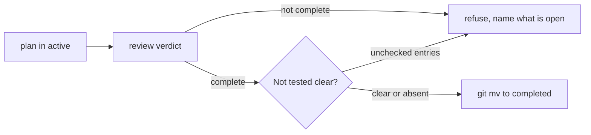

# Close Plans Out Honestly and Sweep the Repository Clean

## Summary

Two gaps meet at the same moment: the point where finished work should be put away.

A plan today can look finished and not be. `agent-config-skill-reference-compliance.md` carries 89
checked tasks and one unchecked goal, and every line of its code is merged and installed — yet three
of its central claims have never been confirmed on a real machine. Nothing in the schema can express
that difference, so a reader counting checkboxes concludes the work is done.

Nothing puts the leftovers away, either. This repository currently holds 7 worktrees and 6 branches
already merged into `main`, plus active plans whose work has landed. Each was correct while its work
was in flight; none of it has a step that removes it afterward.

The two halves are one plan because the sweep needs the closeout: a tool that moves plans to
`completed/` has to be able to tell a finished plan from one that merely has its boxes ticked.

## Goals

- [ ] Give plans a place to record what was built but never tested, distinct from what was never built.
- [ ] Make that record visible to tooling rather than readable only as prose.
- [ ] Add a `complete` mode to `plan-docs` that closes a plan out and refuses when it should not.
- [ ] Add a user-invoked `/tear-down` command that sweeps a repository for state left behind by finished work.
- [ ] Leave every destructive action confirmed, reversible in intent, and never able to discard unmerged work.

## Non-goals

- Redesign the plan schema. This adds one optional section and one mode; frontmatter is unchanged.
- Build a task database, a dashboard, or a cross-repository todo surface. Markdown stays the source of truth.
- Automate the manual checks themselves. The point of the new section is that some things cannot be tested.
- Prune remote branches by default, or touch any branch that is not merged.
- Replace `/wrap-up`. That is session closeout; this is post-merge teardown.

## Current State

### A plan cannot say "built but unproven"

`references/plan-schema.md:171` requires a `Verification` section on completed plans, holding
"evidence the work was checked, or an explicit statement of what was not verified." That is the only
mention of unverified work in the entire skill, and it is phrased as a completed-plan requirement —
so nothing asks for it while the work is happening, which is when the reason is still known.

The consequence is visible in the plan that prompted this one:

| Signal | Value |
| --- | --- |
| Checked tasks | 89 |
| Unchecked tasks | 1 |
| Claims never confirmed on a machine | 3 |

The three unconfirmed claims — that the reported line renders a reference tally, that a compacted
turn degrades to "observation unavailable", and that Codex honors `additionalContext` on
`PostToolUse` — live in a `### Not verified` prose section. No validation reads it, no checkbox
represents it, and its entries have no lifecycle: one of them asserted the hooks were not installed
for several hours after they were.

### The section absorbs unlike things

That same section currently holds four bullets of three different kinds: one already false, one a
finding discovered and corrected during the work, one an out-of-scope limitation, and one a genuine
outstanding check. They behave differently — two should never be cleared, one should block closeout,
one should have been deleted — but a single prose heading makes them indistinguishable.

The narrow fix is a name that says what it means and a form tooling can read. The broad fix is a
taxonomy, and this plan deliberately does not attempt one.

### Nothing removes finished work

Measured at `reviewed_commit`:

| Leftover | Count |
| --- | --- |
| Worktrees | 7 |
| Local branches merged into `main` | 6 |
| Plans in `active/` | 5 |

`plan-start` creates a worktree and a branch. `plan-docs` has workflows for create, start, next,
sync, review, validate, and handoff. None of them removes a worktree, deletes a merged branch, or
moves a finished plan to `completed/`. Closeout is entirely manual, which is why the leftovers
accumulate.

### `review` decides, but does not act

`references/workflow-review.md` already judges whether a plan is complete, incomplete, blocked, or
superseded. It stops at the judgment. That assessment is the right input for a completion mode, and
this plan reuses it rather than writing a second definition of "finished".

## Proposed Design

### 1. Rename the section to `Not tested`, and give it checkboxes

`Not verified` reads as "we did not confirm this" and has attracted anything that is not a completed
task. `Not tested` says the narrower, truer thing: the work exists and no test covers it.

Entries become checkboxes so a completion gate can read them:

```markdown
## Not tested

- [ ] The reported line renders a per-skill reference tally. Requires a live session; no test can assert what an agent writes.
- [ ] A compacted turn degrades to "observation unavailable" rather than a wrong tally.
- [ ] Codex honors `additionalContext` on `PostToolUse`. Shipped on binary-schema evidence, never confirmed in a live Codex session.
```

Each entry states what to check and why a test cannot. The section is optional: a plan with full
coverage has nothing to list.

### 2. Write entries when the gap appears, not at closeout

`plan-schema.md` should say when these are written, not only that completed plans need them. The
rule: **record an entry the moment you know something will not be tested** — a check skipped, an
assumption not exercised, a claim resting on indirect evidence.

Written late, an entry loses its reason. The plan that prompted this one recorded a suite failure as
"standing" twice, naming a different assertion each time, because both notes were written from
memory of an earlier run rather than at the moment of observation. Both were wrong and both needed
correction commits.

### 3. Add a `complete` mode to `plan-docs`

A new `complete` mode and `references/workflow-complete.md`, registered in the mode/reference matrix.

Sequence:

1. Load `references/workflow-review.md` and take its verdict. Do not restate its criteria.
2. Refuse when the verdict is anything but complete, naming what is outstanding.
3. Refuse when `## Not tested` holds unchecked entries, listing them.
4. Move the file to `docs/plans/completed/` with `git mv`, preserving the stable `id`.
5. Update `next_action` to describe the closed state instead of a stale instruction.

The refusal in step 3 is the reason this mode exists. A plan whose boxes are ticked and whose manual
checks are not is exactly the plan that gets closed by mistake.



### 4. Add `/tear-down`

A skill invoked only as the slash command `/tear-down`, never model-invoked: it removes worktrees and
branches, and that is not a decision to make on inference. Bare invocation with no argument is the
normal path, and it enumerates everything eligible.

Survey first, act second. One report, one approval, then execution:

| Candidate | Eligible when |
| --- | --- |
| Worktree | Its branch is merged into the default branch |
| Local branch | Merged into the default branch, not the default branch, not checked out |
| Plan in `active/` | The `complete` mode from §3 would accept it |
| Stale plan state | `blocked_by` names a completed plan, or a plan's branch and worktree are both gone |

Safety rules, before any removal:

- The branch is merged into the default branch.
- The worktree has no uncommitted or untracked changes.
- The branch is not ahead of its remote.

A failed check skips that item and reports why. Never force, never stash, never discard. Remote
branch deletion is confirmed separately from the local sweep because it is outward-facing.

Plan closeout delegates to the `complete` mode rather than reimplementing the assessment — one
definition of finished, in the skill that owns lifecycle.

### 5. Report identifiers together

Branches follow `plan-<id>-<slug>` and the matching plan carries `id: <id>` in frontmatter, so a
worktree, its branch, and its plan can usually be shown on one row. Derivation is for the report's
legibility, not for deciding eligibility — anything underivable is reported as such rather than
guessed.

## Affected Repository Files

| Area | Path | Change |
| --- | --- | --- |
| Plan schema | `globals/packages/plan-docs/skills/plan-docs/references/plan-schema.md` | Define `## Not tested`, its checkbox form, and when entries are written |
| Mode matrix | `globals/packages/plan-docs/skills/plan-docs/SKILL.md` | Register the `complete` mode and its references |
| Completion workflow | `globals/packages/plan-docs/skills/plan-docs/references/workflow-complete.md` | New — the sequence in §3 |
| Lifecycle reference | `globals/packages/plan-docs/skills/plan-docs/references/lifecycle.md` | Note that `complete` performs the active→completed move |
| Tear-down skill | `globals/packages/<package>/skills/tear-down/SKILL.md` | New — package chosen per `roborepo-support` |
| Slash command | package config | Register `/tear-down` for Claude and Codex |
| Findings | `modules/plan-docs/findings.mjs` | A finding for unchecked `Not tested` entries on a completion attempt |
| Routing coverage | `scripts/test/skill-reference-matrix-characterization-check.mjs` | The new mode must appear in the matrix |

## Implementation Plan

### Phase 1 — Define the section

- [ ] Add `## Not tested` to `plan-schema.md`: optional, checkbox entries, each stating what to check and why no test covers it.
- [ ] State when entries are written — at the moment the gap appears, not at closeout — with the reason that a late entry loses its cause.
- [ ] Keep the existing `Verification` requirement for completed plans unchanged; the new section feeds it rather than replacing it.
- [ ] Do not introduce a taxonomy of unverified-work categories. One section, one meaning.

### Phase 2 — Backfill the plan that prompted this

- [ ] Rename `### Not verified` to `## Not tested` in `agent-config-skill-reference-compliance.md`.
- [ ] Delete the entry claiming skills and hooks are not installed. It became false when `roborepo update` ran.
- [ ] Convert the rendered-line entry to a checkbox, and add the compaction and Codex-parity entries, which are unverified but currently listed nowhere.
- [ ] Leave the flaky-check finding and the two pre-existing failures as prose. They are records, not outstanding work.

### Phase 3 — The `complete` mode

- [ ] Write `references/workflow-complete.md` implementing §3, delegating the verdict to `workflow-review.md`.
- [ ] Register the mode in the SKILL.md matrix and in the compact help block.
- [ ] Emit a structured finding when `Not tested` has unchecked entries, so the refusal is machine-readable rather than prose.
- [ ] Preserve the stable `id` across the move, and use `git mv` so history follows the file.

### Phase 4 — Coverage for the gate

- [ ] Add a check that a plan with unchecked `Not tested` entries is refused, and that the finding names them.
- [ ] Add a check that a finished plan moves and keeps its `id`.
- [ ] Add a check that a plan whose review verdict is incomplete is refused before `Not tested` is even consulted.
- [ ] Confirm the matrix characterization check sees the new mode; it parses SKILL.md prose and will not otherwise.

### Phase 5 — The sweep

- [ ] Create the `tear-down` skill per `roborepo-support`, invoked only as `/tear-down`.
- [ ] Implement the survey: worktrees, merged branches, completable plans, stale plan state.
- [ ] Implement the safety checks, skipping and reporting rather than forcing.
- [ ] Delegate plan closeout to the `complete` mode.
- [ ] Confirm remote deletion separately from the local sweep.
- [ ] Re-read Git state immediately before each mutation rather than trusting the survey snapshot.

### Phase 6 — Verify against this repository

- [ ] Run `/tear-down` here, where 7 worktrees, 6 merged branches, and 5 active plans exist.
- [ ] Confirm `agent-config-skill-reference-compliance.md` is refused while its `Not tested` entries are unchecked — the case this plan exists to catch.
- [ ] Confirm no unmerged branch or dirty worktree is offered as a candidate.

## Validation

- [ ] A plan with unchecked `Not tested` entries cannot be completed, and the refusal names them.
- [ ] A plan with no `Not tested` section completes normally; the section is optional.
- [ ] A plan whose review verdict is incomplete is refused regardless of its `Not tested` state.
- [ ] A completed plan keeps its `id` and appears in `docs/plans/completed/`.
- [ ] `/tear-down` with no argument enumerates every eligible candidate rather than requiring a target.
- [ ] A dirty worktree, an unmerged branch, and a branch ahead of its remote are each skipped with a stated reason.
- [ ] `/tear-down` is registered for Claude and Codex and does not fire without the slash command.
- [ ] `roborepo skill audit --check` passes with both skill changes.

Verification commands:

```bash
npm run test:plans
npm run test:plans-findings
npm run test:skill-reference-matrix-characterization
roborepo skill audit --check
```

## Risks and Mitigations

| Risk | Mitigation |
| --- | --- |
| The sweep deletes work that only looks merged | Three independent checks — merged, clean, not ahead of remote — and a skip on any failure |
| A stale survey acts on state another session changed | Re-read Git state immediately before each mutation, not once at the start |
| `Not tested` becomes a dumping ground, as `Not verified` did | The name states one meaning, and the completion gate gives entries a cost: they block closeout until cleared |
| The completion gate blocks plans nobody can finish | Entries are for checks a human can still perform. A structurally unverifiable claim belongs in `Verification` prose, not here |
| Two definitions of "finished" drift apart | `complete` delegates to `workflow-review.md`; `/tear-down` delegates to `complete` |

## Open Questions

- Should the completion gate **block** on unchecked `Not tested` entries, or warn and allow an explicit override? Blocking is the safer default and matches the plan's purpose, but a plan whose remaining check needs hardware or another person would be unclosable without an override.
- Should `/tear-down` offer to prune worktrees whose branch is *gone* from the remote but never merged locally? That is a real leftover, but "never merged" is also what an abandoned experiment looks like.

### Squash merges break the obvious eligibility test

This repository merges pull requests by squashing, which creates a new commit on `main` rather than
replaying the branch's commits. `git branch --merged main` therefore reports a landed branch as
unmerged, and the design in §4 uses exactly that test.

Measured while removing the branch for the plan that prompted this one: 15 commits showed as absent
from `main`, while every file they touched was already there. A sweep trusting merge-base would have
refused to clean up the common case in this repository.

`refs/pull/<n>/head` settles it without heuristics and without the `gh` CLI, which is not installed
here:

```bash
git ls-remote origin 'refs/pull/8/head'
# aaa7ac00dbb7f95a0d5502f57cde55bbe0804e18  refs/pull/8/head  — the deleted branch's tip
```

A branch whose tip matches a merged PR's head has landed, whatever merge-base reports. Open
question: is matching against `refs/pull/*` sufficient on its own, or should it be one signal
alongside a content diff for repositories with no pull-request workflow at all?
