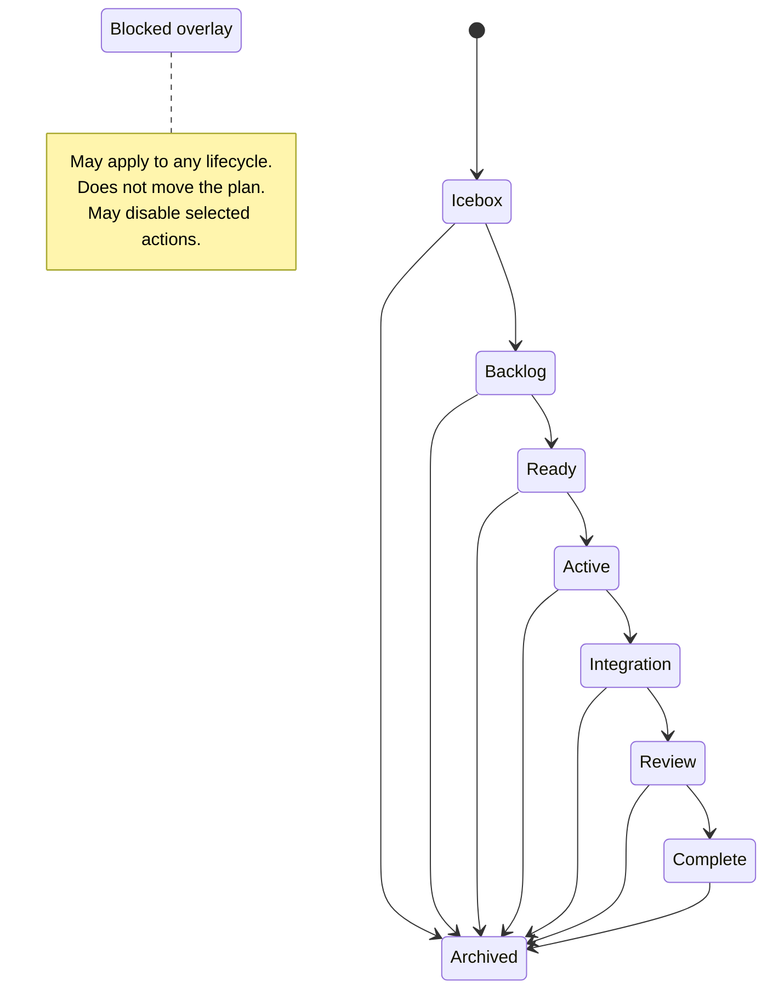

# Plan Lifecycle Suite 05 — Blockers and Dependencies

## Summary

Add first-class blocker management to Plan Docs without turning **Blocked** into a lifecycle
folder. A plan remains in its current lifecycle state while one or more unresolved blockers prevent
specific actions.

The first implementation supports two blocker sources:

- another plan in the same repository, recorded in `blocked_by`
- a free-form manual reason, recorded in `blocked_reasons`

A plan is blocked when either source contains at least one active entry. This supports both
dependency-driven blocking and the simple action “block this plan because it should not proceed”
without introducing a separate `blocked: true` flag that could disagree with the blocker details.

## Relationship to the Suite

This plan follows the workflow-and-navigation expansion because its final action-gating contract
uses the lifecycle manifest's generic `requiresUnblocked` policy. The blocker schema, parser, and
mutation work can be developed independently, but the complete feature cannot satisfy its
acceptance criteria until the manifest-backed action model exists.

Blocked remains an orthogonal condition. It never changes the plan's lifecycle folder and does not
replace Archive, Pause, Cancel, or Unclassified recovery.

## Context

Plan Docs currently derives lifecycle from the plan's folder and derives blocking only from a
non-empty `blocked_by` array. The scanner exposes that array as `plan.blockers`, the Plans portal can
filter on it, and the card/drawer status can open a read-only blocker popover.

The current implementation does not provide a supported way to:

- block a plan for a human, operational, access, or external reason
- add or remove blockers from the portal or CLI
- distinguish linked-plan blockers from free-form blockers
- atomically update frontmatter list fields
- enforce blocker-aware eligibility consistently across lifecycle actions
- validate self-references, missing plan IDs, duplicates, or circular blocker relationships

The current frontmatter parser intentionally supports scalars and simple lists only. It does not
support nested YAML objects. The first blocker model must fit that constraint rather than requiring
a new general-purpose YAML parser as an incidental dependency.

### Current touchpoints

| Area | Current behavior | Primary touchpoints |
|---|---|---|
| Schema | `blocked_by` is a simple array and blocking is derived from it | `globals/packages/plan-docs/skills/plan-docs/references/plan-schema.md`, `references/lifecycle.md` |
| Parsing | Only `blocked_by`, `depends_on`, and `related` are normalized as arrays | `modules/plan-docs/index.mjs` |
| Domain record | `blocked_by` is exposed as `plan.blockers` | `modules/plan-docs/index.mjs` |
| Mutations | Scalar priority and lifecycle moves are supported; list fields are not editable | `modules/plan-docs/index.mjs`, `scripts/cli/plans.mjs`, `scripts/cli/portal-routes-plans.mjs` |
| Filtering | The portal treats `plan.blockers.length > 0` as blocked | `portal/plans/state.js` |
| Display | A blocked badge opens a read-only popover of referenced plan IDs | `portal/plans/elements/plan-status.js`, `portal/plans/blockers-popover.js` |
| Action recommendation | Recommended Plan Docs actions are suppressed when `plan.blockers` is non-empty | `portal/plans/templates.js` |
| Tests | Blocker resolution and reverse references are covered only for plan IDs | `scripts/test/plan-docs-check.mjs`, `scripts/test/plans-portal-state-check.mjs` |

## Goals

- Model blocking as an orthogonal condition that can apply in any lifecycle state.
- Let a user block a plan without linking it to another plan.
- Preserve plan-to-plan blocker relationships by stable repository-scoped plan ID.
- Make blocker creation, editing, and removal safe through stale-state-aware domain mutations.
- Give the portal and CLI one derived blocked-state contract.
- Let lifecycle actions declare whether unresolved blockers prevent execution.
- Keep the Markdown plan file as the source of truth.
- Preserve the current simple frontmatter parser for the first implementation.
- Provide clear blocked and blocking views, including unresolved references.
- Add tests for parsing, mutation integrity, relationship validation, filtering, and action gating.

## Non-goals

- Do not add a `docs/plans/blocked/` lifecycle folder.
- Do not redesign the full lifecycle or integration-branch workflow in this plan.
- Do not add a general-purpose YAML parser solely for blocker metadata.
- Do not automatically stop an active agent session or delete worktrees when a blocker is added.
- Do not automatically remove a plan blocker when the referenced plan changes lifecycle.
- Do not create notifications, scheduled blocker checks, or cross-repository blockers in the first
  implementation.
- Do not build a full dependency graph editor in the first portal iteration.
- Do not infer blockers from code overlap, failed tests, or agent telemetry.

## Concept Model

Blocking and lifecycle answer different questions:

| Dimension | Question | Source of truth |
|---|---|---|
| Lifecycle | Where is this plan in the delivery workflow? | Folder under `docs/plans/` |
| Blocking | Is something preventing the next eligible action? | `blocked_by` and `blocked_reasons` |
| Dependency | What other plans must this work coordinate with or follow? | `depends_on` |
| Recovery | Is the file outside a recognized lifecycle folder? | Derived `unclassified` condition |

A blocker does not move the plan. It overlays the current lifecycle. This overlay is an
eligibility signal, not an execution-control command: adding a blocker to work already underway
does not stop an agent, discard changes, or remove a worktree.



### Blocker sources

```yaml
blocked_by:
  - plan-cross-harness-workflow-runner

blocked_reasons:
  - Waiting for a product decision on integration branch policy
  - Staging credentials are unavailable
```

The two fields have distinct semantics:

- `blocked_by` contains stable plan IDs from the same repository.
- `blocked_reasons` contains concise human-readable reasons that do not resolve to plan records.

The derived state is:

```js
isBlocked =
  blockedBy.length > 0 ||
  blockerReasons.length > 0;
```

There is no separate persisted `blocked` boolean.

## Proposed Design

### Frontmatter contract

Extend the recommended schema with `blocked_reasons`:

```yaml
---
id: example-plan
priority: medium
next_action: Resolve the open product decision
blocked_by:
  - prerequisite-plan
blocked_reasons:
  - Waiting for approval from the repository owner
depends_on: []
related: []
reviewed_commit:
---
```

Rules:

- Both blocker fields are optional on legacy documents and normalize to empty arrays.
- Entries must be non-empty strings after trimming.
- Duplicate entries within a field are invalid.
- `blocked_by` entries must match the plan-ID format.
- A plan cannot list its own ID in `blocked_by`.
- Plan IDs remain repository-scoped; cross-repository blocker IDs are not resolved.
- Missing referenced plans remain visible as unresolved blockers and produce validation findings.
- Manual reasons are displayed exactly as authored after whitespace normalization.
- Removing the final entry from both fields makes the plan unblocked.
- Blockers are explicitly removed. A referenced plan becoming Complete or Archived does not
  silently rewrite the blocked plan in the first implementation.
- `depends_on` remains separate. Adding a blocker does not automatically add or remove a dependency.

### Why two simple lists

A nested structure such as the following is intentionally deferred:

```yaml
blockers:
  - type: plan
    plan_id: prerequisite-plan
  - type: manual
    reason: Waiting for credentials
```

The current parser cannot read nested objects. Adding `blocked_reasons` requires only extending the
existing simple-list handling and keeps the serialized document understandable in plain Markdown.
A later schema version may migrate both lists into structured blocker records if blocker ownership,
timestamps, resolution history, or external-system IDs become necessary.

### Parsed and public record contract

Replace the ambiguous public `plan.blockers` array with explicit fields:

```js
{
  blockedBy: ["prerequisite-plan"],
  blockerReasons: ["Waiting for credentials"],
  isBlocked: true,
  blockerCount: 2
}
```

`blockerCount` is the sum of both lists. It is derived, not persisted.

All current consumers of `plan.blockers` must migrate in one change. Do not retain both
`plan.blockers` and `plan.blockedBy` as competing long-term contracts.

### Domain mutation

Add one atomic domain operation:

```js
updatePlanBlockers(snapshot, {
  id,
  key,
  repositoryId,
  mtimeMs,
  expectedBlockedBy,
  expectedBlockerReasons,
  blockedBy,
  blockerReasons
})
```

The operation must:

1. Resolve the plan by current key, then stable ID.
2. Reject stale key, modified time, or expected-list mismatches.
3. Validate and normalize both lists.
4. Reject duplicate entries and self-blocking.
5. Confirm the plan file remains inside the repository boundary.
6. Rewrite both list fields while preserving unrelated frontmatter and the Markdown body.
7. Rebuild and return the complete plan record.
8. Return the standard mutation result.

### Lifecycle action gating

The lifecycle/action manifest should support:

```json
{
  "id": "start",
  "requiresUnblocked": true
}
```

Initial policy:

| Action category | Blocked behavior |
|---|---|
| Start implementation | Disabled |
| Start Eligible / queue pickup | Excluded |
| Submit for Review | Disabled when blockers represent incomplete work |
| Confirm Merge / Complete | Disabled |
| Validate, inspect, copy prompt | Allowed |
| Add, edit, remove blockers | Allowed |
| Archive | Allowed through the archive workflow and its safeguards |

### Portal behavior

Expand the existing blocker badge and popover to show linked plans, unresolved IDs, manual reasons,
per-item removal, Add Blocker, and Clear All.

The Add Blocker flow has two modes:

1. **Plan** — search same-repository plans and store the stable plan ID.
2. **Manual reason** — require a concise non-empty reason.

### CLI and Plan Docs skill

Add:

```text
roborepo plans block <plan-id> --reason "Waiting for approval"
roborepo plans block <plan-id> --by <blocking-plan-id>
roborepo plans unblock <plan-id> --reason "Waiting for approval"
roborepo plans unblock <plan-id> --by <blocking-plan-id>
roborepo plans unblock <plan-id> --all
```

And:

```text
/plan-docs block
/plan-docs unblock
```

## Implementation Plan

### Phase 1: Schema and parser

- [ ] Add `blocked_reasons` to Plan Docs schema and lifecycle references.
- [ ] Extend array parsing and normalization.
- [ ] Replace `plan.blockers` with explicit blocker fields.
- [ ] Add parser fixtures.

### Phase 2: Relationship validation

- [ ] Validate blocker IDs.
- [ ] Detect self-blocking.
- [ ] Report missing plan IDs.
- [ ] Detect blocker cycles.
- [ ] Keep `depends_on` and `blocked_by` independent.

### Phase 3: Safe list mutations

- [ ] Implement list-field frontmatter writer.
- [ ] Implement `updatePlanBlockers`.
- [ ] Add stale-state conflict checks.
- [ ] Add `POST /api/plans/blockers`.

### Phase 4: Portal management UI

- [ ] Update state and filters.
- [ ] Expand blocker popover.
- [ ] Add Add Blocker dialog.
- [ ] Add Remove and Clear All actions.
- [ ] Add accessible keyboard and focus behavior.

### Phase 5: Lifecycle and queue integration

- [ ] Add manifest-level `requiresUnblocked`.
- [ ] Exclude blocked Ready plans from pickup.
- [ ] Explain disabled lifecycle actions.
- [ ] Keep validation, archive, and blocker management available.
- [ ] Warn when Active, Integration, or Review work becomes blocked.

### Phase 6: CLI, skills, and documentation

- [ ] Add block/unblock CLI commands.
- [ ] Add `/plan-docs block` and `/plan-docs unblock`.
- [ ] Update prompt contracts and guide examples.
- [ ] Add the blocked overlay to the lifecycle infographic.

### Phase 7: Verification

- [ ] Extend plan-docs domain tests.
- [ ] Extend portal-state tests.
- [ ] Add route tests.
- [ ] Add browser smoke tests.
- [ ] Run the full RoboRepo test suite.

## Validation

```bash
npm run test:plans
npm run test:plans-findings
npm run test:plans-portal-state
npm test
npm run pack:dry-run
```

## Acceptance Criteria

- A plan can be blocked with a free-form reason.
- A plan can be blocked by same-repository plan IDs.
- Blocked state is derived and not stored as a separate boolean.
- Blocking never changes lifecycle folder.
- Mutations preserve unrelated frontmatter and Markdown body.
- Stale, duplicate, malformed, and self-blocking changes fail safely.
- Portal, CLI, and skill workflows use one domain contract.
- Blocked Ready plans are excluded from automated pickup.
- Existing `blocked_by` documents remain compatible.

## Risks

### Blocking active work is operationally ambiguous

Adding a blocker to Active work may mean stop now, finish a safe step, or only prevent advancement.
This first implementation records and surfaces the blocker but does not terminate sessions or clean
up Git state. Pause/cancel semantics belong to agent orchestration.

### Manual reasons can become stale

Manual blockers have no automatic resolution signal. Keep them visible and easy to remove, but do
not guess when they are resolved.

## Open Questions

- Should resolved blockers eventually be retained as history?
- Should plan blockers auto-resolve in a later version?
- Should adding a blocker optionally add the same ID to `depends_on`?
- Does blocking Active work eventually need Pause or Cancel?
- Should structured blocker records later gain IDs, timestamps, ownership, and external references?
