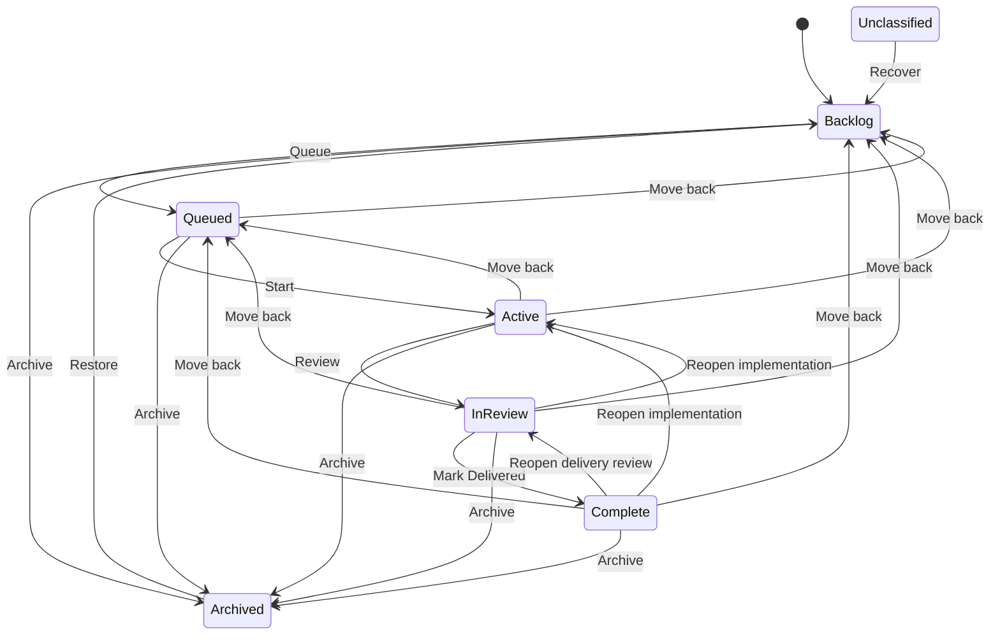

# Plan Lifecycle Workflow Expansion and Portal Navigation

## Summary

Expand the Plan Docs lifecycle from four canonical workflow folders to six:

```text
Backlog → Queued → Active → In Review → Complete → Archived
```

The lifecycle itself will be controlled by one shipped manifest. The manifest is the source of truth for state identity, folder, order, navigation placement, generic validation profile, visible actions, prompt availability, and post-transition behavior. Adding a future state that composes existing behavior must require only a manifest entry; code changes are reserved for genuinely bespoke validation, UI, or workflow behavior.

The new model separates three concepts that the current lifecycle compresses together:

- **Backlog** is an intake and dumping ground. A plan may still be incomplete, exploratory, blocked, or missing a concrete next action.
- **Queued** means selected for near-term work and prepared well enough to start.
- **In Review** means implementation is feature-complete, but verification, acceptance, release, or deployment work remains.
- **Complete** means the work has been delivered or accepted. The canonical folder remains `completed/`; only the product label changes to **Complete**.

The Plans page will expose five primary lifecycle tabs—Backlog, Queued, Active, In Review, and Complete—with Archived and Unclassified behind a reusable overflow-tabs web component. Selecting an overflow option temporarily adds that state as a visible selected tab; selecting a primary state removes the temporary tab.

Each plan card and drawer will use one lifecycle action model:

- one prominent forward action for a normal workflow transition;
- a neutral secondary action for terminal or recovery moves;
- one ancillary action menu containing copy, Plan Docs workflow prompts, backward moves, archival moves, and recovery actions appropriate to the current state.

The same effort will also standardize portal popover behavior, dropdown panel surfaces, menu dismissal, and icon sizes. Every custom anchored menu must use the shared viewport-clamping positioner so it remains inside the screen and scrolls internally when necessary.

## Context

The current lifecycle is:

```text
Backlog → Active → Completed → Archived
```

This is too coarse for the way plans are actually used:

1. Backlog currently mixes rough ideas with plans intentionally selected for near-term implementation.
2. Active currently covers both implementation and post-implementation testing/review work.
3. Completed currently means success criteria were met, but the UI does not distinguish feature-complete work from work that has been delivered, accepted, or deployed.
4. The Plans page gives every canonical state equal tab prominence, even though Archived and Unclassified are maintenance views rather than primary workflow views.
5. Lifecycle actions, Plan Docs prompt availability, lifecycle dropdown options, card CTAs, drawer CTAs, and event-dialog behavior are configured in different files and have already drifted.
6. Shared dropdown and menu primitives exist, but their styling and viewport behavior are not yet applied to every portal menu.

The implementation must treat this as one lifecycle-domain change with coordinated portal, skill, documentation, migration, and test updates. Adding two folders without updating workflow semantics would create inconsistent states and misleading actions.

## Goals

- Add `queued` and `in-review` as canonical lifecycle folders and mutation destinations.
- Make Backlog intentionally permissive enough to function as an intake queue.
- Make Queued the explicit near-term, implementation-ready state.
- Separate implementation work from verification, acceptance, release, and deployment work.
- Define Complete as delivered or accepted work while retaining `completed` as the stable storage key.
- Provide one canonical lifecycle manifest consumed by domain, portal, generated skill references, and tests.
- Allow a future lifecycle state to be added through manifest configuration alone when it reuses supported validation, navigation, action, prompt, and event primitives.
- Replace the Plans page’s all-states tab row with primary tabs plus reusable overflow navigation.
- Give every plan one primary or secondary lifecycle action and one menu containing every other valid function.
- Audit and correct Plan Docs prompt availability for every lifecycle.
- Make backward lifecycle moves discoverable from Complete and other later states.
- Put **Copy File Path** first in the plan action menu.
- Ensure action-menu selection closes the menu.
- Move shared dropdown styling into the shared portal stylesheet.
- Use an existing raised surface variable for dropdown and menu panels in both themes.
- Standardize all portal icons on an approved semantic size scale.
- Ensure every custom anchored dropdown/menu remains within viewport bounds and scrolls internally.
- Update current guides, references, skill workflows, and tests so they describe and enforce the same model.

## Non-goals

- Add lifecycle or delivery status to frontmatter.
- Add a separate `delivered/` folder in addition to `completed/`.
- Rename existing `docs/plans/completed/` directories or migrate their files to a new folder name.
- Add automatic deployment detection or infer delivery from Git, CI, or hosting providers.
- Add owners, due dates, estimates, sprints, or release versions to plan frontmatter.
- Automatically advance lifecycle from checked tasks or test results.
- Make Unclassified a valid destination or a normal workflow state.
- Implement direct Claude/Codex process launching from lifecycle buttons.
- Replace native `<select>` controls used as form fields; this plan concerns custom anchored portal menus and listboxes.
- Implement generated lifecycle-repair prompts owned by `plan-lifecycle-readiness-validation-and-repair-prompts`, except where its policy must be updated for the expanded lifecycle.
- Make arbitrary bespoke lifecycle behavior data-only. A state that needs a new validation algorithm, unique UI controller, new prompt workflow, or nonstandard filesystem operation may require code plus a new manifest capability.

## Confirmed Product Decisions

### Canonical lifecycle IDs and labels

Use stable storage IDs independently from display labels:

| Canonical ID | Folder | Display label | Meaning |
|---|---|---|---|
| `backlog` | `docs/plans/backlog/` | Backlog | Intake, exploration, incomplete planning, or work not selected for near-term execution |
| `queued` | `docs/plans/queued/` | Queued | Selected for near-term work and prepared to start |
| `active` | `docs/plans/active/` | Active | Implementation is underway |
| `in-review` | `docs/plans/in-review/` | In Review | Implementation is feature-complete; verification, acceptance, release, or deployment remains |
| `completed` | `docs/plans/completed/` | Complete | Delivered or accepted work with completion evidence |
| `archived` | `docs/plans/archived/` | Archived | Abandoned, superseded, obsolete, or retained as history |
| `unclassified` | `docs/plans/*.md` | Unclassified | Recovery classification for misplaced files; never a destination |

`completed` remains the canonical ID and folder name. The UI label becomes **Complete**, and the transition into it is labeled **Mark Delivered**. This preserves current files and stable URLs while making the product semantics explicit.


### Configuration ownership

Add one canonical manifest:

```text
manifests/platform/plan-lifecycle.json
```

This file is the only place that declares lifecycle entities and their standard behavior. Runtime modules compile and validate it; browser code receives a public normalized projection in the Plans snapshot; Plan Docs skill references are generated from it.

A future lifecycle state requires no application code when it can be expressed using existing primitives:

- a unique ID and folder;
- a display label and order;
- primary, overflow, or hidden navigation placement;
- an existing validation profile;
- existing priority/work-status flags;
- an existing primary-action style and destination;
- existing ancillary move and prompt modes;
- an existing lifecycle-event presentation type.

Code is required only when a state introduces behavior that the manifest vocabulary cannot already express, such as a new validator, a new mutation mechanism, a new prompt workflow, or a bespoke UI controller. Extending the manifest schema for such a capability must be deliberate and versioned rather than adding state-name conditionals.

### Primary navigation

The default tab row is:

```text
Backlog | Queued | Active | In Review | Complete | ⋯
```

The overflow menu contains:

```text
Archived
Unclassified
```

Archived and Unclassified are always present in the overflow menu, including when their counts are zero. Their visibility is part of the stable navigation contract; selecting an empty state renders its normal empty view.

### Transient overflow tab

When Archived or Unclassified is selected from the overflow menu:

1. Select that lifecycle through the page’s normal URL-backed lifecycle setter.
2. Render it as a normal selected tab after Complete and before the overflow trigger.
3. Keep the overflow trigger present.
4. Remove the transient tab as soon as a primary lifecycle is selected.
5. Recreate the transient tab on refresh or back/forward navigation when the URL selects an ancillary lifecycle.

The transient tab is derived from the selected value. It is not separately persisted.

### Lifecycle actions

Forward workflow transitions use CTA styling:

| Current state | Visible action | Destination | Style | Lifecycle event? |
|---|---|---|---|---|
| Backlog | Queue | Queued | CTA | Yes |
| Queued | Start | Active | CTA | Yes |
| Active | Review | In Review | CTA | Yes |
| In Review | Mark Delivered | Complete | CTA | Yes |

Terminal and recovery moves use the default secondary button style:

| Current state | Visible action | Destination | Style | Lifecycle event? |
|---|---|---|---|---|
| Complete | Archive | Archived | Secondary | No |
| Archived | Move to Backlog | Backlog | Secondary | No |
| Unclassified | Move to Backlog | Backlog | Secondary | No |

A “lifecycle event” is a normal forward workflow milestone with contextual follow-up. Archival and recovery are state-management operations, not lifecycle events.

### Lifecycle mutation entry points

The current always-visible lifecycle dropdown inside `<plan-status>` should be replaced by a read-only lifecycle label.

Lifecycle changes will be initiated through:

- the visible primary or secondary action;
- explicit move actions in the ancillary menu;
- Plan Docs slash-command workflows;
- existing API/domain mutation functions.

This avoids two competing lifecycle-control surfaces while making the intended next step more obvious. Priority remains an editable dropdown where applicable.

## Current State

### Domain lifecycle ownership

`modules/plan-docs/index.mjs` currently owns:

- `LIFECYCLES = new Set(["backlog", "active", "completed", "archived"])`;
- lifecycle derivation from the third path segment below `docs/plans`;
- guarded file movement to `docs/plans/<destination>/<filename>`;
- destination collision checks;
- stale-state checks using key, stable ID, expected lifecycle, and `mtimeMs`;
- validation warnings for Backlog, Active, Completed, and Archived;
- rebuilt records after a successful move.

The lifecycle configuration and mutation implementation live in the same already-large module, while portal and skill files repeat their own state arrays. There is no manifest that can add a state without editing several code paths. Adding two states directly to those hard-coded arrays would further mix parsing, discovery, mutation, validation, prompt generation, Git metadata, and rendering responsibilities.

### Server and API flow

Lifecycle writes pass through:

```text
portal/plans/api.js
  → POST /api/plans/lifecycle
  → scripts/cli/portal-routes-plans.mjs
  → scripts/cli/plans.mjs
  → modules/plan-docs/index.mjs
  → filesystem rename
```

The server layers are intentionally thin. They marshal the request and strip private paths from the normalized mutation result. The expanded lifecycle should preserve this boundary.

### Plans page lifecycle navigation

`portal/plans/app.js` currently:

- hard-codes `LIFECYCLE_ORDER = ["backlog", "active", "completed", "archived"]`;
- adds Unclassified only when its filtered count is nonzero;
- renders every lifecycle as a desktop tab;
- creates a separate mobile `<option-dropdown>` containing every lifecycle;
- stores the selected lifecycle in `?lifecycle=`;
- restores it on browser back/forward navigation.

`portal/plans/state.js` separately hard-codes labels and valid lifecycle query values.

`portal/plans/index.html` contains a tab template and a separate mobile dropdown mount. `portal/plans/styles.css` hides the tabs and shows the dropdown below 765px.

### Plan status and actions

`portal/plans/elements/plan-status.js` currently hard-codes all lifecycle options and emits arbitrary lifecycle mutations from its dropdown. It also:

- hides priority for Completed and Archived;
- shows progress and next action only for Active;
- renders Backlog readiness;
- renders blockers and review state.

`portal/plans/elements/plan-card.js` adds lifecycle actions through `cardLifecycleActions()`.

`portal/plans/templates.js` currently owns several separate rule sets:

- Plan Docs prompt definitions;
- prompt-to-lifecycle availability;
- recommended prompt selection;
- card lifecycle buttons;
- menu structure;
- drawer action structure.

The current visible lifecycle shortcuts are Backlog/Active Start and Active Archive. Complete and Archived have no direct action. The drawer and card do not use one identical action-bar model.

### Current Plan Docs prompt matrix

Current prompt availability is:

| Prompt | Current lifecycle availability |
|---|---|
| Start | Backlog, Unclassified |
| Sync | Active |
| Validate | Every lifecycle |
| Review | Active |
| Handoff | Backlog, Active |

This matrix does not match the proposed workflow. In particular:

- Handoff should not appear for unstarted Backlog work.
- Handoff should appear for Queued, Active, and In Review work.
- Start should begin Queued work, not skip directly from Backlog to Active.
- Review must transition Active work into In Review rather than directly deciding Complete.
- Delivery needs its own explicit workflow and transition from In Review to Complete.

### Current menu structure

The plan action panel currently renders:

1. explanatory note;
2. applicable prompt actions;
3. fallback prompt actions when Plan Docs is disabled;
4. Copy path;
5. optional package banner.

`Copy path` is therefore visually buried at the end. Menu-item click handlers call `stopPropagation()`, which prevents the shared document-click close behavior from dismissing the menu.

### Shared dropdown/menu primitives

The portal already has:

- `portal/shared/option-dropdown.js` for single-select listboxes;
- `portal/shared/menu-button.js` for arbitrary action panels;
- `portal/shared/popover-position.js` for viewport-aware placement;
- `portal/shared/widget-templates-partial.html` for real HTML templates;
- `portal/shared/base.css` for shared menu-button styling.

`positionPopoverPanel()` already:

- measures space above and below the trigger;
- opens on the side with more room;
- clamps `max-height` to available viewport space;
- relies on `overflow-y: auto` for internal scrolling;
- aligns toward the nearer horizontal viewport edge.

This behavior is already used by `portal-menu-button`, `option-dropdown`, and the Plans blockers popover.

However, the implementation is not global yet:

- `portal/localhoster/index.html`, `portal/localhoster/app.js`, and `portal/localhoster/styles.css` implement a separate absolutely positioned card action menu with no viewport clamp.
- `portal/config/index.html` and `portal/config/styles.css` implement the “Roborepo defaults” menu as an absolutely positioned `<details>` popover with no viewport clamp.
- shared `option-dropdown` visual rules are still located in `portal/plans/styles.css`, even though the element lives in `portal/shared`.

### Background layers

`portal/shared/base.css` already defines the intended surface hierarchy:

```text
--bg < --panel < --raised
```

`--raised` is explicitly intended for hover, highlight, and nested surfaces. Shared menu panels currently use `--panel`, while Plans’ page-local option dropdown also uses `--panel`. Using `--raised` for anchored dropdown/menu panels provides the requested visual separation without introducing another hard-coded color.

### Icon sizing

`portal/shared/icon.js` defaults to 15px but accepts arbitrary `width` and `height` attributes. Existing call sites use a mixture of:

- no explicit size;
- 12px chevrons;
- 14px menu and copy icons;
- 15px notice and info icons;
- 18px page-specific CSS overrides;
- 20px toolbar icons;
- 24px external-link icons.

The result is not an enforceable scale. Page CSS currently enlarges the Plans action-menu trigger independently from the shared menu component.

### Documentation and skill touchpoints

The lifecycle is described or assumed in:

- `globals/packages/plan-docs/skills/plan-docs/SKILL.md`;
- `globals/packages/plan-docs/skills/plan-docs/references/plan-schema.md`;
- `globals/packages/plan-docs/skills/plan-docs/references/lifecycle.md`;
- `workflow-create.md`;
- `workflow-next.md`;
- `workflow-start.md`;
- `workflow-sync.md`;
- `workflow-review.md`;
- `workflow-validate.md`;
- `workflow-handoff.md`;
- `prompt-contracts.md`;
- `docs/guides/plan-docs.md`;
- `docs/reference/services/plans-portal.md`;
- generated Claude/Codex Plan Docs command wrappers.

The checked-in guide and technical reference also contain stale claims that the Plans portal cannot mutate lifecycle files. Those claims must be corrected as part of this work.

### Existing plans that overlap this work

- `docs/plans/completed/plan-lifecycle-toggle-control.md` documents and reports the lifecycle mutation system that this plan extends.
- `docs/plans/backlog/plan-lifecycle-readiness-validation-and-repair-prompts.md` owns future hard validation and generated repair prompts. Its lifecycle policy must be revised to include Queued and In Review.
- `docs/plans/backlog/plan-unclassified-plan-recovery.md` owns the recovery banner and final-item behavior. This plan now owns the per-plan **Move to Backlog** action and overflow navigation; the older plan must be narrowed to avoid duplicate implementation scope.

## Proposed Design

### Canonical lifecycle manifest

Add `manifests/platform/plan-lifecycle.json` as the lifecycle source of truth. Keep the manifest declarative and schema-versioned:

```json
{
  "schemaVersion": 1,
  "defaultState": "backlog",
  "states": [
    {
      "id": "backlog",
      "folder": "backlog",
      "label": "Backlog",
      "classification": "canonical",
      "order": 10,
      "navigation": "primary",
      "validationProfile": "intake",
      "priorityEditable": true,
      "workStatusVisible": false,
      "primaryAction": {
        "label": "Queue",
        "to": "queued",
        "style": "cta",
        "outcome": {
          "type": "milestone",
          "explanation": "The plan is prepared for near-term work.",
          "prompt": null
        }
      },
      "moves": ["archived"],
      "prompts": ["validate"]
    },
    {
      "id": "unclassified",
      "folder": null,
      "label": "Unclassified",
      "classification": "recovery",
      "order": 70,
      "navigation": "overflow",
      "validationProfile": "recovery",
      "priorityEditable": false,
      "workStatusVisible": false,
      "primaryAction": {
        "label": "Move to Backlog",
        "to": "backlog",
        "style": "secondary",
        "outcome": {
          "type": "passive"
        }
      },
      "moves": [],
      "prompts": ["validate"]
    }
  ]
}
```

The complete manifest will contain all seven readable states. The example shows the contract rather than duplicating the entire final table.


The initial manifest values must resolve to this behavior matrix:

| State | Navigation | Validation profile | Priority | Work status | Visible action | Prompt modes | Ancillary moves |
|---|---|---|---|---|---|---|---|
| Backlog | Primary | `intake` | Editable | Hidden | Queue → Queued, CTA milestone | Validate | Archived |
| Queued | Primary | `ready` | Editable | Visible | Start → Active, CTA milestone with Start prompt | Validate, Handoff | Backlog, Archived |
| Active | Primary | `implementation` | Editable | Visible | Review → In Review, CTA milestone with Review prompt | Sync, Validate, Handoff | Queued, Backlog, Archived |
| In Review | Primary | `review` | Editable | Visible | Mark Delivered → Complete, CTA milestone | Sync, Review, Validate, Handoff | Active, Queued, Backlog, Archived |
| Complete | Primary | `delivered` | Hidden | Hidden | Archive → Archived, secondary/passive | Validate | In Review, Active, Queued, Backlog |
| Archived | Overflow | `archive` | Hidden | Hidden | Move to Backlog, secondary/passive | Validate | None |
| Unclassified | Overflow | `recovery` | Hidden | Hidden | Move to Backlog, secondary/passive | Validate | None |

`outcome` is configured on an action edge, not inferred only from the destination. Moving forward into Queued may be a milestone while moving backward into Queued is passive. The supported outcome types are generic; a state can supply standard explanation and optional existing prompt mode without new UI code.

Create a focused loader/compiler such as:

```text
modules/plan-docs/lifecycle-manifest.mjs
```

It should:

- load the manifest from the application root;
- validate schema version, unique IDs/folders/orders, target references, and transition integrity;
- reject `unclassified` or other recovery states as destinations;
- compile immutable lookups and generic predicates;
- validate action outcome descriptors, allowed styles, prompt modes, and target references;
- map `validationProfile` names to existing reusable validator functions;
- expose a private domain model for discovery and mutation;
- expose a safe public projection for the Plans snapshot;
- fail fast with an actionable configuration error instead of silently ignoring an invalid state.

`modules/plan-docs/index.mjs` should continue to coordinate discovery, record construction, and guarded movement, but it must derive lifecycle decisions from the compiled manifest rather than state-name conditionals.

### Manifest extension contract

The initial implementation must prove data-only extensibility. Add a test-only manifest fixture with a generic state such as `paused` that:

- uses a new folder;
- uses overflow navigation;
- reuses an existing validation profile;
- uses existing secondary move behavior;
- exposes existing prompt modes;
- requires no source-code modification or state-specific branch.

The fixture must pass manifest validation, folder discovery, public snapshot projection, URL/navigation modeling, and guarded movement. This test is the enforcement mechanism for the requirement that future ordinary states are manifest-only.

The supported manifest vocabulary is intentionally finite. A new state can compose existing primitives without code; a new primitive requires an explicit schema and implementation change.

### Lifecycle state machine



The state machine describes the initial manifest values, not a hard transition graph enforced by the filesystem API. The domain mutation still accepts any configured canonical destination after validation so external tools and future workflows can recover unusual states. The portal exposes the actions configured by the loaded manifest.

### Lifecycle validation policy

The manifest assigns each state a reusable `validationProfile`. This plan must update the profile registry so the new states do not inherit incorrect rules. The future readiness/repair plan may make selected findings hard gates, but this feature continues the existing confirmable-warning behavior. States that reuse a profile require no new validator code.

| Destination | Baseline policy |
|---|---|
| Backlog | Accept incomplete or exploratory plans. Do not require `next_action` merely because the file is in Backlog. Structural gaps may still make readiness `draft`, but Backlog itself is valid intake. |
| Queued | Require the normal plan structure, non-empty `next_action`, implementation approach, success criteria, and at least one remaining actionable task or explicit start action. Blockers remain visible and orthogonal; a blocked plan may be Queued, but Start must warn before advancing. |
| Active | Require implementation context, success criteria, remaining actionable work, and non-empty `next_action`. |
| In Review | Require feature implementation context, success criteria, non-empty `next_action`, and review/delivery work still to perform. Permit remaining verification, release, and deployment tasks. |
| Complete | Require no unchecked required tasks, no blockers, no `next_action`, and non-empty verification/delivery evidence. |
| Archived | Require no `next_action`. Completion evidence is not required. |
| Unclassified | Always warn and offer recovery. Never accept it as a destination. |

Because existing task checkboxes do not distinguish implementation tasks from review/deployment tasks, the In Review validator must not reject every unchecked task. The plan document remains responsible for making remaining work understandable through headings, task text, and `next_action`.

### Compiled lifecycle selectors

Do not keep state-name arrays in domain or browser code. Compile generic selectors from manifest fields:

```js
export function isActionableState(state) {
  return state.workStatusVisible === true;
}

export function isTerminalState(state) {
  return state.classification === "terminal";
}
```

Backlog is discoverable by `/plan-docs next`, but it is not implementation-active. Unclassified is recoverable but not actionable. Those outcomes come from manifest fields and ranking configuration, not string comparisons.

### Publish the lifecycle model to the portal

Include a safe public lifecycle model in every Plans snapshot:

```js
{
  generatedAt,
  lifecycleModel: {
    schemaVersion: 1,
    defaultState: "backlog",
    states: [
      {
        id: "backlog",
        label: "Backlog",
        navigation: "primary",
        order: 10,
        priorityEditable: true,
        workStatusVisible: false,
        primaryAction: {
          label: "Queue",
          to: "queued",
          style: "cta",
          outcome: { type: "milestone", explanation: "The plan is prepared for near-term work.", prompt: null }
        },
        moves: ["archived"],
        prompts: ["validate"]
      }
    ]
  },
  plans,
  repositories
}
```

Do not expose filesystem roots, validator function names that are not needed by the browser, or private implementation metadata.

The portal must not declare lifecycle entities in a second `lifecycle-config.js`. Add a pure consumer module such as `portal/plans/lifecycle-model.js` that indexes and queries the server-provided model but contains no state definitions. `app.js`, `state.js`, `plan-actions.js`, `<plan-status>`, and `portal-overflow-tabs` consume that normalized model.

URL parsing may retain the raw `?lifecycle=` value until the first snapshot loads. After loading, reconcile it against `lifecycleModel.states`; fall back to `defaultState` when invalid. This allows newly configured states to work without a browser release.

### Reusable overflow-tabs web component

Create:

```text
portal/shared/overflow-tabs.js
```

and add its markup to:

```text
portal/shared/widget-templates-partial.html
```

with shared styles in:

```text
portal/shared/base.css
```

The component is justified as a light-DOM custom element because it owns reusable interactive behavior:

- primary tab rendering;
- transient selected-overflow tab rendering;
- overflow menu open/close behavior;
- keyboard navigation;
- narrow-screen fallback;
- selected state and counts;
- event dispatch.

#### Public API

```js
const tabs = document.createElement("portal-overflow-tabs");
tabs.primaryOptions = primaryOptions;
tabs.overflowOptions = overflowOptions;
tabs.value = selectedLifecycle;
tabs.addEventListener("tab-select", ({ detail }) => {
  selectLifecycle(detail.value);
});
```

Each option is plain data:

```js
{
  value: "active",
  label: "Active",
  count: 4
}
```

The component must not import Plans page state, change the URL, fetch data, or filter records. It emits selection intent; `portal/plans/app.js` remains the page orchestrator.

#### Desktop behavior

- Render primary options in order.
- If `value` belongs to overflow options, insert exactly one transient tab after the primary options.
- Render an ellipsis trigger after the transient slot.
- Use `role="tablist"`, `role="tab"`, `aria-selected`, and roving `tabindex`.
- Left/Right arrows move among visible tabs.
- Enter/Space selects the focused tab.
- The overflow menu uses the shared anchored-menu behavior and closes after selection.

#### Narrow-screen behavior

At the component’s shared breakpoint:

- hide the tab row;
- render one full-width `option-dropdown` containing primary and available overflow options;
- preserve the same `value` and `tab-select` event contract;
- avoid maintaining a second page-level lifecycle dropdown mount.

The Plans page should contain one component mount rather than separate desktop and mobile controllers.

#### URL behavior

`portal/plans/state.js` continues to own pure URL helpers, but valid values come from the loaded lifecycle model rather than a seven-value constant. `portal/plans/app.js` continues to call `history.pushState()` and restore selection on `popstate`.

### Unified plan action model

Create a focused browser module such as:

```text
portal/plans/plan-actions.js
```

It should produce a plain action model from a record and package state. `portal/plans/templates.js` renders that model; `portal/plans/app.js` executes emitted intent.

```js
export function planActionModel(record, lifecycleModel, planDocsEnabled) {
  const lifecycle = lifecycleById(lifecycleModel, record.plan.lifecycle);
  return {
    primary: lifecycle.primaryAction,
    prompts: promptActionsFor(lifecycle, planDocsEnabled),
    moves: lifecycle.moves,
    canCopyPath: true
  };
}
```

This keeps business configuration in the manifest, leaves the browser module as a pure model consumer, and keeps the already-large `app.js` focused on orchestration.

### Card and drawer parity

Both the card and drawer must render the same action-bar model:

```text
[Primary or secondary lifecycle action] [Action menu trigger]
```

The card currently uses `cardLifecycleActions()`, while the drawer uses a separate recommended-prompt CTA. Replace both with one template-backed action-bar renderer or light-DOM element that receives the same model and emits the same events.

The action surface must emit intent only:

```js
{
  type: "lifecycle",
  value: "in-review",
  record
}
```

or:

```js
{
  type: "prompt",
  mode: "review",
  record
}
```

`portal/plans/app.js` continues to own mutation calls, stale recovery, dialogs, toasts, filtering, and drawer state.

### Plan status behavior

Update `<plan-status>` to:

- render the configured lifecycle label as a static chip;
- show priority editing when `priorityEditable` is true (Backlog, Queued, Active, and In Review in the initial manifest);
- hide priority when `priorityEditable` is false (Complete, Archived, and Unclassified initially);
- show next-action/progress content when `workStatusVisible` is true (Queued, Active, and In Review initially);
- show intake readiness for the configured intake profile without treating it as execution-active;
- preserve blockers, review state, modification time, and task progress;
- stop emitting lifecycle changes.

Rename state-specific CSS classes from implementation-specific names such as `.is-active` to behavior names such as `.has-work-status` so Queued and In Review can share layout without duplicating selectors.

### Lifecycle event dialogs

Make event behavior declarative:

| Destination | Initial configured dialog content | Prompt action |
|---|---|---|
| Queued | Confirm queued, explain that the plan is prepared for near-term work, View Plan, Revert | None |
| Active | Confirm started, explain `/plan-docs start`, View Plan, Revert | Copy Start Prompt |
| In Review | Confirm moved to review, explain `/plan-docs review`, View Plan, Revert | Copy Review Prompt |
| Complete | Confirm delivered, View Plan, Revert | None |

Archived and Backlog recovery moves use passive outcome handling and do not open lifecycle-event dialogs.

Refactor `portal/plans/lifecycle-event-dialog.js` so title, explanation, outcome type, prompt button label, and prompt mode come from the manifest action descriptor instead of being hard-coded to Active.

### Plan Docs command model

Add two explicit Plan Docs modes:

```text
/plan-docs queue
/plan-docs deliver
```

The command help becomes:

```text
/plan-docs create    create or revise a backlog plan
/plan-docs next      choose the next relevant plan action
/plan-docs queue     prepare backlog work and move it into queued
/plan-docs start     move queued work into active and begin
/plan-docs sync      update active or in-review work from repository evidence
/plan-docs validate  check schema, lifecycle, and repository consistency
/plan-docs review    verify feature-complete work and move it into in-review
/plan-docs deliver   verify delivery evidence and move in-review work into complete
/plan-docs handoff   prepare a queued, active, or in-review continuation
```

#### Manifest-backed skill reference

Add a build step that renders the lifecycle table and allowed workflow applicability from `manifests/platform/plan-lifecycle.json` into a package-owned generated reference, for example:

```text
globals/packages/plan-docs/skills/plan-docs/references/lifecycle-manifest.generated.md
```

`SKILL.md` and workflow references must use the generated reference for state identity, labels, order, and generic transition availability. Adding a manifest-only state therefore updates agent-visible lifecycle context through the normal build/generation command without hand-editing workflow code. A brand-new prompt mode still requires a bespoke workflow implementation and is outside the manifest-only guarantee.

#### Workflow semantics

- **Create** writes or revises Backlog plans. Backlog plans may remain draft and do not require immediate queue readiness.
- **Next** considers Queued, Active, In Review, and ready Backlog work. It should rank unresolved In Review/Active work ahead of starting additional Queued work, then rank ready Backlog work that can be queued.
- **Queue** verifies structure, next action, dependencies, and near-term intent before moving Backlog to Queued.
- **Start** accepts Queued or already-Active plans. It no longer moves Backlog directly to Active.
- **Sync** applies to Active and In Review. It updates tasks, next action, evidence, blockers, and plan/repository consistency without automatically delivering the work.
- **Review** verifies implementation and success criteria. Active work moves to In Review when feature implementation is ready for acceptance/release work. In Review work may remain there after additional review updates.
- **Deliver** verifies all required tasks, acceptance, release/deployment evidence where applicable, blockers, and `next_action`, then moves In Review to `completed/`.
- **Validate** understands all canonical states and Unclassified recovery.
- **Handoff** is available only for Queued, Active, and In Review. It is excluded from Backlog and terminal/recovery states.

### Ancillary plan action inventory

The action menu is state-specific and must be derived from the loaded manifest. The initial manifest resolves to this matrix:

| Lifecycle | Prompt actions | Lifecycle moves in menu | Visible outside menu |
|---|---|---|---|
| Backlog | Validate | Archive | Queue CTA |
| Queued | Validate, Handoff | Move to Backlog, Archive | Start CTA |
| Active | Sync, Validate, Handoff | Move to Queued, Move to Backlog, Archive | Review CTA |
| In Review | Sync, Review, Validate, Handoff | Move to Active, Move to Queued, Move to Backlog, Archive | Mark Delivered CTA |
| Complete | Validate | Move to In Review, Move to Active, Move to Queued, Move to Backlog | Archive secondary button |
| Archived | Validate | None | Move to Backlog secondary button |
| Unclassified | Validate | None | Move to Backlog secondary button |

The primary-associated workflow prompt is intentionally not duplicated in the menu for the source lifecycle. It is offered by the destination event dialog when a prompt is useful.

Complete explicitly includes backward moves so delivered work can be reopened without relying on an obscure lifecycle selector.

### Action menu information architecture

Render the menu in this order:

1. **Copy File Path**.
2. Introductory note describing that workflow actions copy prompts for an agent chat.
3. Applicable Plan Docs workflow actions.
4. Applicable lifecycle move actions.
5. Plan Docs enablement banner when disabled.

Use distinct template slots for each section rather than appending one undifferentiated list.

The introductory note should use:

- `font-size: var(--text-sm)`;
- increased `var(--space-sm)` / `var(--space-md)` padding;
- a nested contrasting surface using an existing background variable;
- stronger text color than the current low-emphasis description.

With the panel itself moved to `var(--raised)`, use `var(--panel)` for the intro surface. In dark mode this produces the requested darker inset area without adding another palette value.

Rename every user-facing “Copy path” label and accessible name in this menu to **Copy File Path**. Drawer header copy controls may keep concise tooltip copy when the surrounding path already establishes context, but menu wording must use the full label.

### Menu dismissal contract

`portal-menu-button` should close after an actionable item is selected. Do not rely on every caller’s document-click propagation.

Use a shared contract such as:

```html
<button type="button" data-menu-dismiss>...</button>
```

The component should listen within its panel and close after an activated dismissing item. Allow future interactive panel content to opt out by omitting the marker.

All plan menu items, portable variants, Localhoster actions, Config defaults actions, and overflow-tab menu items must follow the same dismissal contract.

### Shared panel background and dropdown CSS ownership

Move the generic rules for:

- `option-dropdown`;
- `.dropdown-trigger`;
- `.dropdown-menu`;
- `.dropdown-option`;

from `portal/plans/styles.css` into `portal/shared/base.css`.

Keep only Plans-specific trigger overrides—priority, lifecycle, and narrow lifecycle-navigation presentation—in the Plans stylesheet.

Set shared anchored panels to:

```css
.menu-button-panel,
.dropdown-menu {
  background: var(--raised);
}
```

Use the same surface for migrated Localhoster and Config action menus through the shared components. Do not introduce page-specific dark-mode colors.

### Global viewport-clamping contract

`positionPopoverPanel()` remains the single placement implementation for custom anchored action/listbox panels.

Every shared anchored menu must:

- use `position: fixed`;
- call `positionPopoverPanel()` after mounting;
- use `overflow-y: auto` and `overscroll-behavior: contain`;
- preserve a viewport margin;
- recompute placement on each open;
- close or reposition on viewport resize;
- close on Escape and outside click;
- close on action selection.

Migrate these current exceptions:

#### Localhoster card menu

Replace the page-local `.action-menu`, `.menu-trigger`, `.menu-panel`, `toggleActionMenu()`, and `closeActionMenus()` implementation with `portal-menu-button` and template-backed menu items.

Preserve the background-poll invariant: an open menu prevents that card from being replaced or marked offline. Update `hasOpenMenu()` to inspect the shared component’s exposed open state or `aria-expanded` value rather than page-local `[data-menu]` visibility.

#### Config defaults menu

Replace the `<details class="defaults-menu">` popover with `portal-menu-button` or a small consumer of the shared menu primitive. Preserve the existing action callbacks and labels while gaining clamping, dismissal, keyboard, shared surface, and icon sizing.

#### Plans blockers popover

It already uses `positionPopoverPanel()`. Keep it on the shared placement path and apply the same raised panel background token for visual consistency.

### Approved icon size scale

Replace arbitrary width/height values with semantic sizes:

```js
export const ICON_SIZES = Object.freeze({
  xs: 12,
  sm: 16,
  md: 20,
  lg: 24
});
```

Update `<portal-icon>` to accept:

```html
<portal-icon name="copy" size="md"></portal-icon>
```

Rules:

- default size is `sm` (16px);
- menu triggers and menu items use `md` (20px);
- chevrons and compact inline indicators use `xs` or `sm`;
- toolbar and primary icon buttons use `md`;
- large external-link or standalone emphasis icons use `lg`;
- arbitrary numeric `width` and `height` attributes are removed from portal call sites;
- unknown size tokens fall back to `sm` and are covered by tests.

Apply the migration exhaustively across `portal/`, including templates and JavaScript-created icons. Remove the Plans-only 18px CSS override after the shared menu component owns the correct size.

Add a horizontal-ellipsis icon to the shared icon registry for overflow tabs. The existing copy icon remains the plan action-menu trigger unless a separate future design changes it.

### File movement and migration

Add empty directories as needed when the first file moves; the domain already creates destination parents. No bulk content migration is required:

- existing Backlog plans remain Backlog;
- existing Active plans remain Active;
- existing Completed plans remain in `completed/` and display as Complete;
- existing Archived plans remain Archived;
- Queued and In Review begin empty unless users explicitly move plans;
- Unclassified remains path-derived recovery state.

Do not infer which current Active plans belong in In Review. That requires plan-by-plan evidence.

### Snapshot and API compatibility

No new lifecycle endpoint is required. Continue using:

```text
POST /api/plans/lifecycle
```

The request and normalized mutation result remain unchanged. Expand accepted lifecycle values and validation only.

The Plans snapshot must include the normalized public `lifecycleModel`. This is the contract that lets browser navigation and actions recognize a manifest-added state without new portal code. Add contract tests that compare the public model to the compiled manifest while ensuring private fields remain stripped.

### Documentation updates

Update:

- `docs/guides/plan-docs.md` with the new lifecycle, tabs, direct portal mutations, and workflow examples;
- `docs/reference/services/plans-portal.md` with current API routes, browser mutation behavior, shared components, and lifecycle rules;
- `globals/packages/plan-docs/skills/plan-docs/SKILL.md` mode help and reference routing;
- all lifecycle/workflow reference files listed above;
- package descriptions only if the new queue/deliver wording makes the current copy incomplete;
- generated Claude/Codex wrappers through the repo-native generation command, never by hand.

## Affected Code and Documentation Touchpoints

| Path | Current responsibility | Required change |
|---|---|---|
| `package.json` | Repository scripts and packaged file inventory | Add manifest/generator test scripts as needed; `manifests/` is already shipped, so no package file-list expansion is expected |
| `manifests/platform/plan-lifecycle.json` | New canonical configuration | Declare lifecycle entities, folders, labels, order, navigation, generic validation profile, actions, prompts, and event behavior |
| `modules/plan-docs/lifecycle-manifest.mjs` | New | Load/validate/compile the manifest; expose private domain and safe public models; map reusable validation profiles |
| `modules/plan-docs/index.mjs` | Discovery, parsing, record construction, validation, movement | Consume the compiled manifest; remove state-name conditionals; recognize configured folders and generic policies |
| `scripts/cli/plans.mjs` | Portal-facing snapshot and lifecycle mutation wrapper | Preserve thin orchestration; expose new records without adding UI policy |
| `scripts/cli/portal-routes-plans.mjs` | Plans API routing and structured errors | No route change expected; update comments/tests if lifecycle assumptions are named |
| `portal/plans/state.js` | Filters, sorting, URL lifecycle state, visibility | Validate URL values against the loaded lifecycle model; update actionable-plan helpers and overflow selection tests |
| `portal/plans/lifecycle-model.js` | New | Pure selectors/indexes over the server-provided lifecycle model; contains no lifecycle declarations |
| `portal/plans/plan-actions.js` | New | Pure action-model construction for cards/drawer |
| `portal/plans/app.js` | Page orchestration | Mount overflow-tabs; route action intents; use expanded event map; remove separate mobile dropdown controller |
| `portal/plans/templates.js` | Plans markup construction | Render action models and grouped menu structure; remove scattered lifecycle matrices |
| `portal/plans/elements/plan-status.js` | Shared card/drawer status | Static lifecycle label; priority/work-status applicability; stop arbitrary lifecycle emission |
| `portal/plans/elements/plan-card.js` | Card rendering | Consume shared action bar; use behavior-based layout classes |
| `portal/plans/lifecycle-event-dialog.js` | Post-transition event dialog | Configurable destination, explanation, prompt mode, and button label |
| `portal/plans/index.html` | Plans templates and static mounts | Replace lifecycle tab/mobile mounts with overflow-tabs mount; add grouped action-menu templates and static lifecycle label template |
| `portal/plans/styles.css` | Plans-specific presentation | Remove generic dropdown CSS; style plan-specific action/status/nav use cases; remove arbitrary icon override |
| `portal/plans/api.js` | Browser lifecycle requests | Request shape unchanged |
| `portal/shared/overflow-tabs.js` | New | Reusable primary/overflow tab component and narrow fallback |
| `portal/shared/menu-button.js` | Shared arbitrary panel | Close-on-selection contract; open-state introspection; resize handling; semantic icon sizes |
| `portal/shared/option-dropdown.js` | Shared listbox | Consume shared styles/icon sizes; preserve selection dismissal and positioner |
| `portal/shared/popover-position.js` | Shared viewport placement | Preserve single implementation; add resize-safe behavior only if controller-level handling is insufficient |
| `portal/shared/icon.js` | Shared icon registry | Semantic size tokens; ellipsis icon; reject arbitrary call-site sizing |
| `portal/shared/widget-templates-partial.html` | Shared component templates | Overflow-tabs templates; semantic icon sizes; menu-dismiss attributes where generic |
| `portal/shared/base.css` | Global palette and shared components | Raised panel background; shared option-dropdown CSS; overflow-tabs CSS; approved icon-size-related layout |
| `portal/localhoster/index.html` | Localhoster card menu templates | Replace custom action menu markup with shared menu component/templates |
| `portal/localhoster/templates.js` | Localhoster card menu wiring | Build shared menu content and remove per-item manual close calls |
| `portal/localhoster/app.js` | Localhoster menu state and polling reconciliation | Remove custom toggle/close orchestration; preserve open-menu reconciliation guard through shared state |
| `portal/localhoster/styles.css` | Localhoster menu CSS | Remove page-local anchored panel rules; keep page-specific menu content layout only |
| `portal/config/index.html` | Config defaults popover template | Replace `<details>` markup with shared menu component markup |
| `portal/config/templates.js` | Config defaults action wiring | Build shared dismissing menu items while preserving `onDefaultClick` callbacks |
| `portal/config/panels.js` | Config modal/footer orchestration | Preserve callback ownership; update only if shared menu lifecycle needs explicit close/reset handling |
| `portal/config/styles.css` | Config defaults popover CSS | Remove custom positioning/panel colors; keep consumer-specific text layout |
| `scripts/test/plan-lifecycle-manifest-check.mjs` | New manifest contract test | Validate schema/references and prove a generic test-only state works without source changes |
| `scripts/test/plan-docs-check.mjs` | Domain lifecycle/mutation tests | Add queued/in-review fixtures, full transition tour, destination warnings, storage-label behavior, and configured-folder discovery |
| `scripts/test/plans-portal-state-check.mjs` | Pure Plans state tests | Add new state visibility, actionable ranking, overflow URL behavior, action matrix selectors |
| `scripts/test/localhoster-check.mjs` | Localhoster behavior checks | Assert shared menu markup/open-state contract if current tests cover templates |
| new shared component test | Shared portal component contracts | Test overflow-tab derivation, menu dismissal, icon-size mapping, and placement inputs without private implementation assertions |
| `scripts/build/render-plan-lifecycle-reference.mjs` | New generator | Render the package-owned lifecycle reference from the manifest and support `--check` |
| `globals/packages/plan-docs/package.config.json` | Plan Docs package metadata | Update descriptive copy only if Queue/Deliver makes the current description incomplete |
| `globals/packages/plan-docs/skills/plan-docs/**` | Agent lifecycle workflows | Add Queue/Deliver, consume the generated lifecycle reference, and revise every mode’s behavior contract |
| `generated/packages/plan-docs/{claude,codex}/**` | Generated harness command surfaces | Regenerate through repo-native commands; never edit generated wrappers directly |
| `docs/guides/plan-docs.md` | User walkthrough | New lifecycle, navigation, direct actions, workflow examples |
| `docs/reference/services/plans-portal.md` | Runtime reference | Current mutation API, lifecycle policy, components, and tests |
| related plan docs | Remaining implementation scope | Remove or clarify overlap before coding |

## Implementation Plan

### Phase 0: Reconcile plan ownership

- [ ] Update `plan-lifecycle-readiness-validation-and-repair-prompts` so its future policy recognizes Queued and In Review and no longer assumes only Active/Completed have semantic requirements.
- [ ] Narrow `plan-unclassified-plan-recovery` so this plan owns the per-plan Move to Backlog action and overflow navigation, while the recovery plan retains banner/final-item/bulk-recovery concerns.
- [ ] Link this plan from the implementation report or related section of the completed lifecycle-controls plan.
- [ ] Confirm no other active/backlog plan already owns shared popover or icon-size standardization.

### Phase 1: Add and compile the lifecycle manifest

- [ ] Add `manifests/platform/plan-lifecycle.json` with all canonical and recovery states.
- [ ] Add `modules/plan-docs/lifecycle-manifest.mjs` with schema validation, reference checks, immutable indexes, public projection, and reusable validation-profile mapping.
- [ ] Add `queued` and `in-review` as configured canonical destinations.
- [ ] Keep `completed` as the canonical storage key and expose Complete through the configured label.
- [ ] Configure Backlog as valid intake without `next_action`.
- [ ] Add reusable Queued and In Review validation profiles.
- [ ] Configure Unclassified as source-only recovery.
- [ ] Refactor `modules/plan-docs/index.mjs` to remove state-name conditionals and consume the compiled model without changing mutation request/result shape.
- [ ] Add a test-only generic state fixture and prove manifest-only discovery, projection, and movement.
- [ ] Add domain and manifest tests before portal changes.

### Phase 2: Update Plan Docs workflows and generated lifecycle reference

- [ ] Add `scripts/build/render-plan-lifecycle-reference.mjs` with write and `--check` modes.
- [ ] Generate `lifecycle-manifest.generated.md` inside the Plan Docs skill references.
- [ ] Make `SKILL.md` and relevant workflows read the generated reference instead of duplicating lifecycle tables.
- [ ] Add `workflow-queue.md` and `workflow-deliver.md`.
- [ ] Update `SKILL.md` help, mode routing, description, and common rules.
- [ ] Update `plan-schema.md` and `lifecycle.md` with the six canonical states and Complete display semantics.
- [ ] Update Create so Backlog is intentionally permissive.
- [ ] Update Next ranking and candidate lifecycle rules.
- [ ] Update Start to require Queued or Active.
- [ ] Update Sync for Active/In Review.
- [ ] Update Review to move feature-complete work into In Review.
- [ ] Update Deliver to move verified delivered work into `completed/`.
- [ ] Update Validate for all states.
- [ ] Restrict Handoff to Queued, Active, and In Review.
- [ ] Update prompt contracts where new modes alter generated portal prompt labels.
- [ ] Regenerate Claude and Codex command wrappers with the repository’s existing generator.

### Phase 3: Build shared overflow-tabs navigation

- [ ] Add actual `<template>` markup to `widget-templates-partial.html`.
- [ ] Implement `portal-overflow-tabs` as a light-DOM custom element.
- [ ] Compose the existing shared menu/listbox primitives rather than creating another positioning system.
- [ ] Add primary, transient overflow, counts, selected value, and `tab-select` event APIs.
- [ ] Add keyboard and ARIA behavior.
- [ ] Add the narrow-screen single-select presentation inside the component.
- [ ] Add shared styles to `base.css`.
- [ ] Replace Plans’ separate lifecycle-tabs and mobile dropdown mounts.
- [ ] Preserve URL, refresh, and back/forward behavior.

### Phase 4: Consume manifest-backed Plans action policy

- [ ] Include the normalized public `lifecycleModel` in the Plans snapshot.
- [ ] Add `portal/plans/lifecycle-model.js` with pure selectors and no state declarations.
- [ ] Add `portal/plans/plan-actions.js` that builds actions from the provided model.
- [ ] Render the configured primary/secondary action matrix.
- [ ] Render configured prompt and move inventories without state-name branches.
- [ ] Remove lifecycle/action matrices from `state.js`, `templates.js`, `plan-card.js`, `plan-status.js`, and `app.js`.
- [ ] Render the same action bar in cards and the drawer.
- [ ] Replace `<plan-status>` lifecycle dropdown with a static lifecycle label.
- [ ] Drive priority and work-status applicability from manifest flags; verify the initial Queued/In Review values.
- [ ] Route every lifecycle action through the existing page mutation orchestrator.
- [ ] Ensure Complete backward moves return to the correct tab/toast/dialog behavior.

### Phase 5: Expand lifecycle-event outcomes

- [ ] Make event-dialog copy and prompt behavior consume each action's manifest `outcome` descriptor.
- [ ] Add Queued and In Review events.
- [ ] Change Completed dialog wording to Complete/delivered.
- [ ] Add configurable prompt mode/label for Active and In Review.
- [ ] Keep Archive and recovery moves on passive toast behavior.
- [ ] Preserve View Plan, Revert, stale recovery, and drawer-closing behavior.

### Phase 6: Refine the plan action menu

- [ ] Move Copy File Path to the first row.
- [ ] Rename menu copy labels and accessible names.
- [ ] Move the intro note below Copy File Path.
- [ ] Increase intro typography and padding and give it a distinct nested surface.
- [ ] Render workflow and lifecycle-move groups separately.
- [ ] Add move actions for Complete and earlier-state recovery.
- [ ] Remove Handoff from Backlog, Complete, Archived, and Unclassified.
- [ ] Ensure every actionable item dismisses the menu.
- [ ] Preserve portable Review where it remains useful.
- [ ] Confirm package-disabled fallback content still reads correctly in the new order.

### Phase 7: Globalize dropdown and menu behavior

- [ ] Move option-dropdown base CSS into `portal/shared/base.css`.
- [ ] Change shared action/listbox panel backgrounds to `var(--raised)`.
- [ ] Keep consumer-specific trigger presentation in page styles.
- [ ] Add explicit menu-dismiss support to `portal-menu-button`.
- [ ] Expose a stable open-state contract needed by polling/reconciliation consumers.
- [ ] Migrate Localhoster’s custom card menu.
- [ ] Migrate Config’s Roborepo defaults menu.
- [ ] Confirm Plans blockers popover uses the same surface and positioner.
- [ ] Audit all custom anchored panels under `portal/` and either migrate them or document why they are not dropdowns/menus.
- [ ] Verify every migrated panel clamps vertically and scrolls internally.

### Phase 8: Standardize icon sizing

- [ ] Add semantic size tokens to `portal-icon`.
- [ ] Add horizontal-ellipsis icon.
- [ ] Make 16px the default.
- [ ] Make shared menu triggers/items 20px by component contract.
- [ ] Replace every numeric portal-icon width/height call site with an approved size token.
- [ ] Replace raw inline SVGs that duplicate registered icons where practical.
- [ ] Remove page-specific icon-size overrides that are no longer needed.
- [ ] Add a repository check that rejects unsupported portal-icon size tokens and numeric width/height attributes.

### Phase 9: Documentation and related plan updates

- [ ] Update the Plan Docs guide.
- [ ] Update the Plans portal technical reference.
- [ ] Remove stale read-only/browser-cannot-move claims.
- [ ] Document Queued and In Review semantics with examples.
- [ ] Document Complete as the UI label for `completed/`.
- [ ] Document primary and overflow navigation.
- [ ] Document the direct action/menu model.
- [ ] Update related plan scopes and next actions.

### Phase 10: Verification and implementation report

- [ ] Run targeted domain and portal-state checks after each phase.
- [ ] Run Localhoster tests after its menu migration.
- [ ] Run lifecycle-manifest validation and generated-reference checks after every manifest/workflow change.
- [ ] Run package/skill generation checks after workflow changes.
- [ ] Run the full suite because shared portal primitives and cross-page styles changed.
- [ ] Perform browser smoke testing in dark and light themes at wide, narrow, top-edge, and bottom-edge positions.
- [ ] Add an implementation report to this plan with decisions, deviations, tests, screenshots or observations, and remaining follow-through.
- [ ] Move the plan to Complete only after delivery evidence is recorded under Verification and no required work remains.

## Validation

### Manifest and domain tests

Add `scripts/test/plan-lifecycle-manifest-check.mjs` and extend `scripts/test/plan-docs-check.mjs` to prove:

- invalid schema versions, duplicate IDs/folders/orders, missing targets, self-targeting actions, unknown action styles/outcome types/prompt modes, and unknown validation profiles fail with actionable errors;
- manifest order and navigation fields produce the expected public model;
- a test-only generic state can be added by fixture manifest alone and participates in discovery, projection, URL modeling, and guarded movement without a state-specific source branch;
- private validator and filesystem metadata do not cross the public snapshot boundary;

- every canonical folder is discovered with the correct lifecycle;
- Unclassified remains source-only;
- the guarded movement tour includes:

```text
backlog → queued → active → in-review → completed → archived → backlog
```

- stable ID survives every move;
- path-derived key changes after every move;
- destination directories are created safely;
- collision, stale-state, repository-boundary, and private-path protections remain unchanged;
- Backlog accepts a draft without `next_action` as lifecycle-valid intake;
- Queued reports missing start-readiness data;
- Active reports missing implementation next action;
- In Review permits remaining review/release tasks but requires a concrete next action;
- Complete retains strict unresolved-work and verification evidence checks;
- Archived does not imply successful delivery;
- `completed` records expose Complete as their UI label without changing the folder.

### Pure portal tests

Extend `scripts/test/plans-portal-state-check.mjs` or add focused neighboring tests for:

- every configured lifecycle URL value;
- a test-only manifest state works without adding a browser constant;
- invalid lifecycle URL fallback to the manifest `defaultState`;
- primary lifecycle tab order derived from manifest order;
- transient Archived tab derivation;
- transient Unclassified tab derivation even when the selected state is empty;
- transient tab removal after selecting a primary state;
- browser back/forward restoration inputs;
- actionable-plan classification and Next ranking;
- action model for every lifecycle;
- Handoff availability only in Queued, Active, and In Review;
- Complete backward move inventory;
- primary versus secondary tone;
- event versus passive transition classification.

### Shared component tests

Add a small shared portal component contract test that verifies externally meaningful behavior:

- overflow selection emits `tab-select` with the chosen value;
- selected ancillary value produces one transient tab;
- selecting a primary value removes it;
- option selection closes the listbox;
- menu items marked for dismissal close the panel;
- non-action content does not close it unexpectedly;
- approved icon sizes map to exact dimensions;
- unknown icon size falls back to `sm`;
- placement helper chooses the roomier side and clamps max height.

Use a real browser smoke test for keyboard focus, responsive layout, and viewport positioning if the repository’s existing browser harness is available. Do not add a new browser dependency solely for this plan without a separate tooling decision.

### Cross-page browser smoke

Verify manually or through the existing browser harness:

#### Plans

- primary tabs render in order with correct counts;
- Archived/Unclassified overflow behavior works;
- transient tabs survive URL refresh and back/forward navigation;
- narrow layout uses the component fallback;
- every lifecycle shows the correct action/menu inventory;
- card and drawer actions match;
- Complete can move backward;
- menu closes after selection;
- Copy File Path is first;
- menu surface is distinct in dark and light themes;
- long menus near viewport top/bottom remain reachable by internal scrolling.

#### Localhoster

- action menu remains open through background polling when its card is otherwise unchanged;
- menu closes after selecting an action;
- menu stays in the viewport;
- offline-card behavior remains correct.

#### Config

- Roborepo defaults menu opens, selects, dismisses, and stays within the viewport;
- existing default-file navigation behavior is unchanged.

### Commands

Run the smallest relevant checks while developing:

```sh
node scripts/test/plan-lifecycle-manifest-check.mjs
npm run test:plans
npm run test:plans-portal-state
npm run test:localhoster
npm run test:packages
node scripts/build/render-plan-lifecycle-reference.mjs --check
node scripts/cli/main.mjs skill render-commands --check
node scripts/cli/main.mjs skill triggers --check
git diff --check
```

Because the work changes shared portal components, shared CSS, icon rendering, Localhoster, Config, Plan Docs workflows, and generated command surfaces, finish with:

```sh
npm test
npm run pack:dry-run
```

### Static inventory checks

Before completing the implementation, audit for remaining arbitrary icon sizes and custom anchored menus:

```sh
rg -n '<portal-icon|createElement\("portal-icon"\)|setAttribute\("(width|height)"' portal
rg -n 'menu-panel|dropdown-menu|defaults-popover|action-menu|position:\s*(absolute|fixed)' portal
```

Every finding must either use an approved shared contract or be explicitly documented as a non-dropdown/non-menu surface.

## Risks and Mitigations

| Risk | Mitigation |
|---|---|
| Lifecycle rules drift between domain, portal, and skill | Use one canonical manifest, publish a normalized portal model, generate the skill reference, and contract-test all projections |
| A manifest-added state still requires hidden code edits | Add a test-only generic state fixture that must pass discovery, movement, public projection, navigation, and action modeling without source changes |
| Backlog becomes noisy because incomplete plans no longer warn | Separate lifecycle validity from readiness; Backlog can be valid intake while still displaying Draft/readiness findings |
| Queued becomes indistinguishable from Active | Queued has no implementation-underway claim; Start is the explicit transition and Active-only implementation semantics remain documented |
| In Review becomes another vague Active state | Define it around feature-complete implementation and remaining verification/acceptance/release/deployment work; use explicit next action and event copy |
| Complete terminology conflicts with `completed/` paths | Keep canonical IDs stable and centralize labels; tests assert storage ID versus display label |
| Backward move menu becomes too long | Group lifecycle moves separately, show only explicitly allowed moves, and rely on viewport-clamped internal scrolling |
| Removing the lifecycle dropdown hides uncommon recovery paths | Put all valid backward/archive/recovery moves in the action menu and test the lifecycle-specific inventory |
| Shared menu close behavior breaks interactive panel content | Use explicit `data-menu-dismiss` semantics rather than closing on every internal click |
| Localhoster polling replaces cards with open shared menus | Expose shared open state and preserve the existing reconciliation guard |
| Moving shared dropdown CSS changes unrelated pages | Establish shared base styles first, preserve consumer-specific overrides, and smoke test every current consumer in both themes |
| Default icon size changes alter dense layouts | Use semantic tokens, update call sites exhaustively, and inspect all shared templates and responsive views |
| Future repair-prompt plan duplicates new validation policy | Reconcile related plan ownership in Phase 0 and make it consume the expanded lifecycle policy |
| Existing Active plans are actually ready for In Review | Do not infer or bulk-migrate; leave current files unchanged until explicitly reviewed |

## Open Questions

No product decisions remain open for the first implementation. The lifecycle configuration path and single-source ownership are decided: `manifests/platform/plan-lifecycle.json` is canonical, and the Plans API publishes its normalized public projection. The following are implementation details to resolve from existing conventions during development rather than reasons to block the plan:

- exact shared breakpoint used by `portal-overflow-tabs` after measuring the five primary labels;
- whether component tests use the repository’s current lightweight DOM strategy or an existing browser harness;
- whether the shared menu exposes open state through a property, attribute, or both for Localhoster reconciliation.

These choices must preserve the public behavior defined above.

## Acceptance Criteria

- `manifests/platform/plan-lifecycle.json` is the single source of truth for lifecycle entities and standard behavior.
- A future state that reuses supported primitives can be added by manifest entry alone, with no state-specific domain or portal code.
- A contract test proves a generic manifest-only state flows through discovery, mutation, public snapshot, URL/navigation, and action modeling.
- Canonical Plan Docs lifecycles are Backlog, Queued, Active, In Review, Complete, and Archived, with Unclassified retained as recovery-only.
- Lifecycle remains folder-derived and no status frontmatter is added.
- `completed/` remains the canonical folder while the UI consistently says Complete.
- Backlog can serve as an intake/dumping ground without requiring an immediate next action.
- Queued explicitly represents near-term, prepared work.
- In Review explicitly represents feature-complete but not yet delivered work.
- Complete means delivered or accepted and requires completion evidence.
- The Plans page shows five primary tabs and an overflow menu that always lists Archived and Unclassified.
- Selecting an ancillary state produces one transient selected tab that disappears after selecting a primary state.
- Navigation remains URL-backed and works with refresh and browser history.
- The overflow navigation is implemented as a reusable shared light-DOM web component.
- Every card and drawer uses the same lifecycle action model derived from the server-provided manifest projection.
- Queue, Start, Review, and Mark Delivered use CTA styling and lifecycle-event handling.
- Complete Archive and recovery moves use secondary styling and passive outcome handling.
- Complete exposes explicit moves back to prior states.
- Handoff appears only for Queued, Active, and In Review.
- Copy File Path is the first plan menu row.
- Plan menu selection closes the menu.
- Shared custom dropdown/menu panels use `var(--raised)` and are visually distinct in dark and light themes.
- Generic option-dropdown CSS lives under shared portal ownership.
- Plans, Localhoster, and Config anchored menus use the shared viewport-clamping implementation.
- Long menus remain on-screen and scroll internally.
- Portal icons use only approved semantic sizes, with 16px default and 20px menu icons.
- Plan Docs adds Queue and Deliver workflows, updates every existing workflow, and consumes a generated lifecycle reference rendered from the manifest.
- User and technical documentation describe current mutation behavior rather than the obsolete read-only model.
- Targeted checks and the full repository suite pass.
- The implementation report records verification and any remaining follow-through before the plan moves to Complete.
