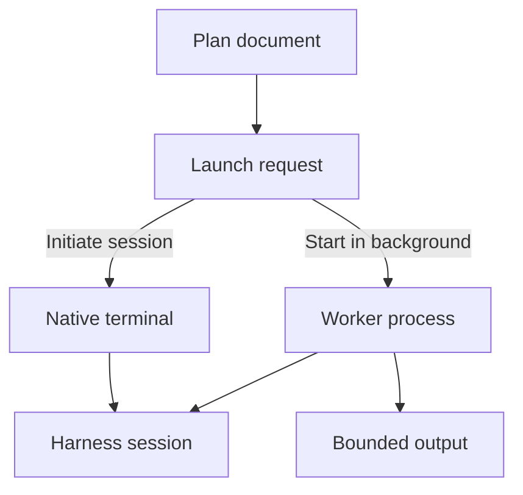
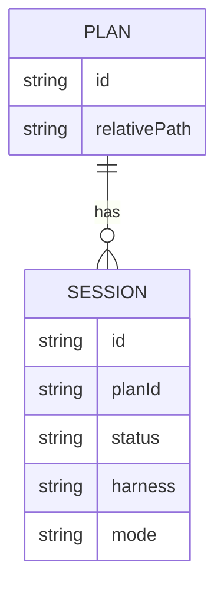
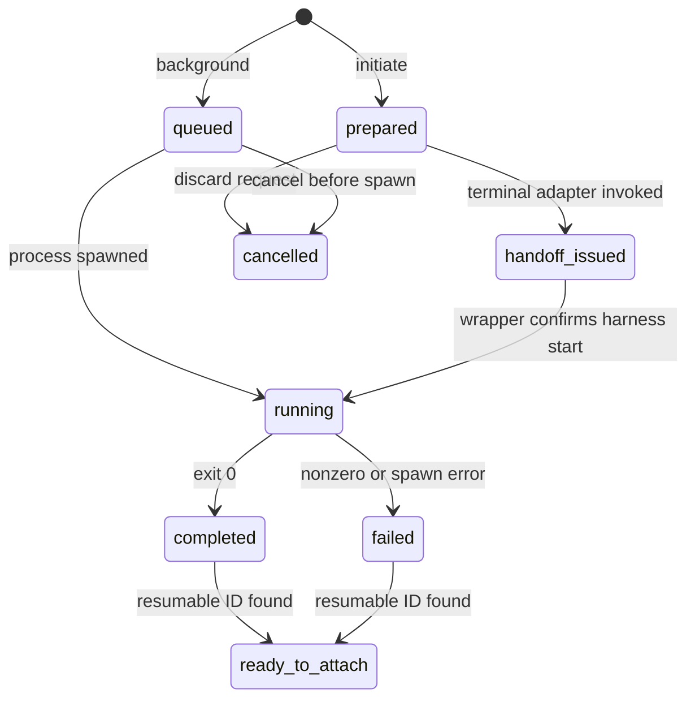
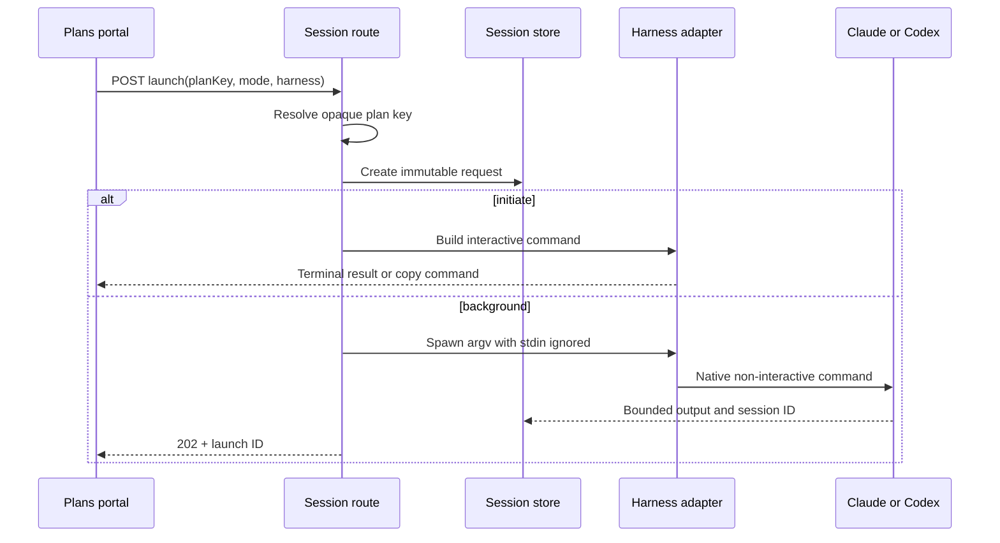

# Plan Session Launching — Milestone 1: macOS Core Workflow

## Summary

Add a plan-linked session launcher to RoboRepo's portal and CLI. A user can create a prompt from a
Plan and choose either:

- **Initiate session**: save a prepared launch request, then open a native Claude or Codex
  interactive session in a terminal.
- **Start in background**: run one non-interactive Claude or Codex turn immediately, retain bounded
  output, and make the resulting harness session attachable or resumable in a terminal.

This milestone delivers the complete workflow for RoboRepo's primary macOS environment without
turning RoboRepo into a chat client or terminal manager. RoboRepo owns launch requests, worker
metadata, status, and handoff commands. Claude and Codex continue to own conversations,
authentication, permissions, and interactive UI.

## Context

The Plans portal already discovers Markdown plans across repositories, identifies each plan with a
server-issued opaque key, renders plan content, and creates repository-aware prompts. Today those
prompts end at the clipboard. The user must move the prompt into a terminal and start the correct
harness manually.

The desired improvement is a one-click handoff from a Plan to a native agent session. This is a
workflow-management feature adjacent to Plans, not telemetry:

| Concern | Question answered | Source of truth |
| --- | --- | --- |
| Plan | What work are we trying to accomplish? | `docs/plans/**/*.md` |
| Launch request | What should RoboRepo ask a harness to do? | machine-local RoboRepo state |
| Worker process | Is a background CLI process running? | OS process + persisted worker metadata |
| Harness session | What native conversation can be resumed? | Claude or Codex |
| Terminal destination | Where should the interactive UI open? | launch-time terminal choice |
| Telemetry session | What usage and behavior were observed? | telemetry spool |

These identities may be correlated, but must not be collapsed into one record. A worker can exit
while its harness session remains resumable; a prepared request can exist before either is created.



## Goals

- Launch Claude or Codex work from a Plan without copy/paste.
- Provide distinct `initiate` and `background` modes.
- Keep Plans as the portal's primary work entity.
- Add session status, history, filters, and launch actions to Plan surfaces.
- Expose a compact active/pending session summary suitable for a future homepage widget.
- Track whether output was viewed and whether a session was opened interactively.
- Preserve the native harness as the only conversational interface.
- Use the existing loopback portal, POST mutation guard, no-build web architecture, and machine-local
  state root.
- Deliver reliable macOS terminal opening plus a copy-command fallback.
- Keep the data model platform-neutral so later milestones can add reliability and other platforms.
- Keep operational policy in validated machine-local configuration rather than hard-coding it in
  routes, adapters, or browser code.

## Non-goals

- Building a browser chat UI or accepting conversational replies in the portal.
- Managing Claude or Codex authentication, credentials, subscriptions, or API keys.
- Proxying credentials or offering "Sign in with Claude."
- Implementing Codex app-server or WebSocket thread APIs.
- Targeting arbitrary existing terminal panes.
- Running an always-on terminal registration or heartbeat service.
- Linux, Windows, PowerShell, ConPTY, or WSL terminal automation.
- Per-repository queues, sophisticated log redaction, or exhaustive orphan reconciliation.
- Launching or storing a Session without an associated Plan in the initial release.
- A dedicated Sessions portal page in the initial release.
- Treating every possible Plan prompt as a pending session.

Every Milestone 1 Session record must have a non-null `planId`. A Session is a first-class entity
with its own ID and lifecycle, related to a Plan through that required key; it is not embedded in
the Plan record or Plan Markdown. Reconsider optional Plan relationships only as a separately
designed future migration.

## Current state

The plan was reviewed against commit `72c83be`.

### Existing portal architecture

| Existing behavior | Relevant code | Reuse |
| --- | --- | --- |
| Loopback-only Node server | `scripts/cli/portal-server.mjs` | Keep `127.0.0.1` binding |
| Page manifest and nav | `PAGES` in `scripts/cli/portal-server.mjs` | Keep Plans as the primary session surface |
| Domain route dispatch | `handle*Api` functions | Add `portal-routes-sessions.mjs` |
| POST origin and mutation-token guards | `route()` in `portal-server.mjs` | Apply automatically to launch mutations |
| Shared browser fetch helpers | `portal/shared/api.js` | Use `portalGetJson` and `portalPostJson` |
| No framework or build step | `portal/*` ES modules and templates | Extend Plans with session components |
| Portal handler composition | `serveCommand()` in `scripts/cli/telemetry.mjs` | Inject session service handlers |

Every POST is already protected by a loopback-origin check and the
`X-Roborepo-Portal-Token` header. Session routes must go through that shared dispatch; they must not
create a second security mechanism. Launch and terminal-open mutations must additionally reject
non-loopback requests until authenticated remote portal access is designed; possession of a
mutation token alone must not turn the launcher into a remote command-execution API.

### Existing Plans architecture

| Existing behavior | Relevant code | Extension |
| --- | --- | --- |
| Discover repositories and plans | `modules/plan-docs/index.mjs` | Resolve a launch from an opaque plan key |
| Remove absolute paths from public snapshots | `scripts/cli/plans.mjs` | Keep absolute repository path server-side |
| Read a selected plan safely | `findPlanByKey()` / `readPlanDocument()` | Build an immutable launch snapshot |
| Generate repository-aware prompts | `buildPrompt()` | Use prompt text as launch input |
| Plans API | `scripts/cli/portal-routes-plans.mjs` | Add session listing per plan without mixing route ownership |
| Plans browser UI | `portal/plans/` | Add launch actions and a Sessions subsection |

The Plans portal sends server-issued plan keys instead of arbitrary paths. Session creation must use
the same boundary: the browser sends `planKey`; the server resolves the plan and repository from the
current snapshot.

### Existing CLI and state architecture

- `scripts/cli/main.mjs` dispatches CLI namespaces and lazily imports command modules.
- `scripts/cli/state-paths.mjs` centralizes state paths below `stateRoot`.
- `scripts/cli/state-paths.mjs` provides `readJsonState()` and `writeJsonState()`.
- `scripts/cli/telemetry.mjs::serveCommand()` wires domain handlers into the portal server.
- The project requires Node 20+ and uses ESM throughout.
- `package.json` exposes targeted `test:*` scripts and a full `npm test`.

## Proposed design

### Domain boundaries

Add a session domain independent of Plans:

```text
modules/session-launcher/
  index.mjs
  schema.mjs
  store.mjs
  process.mjs
  harnesses/
    claude.mjs
    codex.mjs
  terminals/
    macos.mjs
scripts/cli/
  sessions.mjs
  portal-routes-sessions.mjs
portal/plans/
  app.js
  templates.js
```

Plans may call the session service, but session persistence and process control must not be added to
`modules/plan-docs/`. Markdown plans remain the Plans source of truth; machine-local JSON records
remain the Sessions source of truth.

### Core records

Store data below `path.join(stateRoot, "sessions")`. Use one JSON file per launch request so one
write does not rewrite an ever-growing global array:

```text
<stateRoot>/sessions/
  requests/<launch-id>.json
  output/<launch-id>.jsonl
```

The initial relationship is one-to-many:



`Session.id` is the stable identity for lifecycle updates and cross-Plan queries. `Session.planId`
is required and immutable, but it is not globally unique across repositories. Persist an immutable
`repositoryKey` with it and use `(repositoryKey, planId)` as the relationship key. Plan rows, Plan
details, and future homepage widgets derive summaries by querying Session records; they must not
copy session arrays into Plan documents or Plan state.

Recommended normalized record:

```json
{
  "schema": 1,
  "id": "launch_opaque_id",
  "planId": "plan-session-launching-milestone-1",
  "repositoryKey": "repo_opaque_canonical_key",
  "planRelativePath": "docs/plans/backlog/example.md",
  "repository": {
    "name": "roborepo",
    "root": "/server-only/absolute/path",
    "head": "72c83be",
    "branch": "main",
    "worktree": false
  },
  "harness": "claude",
  "mode": "background",
  "permissionProfile": "plan",
  "prompt": "immutable prompt text",
  "status": "queued",
  "harnessSessionId": null,
  "worker": null,
  "createdAt": "2026-07-24T20:00:00.000Z",
  "startedAt": null,
  "completedAt": null,
  "viewedAt": null,
  "attachedAt": null,
  "exit": null,
  "error": null
}
```

The public API must remove `repository.root`, raw process environment, and any internal output path.
The launch snapshot is immutable after creation except for lifecycle, worker, timestamps, harness
session ID, and error/exit fields. Add a monotonically increasing `revision` to persisted records.
Every lifecycle mutation must use a compare-and-swap update or equivalent per-record lock so worker
exit, cancellation, viewing, and browser polling cannot overwrite one another. Idempotency claims
must use exclusive creation, not a read-then-write check.

### Lifecycle

Use a small initial state machine:



In persisted JSON, use stable kebab-case values:

| State | Meaning |
| --- | --- |
| `prepared` | Prompt exists; no worker has run |
| `handoff-issued` | A terminal handoff was requested, but harness startup is not confirmed |
| `queued` | Background launch accepted but not yet spawned |
| `running` | Worker process is active |
| `completed` | Background turn exited successfully |
| `failed` | Spawn or process failed |
| `ready-to-attach` | Native session ID is known and resumable |
| `cancelled` | Launch was cancelled before completion |
| `unknown` | State cannot be safely inferred after restart |

`needs-attention` and deeper orphan handling are Milestone 2 concerns. A background process that asks
for interactive permission should fail clearly in Milestone 1; it must never wait forever for stdin.

### Launch modes

#### Initiate session

1. Resolve `planKey`.
2. Build a repository-aware prompt.
3. Store a `prepared` request.
4. Build the native command as an executable plus argument array.
5. Open a new configured macOS terminal, or return a copyable command.
6. Set `handoffIssuedAt` after successful terminal-adapter invocation.
7. Set `attachedAt` only when a RoboRepo wrapper callback or later native-session evidence confirms
   the harness started. Terminal launch success alone is not proof of attachment.

#### Start in background

1. Resolve `planKey`.
2. Require explicit harness and permission profile.
3. Require confirmation for any write-capable profile.
4. Claim an idempotency key.
5. Store the immutable launch snapshot as `queued`.
6. Spawn the harness with `stdin: "ignore"` and argument arrays.
7. Stream stdout/stderr into bounded JSONL records.
8. Capture exit code and any documented native session identifier.
9. Expose **Open in terminal** only when a safe resume/attach command exists.

Before either mode executes, re-resolve the opaque Plan key and repository root, reject symlink or
root changes that escape the discovered repository, and verify the launch snapshot still refers to
the intended `(repositoryKey, planId)`. A stale browser snapshot must fail with a refresh action,
not launch against a moved or replaced path.



### Harness adapters

Adapters must report capabilities from actual executable probing, not assumptions:

```js
{
  id: "claude",
  available: true,
  version: "…",
  capabilities: {
    interactive: true,
    background: true,
    resume: true
  }
}
```

Each adapter owns:

- executable resolution;
- supported argument arrays;
- version/capability probe;
- environment allowlist;
- output event normalization;
- native session ID extraction;
- interactive resume command construction.

RoboRepo must spawn the user's installed CLI and inherit its normal authentication behavior. It
must never read, copy, proxy, persist, or expose harness credentials.

Do not build shell command strings from browser input:

```js
spawn(executable, args, {
  cwd: repository.root,
  env: allowedEnvironment(process.env),
  stdio: ["ignore", "pipe", "pipe"]
})
```

Shell-form execution such as `exec("claude " + prompt)` is prohibited.

Claude's documented programmatic primitive should be capability-probed before finalizing exact
flags. Codex should use its documented non-interactive JSON output and resume support. If an
installed version cannot supply a resumable session ID, record a completed result without claiming
it is attachable.

### Output safety

Milestone 1 needs bounded storage, not a general log platform:

| Control | Initial rule |
| --- | --- |
| Maximum stored output | configurable fixed byte ceiling per launch |
| Oversize behavior | retain head/tail metadata and mark `truncated: true` |
| Browser rendering | text only; never inject output as HTML |
| Environment capture | allowlisted metadata only |
| Prompt storage | required immutable launch input; never echo it in list responses |
| Secrets | avoid collecting them; do not promise comprehensive redaction yet |
| stdin | ignored for background processes |

Use JSONL output events so stdout, stderr, timestamps, and structured harness events remain
distinguishable without storing one unbounded string.

### Configuration boundary

Add a schema-versioned machine-local Sessions configuration beneath `stateRoot`; keep defaults in
one core module and persist only user overrides. Configuration must be loaded and validated once by
the service, exposed through a sanitized projection, and never accepted as raw launch-time argv.

| Configuration | Keep out of |
| --- | --- |
| Default harness and permission profile | Plan UI conditionals |
| Background timeout and output byte ceiling | Harness adapters |
| Preferred macOS terminal and copy-command behavior | Session routes |
| Allowed background permission profiles | Browser code |
| Poll interval and list-page size | Domain lifecycle |

Executable overrides may be supported as trusted local configuration, but the browser can select
only a known harness ID. Invalid configuration should fall back to documented safe defaults with a
visible diagnostic; unsafe or unknown permission profiles should fail closed.

### Plan-centered session surfaces

Plans remain the portal's primary entity. Sessions are first-class activity records in the data
model, but Milestone 1 does not add a dedicated Sessions page.

The Plan list should support derived session metadata and filters:

| Plan metadata/filter | Purpose |
| --- | --- |
| Active session count | Show background work currently running |
| Pending session count | Show initiated launch records not yet opened, plus queued work |
| Needs review count | Show completed or failed background results not yet viewed |
| Latest session | Show harness, mode, status, and age for the most recent activity |
| Has active sessions | Filter Plans with running work |
| Has pending sessions | Filter Plans with initiated-but-unopened or queued work |
| Has unviewed results | Filter Plans requiring review |

Only a concrete launch action creates a session record. RoboRepo must not enumerate possible prompts
for a Plan or present them as pending work.

The Plan detail drawer should show its session history and may open a session detail view containing
bounded output, launch metadata, copy command, and **Open in terminal**. It must not include a reply
box.

The session index API should also return compact cross-plan counts and a bounded list of active and
pending sessions. This supports a future homepage widget without requiring a dedicated page now.
List queries must accept server-bounded `planId`, `repositoryKey`, `status`, `cursor`, and `limit`
filters so the browser never downloads the full history:

```json
{
  "counts": {
    "active": 2,
    "pending": 1,
    "unviewed": 3
  },
  "attention": [
    {
      "id": "launch-id",
      "planId": "canonical-repository-identity",
      "status": "running"
    }
  ]
}
```

### Plan integration

Add two explicit Plan actions:

- **Initiate session**
- **Start in background**

The Plan drawer should also show a Sessions subsection filtered to that plan ID. Plan rows should
receive only compact derived session summaries; detailed records remain behind the session API. Do
not store session records in Markdown or alter plan frontmatter.

### API

Add `scripts/cli/portal-routes-sessions.mjs`:

| Endpoint | Method | Purpose |
| --- | --- | --- |
| `/api/sessions` | GET | paginated, filtered public session index |
| `/api/sessions/capabilities` | GET | harness, terminal, and policy capabilities |
| `/api/sessions/detail?id=` | GET | one sanitized launch |
| `/api/sessions/output?id=&cursor=&limit=` | GET | paginated bounded output |
| `/api/sessions/launch` | POST | create prepared or background launch |
| `/api/sessions/view` | POST | set `viewedAt` |
| `/api/sessions/open` | POST | open/resume in terminal or return copy command |
| `/api/sessions/cancel` | POST | cancel prepared/queued work or terminate active worker |

All POST routes inherit the existing origin and mutation-token guard. `id` is an opaque server-issued
identifier. Browser input must never select arbitrary paths, executables, or argument arrays.

Canonical per-request files remain the source of truth. Maintain an in-memory summary index while
the service is running, update it after successful record commits, and rebuild it from records at
startup. Do not introduce a second durable index in Milestone 1. This avoids rescanning and parsing
every record on each portal poll without creating dual-write corruption.

### CLI

Add a `sessions` namespace to `scripts/cli/main.mjs` and the platform command catalog:

```text
roborepo sessions
roborepo sessions show <id>
roborepo sessions open <id>
roborepo sessions logs <id>
roborepo sessions cancel <id>
```

`open` maps the persisted record to a native adapter command. It does not accept a browser-supplied
command string.

### macOS terminal adapter

Milestone 1 supports:

1. A new window/tab in the configured macOS terminal when a stable adapter exists.
2. The terminal that launched `roborepo serve` only when its identity remains usable.
3. Copy command as the universal fallback.

Do not attempt to inject commands into an arbitrary existing iTerm, Terminal, cmux, or editor pane.
If AppleScript or app-specific automation is used, keep it behind `terminals/macos.mjs` and pass
only commands produced by trusted harness adapters.

## Implementation plan

### Phase 1 — Domain schema and persistence

- [ ] Add session state paths to `scripts/cli/state-paths.mjs`.
- [ ] Define schema/version validation in `modules/session-launcher/schema.mjs`.
- [ ] Implement atomic per-request writes and safe reads in `store.mjs`.
- [ ] Add record revisions and conflict-safe lifecycle updates.
- [ ] Generate opaque, collision-resistant launch IDs.
- [ ] Separate private records from public API projections.
- [ ] Implement idempotency-key claims for launch requests.
- [ ] Scope Plan relationships by canonical repository key plus Plan ID.
- [ ] Add schema-versioned Sessions configuration with centralized defaults and validated overrides.
- [ ] Add a rebuildable in-memory summary index for bounded list/filter queries.
- [ ] Add fixtures for corrupt, partial, missing, and unknown-schema records.

### Phase 2 — Harness process boundary

- [ ] Implement shared executable probing and argv-only spawning.
- [ ] Implement Claude capability and launch adapter.
- [ ] Implement Codex capability and launch adapter.
- [ ] Ignore stdin for background runs and enforce a process timeout policy.
- [ ] Normalize stdout/stderr into bounded JSONL output.
- [ ] Record exit status and native session ID only when actually observed.
- [ ] Add cancellation that distinguishes terminating a worker from deleting history.

### Phase 3 — Service, API, and CLI

- [ ] Add `scripts/cli/sessions.mjs`.
- [ ] Add `scripts/cli/portal-routes-sessions.mjs`.
- [ ] Inject handlers through `serveCommand()` in `scripts/cli/telemetry.mjs`.
- [ ] Dispatch the session route before static page handling in `portal-server.mjs`.
- [ ] Register `roborepo sessions` in `scripts/cli/main.mjs` and
  `manifests/platform/cli-commands.json`.
- [ ] Add request validation, idempotency conflict responses, and sanitized errors.
- [ ] Re-resolve Plan/repository identity immediately before execution and reject stale snapshots.
- [ ] Reject launch/open mutations received outside the loopback trust boundary.

### Phase 4 — Portal surfaces

- [ ] Add Plan drawer launch actions.
- [ ] Add Plan-row session summaries and active/pending/unviewed filters.
- [ ] Add Plan-level session history, session detail, bounded output, and open action without
  changing plan Markdown.
- [ ] Return compact cross-plan active/pending counts and attention items for a future homepage
  widget.
- [ ] Preserve loading, updated-at, template, accessibility, and error patterns used by other pages.

### Phase 5 — macOS terminal handoff

- [ ] Add configured-terminal resolution and a safe copy-command fallback.
- [ ] Implement new terminal window/tab launching for supported macOS terminals.
- [ ] Capture the originating terminal metadata when `roborepo serve` starts, without assuming it
  is still available.
- [ ] Record `handoffIssuedAt` after adapter invocation and `attachedAt` only after confirmed startup.
- [ ] Clearly explain when no native resume ID exists.

### Phase 6 — Documentation and packaging

- [ ] Update `docs/reference/services/portal.md` page, route, and security tables.
- [ ] Update `docs/reference/services/plans-portal.md` with Plan-to-Session integration.
- [ ] Add `docs/reference/services/sessions.md` as the runtime source of truth.
- [ ] Update `docs/reference/services/roborepo-cli.md`.
- [ ] Add new files to the npm package allowlist in `package.json`.

## Validation

### Automated checks

Add `scripts/test/session-launcher-check.mjs` and `npm run test:sessions`:

- schema acceptance/rejection;
- atomic store behavior;
- revision conflicts and simultaneous view/cancel/exit updates;
- private-to-public projection;
- idempotent duplicate request handling;
- argv construction without shell interpolation;
- capability unavailable and executable missing;
- background success, failure, timeout, and cancellation;
- output truncation;
- paginated list/output bounds and summary-index rebuild;
- session ID present and absent;
- open/resume command selection;
- Plan key resolution and path non-disclosure;
- repository-key scoping, stale snapshot rejection, and symlink/root replacement;
- safe configuration defaults, valid overrides, and invalid override diagnostics.

Extend the portal smoke coverage to verify:

- GET routes work without a mutation token;
- POST launch/open/view/cancel require the mutation token;
- cross-origin POST is rejected;
- every changed Plans browser module parses;
- Plan launch requests cannot select arbitrary paths;
- Plan session summaries and filters are derived from session records;
- HTML output is escaped.

Run:

```sh
npm run test:plans
npm run test:sessions
npm test
npm run pack:dry-run
```

### Manual macOS acceptance

- [ ] Initiate a Claude plan session and reach the native interactive CLI.
- [ ] Initiate a Codex plan session and reach the native interactive CLI.
- [ ] Start one background run for each harness.
- [ ] View completed output from the originating Plan without creating a browser chat surface.
- [ ] Resume/attach when the harness supplied a native session ID.
- [ ] Confirm copy-command fallback when terminal automation is unavailable.
- [ ] Restart the portal and confirm persisted completed/prepared records remain visible.
- [ ] Confirm no credential material appears in records, APIs, output metadata, or browser HTML.

## Acceptance criteria

- Both launch modes work from a Plan on macOS.
- Claude and Codex are isolated behind adapters and invoked with argument arrays.
- Session records distinguish launch request, worker process, harness session, and terminal
  destination.
- Plans surface their associated session status and history, including active, pending, and unviewed
  filters.
- The API exposes a bounded cross-plan active/pending summary suitable for a homepage widget.
- `viewedAt` and `attachedAt` are separate and filterable.
- Terminal handoff and confirmed harness attachment are not conflated.
- Background work cannot wait indefinitely for interactive stdin.
- Portal output is bounded and rendered as text.
- Existing portal mutation protection, opaque Plan keys, and server-side path ownership are
  preserved.
- RoboRepo does not store credentials or become the conversation UI.
- Targeted and full repository tests pass.

## Risks

| Risk | Mitigation |
| --- | --- |
| Harness flags differ by installed version | Probe capabilities; fail with a supported-action message |
| CLI exits without a session ID | Show completed output but do not claim resumability |
| Browser retries launch POST | Require and persist an idempotency key |
| Concurrent state writers lose lifecycle fields | Revisioned atomic updates with conflict retries |
| Background run requests permission | Ignore stdin, use explicit permission profile, timeout/fail clearly |
| Output contains sensitive text | Bound exposure and collection; document that deep redaction is deferred |
| Terminal automation is fragile | Adapter boundary plus copy-command fallback |
| Plan moves after launch | Persist stable plan ID and launch-time relative path snapshot |
| Duplicate Plan IDs across repositories | Join by canonical repository key plus Plan ID |
| Frequent portal polling rescans all history | Bounded queries backed by a rebuildable in-memory summary index |
| Repository is a worktree | Persist root, HEAD, branch, and worktree identity in the immutable snapshot |
| Two launches target the same repo | Surface simultaneous activity; queues/locks are deferred to Milestone 2 |

## Open questions

These decisions should be resolved during Phase 1 without expanding milestone scope:

1. What fixed per-launch output ceiling provides enough debugging context without excessive local
   storage?
2. Which macOS terminal should be the initial configured default when the originating terminal is
   unavailable?
3. Which permission profiles can run in background without an additional confirmation? The safe
   default is plan/read-only only.
