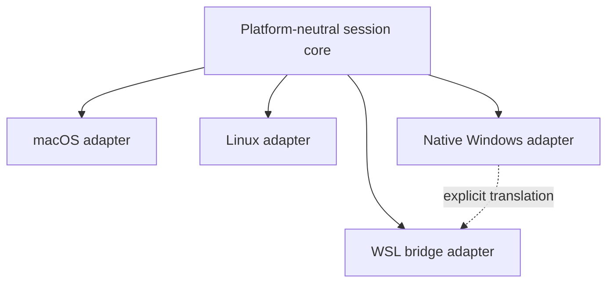
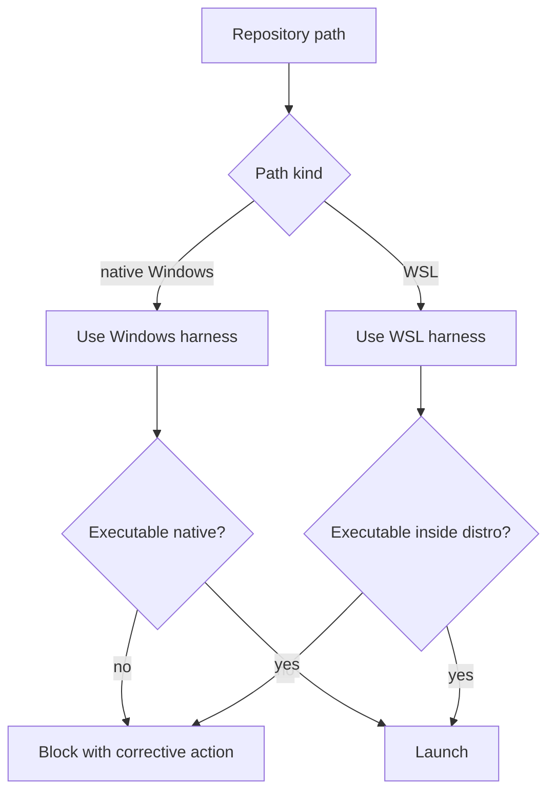
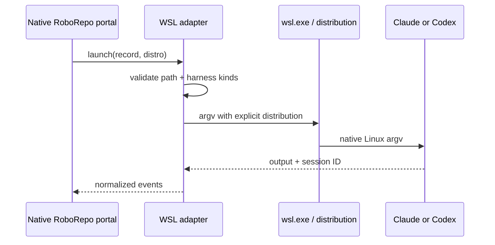

# Plan Session Launching — Milestone 3: Cross-Platform Adapters

## Summary

Extend the proven Plan-to-Session workflow beyond macOS through platform adapters. Implement Linux
first, native Windows second, and WSL bridging last. Preserve one platform-neutral session model and
API while isolating process, path, terminal, and resume behavior behind environment-specific
adapters. Cross-platform adapters must preserve the same first-class Session identity and required
Plan relationship rather than introducing platform-specific storage models.

This milestone intentionally does not retrofit cross-platform support into the initial feature.
Milestones 1 and 2 establish the model, lifecycle, safety boundary, and reliability behavior on the
user's primary macOS environment. Milestone 3 ports those stable contracts.

## Context

Cross-platform design matters early; cross-platform automation does not. Windows introduces
different process, terminal, quoting, path, and environment semantics:

- ConPTY rather than Unix TTYs;
- `wt.exe` profiles and Windows Terminal tab/window targeting;
- PowerShell and `cmd.exe` argument behavior;
- drive-letter and UNC paths;
- native Windows versus WSL harness installations;
- `C:\repo` versus `/mnt/c/repo` translation;
- different process-tree termination behavior.

Treating native Windows and WSL as one environment would create unsafe path and executable
assumptions. They must be separate execution environments joined only through an explicit bridge.



## Goals

- Keep launch records, lifecycle, API, and portal behavior platform-neutral.
- Formalize adapter contracts from the completed macOS implementation.
- Add Linux process and terminal support.
- Add native Windows process spawning and Windows Terminal/PowerShell support.
- Add WSL only after native Windows behavior is stable.
- Detect execution environment and harness location explicitly.
- Prevent native/WSL path or executable mixing.
- Preserve copy-command fallback in every environment.
- Add platform-specific capability reporting instead of hard-coded UI assumptions.

## Non-goals

- Remote SSH workers or launching on a different machine.
- Browser-hosted terminals.
- Replacing native terminal applications.
- Supporting every Linux terminal emulator in the first Linux release.
- Automatic translation of arbitrary shell scripts between Bash and PowerShell.
- Hiding platform limitations.
- Reimplementing harness authentication or native resume behavior.

## Current state

At reviewed commit `72c83be`, RoboRepo:

- uses Node 20+ ESM;
- uses `node:child_process` in multiple CLI modules;
- centralizes machine-local paths in `scripts/cli/paths.mjs` and
  `scripts/cli/state-paths.mjs`;
- contains macOS/Linux shell installation behavior in `scripts/install/`;
- has no session-launcher or cross-platform terminal abstraction yet.

This plan depends on the actual results of Milestones 1 and 2. Before implementation:

1. inspect the final session, harness, process, and terminal adapter interfaces;
2. inspect incident history and capabilities that proved necessary;
3. update every proposed filename and contract below to match the implementation;
4. do not fork a second session model for Windows.

## Proposed design

### Adapter layers

Separate harness behavior from platform behavior:

```text
modules/session-launcher/
  core/
    schema.mjs
    store.mjs
    lifecycle.mjs
    policy.mjs
  harnesses/
    claude.mjs
    codex.mjs
  platforms/
    darwin.mjs
    linux.mjs
    win32.mjs
    wsl.mjs
  terminals/
    tmux.mjs
    linux-generic.mjs
    windows-terminal.mjs
    powershell.mjs
```

| Layer | Owns | Does not own |
| --- | --- | --- |
| Core | records, lifecycle, API projections, policy | OS commands |
| Harness adapter | CLI flags, capability probe, session ID, resume argv | terminal selection |
| Platform adapter | process identity, termination, path form, environment | harness semantics |
| Terminal adapter | window/tab/pane launch | conversation or credentials |
| WSL bridge | explicit environment/path translation | guessing installation location |

### Platform capability contract

```js
{
  platform: "win32",
  environment: "native",
  capabilities: {
    processFingerprint: true,
    processTreeTermination: true,
    terminalRegistration: true,
    openNewWindow: true,
    openNewTab: true,
    targetExistingPane: false,
    pathTranslation: false,
    copyCommand: true
  }
}
```

The portal renders actions from capabilities returned by the server. It must not infer support from
`navigator.platform` because the browser and server may not describe the same execution
environment.

Capabilities describe detected facts; preferences describe user choices. Do not persist detected
executables, terminal availability, or WSL distributions as configuration because those facts can
go stale. Probe and cache them with a short server-side TTL, invalidate the cache after launch
failures, and expose `detectedAt` in diagnostics.

### Environment identity

Persist execution environment separately from OS:

```json
{
  "platform": "win32",
  "environment": "wsl",
  "distribution": "Ubuntu",
  "repositoryPathKind": "wsl",
  "harnessPathKind": "wsl"
}
```

Valid initial environment values:

| Platform | Environment | Example |
| --- | --- | --- |
| `darwin` | `native` | macOS + cmux/iTerm |
| `linux` | `native` | Ubuntu + tmux |
| `win32` | `native` | Windows Terminal + PowerShell |
| `win32` | `wsl` | Windows host launching into Ubuntu WSL |

A request is launchable only when repository and harness path kinds are compatible or an explicit
tested bridge exists.

### Path policy



Never silently pass:

- a `C:\...` cwd to a process running inside WSL;
- a `/mnt/c/...` or Linux-only path to a native Windows harness;
- UNC paths through a translator that has not declared UNC support.

Translation functions must be pure, explicit, and round-trip tested:

```js
translatePath({
  path: "C:\\projects\\roborepo",
  from: "windows",
  to: "wsl",
  distribution: "Ubuntu"
})
```

If translation is ambiguous or unavailable, return a structured unsupported result.

### Argument handling

Node `spawn(executable, args, options)` remains the baseline on every platform. Do not manually
quote the entire command or invoke a shell unless a terminal adapter requires one.

| Context | Required approach |
| --- | --- |
| Direct harness process | executable + argv, `shell: false` |
| PowerShell terminal profile | trusted static script entrypoint + encoded/structured arguments |
| `wt.exe` | argv array |
| WSL invocation | `wsl.exe` argv specifying distribution and executable |
| Copy command | adapter-specific display quoting only; never reuse as execution input |

Execution argv and human-readable copy command must be separate outputs.

### Linux rollout

Initial Linux support:

- native Claude/Codex discovery;
- process fingerprint and process-tree termination;
- tmux exact targeting;
- configurable terminal command templates from a controlled adapter catalog;
- new terminal window when a supported emulator is detected;
- copy-command fallback.

Avoid claiming universal existing-pane targeting across GNOME Terminal, Konsole, Kitty, Alacritty,
WezTerm, and other emulators. Add adapters only with reliable tests.

Keep the approved adapter catalog in code, with declarative adapter descriptors for executable
names and supported actions. User configuration may select or disable a known adapter and provide
display preferences, but it must not provide arbitrary shell templates. This preserves
configurability without creating a command-injection surface.

### Native Windows rollout

Initial native Windows support:

- Node process spawn without a shell;
- Windows process fingerprint and process-tree cancellation;
- PowerShell-friendly copy commands;
- Windows Terminal `wt.exe` new window/tab;
- configured Windows Terminal profile;
- drive-letter and UNC path validation;
- native Claude/Codex capability probes;
- terminal registry without Unix TTY assumptions.

Windows terminal identity should use an adapter-defined process/window identity rather than
fabricating a TTY.

### WSL rollout

WSL is last because it crosses two process and path domains:



Open questions such as whether the portal itself runs inside WSL versus native Windows must be
represented as distinct deployment modes and tested separately.

### API and UI

No platform-specific API routes should be required. Extend existing capability payloads:

```json
{
  "platform": {
    "id": "win32",
    "environment": "native",
    "supported": true,
    "limitations": ["existing-pane targeting unavailable"]
  },
  "terminals": [],
  "harnesses": []
}
```

The Plan/session portal surfaces should:

- show the execution environment;
- disable unsupported actions with a short reason;
- show copy-command fallback;
- require explicit WSL distribution selection when more than one is valid;
- never ask the browser to provide raw executable or repository paths.

### Cross-platform configuration

Extend the validated Sessions configuration rather than adding OS-specific config files:

| Preference | Configuration shape |
| --- | --- |
| Linux terminal | known adapter ID |
| Windows Terminal profile | profile ID/name resolved server-side |
| Default WSL distribution | exact detected distribution ID |
| Copy-command shell | enumerated `bash`, `zsh`, or `powershell` display mode |
| Disabled adapters | list of known adapter IDs |

Configuration stores preferences only. Detection determines whether a preference is currently
usable. When it is unavailable, return a structured reason and copy-command fallback rather than
silently choosing a different execution environment.

## Implementation plan

### Phase 1 — Contract extraction

- [ ] Review completed macOS adapters and Milestone 2 incidents.
- [ ] Extract platform, terminal, and process interfaces without changing session schema semantics.
- [ ] Add contract tests using fake adapters.
- [ ] Add server-side environment detection and public capability projection.
- [ ] Add TTL capability caching with explicit invalidation and diagnostics.
- [ ] Keep Darwin behavior passing unchanged.

### Phase 2 — Linux native

- [ ] Implement Linux process fingerprint and termination.
- [ ] Reuse the tmux adapter where platform-compatible.
- [ ] Implement native harness discovery and capability probes.
- [ ] Add a small approved terminal-emulator adapter set.
- [ ] Reject arbitrary executable/argument templates; configuration may select only known adapters.
- [ ] Preserve copy-command fallback for unknown terminals.
- [ ] Test native paths, symlinks, worktrees, stale terminals, and cancellation.
- [ ] Document supported distributions and terminal emulators.

### Phase 3 — Native Windows

- [ ] Establish Windows CI or a reproducible Windows test environment.
- [ ] Implement Windows process identity and tree termination.
- [ ] Implement native path classification, drive-letter normalization, and UNC validation.
- [ ] Implement Claude/Codex native executable discovery.
- [ ] Implement Windows Terminal `wt.exe` new-window/new-tab actions.
- [ ] Resolve configured Windows Terminal profiles server-side and handle missing/renamed profiles.
- [ ] Implement PowerShell display quoting separately from execution argv.
- [ ] Add terminal registration without TTY fields.
- [ ] Add packaging/install verification on Windows.

### Phase 4 — WSL bridge

- [ ] Detect WSL distributions and distinguish default from explicitly selected distribution.
- [ ] Treat configured distributions as preferences and revalidate them against current detection.
- [ ] Classify repository and harness path kinds.
- [ ] Implement explicit `wsl.exe` launch argv.
- [ ] Implement tested Windows-to-WSL and WSL-to-Windows path translation.
- [ ] Block mixed environments without a supported translation.
- [ ] Normalize WSL output and session IDs through existing harness adapters.
- [ ] Test portal-on-Windows and portal-inside-WSL deployment modes separately.

### Phase 5 — Documentation and support matrix

- [ ] Update `docs/reference/services/sessions.md`.
- [ ] Add an exact platform/environment/terminal support matrix.
- [ ] Document limitations and copy-command fallbacks.
- [ ] Update installation and packaging documentation.
- [ ] Add troubleshooting for executable discovery, profiles, distributions, and path mismatch.

## Validation

### Contract suite

Run the same adapter contract cases on every environment:

- executable available/unavailable;
- interactive and background argv;
- cwd acceptance/rejection;
- process fingerprint;
- cancellation;
- terminal register/expire/open;
- session ID extraction;
- copy-command display;
- unsupported capability response;
- stale capability-cache invalidation and unavailable configured preferences;
- no credential or absolute-path disclosure in public APIs.

### Platform matrix

| Environment | Required verification |
| --- | --- |
| macOS native | Regression suite remains green |
| Linux native | background, interactive, tmux, unknown-terminal fallback |
| Windows native | PowerShell, `wt.exe`, process-tree cancel, drive/UNC validation |
| WSL | distro selection, path translation, native Linux harness, resume |

Run on each supported platform:

```sh
npm run test:sessions
npm test
npm run pack:dry-run
```

Do not claim a platform supported from mocked tests alone. Each released environment needs one real
end-to-end run for Claude and Codex, or an explicit documented limitation when a harness cannot be
tested.

## Acceptance criteria

- Core session records and API semantics are unchanged across platforms.
- Platform and terminal behavior is isolated behind tested adapters.
- Linux native workflows support background, interactive, tmux, and copy fallback.
- Native Windows supports safe argv spawning, cancellation, PowerShell display, and Windows
  Terminal launching.
- WSL never mixes native and Linux paths/executables without an explicit tested bridge.
- Portal actions are capability-driven and explain unsupported behavior.
- Unknown terminals always retain a copy-command fallback.
- macOS behavior remains regression-tested.
- Packaging contains every new adapter and reference document.

## Risks

| Risk | Mitigation |
| --- | --- |
| Platform abstraction copies macOS assumptions | Extract contracts only after Milestones 1–2 are stable |
| Shell quoting becomes command injection | Separate execution argv from display commands; avoid shells |
| Configurable terminal templates become execution input | Allow only known adapter IDs and structured preferences |
| Windows cancellation leaves child processes | Implement and test process-tree termination |
| WSL path translation targets wrong repository | Require path-kind compatibility and round-trip tests |
| Browser reports wrong platform | Trust server capability payload, not browser platform |
| Support matrix grows without real tests | Require end-to-end evidence per released environment |
| Linux emulator fragmentation expands scope | Small adapter catalog plus copy fallback |
| Cached environment facts become stale | Short TTL, launch-failure invalidation, and visible detection time |

## Open questions

1. Which Linux distributions and terminal emulators are common enough to support initially?
2. Will RoboRepo's broader installer/package workflow support native Windows by this milestone, or
   does session launching need to wait for that dependency?
3. Should Windows Terminal profile selection be a global RoboRepo preference or terminal-registry
   metadata?
4. Which deployment mode comes first: RoboRepo portal running natively on Windows or inside WSL?
5. Is UNC-to-WSL translation required, or should UNC repositories remain native-Windows-only in the
   first release?
