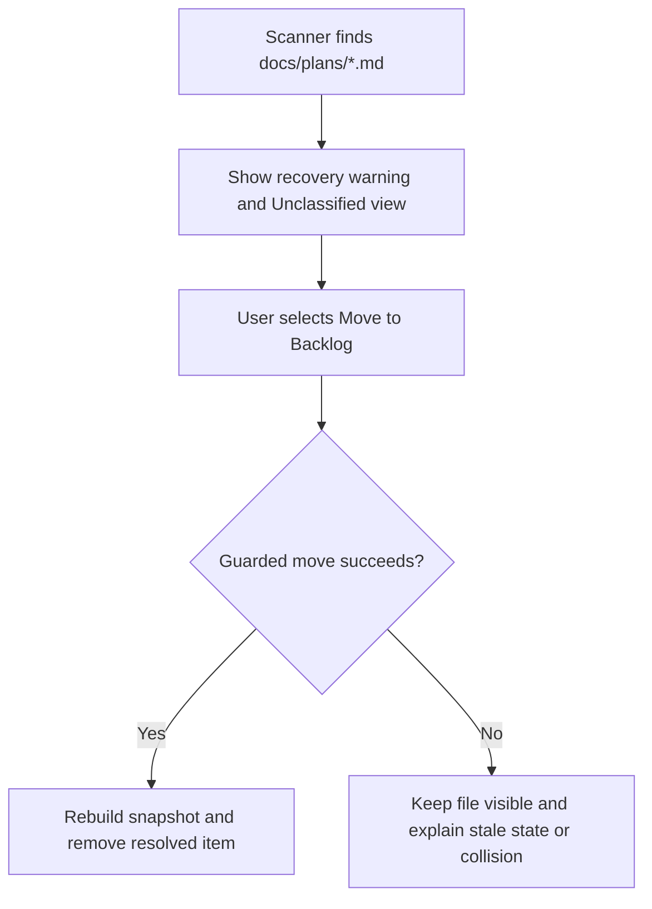

# Unclassified Plan Recovery

## Summary

Treat Markdown files directly under `docs/plans/` as misplaced documents requiring
recovery, not as a fifth lifecycle. Provide a deliberate migration path into Backlog
and a compact warning surface that reappears only when an external or manual file
operation creates another unclassified plan.

This plan is separate from lifecycle controls because canonical file mutation works
without changing how the portal discovers, navigates, or bulk-migrates legacy files.

## Goals

- Preserve visibility of every unclassified file until it is resolved.
- Migrate existing unclassified plans to Backlog through guarded lifecycle mutations.
- Hide Unclassified navigation when no misplaced plans exist.
- Reintroduce a clear recovery entry point when a new root-level plan appears.
- Never silently classify or move a document.
- Reuse lifecycle controls, stale-state handling, collision checks, and rebuilt records
  from the lifecycle-controls milestone.

## Non-goals

- Make Unclassified a selectable lifecycle destination.
- Treat Unclassified as equivalent to Backlog.
- Add lifecycle frontmatter.
- Add semantic readiness gates or repair prompts.
- Automatically resolve destination filename collisions.

## Current State

`modules/plan-docs/index.mjs` returns `unclassified` when a Markdown file is directly
under `docs/plans/`. The scanner adds a warning, and `portal/plans/app.js` adds the
Unclassified lifecycle tab only when matching records exist.

This behavior preserves discoverability, but it presents a filesystem error condition
beside normal workflow states and provides no guided cleanup.

## Proposed Design

### Recovery classification

Keep `unclassified` in scanner output and public plan records so the portal can report
filesystem truth. Exclude it from:

- lifecycle destination options;
- normal primary lifecycle navigation when empty;
- lifecycle CTAs and milestone-event configuration;
- readiness policy comparisons that assume a canonical destination.

### Recovery flow



Each plan can be moved individually through its lifecycle dropdown. If a bulk
**Move all to Backlog** action is added in a later enhancement, it must execute
independent guarded mutations and report a result per file. Do not make the batch
all-or-nothing: one collision should not prevent unrelated plans from being recovered.

The first release is per-plan only. This keeps recovery on the lifecycle mutation
endpoint already established by the lifecycle-controls plan and avoids introducing a
batch contract before actual root-level file volume demonstrates a need.

### Navigation and warning behavior

- When the count is zero, omit the Unclassified tab and recovery banner.
- When the count becomes nonzero after refresh, show a warning banner with the count
  and **Review plans**.
- **Review plans** selects the Unclassified view through the existing lifecycle state
  setter and URL synchronization.
- The recovery view shows the shared status section, but no priority control or
  lifecycle-event CTA.
- After the final file moves, select Backlog if the user is still on the now-empty
  Unclassified view and show a concise completion message.

### Migration safety

For every move:

1. Resolve the current record by repository identity and stable plan ID.
2. Confirm the expected root-relative path and `mtimeMs`.
3. Reject duplicate stable IDs before choosing a source.
4. Reject an existing Backlog destination without overwriting it.
5. Move through the canonical lifecycle mutation.
6. Replace the record with the server-returned rebuilt record.

Do not add a separate migration filesystem function. The recovery controller should
coordinate the same mutation API used by cards, drawers, and lifecycle shortcuts.

## Implementation Plan

### Domain and server

- Keep `unclassified` as a source classification in `modules/plan-docs/index.mjs`.
- Ensure lifecycle destination parsing rejects `unclassified`.
- Add a structured duplicate-ID conflict if stable identity is ambiguous.
- Do not add a bulk recovery endpoint in this milestone.

### Portal

- Move Unclassified navigation decisions into pure helpers in
  `portal/plans/state.js`.
- Add a template-backed recovery banner in `portal/plans/index.html`.
- Coordinate review and per-plan recovery from `portal/plans/app.js`.
- Reuse `<plan-status>` and the page-level mutation orchestrator.
- Preserve filters when entering the recovery view.

## Validation

- No Unclassified tab or banner appears when the count is zero.
- A root-level plan appears after refresh with an actionable warning.
- Unclassified is never offered as a destination.
- A successful move places the file in Backlog and preserves stable ID and frontmatter.
- A stale request refreshes the record without moving it.
- A destination collision leaves both files unchanged and explains the resolution.
- Duplicate stable IDs do not select an arbitrary file.
- Resolving the final item leaves the user in a valid canonical view.

Run:

```sh
npm run test:plans
git diff --check
```

## Risks and Mitigations

| Risk | Mitigation |
|---|---|
| Recovery hides a misplaced plan | Keep scanner classification and show navigation whenever count is nonzero |
| Unclassified becomes a permanent workflow state | Exclude it from destinations and normal empty navigation |
| Duplicate IDs move the wrong file | Reject ambiguous stable identity before resolving the source |

## Acceptance Criteria

- Unclassified is presented as a recoverable placement problem, not a normal lifecycle.
- Existing and newly introduced root-level plans remain visible until explicitly moved.
- Recovery reuses the canonical lifecycle mutation and all stale/collision safeguards.
- The normal Plans navigation contains only canonical lifecycle states when recovery is empty.
- No recovery operation silently moves, overwrites, or drops a plan.
- The first release resolves plans individually and does not expose a bulk action.
