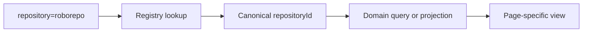

# Portal Repository Scope and Repository-First Homepage — Implementation Plan

## Summary

Add a visible repository context to the RoboRepo portal and carry that context between pages through a short URL parameter:

```text
/?repository=roborepo
/plans?repository=roborepo
/tokens?repository=roborepo&range=604800000
```

The context belongs in a new, non-sticky page header rather than the compact site header or each page's existing sticky filter bar. It is shared navigation state, but each page explicitly decides how repository context affects its data and presentation.

The unscoped homepage becomes a repository directory. Selecting a repository turns the same homepage route into that repository's dashboard. Do not add a separate repository-detail route.

The canonical repository registry is complete and is not a blocker for this work. This plan consumes it. If the completed registry does not expose a stable short browser identifier, this feature adds that small registry capability as part of its own requirements; it does not expand the CLI-surface story.

## Product Decisions

- Use `repository=<urlKey>` as the shared URL contract.
- Do not expose canonical IDs such as `git:github.com/kirinmurphy/roborepo` in browser URLs.
- Keep the canonical repository ID as the internal cross-domain foreign key.
- Put the repository selector in a non-sticky page header below the site header.
- Preserve the repository parameter while navigating between portal pages.
- Default a new unscoped browser navigation to **All repositories**.
- Make the page-header selector the only repository-scope control after migration.
- Remove the redundant Plans and Tokens repository filters after their state is migrated.
- Keep other page-specific filters in their current sticky filter bars.
- Use `/` for both the repository directory and selected-repository dashboard.
- Keep global warnings visible even when a repository is selected.
- Do not add a repository landing/detail route.
- Do not add CLI commands for URL keys unless a later user workflow requires inspecting or changing them.

## Goals

- Give users one consistent way to enter, see, change, copy, and navigate with repository context.
- Let Plans, Sessions, Tokens, Localhoster, Agent Config, and the homepage resolve the same selected repository.
- Keep URLs short, readable, bookmarkable, and stable.
- Preserve domain-specific filtering and semantics rather than applying one implicit server filter to every response.
- Make the homepage useful before and after a repository is selected.
- Reuse the completed registry for identity, visibility, resolution, associations, and display metadata.
- Preserve browser back/forward behavior and page-specific query parameters.

## Non-goals

- Reworking canonical repository identity or domain association logic.
- Adding a repository management CLI.
- Making every page support repository scope in the first implementation phase.
- Hiding global configuration, health, or installation warnings under repository scope.
- Treating a display name, folder name, telemetry label, or Localhoster identity as canonical identity.
- Adding persistent user preference storage for the selected repository.
- Adding a separate repository-detail page.

## Dependency and Blocker Status

`canonical-repository-identity-plan-v2` is a completed dependency, not an unresolved blocker.

The short URL key is a requirement of this feature because it is a browser-facing reference to an already canonical repository. It should be implemented in the shared repository module so every portal consumer resolves it consistently, but it does not require new CLI surface.

Before implementation, compare the completed registry contract with this plan:

| Registry capability | Required action |
| --- | --- |
| Stable short browser key already exists | Reuse it and document its invariants |
| Stable short browser key does not exist | Add `urlKey`, allocation, lookup, and tests in this feature |
| Registry has aliases for canonical IDs only | Add URL-key alias resolution separately |
| Browser repository summaries already expose a safe selector | Confirm it is stable, unique, short, and path-free before adopting it |

Do not recreate repository resolution in portal code merely because the completed registry implementation is unavailable in an older checkout.

## Identity Contract

Use three distinct identity fields:

| Field | Owner | Purpose | Example |
| --- | --- | --- | --- |
| `id` / `repositoryId` | Repository registry | Internal joins and persisted domain associations | `git:github.com/kirinmurphy/roborepo` |
| `urlKey` | Repository registry | Browser URLs and repository-selection API input | `roborepo` |
| `displayName` | Repository registry | User-facing label | `RoboRepo` |

### URL-key invariants

- URL-safe and human-readable.
- Unique within the local registry.
- Stable after allocation.
- Independent from `displayName`.
- Contains no absolute path, remote URL, credentials, or canonical ID.
- Never changes merely because another repository with the same base name is discovered.
- Resolves through aliases after a deliberate rename or registry merge.

Allocate the unsuffixed base key to the first eligible repository. Resolve collisions with a short deterministic suffix:

```text
roborepo
roborepo-a31f
```

The suffix should derive from stable repository identity, not discovery order alone. Collision resolution must check active keys and aliases so an old link cannot be reassigned to a different repository.

### Boundary rule

Resolve browser input once at the server boundary:



Domain data continues to store and compare `repositoryId`. Do not persist `urlKey` into Plans, telemetry events, Localhoster records, sessions, or configuration findings as their relationship key.

## Information Architecture

Use a consistent four-layer page structure:

```text
Site header
Page header: Plans · RoboRepo ▼
Sticky page filters
Page results
```

The page header:

- Contains the page title and repository selector.
- Shows **All repositories** or the registry `displayName`.
- Is rendered on every scope-aware page.
- Is not sticky.
- Provides a direct way to clear repository scope.
- Shows a distinct unavailable state for an invalid, hidden, or removed key.
- Must not silently fall back to **All repositories** when a URL contains an unresolved key.

The existing sticky bars retain lifecycle, time range, harness, model, marker, status, and other page-owned filters.

## Shared URL State

Create shared pure URL-state helpers rather than extending each page's independent serializer:

```js
export function repositoryKeyFromSearchParams(params) {
  return params.get("repository") || null;
}

export function withRepositoryKey(url, repositoryKey) {
  const next = new URL(url, location.origin);
  repositoryKey
    ? next.searchParams.set("repository", repositoryKey)
    : next.searchParams.delete("repository");
  return `${next.pathname}${next.search}${next.hash}`;
}
```

The implementation should remain frameworkless ESM and follow the existing shared portal-module pattern.

### Navigation behavior

- Global navigation carries only the shared `repository` parameter to the destination.
- Page-local parameters are not copied between unrelated pages.
- Links within a page preserve its existing local parameters unless the action intentionally resets one.
- Selecting **All repositories** removes only `repository`.
- Selecting a repository keeps compatible page-local parameters.
- Back/forward navigation re-reads both shared and page-local state.
- Copying or bookmarking the URL restores the same scope.

Examples:

| Action | Result |
| --- | --- |
| Plans → Tokens while scoped | `/tokens?repository=roborepo` |
| Change Tokens range while scoped | `/tokens?repository=roborepo&range=604800000` |
| Clear scope on Tokens | `/tokens?range=604800000` |
| Open selected repository homepage | `/?repository=roborepo` |

## Page Semantics

Repository context is not one automatic filter injected into every API. Each page owns an explicit projection:

| Page | All repositories | Selected repository |
| --- | --- | --- |
| Home | Repository directory and global warnings | Repository dashboard and global warnings |
| Plans | Plans across monitored repositories | Plans associated by canonical `repositoryId` |
| Sessions | Sessions across repositories | Sessions associated with the repository |
| Tokens | All eligible telemetry | Telemetry associated with the repository |
| Localhoster | All discovered environments | Environments associated with the repository |
| Agent Config | Global overview | Repository-local config plus separately labeled global config |
| Global health | Always visible | Still visible and clearly global |

Unsupported pages may display the selected context without filtering during staged delivery only when that limitation is explicit. They must not appear scoped while silently showing mixed repository data.

## Homepage Behavior

### Unscoped `/`

Show:

- Global warnings.
- Visible, resolved repositories from the canonical registry.
- Clear unresolved-repository treatment outside the normal resolved list.
- Compact per-repository status assembled from domain summaries:
  - active localhost environments;
  - active plans;
  - recent session activity when available;
  - recent token activity when available;
  - repository-local configuration warnings when available.

Each repository card or row selects its `urlKey` and opens `/?repository=<urlKey>`. It may also expose direct links to scoped Plans, Tokens, Localhoster, Sessions, and Agent Config when data exists.

Do not show the current generic homepage widgets as if they describe one repository before a repository is selected. Global warnings remain valid in the unscoped view.

### Scoped `/?repository=<urlKey>`

Show repository-specific summaries and entry points for:

- Localhost environments.
- Sessions.
- Plans.
- Token usage.
- Repository-local agent configuration.

Show global warnings in a separately labeled global section. A global finding must never be relabeled as repository-specific merely because a repository is selected.

### Coordination with the existing homepage plan

`portal-homepage-implementation-plan` remains the owner of generic homepage widgets, shared policy, and initial homepage route/server work. This plan owns:

- Repository directory mode.
- Selected-repository dashboard mode.
- Repository-aware widget projections.
- Repository-context navigation and page headers.

If both plans are implemented together, keep one shared homepage data aggregation layer. Do not create parallel generic and repository-specific APIs that independently recalculate the same summaries.

## Existing Repository Filters

Plans and Tokens currently treat repository as a page-local facet. Migrate them in two steps:

1. Read `repository=<urlKey>`, resolve it to `repositoryId`, and synchronize the old page control during implementation.
2. Remove the old repository control when the shared header selector is complete and tested.

Do not keep two permanent controls for the same state.

### Plans

The current Plans filter compares `record.repository.id` with a path-derived ID in `portal/plans/state.js`. Replace that comparison with the canonical `repositoryId` supplied by the shared repository registry integration.

Plans lifecycle remains page-local and continues to use its own URL behavior. Repository scope must survive lifecycle-link generation and `popstate`.

### Tokens

Tokens currently uses `repo` for a telemetry cohort label in:

- `portal/telemetry/state.js`
- `portal/telemetry/app.js`
- `portal/telemetry/api.js`
- `scripts/cli/portal-routes-telemetry.mjs`
- `scripts/cli/telemetry.mjs`
- `scripts/cli/telemetry-cohort.mjs`

Do not rename this field mechanically. Separate:

- `repository=<urlKey>`: shared portal repository context.
- Legacy telemetry `repo` label: an existing cohort/session lookup value required for older records.

Resolve repository context to canonical `repositoryId` and filter associated events by that ID. Keep an explicit legacy-association fallback for historical events that predate canonical repository IDs. The fallback must not match repositories by display name alone when the result is ambiguous.

The `/api/session` `repo` parameter currently helps locate transcript context. Treat it as session metadata, not shared portal scope.

## Server and API Contract

Expose one browser-safe repository summary endpoint from the completed registry integration, or extend its existing equivalent:

```json
{
  "repositories": [
    {
      "urlKey": "roborepo",
      "displayName": "RoboRepo",
      "providerUrl": "https://github.com/kirinmurphy/roborepo",
      "visibility": "visible",
      "resolution": "resolved"
    }
  ]
}
```

The browser may receive `repositoryId` where needed for diagnostics, but must submit `urlKey` as the shared selector.

Recommended resolution behavior:

| Input | Response |
| --- | --- |
| Active key | Resolve and return repository |
| Alias | Resolve and return canonical current key so the client can replace the URL |
| Unknown key | `404`-style repository-unavailable payload |
| Hidden repository | Unavailable unless an explicit management surface permits it |
| Unresolved repository | Show unresolved state; do not pretend it is **All repositories** |

Domain endpoints may accept the resolved `repositoryId` through internal function arguments. Avoid repeatedly resolving the same `urlKey` in multiple domain loaders during one request.

## Current Code Touchpoints

The reviewed checkout predates the completed registry implementation. Reconcile these paths against the completed code before editing.

### Shared chrome and routing

- `portal/shared/theme.js`
  - Builds global navigation from `window.ROBOREPO_PORTAL`.
  - Currently creates destination links without preserving shared query state.
  - Should delegate link generation to shared repository-scope helpers.
- `portal/shared/chrome-partial.html`
  - Owns shared header templates.
  - Keep the compact site header unchanged; add page-header markup through a new shared component/template.
- `portal/shared/base.css`
  - Owns shared page chrome and width rules.
  - Add shared page-header and repository-selector layout here.
- `scripts/cli/portal-server.mjs`
  - Owns page registration, manifest injection, shared partial rendering, and static routes.
  - Add homepage registration/API wiring and repository-summary wiring here or in focused route modules.

### Plans

- `modules/plan-docs/index.mjs`
  - Currently creates repository IDs from local roots and strips private paths for browser payloads.
  - Consume the shared canonical resolver and publish `repositoryId`; do not expose roots.
- `scripts/cli/plans.mjs`
  - Bridges plan snapshots into the portal server.
  - Pass registry-backed repository metadata into the snapshot.
- `scripts/cli/portal-routes-plans.mjs`
  - Currently returns the complete plan snapshot without repository scope.
  - Add explicit resolved repository filtering or a scoped projection.
- `portal/plans/state.js`
  - Defines repository as a local filter, builds its options, and compares path-derived IDs.
  - Remove this ownership after migration.
- `portal/plans/app.js`
  - Initializes lifecycle from `location.search` and handles `popstate`.
  - Initialize and react to shared repository context without breaking lifecycle state.
- `portal/plans/index.html`
  - Contains the existing repository filter UI.
  - Remove it after the shared page header is complete.

### Tokens

- `portal/telemetry/state.js`
  - Reconstructs the query string only from telemetry view fields.
  - Preserve shared parameters when serializing local state.
- `portal/telemetry/app.js`
  - Owns the existing `repo` dropdown, query generation, and polling state.
  - Replace repository selection with shared context while retaining legacy session metadata where required.
- `portal/telemetry/index.html`
  - Contains `#repofilt`.
  - Remove it after migration.
- `scripts/cli/portal-routes-telemetry.mjs`
  - Parses `repo` for both cohort filtering and session detail.
  - Add a distinct resolved repository argument.
- `scripts/cli/telemetry.mjs`
  - Builds analysis cache keys, available repository labels, cohort filters, and session detail.
  - Include canonical repository scope in the cache signature and repository association path.
- `scripts/cli/telemetry-cohort.mjs`
  - Filters normalized telemetry cohorts by repository label.
  - Add canonical-ID matching with a bounded legacy fallback.
- `portal/telemetry/api.js`, `portal/telemetry/modals.js`, `portal/telemetry/renders.js`
  - Preserve event/session repository metadata without confusing it with shared selection.

### Localhoster

- `modules/localhoster/identity.mjs`
  - The reviewed checkout owns identity locally; the completed registry should have replaced or delegated this logic.
- `modules/localhoster/snapshot.mjs`
  - Ensure public instances expose canonical repository association.
- `scripts/cli/portal-routes-localhoster.mjs`
  - Add a repository-scoped read projection without changing existing mutation identities.
- `portal/localhoster/app.js`, `portal/localhoster/state.js`, `portal/localhoster/templates.js`
  - Filter displayed projects/instances by canonical association while keeping settings mutations keyed by their existing internal identifiers.

### Agent Config

- `scripts/cli/config-dashboard.mjs`
- `scripts/cli/portal-routes-config.mjs`
- `portal/config/app.js`
- `portal/config/state.js`
- `portal/config/templates.js`

These currently model primarily global configuration. Add repository-local data only when it can be associated through the registry. Present global configuration separately in scoped mode.

### Homepage

The reviewed checkout does not contain a homepage entry file. Coordinate with `portal-homepage-implementation-plan` for:

- New homepage assets under `portal/home/`.
- `/` page registration in `scripts/cli/portal-server.mjs`.
- Shared summary policy and aggregation.
- Links from repository rows/cards into scoped domain pages.

### Tests

- `scripts/test/plan-docs-check.mjs`
- `scripts/test/localhoster-check.mjs`
- `scripts/test/telemetry-portal-state-check.mjs`
- `scripts/test/telemetry-cohort-check.mjs`
- `scripts/test/test-roborepo.sh`

Add focused repository-scope tests rather than overloading unrelated fixtures. Register new checks in the repo-native suite.

## Implementation Plan

### Phase 1 — Reconcile the completed registry

- [ ] Move `canonical-repository-identity-plan-v2` to `docs/plans/completed/` if the implementation is on the working branch but lifecycle has not been updated.
- [ ] Inventory the completed registry exports, API payloads, schema, aliases, and tests.
- [ ] Replace the provisional touchpoint assumptions in this plan with final implementation paths.
- [ ] Confirm every relevant domain record exposes canonical `repositoryId`.
- [ ] Confirm hidden, unresolved, deleted, and merged repositories have defined lookup behavior.

Exit criterion: this plan references the actual completed registry and contains no duplicate identity implementation.

### Phase 2 — Add the short browser identifier

- [ ] Reuse an existing stable browser key or add `urlKey` to the registry schema.
- [ ] Add pure base-slug and collision-suffix allocation functions.
- [ ] Preserve allocated keys across later discoveries and display-name changes.
- [ ] Prevent reuse of active aliases.
- [ ] Add current-key and alias lookup.
- [ ] Expose browser-safe repository summaries.
- [ ] Add allocation, collision, stability, alias, and privacy tests.

Exit criterion: `roborepo` resolves to one canonical repository without placing the canonical ID or local path in the URL.

### Phase 3 — Build shared repository URL state and page header

- [ ] Add focused shared modules for parsing, resolving, and composing repository scope.
- [ ] Add a reusable frameworkless page-header repository selector.
- [ ] Add shared styles and loading, empty, error, and unavailable states.
- [ ] Preserve `repository` in global navigation.
- [ ] Preserve page-local parameters within each page.
- [ ] Implement clear-scope, alias canonicalization, and `popstate`.
- [ ] Add DOM-independent URL-state tests.

Exit criterion: repository context remains visible and stable across navigation, refresh, bookmarking, and browser history.

### Phase 4 — Migrate Plans

- [ ] Publish canonical `repositoryId` on plan and repository records.
- [ ] Scope Plans through the resolved canonical ID.
- [ ] Preserve lifecycle URL state.
- [ ] Remove the old repository filter from the sticky filter bar.
- [ ] Test all repositories, selected repository, invalid key, and back/forward behavior.

Exit criterion: the header is the only repository selector and Plans never compares repository display names or local-path IDs.

### Phase 5 — Migrate Tokens

- [ ] Separate shared `repository` context from the legacy telemetry `repo` cohort label.
- [ ] Scope canonical events by `repositoryId`.
- [ ] Implement explicit legacy-event association behavior.
- [ ] Preserve `repository` when Tokens serializes range, harness, model, and marker state.
- [ ] Include repository scope in analysis cache keys.
- [ ] Keep session transcript lookup metadata distinct.
- [ ] Remove the old repository dropdown.
- [ ] Expand URL-state, cohort, cache, and session-detail tests.

Exit criterion: Tokens supports readable shared repository URLs without breaking historical telemetry or its local filters.

### Phase 6 — Add homepage repository modes

- [ ] Implement the unscoped repository directory.
- [ ] Implement the selected-repository dashboard on the same route.
- [ ] Reuse shared domain summary loaders and policy from the homepage plan.
- [ ] Keep global warnings visible and separately labeled.
- [ ] Add direct scoped links to supported domain pages.
- [ ] Show unresolved and unavailable states explicitly.
- [ ] Test unscoped, scoped, empty, partial-domain-failure, hidden, invalid, and alias states.

Exit criterion: `/` is a repository entry point and `/?repository=<urlKey>` is the repository dashboard without a separate detail page.

### Phase 7 — Extend remaining pages

- [ ] Scope Localhoster by canonical repository association.
- [ ] Add repository-local Agent Config projection while retaining global configuration.
- [ ] Add Sessions scope when the Sessions page exists.
- [ ] Ensure unsupported pages communicate scope limitations.

Exit criterion: every page showing the selector either correctly applies it or explicitly states why the page remains global.

### Phase 8 — Documentation and cleanup

- [ ] Update portal and repository-registry reference docs.
- [ ] Update URL examples in the completed canonical-registry plan if they expose canonical IDs.
- [ ] Remove temporary synchronization code and redundant repository controls.
- [ ] Remove stale uses of “matched repositories” where the intended state is **All repositories**.
- [ ] Verify no browser URL or public payload exposes local paths.

## Validation

Run the smallest relevant checks during each phase, then the full suite because repository context crosses shared portal navigation and multiple domains.

Required automated coverage:

- URL-key base generation and collision handling.
- First allocation remains stable after later collisions.
- Alias lookup and canonical URL replacement.
- Unknown, hidden, deleted, and unresolved keys.
- Shared navigation parameter preservation.
- Clearing scope without clearing page filters.
- Back/forward and bookmarked URL restoration.
- Plans canonical-ID filtering.
- Tokens shared/local parameter composition.
- Tokens canonical filtering and legacy telemetry fallback.
- Analysis cache separation by canonical repository.
- Localhoster canonical association.
- Homepage scoped and unscoped projections.
- Browser payload privacy.

Repo-native verification commands:

```text
npm run test:plans
npm run test:localhoster
npm run test:telemetry-portal-state
npm run test:telemetry-cohort
npm test
```

Confirm exact script names in `package.json` before implementation and add focused scripts for new repository-scope tests.

## Acceptance Criteria

- URLs use a stable short key such as `repository=roborepo`.
- Canonical IDs and absolute paths do not appear in shared portal URLs.
- Repository selection persists across portal navigation.
- The selected repository is always visible in a consistent non-sticky page header.
- Plans and Tokens no longer have duplicate repository controls.
- Page-local filters continue working and remain bookmarkable.
- An invalid repository key never silently produces an all-repositories view.
- Internal joins use canonical `repositoryId`.
- Historical telemetry remains accessible through explicit legacy association rules.
- `/` shows the repository directory when unscoped.
- `/?repository=<urlKey>` shows that repository's dashboard.
- Global warnings remain visible and clearly global in scoped mode.
- No separate repository-detail route is introduced.
- Full repository tests pass.

## Risks and Controls

| Risk | Control |
| --- | --- |
| Short-name collisions make links unstable | Persist allocated keys and reserve aliases |
| Shared state erases page filters | Compose from current `URLSearchParams`; test exact round trips |
| Duplicate controls drift apart | Synchronize only during migration, then remove page controls |
| Telemetry label is mistaken for identity | Keep legacy `repo` and canonical `repositoryId` as separate concepts |
| A broken key silently broadens data | Render repository-unavailable state |
| Scope implies filtering on a global-only page | Separate global data visually and state page semantics explicitly |
| Homepage duplicates expensive analysis | Reuse server aggregators and existing caches |
| Completed registry is reimplemented from an older checkout | Reconcile its final API before Phase 2 |

## Open Questions

These are implementation checks, not blockers:

1. Does the completed registry already expose a stable browser-safe key under another name?
2. Which completed registry alias states distinguish rename, merge, hidden, and deleted repositories?
3. Which homepage aggregation work will land first under `portal-homepage-implementation-plan`?
4. How much historical telemetry can already resolve to canonical repository IDs without fallback?
