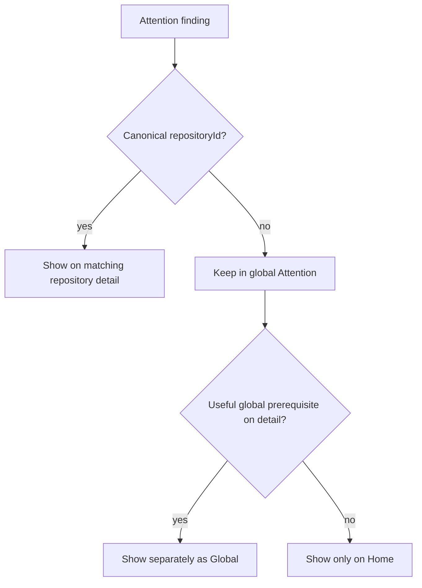

# Build a Repository-First Portal Home and Detail View

## Summary

Replace the current Agents-at-`/` landing page with a repository-first Home and add a persistent detail route for each repository.

Home should answer "what repositories does RoboRepo know about?" before trying to become a generic dashboard. It uses the global repository model delivered by `pljvmyh`, shows compact cross-domain status on each repository, and links directly into the existing domain pages with canonical repository scope.

Repository detail lives at `/repositories/<urlKey>`. It provides a stable, bookmarkable place to understand one repository, see its activity and configured discovery sources, and enter Plans, Tokens, Agents, or Localhost as appropriate.

The page also retains the useful "Attention" intent from the superseded homepage plan, but recasts it around the repository-first information architecture. Repositories remain the dominant Home content. Attention is a secondary global section, and repository-specific findings appear on a detail page only when they can be associated by canonical `repositoryId`.

This story supersedes the still-relevant homepage behavior from `portal-homepage-implementation.md` and `portal-homepage-repository-section.md`; those two backlog files should be removed when these replacement plans are adopted.

## Goals

- Make `/` the portal's stable Home and default open destination.
- Put the repository directory first on Home.
- Add `/repositories/<urlKey>` as the persistent repository detail route.
- Reuse canonical repository identity and global repository-source/scope infrastructure from `pljvmyh`.
- Show concise per-repository runtime, plan, telemetry, agent-config, and warning status without duplicating full domain pages.
- Keep Localhost as a separate operational management page.
- Preserve useful Attention requirements from the older homepage plan: token-heavy chats, telemetry anomalies, large agent resources, and installation health.
- Reuse shared domain calculations rather than reimplementing warning policy in Home JavaScript.
- Make partial domain failures degrade independently.
- Keep global findings visibly global; do not relabel them as repository-specific because a detail page is open.
- Keep normal browser payloads free of absolute paths and sensitive telemetry prompt/result content.

## Non-goals

- Replacing Plans, Tokens, Agents, or Localhost with Home/detail views.
- Adding one-repository filtering to Localhost.
- Implementing repository-level agent configuration.
- Creating a modal-only repository detail experience.
- Turning Home into a generic grid of duplicate domain dashboards.
- Running full `roborepo verify` from Home.
- Adding desktop/system notifications.
- Making portal policy thresholds user-editable.
- Exposing repository checkout paths on Home or repository detail pages.
- Reimplementing repository discovery/source management owned by `pljvmyh`.

## Information Architecture

```text
/
├── Repositories
│   ├── RoboRepo
│   ├── Arcade
│   └── ...
└── Attention
    ├── Token usage
    ├── Telemetry
    ├── Agent config
    └── Health

/repositories/roborepo
├── Repository identity and activity
├── Attention for RoboRepo
├── Plans summary
├── Runtime summary
├── Tokens / recent sessions
├── Agent configuration status
└── Repository sources / associations
```

Home is always an unscoped directory. It does not use `/?repository=roborepo`.

Repository-specific navigation uses either:

```text
/repositories/roborepo
/plans?repository=roborepo
/tokens?repository=roborepo
/config?repository=roborepo
```

This keeps two concepts separate:

- **Repository detail route** = "tell me about this repository."
- **Repository scope query** = "show this existing domain page for this repository."

## Current State

Before this story:

- `scripts/cli/portal-server.mjs` serves Agents at `/` and keeps `/config` as an alias.
- `pljvmyh` is expected to make `/config` the canonical Agents navigation target while leaving `/` as a temporary compatibility/default route.
- There is no `portal/home/` page.
- The canonical repository registry and browser-safe repository list/detail APIs already exist, with `pljvmyh` extending them with `urlKey`, global sources, private local-root resolution, and shared scope.
- Repository summaries already distinguish capabilities from enrollments and intentionally strip filesystem paths.
- Localhost already groups running instances by canonical repository and remains the operational runtime page. `h4tqm2wz` makes those repositories persist beyond their processes and adds a lifecycle (`active`/`idle`/`stale`/`deleted`), so the repository directory here can list a repository that is not currently running and show why.
- Plans and Tokens provide deeper domain views.
- Config/Agents provides global agent resource/configuration data; repository-level config remains future work.
- Telemetry already computes anomaly/session data and a cumulative concern threshold.
- Config already computes context-cost warnings.
- Doctor and verify are separate concepts; Home must report doctor-style health findings without implying full verification.
- The older homepage plan proposed separate Active Apps and Plans Summary widgets. In the repository-first design, their useful data moves into repository rows/cards and repository detail instead of remaining separate global widgets.

## Proposed Design

### 1. Home route and navigation

Change portal routing so:

- `/` serves a new `home` page and becomes the default for `roborepo serve` / `roborepo web` open behavior;
- `/config` becomes the canonical Agents route;
- `/localhoster`, `/plans`, and `/tokens` remain stable;
- Home is the first portal navigation item;
- clicking Home always clears repository scope because Home is the repository directory;
- existing saved `/config` links remain valid.

`/` should no longer be a compatibility alias for Agents once Home lands.

### 2. Repository directory is the primary Home content

Render visible resolved repositories from the canonical registry. Hidden repositories remain available only through repository management from `pljvmyh`.

Each repository row/card should be compact enough to scan and useful enough to choose a destination.

Recommended summary fields:

| Summary | Meaning |
| --- | --- |
| Display name | Canonical registry display name |
| Activity | Repository lifecycle state from `h4tqm2wz` — `active`, `idle`, or `stale`. Soft-deleted repositories are excluded from the directory. |
| Runtime | Active Localhost app/group count or concise status |
| Plans | Active plan count and total plan count |
| Tokens / sessions | Recent associated session/activity summary when available |
| Agents | Global-only / repository config coming soon until that feature lands |
| Attention | Count/highest severity of findings associated with this repository |
| Sources | Compact discovery/source provenance, not filesystem paths |

Direct actions may link to:

- **View repository** → `/repositories/<urlKey>`
- **Plans** → `/plans?repository=<urlKey>`
- **Tokens** → `/tokens?repository=<urlKey>`
- **Agents** → `/config?repository=<urlKey>`
- **Localhost** → `/localhoster` when runtime capability exists

Because Localhost is intentionally unscoped, its link opens the operational list rather than pretending a one-repository filter exists.

If the registry is empty, Home should present the zero-configuration model established by `pljvmyh`: start a local project or add a repository/folder through repository management.

Unresolved repository/activity signals should not be rendered as fake canonical repository cards. Show them separately as an Attention/unresolved item with a path to association or management.

### 3. Persistent repository detail route

Add:

```text
/repositories/<urlKey>
```

Use a persistent route rather than a modal so repository detail is bookmarkable, supports back/forward navigation, and has room to grow.

Resolve `urlKey` at the server boundary. Normal detail data remains keyed internally by canonical `repositoryId`.

The first version should contain:

- canonical display name and provider URL when available;
- activity/resolution/visibility state;
- discovery provenance and local-root count/kinds;
- configured-source coverage summary;
- repository-specific Attention findings;
- Plans summary and scoped link;
- Localhost runtime summary and unscoped Localhost link;
- recent Tokens/session summary and scoped link;
- Agents status and scoped link;
- timestamps useful for understanding last seen/last activity.

Do not expose raw local roots, Git config, credentials, telemetry prompts/results, or internal alias graph.

The current repository service already separates associations from the list payload so detail can lazy-load richer provenance. Reuse/extend that boundary rather than duplicating repository lookup logic.

### 4. Cross-domain summary aggregation

Home/detail should aggregate existing service functions server-side. Do not fetch the portal's own domain HTTP endpoints from the server.

Add a focused aggregate boundary, for example:

```text
GET /api/home
GET /api/repositories/<urlKey>/overview
```

Exact endpoint naming may follow existing route conventions, but the responsibilities are:

- resolve repositories once;
- fan out to independent domain summary loaders;
- join domain data by canonical `repositoryId`;
- return partial results when one domain fails;
- keep expensive analysis behind existing caches/policies;
- avoid exposing domain-internal raw records when a summary is sufficient.

Each domain loader must run behind its own timeout and cancellation boundary. Apply this uniformly to Localhost, Plans, Telemetry, Doctor, and any later domain loader; do not let one slow loader consume the aggregate request budget. A timeout becomes a partial failure result such as `{ "domain": "telemetry", "status": "timeout" }`. The aggregate response still completes, includes the affected domain name, preserves any stale successful data already available for that domain, and marks that data stale rather than empty.

Suggested Home shape:

```json
{
  "generatedAt": "ISO-8601",
  "repositories": [],
  "attention": [],
  "unresolved": [],
  "partialFailures": []
}
```

Suggested repository overview shape:

```json
{
  "repository": {},
  "runtime": {},
  "plans": {},
  "telemetry": {},
  "agentConfig": {},
  "attention": [],
  "partialFailures": []
}
```

These examples describe boundaries, not exact schema names.

### 5. Active Apps becomes repository runtime status

Preserve the useful behavior from the older Active Apps widget without creating a separate global widget.

For each repository:

- reuse the Localhost snapshot;
- count/show active, non-hidden HTTP apps and Compose/runtime groups;
- include concise status and entrypoint/origin where safe/useful on detail;
- keep Localhost's own cache/refresh policy authoritative;
- preserve unsupported-platform and refresh-failure signals;
- link to `/localhoster` for operational actions.

Do not copy Localhost alias, hide, favorite, association, history, or settings controls onto Home.

### 6. Plans Summary becomes repository plan status

Preserve the useful plan overview from the older homepage plan inside repository summaries/detail.

For each repository, provide:

- active plan count;
- backlog count when useful;
- total plan count;
- recently changed plan count/list on detail.

Use a trailing seven-day window for "recently changed" activity. Prefer:

1. Git last-commit timestamp for the plan file;
2. filesystem modification time when Git history is unavailable.

Label it **Recently changed** unless a true creation timestamp is available. Do not infer creation from first discovery.

Do not add a separate global Plans Summary widget to Home.

### 7. Attention is secondary global content

Repositories are the primary Home content. Below them, render one consistent Attention section for actionable cross-domain findings.

Preserve the four useful categories from the older homepage design:

| Category | Required behavior |
| --- | --- |
| Token usage | Count recent sessions whose cumulative total exceeds the shared concern threshold |
| Telemetry | Surface existing actionable anomaly/loop/spike findings |
| Agent config | Reuse context-cost/resource warnings |
| Health | Surface structured doctor findings and freshness |

Use one warning model with stable IDs, domain, severity, title, summary, timestamp when available, `repositoryId` when association is valid, and target URL.

A finding with no reliable repository association remains global. On repository detail, show only findings whose canonical `repositoryId` matches that repository, plus a separately labeled global-health area only when the information is useful to the repository workflow.

A failure in one Attention domain must not suppress repositories or other Attention categories.

### 8. Shared portal policy

Retain the useful shared-policy requirement from the older homepage plan so Home and existing pages cannot drift.

Create or reuse a server-owned policy module for values such as:

```js
export const portalPolicy = {
  recentWindowMs: 7 * 24 * 60 * 60 * 1000,
  telemetry: {
    cumulativeConcern: {
      fallbackTokens: 20_000_000,
      minimumTokens: 10_000_000,
      percentile: 0.9,
      multiplier: 2
    }
  },
  doctor: {
    staleAfterMs: 10 * 60 * 1000
  }
}
```

Confirm these values against the current telemetry implementation before moving them. The point is one shared owner, not preserving stale constants blindly.

The shared cumulative concern contract takes the repository scope (`all` or a canonical `repositoryId`), time window, and active cohort/filter as inputs. `analyzeTelemetry` computes the threshold once for that input tuple and returns `cumulativeConcern.tokens` as the canonical value. Telemetry's chart and Home's Token usage Attention consume that same computed value; when the input scope is global, Home must not recompute a repository-specific threshold for the same global finding. If the current numeric `cumulative_concern` response needs temporary compatibility during refactor, derive it from `cumulativeConcern.tokens`, assert both values are equal in tests, and remove duplicate representations once all current consumers use the shared shape. Add tests for global and selected-repository views.

### 9. Token-heavy chats and telemetry findings

For the trailing recent window:

- treat cumulative session token total and per-turn statistical spikes as different signals;
- Token usage Attention uses the cumulative concern threshold;
- Telemetry Attention can include existing spikes, loops, anomalies, and other actionable findings;
- deduplicate repeated findings by stable ID or deterministic key;
- link to `/tokens` with the relevant repository scope and compatible time-range/filter state when available;
- never expose prompt/result content in Home payloads.

Repository detail can show the repository's recent session summary without embedding the full telemetry analysis page.

### 10. Agent resource warnings

Reuse Config/Agents context-cost calculations and warning boundaries.

Home/detail should consume a summary such as:

- count;
- highest severity;
- largest few affected resources where appropriate.

Do not independently calculate token cost or file size in browser code.

Until repository-level agent configuration exists:

- global Agent config warnings remain global unless a current resource can be reliably associated with a repository;
- a repository detail link to Agents may land on the `pljvmyh` repository-config placeholder.

### 11. Structured doctor integration

Preserve the older homepage health requirement by extracting or reusing doctor checks as structured data while keeping CLI text output as an adapter.

Structured findings should contain at least:

```json
{
  "id": "stable-check-id",
  "status": "warning",
  "domain": "install",
  "summary": "Plain-language finding",
  "remediation": "Action the user can take"
}
```

Execution/caching rules:

- run once when the portal starts;
- cache the last completed structured result in memory;
- refresh automatically only after the shared stale interval;
- provide a protected manual refresh action;
- deduplicate concurrent refreshes with one in-flight promise;
- keep the previous successful result visible if refresh fails, marked stale with the refresh error;
- do not run full `verify` automatically.

### 12. Repository detail and global Attention relationship

Repository detail should not become a second global dashboard.

Use this rule:



This prevents a selected repository from making a machine-wide installation warning look repository-specific.

## Browser Implementation

Create a framework-less Home surface under `portal/home/` following current portal conventions:

- `portal/home/index.html`
- `portal/home/app.js`
- `portal/home/api.js`
- `portal/home/templates.js`
- `portal/home/styles.css`

Add focused repository-detail browser files under a clear ownership boundary, either a dedicated `portal/repository/` surface or a shared Home/repository feature folder. Match the current portal page routing convention rather than constructing dynamic markup in route code.

Follow the loaded code-style and JavaScript conventions:

- keep page `app.js` files as wiring/orchestration;
- keep server/domain calculations out of browser code;
- use named ESM exports;
- put reusable multi-element markup in real HTML `<template>` elements rather than nested `createElement` builders or JS template strings;
- split files by responsibility before they become large mixed orchestrator/rendering modules.

### Refresh behavior

- poll Home aggregate state at a modest interval appropriate to runtime freshness;
- allow Localhost's established cache/refresh policy to govern discovery;
- do not trigger doctor on every Home poll;
- repository detail may refresh active/runtime summaries without reloading stable repository metadata;
- correctness and clear stale/error states matter more than fine-grained DOM patch optimization.

## Routing and Navigation

After this story, the canonical page layout is:

| Route | Page |
| --- | --- |
| `/` | Home |
| `/config` | Agents |
| `/plans` | Plans |
| `/tokens` | Tokens |
| `/localhoster` | Localhost |
| `/repositories/<urlKey>` | Repository detail |

Navigation behavior:

- Home always opens unscoped `/`;
- repository cards open `/repositories/<urlKey>`;
- repository detail links into Plans/Tokens/Agents with `repository=<urlKey>`;
- Localhost links remain unscoped;
- shared scoped navigation among Plans/Tokens/Agents continues to follow `pljvmyh`;
- browser back/forward works across Home → detail → domain pages.

## Code Touchpoints

### Portal routing/chrome

- `scripts/cli/portal-server.mjs`
  - register Home;
  - make `/config` the Agents page rather than an alias-only path;
  - route `/repositories/<urlKey>` to repository detail;
  - make `/` the default open destination.
- `portal/shared/theme.js`
  - add Home navigation and preserve the scope rules from `pljvmyh`.
- `portal/shared/chrome-partial.html`
- `portal/shared/base.css`
  - reuse shared page chrome and repository controls.

### Home and repository detail

- New `portal/home/*`
  - repository directory, Attention, empty/loading/error/partial-failure states.
- New focused repository-detail browser surface
  - identity/activity, summaries, findings, scoped links.
- `scripts/cli/portal-routes-repositories.mjs`
- `scripts/cli/repositories.mjs`
  - extend current browser-safe detail/associations service with overview data or delegate to a focused aggregation service.

### Domain summary sources

- Localhost service/snapshot code
  - active runtime counts/status only; management remains on Localhost.
- Plans service/snapshot code
  - repository plan counts and recently changed timestamps.
- Telemetry analysis/service code
  - recent session summaries, cumulative concern, anomalies.
- Config/context-cost service code
  - resource warning summaries.
- Doctor implementation
  - structured findings and cached refresh adapter.
- New shared portal policy module
  - recent window, telemetry concern policy, doctor freshness.

## Implementation Plan

### Phase 1 — Routing and base surfaces

- [ ] Add Home to the page manifest and serve it at `/`.
- [ ] Make `/config` the canonical Agents route.
- [ ] Update `roborepo serve` / `roborepo web` default-open behavior to `/`.
- [ ] Add repository detail routing by `urlKey`.
- [ ] Add Home and repository-detail static/template modules following portal conventions.
- [ ] Verify old domain deep links remain valid.

### Phase 2 — Repository directory and detail data

- [ ] Build server-side Home repository summaries by canonical `repositoryId`.
- [ ] Render visible resolved repositories first.
- [ ] Add zero-repository state that points to runtime discovery or repository management.
- [ ] Keep unresolved activity outside normal repository cards.
- [ ] Add repository detail identity, activity, source/association, and local-root-count data.
- [ ] Add direct Plans/Tokens/Agents/Localhost links using the scope rules from `pljvmyh`.
- [ ] Add partial-failure handling per repository/domain.

### Phase 3 — Runtime and Plans summaries

- [ ] Reuse Localhost snapshots for active runtime status without duplicating management controls.
- [ ] Add repository plan counts.
- [ ] Add seven-day recently changed plan data on repository detail.
- [ ] Use Git last-commit timestamp with filesystem mtime fallback.
- [ ] Keep Home compact; do not recreate separate Active Apps or Plans Summary widgets.

### Phase 4 — Shared portal policy and telemetry Attention

- [ ] Establish one server-owned recent-window and cumulative-concern policy.
- [ ] Refactor telemetry/Home to consume the same computed concern threshold.
- [ ] Add token-heavy session findings based on cumulative session totals.
- [ ] Add existing actionable telemetry anomalies/loops/spikes.
- [ ] Deduplicate findings and associate them by canonical `repositoryId` when possible.
- [ ] Add scoped target URLs without leaking sensitive telemetry content.

### Phase 5 — Agent resource and health Attention

- [ ] Reuse Config context-cost/resource warnings.
- [ ] Extract/reuse structured doctor findings.
- [ ] Add doctor cache freshness, manual protected refresh, in-flight deduplication, and stale-success behavior.
- [ ] Keep global findings global when no reliable repository association exists.
- [ ] Render repository-associated findings on matching detail pages.

### Phase 6 — Browser polish and accessibility

- [ ] Add consistent healthy/loading/empty/error states.
- [ ] Ensure repository cards and detail navigation are keyboard accessible.
- [ ] Preserve focus across refreshes where practical.
- [ ] Avoid rebuilding open interactive controls during polling.
- [ ] Use shared warning/severity presentation rather than domain-specific visual vocabularies.

### Phase 7 — Documentation and cleanup

- [ ] Remove the superseded backlog plans `portal-homepage-implementation.md` and `portal-homepage-repository-section.md`.
- [ ] Update portal reference docs for Home, Agents `/config`, repository detail, and default open behavior.
- [ ] Update repository docs with detail-route and overview payload behavior.
- [ ] Remove stale docs that describe `/` as Agents.
- [ ] Confirm no old generic homepage widget architecture remains documented as current backlog work.

## Validation

Use focused domain tests while building the aggregators, then run the full suite because Home crosses routing and several shared domains.

Existing repo-native checks to preserve and extend:

```text
npm run test:repositories
npm run test:repositories-service
npm run test:repositories-api
npm run test:localhoster
npm run test:plans
npm run test:plans-portal-state
npm run test:telemetry
npm run test:telemetry-policy
npm run test:telemetry-portal-state
npm run test:context-cost
npm test
```

Add focused coverage for:

- `/` serving Home and `/config` serving Agents;
- default portal open behavior;
- repository detail URL-key resolution, aliases, hidden/unknown keys, and browser history;
- zero-repository and unresolved-repository states;
- repository card summaries joining by canonical `repositoryId`;
- Localhost runtime data appearing without Localhost management controls;
- recent plan timestamp precedence and seven-day boundaries under a fixed clock;
- shared telemetry concern policy producing the same effective threshold for chart and Home;
- token-heavy sessions using cumulative total rather than delta spikes;
- telemetry finding deduplication and target URLs;
- Config resource-warning reuse;
- structured doctor cache freshness, concurrent refresh deduplication, and refresh failure;
- global versus repository-associated Attention findings;
- partial Home/detail responses when one domain fails;
- no absolute paths or sensitive telemetry prompt/result content in browser payloads.

## Acceptance Criteria

- Opening RoboRepo's portal lands on `/` Home.
- Agents has a stable canonical `/config` route.
- Home begins with a repository directory backed by visible canonical repositories.
- An installation with no known repositories explains that repositories can appear through Localhost activity or be added through repository management.
- Every repository card can open `/repositories/<urlKey>`.
- Repository detail is persistent/bookmarkable and shows identity, activity, source/association summary, and domain entry points.
- Plans/Tokens/Agents links use the shared canonical repository scope; Localhost remains unscoped.
- Runtime and plan summary data replace the old separate Active Apps and Plans Summary homepage widgets.
- Recently changed plans use a seven-day window and do not invent creation dates.
- Home includes one secondary Attention section covering Token usage, Telemetry, Agent config, and Health.
- Home's token concern and the telemetry chart use one shared server-owned policy.
- Doctor results are structured, cached, timestamped, refreshable, and distinct from full verify.
- Findings appear on repository detail only when associated through canonical `repositoryId`; global findings remain clearly global.
- Independent domain failures do not prevent repository navigation or healthy domains from rendering.
- Normal Home/detail payloads contain no absolute local paths, credentials, internal alias graph, or raw telemetry prompts/results.
- Localhost remains a standalone operational page.
- The two superseded homepage backlog files are removed.
- Targeted tests and `npm test` pass.
