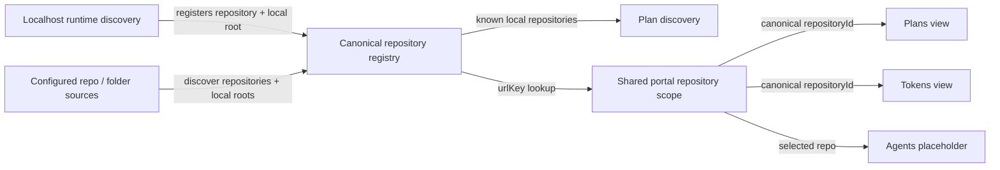

# Unify Repository Discovery and Portal Scope

## Summary

Make the canonical repository registry the portal-wide source of truth for which repositories RoboRepo knows about and which repository the user is viewing.

RoboRepo should work with no repository setup when Localhost discovers a running project, then let the user add exact repositories or folders containing repositories when they want broader coverage. Plans should consume that global repository set instead of owning a separate "Project Folders" universe.

This story also adds one shared browser repository scope for pages where selecting a repository creates a meaningful alternate view. Plans and Tokens replace their page-local repository filters with that scope. Agents accepts the scope but shows a repository-level configuration placeholder until its dedicated story lands. Localhost remains an operational repository list and does not filter down to one selected repository.

The current `/` Agents route remains in place during this story. Scoped Agents links should use the stable `/config` alias so the follow-up homepage story can claim `/` without changing repository-scoped URLs.

## Scope Handoff

`h4tqm2wz` (Localhost Workspace Model) implements the Localhost half of this story's Phase 1 —
persisting repositories and their checkout roots from runtime discovery, plus the private
`rootId -> path` index in §2 — so the workspace model can be settled on the page where it is
visible. It also adds a repository lifecycle (`active`/`idle`/`stale`) and visibility-based hiding,
which this story specified only as "report stale without deleting canonical history".

Treat those as delivered prerequisites rather than work to redo. What remains here is unchanged:
user-configured repository sources, `urlKey`, shared scope, and the Plans/Tokens migration.

## Goals

- Make Localhost discovery the zero-configuration baseline for recognizing repositories.
- Let users add one exact repository or a folder containing many repositories from a global repository-management surface.
- Remember a discovered local checkout after its process stops so Plans and later repository features can continue using it.
- Make known local repositories automatically eligible for plan discovery; do not require a second Plans enrollment step.
- Move repository-source configuration out of Plans.
- Add stable, readable `repository=<urlKey>` browser scope.
- Replace the Plans and Tokens repository selectors with the shared scope.
- Preserve page-local filters and browser history.
- Keep Localhost unscoped.
- Give Agents a truthful repository-scoped placeholder until repository-level agent configuration is implemented.
- Preserve privacy: normal repository list/detail/scope payloads and URLs must not expose absolute local paths; only the protected local repository-management settings surface may read or display configured source paths.

## Non-goals

- Building the repository-first homepage or repository detail page; `jqi1dof` owns those surfaces.
- Implementing repository-level agent configuration.
- Filtering Localhost to a single repository.
- Making every repository-discovery source user configurable.
- Removing the general enrollment concept from the registry for domains that may still need explicit opt-in.
- Reworking canonical Git identity, alias resolution, or cross-domain `repositoryId` joins already delivered by `canonical-repository-identity-plan-v2`.
- Exposing local checkout paths through repository APIs.

## Concept Model

The repository registry remains the identity layer. This story changes how repositories enter that registry and how portal pages select one.

| Concept | Meaning | Source of truth |
| --- | --- | --- |
| Canonical repository | One logical repository known to RoboRepo | Repository registry `repositoryId` |
| Automatic discovery | Repository observed from runtime activity | Localhost discovery provenance |
| Repository source | User-configured exact repo or parent folder used to find additional repositories | New global repository-source settings |
| Local root | One checkout/worktree path for a canonical repository | Private local-root store keyed by opaque `rootId` |
| Repository visibility | Whether a canonical repository participates in normal portal views | Registry `visibility` |
| Repository scope | Which repository a scope-aware portal page is showing | Browser `repository=<urlKey>` |
| Domain data | Plans, telemetry, agent config, runtime state, health associated with a repository | Domain records joined by canonical `repositoryId` |



### Repository recognition rule

A repository recognized through either automatic Localhost discovery or an explicit repository source becomes globally known. When RoboRepo has a valid local root for that repository, Plans should inspect that repository for `docs/plans` without requiring a separate "Include plans" action.

The relationship is intentionally bidirectional:

- discovering a repository can expose its plans;
- discovering a repository through an explicit source can register the repository even when it has no plan documents;
- plan files never create a second repository identity separate from the global registry.

## Current State

The canonical registry is already implemented under `modules/repositories/`. It stores discovery provenance, opaque local-root IDs, visibility, resolution, activity, aliases, capabilities, and enrollments. Browser-safe summaries intentionally omit filesystem paths.

Current gaps:

- `modules/repositories/schema.mjs` has no stable browser `urlKey`.
- `registerLocalRoot()` persists only an opaque `rootId`; there is no general reverse mapping from that ID to a checkout path.
- Localhost can remember offline project metadata, but its normal saved project records do not preserve a canonical-repository checkout path. Docker Compose has a special `repoPath` exception.
- Plans stores `discoveryRoots` in `~/.roborepo/plan-docs/settings.json` and recursively searches those roots.
- The Plans UI owns the "Project Folders" form and can accept multiple roots. An exact repository path and a broad parent path can already coexist, but this configuration is Plans-specific.
- `scripts/cli/repositories.mjs` currently treats Plans enrollment as an explicit operation that may add an exact repository path to Plans discovery roots.
- Plans has a page-local repository filter.
- Tokens has a page-local `repo` cohort selector whose semantics must not be mechanically conflated with canonical repository scope.
- Localhost already renders one operational card per resolved repository and has Localhost-specific hide/favorite behavior.
- Agents is currently the default `/` page; `/config` is a stable alias.
- Shared portal navigation does not preserve repository state between pages.

## Proposed Design

### 1. Global repository sources

Introduce server-owned repository-source settings under the global repository subsystem rather than Plan Docs.

Each configured source represents one of two intents:

| Source kind | Example | Behavior |
| --- | --- | --- |
| `repository` | `<projects>/client-a/app` | Register only that repository |
| `directory` | `<projects>/personal` | Discover eligible repositories beneath that directory using bounded traversal |

The UI may infer the source kind when a path is added only for paths it can read and classify confidently. Missing or unreadable paths are `unresolved` at entry time; do not automatically classify them as `repository` or `directory`. Require the user to choose the intended source kind for unresolved paths, persist that selected intent, and reuse it unchanged during future refreshes. If a previously unresolved path later becomes readable, refresh behavior must still honor the persisted intent and must not broaden discovery beyond what the user configured.

Source records need stable opaque IDs so enrollment/provenance and removal do not depend on the path string. The path is machine-local private state and must never cross the browser boundary except as user-entered/readable settings data in the protected management surface.

Repository-source traversal should reuse the existing bounded Plans traversal rules where appropriate:

- stop descending once an eligible repository root is found;
- ignore configured heavy/generated directories;
- guard symlink cycles;
- enforce depth, time, and repository-count limits;
- report truncated or unreadable branches instead of silently pretending discovery is complete.

Do not make Plans own these limits after migration. Move reusable repository walking to the repository domain and let Plans consume its result.

### 2. Private local-root path index

**Delivered by `h4tqm2wz`.** The index below, its invariants, and the Localhost writer are built
there. This section remains the specification both plans work from; configured-source refresh
(§1) writes to the same index.

Keep the registry's browser-safe identity model: registry records continue to reference opaque `rootId` values rather than absolute paths.

Add a private local-root index owned by the repository subsystem:

```text
repositoryId
  └── rootId
       ├── absolute local path
       ├── kind: primary | clone | worktree
       ├── firstSeenAt
       └── lastSeenAt
```

The exact file/module shape is an implementation detail, but the following invariants are required:

- absolute paths stay in local server-side state only;
- a `rootId` resolves to at most one current path;
- a repository can have multiple clones/worktrees;
- Localhost discovery updates the mapping whenever it confidently resolves a checkout;
- configured repository sources update the same mapping;
- a process going offline does not delete the mapping;
- stale/missing paths are detected during refresh and reported without deleting canonical repository history;
- browser-safe repository summaries continue to expose root counts/kinds only.

Registry and local-root updates must be serialized or committed atomically across Localhost discovery and configured-source refresh. Concurrent writers must merge by `repositoryId` and `rootId`, preserve all known roots and provenance entries, and apply visibility changes through an explicit conflict rule rather than last-writer-wins replacement. The persistence flow must write registry identity and private root mapping as one logical update, or recover to the previous complete state after a failed write. Add a concurrent-refresh regression test that exercises Localhost discovery and configured-source refresh updating the same repository before this state feeds Plans, Tokens, or Home.

### 3. Localhost as zero-configuration discovery

**Delivered by `h4tqm2wz`.** The five-step flow below is implemented there, along with the
lifecycle that decides when a remembered repository is stale rather than merely inactive.

When Localhost resolves a running app to a repository and checkout root:

1. resolve canonical `repositoryId`;
2. record Localhost discovery provenance;
3. register the opaque local root in the registry;
4. persist the private `rootId -> path` mapping;
5. make the repository available to other domains immediately.

A repository discovered this way remains known after the app stops. Later Localhost polls can mark activity inactive without removing the repository or its root mapping.

If RoboRepo has no known repositories, the global management surface should be able to explain the two entry paths in plain language: start a local project or add a repository/folder.

### 4. Known repository implies plan discovery

Retire Plans-specific repository enrollment as the gate for reading plan documents.

For every visible, resolved repository with at least one valid local root:

- inspect every valid local root with stable deduplication by plan identity and file content hash;
- report divergent plan sets across roots as repository warnings;
- discover plan files using the existing Plan Docs parser/lifecycle rules;
- associate resulting records by canonical `repositoryId`.

Do not silently select a single clone/worktree unless a later implementation defines and persists an authoritative-root rule. If such a rule is added, expose discrepancies from non-authoritative roots and ensure Plans and Home summaries do not silently omit valid plans that only exist outside the selected root.

Repositories without `docs/plans` are still valid repositories and simply contribute zero plans.

The existing Plan Docs `ignoredDirectories` setting currently participates in repository-root traversal. Migrate that traversal policy with global repository-source discovery. Remove it from Plan Docs settings unless implementation inspection finds a separate Plan-only use that still requires it; do not leave two independently configured ignore lists for repository discovery.

### 5. Migrate existing Plans discovery roots

Existing users must not lose coverage.

On first run of the new repository-source model:

1. read existing Plan Docs `discoveryRoots`;
2. normalize each path;
3. classify an eligible repository root as `repository`, otherwise as `directory`;
4. create equivalent global repository-source records;
5. run global discovery and verify that every previously discovered repository remains represented;
6. only then retire `discoveryRoots` from Plan Docs settings and remove the Plans Project Folders UI.

The migration must be idempotent. Do not delete or broaden a user's configured path.

Environment-based `ROBOREPO_PLAN_ROOTS` compatibility should either migrate through the same source normalization or be explicitly retained as a legacy input that feeds global repository sources. Do not let it create a second ongoing repository universe.

### 6. Global ignore and Localhost hide are different

Use canonical registry `visibility: hidden` for the global "Ignore repository" action.

A globally ignored repository:

- is omitted from the normal repository selector;
- is omitted from the future Home repository directory;
- contributes no normal Plans list entries;
- cannot be selected by normal Tokens/Agents scope;
- remains in the registry and can be restored;
- is not silently unhidden by later Localhost discovery.

Localhost's existing per-app/per-compose hide state remains an operational display preference. Rename or label Localhost actions clearly enough that users can distinguish "Hide from Localhost" from global "Ignore repository".

The repository-management surface should include hidden repositories and allow restore.

### 7. Stable browser `urlKey`

Add a persisted browser key to canonical repository records.

| Field | Purpose | Example |
| --- | --- | --- |
| `repositoryId` | Internal canonical joins | `git:github.com/kirinmurphy/roborepo` |
| `urlKey` | Browser selection and repository routes | `roborepo` |
| `displayName` | Visible label | `RoboRepo` |

`urlKey` invariants:

- short, URL-safe, and human-readable;
- unique within the local registry;
- persisted after first allocation;
- independent from display-name changes;
- never contains an absolute path, provider URL, credentials, or canonical ID;
- collision-safe and deterministic;
- old keys remain reserved as aliases if a deliberate rename/merge ever occurs.

Example collision handling:

```text
roborepo
roborepo-a31f
```

Resolve `urlKey` once at the server boundary and pass canonical `repositoryId` to domain loaders. Do not persist `urlKey` as a foreign key in Plans, telemetry, Localhost, or agent-config data.

### 8. Shared repository selector and URL state

Add a shared page-header repository control for scope-aware pages.

Canonical URLs after this story:

```text
/plans?repository=roborepo
/tokens?repository=roborepo
/config?repository=roborepo
```

`/config` becomes the canonical Agents navigation target now, while `/` remains an Agents compatibility/default route until `jqi1dof` replaces it with Home.

The selector contains:

- **All repositories**
- visible resolved repositories
- **Manage repositories…**

Selecting **All repositories** removes only the `repository` parameter. Selecting a repository preserves compatible page-local parameters.

Unknown, hidden, or otherwise unavailable keys must show an explicit unavailable state. Never broaden an invalid scoped URL into **All repositories** silently.

### 9. Repository management from the shared control

**Manage repositories…** opens a global management panel/surface, not a Plans-specific settings panel.

It should support:

- showing automatically discovered repositories and their activity/source summary;
- adding an exact repository;
- adding a folder containing repositories;
- showing configured sources and how many repositories each currently yields;
- removing configured sources;
- globally ignoring/restoring repositories;
- reporting unreadable, stale, or truncated source scans;
- refreshing repository discovery.

Path-bearing management data is a protected local mutation/settings surface. Ordinary repository-list/detail payloads remain path-free.

### 10. Page semantics

Repository scope is shared infrastructure, but each page explicitly declares whether it uses it.

| Page | All repositories | Selected repository | Story behavior |
| --- | --- | --- | --- |
| Plans | Plans across visible known repositories | Plans for canonical `repositoryId` | Replace local repo filter |
| Tokens | All eligible telemetry | Telemetry for canonical `repositoryId` | Replace local repo selector; preserve legacy metadata handling |
| Agents | Global agent configuration | Placeholder for repository config | Show "Repository-level agent config coming soon" and link to global config |
| Localhost | Operational repository/runtime list | Not supported | No selector/filter; scoped navigation drops `repository` |
| `/` | Existing Agents compatibility route | Not a scoped Home yet | Follow-up story claims `/` |

The Agents placeholder should communicate the limitation without pretending mixed/global configuration is repository-specific:

```text
Repository-level agent config coming soon.

View global agent config
```

The link clears repository scope and returns to the global Agents view.

### 11. Navigation rules

Shared navigation carries repository scope only to pages that support it.

| Navigation | Result |
| --- | --- |
| Plans → Tokens while scoped | Preserve `repository` |
| Plans → Agents while scoped | Preserve `repository`, using `/config` |
| Tokens → Plans while scoped | Preserve `repository` |
| Any scoped page → Localhost | Drop `repository` |
| Clear scope | Remove only `repository`; preserve page-local filters |
| Back/forward | Restore shared scope and page-local state from the URL |

Story `jqi1dof` will add Home as another scope-clearing destination.

## Existing Filter Migration

### Plans

Plans currently has two repository-related controls: repository filtering and Project Folders configuration. Both move out of page ownership.

After migration:

- repository scope comes from the shared page header;
- repository source management comes from **Manage repositories…**;
- lifecycle, priority, search, and other Plan-specific filters remain page-owned;
- the Plans header may display `N plans in M repositories`;
- the repository count can open the shared repository-management/selector surface;
- `portal/plans/panels.js` no longer owns the Project Folders panel;
- Plan snapshots should consume globally known local repositories instead of discovering a separate set from Plan Docs settings.

### Tokens

Tokens currently uses `repo` as part of its telemetry cohort/session view state. Introduce the shared `repository=<urlKey>` parameter without mechanically renaming historical fields.

Required separation:

- `repository=<urlKey>` = shared canonical portal scope;
- legacy telemetry `repo` = pre-existing event/session/cohort metadata where still needed.

New canonical telemetry associations filter by `repositoryId`. Historical records that predate canonical IDs may use an explicit bounded fallback, but ambiguous display-name matching is not acceptable.

Repository scope must be part of analysis/cache signatures so two repositories cannot share a cached filtered report accidentally.

### Agents

The global configuration view remains unchanged when no repository is selected.

When `repository` is present and resolves successfully, replace the global data presentation with the placeholder state. Do not partially filter resources or imply repository-specific configuration exists before its dedicated implementation story.

### Localhost

Do not add a repository selector or one-repository filtering.

Localhost continues to render its repository-centric runtime list. It participates in this story as:

- an automatic discovery producer;
- a writer of persisted local-root paths;
- a consumer of global ignore state where appropriate;
- an operational page whose existing app/compose hide state remains distinct.

## Server and API Changes

Extend the existing repository service/API instead of creating parallel repository state.

Required capabilities:

- list visible repositories with `urlKey`;
- resolve `urlKey -> repositoryId`;
- list/manage configured repository sources;
- add/remove repository sources;
- refresh configured-source discovery;
- globally hide/restore repository;
- resolve private local roots server-side;
- expose path-free root counts/status to normal browser summaries;
- preserve mutation origin/token protection.

The current canonical repository API uses encoded `repositoryId` path segments. Browser-facing scope and the follow-up repository-detail route should use `urlKey`. Internal service functions may continue accepting canonical IDs after boundary resolution.

Retire or redirect the current `/plans-enrollment` repository action once known repositories automatically participate in Plan discovery.

## Code Touchpoints

### Repository domain

- `modules/repositories/schema.mjs`
  - version the registry schema for persisted `urlKey` if required;
  - preserve existing canonical identity fields and visibility semantics.
- `modules/repositories/registry.mjs`
  - allocate/lookup `urlKey`;
  - keep local-root metadata keyed by opaque IDs.
- `modules/repositories/summary.mjs`
  - add browser-safe `urlKey` and source/root status without paths.
- `modules/repositories/index.mjs`
  - export the new repository-source, URL-key, and local-root APIs.
- New focused repository modules
  - own global source settings/discovery and the private local-root path index rather than mixing them into portal rendering.

### Repository service and routes

- `scripts/cli/repositories.mjs`
  - replace Plans enrollment orchestration with global source/local-root orchestration;
  - keep the service dependency-injectable for tests.
- `scripts/cli/portal-routes-repositories.mjs`
  - add path-safe source-management/refresh routes;
  - accept browser `urlKey` where appropriate;
  - retire `/plans-enrollment` after migration.
- `scripts/cli/portal-server.mjs`
  - wire shared repository handlers and preserve mutation guards.

### Plans

- `modules/plan-docs/index.mjs`
  - stop treating Plan Docs `discoveryRoots` as the repository universe;
  - consume visible repositories + resolved local roots from the repository subsystem;
  - preserve Plan Docs parsing, lifecycle, ignored plan directories, and canonical `repositoryId`.
- `scripts/cli/plans.mjs`
- `scripts/cli/portal-routes-plans.mjs`
  - build all/scoped snapshots from canonical repositories.
- `portal/plans/state.js`
  - remove page-local repository filter ownership.
- `portal/plans/app.js`
  - consume shared repository scope while preserving lifecycle/history behavior.
- `portal/plans/panels.js`
  - remove the Project Folders panel after global management lands.
- `portal/plans/index.html`
  - remove redundant repository/source controls and keep Plan-specific filters.

### Tokens

- `portal/telemetry/state.js`
- `portal/telemetry/app.js`
- `portal/telemetry/index.html`
- `portal/telemetry/api.js`
- `scripts/cli/portal-routes-telemetry.mjs`
- `scripts/cli/telemetry.mjs`
- `scripts/cli/telemetry-cohort.mjs`

Separate shared canonical scope from legacy telemetry `repo` semantics and preserve existing range/harness/model/marker state.

### Shared portal chrome

- `portal/shared/theme.js`
  - compose navigation URLs with shared repository state only for scope-aware destinations.
- `portal/shared/chrome-partial.html`
- `portal/shared/base.css`
  - host the reusable non-sticky page header/selector and global repository-management entry point.
- Add focused shared ESM modules/templates for repository URL state and selector behavior.
  - Follow the repository's framework-less markup convention: reusable multi-element structure belongs in real HTML `<template>` markup, not JS-built nested DOM.

### Agents and Localhost

- `portal/config/*`
  - accept shared scope and render the repository-config placeholder.
- `portal/localhoster/*`
  - persist discovered checkout roots through the repository service;
  - distinguish global Ignore from Localhost-only hide actions;
  - do not add one-repository scope filtering.

## Implementation Plan

### Phase 1 — Global repository source and local-root storage

This story owns the configured-source half only. The local-root persistence half moved to
`h4tqm2wz` (see Scope Handoff) and is listed separately below as a prerequisite to verify, not as
work to schedule here.

- [ ] Add versioned global repository-source settings with stable source IDs and explicit `repository` / `directory` kinds.
- [ ] Extract/reuse bounded repository walking from Plan Docs under the repository domain.
- [ ] Add repository-source refresh that records canonical repositories and local roots, writing to
      the same local-root index `h4tqm2wz` establishes.

Delivered by `h4tqm2wz` — confirm each is in place before starting the items above, rather than
reimplementing:

| Prerequisite | Where |
| --- | --- |
| Private `rootId -> absolute path` local-root index | `h4tqm2wz` Phase 1 |
| Localhost discovery persists resolved checkout roots | `h4tqm2wz` Phase 1 |
| Normal browser repository payloads stay path-free | `h4tqm2wz` Phase 1 |
| Stale/missing-root detection without deleting canonical history | `h4tqm2wz` Phase 2, extended there into an explicit lifecycle with user-driven visibility |

### Phase 2 — Migrate Plans repository discovery

- [ ] Convert existing Plan Docs `discoveryRoots` into equivalent global repository sources idempotently.
- [ ] Preserve exact-root versus parent-folder intent.
- [ ] Migrate repository-traversal ignore rules with the source model and remove duplicate Plan Docs ownership.
- [ ] Decide and implement compatibility for `ROBOREPO_PLAN_ROOTS` through the same global source model.
- [ ] Change Plan snapshots to iterate visible known repositories with valid local roots.
- [ ] Remove Plans enrollment as a prerequisite for plan discovery.
- [ ] Retire `enrollRepositoryInPlans()` and `/plans-enrollment` when no current consumer needs them.
- [ ] Remove Plan Docs repository-source settings only after coverage equivalence is verified.

### Phase 3 — Stable browser repository keys

- [ ] Add persisted `urlKey` allocation and schema migration.
- [ ] Add deterministic collision handling and reserved aliases.
- [ ] Add URL-key lookup at the repository service boundary.
- [ ] Expose `urlKey` in browser-safe repository summaries.
- [ ] Test allocation stability, collisions, aliases, hidden repositories, and privacy.

### Phase 4 — Shared selector, management, and navigation

- [ ] Add shared URL parse/compose helpers for `repository`.
- [ ] Add the non-sticky repository selector to scope-aware page headers.
- [ ] Add **Manage repositories…** with source add/remove, refresh, ignore, and restore behavior.
- [ ] Make `/config` the canonical Agents nav target while `/` remains a temporary compatibility/default route.
- [ ] Preserve repository scope only between Plans, Tokens, and Agents.
- [ ] Drop scope when navigating to Localhost.
- [ ] Add invalid/unavailable-key handling and `popstate` tests.

### Phase 5 — Migrate Plans UI

- [ ] Remove the page-local repository filter.
- [ ] Remove Project Folders/source ownership from Plans.
- [ ] Scope plans through resolved canonical `repositoryId`.
- [ ] Preserve lifecycle and other Plan filters.
- [ ] Render the `N plans in M repositories` status with repository-management access.
- [ ] Test All repositories, selected repository, hidden repository, invalid key, refresh, and browser history.

### Phase 6 — Migrate Tokens

- [ ] Add canonical repository scope distinct from legacy `repo`.
- [ ] Filter canonical events by `repositoryId`.
- [ ] Add bounded historical fallback behavior where canonical IDs are absent.
- [ ] Preserve range, end, harness, model, marker, and session-detail semantics.
- [ ] Include canonical scope in cache signatures.
- [ ] Remove the redundant visible repository selector once shared scope is complete.
- [ ] Expand telemetry URL-state/cohort tests.

### Phase 7 — Agents placeholder and Localhost integration

- [ ] Render global Agents normally with no scope.
- [ ] Render the repository-level "coming soon" state when a repository is selected.
- [ ] Provide a clear action that returns to global Agents config.
- [ ] Keep Localhost unscoped.
- [ ] Feed Localhost-resolved checkout roots into the global private local-root store.
- [ ] Reconcile labeling/behavior for Localhost-only hide versus global Ignore.
- [ ] Ensure later Localhost rediscovery never silently restores a globally ignored repository.

### Phase 8 — Cleanup and docs

- [ ] Remove obsolete Plans discovery-root UI/code and duplicate repository controls.
- [ ] Update portal and Plans reference docs to describe global repository sources and scope.
- [ ] Update repository reference docs for `urlKey`, local-root persistence, source management, and visibility semantics.
- [ ] Remove stale documentation that instructs users to configure repository coverage from Plans.
- [ ] Verify no public payload or URL contains an absolute repository path.

## Validation

Use focused tests during implementation, then the full suite because this story changes shared repository, portal, Plans, Localhost, and telemetry behavior.

Existing repo-native checks to preserve and extend:

```text
npm run test:repositories
npm run test:repositories-service
npm run test:repositories-api
npm run test:plans
npm run test:plans-portal-state
npm run test:localhoster-repository-merge
npm run test:telemetry-portal-state
npm run test:telemetry-cohort
npm test
```

Add focused coverage for:

- migration from multiple Plan Docs roots, including one exact repository plus one parent folder;
- Localhost-discovered repository remaining usable for Plans after the process goes offline;
- local-root path privacy and stale-root handling;
- automatic plan discovery for a known repository without Plans enrollment;
- global source add/remove/refresh and traversal limits;
- global ignore/restore surviving Localhost rediscovery;
- Localhost-only hide remaining distinct from global Ignore;
- stable URL-key allocation/collisions/aliases;
- shared scope preservation and scope-clearing destinations;
- invalid/hidden URL keys never broadening silently;
- Plans selected/all repository behavior;
- Tokens canonical versus legacy repository semantics;
- Agents scoped placeholder behavior.

## Acceptance Criteria

- A fresh RoboRepo installation can learn its first repository solely from Localhost activity.
- A Localhost-discovered repository remains globally known when its runtime goes offline.
- RoboRepo privately retains enough local-root information to inspect a known checkout later without exposing that path to the browser.
- Users can add one exact repository and/or a parent folder containing repositories from a global repository-management surface.
- Existing Plans discovery roots migrate without losing or broadening coverage.
- Any visible known local repository with `docs/plans` contributes plans without separate Plans enrollment.
- Plans no longer owns repository source configuration.
- Plans and Tokens no longer expose duplicate page-local repository selectors.
- Plans, Tokens, and Agents use short URLs such as `?repository=roborepo`.
- Canonical IDs remain the internal join key; browser URLs use stable `urlKey`.
- Selecting an invalid or hidden key never silently shows all repositories.
- Localhost remains a repository-centric operational list rather than a one-repository filtered page.
- Agents shows an explicit repository-config placeholder and a path back to global configuration.
- Global Ignore and Localhost-only hide have distinct behavior and labeling.
- Repository scope survives refresh/back/forward and preserves compatible page-local filters.
- Absolute local paths never appear in normal repository browser payloads or scope URLs.
- Targeted tests and `npm test` pass.
