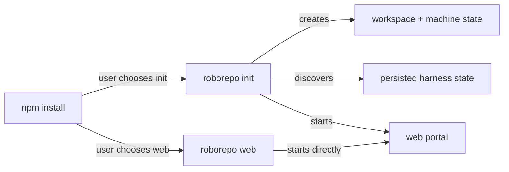
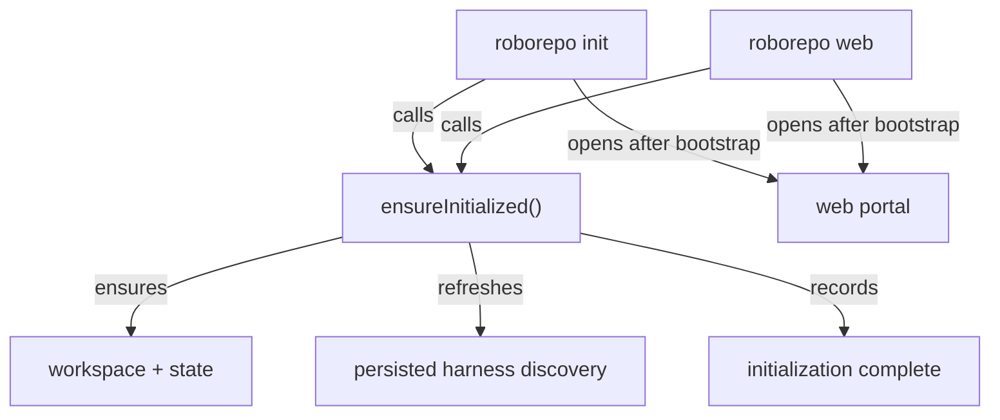

# Let `roborepo web` Bootstrap a Fresh Installation

## Summary

Make `roborepo web` a valid first command on a fresh RoboRepo installation.

Today `roborepo init` creates the workspace/state roots, refreshes harness discovery, opens the portal, and records initialization. `roborepo web` skips those procedural initialization steps and starts the portal directly. The portal can still render much of RoboRepo, which makes the required `init` step easy to miss and unnecessary for users whose normal entry point is the web UI.

The target behavior is that `roborepo init` and the first `roborepo web` share one idempotent procedural bootstrap. On a fresh or interrupted installation they create required local state and refresh harness discovery before the portal starts. On an initialized installation, `roborepo web` remains the normal portal command and adds no extra workflow.

This plan does not remove CLI configuration. Package selection and configuration remain available through both the portal and `roborepo library` / package commands so humans and agents retain equivalent configuration capabilities.

## Context

The completed install-lifecycle plan (`46up8y7a`) established explicit initialization state and made `roborepo init` the first-run orchestrator. The current implementation now has a useful separation:

| Surface | Current behavior |
| --- | --- |
| `roborepo init` | begins initialization, creates workspace/state, persists harness discovery, opens `roborepo web --detach` for interactive setup, then records completion |
| `roborepo web` | starts or reuses the local portal without checking initialization state |
| bare interactive `roborepo` | routes to `init` when initialization is missing or interrupted |
| explicit CLI commands | remain available regardless of initialization state |

The relevant code is already split into reusable lower-level pieces:

- `scripts/cli/initialization-state.mjs` owns the `missing` / `in-progress` / `complete` record and downgrade protection.
- `scripts/cli/workspace.mjs` owns workspace/state setup.
- `scripts/harnesses/discovery.mjs` and `scripts/harnesses/state.mjs` own provider discovery and persisted harness state.
- `scripts/cli/initialize.mjs` currently composes those pieces specifically for `roborepo init`.
- `scripts/cli/telemetry.mjs::serveCommand()` owns `roborepo web` startup, including detached startup and portal reuse.

The related `package-first-run-onboarding` plan (`v6lvuu2`) owns richer browser/terminal package onboarding. This plan is narrower: it makes portal startup safe on a machine where procedural initialization has never run.

## Goals

- Make `roborepo web` perform required procedural initialization automatically when initialization is `missing` or `in-progress`.
- Make `roborepo init` and first-run `roborepo web` use the same initialization implementation rather than duplicating steps.
- Keep `roborepo web` as the normal everyday portal command after initialization.
- Keep `roborepo init` as a valid explicit first-run entry point.
- Preserve zero detected harnesses as a valid initialized state.
- Preserve CLI/portal package and configuration parity; do not require browser automation for agent-driven configuration.
- Preserve `roborepo init --dry-run`, `--force`, initialization resume behavior, and newer-schema downgrade protection.
- Keep explicit commands usable before initialization; do not restore a global onboarding gate.
- Make the npm first-use path valid as:

```sh
npm install -g codethings-roborepo-alpha
roborepo web
```

## Non-goals

- Removing `roborepo init`.
- Removing or reducing `roborepo library`, package commands, or terminal configuration workflows.
- Building the richer staged `/setup` onboarding flow from plan `v6lvuu2`.
- Changing which packages are enabled by default.
- Installing third-party agent harnesses.
- Broadening harness detection semantics.
- Adding a desktop/Electron wrapper.
- Making every CLI command implicitly initialize RoboRepo.

## Current State

Initialization is explicit even though the portal is already tolerant of missing initialization state:



This creates two first-run paths with different machine state even though both can reach the same visible portal.

A second implementation constraint is detached startup. `roborepo web --detach` spawns a foreground `roborepo web --no-open` child. Initialization must therefore happen in the public command/orchestration layer before that child is spawned, or the parent and child can both attempt first-run mutation.

## Proposed Design

### 1. Define initialization as procedural machine bootstrap

Treat `initialization.json` as the record that RoboRepo's required machine-local bootstrap completed:

1. workspace/state roots exist;
2. supported harnesses were discovered and the machine harness state was persisted;
3. the initialization record can be marked complete.

Package selection is configuration, not a prerequisite for the portal to run. A user may configure packages in the portal or through `roborepo library` after the machine bootstrap.

This matches the current practical behavior: interactive `init` already marks initialization complete after successfully handing the user to the browser, not after proving that the user changed package selections.

Plan `v6lvuu2` currently assumes the initialization marker also represents completion of staged package onboarding. When that plan is implemented, it should use separate resumable onboarding state or explicitly revise this lifecycle decision instead of silently overloading the procedural marker.

### 2. Extract one shared bootstrap operation

Move the procedural work currently coordinated by `initCommand()` into a focused shared module, for example:

```text
scripts/cli/initialization-bootstrap.mjs
  ensureInitialized({ force = false, dryRun = false })
    ├── guard against newer initialization schema
    ├── inspect missing / in-progress / complete phase
    ├── begin or resume initialization
    ├── ensure workspace/state roots
    ├── discover and persist harness state
    └── mark procedural initialization complete
```

`initCommand()` passes its existing `--force` and `--dry-run` intent into this shared operation. `roborepo web` uses the default non-forced, mutating path and does not gain either flag. A forced completed initialization reruns the procedural bootstrap; a dry run reports the same procedural steps without writing state.

`ensureInitialized()` must be idempotent:

| Starting phase | Result |
| --- | --- |
| `missing` | run bootstrap and record `complete` |
| `in-progress` | resume bootstrap, preserving the original `startedAt`, then record `complete` |
| `complete` | no mutation unless `force` is true |
| newer unsupported schema | refuse without overwriting the record |

Keep presentation out of the shared operation. It should return structured information such as whether work ran and which harnesses were detected; `init` and `web` decide what, if anything, to print.

### 3. Make both public commands depend on the shared operation

Target flow:



`roborepo init` remains the explicit onboarding-oriented command and may keep its existing welcome/handoff presentation.

`roborepo web` remains a portal command. On first run it may print concise bootstrap progress, but it must not introduce a second wizard or ask package-selection questions before opening the portal.

### 4. Bootstrap before detached portal spawning

Run the shared bootstrap in the invoking `serveCommand()` path before the `options.detach` branch starts `startDetachedPortal()`.

That ordering gives the detached child a completed initialization marker, so the child takes the no-op path instead of performing the same mutations concurrently.

The same rule applies when a portal is already running: an explicit first `roborepo web` on a machine with missing initialization state must reconcile machine bootstrap before reusing/opening the portal.

### 5. Preserve configuration parity

Do not move package/configuration ownership exclusively into the browser.

After bootstrap:

```text
Human browser path:  roborepo web → Agents / Library controls
CLI or agent path:   roborepo library / package enable|disable|reconcile
```

Both interfaces continue to operate on the same package/configuration domain behavior. This plan changes only how required machine initialization is reached.

## Implementation Plan

### Phase 1 — Extract procedural initialization

- [x] Add a shared initialization-bootstrap module with `ensureInitialized()` or an equivalently explicit API.
- [x] Move the future-schema guard, phase handling, workspace/state preparation, and persisted harness discovery behind that shared operation.
- [x] Keep initialization-state persistence in `initialization-state.mjs`; do not duplicate the record schema.
- [x] Keep `initialize.mjs` focused on `roborepo init` presentation/orchestration.
- [x] Preserve `init --dry-run` and `init --force` semantics without adding those flags to `web`.

### Phase 2 — Integrate `roborepo web`

- [x] Call the shared bootstrap before portal detach/reuse/start logic.
- [x] Ensure `web --detach` completes bootstrap in the invoking process before spawning its foreground child.
- [x] Keep normal `web`, `--detach`, `--no-open`, `--port`, and portal-reuse behavior unchanged after bootstrap.
- [x] Do not invoke the Package Library terminal wizard from `web`.
- [x] Keep zero-harness bootstrap successful and open the portal normally.

### Phase 3 — Regression coverage

- [x] Add a failing regression case for `roborepo web` on a clean sandbox before implementing the behavior.
- [x] Prove clean first-run `web` creates workspace/state, persists harness discovery, records initialization complete, and starts the portal.
- [x] Prove first-run `init` and first-run `web` produce equivalent procedural initialization state for the same harness fixture.
- [x] Prove a second `web` invocation does not replay initialization or rewrite initialization timestamps.
- [x] Prove an `in-progress` record resumes and preserves `startedAt`.
- [x] Prove a newer-schema initialization record is not overwritten by `web`.
- [x] Prove `web --detach` does not cause parent/child double initialization.
- [x] Prove bootstrap does not require package selection and does not invoke the CLI onboarding wizard.

### Phase 4 — Update user guidance and related plan assumptions

- [x] Make `npm install -g codethings-roborepo-alpha` followed by `roborepo web` the primary browser-first getting-started path in `README.md` and first-time setup docs.
- [x] Document `roborepo init` as the explicit first-run alternative, not a prerequisite for `web`.
- [x] Keep `roborepo library` documented as the CLI/agent-friendly package configuration surface.
- [x] Sync plan `v6lvuu2` so its future staged onboarding state does not accidentally conflict with the procedural initialization-marker semantics established here.

## Validation

Use focused lifecycle coverage first, then the clean-machine sandbox because this behavior depends on fresh `HOME`/state shape and harness presence.

```sh
npm run test:initialization-lifecycle
npm run test:clean-machine-onboarding-sandbox
npm run test:install-smoke
npm test
```

Add or extend focused assertions so validation covers:

- clean package install → `roborepo web` without prior `init`;
- missing, in-progress, complete, corrupt, and newer-schema initialization records;
- zero and detected harness fixtures;
- detached portal startup;
- repeated `web` startup;
- no package/configuration mutation caused solely by procedural bootstrap.

## Acceptance Criteria

- A user can install the npm package and run `roborepo web` without running `roborepo init` first.
- First-run `web` creates the same required workspace/state and persisted harness-discovery state as first-run `init`.
- First-run `web` records procedural initialization and then opens/serves the portal.
- An already initialized `web` startup behaves as it does today apart from the no-op initialization check.
- `web --detach` cannot race itself by initializing again in the spawned child.
- `missing` and `in-progress` states recover automatically; newer unsupported state is preserved and reported.
- Zero installed/detected harnesses remains valid.
- `roborepo init` remains supported.
- `roborepo library` and package commands remain supported for CLI and agent configuration.
- No new public "get started" command is introduced.
- Documentation can teach `roborepo web` as the normal browser-first entry point.

## Risks

- Moving completion earlier than the current `init` orchestrator changes what `initialization.json` means. The implementation and related onboarding plan must consistently treat it as procedural bootstrap state.
- Putting bootstrap below detached-process spawning can cause duplicate first-run mutation; ordering must be covered by regression tests.
- Reusing command-level helpers that print or exit can couple the shared bootstrap to one presentation surface. Prefer presentation-neutral execution helpers where extraction is needed.
- Harness discovery writes machine state. Re-running it only when initialization is missing/in-progress avoids turning every portal launch into an implicit refresh policy change.
