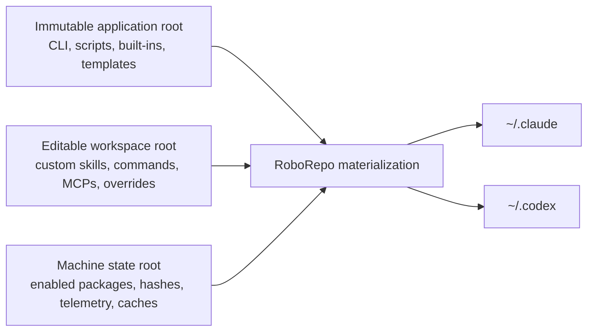
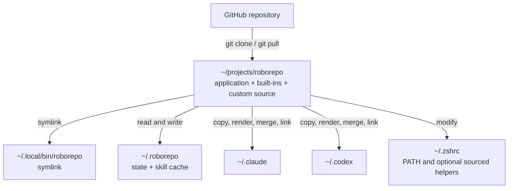
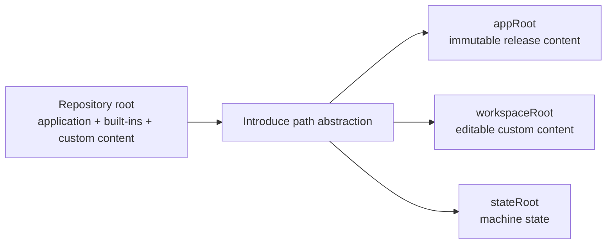
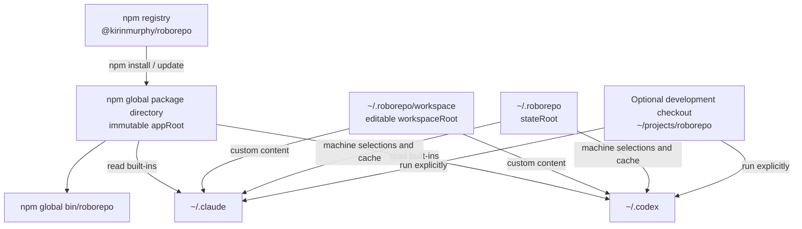
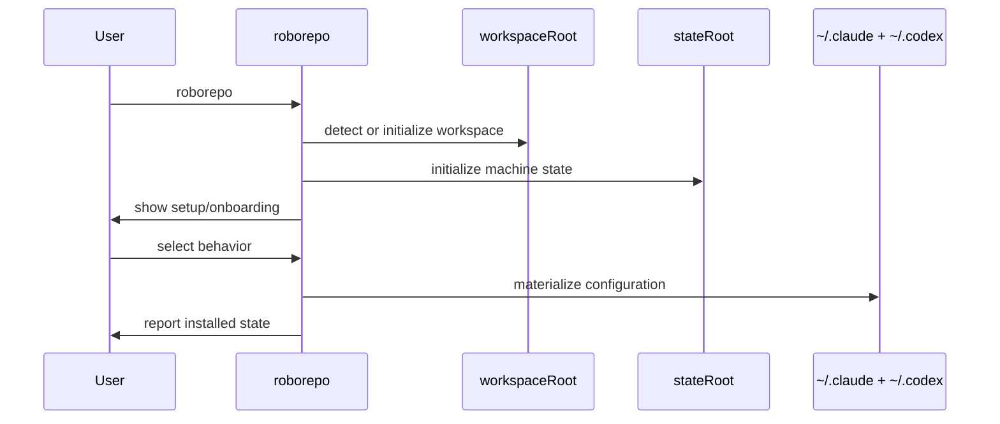
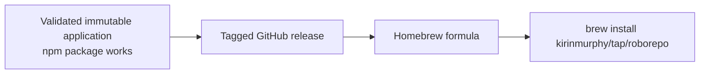
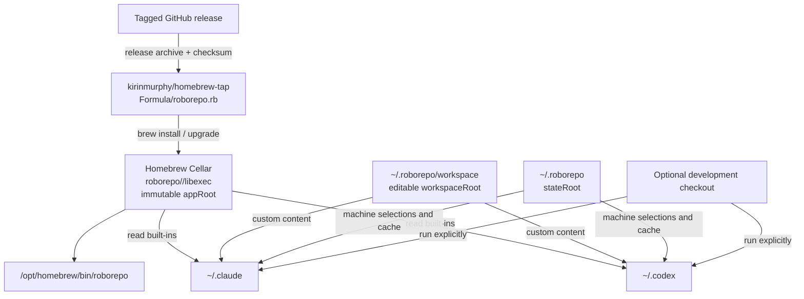
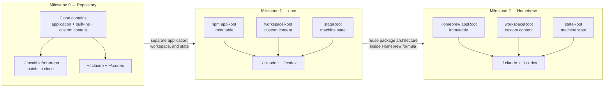
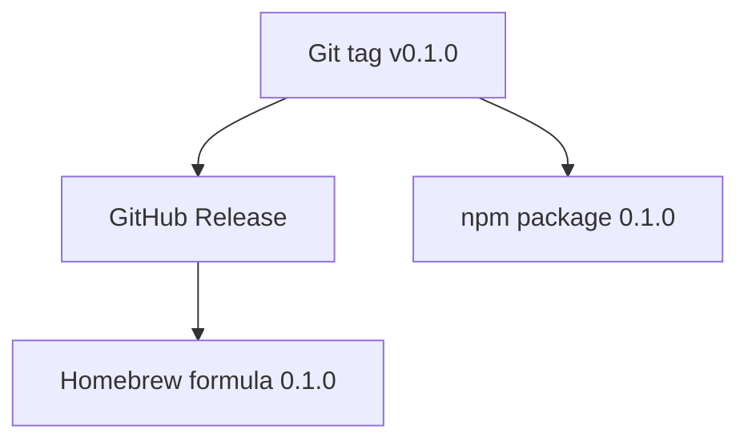

# RoboRepo Packaging and Distribution Plan

## Implementation status (updated 2026-07-27)

Partially implemented. Phases B–D of the path/workspace split are shipped; npm publish and Homebrew
(Phases E–G) are not started. This plan stays active until all three install channels ship.

The npm package skeleton exists but is unpublished: root `package.json` is
`@kirin/roborepo` at `0.1.0-beta.0` with `bin`, a `files` allowlist, and a CI
workflow (`.github/workflows/ci.yml`) — no publish workflow, no Homebrew formula
(`*.rb`) in the tree.

**Shipped:**

- Path abstraction (`resolveAppRoot`/`resolveWorkspaceRoot`/`resolveStateRoot`/`resolveInstallMode`)
  as `appRoot` / `workspaceRoot` / `stateRoot` / `developmentMode`+`packageMode` in
  `scripts/cli/paths.mjs`, with the `ROBOREPO_APP_ROOT` / `ROBOREPO_WORKSPACE_ROOT` /
  `ROBOREPO_STATE_ROOT` / `ROBOREPO_MODE` env overrides and `.git`/`local/skills` auto-detection.
- Package mode refuses writes into `appRoot` (`requireDevelopmentCheckout` guard); user-content
  writes (skills, commands, MCP) route to `workspaceRoot`.
- Typed replace-override guard for workspace resources (`workspace-resources.mjs`): workspace
  content wins only for override-capable types, and a same-named built-in requires an explicit typed
  replace override — no silent shadowing of security-sensitive built-ins.
- `roborepo version` / `roborepo workspace` / `roborepo setup` / `roborepo apply` commands
  (`workspace.mjs`, `main.mjs`); `roborepo update` is an apply alias in package mode.
- Root `package.json` with `type: module`, `bin`, `files` allowlist, and `engines`.
- Package mode passes a real packed-tarball install smoke test: `npm pack` → `npm install -g`
  into an isolated prefix → `version`/`setup`/`doctor`/`enable <package>` all succeed, and no
  user content is written into `appRoot`. Two package-mode bugs found and fixed during that test:
  enabling a built-in package's own MCP preset no longer trips the workspace built-in guard
  (`installMcpPreset` passes `--builtin` to skip the redundant record), and `doctor` no longer
  fails on dev-only source files absent from the npm artifact (`dev`-scoped rows in
  `source-files.tsv`, skipped in package mode).

**Open:** remaining Phase A hardening (upgrade/downgrade/uninstall/moved-checkout across package
mode); Phase D PATH-dedup + shell-helper relocation; Phases E–F (npm beta/stable publish workflow +
CI tarball install) and G (Homebrew tap). The manual packed-install smoke test above passes; the
automated publish/upgrade pipeline is not built.

Phase C `workspace import` has since shipped — `roborepo workspace import <path>`
exists (`scripts/cli/workspace.mjs::workspaceImport` → `importLegacyWorkspace` in
`workspace-resources.mjs`), alongside the earlier `workspace use <path>` pointer.

**Workspace location:** the shipped default `workspaceRoot` is `~/.roborepo/workspace`
(`stateRoot/workspace`, `paths.mjs:53`). An earlier draft of this plan proposed `~/.config/roborepo`;
all path-behavior blocks, filesystem models, mermaid diagrams, and sample output below have been
reconciled to the shipped location. A user may still point `workspaceRoot` elsewhere (env override or
`workspace use <path>`).

## Glossary

### Custom content

**Custom content** is any RoboRepo-managed content that belongs to the user rather than to the released RoboRepo application.

Examples:

- user-created skills
- adopted native Claude or Codex skills
- user-created slash commands
- custom MCP definitions
- custom package definitions
- local overrides to built-in rules or behavior
- portable configuration the user wants to keep in Git
- machine-specific selections, such as enabled packages

Custom content must never be stored only inside an npm or Homebrew installation directory because package-manager upgrades replace that directory.

### Built-in content

Content shipped with a specific RoboRepo release.

Examples:

- default skills
- default commands
- built-in rule fragments
- package catalog entries
- install scripts
- templates
- default Claude and Codex configuration
- the web portal
- CLI implementation

Built-in content is immutable at runtime and belongs to the installed application.

### Application root

The directory containing the installed RoboRepo release.

Examples:

```text
Repo mode:      ~/projects/roborepo
npm mode:       <npm-global-root>/@kirinmurphy/roborepo
Homebrew mode:  /opt/homebrew/Cellar/roborepo/<version>/libexec
```

Code reads built-in assets from this directory but does not write user content into it.

Suggested variable:

```text
appRoot
```

### Workspace root

The editable source of custom, portable RoboRepo content.

Default packaged-mode location (as shipped):

```text
~/.roborepo/workspace
```

A user may instead select a Git-controlled workspace:

```text
~/projects/my-roborepo-config
```

Suggested variable:

```text
workspaceRoot
```

### State root

Machine-local runtime state that should not normally be committed to Git.

Default:

```text
~/.roborepo
```

Examples:

- enabled-package registry
- onboarding state
- generated skill cache
- telemetry data
- service state
- hashes used for drift detection
- install metadata

Suggested variable:

```text
stateRoot
```

### Harness homes

The active configuration directories read by Claude Code and Codex.

```text
~/.claude
~/.codex
```

RoboRepo materializes files into these directories from built-in and custom source content.

### Materialization

The process of combining RoboRepo built-ins, custom workspace content, and machine selections into the active files Claude and Codex read.

```text
built-in content
+ custom workspace content
+ machine state
→ ~/.claude and ~/.codex
```

### Repo mode

RoboRepo runs directly from a cloned Git repository.

The repository is both the application root and the editable workspace.

### Package mode

RoboRepo is installed through npm or Homebrew.

The package-manager installation is the immutable application root, while custom content lives in a separate workspace.

### Development checkout

A cloned RoboRepo repository used to develop RoboRepo itself.

It can continue to run directly even while a packaged release is installed globally.

---

# Goal

Support three progressively more polished installation models without maintaining separate implementations:

0. cloned repository
1. npm package
2. Homebrew formula

All three modes use the same CLI and the same built-in assets. The only difference is how `appRoot` is located and where custom content is written.

The existing repository workflow remains supported throughout the transition.

---

# Target architecture



## Path ownership

| Location | Owner | Writable by RoboRepo | Replaced during package upgrade |
|---|---|---:|---:|
| `appRoot` | RoboRepo release/package manager | No, except during development in repo mode | Yes |
| `workspaceRoot` | User | Yes | No |
| `stateRoot` | RoboRepo machine state | Yes | No |
| `~/.claude` | User and RoboRepo | Yes, with collision rules | No |
| `~/.codex` | User and RoboRepo | Yes, with collision rules | No |

---

# Milestone 0: repository installation

## User experience

```sh
git clone https://github.com/kirinmurphy/roborepo.git
cd roborepo
./scripts/install/main.sh
```

After installation:

```sh
roborepo
roborepo update
roborepo doctor
```

## Infrastructure



## Filesystem model

```text
~/projects/roborepo/
  bin/
  globals/
  manifests/
  scripts/
  shell/
  local/
  docs/

~/.local/bin/
  roborepo -> ~/projects/roborepo/bin/roborepo

~/.roborepo/
  install-state.json
  presets/
  skills/
  telemetry/

~/.claude/
~/.codex/
```

## Path behavior

```text
appRoot       = repository root
workspaceRoot = repository root
stateRoot     = ~/.roborepo
mode          = repo
```

## Characteristics

Advantages:

- current workflow remains intact
- user can edit built-ins and custom content in one Git repository
- development commands can write into the repository
- updates can use normal Git operations

Limitations:

- users must clone the repository
- the command remains tied to the checkout path
- moving or deleting the checkout can break the command
- built-in application code and custom content are not separated
- installation is harder to explain and automate

## Milestone 0 hardening work

Before packaging, complete or validate:

- installer idempotency
- collision handling
- backup behavior
- uninstall behavior
- update behavior
- drift detection
- safe recovery after a moved checkout
- clean behavior when Claude or Codex is absent
- noninteractive installation
- macOS and Linux checks
- failure behavior when Node or shell dependencies are missing

---

# Transition from milestone 0 to milestone 1

The main change is not npm metadata. The main change is separating immutable application files from writable custom content.



## Required internal path abstraction

Introduce one shared path module used by Node and shell entrypoints.

Conceptually:

```text
resolveAppRoot()
resolveWorkspaceRoot()
resolveStateRoot()
resolveInstallMode()
```

Expected resolution:

| Mode | `appRoot` | `workspaceRoot` | `stateRoot` |
|---|---|---|---|
| Repo | repository root | repository root | `~/.roborepo` |
| npm | npm package root | `~/.roborepo/workspace` or configured path | `~/.roborepo` |
| Homebrew | formula `libexec` root | `~/.roborepo/workspace` or configured path | `~/.roborepo` |

## Content lookup order

When RoboRepo needs a configurable source item:

```text
1. custom workspace override
2. custom workspace addition
3. built-in application content
```

A custom item may override a built-in only through an explicit supported mechanism.

Recommended rule:

```text
workspace content wins only for override-capable resource types
```

Avoid silently letting arbitrary same-named files replace security-sensitive built-ins.

## Write routing

Commands that create or modify user content must write to `workspaceRoot`.

Examples:

```text
roborepo skill new
roborepo skill adopt
roborepo mcp add
roborepo command new
roborepo package new
```

Commands that change only this machine write to `stateRoot` or harness homes.

Examples:

```text
roborepo enable
roborepo disable
roborepo telemetry enable
roborepo onboard
```

Build and release commands may write to `appRoot` only in repo development mode.

Examples:

```text
render built-in rules
update built-in README tables
compile release manifests
```

In package mode, development-only commands should either:

- write to `workspaceRoot`, or
- fail with a message explaining that the operation requires a RoboRepo development checkout

---

# Milestone 1: npm package

## User experience

Stable release:

```sh
npm install -g @kirinmurphy/roborepo
roborepo
```

Beta release:

```sh
npm install -g @kirinmurphy/roborepo@beta
roborepo
```

Repository development remains available:

```sh
git clone https://github.com/kirinmurphy/roborepo.git
cd roborepo
./bin/roborepo
```

## Infrastructure



## Filesystem model

```text
<npm-global-root>/@kirinmurphy/roborepo/
  scripts/
  globals/
  manifests/
  shell/
  templates/
  package.json
  LICENSE
  README.md

<npm-global-bin>/
  roborepo

~/.roborepo/workspace/
  workspace.json
  skills/
  commands/
  mcp/
  packages/
  overrides/

~/.roborepo/
  install-state.json
  presets/
  skills/
  telemetry/
  config-state/

~/.claude/
~/.codex/
```

## Path behavior

```text
appRoot       = npm package root
workspaceRoot = ~/.roborepo/workspace
stateRoot     = ~/.roborepo
mode          = package
distribution  = npm
```

## First-run behavior

The npm installation should install only the application and executable.

Do not mutate user configuration from npm `postinstall`.

On first invocation:



## Suggested commands

```sh
roborepo setup
roborepo onboard
roborepo apply
roborepo doctor
roborepo version
roborepo workspace status
roborepo workspace use <path>
```

### `roborepo version`

Should report enough information to distinguish modes:

```text
roborepo 0.1.0-beta.3
mode: package
distribution: npm
app root: /path/to/npm/package
workspace: /Users/name/.roborepo/workspace
state: /Users/name/.roborepo
```

### `roborepo apply`

Materializes the currently installed application version and selected workspace into Claude and Codex.

This makes package upgrade and configuration application separate:

```sh
npm update -g @kirinmurphy/roborepo
roborepo apply
```

`roborepo update` may remain as a compatibility alias, but should not imply that it downloads a new npm release.

## npm package requirements

Add a root `package.json` with:

- package name
- version
- `type: module`
- `bin` mapping
- explicit `files` allowlist
- Node engine requirement
- public repository metadata
- license
- release scripts

Conceptual shape:

```json
{
  "name": "@kirinmurphy/roborepo",
  "version": "0.1.0-beta.1",
  "type": "module",
  "bin": {
    "roborepo": "scripts/cli/main.mjs"
  },
  "files": [
    "bin",
    "globals",
    "manifests",
    "scripts",
    "shell",
    "templates",
    "README.md",
    "LICENSE"
  ],
  "engines": {
    "node": ">=20"
  }
}
```

The final included paths must be determined from the actual runtime dependency graph.

## npm validation workflow

Always validate the packed artifact rather than only testing the repository:

```sh
npm pack --dry-run
npm pack
npm install -g ./kirinmurphy-roborepo-<version>.tgz
roborepo version
roborepo setup --dry-run
roborepo doctor
```

Automated tests should use a temporary `HOME`.

## npm acceptance criteria

- `npm install -g` exposes `roborepo`
- no clone is required
- first run initializes a workspace safely
- no custom content is written inside the npm package
- package upgrades preserve workspace and state
- `roborepo doctor` reports package mode correctly
- installed configuration contains no reference to the source checkout
- installed configuration contains no fragile reference to a version-specific npm directory
- repo mode still works directly from a clone
- npm mode and repo mode pass the same core behavior tests

---

# Running repo mode and npm mode simultaneously

Both modes can coexist on one machine.

## Recommended workflow

Global packaged command:

```sh
roborepo
```

Development checkout:

```sh
cd ~/projects/roborepo
./bin/roborepo
```

Or:

```sh
node scripts/cli/main.mjs
```

Do not globally symlink the development checkout to the same `roborepo` command while testing the npm installation.

## Optional explicit development command

A helper can make the distinction obvious:

```sh
roborepo-dev
```

But this is optional. Running `./bin/roborepo` from the checkout is sufficient.

## Avoiding state collisions

By default, both modes may intentionally share:

```text
workspaceRoot
stateRoot
~/.claude
~/.codex
```

This is useful because both modes operate on the same user configuration.

For isolated tests, support environment overrides:

```sh
ROBOREPO_WORKSPACE_ROOT=/tmp/roborepo-workspace \
ROBOREPO_STATE_ROOT=/tmp/roborepo-state \
HOME=/tmp/roborepo-home \
./bin/roborepo doctor
```

Suggested environment variables:

```text
ROBOREPO_APP_ROOT
ROBOREPO_WORKSPACE_ROOT
ROBOREPO_STATE_ROOT
ROBOREPO_MODE
```

`ROBOREPO_APP_ROOT` and `ROBOREPO_MODE` should primarily be test and development overrides, not normal user configuration.

Mode is auto-detected from `appRoot`: a `.git` directory or a dev-only `local/skills` directory means development mode, otherwise package mode. `ROBOREPO_MODE=development|package` forces it explicitly — needed for the edge case of a checkout stripped of `.git` (e.g. a source copy) that would otherwise be misread as a package install.

---

# Transition from milestone 1 to milestone 2

Homebrew should package the already-working immutable npm-era application architecture.

Do not use Homebrew as the first place where application/workspace separation is introduced.



Required before starting Homebrew:

- tagged releases exist
- package mode is independent of the checkout
- application paths are immutable
- custom content lives outside `appRoot`
- no shell profile points into a version-specific application directory
- upgrade tests exist
- uninstall ownership is defined

---

# Milestone 2: Homebrew installation

## User experience

```sh
brew install kirinmurphy/tap/roborepo
roborepo
```

Upgrade:

```sh
brew upgrade roborepo
roborepo apply
```

Uninstall application:

```sh
brew uninstall roborepo
```

Personal workspace and state remain unless the user explicitly asks RoboRepo to remove them.

## Infrastructure



## Filesystem model

Apple Silicon Mac:

```text
/opt/homebrew/Cellar/roborepo/<version>/
  bin/
  libexec/
    scripts/
    globals/
    manifests/
    shell/
    templates/
    package.json

/opt/homebrew/bin/
  roborepo -> ../Cellar/roborepo/<version>/bin/roborepo

~/.roborepo/workspace/
  skills/
  commands/
  mcp/
  packages/
  overrides/

~/.roborepo/
  install-state.json
  presets/
  skills/
  telemetry/
  config-state/

~/.claude/
~/.codex/
```

Intel Mac commonly uses:

```text
/usr/local/Cellar
/usr/local/bin
```

RoboRepo should never hardcode either Homebrew prefix.

## Path behavior

```text
appRoot       = Homebrew formula libexec root
workspaceRoot = ~/.roborepo/workspace
stateRoot     = ~/.roborepo
mode          = package
distribution  = homebrew
```

## Formula responsibilities

The Homebrew formula should:

- download a tagged GitHub release
- verify its SHA-256 checksum
- depend on a supported Node runtime
- install application assets under `libexec`
- create a stable `roborepo` executable in Homebrew `bin`
- avoid editing `.zshrc`
- avoid initializing the workspace during `brew install`
- avoid touching `~/.claude` or `~/.codex` during installation

RoboRepo first-run setup remains responsible for user configuration.

## Homebrew acceptance criteria

- `brew install` exposes `roborepo`
- Node is provided through the formula dependency
- no `nvm` global-package dependency exists
- `brew upgrade` preserves workspace and state
- the executable does not contain hardcoded versioned Cellar paths beyond Homebrew-managed links
- no harness file points at an old Cellar version
- `brew uninstall` removes the application but not personal content
- repo mode and npm mode continue working
- the same package-mode integration suite passes against Homebrew

---

# Full transition visualization



---

# Implementation phases

## Phase A: harden current repo mode

Complete before or alongside path separation.

Tasks:

- validate install, update, repair, doctor, verify, and uninstall
- verify backups and collision modes
- test clean install and reinstall
- test installations with only Claude, only Codex, both, or neither
- test moved checkout repair
- test noninteractive behavior
- add deterministic temporary-`HOME` integration tests
- document which commands modify repository source

Deliverable:

```text
A reliable repository installation that can be used as the compatibility baseline.
```

## Phase B: introduce path ownership

Tasks:

- replace direct `repoRoot` assumptions with `appRoot`, `workspaceRoot`, and `stateRoot`
- centralize path resolution
- expose path diagnostics through `roborepo version` or `roborepo doctor`
- add environment overrides for tests
- classify every read and write by root
- prevent packaged mode from writing to `appRoot`

Deliverable:

```text
Repo mode still behaves as before, but internals no longer assume all content lives in one writable root.
```

## Phase C: define custom workspace format

Tasks:

- define default workspace location
- define workspace version metadata
- create workspace initialization
- define supported override rules
- move user-created skills and commands into the workspace
- move portable custom MCP and package definitions into the workspace
- support selecting a Git-controlled workspace
- define migration from existing repo-resident custom content

Possible metadata:

```json
{
  "schemaVersion": 1,
  "createdBy": "0.1.0",
  "workspaceType": "user"
}
```

Deliverable:

```text
Custom content survives application replacement.
```

## Phase D: separate install from setup

Tasks:

- make package installation place only application files
- add or formalize `roborepo setup`
- initialize workspace on first run
- keep onboarding explicit and recoverable
- stop adding duplicate PATH entries when npm or Homebrew already owns the command
- copy any required shell helpers to a stable user-owned location
- remove permanent shell references to `appRoot`

Deliverable:

```text
An immutable application can be installed without mutating user configuration until RoboRepo itself runs.
```

## Phase E: create npm beta

Tasks:

- add package metadata
- add license
- define included files
- test `npm pack`
- install the generated tarball in CI
- add prerelease publishing workflow
- publish under a beta dist-tag
- test clean install, upgrade, downgrade, and uninstall

Deliverable:

```sh
npm install -g @kirinmurphy/roborepo@beta
```

## Phase F: stabilize npm release

Tasks:

- use npm beta on real machines
- validate existing-clone migration
- validate shared repo/package workspace behavior
- clarify application upgrade versus `roborepo apply`
- finalize semantic versioning
- publish stable `0.1.0` when upgrade safety is demonstrated

Deliverable:

```sh
npm install -g @kirinmurphy/roborepo
```

## Phase G: create Homebrew tap

Tasks:

- create `kirinmurphy/homebrew-tap`
- add formula using a tagged GitHub release
- depend on Node
- install app assets under `libexec`
- expose the CLI through Homebrew `bin`
- test Apple Silicon and Intel path behavior where possible
- automate formula version and checksum updates

Deliverable:

```sh
brew install kirinmurphy/tap/roborepo
```

---

# Migration strategy for existing users

## Existing repository remains valid

No immediate migration is required.

```text
appRoot       = existing clone
workspaceRoot = existing clone
stateRoot     = ~/.roborepo
```

## Optional migration to packaged mode

Suggested flow:

```sh
npm install -g @kirinmurphy/roborepo
roborepo workspace import ~/projects/roborepo
roborepo doctor
roborepo apply
```

Possible import behavior:

- detect custom skills
- detect custom commands
- detect custom MCP entries
- detect custom packages
- copy only user-owned content
- preserve the clone untouched
- preview all changes before writing
- report built-in files that differ from the installed release

Do not copy the entire repository into the workspace.

## Continue using the clone as the workspace

Advanced users may intentionally configure:

```sh
roborepo workspace use ~/projects/roborepo
```

In this arrangement:

```text
appRoot       = npm or Homebrew package
workspaceRoot = cloned repository
stateRoot     = ~/.roborepo
```

This can be useful during transition, but workspace lookup must clearly distinguish custom content from built-in source in that repository.

A cleaner long-term model is a dedicated user workspace repository.

---

# Command behavior matrix

| Command | Reads built-ins | Reads workspace | Writes workspace | Writes state/harnesses | Repo-only |
|---|---:|---:|---:|---:|---:|
| `roborepo setup` | Yes | Yes | Yes | Yes | No |
| `roborepo onboard` | Yes | Yes | Possibly | Yes | No |
| `roborepo apply` | Yes | Yes | No | Yes | No |
| `roborepo enable` | Yes | Yes | No | Yes | No |
| `roborepo disable` | Yes | Yes | No | Yes | No |
| `roborepo skill new` | Templates | Yes | Yes | Refreshes links/cache | No |
| `roborepo skill adopt` | Yes | Yes | Yes | Refreshes links/cache | No |
| `roborepo mcp add` | Yes | Yes | Yes for portable intent | Yes | No |
| `roborepo doctor` | Yes | Yes | No | No | No |
| built-in manifest renderer | Yes | No | Writes app source | No | Yes |
| built-in README updater | Yes | No | Writes app source | No | Yes |

---

# Testing matrix

Every supported behavior should be run against more than the source checkout.

| Test target | Purpose |
|---|---|
| repository checkout | preserve existing behavior |
| `npm pack` tarball | catch omitted files and package-root assumptions |
| globally installed npm package | validate real executable resolution |
| Homebrew formula install | validate Cellar and `libexec` behavior |
| temporary `HOME` | prevent contamination of developer machine |
| existing user config | test collision and merge handling |
| upgrade from prior version | validate preservation of workspace and state |
| moved/deleted app root | validate error reporting and repair boundaries |

## Core scenarios

- fresh install
- repeated setup
- package upgrade
- package downgrade
- uninstall application only
- uninstall RoboRepo-managed configuration
- custom workspace survives upgrade
- enabled-package state survives upgrade
- telemetry survives upgrade
- built-in skill changes are applied
- custom skill overrides remain intact
- local Claude/Codex drift is preserved
- package mode refuses writes into `appRoot`
- repo mode permits intentional development writes
- repo and packaged commands can run on the same machine

---

# Release strategy

## Version sequence

Suggested progression:

```text
0.0.x          internal repository hardening
0.1.0-beta.1   first npm package
0.1.0-beta.x   package migration and upgrade testing
0.1.0          stable npm release
0.1.x          first Homebrew tap release
```

npm beta publishing:

```sh
npm publish --access public --tag beta
```

Stable publishing:

```sh
npm publish --access public
```

## Canonical release source

Use a Git tag and GitHub Release as the canonical version:

```text
v0.1.0
```

That version drives:



---

# Risks and controls

## Risk: package upgrade deletes custom content

Control:

```text
Never write custom content into appRoot.
```

## Risk: old shell references break after upgrade

Control:

```text
Do not source files directly from npm package versions or Homebrew Cellar versions.
Copy required shell helpers into a stable user-owned location.
```

## Risk: repo and package modes behave differently

Control:

```text
Use the same CLI modules and the same integration suite in all modes.
Only path resolution and distribution metadata differ.
```

## Risk: users do not know which RoboRepo they are running

Control:

```sh
roborepo version
```

Must show mode, version, distribution, application root, workspace, and state root.

## Risk: `roborepo update` becomes ambiguous

Control:

```text
Package manager updates application code.
roborepo apply materializes installed content.
```

Keep `update` only as a documented compatibility alias or redefine it carefully.

## Risk: workspace overrides unexpectedly replace secure built-ins

Control:

```text
Define explicit override-capable resource types and validate schemas.
Do not use unrestricted same-path shadowing.
```

## Risk: npm package misses runtime files

Control:

```sh
npm pack
```

Install and test the generated tarball in CI.

## Risk: Homebrew becomes a second implementation

Control:

```text
The formula only installs the existing packaged application.
All setup and materialization remain inside the RoboRepo CLI.
```

---

# Recommended decision point

Begin the path-separation and package-readiness work while finishing the first feature set.

Publish the first npm beta when:

- the initial feature boundaries are mostly stable
- hardening tests cover the current install lifecycle
- package mode cannot write custom content into `appRoot`
- a packed npm tarball passes clean-install tests
- upgrade and uninstall preserve workspace and state
- `roborepo version` and `roborepo doctor` clearly identify the active mode

Begin Homebrew work only after npm package mode has survived real install and upgrade testing.

---

# Definition of done

The full feature is complete when all of the following work:

```sh
git clone https://github.com/kirinmurphy/roborepo.git
cd roborepo
./scripts/install/main.sh
./bin/roborepo doctor
```

```sh
npm install -g @kirinmurphy/roborepo
roborepo setup
roborepo doctor
```

```sh
brew install kirinmurphy/tap/roborepo
roborepo setup
roborepo doctor
```

And all three produce functionally equivalent materialized Claude and Codex configuration from the same combination of:

```text
built-in release content
+ user workspace content
+ machine-local state
```

The repository remains the development source. npm and Homebrew become distribution channels, not separate versions of RoboRepo.
