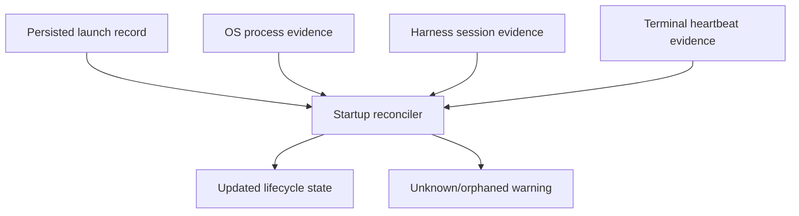
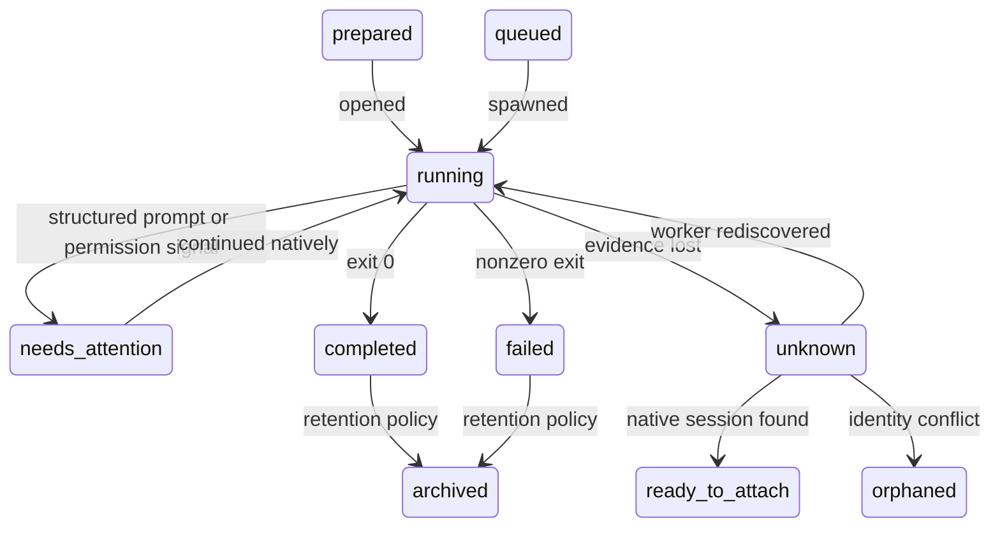
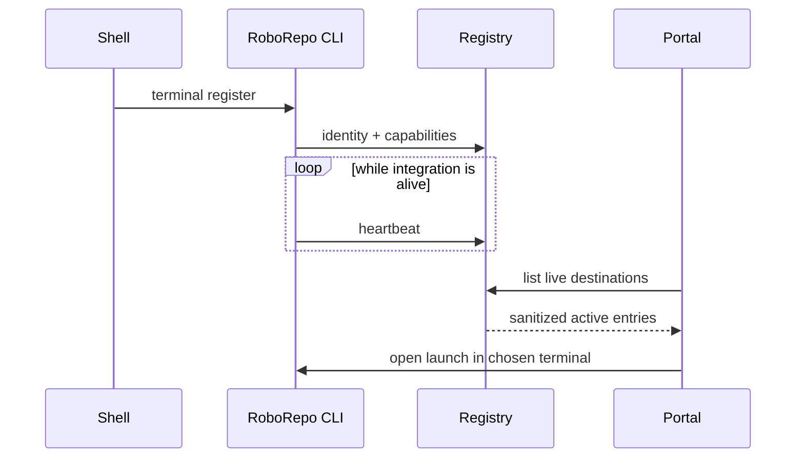

# Session Launching — Milestone 2: Reliability and Multi-Terminal Workflows

## Summary

Harden the Milestone 1 Plan-to-Session workflow after its macOS core behavior is operating. Add
startup reconciliation, richer lifecycle states, repository concurrency policy, log protection,
retention, and an explicit renewable terminal registry for users who keep multiple terminal apps,
windows, or multiplexers open.

This milestone is deliberately driven by observed Milestone 1 incidents. It adds operational
reliability without changing the core boundary: RoboRepo tracks and launches work, while Claude and
Codex own the conversation. Sessions remain first-class records with required, immutable `planId`
relationships scoped by immutable repository identity; Plans remain the primary portal surface.

## Context

Milestone 1 intentionally avoids a broad process manager and guesses as little as possible about
terminals. That is enough to validate the workflow, but it leaves predictable edge cases:

- the portal restarts while a worker is still running;
- a PID is reused by an unrelated process;
- a CLI exits while leaving a resumable native session;
- a session finishes between an API response and the browser's next poll;
- the same repository receives multiple write-capable launches;
- a terminal closes, its TTY is reused, or multiple terminal apps are available;
- stored output grows, contains sensitive values, or outlives its usefulness;
- a plan is archived, moved, or deleted while session history remains.

The correct refinement is not to make the portal infer everything. It is to preserve explicit
identities and reconcile only from evidence.



## Goals

- Recover useful state after portal or machine restarts.
- Distinguish worker death from harness-session availability.
- Add explicit `needs-attention`, `unknown`, and `orphaned` outcomes.
- Prevent accidental duplicate or conflicting repository work.
- Add renewable terminal registration for deliberate destination selection.
- Support exact tmux targeting when available.
- Strengthen output redaction, retention, and pruning.
- Make all automatic state transitions evidence-backed and auditable.
- Use actual Milestone 1 failures to prioritize adapters and policies.

## Non-goals

- Linux, Windows, PowerShell, ConPTY, or WSL implementation.
- Attaching to arbitrary unregistered terminal panes.
- Replacing tmux, terminal applications, or harness-native session management.
- Distributed workers or launches on remote machines.
- A browser chat/reply interface.
- A general-purpose scheduler.
- Perfect secret detection.
- Deleting session history when a Plan is deleted.
- Making `planId` optional or embedding session history inside Plan records.

## Current state

At reviewed commit `72c83be`, RoboRepo has no session-launcher implementation. This plan depends on
Milestone 1 and therefore describes required extension seams rather than current code.

The existing repository still supplies useful patterns:

| Pattern | Existing location | Reliability use |
| --- | --- | --- |
| Per-port PID identity | `portalPidPathForPort()` in `scripts/cli/state-paths.mjs` | Avoid one global process identity |
| Safe JSON state helpers | `scripts/cli/state-paths.mjs` | Terminal registry and policy state |
| Incremental append processing | `scripts/cli/jsonl-tail.mjs` | Read growing session output safely |
| Bounded telemetry spool behavior | telemetry modules | Retention/pruning precedents |
| Explicit mutation routes | `portal-routes-*.mjs` | Terminal registration and policy mutations |
| Machine-local state root | `scripts/cli/paths.mjs` | Keep runtime records out of repositories |

Milestone 1 is expected to add:

- `modules/session-launcher/`;
- `scripts/cli/sessions.mjs`;
- `scripts/cli/portal-routes-sessions.mjs`;
- Plan-row session summaries, filters, and Plan-level session history;
- per-launch records and output under `stateRoot/sessions`;
- Claude/Codex and macOS terminal adapters.

Before implementation, inspect those actual files and update this plan if Milestone 1 chose
different names or schemas.

## Proposed design

### Reconciliation contract

Run reconciliation:

- once when the session service starts;
- before returning detail for a stale `running` record;
- on an inexpensive bounded interval only while workers are active;
- explicitly through `roborepo sessions reconcile`.

Reconciliation must not infer a healthy worker from PID existence alone. Persist a process start
fingerprint and compare it to current process evidence.

Only one reconciler may transition a given record at a time. Reuse Milestone 1 record revisions and
conflict-safe updates; a stale reconciler must reload rather than overwrite a newer exit,
cancellation, view, or attachment event. Heartbeats are liveness hints, not lifecycle authority.

```json
{
  "pid": 12345,
  "startedAt": "2026-07-24T20:00:00.000Z",
  "processFingerprint": "opaque-platform-value",
  "lastHeartbeatAt": "2026-07-24T20:00:05.000Z"
}
```

Decision table:

| Persisted state | Worker evidence | Harness evidence | Reconciled state |
| --- | --- | --- | --- |
| `running` | matching process alive | unknown | `running` |
| `running` | process gone | resumable session | `ready-to-attach` |
| `running` | process gone | no session ID, exit recorded | `completed` or `failed` |
| `running` | process gone | no reliable evidence | `unknown` |
| any | process fingerprint mismatch | any | `orphaned` + warning |
| `completed` | none | resumable session | remain `completed`, expose attach action |

`orphaned` describes a broken relationship between a record and runtime evidence. It must not mean
the record should be deleted.

### Expanded lifecycle



Do not overpromise background recovery. When a harness cannot resume a blocked non-interactive
turn, expose output and a new native continuation command rather than pretending the original
process can accept input.

### Repository concurrency

Add a policy layer keyed by canonical repository/worktree identity, not display name:

| Existing work | New request | Default |
| --- | --- | --- |
| read-only/plan | read-only/plan | allow |
| write-capable | read-only/plan | allow with visible warning |
| read-only/plan | write-capable | confirm |
| write-capable | write-capable | block or queue |
| unknown permission profile | any write-capable | block pending user choice |

The policy should return a decision object rather than spawning directly:

```js
{
  decision: "block",
  reason: "write-capable launch already running",
  conflictingLaunchIds: ["launch_…"]
}
```

Avoid a complex job scheduler until incident data shows it is needed. Start with allow, confirm, or
block. Add FIFO queueing only if users repeatedly need it.

Acquire the repository/worktree policy lease atomically before spawning and release it from
evidence-backed completion/cancellation. A UI preflight decision is advisory; it cannot be the
only concurrency check because two launch requests can race.

### Terminal registry

Registration must be explicit and renewable:

```text
roborepo terminal register [--name <label>]
roborepo terminal heartbeat <terminal-id>
roborepo terminal unregister <terminal-id>
roborepo terminal list
```

Each terminal entry receives a generated stable ID. TTY is evidence, not identity:

```json
{
  "schema": 1,
  "id": "terminal_opaque_id",
  "label": "cmux — roborepo",
  "platform": "darwin",
  "app": "cmux",
  "tty": "/dev/ttys004",
  "cwd": "/server-only/path",
  "multiplexer": {
    "kind": "tmux",
    "session": "work",
    "window": "portal",
    "pane": "%3"
  },
  "capabilities": {
    "canOpenWindow": true,
    "canOpenTab": true,
    "canTargetExistingPane": true,
    "canAttachInteractively": true
  },
  "registeredAt": "2026-07-24T20:00:00.000Z",
  "lastSeenAt": "2026-07-24T20:00:10.000Z",
  "expiresAt": "2026-07-24T20:01:10.000Z"
}
```

Never expose absolute `cwd` or raw process ancestry in the browser. Return a sanitized label and
capability set.



Expired entries stay hidden from default selection but can remain briefly for diagnostics. A
heartbeat helper may be supplied for shell integration; registration should not happen on every
ordinary RoboRepo command.

### tmux

tmux is the most reliable exact-target adapter and should be implemented before app-specific pane
injection:

```sh
tmux new-window -t session-name -- codex resume SESSION_ID
```

The implementation must use argument arrays via `spawn()` rather than constructing this shell
string. Validate the target against the registered terminal record; never accept arbitrary tmux
targets from a browser request.

### Output protection

Milestone 2 strengthens the bounded Milestone 1 design:

| Layer | Behavior |
| --- | --- |
| Collection | allowlist structured fields; omit process environment |
| Streaming | redact configured key/token patterns before persistence |
| Storage | rotate/truncate at fixed per-launch and total ceilings |
| API | paginate output and cap response bytes |
| Browser | render text; provide truncation/redaction notices |
| Retention | separate active, recent, archived, and prunable output |

Store metadata longer than verbose output. Pruning output must not delete the launch record or its
resumable harness ID.

Suggested policy shape:

```json
{
  "activeOutputBytes": 1048576,
  "completedOutputDays": 30,
  "recordRetentionDays": null,
  "redactionPatterns": []
}
```

Numbers above are schema examples, not approved defaults. Measure Milestone 1 data before choosing
limits.

Keep policy separate from runtime records:

```text
<stateRoot>/sessions/
  config.json
  policy.json
  terminals/
  requests/
  output/
```

`config.json` owns UX preferences such as default terminal and polling/display limits.
`policy.json` owns retention, redaction, concurrency, terminal TTL, and reconciliation cadence.
Both are schema-versioned, validated, and updated atomically. Code owns safe fallback defaults and
hard security ceilings; configuration may tighten those ceilings but must not bypass command,
path, origin, or permission checks.

### Plan lifecycle independence

Session history survives Plan movement, archival, or deletion:

| Plan event | Session behavior |
| --- | --- |
| Path changes | continue linking by stable plan ID; retain launch-time path |
| Plan archived | history remains; new launch UI may warn |
| Plan deleted | show `plan unavailable`; retain record |
| Duplicate plan ID appears | flag ambiguity; do not silently relink |
| Repository moves | resolve through canonical repository identity when available |

### API and portal changes

Extend the session API:

| Endpoint | Method | Purpose |
| --- | --- | --- |
| `/api/sessions/reconcile` | POST | bounded explicit reconciliation |
| `/api/sessions/policy` | GET/POST | sanitized policy plus validated override updates |
| `/api/sessions/terminals` | GET | sanitized live terminal destinations |
| `/api/sessions/terminals/register` | POST | CLI-authenticated registration if HTTP is used |
| `/api/sessions/terminals/unregister` | POST | remove a destination |
| `/api/sessions/prune` | POST | preview or apply retention policy |

Prefer direct state-module calls from the local CLI for terminal register/heartbeat rather than
requiring the portal server to be running.

Use conditional writes (`expectedRevision`) for portal policy changes and terminal renewal so two
open browser tabs or CLI processes cannot silently replace newer settings. Prune defaults to
preview; applying a prune requires a second mutation carrying the preview token and policy revision.

Plan-centered session UI additions:

- Needs attention
- Unknown/orphaned
- Concurrent repository activity
- Terminal destination picker
- Stale-terminal explanation
- Output-truncated/redacted indicators
- Retention preview

If real usage shows that cross-plan session volume cannot be managed through Plan filters, Plan
details, and the homepage attention widget, this milestone may add a dedicated session-list view.
That is a measured follow-up decision, not a prerequisite for treating sessions as first-class
records.

## Implementation plan

### Phase 1 — Incident review and schema migration

- [ ] Review Milestone 1 failures, unknown states, duplicate launches, output sizes, and terminal
  fallbacks.
- [ ] Document which proposed edge cases actually occurred.
- [ ] Version the launch schema and add deterministic migrations.
- [ ] Add `needs-attention`, `unknown`, `orphaned`, and `archived`.
- [ ] Preserve original records until migration verification succeeds.

### Phase 2 — Reconciliation

- [ ] Persist process fingerprints and heartbeats.
- [ ] Implement evidence-based startup reconciliation.
- [ ] Add bounded active-worker polling.
- [ ] Add `roborepo sessions reconcile`.
- [ ] Make reconciliation idempotent and append an audit event for state changes.
- [ ] Make concurrent reconcilers reload on record revision conflicts.
- [ ] Test PID reuse, missing output, process death, and portal restart.

### Phase 3 — Concurrency policy

- [ ] Define canonical repository/worktree keys.
- [ ] Classify launch permission profiles as read-only, write-capable, or unknown.
- [ ] Implement allow/confirm/block decisions.
- [ ] Recheck policy and atomically acquire a repository/worktree lease at spawn time.
- [ ] Surface conflicts in the launch dialog and Plan/session status surfaces.
- [ ] Add queueing only if incident review justifies it.

### Phase 4 — Terminal registry and tmux

- [ ] Add terminal registry state paths and schema.
- [ ] Add register, heartbeat, unregister, and list CLI commands.
- [ ] Detect terminal app, TTY, process ancestry, and tmux coordinates on macOS.
- [ ] Add expiry and stale-entry handling.
- [ ] Add sanitized terminal API projections.
- [ ] Implement exact tmux new-window targeting with argument arrays.
- [ ] Add a portal destination picker that shows only supported actions.

### Phase 5 — Output and retention

- [ ] Measure actual Milestone 1 output distribution.
- [ ] Approve per-launch, response, and total-storage limits.
- [ ] Add streaming redaction for a conservative configurable pattern set.
- [ ] Separate schema-versioned UX configuration from security/retention/concurrency policy.
- [ ] Add revision-guarded policy updates and preview-token-guarded pruning.
- [ ] Add output pagination and truncation metadata.
- [ ] Add pruning preview and apply operations.
- [ ] Retain records and harness IDs when verbose output is pruned.

### Phase 6 — Documentation

- [ ] Update `docs/user/reference/sessions.md`.
- [ ] Document reconciliation evidence and non-guarantees.
- [ ] Document terminal registration lifecycle.
- [ ] Document concurrency defaults and override behavior.
- [ ] Update CLI and portal references.

## Validation

Add targeted fixtures and process doubles for:

- portal restart during an active worker;
- worker exit before response/poll;
- PID reuse and fingerprint mismatch;
- valid harness session after worker crash;
- missing native session ID;
- duplicate launch idempotency;
- concurrent reconciler, cancel, exit, and view updates;
- two write-capable launches in one repository;
- simultaneous spawn attempts racing for one repository lease;
- separate worktrees of one repository;
- terminal registration, expiry, renewal, and unregister;
- stale/reused TTY;
- tmux target argument construction;
- output rotation, pagination, redaction, and prune preview;
- stale policy revisions and expired prune preview tokens;
- Plan move, archive, deletion, and duplicate ID.

Run:

```sh
npm run test:sessions
npm test
npm run pack:dry-run
```

Manual macOS scenarios:

- [ ] Start a background run, restart the portal, and confirm reconciliation.
- [ ] Register cmux and iTerm destinations and choose deliberately between them.
- [ ] Close one registered terminal and confirm it expires without being selected.
- [ ] Open a session in a tmux window using the exact registered session.
- [ ] Attempt conflicting write-capable launches and verify the policy decision.
- [ ] Prune old output while preserving session metadata and resume ability.

## Acceptance criteria

- No record is marked running solely because its old PID exists.
- Portal restart produces deterministic running, ready-to-attach, unknown, or orphaned results.
- Conflicting write-capable launches are not silently started.
- Concurrency is enforced atomically at spawn time, not only by UI preflight.
- Terminal selection is explicit when multiple registered destinations exist.
- Stale terminal entries expire and cannot receive commands.
- tmux targets are taken from trusted registry data, not browser-supplied command strings.
- Output is bounded at collection, storage, and API layers.
- Pruning verbose output preserves launch history and harness-session identity.
- Plan deletion never silently deletes session history.
- All lifecycle migrations and reconciliations are tested and auditable.

## Risks

| Risk | Mitigation |
| --- | --- |
| Reconciler invents certainty | Require explicit evidence; prefer `unknown` |
| Concurrent reconcilers overwrite newer state | Revision-guarded record updates |
| PID/TTY reuse targets unrelated process | Store and validate fingerprints; expire registrations |
| Registry becomes stale clutter | Renewable heartbeat plus expiry |
| Secret redaction gives false confidence | Describe as best-effort; minimize collection first |
| Concurrency policy blocks legitimate work | Distinguish worktrees and permission profiles; allow override with confirmation |
| Queueing expands scope | Start with allow/confirm/block |
| Output pruning breaks resume | Store harness identity separately from logs |
| Stale browser applies an old destructive policy | Conditional writes plus preview/apply token |

## Open questions

1. Which Milestone 1 failures justify automatic reconciliation versus a visible manual action?
2. Should terminal heartbeats be maintained by shell integration, a small foreground helper, or
   both?
3. What repository identity from the canonical-repository work is available when this milestone
   starts?
4. Should write-capable conflict override be available from the browser, CLI only, or both?
5. What measured retention limits preserve useful debugging evidence without retaining unnecessary
   content?
