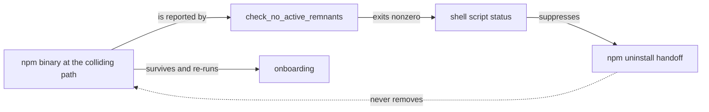
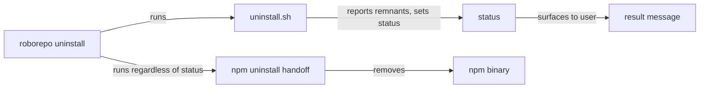
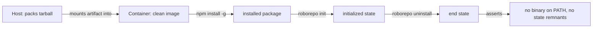

# Prove Install and Uninstall on a Machine That Has Never Seen RoboRepo

## Summary

A real clean-Mac test found that `roborepo uninstall` left its own binary behind, and that the
surviving binary then re-ran onboarding. No automated check caught it.

Throughout this plan, a **clean machine** means one with no RoboRepo state, no RoboRepo binary, and
no harness executable on `PATH`. Existing tests redirect `HOME`, which is not the same thing: they
still run on a host whose `PATH` carries real harnesses and a real RoboRepo install.

This plan closes both halves:

| Milestone | Delivers |
| --- | --- |
| A | The uninstall fix and its regression coverage |
| B | A container harness that runs install → init → uninstall against a genuinely clean machine |

Milestone A is largely implemented in the working tree already (see Current State). Milestone B is
unstarted and is the reason this plan exists as a durable document: without it, the same class of
bug is only findable by borrowing hardware.

## Context

The failure was observed directly on a clean Mac, running the published package:

```text
npm install -g codethings-roborepo-alpha
roborepo uninstall
  → It will also uninstall the npm package that provides `roborepo`.
  → package projection cleanup: no owned projections
  → remnant: <home>/.local/bin/roborepo

which roborepo
  → <home>/.local/bin/roborepo        # still present
```

`npm uninstall -g codethings-roborepo-alpha` then removed it correctly, so npm's own removal path
was never broken — it simply never ran.

Two properties of that machine combined to produce the bug. Its npm prefix was `~/.local`, which is
also where the shell installer puts its CLI link, so one path had two possible owners. And the
remnant check treated that path as unconditionally roborepo's own.



The gate is circular: the remnant caused the nonzero exit that suppressed the removal of that same
remnant.

The second symptom follows from the first, and it is correct behavior given a surviving binary.
`remove_runtime_state` (`scripts/install/uninstall-lib.sh`) does delete
`<state>/initialization.json`, so after a successful uninstall there is no completion marker left.
A binary that should have been removed therefore starts as if freshly installed — which it is, from
the state directory's point of view.

Fixing the binary removal fixes this symptom too. No separate change is needed.

## Goals

- `roborepo uninstall` removes an npm-installed binary on any npm prefix, including one that
  collides with the shell installer's bin directory.
- A remnant report never suppresses npm package removal.
- Automated coverage proves `roborepo` is gone after uninstall, without needing a clean machine.
- Most of `infra-packaging-02-install-lifecycle`'s harness-count matrix becomes runnable in CI.

## Non-goals

- Browser and portal UI verification. It needs a real browser and belongs with the localhoster work.
- Full VM tooling (Tart, Lima, cloud macOS runners beyond GitHub's own). The bug class here is path
  and prefix layout, which a container plus the existing `macos-latest` runner already reach.
- Replacing `scripts/test/package-install-smoke.mjs` or `scripts/test/test-install-collisions.sh`.
  Both stay; Milestone B composes them rather than reimplementing their sandboxing.
- Adding an npm test framework. The repository is zero-dependency by design.
- Changing what managed uninstall preserves by default. The workspace stays preserved.

## Current State

### Milestone A is implemented but uncommitted

`reviewed_commit` is `b0408fe`. At that commit the bug is present. In the **working tree**, another
session has already written the fix, and it is not yet committed:

| File | State at `b0408fe` | Working tree |
| --- | --- | --- |
| `scripts/install/uninstall-lib.sh` | `check_no_active_remnants` lists `~/.local/bin/roborepo` unconditionally | Adds `is_npm_owned_cli`; the path is exempt when its symlink targets `node_modules` |
| `scripts/cli/uninstall.mjs` | npm handoff gated on `status === 0` in both the CLI and portal paths | Gate removed from both; npm removal runs whenever `packageMode` |
| `scripts/test/managed-uninstall-check.mjs` | No coverage for this case | Adds `testNpmOwnedCliIsNotARemnant`, asserting both ownership directions |

Verified by running it:

```text
node scripts/test/managed-uninstall-check.mjs   → managed uninstall checks passed
```

The remaining Milestone A work is therefore confirmation and the open decisions below, not
reimplementation. **Do not rewrite these files without first checking whether the working-tree
version has been committed.**

### Ownership is read from the link target

`is_managed_link` (`scripts/install/uninstall-lib.sh`) recognizes a symlink as roborepo's own when
it points into the current checkout, the recorded prior checkout, or the skill cache — or when it
dangles. An npm bin symlink points into `node_modules` and matches none of those, which is why the
existing removal path correctly declined to delete it.

`is_npm_owned_cli` reads the same link target for the opposite purpose:

| Link target | Owner | Correct treatment |
| --- | --- | --- |
| `.../node_modules/...` | npm | Leave it; `npm uninstall -g` removes it |
| A checkout's `bin/roborepo` | Shell installer | Remove it; report it if it survives |

Both live at the same path on a colliding prefix, so the target is the only available signal.

### Existing test infrastructure already sandboxes HOME

Milestone B builds on three surfaces that exist today:

| Surface | Provides | Gap it leaves |
| --- | --- | --- |
| `scripts/test/package-install-smoke.mjs` | Packs a real tarball, installs it into an isolated npm prefix with `HOME` redirected | Runs on a host that already has harnesses on `PATH` |
| `scripts/test/test-install-collisions.sh` | Drives the interactive installer through a pty under a sandboxed `HOME` | Same host assumption |
| `.github/workflows/ci.yml` | Already runs both on an `os: [ubuntu-latest, macos-latest]` matrix | Neither runner starts without harnesses on `PATH` |

The reason `HOME` redirection is not enough: harness discovery resolves executables with `which`
(`scripts/harnesses/discovery.mjs`), which reads `PATH`. A host with Claude Code installed therefore
cannot produce the zero-harness state at all, and cannot produce "installed but never launched"
either, because its real home is already initialized.

That is the specific gap Milestone B fills, and it is narrower than "we have no sandbox".

## Proposed Design

### Milestone A — make the handoff unconditional

The fix has two halves, and both are needed. Exempting the npm binary from the remnant check stops
the false report; removing the gate stops any *other* remnant from stranding the package.



The ordering question in the original investigation — whether npm removal should move *before* the
remnant check — resolves to "neither". The two become independent: the check still runs last and
still reports, but it no longer gates. Sequencing them differently would make the remnant report
describe a machine state that the npm removal was about to change.

### Milestone A — detecting npm's global bin

The working-tree fix reads the symlink target rather than computing npm's prefix, which avoids the
question entirely for the remnant check. `npmPrefixForPackageRoot` (`scripts/cli/uninstall.mjs`)
still derives a `--prefix` for the removal itself by walking up from the app root to `node_modules`.

| Approach | Correctness | Cost |
| --- | --- | --- |
| Symlink target inspection (chosen for the check) | Reads the actual owner | No subprocess; works when npm is absent from `PATH` |
| `npm prefix -g` | Wrong when the shell's npm differs from the installing one | Spawns npm on every check |
| Walk up from `process.execPath` | Resolves the running node, not the installed package | No subprocess |

Open question below covers whether `npmPrefixForPackageRoot` handles every real layout.

### Milestone B — a container as the clean machine

The container supplies what a redirected `HOME` cannot: an empty `PATH` with respect to harnesses,
a real npm prefix, and a filesystem with no prior RoboRepo state.



The assertion that would have caught this bug is the last step:

```sh
if command -v roborepo >/dev/null 2>&1; then
  echo "FAIL: binary survived uninstall at $(command -v roborepo)" >&2
  exit 1
fi
```

Written as an `if` rather than an `&&` chain because the chain's exit status is 0 in both the pass
and fail cases under `set -e`, which makes it silently non-asserting.

### Milestone B — simulating the harness-count matrix

`infra-packaging-02-install-lifecycle` defines a five-stage matrix whose stages are distinguished by
how many harnesses exist and whether they have been launched. Because discovery resolves
executables through `PATH`, each stage is reachable by placing stub executables on `PATH` inside the
container.

| Stage | Container setup | Reachable without hardware |
| --- | --- | --- |
| 0 — no harness | Empty `PATH` additions | Yes |
| 1 — installed, never launched | Stub executable, no harness home | Yes |
| 2 — launched once | Stub executable plus an initialized home | Yes |
| 3 — two harnesses | Two stubs | Yes |
| N — all registered providers | One stub per provider from the registry | Yes |

A stub is a shell script that satisfies `which` and answers a version probe. Whether that is
sufficient depends on what discovery reads beyond presence, which is an open question below.

This does not close the packaging plan's matrix items outright — those are written as real-hardware
acceptance. It makes the same states testable continuously, so hardware verification confirms rather
than discovers.

### Milestone B — what CI already covers

`.github/workflows/ci.yml` runs the full suite plus `test-install-collisions.sh` and
`test:package-install` on both `ubuntu-latest` and `macos-latest`. The macOS runner is therefore
already present, and the original suggestion to add one is largely redundant.

What the macOS runner does *not* do is exercise a colliding npm prefix, which is the exact shape of
this bug. Configuring `npm config set prefix ~/.local` inside the container is the cheaper way to
pin that case, and it belongs in Milestone B rather than in a separate macOS-runner effort.

## Implementation Plan

### Milestone A — uninstall correctness

- [ ] Confirm whether the working-tree changes to `scripts/install/uninstall-lib.sh`,
      `scripts/cli/uninstall.mjs`, and `scripts/test/managed-uninstall-check.mjs` have been
      committed. If yes, mark the next three items done rather than redoing them.
- [ ] `is_npm_owned_cli` exempts an npm-owned CLI entry from the remnant check, and a
      shell-installer-owned entry at the same path is still reported.
- [ ] The npm handoff runs regardless of the shell script's exit status, in both `uninstallCommand`
      and `uninstallExecute`.
- [ ] `testNpmOwnedCliIsNotARemnant` covers both ownership directions.
- [ ] Verify `npmPrefixForPackageRoot` against a real npm layout that uses a `lib/node_modules`
      prefix and one that does not, since it special-cases `lib`.
- [ ] Confirm on a real machine that a fixed uninstall leaves no `roborepo` on `PATH` and that a
      subsequent reinstall starts onboarding from a clean state.

### Milestone B — containerized clean-machine harness

- [ ] Choose the base image and record why. It needs node 22 and bash; nothing else is assumed.
- [ ] Add a runner script that packs the tarball on the host and installs it inside the container,
      reusing `package-install-smoke.mjs`'s packing rather than duplicating it.
- [ ] Assert the clean-install path: `npm install -g <tarball>` → `roborepo init` succeeds with zero
      harnesses → no crash and no fabricated provider.
- [ ] Assert the clean-uninstall path: `roborepo uninstall --yes` → `command -v roborepo` finds
      nothing → no state remnants.
- [ ] Add the colliding-prefix case: configure the container's npm prefix to the same directory the
      shell installer uses, then run the same install/uninstall assertions.
- [ ] Add harness stubs and drive stages 0 through N of the matrix.
- [ ] Install from the packed tarball, never a retained one. `infra-packaging-01` dropped its
      retained-artifact step on 2026-08-22 because the real transition used the npm registry
      instead; packing fresh per run is what keeps the packaging path continuously covered, and a
      carried file would only re-introduce staleness.
- [ ] Assert `roborepo doctor` passes inside the container, at zero harnesses. It passed on the real
      clean machine, so a container that cannot reproduce that is modelling the wrong thing — this
      is the cheapest signal that the sandbox resembles the hardware it stands in for.
- [ ] Cover workspace restore and `roborepo workspace import` against a fixture workspace. This is
      the last unverified item in `infra-packaging-01` and the only one still needing hardware;
      covering it here removes that dependency.
- [ ] Assert re-running `roborepo` after a successful uninstall does not re-enter onboarding. The
      surviving binary made onboarding restart on real hardware, and asserting the binary is gone
      does not by itself prove the user-visible symptom is.
- [ ] Register the runner as a `test:*` script in `package.json` and wire it into CI as its own
      step, following how `test-install-collisions.sh` is kept separate from `npm test`.
- [ ] Make the runner skip with a clear message when Docker is unavailable, so a contributor without
      it still gets a green local suite.

## Validation

Milestone A is verified by the existing suite. Run against the working tree during this plan's
research, the targeted check already passes:

```text
node scripts/test/managed-uninstall-check.mjs   -> pass
node scripts/test/plan-docs-check.mjs           -> pass
node scripts/test/plan-docs-findings-check.mjs  -> pass
```

The full suite still needs a run once the fix is committed:

```sh
bash scripts/test/test-roborepo.sh --quiet
```

Milestone B's own acceptance is that it fails against the pre-fix code. Before trusting the harness,
revert the Milestone A fix and confirm the container run reports the surviving binary — a harness
that has never failed proves nothing.

| Check | Proves |
| --- | --- |
| Container install → `init` with zero harnesses | The state a developer machine cannot produce |
| Container uninstall → `command -v roborepo` empty | The regression this plan exists for |
| Same, with a colliding npm prefix | The specific machine shape that broke |
| Stages 0–N with stub executables | Harness-count presentation without hardware |
| `roborepo doctor` at zero harnesses | The container matches what the real clean machine did |
| Workspace restore / `workspace import` | Closes `infra-packaging-01`'s last hardware-blocked item |
| `roborepo` after uninstall does not re-onboard | The user-visible symptom, not just the missing binary |
| Runner skips cleanly without Docker | Local suite stays green for contributors |

Follow the repository's existing convention: register the runner as a `test:*` script and add it to
CI as a distinct step rather than folding it into `npm test`, which keeps a slow failure legible.

## Risks

| Risk | Mitigation |
| --- | --- |
| Container passes while real macOS still fails | Keep the `macos-latest` CI leg; the container adds a case rather than replacing a platform |
| Harness stubs diverge from real harness behavior | Assert only presence-and-count behavior with stubs; leave behavioral checks to the real harnesses |
| Docker becomes a hard test dependency | Skip with a message when absent, matching how pty checks already skip without `expect` |
| The plan duplicates existing sandboxing | Compose `package-install-smoke.mjs` and `test-install-collisions.sh`; add no second packing path |
| Milestone A is re-implemented over an uncommitted fix | The first checklist item is to check commit status before writing code |

## Open Questions

- **Does `npmPrefixForPackageRoot` handle every real npm layout?** It returns `null` unless the app
  root's last segment is the package name and the path contains `node_modules`, and it special-cases
  a `lib` parent. Verified against no real layout during this investigation.
- **Is a stub executable enough for harness discovery?** `scripts/harnesses/discovery.mjs` resolves
  with `which`, but whether anything downstream probes version or capability output is unconfirmed.
  This decides how elaborate the matrix stubs must be.
- **Which base image?** Not chosen. It needs node 22 and bash, and the choice affects whether the
  colliding-prefix case can be configured the same way it occurs on macOS.
