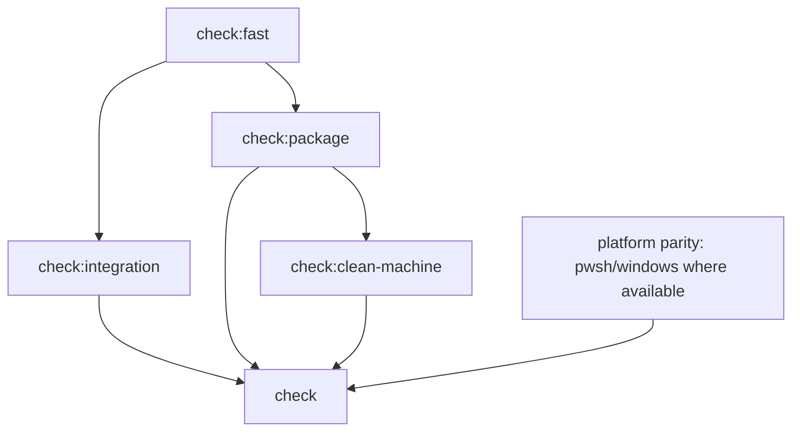

# Tier and Diff-Scope Validation

## Summary

`npm run check` is the local CI parity gate. That makes it the right command before declaring a
branch merge-ready, but the wrong default loop for ordinary cleanup. It currently serializes repo
health checks, the large shell suite, install collision coverage, package-mode lifecycle tests,
Docker clean-machine sandboxes, and optional PowerShell installer parity under one command — for
every PR, regardless of what changed. `.github/workflows/ci.yml` has no `paths`/`paths-ignore`
filtering today, so a docs-only PR runs the identical full gate as a core refactor.

This plan creates explicit validation tiers so maintainers and agents can choose the smallest
command that proves the current change, and makes CI itself diff-aware so a change that cannot
affect a tier's outcome skips that tier — while preserving one complete gate for PR merge readiness
when the diff actually warrants it.

## Goals

- Keep `npm run check` as the full local CI parity gate.
- Add first-class scripts for fast, integration, package, and clean-machine validation.
- Make each tier's purpose, cost, and expected use clear in code and docs.
- Add per-stage timing output so slow legs are visible without inspecting CI logs by hand.
- Keep CI behavior equivalent or stronger than today.
- Give agents a deterministic rule for when targeted checks are enough and when full parity is
  required before handoff or push.
- Make CI skip a tier when the changed paths cannot affect that tier's outcome (e.g. a docs-only or
  plan-doc-only PR skips package/clean-machine/Docker tiers), without weakening required-status-check
  guarantees — a skipped job must not silently read as an unreported check on the PR.

## Non-Goals

- Removing Docker clean-machine coverage.
- Weakening PR or release readiness requirements.
- Rewriting the underlying tests for speed before the tiers expose where time is going.
- Replacing CI's macOS and Linux coverage with a single platform.
- Skipping a tier by guessing intent from a PR title or description — skip decisions are based on
  changed paths only.
- Allowing a skipped tier to silently satisfy a branch-protection required check; if a tier's job
  does not run, its required-check status must be explicit (reported as skipped/success), never
  absent.

## Current State

`package.json` exposes many focused `test:*` scripts, but `npm run check` points at
`scripts/test/ci.sh`, which runs the full suite as one serial workflow:

```text
npm run check
  bash scripts/doctor.sh --quiet
  bash scripts/test/test-roborepo.sh --quiet
  bash scripts/test/test-install-collisions.sh
  selected package / harness / lifecycle node checks
  npm run --silent test:package-install
  strict Docker clean-machine checks when Docker is available
  optional PowerShell installer check when pwsh is available
```

`.github/workflows/ci.yml` calls `npm run check` on both Ubuntu and macOS. A separate Windows job
runs `scripts/test/windows-installer-check.ps1`.

The current shape has one useful property: local `npm run check` means CI parity. It also has a
cost problem: maintainers and agents either run the entire expensive gate or manually select
targeted checks without a shared contract for when that is acceptable.

## Proposed Design

Keep one full gate and add named tiers beneath it.

| Script | Intended use | Contains |
| --- | --- | --- |
| `check:fast` | ordinary local cleanup and review feedback | `doctor --quiet`, generated drift checks, orphan test coverage checks, focused catalog/render/config checks that do not install packages or start containers |
| `check:integration` | broad repo behavior changes without package/container risk | `check:fast`, `test-roborepo.sh --quiet`, install collision suite, core lifecycle and harness node checks |
| `check:package` | package-mode, install/update/uninstall, npm tarball, published file list | package install smoke, package lifecycle/default-enabled/initialization checks, package-mode permission/config checks |
| `check:clean-machine` | clean `HOME`, clean `PATH`, Docker sandbox, package artifact in container | strict clean-machine container, install sandbox, permissions sandbox |
| `check` | PR merge readiness and CI parity | all relevant tiers plus platform-specific optional checks |

The split should be implemented as a shared shell runner rather than copy-pasted command lists.
Each stage should print duration.



### Diff-scoped tier selection

Map each tier to the path prefixes whose changes can affect its outcome, and use that map both
locally (an agent or maintainer picks the right tier for the paths they touched) and in CI (a job
step computes the changed-path set and skips a tier whose mapped paths are untouched).

| Tier | Runs when the diff touches |
| --- | --- |
| `check:fast` | any source, config, script, or manifest path |
| `check:integration` | `scripts/`, `manifests/`, harness/provider adapters, root config templates |
| `check:package` | `globals/packages/`, `scripts/cli/packages.mjs`, package manifest schema, `package.json` |
| `check:clean-machine` | install/uninstall scripts, `bin/`, Docker sandbox fixtures, anything `check:package` already triggers on |
| none of the above (e.g. `docs/`, `docs/plans/`, `*.md` outside `manifests/`) | only `check:fast`'s doc-relevant pieces, if any — see Risks before assuming markdown is always inert |

## Implementation Plan

- [ ] Inventory each command currently run by `scripts/test/ci.sh` and assign it to exactly
      one tier.
- [ ] Add a reusable shell runner for named stages with consistent headers, exit behavior, and
      elapsed time reporting.
- [ ] Add `package.json` scripts: `check:fast`, `check:integration`, `check:package`, and
      `check:clean-machine`.
- [ ] Keep `npm run check` as the full parity gate by composing the tiers.
- [ ] Decide whether `check:integration` includes `check:fast` internally or whether `check`
      composes both; document the command contract either way.
- [ ] Preserve strict Docker behavior for CI while keeping local clean-machine skips clear when
      Docker is unavailable.
- [ ] Update `.github/workflows/ci.yml` only if the split improves observability without reducing
      coverage.
- [ ] Update internal development guidance so agents use targeted tiers during iteration and full
      `npm run check` before merge-ready handoff when required.
- [ ] Add a doctor or test assertion that `npm run check` continues to include every required tier.
- [ ] Define the path-to-tier map (see Proposed design's Diff-scoped tier selection) as tracked
      config, not inline workflow logic, so both a local helper and CI read the same mapping.
- [ ] Add a CI step that computes the changed-path set against the base branch and determines which
      tiers are required for this PR.
- [ ] Resolve how a skipped tier reports its required-check status on GitHub — a job that never
      runs can leave a required check permanently pending under branch protection; verify whether
      GitHub Actions' path-filter or a job-level conditional-with-explicit-success is needed to keep
      skipped tiers from blocking merge.

## Validation

The implementation is successful when these commands pass locally:

```text
npm run check:fast
npm run check:integration
npm run check:package
npm run check:clean-machine
npm run check
```

CI should still exercise the full parity gate on pull requests whose diff warrants it. If CI is
changed to call tiers as separate steps, the union of those steps must remain equivalent to the
previous `npm run check` coverage for any diff that touches every tier's paths.

A docs-only or plan-doc-only PR — such as this repository's own `docs/plans/`-only changes — must
skip `check:package` and `check:clean-machine` without leaving either as a permanently pending
required check.

## Risks

- Splitting scripts can accidentally make `npm run check` weaker if the full gate does not compose
  every required tier.
- Tier names can drift from actual cost if slow tests are placed in `check:fast`.
- macOS/Linux differences can be hidden if CI runs different tier content by platform.
- Docker time can remain high even after tiering; the split exposes the cost but does not optimize
  the container scenarios by itself.
- A tier skipped via path filtering can leave its required GitHub status check permanently pending
  rather than passing, which blocks merge under branch protection even though nothing in the diff
  needed that tier. Must be resolved before diff-scoped skipping ships, not discovered after.
- A path-to-tier map that is too coarse (e.g. treating all of `docs/` as inert) can miss a doc change
  that legitimately affects a tier's outcome, such as an update to a doc a test asserts against.

## Open Questions

- Should `check:integration` include `check:package`, or should package behavior stay a separate
  explicit tier until `npm run check` composes both?
- Should CI display each tier as a separate workflow step for better timing and failure isolation,
  or keep a single `npm run check` command for local/remote command parity?
- What is the acceptable target runtime for `check:fast` on a normal maintainer machine?
