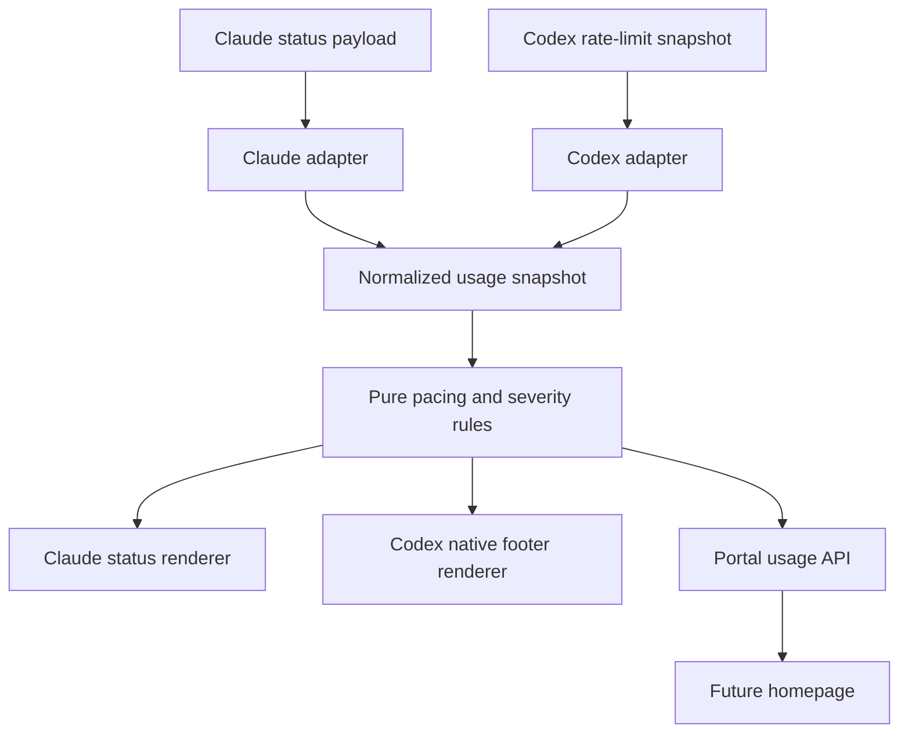
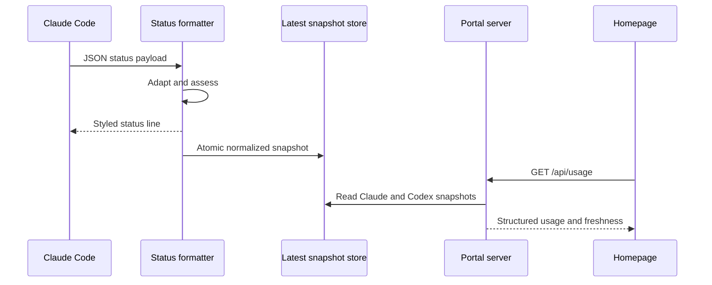

# RoboRepo Usage Statusline Enhancement — Implementation Plan

## Document status

- **Repository:** `github.com/kirinmurphy/roborepo`
- **Reviewed commit:** `d2e19b527a291223ba40442ba7ccb9fa3c3d8219`
- **Package:** `globals/packages/usage-statusline`
- **Scope:** usage normalization, weekly pacing, semantic styling, Claude/Codex parity, and a reusable data surface for the future homepage
- **Implementation language:** JavaScript for RoboRepo; Rust only where an upstream Codex change is required
- **Release policy:** do not release the enhancement with an intentionally incomplete Codex experience

## Executive summary

Enhance `usage-statusline` so Claude Code and Codex communicate usage with the same meaning and warning model:

```text
Context: 42% used · 5h: 18% used · Weekly: 15% surplus (70% used / 85% elapsed)
```

```text
Context: 42% used · 5h: 18% used · Weekly: 15% debt (85% used / 70% elapsed)
```

```text
Context: 42% used · 5h: 18% used · Weekly: Balanced (68% used / 72% elapsed)
```

The change should not be implemented as formatting logic embedded independently in each consumer. Introduce a normalized usage model and pure calculation layer. Harness adapters translate Claude and Codex source data into that model; presentation adapters render it for the status line and, later, the portal homepage.

Claude can support the complete behavior through its command-backed status line. Codex currently cannot: its native footer can show context used, but rate-limit items render remaining allowance and apply decorative theme colors by category. Codex internally has both `used_percent` and `resets_at`, but its public footer configuration does not expose a custom formatter or semantic per-value styling. Complete parity therefore requires an upstream Codex footer enhancement. This is a release dependency, not a limitation to document and ship.

The same normalized snapshot should be exposed through a read-only portal API. The future homepage can consume structured data directly and must never parse terminal output.

## Decisions captured by this plan

1. All displayed usage percentages mean **percentage used**, not percentage remaining.
2. Weekly pacing compares allocation used with time elapsed in the current limit window.
3. A difference whose absolute value is less than 5 percentage points is `Balanced`.
4. Exactly 5 points is not balanced; it is a 5% debt or surplus.
5. Debt severity and total-usage severity are calculated and styled independently.
6. Debt of 5–19 points is orange; debt of 20 or more points is red.
7. Usage greater than 70% is orange; usage greater than 85% is red.
8. The strict wording above is intentional: 70% and 85% themselves remain white; 71% and 86% cross the respective thresholds.
9. Surplus is never orange or red merely because it is large.
10. Normal available percentage values are explicitly white, not gray or terminal-muted.
11. If elapsed time is unavailable, retain the usage-only shape for that window.
12. Missing source values stay absent in the normalized model; the status line renders unavailable required slots as `—`.
13. RoboRepo remains JavaScript. Do not introduce TypeScript.
14. Turns and tool calls are not part of this enhancement. They remain a separate session-pressure feature.
15. The enhanced package is not complete until the defined Codex acceptance criteria pass.

## Current behavior

### Package resources

`globals/packages/usage-statusline/package.config.json` currently declares:

- one runtime asset: `scripts/claude-statusline.mjs`;
- one Claude harness config: `claude/statusline.json`;
- one Codex harness config: `codex/status-line.json`;
- `defaultEnabled: true`;
- category `token-optimization`.

The existing package lifecycle is already correct and should be extended rather than replaced.

### Claude today

`globals/packages/usage-statusline/claude/statusline.json` installs a command-backed Claude status line:

```json
{
  "statusLine": {
    "type": "command",
    "command": "node \"${runtime:claude-statusline.mjs}\"",
    "padding": 1
  }
}
```

`scripts/cli/package-harness-config.mjs` expands `${runtime:...}` to the managed path under:

```text
~/.roborepo/runtime/usage-statusline/
```

The current formatter reads Claude JSON from stdin and directly maps source fields to display segments:

```js
const metrics = [
  metric("Context", data?.context_window?.used_percentage),
  metric("5h", data?.rate_limits?.five_hour?.used_percentage),
  metric("Weekly", data?.rate_limits?.seven_day?.used_percentage)
]
```

Current output:

```text
Context: 42% · 5h: 18% · Weekly: 61%
```

Current thresholds are generic across all percentages:

```js
export const THRESHOLDS = {
  percent: { orange: 50, red: 70 }
}
```

The whole `label: value` segment is colored. Default values receive no ANSI color and may therefore appear gray or muted depending on the terminal theme.

### Codex today

`globals/packages/usage-statusline/codex/status-line.json` installs native footer items:

```json
{
  "tui": {
    "status_line": [
      "model-with-reasoning",
      "context-remaining",
      "five-hour-limit",
      "weekly-limit",
      "git-branch"
    ]
  }
}
```

This creates three mismatches:

| Concern | Claude | Codex |
| --- | --- | --- |
| Context direction | used | remaining |
| Rate-limit direction | used | remaining |
| Colors | threshold severity | theme/category decoration |

Current Codex source confirms:

- `context-used` is now a supported `StatusLineItem` and can replace `context-remaining`.
- `FiveHourLimit` and `WeeklyLimit` are described and rendered as remaining usage.
- the TUI already receives `RateLimitWindow.used_percent`, `window_duration_mins`, and `resets_at`.
- `status_line_use_colors` toggles category/theme colors; it does not provide warning-aware styling.

This means context direction is a RoboRepo configuration change, but used-rate-limit display, pacing text, and independent semantic coloring require Codex footer work.

### Installation, removal, and probing today

`scripts/cli/package-harness-config.mjs` currently:

- copies runtime assets to package-owned managed storage;
- merges Claude's singleton `statusLine` only when no conflicting unmanaged command exists;
- merges and deduplicates Codex `tui.status_line` entries;
- can write `tui.status_line_use_colors`;
- removes only package-owned values during disable.

`scripts/cli/package-probes.mjs` currently verifies:

- the Claude installed object exactly matches expanded package configuration;
- all desired Codex footer items exist;
- the runtime asset exists.

`scripts/test/usage-statusline-check.mjs` currently covers formatter output, missing values, clamping, threshold edges, ANSI reset behavior, `NO_COLOR`, invalid JSON, lifecycle enable/disable, managed runtime installation, and unmanaged Claude conflict preservation.

Preserve these guarantees.

## Goals

1. Give context and rate-limit percentages the same used-percentage meaning in both harnesses.
2. Show whether weekly usage is ahead of or behind the elapsed week.
3. Highlight only the values that carry warning meaning.
4. Keep usage severity independent from pacing severity.
5. Normalize harness-specific payloads before calculating or presenting values.
6. Make normalized usage available to both status lines and the future homepage.
7. Keep missing data explicit and honest.
8. Retain zero prompt-token contribution.
9. Retain default-enabled, disableable package lifecycle behavior.
10. Define testable Codex parity as a release gate.

## Non-goals

- Adding the future homepage UI itself.
- Adding turns or tool-call counts to the status line.
- Parsing Claude or Codex transcript files for rate-limit state.
- Parsing `/status`, `/usage`, or terminal output.
- Estimating a reset timestamp when the harness does not supply one.
- Calling undocumented private account endpoints.
- Persisting long-term usage history in the statusline package.
- Replacing RoboRepo telemetry or merging account allowance with locally observed token totals.
- Adding user-configurable thresholds in this iteration.
- Shipping a permanent Claude-only pacing implementation.

## Terminology

| Term | Definition |
| --- | --- |
| Used | Percentage of an allowance already consumed |
| Elapsed | Percentage of the current allowance window that has passed |
| Debt | Used percentage is ahead of elapsed percentage |
| Surplus | Elapsed percentage is ahead of used percentage |
| Balanced | Absolute used/elapsed difference is less than 5 points |
| Available | The source supplied enough valid data for the value |
| Fresh | The normalized snapshot is recent enough for the consumer's policy |
| Source payload | Harness-native input before normalization |
| Snapshot | Normalized, consumer-independent usage data |

Use “percentage points” in technical documentation because `85% - 70% = 15 points`, not a 21.4% relative increase. The compact UI may use `15% debt` because that is more readable.

## Target architecture



There are two implementation boundaries:

1. **RoboRepo JavaScript boundary:** Claude ingestion, normalized model, calculations, snapshot persistence, portal API, tests, and package lifecycle.
2. **Codex Rust boundary:** adapt native `RateLimitSnapshot` data and render the same weekly pacing semantics and semantic value styles in the TUI.

The logical contract should match across boundaries even though JavaScript cannot be imported into Codex's Rust TUI. Use shared fixtures to prevent the implementations from drifting.

## Proposed RoboRepo file structure

Evolve the package from one formatter into small modules with single responsibilities:

```text
globals/packages/usage-statusline/
  README.md
  package.config.json
  claude/
    statusline.json
  codex/
    status-line.json
  scripts/
    claude-statusline.mjs
    usage-adapters.mjs
    usage-domain.mjs
    usage-render.mjs
    usage-snapshot-store.mjs
  fixtures/
    usage-cases.json
scripts/cli/
  portal-routes-usage.mjs
scripts/test/
  usage-statusline-check.mjs
```

Keep `claude-statusline.mjs` as the executable entrypoint so installed command ownership remains stable. It should become orchestration only:

```js
const snapshot = adaptClaudeStatusPayload(data, { now: Date.now() })
const assessed = assessUsage(snapshot)
const output = renderStatusLine(assessed, { color })
```

The entrypoint may also write the latest snapshot on a best-effort basis for portal reuse. Pure adapters, domain functions, and renderers must not perform I/O.

## Normalized data contract

Use plain JavaScript objects with absent optional properties. Do not fill unavailable values with `null`, zero, inferred defaults, or placeholders inside the domain model.

```js
{
  schema: 1,
  harness: "claude",
  collectedAt: "2026-07-21T20:00:00.000Z",
  context: {
    usedPercent: 42
  },
  windows: {
    fiveHour: {
      usedPercent: 18,
      durationMinutes: 300,
      resetsAt: "2026-07-21T22:00:00.000Z"
    },
    weekly: {
      usedPercent: 70,
      durationMinutes: 10080,
      resetsAt: "2026-07-22T21:12:00.000Z"
    }
  }
}
```

The adapter should include source metadata needed for diagnostics without including credentials or raw payloads:

```js
{
  source: {
    kind: "claude-statusline",
    available: ["context.usedPercent", "windows.weekly.usedPercent", "windows.weekly.resetsAt"]
  }
}
```

Requirements:

- `schema` is an integer for future migration.
- `harness` is `claude` or `codex`.
- `collectedAt` is an ISO timestamp.
- all percentages are finite numbers clamped to `0–100` and rounded only for display;
- keep calculation precision until rendering;
- timestamps are normalized to ISO strings at the JavaScript boundary;
- `durationMinutes` comes from the source when supplied; otherwise use the documented duration of the named window only when the identity of that window is certain;
- absent fields remain absent;
- raw provider payloads are never persisted.

## Harness adapters

### Claude adapter

Map documented Claude status-line input:

| Claude source | Normalized target |
| --- | --- |
| `context_window.used_percentage` | `context.usedPercent` |
| `rate_limits.five_hour.used_percentage` | `windows.fiveHour.usedPercent` |
| `rate_limits.five_hour.resets_at` | `windows.fiveHour.resetsAt` |
| `rate_limits.seven_day.used_percentage` | `windows.weekly.usedPercent` |
| `rate_limits.seven_day.resets_at` | `windows.weekly.resetsAt` |

If Claude supplies a window duration, preserve it. Otherwise the adapter may assign 300 minutes for the explicitly named five-hour window and 10,080 minutes for the explicitly named seven-day window. Do not infer duration from a generic or renamed rate-limit slot.

Configure Claude's supported timed refresh so `elapsedPercent` does not freeze while a session is idle. The implementation must verify the exact current Claude configuration property and minimum supported version before committing it; add it to `claude/statusline.json` only after that compatibility check.

### Codex adapter

Codex's native `RateLimitSnapshot` contains primary and secondary windows whose position is not a reliable semantic identity. Select windows by `window_duration_mins`, matching the current Codex TUI behavior:

- 300 minutes → five-hour window;
- 10,080 minutes → weekly window;
- other durations remain available to future consumers but must not be mislabeled weekly.

Map:

| Codex source | Normalized target |
| --- | --- |
| token-count context calculation | `context.usedPercent` |
| matching window `used_percent` | `windows.<name>.usedPercent` |
| matching window `window_duration_mins` | `windows.<name>.durationMinutes` |
| matching window `resets_at` | `windows.<name>.resetsAt` |

Do not derive used percentage from the formatted `##% left` string. Use `RateLimitWindow.used_percent` directly before text rendering.

For the portal data collector, use Codex's documented app-server request `account/rateLimits/read`. It returns structured rate-limit snapshots and has an update notification, `account/rateLimits/updated`. Start a short-lived request when the portal needs fresh data or maintain a bounded process only while `roborepo serve` is running. Do not start an app-server process on every footer render.

The collector must:

- require existing Codex ChatGPT authentication;
- never read or copy authentication tokens itself;
- use JSON-RPC over the documented app-server interface;
- apply a short timeout;
- terminate a short-lived child cleanly;
- merge sparse `account/rateLimits/updated` values only into a known full snapshot;
- return an unavailable result on authentication or process failure;
- never block the portal page indefinitely.

## Pacing calculations

### Elapsed percentage

Calculate elapsed time from the known window duration and reset time:

```text
windowStart = resetsAt - duration
elapsed = 100 × (now - windowStart) / duration
```

Equivalent form:

```text
elapsed = 100 × (1 - (resetsAt - now) / duration)
```

Clamp elapsed to `0–100` to handle clock skew, just-reset boundaries, or stale data.

Do not calculate elapsed if any of these are unavailable or invalid:

- `resetsAt`;
- positive `durationMinutes`;
- a valid collection/reference time.

### Balance calculation

```js
export const assessBalance = ({ usedPercent, elapsedPercent }) => {
  if (!Number.isFinite(usedPercent) || !Number.isFinite(elapsedPercent)) {
    return { state: "unavailable" }
  }

  const difference = usedPercent - elapsedPercent
  const magnitude = Math.abs(difference)

  if (magnitude < 5) return { state: "balanced", difference }
  if (difference > 0) return { state: "debt", difference, magnitude }
  return { state: "surplus", difference, magnitude }
}
```

Keep the unrounded difference for classification, then round the displayed magnitude. This prevents a raw `4.6` from being classified as balanced but displayed misleadingly as `5% debt`. Recommended display behavior is to round inputs first to whole percentage points and use those displayed values for the difference and classification. That ensures the visible arithmetic always matches the label:

```text
85% used - 70% elapsed = 15% debt
```

Adopt one policy consistently in both JavaScript and Rust. This plan recommends **display-rounded inputs drive the UI assessment**.

## Severity model

Return semantic styles from the domain layer. Do not embed ANSI codes or terminal colors in calculation functions.

### Usage severity

| Used value | Severity |
| --- | --- |
| `0–70%` | normal |
| `>70–85%` | warning |
| `>85%` | critical |

### Debt severity

| Debt | Severity |
| --- | --- |
| `<5 points` | balanced/no debt style |
| `5–19 points` | warning |
| `>=20 points` | critical |

### Surplus severity

Surplus is normal regardless of magnitude. High total used may still independently color the `##% used` text.

### Semantic result example

```js
{
  state: "debt",
  magnitude: 15,
  debtSeverity: "warning",
  usedSeverity: "warning",
  usedPercent: 85,
  elapsedPercent: 70
}
```

Do not collapse these into one overall severity before rendering. A weekly segment may legitimately contain two differently styled values.

## Rendering contract

### Weekly output states

| Available data | Output |
| --- | --- |
| used + elapsed, debt | `Weekly: 15% debt (85% used / 70% elapsed)` |
| used + elapsed, surplus | `Weekly: 15% surplus (70% used / 85% elapsed)` |
| used + elapsed, balanced | `Weekly: Balanced (68% used / 72% elapsed)` |
| used only | `Weekly: 85% used` |
| neither | `Weekly: —` |

For five-hour usage, retain the compact usage-only display unless five-hour pacing is separately approved later:

```text
5h: 18% used
```

### Independent styling

For this output:

```text
Weekly: 20% debt (90% used / 70% elapsed)
```

Apply:

- red only to `20% debt`;
- red only to `90% used`;
- white to `70% elapsed`;
- default label styling to `Weekly:` and punctuation.

For this output:

```text
Weekly: 15% surplus (75% used / 90% elapsed)
```

Apply:

- white to `15% surplus`;
- orange only to `75% used`;
- white to `90% elapsed`.

The renderer therefore needs styled fragments, not a single tone assigned to an entire metric.

Conceptual JavaScript shape:

```js
[
  { text: "Weekly: ", tone: "label" },
  { text: "15% debt", tone: "warning" },
  { text: " (", tone: "label" },
  { text: "85% used", tone: "warning" },
  { text: " / ", tone: "label" },
  { text: "70% elapsed", tone: "normalPercent" },
  { text: ")", tone: "label" }
]
```

### Color mapping

For Claude:

| Semantic tone | ANSI behavior |
| --- | --- |
| `normalPercent` | explicit white |
| `warning` | orange (`38;5;208`) |
| `critical` | bright red (`91`) |
| `label` | terminal default |
| `unavailable` | terminal default or existing muted appearance |

Reset style after every colored fragment to prevent bleed. Continue honoring `NO_COLOR`; when it is present, output the exact same text with no ANSI sequences.

For Codex, the upstream implementation should use semantic theme roles or explicit warning colors applied to the same fragments. Disable the current package's decorative category colors:

```json
{
  "tui": {
    "status_line_use_colors": false
  }
}
```

Then enable semantic usage colors through the new upstream capability. If upstream adds a separate configuration switch, RoboRepo should own and probe that switch explicitly.

## Codex upstream workstream

Complete parity cannot be achieved solely by editing RoboRepo's current Codex JSON. Implement or land an upstream Codex capability before releasing this enhancement.

### Preferred upstream design

Add native semantic footer items backed by structured TUI state, for example:

```text
five-hour-used
weekly-pacing
```

`weekly-pacing` should render from the existing `RateLimitWindow` rather than invoking an external command. It should:

1. find the 7-day window by duration;
2. use `used_percent` directly;
3. calculate elapsed from `resets_at` and duration;
4. apply the shared balance and severity thresholds;
5. render styled fragments so debt and used values can differ;
6. fall back to `Weekly: ##% used` when reset time is absent;
7. omit or show an unavailable value consistently when the window is absent.

Likely Codex touchpoints, based on the reviewed upstream source:

- `codex-rs/tui/src/bottom_pane/status_line_setup.rs`
  - add/configure native item variants, descriptions, parsing, and previews;
- `codex-rs/tui/src/chatwidget/status_surfaces.rs`
  - build values from `RateLimitSnapshotDisplay` and window selection;
- `codex-rs/tui/src/bottom_pane/status_line_style.rs`
  - support semantic fragment styles rather than category-only styling;
- `codex-rs/tui/src/bottom_pane/status_surface_preview.rs`
  - add representative setup-preview output;
- `codex-rs/tui/src/chatwidget/tests/status_and_layout.rs`
  - cover selection, used-direction output, missing reset, and window matching;
- status-line snapshot tests
  - cover fragment-level warning colors and no-color behavior.

### Upstream compatibility strategy

After the capability is released:

- establish the minimum supported Codex version;
- change RoboRepo's Codex configuration from `context-remaining` to `context-used`;
- replace `five-hour-limit` and `weekly-limit` with used/pacing equivalents;
- set decorative theme colors off if still necessary;
- extend live probes to verify all owned scalar settings as well as array items;
- fail package compatibility checks on older Codex versions instead of silently installing the old semantics.

Do not retain the old remaining-percentage fields as a permanent fallback. The product is not being released until parity is complete.

### Shared conformance fixtures

`fixtures/usage-cases.json` should be language-neutral input/expected-output data consumed by:

- RoboRepo Node tests;
- upstream Codex Rust tests, copied or generated during the upstream work;
- optional portal API contract tests.

Example fixture:

```json
{
  "name": "weekly debt warning",
  "usedPercent": 85,
  "elapsedPercent": 70,
  "expected": {
    "state": "debt",
    "magnitude": 15,
    "debtSeverity": "warning",
    "usedSeverity": "warning",
    "text": "Weekly: 15% debt (85% used / 70% elapsed)"
  }
}
```

## Snapshot persistence for non-CLI consumers

The status-line formatter currently has no stable data output beyond stdout. Add a small latest-snapshot store under RoboRepo state:

```text
~/.roborepo/usage/latest/claude.json
~/.roborepo/usage/latest/codex.json
```

Add paths in `scripts/cli/state-paths.mjs`:

```js
export const usageDir = path.join(roborepoStateDir, "usage")
export const usageLatestDir = path.join(usageDir, "latest")
```

Write only normalized snapshots, never raw harness payloads.

### Write behavior

- Claude: after formatting successfully, write the normalized snapshot best-effort.
- Codex: the portal/app-server adapter writes a normalized snapshot after a successful read.
- write atomically using a temporary file in the same directory and rename;
- isolate by harness to avoid concurrent overwrite;
- include `collectedAt` and source kind;
- a failed write must not suppress or delay the status line;
- never log raw input on failure;
- apply a restrictive user-only file mode where supported;
- do not append history in this feature.

Because Claude may execute the status-line command frequently, avoid unnecessary writes: compare a stable serialized snapshot excluding `collectedAt`, or apply a small minimum write interval. The terminal output must still refresh every invocation.

### Freshness

The store should return both data and freshness metadata:

```js
{
  snapshot,
  freshness: {
    state: "fresh",
    ageMs: 12000
  }
}
```

Recommended initial policy:

- fresh: at most 2 minutes old;
- stale: older than 2 minutes but still readable;
- unavailable: absent or invalid.

The homepage should display stale data as stale rather than hide it or present it as live.

## Portal API for the future homepage

Add a dedicated route module rather than placing usage behavior in telemetry routes:

```text
scripts/cli/portal-routes-usage.mjs
```

Register it in `scripts/cli/portal-server.mjs` following the existing domain route pattern used by:

- `portal-routes-telemetry.mjs`;
- `portal-routes-config.mjs`;
- `portal-routes-localhoster.mjs`;
- `portal-routes-plans.mjs`.

Proposed endpoint:

```http
GET /api/usage
```

Response:

```json
{
  "schema": 1,
  "generatedAt": "2026-07-21T20:00:00.000Z",
  "harnesses": {
    "claude": {
      "available": true,
      "freshness": { "state": "fresh", "ageMs": 12000 },
      "usage": {
        "context": { "usedPercent": 42, "severity": "normal" },
        "weekly": {
          "usedPercent": 70,
          "elapsedPercent": 85,
          "balance": { "state": "surplus", "magnitude": 15 },
          "usedSeverity": "normal",
          "debtSeverity": "normal"
        }
      }
    },
    "codex": {
      "available": false,
      "reason": "not-collected"
    }
  }
}
```

API requirements:

- return normalized values and semantic results, not preformatted terminal strings;
- include per-harness availability and freshness;
- never expose home paths, auth data, raw provider responses, or process diagnostics;
- avoid coupling to the telemetry database;
- keep calculations in `usage-domain.mjs`, shared with the formatter;
- allow a future homepage to choose an active harness or show both;
- use `Cache-Control: no-store` for live local state;
- return quickly from cached snapshots, with optional explicit refresh separated from the read endpoint.

If live Codex refresh is needed, prefer a separate route such as:

```http
POST /api/usage/refresh
```

This makes process startup and latency explicit. Do not make every homepage poll start a new Codex app-server.



## Relationship to telemetry

RoboRepo telemetry already records session-level `assistant_turns` and `tool_calls` in `scripts/cli/telemetry-capture.mjs`. That data is derived from transcripts and serves historical/session analysis. It should not be used as an account-usage source for this feature.

Keep these domains separate:

| Domain | Source | Purpose |
| --- | --- | --- |
| Account usage | harness/provider rate-limit snapshot | allowance and pacing |
| Context usage | current harness session | immediate context pressure |
| Telemetry | hook/transcript-derived records | historical behavior and investigation |

The future homepage may visually combine their widgets, but the API and labels must preserve provenance. Do not represent locally observed tokens as the weekly provider allowance.

Turns/tool calls remain a follow-up because neither current status-line surface supplies equivalent values cleanly across harnesses. If later added, use a session counter service with explicit identity and concurrency handling, not transcript scanning inside the footer process.

## Package lifecycle changes

### `package.config.json`

Register every installed runtime dependency as a `runtime-asset`. The current installer copies individual declared files and does not automatically include sibling imports.

For example:

```json
{
  "resources": [
    {
      "type": "runtime-asset",
      "source": "scripts/claude-statusline.mjs"
    },
    {
      "type": "runtime-asset",
      "source": "scripts/usage-adapters.mjs"
    },
    {
      "type": "runtime-asset",
      "source": "scripts/usage-domain.mjs"
    },
    {
      "type": "runtime-asset",
      "source": "scripts/usage-render.mjs"
    },
    {
      "type": "runtime-asset",
      "source": "scripts/usage-snapshot-store.mjs"
    }
  ]
}
```

Verify that relative ESM imports still resolve after all files are copied into the managed runtime directory.

### Codex scalar ownership gap

`package-harness-config.mjs` can set `status_line_use_colors`, but its current unmerge path removes only array items and does not remove or restore an owned scalar. Do not add the scalar to package config without fixing ownership.

Extend generic harness-config lifecycle behavior to:

- record whether the scalar existed before package enable;
- preserve an unmanaged existing value or report a conflict;
- restore the previous value on disable when RoboRepo changed it;
- probe the scalar's live state;
- avoid deleting unrelated `[tui]` settings.

Use the existing root-config state/ownership mechanisms rather than inventing package-specific backup files.

### Claude singleton behavior

Preserve the current safety behavior:

- matching managed `statusLine` may be updated;
- conflicting unmanaged `statusLine` remains unchanged;
- enable reports the conflict without corrupting the setting;
- disable removes only the exact managed object.

If a refresh property is added to Claude config, update equality/probe tests so the installed object is treated as one owned singleton.

## Test plan

### Pure normalization tests

Cover:

1. Claude all fields available.
2. Claude reset time missing.
3. Claude rate limits missing.
4. Codex primary/secondary windows in either order.
5. Codex weekly-only, five-hour-only, and additional monthly windows.
6. zero values.
7. decimals.
8. numeric strings only if documented as possible.
9. invalid values, `NaN`, infinity, negative, and above 100.
10. invalid reset timestamps.
11. missing duration.
12. source payload remains unmodified.
13. absent properties remain absent.

### Pacing boundary tests

| Used | Elapsed | Expected |
| ---: | ---: | --- |
| 68 | 72 | Balanced |
| 70 | 75 | 5% surplus |
| 75 | 70 | 5% debt, orange debt |
| 89 | 70 | 19% debt, orange debt |
| 90 | 70 | 20% debt, red debt |
| 70 | 70 | Balanced |
| 0 | 0 | Balanced |
| 100 | 100 | Balanced, red used |

Also test differences before and after display rounding so JavaScript and Rust use the same policy.

### Usage boundary tests

| Used | Expected value tone |
| ---: | --- |
| 70 | white |
| 71 | orange |
| 85 | orange |
| 86 | red |
| 100 | red |

### Renderer tests

- exact plain output for debt, surplus, balanced, used-only, and unavailable;
- only `##% debt` receives debt warning color;
- only `##% used` receives usage warning color;
- elapsed percentage stays white;
- normal percentages explicitly receive white in color mode;
- labels and punctuation do not inherit percentage color;
- an ANSI reset follows every styled fragment;
- stripped colored output equals plain output;
- `NO_COLOR` emits no ANSI escapes;
- invalid JSON remains concise, non-zero, and does not echo input;
- output contains exactly one line.

### Snapshot store tests

- atomic write produces valid JSON;
- concurrent harness writes do not collide;
- raw source payload is not stored;
- failed persistence does not fail formatter output;
- freshness boundaries are correct;
- invalid snapshot files return unavailable;
- restrictive permissions are applied where supported;
- redundant high-frequency writes are bounded.

### Portal API tests

- both harness snapshots available;
- one harness unavailable;
- stale snapshot remains visible with stale metadata;
- corrupt files do not crash the server;
- no sensitive/raw fields escape;
- assessed values match status-line fixtures;
- endpoint uses no-store caching;
- Codex refresh timeout and authentication failure return controlled errors.

### Lifecycle tests

Extend `scripts/test/usage-statusline-check.mjs` to verify:

- all runtime modules are installed and removed;
- Claude command still references the entrypoint;
- Codex includes `context-used` and the new native used/pacing fields;
- old `context-remaining`, `five-hour-limit`, and `weekly-limit` fields are absent after migration;
- decorative color setting is owned, probed, and restored safely;
- enable and disable remain idempotent;
- explicit disable persists across update;
- unmanaged Claude status line remains preserved;
- unrelated Codex footer items and `[tui]` settings remain preserved.

### Cross-implementation conformance

Run the same fixture matrix through RoboRepo JavaScript and Codex Rust. The resulting:

- state;
- magnitude;
- used severity;
- debt severity;
- plain text

must match exactly before the release gate is cleared.

## Verification commands

At minimum run:

```sh
npm run test:usage-statusline
npm run test:packages
npm run test:package-lifecycle
npm run test:package-default-enabled
npm test
npm run test:plans
npm run pack:dry-run
```

Also run upstream Codex's focused TUI/status-line Rust tests and formatter snapshots using the commands required by the Codex repository at implementation time.

Perform a manual macOS smoke test in both harnesses:

1. enable `usage-statusline`;
2. restart each harness if required for config reload;
3. verify used-direction context and limits;
4. verify white normal percentages;
5. inject or naturally observe warning and critical fixture values;
6. verify debt and used colors independently;
7. verify elapsed changes after timed refresh;
8. verify fallback when reset time is missing;
9. run `roborepo serve` and inspect `/api/usage`;
10. disable the package and verify owned configuration and runtime assets are removed.

## Implementation sequence

### Phase 1 — Lock contracts and compatibility

1. Record current Claude and Codex minimum versions.
2. Verify Claude reset timestamp and refresh configuration from current official documentation.
3. Verify Codex app-server `account/rateLimits/read` response shapes against the supported version.
4. Approve the normalized schema and language-neutral fixtures.
5. Preserve the exact boundary decisions in constants and tests.

### Phase 2 — Extract the RoboRepo domain layer

1. Move source mapping into `usage-adapters.mjs`.
2. Move clamping, elapsed calculation, balance classification, and severity into `usage-domain.mjs`.
3. Change `usage-render.mjs` to produce fragment-level semantic output.
4. Reduce `claude-statusline.mjs` to stdin/orchestration/stdout.
5. Keep all existing error and `NO_COLOR` guarantees.

### Phase 3 — Add snapshot reuse and portal API

1. Add usage state paths.
2. Implement bounded atomic latest-snapshot persistence.
3. Add the read-only `/api/usage` route.
4. Add the explicit Codex refresh path using app-server.
5. Add availability and freshness results.
6. Keep telemetry storage and analysis unchanged.

### Phase 4 — Complete Codex upstream support

1. Add used-rate-limit and weekly-pacing native items.
2. Add fragment-level semantic styles.
3. Reuse existing structured `RateLimitSnapshotDisplay` data.
4. Add missing-reset fallback.
5. Add fixture-aligned Rust tests and snapshots.
6. Land and release the upstream capability.
7. Record the released minimum Codex version.

### Phase 5 — Update package configuration and lifecycle

1. Switch Codex to `context-used`.
2. select the new Codex used/pacing items.
3. disable decorative category colors with safe scalar ownership.
4. register all JavaScript runtime assets.
5. extend package probes.
6. update README and package preview copy.

### Phase 6 — Full verification and release gate

1. Run Node unit and lifecycle tests.
2. Run Codex focused Rust and snapshot tests.
3. Run shared conformance fixtures across both implementations.
4. Run manual macOS Claude and Codex smoke tests.
5. Verify portal API freshness/unavailability behavior.
6. run full RoboRepo and package smoke suites.

## Release gates

Do not mark the plan complete or release the enhanced package until all are true:

- Claude and Codex context values both show percentage used.
- Claude and Codex rate limits both show percentage used.
- both harnesses render weekly debt, surplus, and balanced with the same boundary rules.
- both harnesses independently style debt and total-used values.
- normal percentages render white.
- missing reset time falls back to usage-only output.
- exact 5-point and 20-point debt boundaries pass shared fixtures.
- Codex capability exists in a released supported version.
- RoboRepo rejects or clearly blocks incompatible older Codex versions.
- `/api/usage` returns normalized structured data without parsing footer text.
- package enable/disable ownership remains safe and idempotent.
- no raw payloads, credentials, or private account data are persisted.
- full tests and macOS smoke tests pass.

## Documentation updates

Update `globals/packages/usage-statusline/README.md` to cover:

- every percentage means used;
- weekly debt/surplus/balanced definitions;
- exact balance and severity thresholds;
- independent debt and usage highlighting;
- explicit white normal percentages;
- fallback when elapsed time is unavailable;
- `—` means unavailable, not zero;
- zero prompt-token and no model-call behavior;
- latest-snapshot/API availability for portal consumers;
- minimum Claude and Codex versions;
- how to preview each shared fixture;
- why turns/tool calls are a separate feature.

Update the completed implementation plan only with a short supersession link or new completion summary. Do not rewrite its historical record of the original implementation.

## Risks and mitigations

| Risk | Mitigation |
| --- | --- |
| Codex upstream timing delays release | Treat upstream landing/version as an explicit dependency and keep the current package released separately until the enhancement is complete |
| JavaScript and Rust rules drift | Shared language-neutral fixtures and cross-implementation release gate |
| Rolling windows reset at unexpected times | Calculate from source `resetsAt` and duration; never assume calendar-week boundaries |
| Reset time is absent | Render current usage-only form |
| Decorative Codex colors conflict with semantic colors | Disable category colors with owned scalar lifecycle; apply semantic styles in the new item renderer |
| Frequent Claude invocation causes excessive disk writes | Best-effort atomic writes with deduplication/minimum interval |
| Stale homepage state looks live | Include and display explicit freshness |
| Portal refresh starts too many Codex processes | Separate cached GET from explicit/bounded refresh and reuse while portal is active |
| Existing unmanaged statusline is overwritten | Preserve current singleton conflict behavior |
| Codex config disable removes user settings | add scalar provenance/restore behavior before owning color configuration |
| Monthly or other windows are mislabeled weekly | select by duration, not primary/secondary position |

## Final deliverables

1. Refactored JavaScript usage adapter, domain, renderer, and Claude entrypoint.
2. Shared conformance fixture set.
3. Enhanced Claude weekly pacing and fragment-level styling.
4. Released upstream Codex used/pacing footer capability.
5. Updated RoboRepo Codex config and compatibility gate.
6. Safe Codex scalar configuration ownership and probes.
7. Atomic normalized latest-snapshot storage.
8. Read-only `/api/usage` portal endpoint plus bounded Codex refresh path.
9. Expanded unit, lifecycle, API, and conformance tests.
10. Updated package documentation and historical-plan cross-reference.

