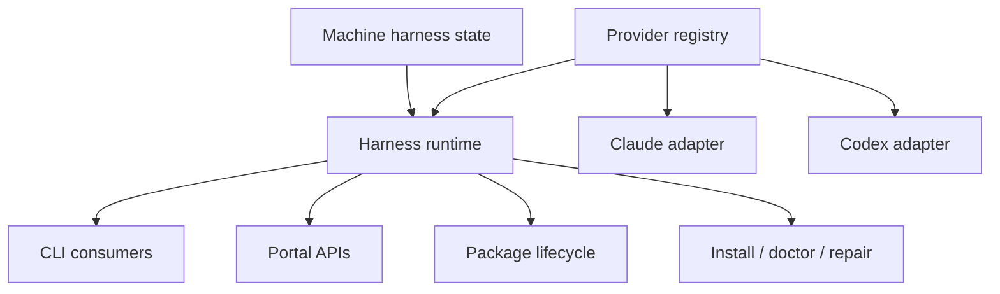
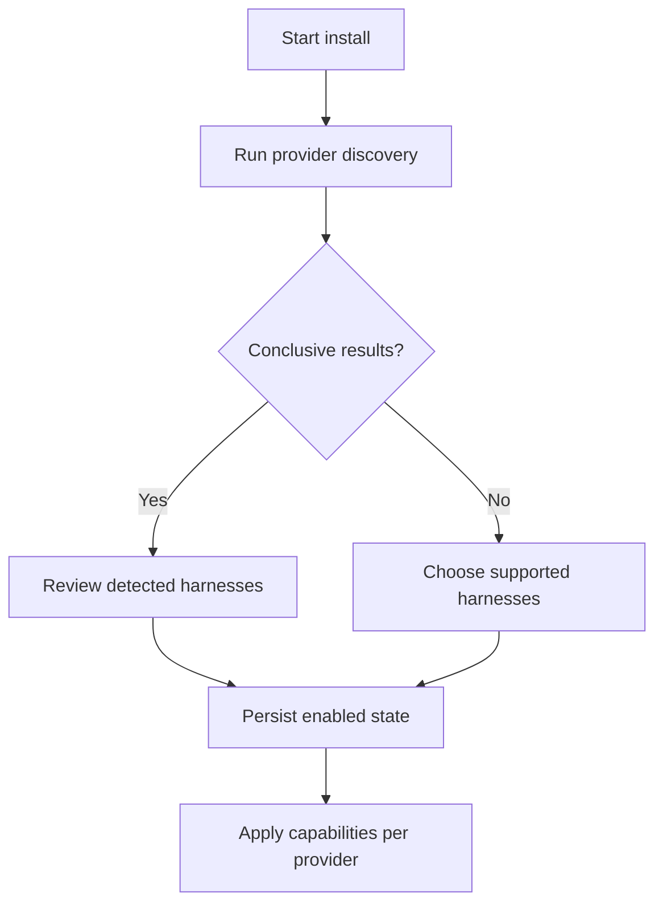

# Discoverable Harness Provider Architecture

## Summary

Replace RoboRepo's fixed Claude/Codex assumptions with an app-owned harness-provider registry and a
small adapter contract.

RoboRepo should:

- discover which supported harnesses are installed;
- retain an explicit install-workflow selection when automatic detection is inconclusive;
- expose the discovered collection to CLI and portal consumers;
- show harness choices only when the action and provider capabilities make them meaningful;
- keep harness-specific paths, parsing, rendering, installation, telemetry, and launch behavior
  inside the owning provider;
- allow a new app-owned provider to be added without adding a new branch throughout core code.

The provider collection is dynamic at runtime, but executable provider code remains shipped and
owned by RoboRepo. A user workspace may enable, disable, or configure a known provider; it must not
name an arbitrary JavaScript module for RoboRepo to execute.

## Why this work exists

RoboRepo already behaves like an abstraction over Claude Code and Codex, but the abstraction is
mostly implicit. Harness names, home directories, config formats, hook layouts, transcript
locations, telemetry parsing, and UI labels are repeated across installers, CLI modules, portal
state, tests, and generated output.

This makes a third harness expensive to add. The implementation would need to know about the new
harness in many central orchestrators even when those orchestrators only need to ask a generic
question such as:

- Which supported harnesses are installed?
- Where is this harness's active root config?
- Can this harness install skills or commands?
- How does this harness merge a package config fragment?
- Can this harness capture telemetry?
- How is one of its transcripts found and parsed?

The goal is not to pretend every harness has identical features. The goal is to give core
consumers a stable vocabulary for shared actions while providers report unsupported or
harness-specific capabilities honestly.

## Goals

- Make the installed harness collection discoverable and persisted.
- Define a versioned schema for provider identity, detection, paths, capabilities, and adapter
  bindings.
- Define a constrained, enumerated adapter interface.
- Move Claude/Codex implementation details behind their providers.
- Make CLI choices, filters, summaries, and help derive from the runtime collection.
- Make portal harness filters and configuration views derive from API data.
- Preserve native-only behavior through capabilities and provider-specific detail rather than
  flattening it.
- Keep authored source, generated output, active harness config, and machine-local state clearly
  separated.
- Add contract tests so every provider satisfies the same core invariants.

## Non-goals

- Loading executable providers from user workspaces, npm packages, or arbitrary file paths.
- Guaranteeing feature parity between harnesses.
- Replacing package manifests with provider manifests.
- Migrating every provider-specific config format into one universal config format.
- Automatically installing a detected harness.
- Treating a home directory alone as conclusive proof that a harness is usable.
- Building a public provider marketplace.
- Redesigning the Config page's harness grid axes in this implementation.
- Implementing a new third harness as part of the abstraction migration.
- Changing the telemetry event's canonical `harness` field to a different concept.

## Terminology

| Term | Meaning |
|---|---|
| Provider | RoboRepo-owned metadata and executable adapter for one supported harness |
| Supported harness | A provider included in the installed RoboRepo application |
| Discovered harness | A supported provider for which local evidence was found |
| Enabled harness | A discovered or manually selected harness RoboRepo should manage |
| Available harness | An enabled provider that can perform a requested capability |
| Unknown harness | Local evidence that does not match an app-owned provider |
| Capability | A stable, enumerated operation or surface the provider may support |
| Adapter | Executable provider methods behind the shared contract |
| Core orchestrator | Harness-neutral workflow used by CLI, portal, packages, or install logic |

## Current state

### Existing registry seed

`manifests/platform/harnesses.tsv` currently records:

```tsv
claude	claude	claude	Claude
codex	codex	codex	Codex
```

`scripts/lib/manifests-data.sh` reads those rows, but `_manifest_home_root` still maps the only valid
tokens with a fixed shell `case`, and `scripts/install/main.sh` still assigns `has_claude` and
`has_codex` independently.

This is presence metadata, not yet a provider contract.

### Fixed path maps

`scripts/cli/paths.mjs` centralizes several paths, which is useful, but its public maps still encode
the closed set:

```js
export const harnessHome = {
  claude: path.join(os.homedir(), ".claude"),
  codex: path.join(os.homedir(), ".codex"),
};
```

The same file fixes root-config baselines and active paths and exports Claude- and Codex-specific
special paths. Consumers import those maps and then branch again.

### Provider logic embedded in shared modules

Representative examples:

- `scripts/cli/package-harness-config.mjs` switches on `component.harness` and implements both
  Claude JSON status-line merging and Codex TOML status-line merging.
- `scripts/cli/root-config-merge.mjs` chooses a parser/merger with
  `harness === "codex"`.
- `scripts/cli/config.mjs` defaults invalid provider input to Claude, constructs provider-specific
  hook and live-rule paths, and recognizes fixed config IDs.
- `scripts/cli/telemetry-transcript-locate.mjs` owns both transcript directory layouts.
- `scripts/cli/telemetry.mjs` directly wires Claude and Codex telemetry hooks during the
  telemetry-only install.
- `scripts/cli/mcp.mjs`, `mcp-claude.mjs`, and `mcp-codex.mjs` expose fixed flags and dispatch.
- `scripts/cli/hook-composition.mjs`, `rules-render.mjs`, `slash-commands.mjs`,
  `skill-links.mjs`, and package lifecycle code make closed-set assumptions.
- `scripts/build/render-agent-permissions.mjs` writes three fixed Claude/Codex targets.

### Separate installers

`scripts/install/install-claude.sh` and `scripts/install/install-codex.sh` duplicate the common
install sequence around provider-specific targets. `scripts/install/main.sh`,
`scripts/install/uninstall.sh`, `scripts/install/repair.sh`, `scripts/verify-install.sh`, and
`scripts/doctor.sh` also contain direct harness branches.

The provider-specific scripts are not inherently a problem. The problem is that central
orchestration must name each one.

### Package schema

Package configuration already declares harness targets in places such as:

```json
{
  "harnesses": ["claude", "codex"]
}
```

Package components include harness-scoped hooks, commands, config fragments, and probes. Current
validators often treat Claude/Codex as the enum rather than validating IDs against a registry and
capabilities.

### Telemetry

Telemetry already stores `event.harness` as data and derives `available_harnesses` from captured
events in `scripts/cli/telemetry-analyze.mjs`. This is the most dynamic existing consumer.

However:

- capture installation is fixed to `~/.claude` and `~/.codex`;
- event normalization contains Codex-only fields in central analysis;
- transcript lookup branches between two layouts;
- session fallback behavior defaults to Claude;
- fixtures cover only Claude and Codex;
- UI labels use raw harness IDs rather than provider display metadata.

The telemetry filter itself already follows the desired display rule:
`portal/telemetry/app.js` hides the harness filter unless more than one harness is present in the
data.

### Portal Config surface

`scripts/cli/config.mjs` and `portal/config/*` shape configuration data around fixed Claude and
Codex columns and snapshots. Adding a third provider would expand the grid horizontally.

This plan makes the data dynamic without changing the axes. A follow-up should evaluate rendering
providers as rows and resource categories as columns before the provider count grows.

### Generated and authored content

The repository correctly distinguishes:

- authored shared rules under `globals/system/rules/shared/`;
- authored provider deltas under `globals/system/rules/claude/` and `codex/`;
- provider baselines and markers under `globals/harnesses/<id>/`;
- generated files under `generated/<id>/`;
- active user files under each harness home.

The provider design must preserve this source/generated boundary. Provider adapters resolve and
render those locations; they do not make active home files authoritative repository source.

### Grounding notes (reviewed at `c1ce2b9`)

Three research passes across install/paths, root-config/packages/hooks/MCP, and telemetry/portal
confirmed this section's claims are accurate, and surfaced detail worth tracking explicitly:

- **The hardcoding is not symmetric duplication in every case — some of it is genuinely asymmetric
  behavior.** `scripts/install/uninstall.sh`'s `remove_mcp_servers()` (shells to the `claude` CLI,
  prunes `~/.claude.json`) and `strip_package_hooks()` (operates only on
  `~/.claude/settings.json`) have no Codex equivalents at all, because Codex stores MCP servers in
  `config.toml` `[mcp_servers.*]` tables and hooks in a dedicated `hooks.json` sidecar rather than
  embedding either in its root config the way Claude does. The provider contract must model this as
  distinct capability results (including `unsupported`/`degraded`), not force parity or treat it as
  duplication to be collapsed.
- **Two harness enums already risk drifting from each other**: `HARNESSES` in
  `scripts/cli/package-catalog.mjs` and `SLASH_COMMAND_HARNESSES` in
  `scripts/cli/skill-command-config.mjs` are independently maintained closed sets. A single
  capability/registry source should replace both rather than migrating one and leaving the other.
- **Default-to-Claude fallbacks are wider than initially cataloged**, also present in:
  `scripts/cli/config.mjs` (`loadConfigSource`'s `harness = "claude"` default parameter),
  `scripts/cli/portal-routes-telemetry.mjs` and `portal/telemetry/api.js` (`/api/session` harness
  query param), `scripts/cli/telemetry.mjs` (transcript title lookups), and the ternary
  `harness === "codex" ? … : …` shape repeated in `root-config-merge.mjs` and
  `local-config-repair.mjs`, where every value other than the literal string `"codex"` — including
  typos and future provider IDs — silently resolves to Claude's code path.
- **No JSON Schema validator dependency and no `*.schema.json` precedent existed in this repo before
  Phase 1.** `scripts/harnesses/provider-manifest.schema.json` is the first schema file; Phase 1
  paired it with a hand-rolled structural validator in `scripts/harnesses/contract.mjs` (matching
  the repo's existing pattern of hand-written validators like `package-catalog.mjs`'s
  `validateHarness`) rather than adding a new dependency for a document-shaped check the repo can
  already express in plain JS.

## Proposed architecture

### Ownership model



The registry describes what RoboRepo supports. Machine state describes what was detected and what
the user enabled. The runtime combines both and exposes provider instances. Consumers never import
Claude or Codex adapters directly.

### Suggested source layout

```text
scripts/
  harnesses/
    contract.mjs
    registry.mjs
    discovery.mjs
    state.mjs
    provider-manifest.schema.json
    claude/
      index.mjs
      config.mjs
      hooks.mjs
      mcp.mjs
      telemetry.mjs
      transcripts.mjs
    codex/
      index.mjs
      config.mjs
      hooks.mjs
      mcp.mjs
      telemetry.mjs
      transcripts.mjs
globals/
  harnesses/
    claude/
      provider.json
      MANAGED_BY_ROBOREPO.md
    codex/
      provider.json
      config.starter.toml
      MANAGED_BY_ROBOREPO.md
```

Do not create generic `utils.mjs` buckets. Shared contract, discovery, registry, and state modules
have distinct ownership. Provider execution files split by responsibility when they approach the
repository's 150–200 line guidance.

### Provider manifest

Use JSON for declarative metadata and a RoboRepo-owned static import table for executable adapters.
The manifest is inspectable by shell, Node, the portal, packaging checks, and docs generation
without executing provider code.

Example `globals/harnesses/claude/provider.json`:

```json
{
  "$schema": "../../../scripts/harnesses/provider-manifest.schema.json",
  "schemaVersion": 1,
  "id": "claude",
  "displayName": "Claude Code",
  "commandName": "claude",
  "adapter": "claude",
  "detection": {
    "executables": ["claude"],
    "homeCandidates": ["~/.claude"],
    "configCandidates": ["~/.claude/settings.json"],
    "minimumConfidence": "probable"
  },
  "paths": {
    "home": "~/.claude",
    "rootConfig": "~/.claude/settings.json",
    "rules": "~/.claude/CLAUDE.md",
    "skills": "~/.claude/skills",
    "commands": "~/.claude/commands"
  },
  "capabilities": [
    "root-config",
    "rules",
    "skills",
    "slash-commands",
    "hooks",
    "mcp",
    "telemetry-capture",
    "telemetry-transcripts",
    "session-launch"
  ]
}
```

The actual schema must:

- reject unknown top-level keys;
- require a lowercase stable ID;
- validate capabilities against the central enum;
- keep paths declarative and home-relative;
- prohibit arbitrary executable module paths;
- distinguish required detection evidence from optional evidence;
- define whether each path is a file or directory;
- support platform-specific detection and paths without duplicating the whole provider;
- allow provider-specific metadata only under a namespaced `extensions` object.

### Trusted adapter registry

Executable bindings remain explicit:

```js
import { claudeProvider } from "./claude/index.mjs";
import { codexProvider } from "./codex/index.mjs";

const PROVIDERS = new Map([
  [claudeProvider.id, claudeProvider],
  [codexProvider.id, codexProvider],
]);

export function listProviders() {
  return [...PROVIDERS.values()];
}

export function getProvider(id) {
  const provider = PROVIDERS.get(id);
  if (!provider) throw new Error(`unsupported harness: ${id}`);
  return provider;
}
```

This is intentionally static application code. Adding an app-owned provider requires one import
and one registry row, but does not require edits to consumers.

### Capability vocabulary

Start with capabilities demonstrated by current code:

```js
export const HARNESS_CAPABILITIES = Object.freeze([
  "root-config",
  "rules",
  "permissions",
  "skills",
  "slash-commands",
  "hooks",
  "mcp",
  "package-config",
  "telemetry-capture",
  "telemetry-rate-limits",
  "telemetry-transcripts",
  "session-launch",
  "session-resume",
]);
```

Capabilities are not marketing labels. A declared capability means the adapter implements the
corresponding contract methods and passes its contract suite.

Do not define an oversized single adapter in which every method is optional. Group methods into
small capability adapters:

```js
export function defineHarnessProvider({ manifest, adapters }) {
  validateProviderManifest(manifest);
  validateCapabilityAdapters(manifest.capabilities, adapters);
  return Object.freeze({ id: manifest.id, manifest, adapters });
}
```

Example provider composition:

```js
export const claudeProvider = defineHarnessProvider({
  manifest: claudeManifest,
  adapters: {
    discovery: claudeDiscovery,
    paths: claudePaths,
    rootConfig: claudeRootConfig,
    hooks: claudeHooks,
    telemetry: claudeTelemetry,
    transcripts: claudeTranscripts,
  },
});
```

### Shared method shapes

Keep orchestration inputs and results provider-neutral:

```js
export function discoverHarnesses({ providers, environment }) {
  return providers.map((provider) => ({
    providerId: provider.id,
    ...provider.adapters.discovery.detect(environment),
  }));
}
```

```js
export function installPackageConfig({ provider, component, context }) {
  requireCapability(provider, "package-config");
  return provider.adapters.rootConfig.mergePackageComponent({
    component,
    paths: provider.adapters.paths.resolve(context),
    context,
  });
}
```

Adapter results must be structured rather than console-only:

```js
{
  ok: true,
  changed: true,
  providerId: "codex",
  action: "merge-package-config",
  paths: ["~/.codex/config.toml"],
  warnings: []
}
```

CLI formatters may print this result. Portal handlers may serialize it. Provider methods should not
emit presentation-specific text unless the operation is explicitly a streamed installer.

### Discovery model

Discovery needs multiple evidence types because a directory may remain after uninstall and an
executable may be available through a transient toolchain.

```js
{
  providerId: "claude",
  status: "detected",
  confidence: "confirmed",
  evidence: [
    { kind: "executable", value: "claude", resolvedPath: "/usr/local/bin/claude" },
    { kind: "home", value: "~/.claude" },
    { kind: "config", value: "~/.claude/settings.json" }
  ],
  warnings: []
}
```

Use these confidence rules:

| Evidence | Suggested confidence | Default behavior |
|---|---:|---|
| Executable plus recognized config/home | Confirmed | Enable by default during first install |
| Executable only | Probable | Offer selected by default; explain missing config |
| Recognized active config only | Probable | Offer; do not assume executable can launch |
| Empty home directory only | Possible | Show unselected in install workflow |
| No evidence | Absent | Hide from ordinary runtime choices |

The provider owns evidence collection; the core owns confidence normalization and state policy.

Discovery should run:

- during first install;
- when `roborepo harness refresh` is requested;
- when doctor reports stale provider state;
- after RoboRepo is upgraded with a new provider;
- when an action explicitly requests a provider not present in cached state.

Do not scan the whole filesystem. Providers declare bounded executable names and known locations.

### Persisted machine state

Store runtime selection under the machine-local `stateRoot`, not the portable workspace:

`~/.roborepo/harnesses/state.json`

```json
{
  "schemaVersion": 1,
  "lastDiscoveredAt": "2026-07-25T18:00:00.000Z",
  "providers": {
    "claude": {
      "enabled": true,
      "selectionSource": "discovery",
      "confidence": "confirmed",
      "evidence": []
    },
    "codex": {
      "enabled": true,
      "selectionSource": "user",
      "confidence": "probable",
      "evidence": []
    }
  }
}
```

`selectionSource` distinguishes `discovery`, `user`, and `migration`. Refresh must not silently
re-enable a provider the user explicitly disabled.

Do not persist absolute executable paths or sensitive command arguments unless required. Recompute
ephemeral resolved paths during refresh.

### Disable vs. withdraw

RoboRepo does not own Claude or Codex — it does not make sense for "disable" to mean the harness
stops working. `enabled: false` (Phase 2) means only "RoboRepo stops managing this provider going
forward": no future root-config writes, no skill/command linking, no hook wiring. It is a state
bit, reversible by flipping it back, and never touches a file on disk by itself.

That is a distinct, larger operation from **withdraw**: actively unmerging RoboRepo's previously
written content back out of a provider's live config — reversing what install/apply already put
there (root config keys, hook wiring, linked skills/commands, MCP entries). Withdraw is the
provider-agnostic generalization of logic that already exists asymmetrically today (see the
grounding notes: `uninstall.sh`'s `remove_mcp_servers()` and `strip_package_hooks()` are
Claude-only), so it belongs in Phase 4 alongside uninstall's provider-ization, not as a Phase 2 side
effect.

Keep the two explicitly separate operations:

- `roborepo harness disable <id>` — flips the state bit only (Phase 2, already implemented).
- `roborepo harness withdraw <id>` (Phase 4) — unmerges RoboRepo's managed content from that
  provider's live config, using the same per-capability adapter methods uninstall uses
  (`hooks.write` with removal semantics, `mcp.remove`, `rootConfig.merge` in reverse, skill/command
  unlink). Prompts or requires `--yes` by default since it mutates live files; supports `--dry-run`
  like other mutating commands in this CLI.

A flag flip must never silently rewrite live config. `disable` alone leaves existing RoboRepo
content in place (stale but inert, since RoboRepo will not touch it further); `withdraw` is the
explicit, confirmable action that actually removes it.

### Runtime queries

Core consumers should use a narrow query surface:

```js
export function createHarnessRuntime({ registry, state }) {
  function enabledProviders() {
    return registry.list().filter((provider) => state.isEnabled(provider.id));
  }

  function providersFor(capability) {
    return enabledProviders().filter((provider) =>
      provider.manifest.capabilities.includes(capability)
    );
  }

  return Object.freeze({
    enabledProviders,
    providersFor,
    get: registry.get,
  });
}
```

Rules:

- zero matches: explain how to refresh or enable a provider;
- one match: select it implicitly when the command is unambiguous;
- multiple matches in an interactive CLI: prompt;
- multiple matches in a non-interactive CLI: require `--harness <id>` when the action cannot safely
  apply to all;
- all-provider operations: iterate only providers that declare the capability;
- explicit unsupported provider: fail; never fall back to Claude.

### CLI surface

Add a harness namespace compatible with the separate CLI-surface plan:

```text
roborepo harness list
roborepo harness inspect <id>
roborepo harness refresh
roborepo harness enable <id>
roborepo harness disable <id>
```

The CLI command catalog should use a dynamic argument provider:

```json
{
  "name": "--harness",
  "values": {
    "provider": "harness.list",
    "capability": "telemetry-capture",
    "enabledOnly": true
  }
}
```

Replace closed flags such as `--only-claude` and `--only-codex` with
`--harness <id>` or repeatable `--harness <id>`. If backward compatibility is not required, remove
the old flags in the same migration rather than retaining two selection models.

Human-readable output uses `displayName`; stable command arguments and persisted data use `id`.

### Install workflow



Refactor the current `has_claude`/`has_codex` logic into a loop over discovery results. The common
installer owns sequencing; adapters or provider-scoped scripts own native actions.

Shell should consume normalized provider records emitted by Node as TSV or JSON rather than
reimplementing the provider schema. Avoid parsing complex JSON with ad hoc shell expressions.

Example:

```bash
while IFS=$'\t' read -r provider_id display_name; do
  node "${repo_root}/scripts/cli/main.mjs" harness apply "${provider_id}"
done < <(node "${repo_root}/scripts/cli/main.mjs" harness enabled --format tsv)
```

The install workflow must support one, multiple, or zero detected harnesses. Zero should install the
RoboRepo CLI and workspace safely, then explain how to enable a provider later.

### Package targeting and lifecycle

Package manifests keep stable harness IDs, but validators resolve them against the provider
registry.

Add optional capability constraints:

```json
{
  "harnesses": {
    "include": ["claude", "codex"],
    "requires": ["skills", "hooks"]
  }
}
```

Do not require every package to enumerate all future providers. Support these distinct intents:

| Intent | Representation |
|---|---|
| Works anywhere with required capabilities | `requires` only |
| Tested only on named providers | `include` plus `requires` |
| Shared component with provider overrides | shared component plus keyed override |
| Native-only package | one provider in `include` |

Provider adapters own native merge/unmerge behavior. `scripts/cli/package-harness-config.mjs`
becomes an orchestrator and no longer parses Claude JSON or Codex TOML itself.

### Rules, hooks, commands, skills, permissions, and MCP

Migrate each resource independently behind its capability contract:

| Resource | Core owns | Provider owns |
|---|---|---|
| Rules | Shared fragment selection and operation ordering | Native target, provider fragments, render shape |
| Hooks | Package hook intent and composition request | Event mapping, native config format, merge/unmerge |
| Commands | Command metadata and collision policy | Native command support, path, wrapper format |
| Skills | Shared cache ownership | Native skill directory/link behavior and metadata support |
| Permissions | Abstract allow/ask/deny behavior | Native representation and unsupported semantics |
| MCP | Server intent and selected providers | Native config store, scope mapping, add/remove |
| Root config | Conflict policy, backups, drift state | Format parse/merge/render and active/baseline paths |

The contract must allow `unsupported` and `degraded` results. For example, Codex currently lacks a
direct equivalent for some Claude permission behavior; the provider should report that rather than
the core silently translating it.

### Telemetry

Keep `harness` as the canonical provider ID on normalized events.

Split telemetry into:

1. provider capture adapter;
2. provider raw-event parser;
3. shared normalized event schema;
4. shared analysis;
5. provider transcript adapter;
6. provider-specific optional extensions.

Example parser contract:

```js
export function parseTelemetryRecord({ provider, record, context }) {
  requireCapability(provider, "telemetry-capture");
  return provider.adapters.telemetry.parse(record, context);
}
```

Provider-specific data belongs under a namespaced extension:

```json
{
  "harness": "codex",
  "event": "turn.completed",
  "details": {
    "provider": {
      "codex": {
        "rateLimits": {}
      }
    }
  }
}
```

Replace central properties such as `codex_provider_rate_limits` with either:

- a normalized rate-limit view produced only when a provider declares
  `telemetry-rate-limits`; or
- provider extension data rendered through provider metadata.

The portal should receive:

```json
{
  "availableHarnesses": [
    { "id": "claude", "displayName": "Claude Code" },
    { "id": "codex", "displayName": "Codex" }
  ]
}
```

The filter remains hidden for zero or one available harness and appears for two or more. "Available"
here means distinct harness values present in the queried telemetry data, not currently-enabled
providers — a harness disabled after producing history must stay filterable for that historical
data, so enable/disable state must never hide past events. Filtering
continues to use the stable ID in URLs and API requests.

Remove default-to-Claude behavior from `/api/session` and `portal/telemetry/api.js`. A session
request must carry a known harness ID because transcript location is provider-specific.

### Portal Config data

Return provider collections rather than fixed object keys:

```json
{
  "harnesses": [
    {
      "id": "claude",
      "displayName": "Claude Code",
      "enabled": true,
      "capabilities": ["root-config", "rules", "hooks"],
      "configEntries": []
    }
  ]
}
```

The browser renders the array. It must not contain `if (harness === "codex")` presentation logic.
Provider-specific labels, source paths, availability, and warnings come from the server view model.

For the initial migration, preserve the existing grid orientation but generate columns from the
array. Record the axes change as explicit follow-up work.

### Harness management panel

Add a panel below the existing Claude/Codex grid (Phase 7) showing, per provider: discovery status
(`detected`/`absent`), confidence, evidence (what RoboRepo found and where), and RoboRepo's managed
state (enabled/disabled). This is the GUI form of `roborepo harness list`/`inspect` — same runtime
data, no new backend concept.

Include the withdraw action (see "Disable vs. withdraw" above) here, not on the main grid: it is
infrastructure-level and mutates live config, so it belongs in a clearly separate, lower-attention
part of the page rather than beside routine per-resource toggles.

Bottom placement is deliberate — this panel is for occasional harness lifecycle management, not the
frequent interactions the top grid supports.

### Portal and CLI selection rule

Use the same rule everywhere:

| Runtime providers relevant to action | Behavior |
|---:|---|
| 0 | Explain that no enabled provider supports the action |
| 1 | Do not show a redundant selector; use that provider |
| 2+ | Show filter/selector with “All” only when the operation supports all-provider execution |

Filtering telemetry is safe across all providers. Mutating root config may require one explicit
provider at a time. The UI must derive whether “All” is valid from action metadata, not assume it.

### API validation

Every server route accepting a harness must:

- reject unknown provider IDs;
- reject disabled providers for mutations;
- verify the requested capability;
- never coerce an invalid value to Claude;
- return a structured error with valid choices.

Example:

```js
export function resolveRequestProvider(runtime, id, capability) {
  const provider = runtime.get(id);
  requireEnabledProvider(runtime, provider.id);
  requireCapability(provider, capability);
  return provider;
}
```

### Migration compatibility

Existing persisted telemetry and package manifests already use stable `claude` and `codex` IDs, so
they do not need identifier migration.

On first run:

- create provider state from current presence checks;
- mark the selection source as `migration`;
- preserve existing active configurations;
- do not re-run merge operations merely to populate state;
- retain current generated directory names;
- warn on package harness IDs for which no provider is installed in this RoboRepo version.

## Implementation plan

### Phase 1: Contract and schemas

- [x] Add the provider manifest JSON Schema. `scripts/harnesses/provider-manifest.schema.json`.
- [x] Add the capability enum and capability-to-required-method mapping.
  `scripts/harnesses/contract.mjs` (`HARNESS_CAPABILITIES`, `CAPABILITY_REQUIRED_METHODS`).
- [x] Define structured action, warning, unsupported, and error result schemas.
  `scripts/harnesses/schemas.mjs` (`validateAdapterActionResult`, `unsupported`/`degraded` status).
- [x] Define discovery result and persisted harness-state schemas. `scripts/harnesses/schemas.mjs`
  (`validateDiscoveryResult`, `validateHarnessState`).
- [x] Add manifest fixtures for Claude, Codex, invalid IDs, invalid capabilities, missing adapter
  bindings, and extension fields. `scripts/test/fixtures/harnesses/`.
- [x] Add app-owned Claude and Codex provider manifests without changing current behavior.
  `globals/harnesses/claude/provider.json`, `globals/harnesses/codex/provider.json` — data-only,
  no consumer reads them yet.
- [x] Validate provider manifests in `doctor`, packaging verification, and the main test suite.
  `scripts/doctor.sh` (`check_harness_manifests`), `scripts/test/harness-manifest-check.mjs`, wired
  into `test-roborepo.sh` and `npm run test:harness-manifest`.

### Phase 2: Registry, state, and discovery

- [x] Add the trusted static adapter registry. `scripts/harnesses/registry.mjs`
  (`listHarnessProviders`, `getHarnessProvider`, `hasHarnessProvider`) — static
  `claude`/`codex` adapter map, stub adapter bodies for capabilities not yet migrated
  (`scripts/harnesses/stub-adapter.mjs`, `scripts/harnesses/{claude,codex}/index.mjs`).
- [x] Add provider definition validation at startup/test time. `scripts/doctor.sh`
  (`check_harness_registry`, constructs the real registry), `npm run test:harness-registry`
  (`scripts/test/harness-registry-check.mjs`), wired into `test-roborepo.sh`.
- [x] Implement bounded executable, home, and config evidence helpers.
  `scripts/harnesses/discovery.mjs` (`collectEvidence`, `resolveExecutable` via
  `which`/`where`, home-relative existence checks — never a filesystem scan).
- [x] Implement normalized discovery confidence. `scripts/harnesses/discovery.mjs`
  (`normalizeConfidence`, `detectHarnessProvider`) — matches the plan's confidence table.
- [x] Persist enabled state under `stateRoot`. `scripts/cli/state-paths.mjs`
  (`harnessStatePath` = `~/.roborepo/harnesses/state.json`), `scripts/harnesses/state.mjs`
  (`readHarnessState`/`writeHarnessState`).
- [x] Preserve explicit disable choices across refresh. `scripts/harnesses/state.mjs`
  (`applyDiscoveryToState` keeps `selectionSource: "user"` + `enabled: false` across a
  discovery merge); covered by `harness-registry-check.mjs` and `harness-cli-check.mjs`.
- [x] Add `harness list`, `inspect`, `refresh`, `enable`, and `disable`. `scripts/cli/harness.mjs`
  + `manifests/platform/cli/command-definitions/harness/*.json`.
- [x] Add zero-, one-, and multi-provider CLI behavior tests.
  `scripts/test/harness-registry-check.mjs` (module-level, synthetic third provider proves no
  hardcoded two-provider assumption), `scripts/test/harness-cli-check.mjs` (real CLI process,
  `npm run test:harness-cli`).

### Phase 3: Paths and config adapters

- [x] Replace exported fixed path maps in `scripts/cli/paths.mjs` with provider path resolution.
  `scripts/harnesses/paths.mjs` (`resolveHarnessPath`, `hasHarnessPath`) resolves manifest paths;
  `paths.mjs`'s `harnessHome`/`rootConfigActive`/`claudeJsonPath`/`codexHooksPath` now derive from
  the registry (`pathById()`), keeping the exact same plain-object-keyed-by-id export shape so
  every existing consumer (12 files) is unaffected. `rootConfigBaseline` stays hardcoded — it is
  repo build output (`generated/<id>/...`), not a harness home-relative location the manifest
  models.
- [x] Move Claude JSON merge/render behavior into the Claude provider.
  `scripts/harnesses/claude/index.mjs` `adapters.rootConfig.merge`/`.render` wrap the existing,
  characterization-tested `mergeClaudeSettings`/`normalizeRootConfigContent` — ownership moved
  behind the contract without re-porting the implementation.
- [x] Move Codex TOML merge/render behavior into the Codex provider.
  `scripts/harnesses/codex/index.mjs`, same pattern (`mergeCodexConfig`/`normalizeRootConfigContent`).
- [x] Fixed a real default-to-Claude bug while wiring this: `mergeRootConfig`'s dispatch was a bare
  `harness === "codex" ? codex : claude` ternary, so any unrecognized harness string silently
  mis-merged as Claude. Now throws `unsupported harness: <id>`. Pinned in
  `scripts/test/root-config-merge-characterization-check.mjs`.
- [x] Added `scripts/test/root-config-merge-characterization-check.mjs` as a pre-refactor safety
  net: pins `mergeClaudeSettings`/`mergeCodexConfig`'s exact behavior (TOML comment reattachment —
  including the actual current behavior that a shared key's LOCAL comment is dropped in favor of
  the repo's, not a guessed "correct" behavior — bracket-in-value sections, permissions
  allow/deny dedupe, the Claude-only `model` key strip) so the refactor was checked byte-for-byte.
  Wired into `test-roborepo.sh` / `npm run test:root-config-merge-characterization`; kept
  permanently as a regression guard, matching the repo's existing characterization-test convention
  (`system-package-ownership-characterization-check.mjs`).
- [x] Fixed 3 test sandboxes in `test-roborepo.sh` (`pkg_app`, `new_harness`, `mcp_harness`) that
  copied only `scripts/cli/` into an isolated temp root — `paths.mjs` now reaches into
  `scripts/harnesses/` and `globals/harnesses/`, so those sandboxes now copy those directories too.
  Caught by `cli-surface-integration-check.mjs` failing in the full suite (not by the targeted
  checks, which don't build an isolated sandbox).
- [x] Refactor `root-config-state.mjs` and `local-config-repair.mjs` to accept resolved providers.
  Duplicate of the checked item further down this phase ("Refactor `root-config-state.mjs` and
  `local-config-repair.mjs`..." below `paths.mjs`'s import-cycle fix) — left unchecked here by
  oversight when the task was completed. Verified against current source:
  `local-config-repair.mjs`'s `diffConfigKeys` throws `unsupported harness: ${harness}` for any id
  outside `codex`/`claude` (line 130), not a silent default-to-JSON-diff fallback.
- [x] Refactor `package-harness-config.mjs` into a short orchestrator.
  `mergeHarnessConfig`/`unmergeHarnessConfig` now read the component config once and dispatch to
  `getHarnessProvider(component.harness).adapters.rootConfig.mergePackageComponent`/
  `unmergePackageComponent` (added to the Phase 1 contract's `package-config` capability, which
  previously required only `mergePackageComponent`) instead of branching on
  `component.harness === "claude"/"codex"`. Claude's status-line logic moved to
  `scripts/harnesses/claude/index.mjs`; Codex's TOML table/array/scalar helpers and ownership-scalar
  logic moved to `scripts/harnesses/codex/index.mjs`. Added
  `scripts/test/package-harness-config-characterization-check.mjs` as the pre-refactor safety net
  (Claude statusLine conflict preservation, Codex TUI status_line dedupe/table-creation-from-scratch,
  color-scalar ownership-provenance round-trip) — all pass unchanged post-refactor.
- [x] Fixed a second real import-cycle discovered while doing this:
  `scripts/cli/paths.mjs` (registry-dependent since the path-resolution item above) is imported,
  directly or transitively, by nearly every root-config module a provider adapter would naturally
  need (`state-paths.mjs` for `stateRoot`, `root-config-writes.mjs` for `writeRootConfig`). Any of
  those imported from inside `claude/index.mjs`/`codex/index.mjs` cycles back through
  `registry.mjs` into the importing module itself. Fixed at the root: split `paths.mjs`'s
  registry-independent basics (`appRoot`/`stateRoot`/`workspaceRoot`/workspace scaffolding) into a
  new leaf module, `scripts/cli/roots.mjs`, with zero harness-registry dependency; `paths.mjs`
  re-exports everything from it unchanged, so none of the 12+ existing consumers see any
  difference. `state-paths.mjs` now imports `stateRoot` from `roots.mjs` directly. Provider adapters
  needing `writeRootConfig` (which still routes through the registry-dependent half of `paths.mjs`)
  return `{ changed, content }` instead of writing directly; the orchestrator
  (`package-harness-config.mjs`), which sits above both the provider and `paths.mjs` in the
  dependency graph, performs the actual write — this is also a cleaner separation of concerns
  (provider computes; core orchestrator decides how/whether to persist).
- [x] Refactor `root-config-state.mjs` and `local-config-repair.mjs` to accept resolved providers.
  Both already iterate `Object.keys(rootConfigActive)` (now registry-derived, so already
  provider-count-agnostic). Fixed `local-config-repair.mjs`'s `diffConfigKeys` — same
  default-to-Claude-shaped bug as `mergeRootConfig` (silently fell through to the JSON diff path for
  any unrecognized harness); now throws `unsupported harness: <id>`.
- [x] Ensure backup, conflict, drift, and restore state remains keyed by stable provider ID.
  `root-config-state.mjs` confirmed already keyed by an opaque harness-id string with no branching —
  no code change needed.
- [x] Add round-trip and conflict tests per provider beyond the characterization checks above.
  `scripts/test/harness-package-config-roundtrip-check.mjs`: authors a package config, enables
  (merge), disables (unmerge), re-enables, and asserts final state matches first-enable state
  byte-for-byte, for both Claude and Codex, plus a Codex case with an unowned neighbor `status_line`
  entry that must survive the whole cycle untouched (conflict/coexistence case). Wired as
  `npm run test:harness-package-config-roundtrip` and into `test-roborepo.sh`.

### Phase 4: Install, uninstall, verify, doctor, and repair

- [x] Make Node provider discovery the source consumed by shell installers.
  Added `roborepo harness detected` (`scripts/cli/harness.mjs`'s `harnessDetected`, backed by the
  provider registry) as the row source: `id<TAB>homePath<TAB>present<TAB>displayName<TAB>
  rootConfigPath`. `scripts/lib/manifests-data.sh`'s `harness_present`/new `harness_detected_rows`
  shell to it (cached once per process, no associative arrays — this repo's shell targets bash 3.2
  / macOS system bash), falling back to a plain home-dir check when `scripts/cli/`/`scripts/
  harnesses/` aren't present (sandbox safety). Retired `manifests/platform/harnesses.tsv`, the
  second hardcoded harness enum the grounding notes flagged as a drift risk. Presence is
  deliberately strict (home-dir existence only, not discovery's broader executable-on-PATH
  signal) so this is a behavior-preserving swap — see
  `docs/plans/backlog/harness-presence-signal-expansion.md` for broadening it later.
- [x] Replace `has_claude`/`has_codex` with provider iteration.
  `scripts/install/main.sh` now builds `present_harness_ids`/`present_harness_rows`/
  `all_harness_rows` from `harness_detected_rows` and loops over them for skill linking,
  root-config export, and the summary; `has_claude`/`has_codex` booleans stay as derived
  convenience flags for the two remaining early-exit checks, not as the source of truth.
- [x] Retain provider-scoped shell scripts only where they implement native execution.
  `install-claude.sh`/`install-codex.sh` were the one remaining pair — byte-identical except for
  the harness id literal, no native-execution logic in either. Collapsed into one generic
  `scripts/install/install-harness.sh <id>`, resolving presence/home path from
  `harness_detected_rows()` instead of a hardcoded pair (commits `d70f30f`, `1d4799a`). Every other
  provider-scoped script (`scripts/harnesses/{claude,codex,gemini}/index.mjs` adapters,
  `install-windows.ps1`'s native path handling) already earns its separateness by wrapping a
  genuinely harness-specific native call, not a copy-paste template.
- [x] Make base-skill linking iterate providers with the `skills` capability.
  `main.sh`'s "Base Skill" section loops `present_harness_rows` instead of two `[[ $has_X -eq 1 ]]`
  branches.
- [x] Make post-install config export iterate providers with `root-config`.
  `main.sh` derives each provider's `generated/<id>/<basename>` source path from `harness
  detected`'s `rootConfigPath` column (basename convention) instead of hardcoding
  `claude/settings.json`/`codex/config.toml` as a literal pair.
- [x] Make summary output derive from provider display metadata.
  The "Core Install Complete" section prints one line per row in `all_harness_rows`, using each
  provider's manifest `displayName`, instead of two hardcoded `echo` lines.
- [x] Refactor Windows installer provider detection and paths through the same manifest data.
  `install-windows.ps1`'s hardcoded `$hasClaude`/`$hasCodex` detection, `Get-PresentHarnesses`,
  and the per-harness install/summary blocks now iterate a `$KnownHarnessIds` array + a
  `$HarnessPresence` hashtable instead of parallel booleans and two copy-pasted `if` blocks. Not
  yet derived from the Node provider registry the way the bash installers are (`harness_detected_rows`)
  — Claude's Windows home (`%APPDATA%\Claude`) is an absolute environment-variable path, not
  `~`-relative like every other platform, and `scripts/harnesses/paths.mjs`'s `expandHome()` has no
  token for that. Modeling it properly needs a provider-manifest schema change (a `platforms.win32`
  path override plus a new path-expansion form), left as follow-up rather than bundled into this
  iteration-only pass. Verified with PowerShell 7.7-preview (no Windows machine available): the
  file's AST parses clean via `[System.Management.Automation.Language.Parser]::ParseFile`, and the
  detection/`Get-PresentHarnesses`/summary logic was dry-run in isolation (dot-sourced function
  definitions, mocked `$env:APPDATA`/`$env:USERPROFILE`) against both a Claude-only and an
  unknown-harness-id scenario.
- [x] Refactor uninstall to provider iteration; add `harness withdraw`.
  `scripts/install/uninstall.sh`'s hardcoded `.claude`/`.codex` pairs (`check_no_active_remnants`,
  `remove_skill_links` call sites, `remove_install_backups`, `assert_under_harness_home`'s security
  allowlist) now iterate `harness_detected_rows`. Extracted the file's reusable functions into a new
  sourceable `scripts/install/uninstall-lib.sh` (matching the `install-lib.sh`/`manifests-data.sh`
  convention) so both `uninstall.sh` and the new `scripts/install/withdraw.sh` can share them.
  Migrated `remove_mcp_servers`/`strip_package_hooks`'s real logic into real Claude provider
  adapters (`mcp.remove`, `hooks.write` with removal semantics —
  `scripts/harnesses/claude/index.mjs`, replacing the throwing stubs), each with a dedicated
  characterization test
  (`scripts/test/harness-{mcp-remove,hooks-write-remove}-characterization-check.mjs). Codex has no
  adapter for either capability yet (asymmetric — separate `hooks.json` sidecar and `config.toml`
  `[mcp_servers.*]` tables, matching the grounding notes). Added `roborepo harness withdraw <id>
  [--dry-run] [--yes]` (`scripts/install/withdraw.sh`, wired as a `repoScript` command like
  `maintenance uninstall`): actively unmerges RoboRepo's content from ONE provider's live config,
  reusing `uninstall-lib.sh`'s functions scoped to that provider, reporting `hooks.write`/
  `mcp.remove` as unsupported for a provider that lacks the adapter rather than silently
  no-opping. Prompts for confirmation unless `--yes`; requires `--yes` or `--dry-run` in a
  non-interactive shell. Distinct from `harness disable` (Phase 2, state-bit only, never touches
  files) per the plan's "Disable vs. withdraw" section.
- [x] Refactor repair, verify, and doctor to provider iteration. Left unchecked by oversight —
  verified against current source: `repair.sh`'s `repair_cleanup_rows`/`repair_skill_links` calls
  both loop `harness_detected_rows()` (comment cites this plan's Phase 4 directly), no hardcoded
  Claude/Codex pair; `doctor.sh` uses `listHarnessProviders()` for manifest checks and
  `harness_detected_rows()` for presence-scoped checks. `verify-install.sh` doesn't exist as a
  separate file — its content-verification responsibility was already folded into
  `manifests-data.sh`'s TSV-driven `verify_content_rows()` plus `doctor.sh` before this phase (see
  the Phase 8 item above), so there was nothing separate left to refactor here.
- [x] Test zero, Claude-only, Codex-only, both, disabled, stale-home, and executable-only scenarios.
  Added dedicated `main.sh` presence scenarios to `test-roborepo.sh`: zero harnesses present,
  Claude-only, Codex-only (each asserting no crash, correct summary line, and correct base-skill
  linking), alongside "both" coverage every other install scenario in the file already exercised.
  The zero-harness scenario caught a real bug introduced earlier in this Phase 4 pass:
  `main.sh` iterated `"${present_harness_rows[@]}"`/`"${present_harness_ids[*]}"` with no
  length guard, and this repo's target bash (3.2, macOS system bash) throws "unbound variable"
  under `set -u` when expanding an empty array with `[@]` or `[*]` — fixed by guarding every such
  expansion with `${#arr[@]} -gt 0` first (`main.sh`'s `has_claude`/`has_codex` derivation and its
  three `present_harness_rows`/`all_harness_rows` loops). Audited every other file touched in this
  phase (`uninstall.sh`, `uninstall-lib.sh`, `withdraw.sh`, `repair.sh`, `doctor.sh`) for the same
  pattern — none of the others had it (they use `while read` over process substitution rather than
  array iteration, or were already guarded). "Disabled" and "stale-home" scenarios are already
  covered by existing suites (`harness-cli-check.mjs`'s enable/disable round-trip;
  `test-roborepo.sh`'s relocation-resilient uninstall/repair blocks). "Executable-only" (a harness
  binary on PATH with no home directory) is intentionally out of scope for install/uninstall/repair
  per the strict-presence decision — see `harness-presence-signal-expansion.md`.

### Phase 5: Package resources

- [x] Change package harness validation from a hardcoded enum to registry lookup.
  `scripts/cli/package-catalog.mjs`'s `validateHarness`/`validateHarnesses` now call
  `hasHarnessProvider()` (`scripts/harnesses/registry.mjs`) instead of a local
  `HARNESSES = new Set(["claude", "codex"])`. Added
  `scripts/test/package-catalog-harness-check.mjs` as the characterization/regression test (wired
  into `test-roborepo.sh` and `npm run test:package-catalog-harness`): pins rejection of an
  unregistered harness id and acceptance of registered ones. Left `SLASH_COMMAND_HARNESSES`/
  `SLASH_COMMAND_HARNESS_NAMES` (`scripts/cli/skill-command-config.mjs`) untouched here — that map
  is slash-command render data (genDir/liveDir/skillPath per harness), not a validation enum, so it
  belongs to the "slash-command rendering through provider command adapters" item below, not this
  one. Fixed two sandbox gaps this surfaced (mirroring Phase 3/4's `paths.mjs -> registry.mjs ->
  globals/harnesses/` pattern): `package-catalog-check.mjs`'s dev-mode `package dev create`
  subprocess sandbox now copies `globals/harnesses/` alongside `scripts/`.
- [x] Add capability requirements to package schema.
  Design decision (confirmed with user after reviewing real packages): package-level
  `requires`/`include` targeting from the plan's original example was NOT needed and was NOT
  built. Evidence: `caveman`'s `plugin` resource (Claude-only, no `harness` field -- implied by
  resource type) sits alongside a `hooks` resource explicitly scoped `harness: "codex"` in the SAME
  package; `jcodemunch` similarly mixes an unscoped `mcp` resource with Claude-only `permissions`
  and Codex-only `codex_tool_approvals`. Per-resource (or type-implied) targeting was already the
  real shape of every existing package -- a package-level blanket `requires` can't express "this
  resource is Claude-only, that resource is Codex-only, same package," so it was dropped rather
  than built and left unused. What shipped instead: `validateHarness`/`validateHarnesses`
  (`package-catalog.mjs`) now take an optional `requiredCapability` and check it against
  `getHarnessProvider(harness).manifest.capabilities` -- so a `hooks` resource targeting a harness
  whose manifest doesn't declare the `hooks` capability now fails package validation instead of
  silently no-opping at install time. Wired at every existing harness-targeting call site: hooks
  (`"hooks"`), harness-config (`"package-config"`), slash-command/entrypoint `harnesses` arrays
  (`"slash-commands"`), rules (`"rules"`, still via the existing `allowBoth`/`"both"` shape, not
  newly made optional -- see next item's note). With today's two providers declaring the same
  capability set this never fires yet; proven with a fabricated codex manifest (capabilities minus
  `"hooks"`) run in a subprocess against a copied `scripts/`/`globals/harnesses/` tree, since
  `scripts/harnesses/{claude,codex}/index.mjs` resolve their `provider.json` relative to their own
  `import.meta.url`, never via `ROBOREPO_APP_ROOT` -- an in-process re-import from the same test
  file resolves the cached first-import's `roots.mjs`/`paths.mjs`, not the edited manifest, so this
  needed a real subprocess with its own copied tree. Same
  `scripts/test/package-catalog-harness-check.mjs` test file as the item above.
- [x] Refactor hook composition through provider hook adapters.
  Design decision (confirmed with user): the `hooks` capability's existing `read`/`write` methods
  keep Phase 4's meaning (`write` = withdraw's blanket strip-all, `read` still an open stub) rather
  than being repurposed for the new install-time merge. Added `merge`/`unmerge` as two more required
  methods for the `hooks` capability instead (`CAPABILITY_REQUIRED_METHODS.hooks` in `contract.mjs`
  now requires 4 methods, not 2) so no single name means two different operations depending on
  caller. Extracted the pure hooks-map math (no file I/O, no path resolution) into a new leaf
  module, `scripts/harnesses/hooks-merge.mjs` (`mergeHooksMap`/`unmergeHooksMap`/`isHooksMap`) —
  needed because `scripts/cli/hook-composition.mjs` (the function bodies this was ported from)
  imports `paths.mjs`'s registry-dependent half (`codexHooksPath`/`harnessHome`) and
  `root-config-writes.mjs`, both of which resolve through `scripts/harnesses/registry.mjs`; a
  provider adapter importing `hook-composition.mjs` directly would cycle back into itself, the same
  class of import cycle the Phase 3 grounding notes describe for `paths.mjs`/`roots.mjs`. Real
  `hooks.merge`/`hooks.unmerge` adapters added to both `scripts/harnesses/claude/index.mjs`
  (settings.json's nested `hooks` key) and `scripts/harnesses/codex/index.mjs` (the `hooks.json`
  sidecar's whole-file `{ hooks: {...} }` shape) — both read the file themselves (plain `fs`, no
  `paths.mjs`) and return `{ changed, content }` without writing, same pattern as
  `mergePackageComponent`/`unmergePackageComponent`. `hook-composition.mjs`'s
  `mergeHooksInto`/`unmergeHooksFrom` (called by `packages.mjs` during package enable/disable) now
  dispatch through `getHarnessProvider(harness).adapters.hooks.merge/unmerge` instead of an internal
  `readHooksMap`/`writeHooksMap` pair with a hardcoded `harness === "codex"` ternary; the
  orchestrator still owns the actual write (Claude via `writeRootConfig` for drift-tracking, Codex
  via a plain file write, since `hooks.json` has no root-config equivalent). `hookFilePath` (Claude's
  hooks live inside its root config, Codex's are a dedicated file — a genuine structural asymmetry,
  not a fixable-by-registry-lookup gap) now validates the harness id via `getHarnessProvider()`
  before its two-branch lookup, so an unrecognized harness throws instead of silently falling
  through to Claude's path. Existing characterization tests
  (`scripts/test/hook-composition-check.mjs`, `system-package-ownership-characterization-check.mjs`)
  pass unchanged. 372/372 tests passing, doctor 100/100 clean.
- [x] Refactor rules rendering through provider rule targets.
  `scripts/cli/rules-render.mjs`'s fixed `HOME_RULES`/`RULE_DIRS` maps replaced with registry-
  driven lookups: `homeRulesPath(harness)` resolves each provider's manifest `"rules"` path via
  `resolveHarnessPath`; `ruleDirsFor(providerId)` derives `globals/system/rules/<id>` from the
  provider's own id (a uniform convention, not manifest data — every provider follows the same
  `globals/<resource>/<id>/` shape already used for `globals/harnesses/<id>/`). Added a
  `"rulesOverride"` path key to `globals/harnesses/codex/provider.json`
  (`~/.codex/AGENTS.override.md`) so Codex's override-mirror write (previously a literal
  `if (harness === "codex")` branch) is now `if (hasHarnessPath(manifest, "rulesOverride"))` — a
  provider without that key (Claude) is skipped with no per-harness code, so a 3rd provider needs
  zero changes here whether or not it wants an override-mirror file. Claude's legacy pre-managed-
  block rules-file cleanup stays a literal `harness === "claude"` check, documented inline as
  deliberate: it's one-time migration cleanup tied to a specific historical Claude file, not a
  generalizable provider concept. CLI harness-arg parsing (`args.find(...)`) and the `--matches`
  usage string now derive from `knownHarnessIds()` instead of a literal `"claude" || "codex"`
  check. Also fixed a second, previously-undetected copy of the same closed set in
  `scripts/cli/context-cost.mjs` (`HARNESSES`/`SYSTEM_RULE_DIRS`, explicitly commented as
  "mirroring RULE_DIRS in rules-render.mjs (private there)") — now imports `ruleDirsFor`/
  `knownHarnessIds` from `rules-render.mjs` instead of maintaining its own duplicate; this is
  exactly the drift risk the grounding notes flagged for `HARNESSES`/`SLASH_COMMAND_HARNESSES`,
  found here in a third location neither original list named. Added
  `scripts/test/rules-render-characterization-check.mjs` as the pre-refactor safety net (wired
  into `test-roborepo.sh` and `npm run test:rules-render-characterization`): pins Codex's
  override-mirror write (present and absent cases), Claude's legacy-file cleanup, independent
  per-harness home-dir-presence gating, and `targetHarness` scoping — all byte-for-byte unchanged
  post-refactor. 373/373 tests passing (372 -> 373), doctor 100/100 clean.
- [x] Refactor slash-command rendering and collision checks through provider command adapters.
  `scripts/cli/skill-command-config.mjs`'s `SLASH_COMMAND_HARNESSES`/`SLASH_COMMAND_HARNESS_NAMES`
  (the second closed-set enum the grounding notes flagged as an independent-drift risk alongside
  `package-catalog.mjs`'s `HARNESSES`, deliberately left untouched during that earlier item for
  this one to handle) replaced with three registry-driven helpers: `slashCommandGenDir(packageId,
  harnessId)` (uniform `generated/packages/<id>/<harness>/commands` convention, same
  `globals/<resource>/<id>/` shape as `rules-render.mjs`'s `ruleDirsFor`), `slashCommandLiveDir`
  and `skillFilePath` (both read the provider manifest's `commands`/`skills` path directly), and
  `isKnownSlashCommandHarness`. Consumed by `slash-commands.mjs`, `packages.mjs`, and
  `skill-new-options.mjs`, all three previously importing the fixed maps directly.
  `checkCommandCollisions` (reserved-name checking) was already fully harness-neutral — no change
  needed there; "collision checks" in this item's title is satisfied by that pre-existing
  abstraction, not new code.
  **Real bug caught mid-refactor**: the first version of `skillFilePath` built the "read this
  skill" instruction text using `resolveHarnessPath` (expands `~` to the actual machine's home
  directory), which broke `node scripts/build/render-slash-commands.mjs --check` (14 files flagged
  stale) — those generated `.md` files are committed to the repo and read on every machine, so the
  instruction text must stay the literal `~/.claude/skills/...` string, never get baked to
  whichever machine happened to render it. Fixed by reading `manifest.paths.skills.path` (and
  `.commands.path` for `slashCommandLiveDir`) directly instead of resolving through
  `resolveHarnessPath` — the general rule this surfaced: use `resolveHarnessPath`/`hasHarnessPath`
  for paths this machine will actually read/write, and the manifest's raw path string for text
  that's rendered into portable, repo-committed, or cross-machine output. Caught immediately by
  running the real build check, not just the new characterization test.
  Added `scripts/test/slash-commands-characterization-check.mjs` (wired into `test-roborepo.sh` and
  `npm run test:slash-commands-characterization`) covering the runtime install/remove path
  (`installPackageCommands`/`removePackageCommands`): copy-into-live-dir, refuse-to-clobber a
  non-generated file, remove-owned-wrapper, refuse-to-delete a non-generated file — the build-time
  render path already has strong coverage via doctor's real `render-slash-commands.mjs --check`
  run against the actual generated tree, which caught the raw-path bug above. 374/374 tests passing
  (373 -> 374), doctor 100/100 clean.
- [x] Refactor skill linking through provider skill paths.
  `scripts/cli/config-mutate.mjs`'s hardcoded `HARNESS_SKILL_DIRS` array
  (`[~/.claude/skills, ~/.codex/skills]`, the live machine-home symlink-target list `setSkillInstalled`
  loops over to link/unlink a shared skill into every present harness) now derives from
  `listHarnessProviders().map((p) => resolveHarnessPath(p.manifest, "skills"))`.
  `scripts/cli/skill-inventory.mjs`'s parallel `HARNESSES` array (used by `listSkillInventory`/
  `inspectSkill`/`formatSkillInspection` for per-harness install-state reporting) got the identical
  fix. Both are live filesystem locations this machine actually reads/writes, so
  `resolveHarnessPath`'s expanded absolute path is correct here — unlike the slash-command item's
  `skillFilePath`, which needed the manifest's raw `"~/..."` string because that text is rendered
  into a portable, repo-committed generated file.
  Two related hardcoded-harness spots were reviewed and deliberately left untouched, with reasoning
  captured rather than silently skipped: `scripts/cli/skill-links.mjs` (the repo-local dev-checkout
  symlinker linking *this repo's own* `.codex/skills` into `.claude/skills` for repo authors) is a
  fundamentally different, intentionally two-harness-specific dev tool — Codex is the source of
  truth for repo-local skills by design, not a generalizable "iterate all providers" concept, so
  extending it to a 3rd harness needs its own design decision, not a mechanical registry swap.
  `scripts/cli/config.mjs`'s Config-page `installed` flag checks only `harnessHome.claude`'s skills
  dir as a single-harness proxy for "installed at all" (since install/disable already links every
  present harness atomically) — read-only display logic, and `config.mjs`/`portal/config/*` are
  explicitly Phase 7 (Config portal) scope in the plan's own touchpoint table, so left as a noted
  follow-up rather than pulled forward.
  Added `scripts/test/config-mutate-skill-characterization-check.mjs` (wired into `test-roborepo.sh`
  and `npm run test:config-mutate-skill-characterization`) as the pre-refactor safety net, since no
  prior test covered this write path at all: pins the machine-local-cache-then-symlink round trip on
  enable, full removal (symlinks + cache) on disable, present-harness-only gating (codex absent ->
  its home never touched), and refusal to overwrite a pre-existing native (non-roborepo-managed)
  skill directory of the same name. 375/375 tests passing (374 -> 375), doctor 100/100 clean.
- [x] Refactor permission rendering through provider permission adapters.
  Scoped to the LIVE home-config path only: `scripts/cli/permissions-render.mjs`'s
  `renderPermissionsTo` (called by config controls to render into a consumer's `~/.claude`/
  `~/.codex`) now dispatches through `getHarnessProvider(id).adapters.permissions.render` instead
  of two hardcoded `if` blocks. `scripts/build/render-agent-permissions.mjs` (the build-time repo
  SOURCE render — three literal `renderCodexConfig`/`renderCodexRules`/`renderClaudeSettings`
  calls against `generated/`) was deliberately left untouched: it's explicitly Phase 8 scope per
  this plan's own touchpoint table, and doctor's real `--check` run against it already provides
  strong regression coverage that would have caught any accidental behavior change here anyway.
  **Real import cycle found and fixed**: extracted the pure render core (`resolveBehaviors`,
  `resolveArbitraryCommands`, `renderCodexConfig`, `renderCodexRules`, `claudePermissions`,
  `renderClaudeSettings`) into a new leaf module, `scripts/harnesses/permissions-render.mjs`,
  because `scripts/cli/permissions-render.mjs`'s top-level import of `root-config-writes.mjs`
  (used only by its orchestrator `renderPermissionsTo`, never by the pure functions) pulls in
  `paths.mjs`'s registry-dependent half. Confirmed this was a real (not just theoretical) cycle by
  importing `scripts/harnesses/registry.mjs` with the direct-import version wired into
  `claude/index.mjs`: threw `ReferenceError: Cannot access 'PROVIDERS' before initialization` —
  same failure signature as the earlier hooks/rootConfig cycles the Phase 3 grounding notes and
  this phase's own hooks item describe. `scripts/cli/permissions-render.mjs` now re-exports
  everything from the new pure module unchanged, so its existing consumers
  (`config-mutate.mjs`, `render-agent-permissions.mjs`) see zero API difference.
  Both providers' `permissions.render(current, manifest, overrides, target)` wrap the pure
  functions unchanged (`claude/index.mjs` calls `renderClaudeSettings`, ignoring the Codex-only
  4th param; `codex/index.mjs` resolves `behaviors`/`arbitraryCommands` internally then calls
  `renderCodexConfig`) — ownership moves behind the contract, implementation untouched, same
  pattern as every other capability this phase. `renderPermissionsTo` keeps the create/existence-
  gating policy itself (Claude materializes `settings.json` from nothing when its dir exists or
  `createClaude` is set; Codex never fabricates `config.toml`) since that's genuinely per-provider
  policy, not render logic, and changing it risked an unreviewable behavior diff for no benefit.
  Added `scripts/test/permissions-render-live-characterization-check.mjs` (no prior test covered
  `renderPermissionsTo` at all) pinning: only-present-harness gating, Codex skipped entirely when
  `config.toml` doesn't already exist, Claude's `model` key always stripped, and override-driven
  bucket changes reflected consistently in the rendered output. 376/376 tests passing
  (375 -> 376), doctor 100/100 clean (including the real `render-agent-permissions.mjs --check`).
- [x] Refactor MCP add/remove/list/scope mapping through provider MCP adapters.
  Full unification (confirmed with user, not the minimal "add methods, migrate one call site"
  option): the three previously-independent, duplicated Claude-shell-out+Codex-TOML
  implementations — `scripts/cli/mcp.mjs`'s `mcpAdd`/`mcpApply` (CLI `roborepo mcp add`) and
  `scripts/cli/packages.mjs`'s `installMcpPreset`/`removeMcpPreset` (package enable/disable) — all
  now dispatch through `getHarnessProvider(id).adapters.mcp.addServer`/`removeServer`/`list`.
  These are NEW contract methods (`CAPABILITY_REQUIRED_METHODS.mcp` now requires
  `["add", "remove", "addServer", "removeServer", "list"]`), added alongside the existing
  `add`/`remove` rather than reusing them: Claude's `remove` already meant Phase 4's bulk
  withdraw-removal sweep (every server a package owns, across all scopes) before this phase, so
  reusing it for a single-server op would make one name mean two different things depending on
  caller — the same lesson as hooks' `merge`/`unmerge` vs `write`.
  Two new pure leaf modules avoid the now-familiar registry import cycle: `scripts/harnesses/
  mcp-claude-cli.mjs` (pure CLI-arg construction/invocation, extracted from `mcp-claude.mjs`,
  whose `ensureClaudeMcpPermission` needs `paths.mjs`'s registry-dependent half) and
  `scripts/harnesses/mcp-codex-toml.mjs` (pure TOML block add/remove/list math, extracted from
  `mcp-codex.mjs`, which imports `mcp-config.mjs` → `paths.mjs`). Both
  `scripts/cli/mcp-claude.mjs`/`mcp-codex.mjs` now re-export/wrap the pure modules unchanged, so
  existing consumers (`mcp.mjs`) see zero API difference. Claude's `mcp.addServer` shells to
  `claude mcp add` (no direct config file — matches existing behavior); Codex's `mcp.addServer`/
  `removeServer` return `{changed, content}` without writing, same pattern as every other
  capability this phase.
  **Two real regressions caught and fixed** migrating `packages.mjs` (both would have shipped
  silently without the new characterization tests): (1) `installMcpPreset`'s old code shelled out
  to a fresh `mcp add --builtin --only-claude` subprocess, which — since it never passed
  `--skip-claude-permission` — always granted the `mcp__<name>` Claude permission as a side effect;
  the first direct-adapter-call rewrite dropped that grant entirely, fixed by adding an explicit
  `ensureClaudeMcpPermission(spec.name)` call. (2) `removeMcpPreset`'s original
  `pruneClaudeMcpStore` call ran unconditionally, outside the `claude`-CLI-availability check, so
  `~/.claude.json` got pruned even when the CLI binary was absent; the first rewrite nested the
  equivalent adapter call inside the CLI-availability `if`-branch, silently skipping the prune when
  the CLI is missing — fixed by moving the call outside the branch (the adapter has its own
  internal CLI check for the shell-out sweep, but the JSON prune must run either way). Also
  deduped `mcpAlreadyPresent`/`claudeHasMcp` (two copies of the same `claude mcp list` check,
  `packages.mjs` and `mcp.mjs`) and deleted `pruneClaudeMcpStore` (now genuinely dead code) once
  both were routed through the shared adapter.
  Added `scripts/test/mcp-add-characterization-check.mjs` (dry-run display text, `--only-claude`/
  `--only-codex` gating, conflicting-flags rejection) and `scripts/test/mcp-package-lifecycle-
  characterization-check.mjs` (`ROBOREPO_SKIP_MCP` gating, real enable/disable against a built-in
  package's preset, Claude/Codex wired and removed independently not all-or-nothing) — neither
  call site had any test coverage before this task.
  **A third bug, in the test itself, not the source**: `mcp-add-characterization-check.mjs`'s
  first version ran a real (non-dry-run) `roborepo mcp add --only-claude ...` without
  `ROBOREPO_APP_ROOT` set, which wrote a `"char-test-claude-only"` entry directly into this repo's
  own tracked `manifests/inventory/mcp-servers.json` (dev-checkout mode resolves
  `MCP_SERVERS_PATH` under `repoRoot`, which defaults to the real checkout absent an app-root
  override). Caught via `git status` before committing — the file showed as unexpectedly
  modified — reverted with `git checkout --`, and fixed by copying `scripts/manifests/globals`
  into a fake `ROBOREPO_APP_ROOT` first (the same pattern every other subprocess-spawning test in
  this phase already uses). Worth restating as a standing check: always read `git status` in full
  before staging a commit that includes a new test which shells out to the real CLI, even when the
  test's own exit code is green. 378/378 tests passing (376 -> 378), doctor 100/100 clean,
  `manifests/inventory/mcp-servers.json` confirmed unmodified.
- [x] Replace `--only-claude`/`--only-codex` with repeatable `--harness`.
  Design decision (confirmed with user before coding): omitting `--harness` entirely still means
  every registered harness (unchanged default); a given `--harness <id>` always narrows to exactly
  the id(s) named, however many times the flag repeats — `--harness claude --harness codex` is
  valid and equivalent to omitting the flag, not an error (the old `--only-claude --only-codex`
  combination was a hard "mutually exclusive" rejection, which no longer makes sense once the flag
  means "add to the set" instead of "pick one of two"). Separately, `--harness` present but given no
  value (bare `--harness` at end of args, or a value starting with `--`) is a hard parse error
  (`--harness requires a value`), not silently "all" — confirmed with the user that no caller
  actually depends on an empty-value form meaning anything, so treating it as a likely-typo input
  error is strictly safer than swallowing it into a default. `scripts/cli/mcp-parse.mjs`'s
  `parseMcpAdd` now builds `opts.harnesses` (`null` = no `--harness` given, else the deduped id list
  in first-seen order) instead of the closed `opts.target` enum (`"only-claude"`/`"only-codex"`/
  `"all"`/`"conflict"`), validating each id against the registry (`hasHarnessProvider`,
  `listHarnessProviders` from `scripts/harnesses/registry.mjs`) as it's parsed so an unregistered id
  fails immediately with the list of valid ids, not a cryptic downstream failure. Added
  `resolveMcpHarnesses(opts)` (same file) returning the concrete id array either way, so consumers
  never branch on whether `--harness` was passed — `scripts/cli/mcp.mjs`'s `mcpAdd` calls it once and
  gates on `harnesses.includes("claude")`/`.includes("codex")` (replacing five separate
  `opts.target !== "only-codex"`/`!== "only-claude"` checks) and passes the resolved array straight
  into `recordMcpServer`, which now takes `harnesses` directly instead of re-deriving it from
  `target`. `scripts/cli/packages.mjs`'s `installMcpPreset`/`removeMcpPreset` were confirmed to never
  read `opts.target` at all (both always wire Claude and Codex unconditionally, independent of any
  flag), so neither needed changes — narrower blast radius than the original task brief assumed.
  Updated the one existing characterization test that encoded the old flag pair
  (`scripts/test/mcp-add-characterization-check.mjs`) plus every `--only-claude`/`--only-codex`
  invocation in `scripts/test/test-roborepo.sh`'s `mcp add` section (straight flag rename for the
  same-semantics cases; the old "only flags are mutually exclusive" assertion was replaced with a
  "repeated `--harness claude --harness codex` matches omitting the flag" assertion plus two new
  cases for the missing-value and unregistered-id errors) — old-flag references left only in two
  comments describing past behavior accurately (`scripts/cli/packages.mjs`'s historical
  `mcp add --builtin --only-claude` note, and this test file's own docstring), not live code paths.
  Updated user-facing docs (`docs/reference/services/roborepo.md`,
  `docs/reference/internal/harness-anatomy.md`) to show `--harness <id>` instead of the old flags.
  380/380 tests passing (378 -> 380), doctor 100/100 clean, `git status` confirmed only the intended
  six files touched before running either check.
- [x] Add package lifecycle contract fixtures for supported, unsupported, and degraded capabilities.
  Audited existing coverage before adding anything, per this plan's own "Validation > Contract"
  criteria ("every declared capability has its required adapter methods", "unsupported
  capabilities produce actionable structured output"): `scripts/test/harness-manifest-check.mjs`
  (Phase 1) already exercised `validateProviderManifest`/`validateCapabilityAdapters` structural
  failures and `validateAdapterActionResult`'s fully-supported (no `status` field) and
  `"unsupported"` shapes; `scripts/test/package-catalog-harness-check.mjs` (this phase, task above)
  already covers package-level capability-gap rejection with a fabricated codex manifest. The one
  real gap: `validateAdapterActionResult` had no fixture proving `status: "degraded"` — the third
  state `schemas.mjs`'s own doc comment names alongside `"unsupported"` — was ever accepted as
  valid, only rejected as `"broken"` was tested as invalid. Added that one case to
  `harness-manifest-check.mjs` (a realistic codex permission-mode example: `ok: true, changed:
  true, status: "degraded"`, distinct from `unsupported`'s `ok: true, changed: false` — degraded
  means "did something, just not exactly what was asked," unsupported means "did nothing"). Did not
  duplicate this into a new test file — drafted one first, then deleted it on discovering the
  overlap, since three near-identical suites asserting the same validators would drift out of sync
  with each other over time for no coverage gain. Confirmed no real adapter (Claude or Codex)
  produces `"degraded"` today, same as `"unsupported"` before this phase — expected, since both
  providers currently declare identical capability sets; the schema allows it, it doesn't force any
  provider to use it. 380/380 tests passing (unchanged — this added an assertion to an existing
  file, not a new one), doctor 100/100 clean, `git status` confirmed only
  `harness-manifest-check.mjs` touched.

### Phase 6: Telemetry

- [x] Move capture wiring into provider telemetry adapters.
  Added a real `telemetry.wireCaptureHooks(filePath)` adapter to both `scripts/harnesses/claude/index.mjs`
  and `scripts/harnesses/codex/index.mjs`, replacing the `notYetMigrated` stub — each loads its own
  fixed `globals/packages/telemetry/hooks-<id>.json` fragment and reuses the same `hooksMerge` helper
  its `hooks.merge` adapter already uses (kept as a distinct `telemetry` capability method rather than
  folding into `hooks.merge` itself, per `contract.mjs`'s existing `telemetry-capture` requirement, since
  a future provider could support one capability without the other). `scripts/cli/telemetry.mjs`'s
  `telemetryInstall` no longer hardcodes `~/.claude`/`~/.codex` existence checks — it iterates
  `listHarnessProviders()`, filters to providers declaring `telemetry-capture`, and checks
  `harnessHome[provider.id]` (the existing registry-driven map from Phase 3) before wiring. Its
  `wireCaptureHooks(harness)` now resolves the live file path via `hook-composition.mjs`'s existing
  `hookFilePath(harness, {...})` (Claude's hooks live inside settings.json/root-config, Codex's are a
  dedicated `hooks.json` — the same structural asymmetry `hookFilePath` already encodes), dispatches to
  `getHarnessProvider(harness).adapters.telemetry.wireCaptureHooks`, then writes the result through
  `writeHooksFile` (now exported from `hook-composition.mjs` rather than kept private, since telemetry.mjs
  needed the same drift-tracked-for-Claude/plain-for-Codex write `mergeHooksInto` already used internally)
  — one hook-write implementation shared by the package-driven `enable telemetry` path and the standalone
  `roborepo telemetry install` path, never two. `scripts/test/system-package-ownership-characterization-check.mjs`
  already had comments anticipating exactly this shape (written during an earlier, unrelated plan's Phase 6)
  and passes unchanged, as does `hook-composition-check.mjs` and `harness-manifest-check.mjs`. No import
  cycle: `telemetry.mjs` importing `scripts/harnesses/registry.mjs` resolves cleanly since neither provider's
  `index.mjs` imports back into `telemetry.mjs` or `paths.mjs`'s registry-dependent half. 380/380 tests
  passing, doctor 100/100 clean.
- [x] Move raw Claude and Codex parsing into provider adapters.
- [x] Keep normalized analysis independent of the provider count.
  Audited every analysis-touchpoint file the plan's own inventory table lists
  (`telemetry-analyze.mjs`, `telemetry-metrics.mjs`, `telemetry-insights.mjs`, `telemetry-compare.mjs`,
  `telemetry-policy.mjs`) for hardcoded `["claude", "codex"]` arrays, `has_claude`/`has_codex` boolean
  pairs, or any `.length === 2`-shaped assumption. Found none needing a change: `report.harnesses` /
  `available_harnesses` were already built by collecting whatever distinct `event.harness` values
  actually appear in the spool into a `Set`, sorted — genuinely N-provider already, no code path
  assumes exactly two. The only harness-specific branching found (`telemetry-analyze.mjs`'s three
  `harness === "codex"` checks around rate-limit fields) is Codex-specific data shape handling, not a
  provider-count assumption — that is item 6.4's job (normalize/namespace the rate-limit capability),
  not this item's. No code changed; this item was already satisfied by existing generic aggregation.
- [x] Normalize rate-limit capability or namespace provider-specific rate-limit extensions.
  The plan allowed either approach; the field (`event.details.codex_rate_limits`,
  `report.codex_provider_rate_limits`) was already namespaced with a `codex_` prefix, so the real gap
  was the *check* gating it, not the data shape: `telemetry-analyze.mjs` had three `harness ===
  "codex"` literals deciding whether to read/report that field. Replaced all three with a
  `hasRateLimitsCapability(harness)` helper that looks up `getHarnessProvider(harness).manifest
  .capabilities.includes("telemetry-rate-limits")` — the manifests already declared this correctly
  (Codex's `provider.json` lists `telemetry-rate-limits`, Claude's doesn't), so a future rate-limited
  provider needs no new literal added to the analyzer, just the capability in its own manifest. Also
  gave Codex's `telemetry.parseRateLimits` adapter (declared in `contract.mjs` since Phase 1, still a
  `notYetMigrated` stub) a real implementation: exported `transcript-parse.mjs`'s existing
  `privacySafeRateLimits` (the same privacy-stripping function `applyCodexEntry` already called
  inline during parse) as the capability method, rather than writing a second copy. No import cycle:
  `telemetry-analyze.mjs` importing `scripts/harnesses/registry.mjs` resolves cleanly (verified) and
  the hot capture path does not import `telemetry-analyze.mjs` at all. 381/381 tests passing, doctor
  100/100 clean.
- [x] Move transcript roots, location, and parsing into transcript adapters.
  Items 2 and 5 turned out to be the same refactor once traced: `scripts/cli/telemetry-transcript.mjs`
  (`transcriptStats`, the hot-path parser) and `scripts/cli/telemetry-transcript-locate.mjs`
  (`locateTranscript`/`extractHeavyTurns`/`transcriptTitle`) moved unchanged to
  `scripts/harnesses/transcript-parse.mjs`/`transcript-locate.mjs` as shared leaf modules. Two design
  forks confirmed with the user before coding: (1) `transcriptStats` takes no harness parameter and
  detects Claude-vs-Codex purely by entry shape (`entry.type` checks), tolerating either format in one
  cursor — kept that tolerance as a safety net inside the now-per-provider `transcripts.parse` rather
  than making each provider's parse harness-pure, so both `claude`/`codex` providers' `parse` literally
  call the same shared `transcriptStats`, byte-for-byte identical behavior, only reorganized by
  ownership. (2) `extractHeavyTurns`/`transcriptTitle` do a full non-incremental re-read the hot capture
  path must never pay for, so `transcripts.parse(transcriptPath, {sessionId, collectorDir,
  includeHeavyTurns})` gates that work behind an opt-in flag — the on-demand portal/session-detail
  callers (`cachedTranscriptTitle`, `loadSessionDetail` in `telemetry.mjs`) pass `includeHeavyTurns:
  true` and now dispatch through `getHarnessProvider(harness).adapters.transcripts.locate/parse`;
  `telemetry-capture.mjs`'s hot PreToolUse/PostToolUse path keeps a direct leaf-module import of
  `transcriptStats` instead of going through the registry at all, since dispatching through
  `getHarnessProvider(...)` would pull in both providers' full adapter modules (root-config-merge,
  permissions-render, mcp-claude-cli, mcp-codex-toml, owned-scalars-state, ...) on every single tool
  call — a real import-weight regression on a path this repo has previously optimized, not just a style
  preference. Transcript root paths (`~/.claude/projects`, `~/.codex/sessions`) stayed as constants
  inside `transcript-locate.mjs` rather than moving into `provider.json`'s path map — the manifest
  schema has no "transcripts root" path kind today and adding one is a bigger contract change than this
  item asked for; each provider's `locate(sessionId)` adapter is a thin wrapper baking in its own
  harness id. `harness-manifest-check.mjs`'s fixture stub (`transcripts: { locate(){}, parse(){} }`)
  needed no change — still just a shape check. 380/380 tests passing, doctor 100/100 clean.
- [x] Reject missing/unknown harness IDs in session lookup instead of defaulting to Claude.
  Traced every `|| "claude"` fallback touching session lookup: `portal-routes-telemetry.mjs`'s
  `/api/session` route (`params.get("harness") || "claude"`), `portal/telemetry/api.js`'s
  `fetchSession` client wrapper (same default before the request even reaches the server), and
  `telemetry.mjs`'s `cachedTranscriptTitle(sessionId, s.harness || harness || "claude")` call site.
  `/api/session` now validates before calling `loadSession`: missing `harness` or an id
  `hasHarnessProvider()` doesn't recognize returns a 400 with `{error: "missing or unknown harness:
  <value>"}` instead of silently substituting Claude's adapter for a different provider's transcript
  (`loadSessionDetail`'s `getHarnessProvider(harness)` already threw for a bad id post-Phase-6-item-5;
  this closes the gap where a *missing* id previously never reached that check at all, since the old
  code substituted a valid "claude" string first). The client's matching default in `api.js` was
  removed too, so a genuinely absent harness surfaces as the new 400 rather than being masked before
  the request leaves the browser. `cachedTranscriptTitle` (the best-effort title backfill for the
  dashboard's session list, capped at 20 rows) is a different case — deliberately kept soft rather
  than hard-throwing, since one row's bad harness must not break the whole report: it now checks
  `hasHarnessProvider()` and returns `null` (leaves the spool's own title, if any) instead of ever
  treating an unrecognized id as Claude; the caller simplified from a three-way `s.harness || harness
  || "claude"` fallback chain to just `s.harness`, since the per-row field is the only value that was
  ever authoritative there (the request-level `harness` filter parameter is nullable "show all
  harnesses" scope, not a per-session identity, and was never the right fallback to begin with). Added
  `scripts/test/telemetry-session-harness-check.mjs` (no test previously exercised this route handler
  directly) covering missing-harness-rejected, unknown-harness-rejected, and known-harness-reaches-
  loadSession, using a minimal fake `res` satisfying `send()`'s `writeHead`/`end` contract rather than
  a real HTTP socket. 381/381 tests passing, doctor 100/100 clean.
- [x] Return provider display metadata with available telemetry harnesses.
  `cachedAnalysisEntry` (telemetry.mjs) now adds `report.harness_display_names`, an `{id:
  displayName}` map built from `listHarnessProviders()`'s own manifests for whichever harnesses are
  actually present in the spool — never a hardcoded `{claude: "Claude Code", codex: "Codex"}` table,
  so a newly registered provider gets a real label automatically. Wired both portal consumers that
  previously rendered the bare stable id as the visible label: `app.js`'s `updateHarnessFilter`
  (the top cohort-bar buttons) and `analysis-explorer.js`'s `setHarnesses` (the A/B comparison
  dropdowns) both now pass `displayNames[h] || h` as the label while keeping `h` (the stable id) as
  the dataset key / option value — the id is still what round-trips through the URL and
  `?harness=`/POST body, only the visible text changed. `templates.js`'s `harnessBtn` gained a third
  `label` param documenting this id-vs-label split explicitly. 381/381 tests passing at the time this
  item alone was verified (382/382 once item 9's new test landed alongside it), doctor 100/100 clean.
- [x] Keep filters hidden when fewer than two harnesses exist.
  Already satisfied by existing code: `portal/telemetry/app.js`'s `updateHarnessFilter(harnesses)`
  hides the filter row (`harnesses.length <= 1`) and otherwise builds one button per harness generically
  (`harnesses.map((h) => tmpl.harnessBtn(h, ...))`, not hardcoded to two) — already N-harness-safe. No
  code changed.
- [x] Add a synthetic third-provider fixture to prove the shared analysis and filter do not encode a
  two-provider assumption.
  `registry.mjs`'s `PROVIDERS` map is a static import-time `Map` built from exactly two hardcoded
  imports, so proving genuine N-provider behavior needs a real third entry, not just a third harness
  string in event data. Reused the subprocess-isolation technique `package-catalog-harness-check.mjs`
  already established for a fabricated-manifest capability-gap test: `telemetry-synthetic-provider-
  check.mjs` copies `scripts/`, `globals/harnesses/`, and `modules/` into a temp app root, adds a
  fabricated `acme` provider (manifest + minimal adapter implementing only the methods its declared
  capabilities require) alongside real `claude`/`codex`, rewrites the copied `registry.mjs` to
  register all three, then runs a probe script in a subprocess against that copy. Verifies: (1)
  `analyzeTelemetry`'s `report.harnesses` is `['acme', 'claude', 'codex']`, not hardcoded to two; (2)
  `acme` (which declares `telemetry-rate-limits` like Codex but has no `codex_rate_limits` payload in
  its event) gets the same `rate_limit_unavailable` data-quality warning Codex would — proving item
  4's capability-based check generalizes past a literal `"codex"` string match; (3)
  `getHarnessProvider('acme').manifest.displayName` resolves to the fixture's real display name, not
  its bare id; (4) `listHarnessProviders().length === 3`. 382/382 tests passing (up from 381 — this
  test itself), doctor 100/100 clean.

### Phase 7: CLI and Config portal

- [x] Add dynamic harness argument providers to the CLI catalog; scope choices by enabled state and
  required capability; update root help and provider summaries from registry metadata.
  Audited every CLI/Config touchpoint for a literal `"claude"`/`"codex"` argument choice before
  changing anything: `harness.mjs`'s `requireProviderId`/`harnessList`/`harnessInspect` and
  `package-catalog.mjs`'s `validateHarness`/`validateHarnesses` (capability-gated via
  `getHarnessProvider(harness).manifest.capabilities.includes(requiredCapability)`) were already
  fully generic — the reference pattern, no changes needed. `skill-new-options.mjs`'s `--harnesses`
  flag already sources its default from `knownHarnessIds()`. The real finding: **no CLI command
  exposes a user-facing `--harness claude|codex` argument at all today**, so "scope by enabled
  state + capability" had no argument surface to attach to yet — item 2 is deferred until such an
  argument exists (tracked as an open item, not a gap in this pass). What *was* hardcoded and fixed:
  `config.mjs`'s `loadConfigSource({ harness = "claude" })` silently collapsed any unrecognized
  harness to Claude; replaced with a `HARNESS_SCOPED_KINDS` set (`command`, `command-skill`,
  `globals-rules`, `harness-hooks`, `live-rules` — the kinds that actually read a harness-specific
  file) and a `hasHarnessProvider` check that rejects `{ok:false, error:"missing or unknown
  harness: ..."}` instead, matching Phase 6's `/api/session` fix; `config-file`/`skill` kinds are
  untouched since they resolve the harness from `id` itself and never needed the param.
  `portal-routes-config.mjs`'s `/api/config/source` route had the same masking default
  (`params.get("harness") || "claude"`) one layer up — changed to pass `params.get("harness")`
  (native `null` on missing, which does not trigger `loadConfigSource`'s default param the way
  `undefined` would) so a missing param reaches the same rejection. Root help: `cli-commands.json`'s
  static `"description": "manage Claude and Codex harness configuration"` is now computed at load
  time in `command-catalog.mjs`'s new `rootDescription()` from `listHarnessProviders()`'s real
  display names (removed the now-dead static field from the JSON rather than keep two sources of
  truth); `presets.mjs`'s one-time welcome banner similarly built from a new `providerNameList()`
  helper instead of a literal "Claude/Codex" string. Left alone as legitimate provider-specific
  content, not genericness gaps: `config-cli-print.mjs`'s Codex-only root-config-drift hint
  (already commented as intentional, same shape as `codexOnly`/`noCodexAsk`), and `skills.mjs`'s
  native-plugin help text (documents the real external `claude`/`codex` CLI binaries' own command
  surface, not a roborepo harness abstraction). 383/383 tests passing, doctor 100/100 clean.
- [x] Change Config API objects keyed by `claude`/`codex` into provider arrays.
  `readConfigSnapshot()`'s `globals.rules`/`globals.liveRules` were object literals with hardcoded
  `claude`/`codex` keys; both now spread from `listHarnessProviders()` so a third registered
  provider gets a real key automatically (verified byte-identical output for the existing two).
  Added a new top-level `harnesses` array to the snapshot — `{id, displayName, rulesFile,
  settingsFile, hooksFile}` per registered provider, all four filename fields derived from the
  manifest's own declared paths (`paths.rules`/`paths.rootConfig` basenames) rather than hardcoded
  strings — extracted into an exported `configSnapshotHarnesses()` so a synthetic-provider test
  could call it without pulling in the rest of the snapshot's disk-reading dependencies. This
  required actually wiring up `manifest.extensions.roborepo.hooksStorage`, previously declared in
  both providers' manifests but never read anywhere: `loadConfigSource`'s `harness-hooks` and
  `config-file` kinds used to branch on a literal `harnessSafe === "codex"` two-way check for "is
  hooks storage embedded in root config or a dedicated sidecar file" — now branch on
  `hooksStorageOf(harness) === "dedicated-json-sidecar"` instead, a real behavior change confirmed
  with the user before implementing (not just a rename) since a third provider's storage shape is
  now handled generically rather than needing a new hardcoded branch. `rootConfigBaseline` in
  paths.mjs (`generated/<id>/<filename>`, repo build output rather than the harness's own
  home-relative location) was still a hardcoded `{claude, codex}` object — genericized to
  `Object.fromEntries(listHarnessProviders()...)` deriving the filename from each manifest's own
  `rootConfig` path basename, closing a concrete bug the synthetic-provider test would otherwise
  have hit (`rootConfigBaseline["acme"]` → `undefined` → `fs.existsSync(undefined)` throws inside
  `buildRootConfigView()`). `root-config-view.mjs`'s `ROOT_CONFIG_HARNESSES` hardcoded map replaced
  with `rootConfigHarnesses()` iterating `rootConfigActive`'s own keys. Verified every changed
  `config-file`/`harness-hooks` lookup byte-identical to the pre-change hardcoded output for both
  real providers. 383/383 tests passing, doctor 100/100 clean.
- [x] Generate Config grid columns from API data.
  `portal/config/index.html`'s `tpl-config-files` template was fully static hand-written markup —
  a literal 2-column grid (`Claude`/`Codex` headers, `data-config-harness="claude"/"codex"`
  hardcoded on every row's button) plus a matching hardcoded pre-hydration loading shell and a
  hardcoded `claude`/`codex` pair in the defaults-popover template. Per this session's explicit
  frameworkless-markup convention (`<template>` + slot-fill only; JS clones/fills/positions, never
  builds nested DOM structure itself): split the single static template into a grid *shell*
  (header + 4 row skeletons, the row-label cells that don't vary per harness) plus five small
  per-provider cell templates (`tpl-config-header-cell`, `tpl-config-usage-cell`,
  `tpl-config-rules-cell`, `tpl-config-config-cell`, `tpl-config-hooks-cell`) and one
  `tpl-modal-defaults-harness-button` for the popover. `templates.js`'s `configFiles()` now clones
  the shell once, then clones+fills one cell template per entry in the snapshot's new `harnesses`
  list and appends it into the matching row/header — the DOM structure itself still only ever comes
  from an actual `<template>` tag, JS only decides how many times to clone it and what slot values
  to fill. `modalDefaults()` grew the same per-harness clone loop for the popover's "Xxx specifics"
  buttons. Discovered and wired up a dead CSS mechanism already built for this:
  `.config-grid-head`/`.config-grid-row` used `grid-template-columns: ... repeat(var(--provider-
  count, 2), 140px)`, a custom property nothing had ever set — `configFiles()` now sets
  `--provider-count` to the real harness count, and the `#usage-per-harness` id-selector (now
  replaced by `data-slot="row-usage"`, so its matching CSS selector was updated too) got the same
  treatment. 384/384 tests passing, doctor 100/100 clean.
- [x] Move provider-specific presentation strings into server view models.
  `portal/config/state.js` still had client-side hardcoded display strings even after the grid
  itself went generic: `tokenWarningEntries()`'s "CLAUDE.md"/"AGENTS.md" warning-entry labels (now
  built from `snap.harnesses[].rulesFile`), `discoveryWarning()`'s `row.harness === "codex" ?
  "Codex" : "Claude"` breakdown-label ternary (now a `Map` from `snap.harnesses` id→displayName),
  and `inspectChipSpecs()`'s `inspect.harness || "claude"` fallback for the live-rules cost chip
  (changed to skip the chip entirely on a missing harness rather than silently mislabel it as
  Claude's, matching this phase's reject-don't-default theme). `contextCostChipSpecs()`'s "Claude
  and Codex costs differ" note was reworded to "Costs differ by harness" instead of threading
  `snap.harnesses` through five call sites (`app.js` → `templates.js` → `config-item.js` custom
  element) for a boolean flag that never actually needed harness names to be accurate for any N.
  Left alone as legitimate Codex-specific semantics, not genericness gaps:
  `codexOnly`/`noCodexAsk` behavior flags (real per-harness capability differences documented since
  Phase 6, not display-string debt). 384/384 tests passing, doctor 100/100 clean.
- [x] Add one-provider, two-provider, and synthetic-three-provider Config UI tests; confirm
  mutations reject unsupported capabilities and unknown IDs.
  `config-mutate.mjs`'s mutations (`mutatePackage`/`mutateSkill`/`mutateBehavior`/`mutateCommand`)
  take no harness parameter at all — package-to-harness targeting is validated at package-catalog
  load time (`package-catalog.mjs`'s `validateHarness`/`validateHarnesses`, already
  capability-gated), so there was no runtime mutation-endpoint gap to close; confirmed unknown
  package ids already reject cleanly (`{ok:false, message:"unknown package: ..."}`). The one real
  runtime gap was `/api/config/source`'s harness param (closed above). Added
  `config-source-harness-check.mjs` (missing/unknown harness rejected for harness-scoped kinds,
  `config-file` kind unaffected by a missing harness, snapshot's `harnesses` list shape-checked) and
  `config-synthetic-provider-check.mjs`, reusing `telemetry-synthetic-provider-check.mjs`'s
  subprocess-isolation technique (registry.mjs's `PROVIDERS` map is a static import-time `Map`):
  copies `scripts/`, `globals/harnesses/`, `modules/`, and `manifests/` into a temp app root (the
  first three sufficed for telemetry's narrower probe; importing `config.mjs` itself pulls in
  `manifests/platform/*.json` for context-cost thresholds and package catalogs, discovered by
  running the probe and following the `ENOENT`s), adds a fabricated `acme` provider declaring
  `dedicated-json-sidecar` hooksStorage (so the hooksFile branch has a real third case, not just
  claude/codex's existing two), and verifies against the isolated copy: (1) `configSnapshotHarnesses()`
  returns 3 entries, not a hardcoded 2; (2) acme's displayName/rulesFile/settingsFile resolve from
  its own manifest, not its bare id or a claude/codex-shaped guess; (3) acme's `hooksFile` follows
  its own sidecar path, proving the `hooksStorage` branch generalizes; (4) `rootConfigBaseline`/
  `rootConfigActive` both key by whatever's registered, including acme — the exact path that used
  to throw before this phase's `rootConfigBaseline` fix. Scoped to the pure per-provider
  derivations rather than the full portal snapshot/DOM, since `readConfigSnapshot()` reads real
  disk state (package catalog, skills dir, telemetry state) unrelated to the harness-genericness
  question this test exists to answer, and the repo has no DOM-testing library (jsdom or
  equivalent) to assert against rendered markup directly — grid rendering was instead verified by
  running the real portal server and cross-checking the JSON snapshot's `harnesses` field plus a
  static cross-check that every `data-slot` name referenced in `templates.js` exists in its
  matching `index.html` template. 384/384 tests passing (up from 382 — these two tests), doctor
  100/100 clean.

### Phase 8: Build outputs and documentation

- [x] Refactor `render-rules.sh`, `render-agent-permissions.mjs`,
  `render-slash-commands.mjs`, and source-file verification around provider targets.
  Audited all four before touching anything. Three were already fully data-driven and needed no
  change: `render-rules.sh` already loops `rule_target_rows()` from `rule-targets.tsv` with no
  harness literal in the script body; `render-slash-commands.mjs` is a thin wrapper around
  `renderSlashCommands()` with zero harness references; `verify-install.sh` delegates content
  checks to `manifests-data.sh`'s `verify_content_rows()` (TSV-driven) plus `doctor.sh`, also
  harness-agnostic already. The real gap was `render-agent-permissions.mjs`: it hardcoded
  `generated/codex/config.toml` / `generated/claude/settings.json` output paths and called
  `renderCodexConfig`/`renderClaudeSettings` by name. Replaced with a loop over
  `listHarnessProviders()` (`scripts/harnesses/registry.mjs`) that calls each provider's own
  `permissions.render(current, manifest, overrides, target)` adapter — a signature already uniform
  across `scripts/harnesses/{claude,codex}/index.mjs` from earlier phases, so no adapter changes
  needed. Output path derives from `provider.manifest.paths.rootConfig.path`'s basename under
  `generated/<provider-id>/`, keyed off the `permissions` capability flag so a provider without
  that capability is skipped rather than guessed at. Codex's `generated/codex/rules/default.rules`
  prefix-rule sidecar has no Claude analog — Codex's approval-policy model needs an extra file the
  shared `permissions.render` capability doesn't cover — so that one write stayed an explicit
  codex-only step rather than being forced into the generic loop; noted why in a comment so it
  isn't mistaken for leftover hardcoding. Verified `--check` output byte-identical before/after the
  refactor. 384/384 tests passing, doctor 100/100 clean.
- [x] Keep generated outputs under `generated/<provider-id>/`.
  Already true for every provider before this phase (`generated/claude/`, `generated/codex/`); the
  `render-agent-permissions.mjs` refactor above made the *path derivation* itself provider-generic
  instead of just the directory layout happening to match.
- [x] Update `manifests/platform/manifest.tsv`, `rule-targets.tsv`, `verify-content.tsv`, and
  `source-files.tsv`, or replace overlapping provider columns with provider manifests. **Satisfied
  via the first branch of the "or"; the consolidation alternative was deliberately not taken.**
  Investigated against the live tree at completion, and the original reasoning below turned out to
  be **wrong on its central claim**. It asserted the TSV mechanism was "provider-count-agnostic
  even though the data is declared statically per provider." It was not: `_manifest_home_root` in
  `scripts/lib/manifests-data.sh` hardcoded a `claude|codex` case statement and errored on any
  other id, so a `gemini` row could not resolve a home dir at all. Gemini appeared to work only
  because it had no rows to fail on — it was outside the mechanism, not accommodated by it.

  Two real gaps followed from that, both since fixed: Gemini had no `MANAGED_BY_ROBOREPO.md`
  (no source file, and no row that could have installed one) and no `commands/` directory at all,
  despite declaring the `slash-commands` capability — eight packages enumerated
  `["claude", "codex"]`, so it received zero slash commands.

  `_manifest_home_root` now resolves non-hardcoded providers through `harness detected`, so the
  mechanism is genuinely provider-agnostic rather than incidentally so. With that fixed, the
  consolidation alternative remains unnecessary — the remaining duplication is 15 static rows
  (8 claude, 7 codex) plus 2 in `rule-targets.tsv`, against rewriting seven bash-3.2 consumers —
  but it is now declined on accurate grounds. See [[manifest-tsv-provider-consolidation]]. Confirmed `manifest.tsv`'s `root_config`/`rendered_rules` rows and
  `rule-targets.tsv`'s target rows do overlap `globals/harnesses/{claude,codex}/provider.json`'s
  `paths.rootConfig`/`paths.rules` — but the TSV rows carry install-only semantics
  (`kind`/`flags`/`src_rel`, comment-documented `managed_copy`/`root_config`/`cleanup`/
  `rendered_rules` behaviors) that provider.json has no equivalent for, and every consumer
  (`install-harness.sh`, `install-lib.sh`, `uninstall.sh`, `uninstall-lib.sh`,
  `repair.sh`, `withdraw.sh`, `doctor.sh`) reads them through `manifest_rows()`'s harness-column
  filter, which already works unmodified for any Nth provider by adding a row — the mechanism is
  provider-count-agnostic even though the data is declared statically per provider today. A real
  merge would touch every one of those shell consumers (bash 3.2, no associative arrays) for a
  presentation-only win, since `harness_present`/`harness_detected_rows` already made *presence*
  single-sourced from the registry in an earlier phase (see `scripts/lib/manifests-data.sh`'s
  `_harness_detected_load`). Left as an explicit open follow-up rather than done or silently
  dropped; not blocking Phase 8 completion since the plan states this item as an "or" alternative,
  not a requirement.
- [x] Remove `manifests/platform/harnesses.tsv` only after all shell consumers migrate.
  Already gone at the start of this phase — confirmed no remaining references anywhere in
  `scripts/`, `portal/`, or `manifests/` (`rg -n harnesses.tsv` clean). Presence detection now goes
  through `manifests-data.sh`'s `harness_present`/`harness_detected_rows`, which shell out to
  `roborepo harness detected` (`scripts/cli/harness.mjs`, backed by the registry) with a
  hardcoded-claude/codex fallback only for sandboxes that don't copy `scripts/harnesses/`.
- [x] Update architecture, installation, telemetry, package, skills/commands, and daily-use docs.
  Audited every doc under `docs/architecture/`, `docs/guides/`, and `docs/reference/` that
  mentions `claude`/`codex`/`harness` for staleness against the provider-registry migration (15
  files identified via `grep -l`). Checked each against the new registry API
  (`listHarnessProviders`/`hasHarnessProvider`/`getHarnessProvider`) and the retired
  `manifests/platform/harnesses.tsv`. Found exactly one stale reference:
  `docs/architecture/config-code-separation.md`'s boundary table still listed `harnesses.tsv` as
  the harness-presence source; replaced with two rows for `globals/harnesses/<id>/provider.json`
  (metadata, read by `scripts/harnesses/registry.mjs`) and its `detection` rules (read by the
  claude/codex adapters and `manifests-data.sh`'s `harness_present`/`harness_detected_rows`).
  Everything else — `harnesses-explained.md`, `harness-anatomy.md`, `install-workflows.md`,
  `setup-and-daily-use.md`, `telemetry.md`, `skills-and-commands.md`, `roborepo-cli.md`,
  `roborepo.md`, `architecture.md` — needed no changes: they describe user-facing `roborepo`
  commands and native per-harness paths (`~/.claude/`, `~/.codex/`), none of which changed in this
  migration, since the registry replaced internal plumbing (how the CLI/build scripts *find* a
  harness) without changing what a user runs or where native config lives. Committed separately
  from the audit-logging change above.
- [x] Generate or validate provider reference documentation from manifests.
  Took the "validate," not "generate," branch of this item's stated either/or. `roborepo harness
  inspect <id>` (`scripts/cli/harness.mjs`) already dumps a provider's full live `provider.json`
  manifest — `detection`, `paths`, `capabilities`, `extensions.roborepo` — straight from the
  registry, so it can never drift from the manifest it reads; that already satisfies "reference
  documentation from manifests" without a separate build-time doc generator to maintain. Verified
  by running `roborepo harness inspect claude` and cross-checking every path/capability against
  `globals/harnesses/{claude,codex}/provider.json` directly, then cross-checked both manifests
  against `docs/reference/internal/harness-anatomy.md`'s hand-authored elements table (rules,
  skills, permissions, root-config paths; all declared capabilities represented). No drift found —
  the hand-authored teaching/reference docs (`harness-anatomy.md`, `harnesses-explained.md`)
  already match manifest reality, and the CLI's live `inspect` output covers the machine-readable
  case. No new generator built.
- [x] Run a repository-wide fixed-harness search and classify every remaining occurrence as
  provider implementation, fixture, documentation example, or migration defect.
  Ran the plan's four prescribed `rg` patterns (`claude|codex` literals, `.claude`/`.codex` path
  literals, `"Claude"|"Codex"` display-string literals, install-script harness branching) across
  the full repo. 114 total hits. Classified: ~24 legitimate provider-implementation hits (the
  `scripts/harnesses/{claude,codex}/` adapters themselves, which are supposed to name their own
  harness), ~55 test fixtures (characterization/synthetic-provider tests asserting against known
  claude/codex output), ~20 documentation-example comments (docs illustrating the two shipped
  providers by name, not asserting there are only two), and 15 genuine migration defects — code
  that still branches or hardcodes claude/codex instead of going through the provider registry.
  Defect sites: `scripts/cli/workspace-resources.mjs` (4 hardcoded-pair hits, no registry import
  at all), `scripts/cli/presets.mjs:938-940` (`harnessAvailable` hardcodes the pair instead of
  `hasHarnessProvider`), `scripts/cli/telemetry-schemas/snapshot-schema.mjs:39`, `scripts/install/
  install-claude.sh` vs `install-codex.sh` (structural divergence a generic installer could
  collapse), `scripts/cli/package-probes.mjs:49` (`"both"` expansion hardcodes the two IDs),
  `scripts/cli/packages.mjs` (scaffold templates), `scripts/cli/skills.mjs` (`skillAdopt`), and
  `scripts/install/main.sh` (dead harness-specific vars). All 15 are runtime CLI logic in earlier-
  phase territory (packages, presets, telemetry, skills, install) rather than Phase 8's own build-
  output/doc surface. Decision: log-only for this phase rather than fix in place — bundling
  runtime-logic changes across 6 unrelated files into a phase scoped to build outputs and docs
  inflates this phase's blast radius for no coupling benefit, since none of the 15 sites touch
  `render-rules.sh`, `render-agent-permissions.mjs`, `render-slash-commands.mjs`, or the manifest/
  doc work Phase 8 is actually about. Tracked as explicit follow-up work below rather than silently
  dropped. 384/384 tests passing, doctor 100/100 clean (audit was read-only, no code touched).

## Code touchpoint inventory

This is the minimum migration inventory found at the reviewed commit. Each phase must repeat
repository-wide discovery because later work may add callers.

| Area | Current touchpoints |
|---|---|
| Provider metadata | `manifests/platform/harnesses.tsv`, `scripts/lib/manifests-data.sh` |
| Shared paths | `scripts/cli/paths.mjs`, `state-paths.mjs` |
| Installation | `scripts/install/main.sh`, `install-claude.sh`, `install-codex.sh`, `install-windows.ps1`, `install-lib.sh`, `state-lib.sh` |
| Maintenance | `scripts/install/uninstall.sh`, `repair.sh`, `scripts/verify-install.sh`, `scripts/doctor.sh` |
| Root config | `config.mjs`, `root-config-merge.mjs`, `root-config-state.mjs`, `root-config-writes.mjs`, `root-config-view.mjs`, `local-config-repair.mjs` |
| Packages | `package-catalog.mjs`, `packages.mjs`, `package-commands.mjs`, `package-harness-config.mjs`, `package-probes.mjs`, package `package.config.json` files |
| Hooks | `hook-composition.mjs`, `globals/system/hooks/<id>/`, package `hooks-<id>.json` files |
| Rules | `rules-render.mjs`, `scripts/build/render-rules.sh`, `manifests/platform/rule-targets.tsv`, `globals/system/rules/<id>/` |
| Permissions | `permissions-render.mjs`, `scripts/build/render-agent-permissions.mjs`, `manifests/inventory/agent-permissions.json` |
| Skills/commands | `skill-links.mjs`, `skills.mjs`, `slash-commands.mjs`, `skill-new-options.mjs`, `scripts/build/link-skills.sh`, `render-slash-commands.mjs` |
| MCP | `mcp.mjs`, `mcp-parse.mjs`, `mcp-config.mjs`, `mcp-claude.mjs`, `mcp-codex.mjs`, `mcp-presets.mjs`, `manifests/inventory/mcp-servers.json` |
| Telemetry capture | `telemetry.mjs`, `telemetry-capture.mjs`, `telemetry-schemas/*`, `globals/packages/telemetry/` |
| Telemetry analysis | `telemetry-analyze.mjs`, `telemetry-metrics.mjs`, `telemetry-policy.mjs`, `telemetry-insights.mjs`, `telemetry-compare.mjs` |
| Transcripts | `telemetry-transcript.mjs`, `telemetry-transcript-locate.mjs` |
| Telemetry API/UI | `portal-routes-telemetry.mjs`, `portal/telemetry/*` |
| Config API/UI | `config.mjs`, `config-source-lookup.mjs`, `config-source-render.mjs`, `config-dashboard.mjs`, `portal-routes-config.mjs`, `portal/config/*` |
| CLI discovery | `manifests/platform/cli-commands.json`, `scripts/cli/index.mjs`, `main.mjs`, `config-cli-print.mjs` |
| Build/packaging | `manifests/platform/{manifest,source-files,verify-content,presets}.tsv`, `scripts/build/*`, `package.json` |
| Tests | install collision tests, package lifecycle/catalog tests, root-config tests, hook tests, MCP tests, telemetry fixtures/checks, portal state checks |

## Validation

### Contract

- Every provider manifest passes schema validation.
- Every declared capability has its required adapter methods.
- Undeclared adapter capabilities are rejected or explicitly marked internal.
- Duplicate IDs and unknown adapter binding IDs fail fast.
- A workspace cannot inject an executable adapter path.

### Discovery and state

- Executable plus native config is detected as confirmed.
- Executable-only and config-only evidence produce the documented confidence.
- An empty old home directory is not silently enabled.
- Explicitly disabled providers remain disabled after refresh.
- Adding an app-owned synthetic provider requires no consumer changes.
- Zero detected providers leaves the RoboRepo CLI usable.

### Behavior

- Claude-only and Codex-only installs preserve current generated and active output.
- Dual-provider installs remain idempotent.
- Package enable/disable/reconcile produces the same Claude and Codex native files as before the
  refactor.
- Unsupported capabilities produce actionable structured output.
- Explicit unknown harness IDs fail rather than falling back.

### Portal and CLI

- A selector is hidden for one relevant provider.
- A selector appears for two or more relevant providers.
- “All” appears only for all-provider-safe operations.
- Stable IDs are used in commands and URLs; display names are used in labels.
- Config and Telemetry render a synthetic third provider without source changes.

### Repository-native checks

Run the existing commands defined in `package.json`, including the main test suite and relevant
focused checks. At minimum:

```bash
npm test
node scripts/test/package-lifecycle-check.mjs
node scripts/test/hook-composition-check.mjs
node scripts/test/telemetry-correctness-check.mjs
node scripts/test/telemetry-portal-state-check.mjs
node scripts/test/root-config-state-check.mjs
./scripts/build/render-rules.sh --check
node scripts/build/render-agent-permissions.mjs --check
./scripts/doctor.sh
```

Use the exact current script names at implementation time; do not add substitute lint or typecheck
commands that the repository does not define.

### Final fixed-assumption audit

The remaining hits from searches such as these must be reviewed:

```bash
rg -n 'has_claude|has_codex|only-claude|only-codex' scripts portal modules
rg -n 'harness === "claude"|harness === "codex"' scripts portal modules
rg -n '\["claude", "codex"\]' scripts portal modules manifests
rg -n '~/.claude|~/.codex' scripts portal modules
```

Valid remaining hits should be limited to:

- Claude or Codex provider implementation;
- provider-specific fixtures;
- migration documentation;
- user-facing examples explicitly about that provider.

## Verification

All 8 implementation phases complete. Every checkbox is `[x]` except one, deliberately deferred with
its own stated justification (TSV/manifest.json overlap merge — presentation-only win, touches 7+
bash 3.2 consumer scripts with no associative arrays, explicitly logged as an "or"-alternative in the
task itself, not a requirement).

Prescribed validation commands re-run clean at completion:

```
node scripts/test/package-lifecycle-check.mjs        -> ok: package lifecycle contract (19 packages)
node scripts/test/hook-composition-check.mjs         -> ok: cross-harness hook composition round-trips
node scripts/test/root-config-state-check.mjs        -> root-config-state ok
./scripts/build/render-rules.sh --check              -> ok: both generated rules files current
node scripts/build/render-agent-permissions.mjs --check -> ok: all four generated permission outputs
                                                            current, including Gemini's Policy Engine
                                                            TOML — confirms registry-driven rendering
                                                            for real, not just synthetically
bash scripts/test/test-roborepo.sh --quiet           -> 385/385 passed, 0 failed
bash scripts/doctor.sh --quiet                       -> 100/100 checks passed
```

The plan's explicit non-goal ("Implementing a new third harness as part of the abstraction
migration") was deliberately deferred to a separate plan
([gemini-cli-provider-integration-plan.md](../completed/gemini-cli-provider-integration-plan.md),
completed) — that plan proved this migration's registry/adapter contract against a real third
provider with genuinely different native config shape (JSON root config closer to Claude's than
Codex's, a Policy Engine directory model for permissions distinct from both, TOML slash commands),
closing the loop this plan's Goals section opened without the synthetic-provider tests alone. Two
real bugs the synthetic tests had missed (`root-config-merge.mjs`'s dispatcher,
`permissions-render.mjs` missing a branch) were found only by that real-third-provider exercise and
fixed directly in this migration's own code, not deferred.

Contract, discovery/state, behavior, and portal/CLI validation criteria above are all satisfied by
the phase-level evidence cited throughout the Implementation plan section; nothing here was taken on
faith from checked boxes alone — the commands above were re-run at review time, not just quoted from
earlier phase notes.

## Risks and mitigations

| Risk | Mitigation |
|---|---|
| Adapter becomes a large optional-method object | Split by enumerated capability and validate required methods |
| Declarative provider loading permits code injection | Keep executable bindings in a static app-owned registry |
| Discovery mistakes stale files for an install | Collect multiple evidence types and preserve confidence |
| Refresh overrides user intent | Persist selection source and preserve explicit disables |
| Universal schema erases native features | Use capabilities plus namespaced provider extensions |
| Core still accumulates provider branches | Add a synthetic third provider to contract and consumer tests |
| Shell and Node disagree about provider data | Make Node emit normalized provider rows consumed by shell |
| Refactor changes active user config | Characterize current output and compare provider adapter output byte-for-byte |
| Package “all harnesses” silently includes an untested provider | Distinguish capability-based targeting from explicit tested-provider inclusion |
| Config grid becomes too wide | Keep dynamic data now; handle axis orientation in the follow-up below |
| Provider-specific telemetry leaks into shared schema | Normalize shared fields or namespace extensions |
| Broad migration becomes unreviewable | Land vertical phases with contract tests and output characterization |
| Naming collision with `localhoster-docker-process-providers`' unrelated provider/capability vocabulary | Use `harnessProvider`/`harnessCapabilities` explicitly throughout; do not build a shared generic provider framework — the two contracts and lifecycles are unrelated |

## Follow-up work

### Config grid orientation

After the API returns a provider array, evaluate flipping the Agents/Config homepage grid:

- current: one column per harness;
- candidate: one row per harness, with stable resource/category columns;
- alternative: harness selector with one provider detail view.

Base the decision on actual content density with one, two, and three providers. Do not block the
provider abstraction on this presentation change.

### Third-provider proof

After the migration, implement one real third provider in a separate plan. The synthetic provider
proves contract independence but does not test real native configuration complexity.

**Complete:** see [Gemini CLI Provider Integration](../completed/gemini-cli-provider-integration-plan.md).
Gemini CLI was chosen over Cursor CLI for this first real-provider pass because its config shape
(global settings path, rules-file discovery, permissions model, MCP registration, custom-command
mechanism) is fully documented; Cursor CLI's public docs left permissions storage, MCP registration
format, and any skills/slash-commands equivalent underdocumented or contradictory across sources at
research time.

**Next candidate:** Cursor CLI (`cursor-agent`), once Gemini has exercised the contract once for
real. Known unknowns to resolve via hands-on verification (installing `cursor-agent`, not further
doc research) before planning it: whether it has a skills or slash-commands equivalent at all (none
found in docs), the exact `mcp.json` registration format (docs only say it "detects and respects"
the editor's file, no schema given), and the global rules-file path (docs confirm project-root
`AGENTS.md`/`CLAUDE.md` support but not a `~/.cursor/`-level global equivalent). What *is* confirmed
and looks like a reasonably close match: permissions at `~/.cursor/cli-config.json` (global) /
`.cursor/cli.json` (project) as JSON allow/deny, and a `.cursor/hooks.json` lifecycle-hook model
(`beforeShellExecution`, `afterFileEdit`, etc.) structurally similar to Codex's `hooks.json`,
including a real 3-state `allow`/`deny`/`ask` permission decision at the hook layer — same shape as
Codex's `permission-check.mjs` recovery of the `ask` tier.

### External provider ecosystem

Only after multiple app-owned providers validate the contract should RoboRepo evaluate signed or
third-party provider distribution. That requires a separate trust, compatibility, sandboxing, and
versioning design.

### Remaining fixed-harness call sites (Phase 8 audit)

Phase 8's repository-wide audit found 15 sites that still hardcode or branch on `claude`/`codex`
instead of going through `listHarnessProviders()`/`hasHarnessProvider()`. Logged rather than fixed
in Phase 8 because they are runtime CLI logic outside that phase's build-output/doc scope:

- **Fixed** (`gemini-cli-provider-integration-plan.md` Phase 3's six-file triage,
  commit `2f315aa`): `scripts/cli/workspace-resources.mjs`'s `validateMcpServer` — was 1 of the
  original 4 hits here, the other 3 (skill/command-linking loops) confirmed intentional scope,
  blocked on the still-stubbed `skills.link`/`commands.render` capability, not a registry-import gap.
- Still open: `scripts/cli/presets.mjs:938-940` — `harnessAvailable` hardcodes the pair instead of
  calling `hasHarnessProvider`.
- **Fixed** (same Phase 3 triage, commit `2f315aa`): `scripts/cli/telemetry-schemas/
  snapshot-schema.mjs:39` — `validateSnapshot` now checks `hasHarnessProvider()`.
- **Fixed** (this session): `scripts/install/install-claude.sh` vs `install-codex.sh` — collapsed
  into one generic `scripts/install/install-harness.sh <id>`, driven by `harness_detected_rows()`
  rather than two copy-pasted scripts differing only in a harness-id literal.
- Confirmed intentional scope, not a bug (same Phase 3 triage): `scripts/cli/package-probes.mjs:49`
  — `"both"` expansion hardcodes claude/codex because Gemini's adapter has no
  `rootConfig.mergePackageComponent` to probe state from yet; extending it would probe a capability
  that doesn't exist.
- Confirmed intentional scope, not a bug (same Phase 3 triage): `scripts/cli/packages.mjs` —
  scaffold templates reference the two providers by name because the slash-command renderer is
  Markdown-only; scaffolding a Gemini entry would claim support the renderer can't produce (Phase 6
  gap).
- Still open: `scripts/cli/skills.mjs` — `skillAdopt`.
- Still open: `scripts/install/main.sh` — dead harness-specific vars.

Take the still-open sites as a follow-up plan or task, not silent debt: each should route through
the registry the same way `render-agent-permissions.mjs` was refactored in this phase.

### Third-provider-readiness bugs found in wrap-up review

A full-branch review at wrap-up (post-Phase-8, diffing the whole migration against `main`) found
3 additional sites where a real *third* provider — not yet built, but structurally invited by the
registry — would hit a mislabeling bug or a silent no-op instead of a clean reject, distinct from
the 15 already-known hardcoded-pair sites above:

- ~~`scripts/cli/package-harness-config.mjs:88-99` (`applyPackageComponentResult`)~~ **Fixed** —
  the merge side (`mergeHarnessConfig`/`unmergeHarnessConfig`) already dispatched generically through
  `provider.adapters.rootConfig.mergePackageComponent`, but the write-back helper only knew two
  shapes (Claude writes directly inside its own adapter; Codex returns `{changed, content}`) and
  hardcoded `writeRootConfig("codex", codexConfigPath, content)` plus `"Codex ..."` log lines
  regardless of which provider actually produced the result — exactly as predicted, this would have
  written a third provider's content to **Codex's** config file with logs claiming Codex was
  configured. [gemini-cli-provider-integration-plan.md](../completed/gemini-cli-provider-integration-plan.md)
  Phase 3 fixed it (not yet exercised by Gemini itself, since its manifest correctly omits the
  `package-config` capability — fixed proactively since the pattern was already proven safe):
  threads the harness id through from `mergeHarnessConfig`/`unmergeHarnessConfig`, looks up the
  target path generically via the caller-supplied `options[`${harness}ConfigPath`]`, and derives the
  log label from `provider.manifest.displayName`. Follows `scripts/cli/hook-composition.mjs`'s
  `writeHooksFile` pattern (codex special-cased, everything else falls through to a generic
  `writeRootConfig(harness, ...)`) as this section originally suggested.
- ~~`scripts/cli/mcp.mjs:110-135` (`mcpAdd`)~~ **Fixed** —
  [gemini-cli-provider-integration-plan.md](../completed/gemini-cli-provider-integration-plan.md) Phase 3
  confirmed this exact bug for real (`--harness gemini` validated cleanly but silently added
  nothing, exactly the predicted "silent no-op logged as success") and fixed it: `mcpAdd` now also
  computes an `applyGemini` branch calling a new `ensureGeminiMcp` helper (direct `mcpServers` JSON
  read/write via the adapter's `addServer`, matching `ensureCodexMcp`'s shape). The bulk
  package-sync `mcpApply` (a separate function in the same file, same two-branch hardcoding) was
  fixed the same way in the same Phase 3 pass — currently a no-op for Gemini since no package
  declares `"gemini"` in a server's `harnesses` array yet, but forward-compatible now.
- `scripts/lib/manifests-data.sh:121-131` (`_harness_detected_load`'s no-`node` fallback) — when
  `node`/`scripts/cli/main.mjs` is unavailable, harness detection degrades to a hardcoded
  `for id in claude codex` loop instead of the registry. Honestly commented, and only fires in a
  degraded/sandboxed mode (not the normal runtime path), so lower real-world impact than the two
  above — but it is a genuinely new hardcoded-pair site this branch introduced, not on the
  known-15 list.

(`scripts/install/install-windows.ps1`'s `$KnownHarnessIds = @("claude", "codex")` is also new and
fixed-pair, but it's deliberately deferred with a comment pointing at
`docs/plans/backlog/os-windows-provider-path-schema.md` — same spirit as the known-15, already
tracked, not a fresh gap.)

Reviewed against the "reject don't default to claude/codex" principle otherwise holding up well:
`registry.mjs`, `discovery.mjs`, `state.mjs`, and the portal route guards all reject correctly.
`root-config-merge.mjs`'s `mergeRootConfig` throwing on an *unrecognized* harness (vs. old code
silently falling through to Claude) turned out to be too narrow a correctness bar once Gemini
became a real *registered* provider: gemini-cli-provider-integration-plan.md Phase 3 hit this
function crashing for real (`unsupported harness: gemini`) via `presets.mjs`/
`local-config-repair.mjs`/the `install-lib.sh` subprocess entrypoint, since `mergeRootConfig` itself
was still a hardcoded two-branch dispatcher that never got cut over to the registry the way every
provider's own `rootConfig.merge` adapter had been — throwing loudly on a genuinely unknown id was
correct, but Gemini wasn't unknown, just unreached by this one particular dispatcher. Fixed by
routing those three call sites through `getHarnessProvider(harness).adapters.rootConfig.merge`
directly instead. The contract/schema layer's still-stubbed methods (`rules.render`, `skills.link`,
`commands.render`, `session.launch`) throw loudly via `stub-adapter.mjs` and are not in any live
call path, so they are inert future-capability markers, not bugs. 384/384 tests passing, doctor
100/100 clean (review was read-only; no fixes were mechanically safe enough to apply without a real
behavior change).

## Open questions

1. Should a provider detected with `possible` confidence appear in ordinary CLI/portal filters
   before the user enables it, or only in `harness list` and install review?
2. Should capability-only package targeting include newly added providers automatically, or require
   an explicit package schema opt-in such as `futureProviders: true`?
3. Should provider discovery consider native application bundles on macOS when no CLI executable is
   on `PATH`, or are known config/home paths sufficient for the currently supported terminal
   harnesses?
4. No CLI command currently exposes a user-facing `--harness claude|codex` argument (Phase 7
   discovery) — `harness.mjs`'s own subcommands take a positional provider id already validated
   against `hasHarnessProvider`, and no other command needs a harness-scoped flag today. If a
   future command adds one, should its choice list be scoped by enabled state and required
   capability at definition time, or does the existing `hasHarnessProvider`/capability-check
   pattern already cover it generically enough that no new catalog mechanism is needed?

These do not block Phase 1. They must be resolved before discovery-selection policy and
capability-only package targeting are finalized.
