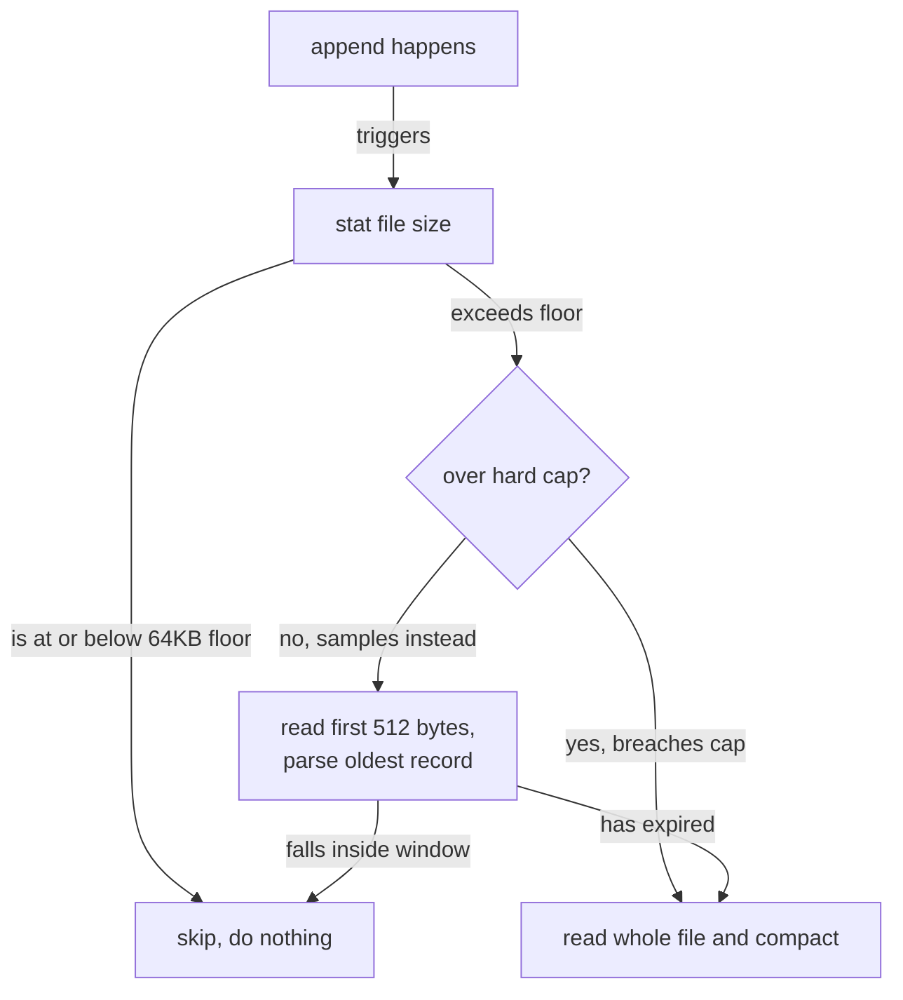
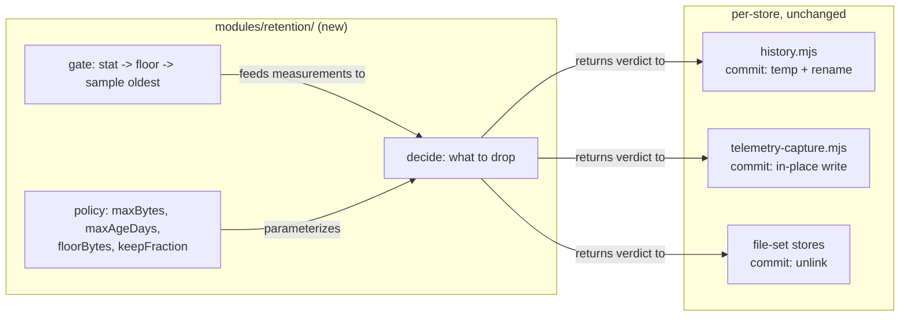

# Bound Every Local Store With One Staleness Policy

## Summary

RoboRepo observes itself as it runs. It records how agent sessions consumed tokens, when local dev
servers changed health, and which shell commands were awkward enough to be worth engineering away.
All of it lands on the local filesystem, in seven stores, and it accumulates for as long as the
install lives.

This plan gives every store a bound, and gives all of them the *same* bound logic. The half that
decides what is stale — the measurement — moves into one policy engine. The half that writes the
result stays with each store, because those writes genuinely differ for correctness reasons
documented below.

It also relocates one store. `capture-dense-bash` writes into `~/.claude/logs/`, a harness-owned
directory, instead of RoboRepo's own state root.

## Context

Retention only makes sense once it is clear what each store holds and how long that stays useful.

### What these stores are for

| Store | Exists to answer |
| --- | --- |
| Telemetry spool | "What did this session cost, and what was the agent doing?" — a drain buffer, written per event and read by the report/analysis path |
| Telemetry markers | "What changed, and when?" — user-authored annotations that give telemetry its before/after |
| Telemetry snapshots | "What was the configuration at that moment?" — content-addressed, referenced by markers |
| Telemetry experiments | "Did that change help?" — live records pairing a start and end marker |
| Localhoster history | "Why did this app go unhealthy on Tuesday?" — transition events only, not a registry |
| Dense bash log | "Which command patterns are worth an allowlist entry or a script?" — a corpus to mine |
| Usage snapshots | "What is my token headroom right now?" — one current reading per harness |

Two properties matter for retention. **These are observability records, not user data** — every one
is classified Machine / Exclude by `infra-portable-user-profile-backup.md`, so losing old entries
costs nothing a user can name. And **their value decays**: a health flap from six months ago and a
command pattern from last quarter answer no question anyone asks today.

Durable records live elsewhere. `repositories/registry.json` and `command-overrides.json` are user
intent, are never expired, and are out of scope here.

### Why now

The trigger was enabling the `capture-dense-bash` package, which surfaced two problems: it writes
to the wrong place, and it never stops growing.

Fixing only that package would have produced a third hand-rolled retention implementation. The two
that exist already disagree with each other in ways that are partly deliberate and partly
accidental — and telling those apart required reading both in full. That is the repetition this
plan removes.

### Where implementation stands

Nothing is built. This plan was moved to `active` on adoption; Phase 1 has not started. The two
existing bounded stores are the behavioral contract the migration must preserve, and their tests
already exist and pass at `ea84711`.

## Goals

- One implementation of staleness measurement, shared by every bounded store.
- Every persisted store has a documented bound — a size cap, an age window, or both.
- `capture-dense-bash` writes inside `stateRoot`, at a path that agrees with `state-paths.mjs`.
- One user-facing surface to inspect and reset local stores.

## Non-goals

- Changing what any store captures, or its record schema.
- Backup, export, or restore. `infra-portable-user-profile-backup.md` (`74h2tlim`) owns that.
- A per-response or chat-time notification about store growth. Explicitly rejected — growth is
  surfaced through `doctor` and the portal, not during a task.
- Scheduled or background compaction. Every bound stays append-triggered or command-triggered.

## Current state

Verified against the working tree at `ea84711`.

### What is persisted, and what bounds it

Verified at commit `ea84711`.

| Store | Path | Shape | Bound today |
| --- | --- | --- | --- |
| Localhoster history | `<stateRoot>/localhoster/history.jsonl` | Append-only JSONL | 14 days, then 2MB |
| Telemetry spool | `<stateRoot>/telemetry/spool/<harness>.jsonl` | Append-only JSONL | 25MB per harness |
| Telemetry markers | `<stateRoot>/telemetry/events/markers.jsonl` | Append-only JSONL | none |
| Telemetry snapshots | `<stateRoot>/telemetry/snapshots/<id>.json` | One file per id, immutable | none |
| Telemetry experiments | `<stateRoot>/telemetry/experiments/<id>.json` | One file per id, mutable | none |
| Usage snapshots | `<stateRoot>/usage/latest/<harness>.json` | One file per harness, overwritten | self-bounding |
| Dense bash log | `~/.claude/logs/dense-bash.jsonl` | Append-only JSONL | none |

Every store but the last sits under `stateRoot` and honors `ROBOREPO_STATE_ROOT`. The dense bash
log does not, which is the placement bug described below.

Usage snapshots need no work: the set of harnesses is small and fixed, and each file is
overwritten rather than appended (`globals/packages/usage-statusline/scripts/usage-snapshot-store.mjs`).
They are listed to show the survey was complete.

### The two existing implementations

Both cap size. They differ in what else they measure, and in how they write — and the write
difference is load-bearing.

| Dimension | `modules/localhoster/history.mjs` | `scripts/cli/telemetry-capture.mjs` |
| --- | --- | --- |
| Age policy | 14 days (`DEFAULT_RETENTION_DAYS`) | none |
| Size cap | 2MB (`HISTORY_MAX_BYTES`) | 25MB (`SPOOL_MAX_BYTES`) |
| On trim, keeps | everything inside the window | newest 70% (`SPOOL_KEEP_FRACTION`) |
| Skips work below | 64KB (`HISTORY_COMPACT_FLOOR_BYTES`) | nothing |
| Cheap pre-check | stat, then parse first line only | stat only |
| Commit | temp file + `rename` | in-place `writeFileSync` |

The commit difference is not an inconsistency to iron out. `history.mjs:85-88` states the rule
directly: the spool's reader (`scripts/cli/jsonl-tail.mjs`) holds a byte offset between calls and
*detects* the shrink to rebuild, while history is read whole and has no way to notice. Giving
history an in-place rewrite would corrupt its reads.

The pre-check ladder is the opposite case — genuinely better logic that only one store has.
`maybeCompact` avoids a full read on almost every append:



The spool has no equivalent, so it stats on every append and rewrites 25MB whenever it trips.

### Where dense-bash writes, and why that is wrong

`globals/packages/capture-dense-bash/hooks/capture-dense-bash.mjs:107` builds its path inline:

```js
const logDir = path.join(os.homedir(), '.claude', 'logs')
fs.mkdirSync(logDir, { recursive: true })
const logPath = path.join(logDir, 'dense-bash.jsonl')
```

Two problems. It puts RoboRepo-generated data inside a harness container the user may disable,
ignore, or have removed. And it hard-codes a location instead of deriving one, so it cannot be
sandboxed by `ROBOREPO_STATE_ROOT` the way every other store can — which also makes it untestable
against a temp directory.

The hook runs as a copied runtime asset in `~/.claude/hooks/`, outside the CLI's module graph, so
it cannot import `scripts/cli/state-paths.mjs`. That constraint is already solved elsewhere; see
Proposed design.

### The dangling database path

At `ea84711`, `scripts/cli/state-paths.mjs` exported `telemetryDbPath` pointing at
`telemetry/telemetry.sqlite`. Nothing created, wrote, or read it — its only consumer was a line in
`telemetry status` printing the path to a file that had never existed, and the repository has no
SQLite dependency at all.

Removed with Phase 1. Recorded here because it is the reason this plan bounds four telemetry
filesystem stores rather than a database: there was never a database to bound.

## Proposed design

One engine measures; each store still writes for itself. The rest of this section works out what
that split covers, what it deliberately leaves alone, and where each store's data lands.

### Split measurement from commit

The engine decides *what must go*. The store decides *how to write the result*. Nothing else moves.



The engine never touches the filesystem to write. It reads to measure, returns a verdict, and the
caller commits.

### Two record shapes, three commit strategies

Snapshots and experiments are a directory of files, not a log. That is a second *measurement*
shape, not just a third write.

| Shape | Members | Staleness measured by | Commit |
| --- | --- | --- | --- |
| Append-only log | history, spool, markers, dense-bash | record timestamp inside each line; total bytes | rewrite (rename or in-place) |
| File set | snapshots, experiments | file mtime; file count; total bytes | `unlink` per file |

The engine exposes one entry point per shape. Both take the same policy object and return the same
verdict shape, so a caller reads the same way regardless.

### Policy per store

Proposed bounds, against what each store actually holds. Measured sizes are evidence for the bound,
not the bound itself. Reproduce with:

```
du -sh "${ROBOREPO_STATE_ROOT:-$HOME/.roborepo}"/telemetry/spool/* \
       "${ROBOREPO_STATE_ROOT:-$HOME/.roborepo}"/localhoster/history.jsonl
```

Figures below are from one development machine at `ea84711`, so treat them as an order of
magnitude, not a population.

| Store | Measured now | maxAgeDays | maxBytes | Basis |
| --- | --- | --- | --- | --- |
| Localhoster history | 456KB / 1,589 events / 14 days | 14 (user-set, 1–365) | 2MB | unchanged; steady state sits well under cap |
| Telemetry spool (claude) | 17.6MB | none | 25MB | unchanged; drain buffer, age is meaningless |
| Telemetry spool (codex) | 21.4MB | none | 25MB | unchanged |
| Telemetry markers | 671B / 3 records | none | 5MB | ~224B/record, user-authored; cap is a runaway guard only |
| Telemetry snapshots | 44KB / 11 files | none | 5MB | ~4KB/file; bound by bytes, not age — see Open questions |
| Telemetry experiments | absent | none | 5MB | same shape as snapshots; no measurement available yet |
| Dense bash | 38KB / 64 records | 30 | 10MB | ~604B/record; see below |

**The spool is the live problem.** Both files are inside their per-file cap, but they hold 40MB
between them and neither has ever been trimmed — `codex.jsonl` was last written 2026-08-11 and has
sat at 21.4MB since. The 25MB cap is real but has simply never fired. This is the store where a
bound already exists and still lets 40MB accumulate, which is worth confirming is intended during
Phase 2 rather than assumed.

Dense-bash gets both an age and a size bound because it is the highest-volume writer here — it
fires on a large share of `Bash` calls, not only on state change. At the measured 604 bytes per
record, 10MB is roughly 17,000 commands. The 30-day window matches its purpose: the corpus is mined
for allowlist patterns, and a command pattern from last quarter no longer reflects how the agent
currently works.

The three 5MB entries are deliberately untuned. Those stores sit three to four orders of magnitude
below the cap, so it exists to catch a runaway rather than to manage growth — and a tuned value
derived from 11 files would be false precision.

### Where dense-bash writes

Following the classification table in `infra-portable-user-profile-backup.md`, captured shell
commands are the same class as its "Session prompts, output, processes, terminals, and worktrees"
row: **Sensitive machine history, Exclude from backup**. They record real paths, hostnames, and
arguments.

That places the log under machine-local state, not the profile boundary:

```
<stateRoot>/capture/<harness>/dense-bash.jsonl
```

Segmenting by harness is kept — the record already carries a harness dimension, and per-harness
files let one harness's corpus be reset independently. The `capture/` parent leaves room for
future observation packages without another ad-hoc placement decision.

New export in `scripts/cli/state-paths.mjs`:

```js
export const captureDir = path.join(roborepoStateDir, "capture");
export function denseBashLogPath(harness) {
  return path.join(captureDir, harness, "dense-bash.jsonl");
}
```

### How the hook agrees with the constant

The hook cannot import the constant. The precedent for this exact problem is
`globals/packages/usage-statusline/scripts/usage-snapshot-store.mjs`, which documents it at the top
of the file: the module runs both inside the CLI and as a copied runtime asset, so it re-resolves
`stateRoot` itself with the same env precedence.

Follow that precedent rather than inventing an install-time env var or a generated JSON file:

```js
function stateRoot() {
  return (
    process.env.ROBOREPO_STATE_ROOT ||
    process.env.ROBOREPO_STATE_DIR ||
    path.join(os.homedir(), ".roborepo")
  );
}
```

Agreement is then enforced by a test rather than by hope — see Validation.

### Happy path: one append, end to end

The normal case for localhoster history, after the change. Every store follows this shape; only the
final commit differs.

1. `appendHistoryEvents` writes the new events and calls the engine.
2. The engine stats the file. At 456KB it is above the 64KB floor, so measurement continues.
3. It is under the 2MB cap, so the engine reads the first 512 bytes and parses the oldest record's
   timestamp.
4. That record is inside the 14-day window. The engine returns `{ act: false }`.
5. The caller does nothing. No read of the remaining 456KB, no write.

Steps 3–5 are the overwhelmingly common outcome. The engine only returns `{ act: true, dropCount }`
when the oldest record has expired or the cap is breached — and only then does the caller run its
own commit: rename for history, in-place write for the spool, `unlink` for a file set.

### One reset surface

A new `maintenance` subcommand, beside the existing `doctor` and `repair` entries in
`manifests/platform/cli/command-definitions/maintenance/`:

```
roborepo maintenance stores                     # list every store, size, age, bound, headroom
roborepo maintenance stores reset <name>        # apply that store's policy now
roborepo maintenance stores reset <name> --all  # remove everything in that store
```

Store names come from one registry the engine reads, so adding a store means one registry entry,
not a new command.

`doctor` gains one check per registered store, reporting stores over their bound.

## Implementation plan

Phases land in order. Phase 2 is the risky one — it changes working code — so it is gated behind an
engine that already has its own tests.

### Phase 1 — the engine

- [x] Create `modules/retention/policy.mjs` — the verdict types and policy validation.
- [x] Create `modules/retention/log-store.mjs` — append-log measurement, including the
      stat → floor → sample-oldest gate lifted from `maybeCompact`.
- [x] Create `modules/retention/file-set-store.mjs` — mtime/count/bytes measurement over a directory.
- [x] Create `modules/retention/registry.mjs` — the list of stores, their paths, shapes, and policies.
- [x] Add `scripts/test/retention-policy-check.mjs` covering both shapes against a temp directory,
      registered as `npm run test:retention`.

### Phase 2 — migrate the bounded stores

Both stores must come out behaviorally identical; their existing tests are the contract.

- [x] Trace whether anything drains the spool after analysis. **Nothing does.** Both readers
      (`readSpoolEvents` at `scripts/cli/telemetry.mjs:925` and `readSpoolEventsCached` at :967) are
      read-only, and the only deletion path in the codebase is `telemetry purge --all`. The spool is
      the durable store, not a buffer — so there is no missing drain to file, and a byte cap is the
      correct and only bound for it. The 40MB observed across two files is expected behavior below a
      per-file cap that has simply never fired.
- [x] Make the registry's localhoster policy read `preferences.historyRetentionDays` instead of the
      hard-coded 14. Added `preferenceKey` plus `resolveStorePolicy(store, preferences)` — the
      registry declares which preference governs a store and the caller supplies the value, so a
      leaf module never imports a feature module. The append path was already correct
      (`scripts/cli/localhoster.mjs:264` passes the preference through); this is for the reporting
      surfaces in Phase 5, which would otherwise show a default that disagrees with the live value.
- [x] Rewrite `compactHistory` in `modules/localhoster/history.mjs` to take its verdict from the
      engine, keeping the temp-file-plus-rename commit exactly as is.
- [x] Rewrite `capSpool` in `scripts/cli/telemetry-capture.mjs` the same way, keeping the in-place
      write. It now gets the gate it lacked, via `measureLog`.
- [x] Confirm `scripts/test/localhoster-history-check.mjs` and
      `scripts/test/telemetry-spool-store-check.mjs` pass unmodified. Both green.

The migration surfaced one behavior difference worth recording: the compaction floor belongs to the
append path, not to `compactHistory` itself. Routing a direct call through a floored policy let a
small file keep expired events, which `localhoster-history-check.mjs:112` caught. `floorBytes` is
now a parameter — `0` for a direct call (an explicit request to compact applies the policy at any
size), `HISTORY_COMPACT_FLOOR_BYTES` for the append path.

### Phase 3 — bound what is unbounded

- [x] Bound `telemetry/events/markers.jsonl` in `scripts/cli/telemetry-schemas/persistence.mjs`.
- [x] Bound the snapshots and experiments directories via the file-set store.
- [x] Add `scripts/test/telemetry-store-bounds-check.mjs`, registered as
      `npm run test:telemetry-store-bounds`.

Two things the implementation forced, both worth keeping:

- **Every cap needs `keepFraction`.** Trimming to exactly the cap re-trips it on the next write, so
  the store rewrites itself on every append forever — quadratic, and bad enough that the first
  version of the test exceeded a 120s timeout. All three caps now overshoot to ~70%, matching
  `SPOOL_KEEP_FRACTION`, which existed for this reason.
- **A running experiment is never evictable.** An experiment with no `end_marker_id` is still live
  and its end marker will reference the file later, so `capFileSet` takes an `isEvictable`
  predicate and experiments pass one that only releases finished records. The test writes the
  running experiment first, making it the oldest by mtime and therefore the first victim if the
  guard regresses.
- [x] Remove `telemetryDbPath` from `scripts/cli/state-paths.mjs` and its line from
      `telemetry status`. Landed early with Phase 1 — it was dead code with three references and no
      test coverage, so it did not need to wait for the stores it sat beside.

### Phase 4 — dense-bash

- [x] Add `captureDir` and `denseBashLogPath` to `scripts/cli/state-paths.mjs`.
- [x] Point the hook at the resolved path, self-resolving `stateRoot` per the usage-statusline
      precedent.
- [x] Apply the 30-day / 10MB bound on append, keeping the hook cheap via the same
      stat → floor → sample-oldest ladder. The hook cannot import `modules/retention` for the same
      reason it cannot import the path constant, so the ladder is reimplemented there; the policy
      numbers mirror the registry entry and the test pins the behavior.
- [x] Update the `description` in `globals/packages/capture-dense-bash/package.config.json`, which
      named the old path. It now names the new one and states the bound.
- [x] Add `scripts/test/capture-dense-bash-check.mjs` asserting the hook's resolved path equals
      `denseBashLogPath`, under a sandboxed `ROBOREPO_STATE_ROOT`. It drives the real hook as a
      subprocess with a PreToolUse payload, and also asserts nothing is written under `~/.claude`.

Existing logs at `~/.claude/logs/dense-bash.jsonl` are left where they are — throwaway observation
data, and the package description records the new location.

### Phase 5 — surfaces and documentation

- [x] Add the `maintenance stores` command definitions and module. `list`, `reset <id>` (applies the
      store's own policy), and `reset <id> --all` (clears outright), covered by
      `scripts/test/maintenance-stores-check.mjs`.
- [x] Add per-store `doctor` checks in `scripts/doctor.sh`. One `check_store_bounds` covering the
      whole registry rather than one check per store, so a new store needs no doctor edit. Runs
      under `--installed` (runtime state, not source layout); `doctor --installed` is now 113 checks.
- [x] Add a portal row showing each store's size against its bound. It became its own **Local
      Stores** section rather than a Monitoring row: Monitoring is a list of package toggles, and a
      store is not something you enable. Read-only by design — resetting is destructive and stays
      behind the CLI.

Documentation lands here, not earlier — every gap below describes behavior the earlier phases
build, and documenting a cap before it exists is worse than the current silence. Targets, from a
survey of `docs/user/` at `81b0c43`:

- [x] `docs/user/reference/telemetry.md` — split the old "Privacy and retention" heading, which was
      entirely privacy, into `## Privacy` and a real `## Retention` with the bounds table and the
      two non-obvious behaviors (trims overshoot to ~70%; a running experiment is never evicted).
- [x] `docs/user/reference/architecture.md` — added `## Runtime State` before Sync Flow. The doc
      covered what installation puts on disk but nothing about what accumulates afterwards.
- [x] `docs/user/reference/roborepo-cli.md` — documented `maintenance stores` and its reset forms.
- [x] `docs/user/reference/localhoster.md` — verified, not rewritten. All three of its bullets
      (retention preference, 2MB cap, atomic compaction) still hold after the migration.
- [x] `globals/packages/capture-dense-bash/package.config.json` — done in Phase 4; the description
      now names the new path and states the bound.

## Validation

Run targeted checks, not a full sweep — `npm run test:*` exceeds the command timeout.

```
node scripts/test/retention-policy-check.mjs        pass (7 stores registered)
node scripts/test/maintenance-stores-check.mjs      pass
node scripts/test/telemetry-store-bounds-check.mjs  pass
node scripts/test/capture-dense-bash-check.mjs      pass
node scripts/test/localhoster-history-check.mjs     pass (unmodified)
node scripts/test/telemetry-spool-store-check.mjs   pass (unmodified)
node scripts/test/package-catalog-check.mjs         pass
node scripts/test/cli-command-catalog-check.mjs     pass
node scripts/test/telemetry-marker-cli-check.mjs    pass
roborepo doctor                                     pass (103 checks)
roborepo doctor --installed                         pass (113 checks)
```

Acceptance criteria:

- Both existing store tests pass with no edits, proving the migration changed no behavior.
- Every store in the registry has a non-null bound, asserted by a test over the registry itself.
- The dense-bash hook's path matches `denseBashLogPath` under a sandboxed state root.
- `roborepo doctor` reports every store's headroom and passes on a clean install.
- No staleness *arithmetic* survives outside `modules/retention/`. Met: no store computes a cutoff
  timestamp or a keep-fraction any more; each passes a policy object and acts on the returned
  verdict.

  The originally planned enforcement — a scan failing on any `MAX_BYTES` / `RETENTION_DAYS` /
  `KEEP_FRACTION` constant outside the engine — was **not built, deliberately**. It would fail
  today on correct code: policy *values* stay with the stores that own them
  (`HISTORY_MAX_BYTES`, `MARKERS_MAX_BYTES`, `SPOOL_MAX_BYTES`), because a bound is a property of
  the store, not of the measuring engine. The scan cannot tell a declared value from a
  hand-rolled calculation, so it would enforce the wrong invariant. The engine's own tests plus
  each store's contract test cover the real one.

  The dense-bash hook is the one genuine exception: it reimplements the ladder because it runs as
  a copied runtime asset outside the CLI's module graph and cannot import the engine, the same
  constraint that forces it to re-resolve `stateRoot`. `capture-dense-bash-check.mjs` pins its
  behavior.

## Verification

All five phases are implemented and committed. Every store in the registry has a bound, and the two
that were already bounded came through the migration with their contract tests unmodified — which
was the whole point of keeping those tests as the contract.

```
node scripts/test/retention-policy-check.mjs        pass (7 stores registered)
node scripts/test/maintenance-stores-check.mjs      pass
node scripts/test/telemetry-store-bounds-check.mjs  pass
node scripts/test/capture-dense-bash-check.mjs      pass
node scripts/test/localhoster-history-check.mjs     pass (unmodified)
node scripts/test/telemetry-spool-store-check.mjs   pass (unmodified)
node scripts/test/package-catalog-check.mjs         pass
node scripts/test/cli-command-catalog-check.mjs     pass
node scripts/test/telemetry-marker-cli-check.mjs    pass
roborepo doctor                                     pass (103 checks)
roborepo doctor --installed                         pass (113 checks)
```

Confirmed against a real install after the work landed:

```
localhoster-history           451KB (22% of cap)
telemetry-spool-claude       18.8MB (75% of cap)
telemetry-spool-codex        21.4MB (86% of cap)
telemetry-markers              671B  (0% of cap)
telemetry-snapshots             13KB (0% of cap)
telemetry-experiments             0B (0% of cap)
capture-dense-bash-claude         0B (0% of cap)
```

### What was not built

- The constant-scanning test named in Validation. It would fail on correct code; the reasoning is
  recorded there.
- Migration of existing `~/.claude/logs/dense-bash.jsonl` content to the new location. Throwaway
  observation data, and the package description names the new path.
- Configurable caps for anything but localhoster's window. Left as the one open question.

## Risks

| Risk | Mitigation |
| --- | --- |
| The migration silently changes trim behavior | Both existing tests must pass unmodified; they are the contract, not a formality |
| Copying the in-place write to a whole-file reader | The engine never writes; commit stays per-store, and `history.mjs:85-88` documents why |
| The hook's self-resolved path drifts from the constant | A test asserts equality under a sandboxed state root |
| A future store is added without a bound | The registry test fails on any store with a null policy |
| Existing dense-bash logs are stranded at the old path | Phase 4 leaves them; they are throwaway observation data. Note it in the package description |

## Open questions

All three questions this plan opened are resolved; the answers are recorded with the tasks that
settled them.

- **Is the spool's 40MB intended?** Yes. Nothing drains it, so it is the durable store rather than a
  buffer, and 25MB per harness is the right kind of bound. Resolved in Phase 2.
- **Should experiments be bounded by age rather than bytes?** Neither, on its own. Bytes bound the
  set, and a separate liveness guard makes a running experiment ineligible for eviction regardless
  of size — the concern behind the question was liveness, not the choice of dimension. Resolved in
  Phase 3.
- **Should `maintenance stores reset` require `--apply`?** No. A bare `reset` applies the store's
  own policy, which is what the write path would have done anyway, so it is not destructive in the
  sense `repair skill-links` guards against. `--all` is the destructive form and says so.

One question remains open, and it is new:

- **Should the caps be configurable?** Only localhoster's window is, because it already was. Every
  other bound is a literal in `modules/retention/registry.mjs`. The registry supports per-store
  preference resolution (`preferenceKey` + `resolveStorePolicy`), so exposing more is cheap — but no
  user has asked, and an unused setting is a maintenance cost. Revisit if someone hits a cap.
