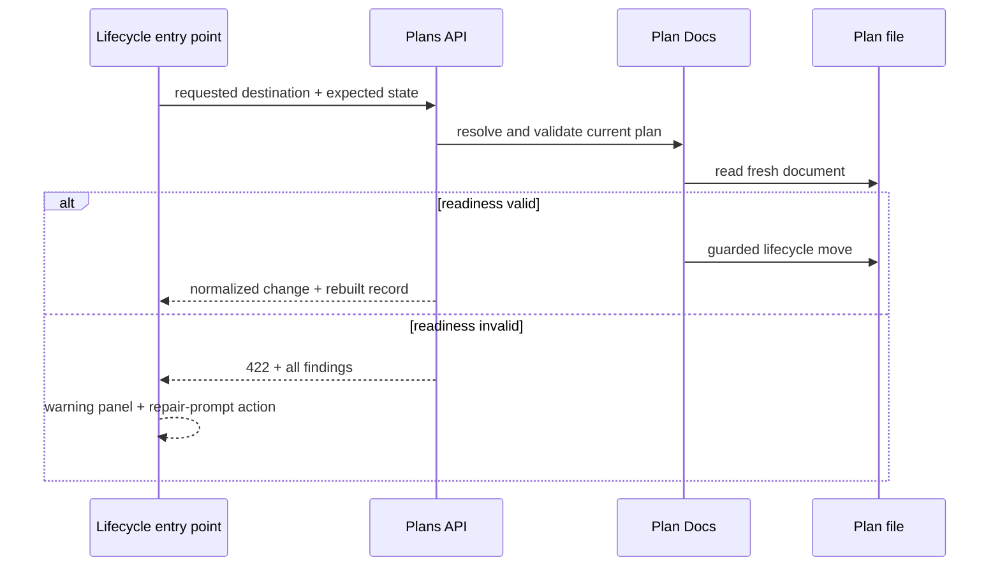

# Plan Lifecycle Readiness Validation and Repair Prompts

## Summary

Add lifecycle-aware document validation after lifecycle controls and file movement are established. Before a plan moves into a destination with readiness requirements, validate the document, present every actionable problem together, and offer a generated prompt that helps an agent repair the document without moving it prematurely.

This plan owns semantic document readiness. The lifecycle-controls plan continues to own mutation values, stable identity, stale-state detection, repository boundaries, destination collisions, atomic file movement, and post-change UI.

## Goals

- Define lifecycle requirements in one plan-docs domain module.
- Prevent moves to Active or Completed when the document does not satisfy the destination contract.
- Surface all relevant problems in one response instead of failing one field at a time.
- Explain each problem in plain language and describe how to fix it.
- Generate a repository-aware repair prompt from normalized validation findings.
- Revalidate against fresh disk state before any eventual move.
- Reuse the same validation and repair behavior from list cards, the detail drawer, and lifecycle shortcut actions.

## Non-goals

- Change lifecycle folder names or add lifecycle frontmatter.
- Replace structural and stale-state safeguards in the lifecycle mutation.
- Automatically edit a plan.
- Move a plan as part of prompt generation.
- Start Codex, Claude, or another harness directly.
- Treat Archived as equivalent to Completed.
- Make Unclassified a normal lifecycle destination.

## Context

The lifecycle-controls milestone intentionally allows folder movement without adding new semantic readiness gates. Existing plan scanning may still report warnings, but those warnings are not yet a guided preflight workflow.

Current reusable code already exists in `modules/plan-docs/index.mjs`:

- `readPlanDocument()` reads the selected Markdown document;
- scanner-derived plan records contain structural warnings and task counts;
- `buildPrompt()` produces repository-aware Plan Docs prompts.

This milestone should extend those domain outputs rather than parse Markdown again in
the portal or create a second prompt format.

The `plan-docs` contract distinguishes lifecycle from derived document conditions:

| Destination | Relevant contract |
|---|---|
| Backlog | May be proposed, draft, blocked, or ready |
| Active | Must have remaining actionable work, a next action, implementation context, success criteria, and blockers when present |
| Completed | Must have no unresolved required work, decisions, blockers, or next action; verification evidence or a limitation must be recorded |
| Archived | Explicit termination or historical retention; does not imply completion |

## Proposed Design

### Central validation result

Add a pure destination validator in `modules/plan-docs/index.mjs` that returns normalized findings:

```js
{
  valid: false,
  sourceLifecycle: "active",
  destinationLifecycle: "completed",
  findings: [
    {
      code: "UNCHECKED_REQUIRED_TASKS",
      count: 3,
      message: "3 required tasks remain unchecked.",
      resolution: "Complete or remove the remaining required tasks."
    },
    {
      code: "NEXT_ACTION_REMAINS",
      message: "Completed plans cannot retain a next action.",
      resolution: "Finish the action or clear next_action."
    }
  ]
}
```

The validator returns data, not UI copy assembled by the route. CLI, portal, tests, and prompt generation consume the same result.

### Destination policy

Use a declarative destination-policy map so later lifecycle states can add requirements without expanding mutation orchestration:

```js
const lifecyclePolicies = {
  backlog: validateBacklog,
  active: validateActive,
  completed: validateCompleted,
  archived: validateArchived
};
```

Only Active and Completed receive semantic destination gates in this milestone.
Backlog and Archived remain ungated beyond the identity, path, collision, and
filesystem safeguards owned by the lifecycle-controls plan. Existing scanner warnings
may still be displayed, but they do not block those two destinations.

### Mutation preflight

The lifecycle mutation flow becomes:



Run readiness validation after identity, stale-state, path, and collision checks but immediately before the move. This ordering avoids offering repair guidance for a stale or incorrectly targeted plan.

### Error contract

Add:

| HTTP | Code | Meaning |
|---|---|---|
| `422` | `LIFECYCLE_REQUIREMENTS` | The current document does not satisfy the requested destination |

Return the normalized findings and current record identity. Do not update the client snapshot or dropdown value.

### Warning presentation

Cards and the detail drawer use the shared status component, so both entry points should show the same failure state:

- reset the lifecycle dropdown to its confirmed value;
- show a concise local summary near the control;
- show a dialog or expanded warning surface containing every finding;
- provide **View Plan**;
- provide **Generate prompt to resolve warnings**.

Do not use a short-lived toast for readiness failures. The user needs time to inspect and act on the findings.

Run this workflow only after the user submits a move. Do not disable lifecycle options
from the browser's existing warning snapshot: that snapshot may be stale, and disabled
controls would prevent the server from returning the authoritative, complete finding
set.

### Repair prompt

Generate the prompt from trusted server-normalized findings. Include:

- repository identity;
- stable plan ID and repository-relative path;
- current and requested lifecycle;
- every finding and resolution;
- an instruction to inspect and update the plan using `/plan-docs`;
- an instruction not to move the file;
- an instruction to preserve the stable plan ID;
- an instruction to validate the edited document.

Prompt generation must not accept arbitrary client-authored findings. Return a
server-generated prompt descriptor with the `422` response, produced from the same
fresh validation result. This avoids a second endpoint and prevents a later prompt
request from referring to findings different from those currently displayed.

After copying the prompt, keep the warning surface available. When the document is edited externally, the next move attempt uses normal stale-state refresh and then runs validation again.

## Implementation Plan

### Domain

- Extend `modules/plan-docs/index.mjs` with destination-policy configuration and pure validators.
- Reuse existing plan parsing and derived warning data where it exactly matches lifecycle requirements.
- Extend `buildPrompt()` or add a neighboring Plan Docs prompt builder that accepts
  normalized server findings; do not assemble repair prompts in `portal/plans/app.js`.
- Give every finding a stable code, message, resolution, and optional structured metadata.
- Keep lifecycle policy separate from filesystem movement.

### Server

- Integrate readiness validation into `scripts/cli/plans.mjs` immediately before `rename`.
- Serialize `LIFECYCLE_REQUIREMENTS` through `scripts/cli/portal-routes-plans.mjs`.
- Return all findings in one response.
- Return the safe repair-prompt descriptor generated from those same findings.

### Portal

- Preserve structured `422` details in `portal/shared/api.js`.
- Add a template-backed readiness-warning controller in `portal/plans/app.js`.
- Reuse it for lifecycle dropdowns and shortcut actions.
- Add warning and prompt-copy templates in `portal/plans/index.html`.
- Add accessible focus management and responsive styling in `portal/plans/styles.css`.

## Validation

### Domain tests

- Backlog accepts draft, ready, and blocked plans.
- Active reports every missing required section or field together.
- Completed reports unchecked required tasks, blockers, unresolved required decisions, remaining `next_action`, and missing verification evidence.
- Archived does not require completion.
- Stable finding codes and structured metadata are deterministic.
- Validation does not mutate the document.

### Mutation tests

- Readiness validation runs against fresh disk content.
- Invalid readiness returns `422` without moving the file or changing cache state.
- A repaired document can move after a new guarded request.
- A stale request returns `409` before readiness guidance.
- A destination collision returns `409` before readiness guidance.
- Valid moves still return the normalized change and rebuilt record.

### Portal checks

- Cards, drawer controls, and lifecycle shortcut actions show identical findings.
- The lifecycle control resets after a blocked move.
- All findings and resolutions remain readable until dismissed.
- **Generate prompt to resolve warnings** copies a prompt matching the current findings.
- Prompt generation never moves or edits the plan.
- Lifecycle options remain selectable until the authoritative server validation rejects a submitted move.
- Retrying after an external edit refreshes and revalidates the plan.

Run:

```sh
npm run test:plans
git diff --check
```

## Risks and Mitigations

| Risk | Mitigation |
|---|---|
| Validation rules diverge between UI, CLI, and skill | Keep policies and findings in the plan-docs domain module |
| A repair prompt describes stale findings | Regenerate validation from disk and retain normal stale-state guards |
| Validation blocks legitimate archival | Keep Archived distinct from Completed and intentionally permissive |
| Warning UI overwhelms the status control | Put the full finding list in a persistent dialog or expanded panel |
| New lifecycle states require scattered conditionals | Use a declarative destination-policy map |

## Acceptance Criteria

- Lifecycle readiness is evaluated centrally from the current document.
- Invalid Active and Completed moves return every actionable finding without moving the file.
- The same structured findings drive API errors, portal presentation, tests, and repair prompts.
- Users can copy a repository-aware repair prompt that explicitly leaves lifecycle unchanged.
- Retrying a move always refreshes stale state and revalidates current disk content.
- The lifecycle-controls milestone remains independently implementable without this plan.
- Readiness findings appear after a submitted move is blocked; stale browser warnings do not disable lifecycle controls.
- Backlog and Archived remain semantically ungated in this milestone.

## Implementation Status

Implemented on `feat/lifecycle-readiness-findings` (2026-07-27). Verified with `npm test`
(343 passed, 0 failed), `scripts/doctor.sh --quiet` (99 checks), and `git diff --check`.

Much of the original scope was already shipped by the lifecycle-controls milestone:
`movePlanLifecycle` already validated fresh disk content immediately before `rename`, ordered
after identity, stale-state, boundary, and collision checks, and already threw
`LIFECYCLE_REQUIREMENTS` (422). The work below covers what was actually missing.

### Shipped

- [x] Structured findings replacing flat warning strings — `modules/plan-docs/findings.mjs`
      holds the catalog; each finding carries a stable code, message, resolution, kind,
      severity, and optional count/metadata.
- [x] `plan.validation` carries both `findings` and a derived `warnings`, so the five existing
      string consumers were untouched while the dialog and prompt read structure.
- [x] Declarative destination-policy map — `modules/plan-docs/lifecycle-policy.mjs`, one
      validator per lifecycle, pure and filesystem-free.
- [x] Heading synonyms extracted to `modules/plan-docs/section-synonyms.mjs` as a data-only
      module, then expanded to cover the vocabulary the corpus actually uses. Measured over 62
      documents: `MISSING_DESIGN` 45 to 25, `MISSING_SUMMARY` 40 to 15, `MISSING_CONTEXT` 40 to
      30, `MISSING_CRITERIA` 22 to 21 — 57 false warnings removed.
- [x] Repair-prompt builder — `modules/plan-docs/repair-prompt.mjs`, pure, generated server-side
      from the same fresh validation and returned with the 422 rather than via a second endpoint.
- [x] `findings` and `repair` serialized through both whitelisting boundaries
      (`sendDomainError`, `portalPostJson`).
- [x] Dialog renders each finding as problem plus resolution, grouped blocking-first to match the
      prompt's ordering, with **Copy prompt to resolve warnings** and **View Plan**.
- [x] Decision logic extracted to `portal/plans/state.js` (`lifecycleFindingGroups`,
      `canRepairLifecycleError`) so it is testable without a DOM.
- [x] Domain tests in `scripts/test/plan-docs-findings-check.mjs`; mutation and wire-contract
      tests in `plan-docs-check.mjs`; portal-state tests extended.
- [x] All four plans checks registered in `scripts/test/test-roborepo.sh` — they had npm scripts
      but were unreachable from `npm test`, so plans regressions could pass CI unnoticed.
- [x] `plan-schema.md` and `docs/reference/services/plans-portal.md` updated.

### Deviations from the plan as written

- **The gate stays soft.** `skipDestinationValidation` and "Move anyway" were retained rather
  than removed. Measured against this repo's own 62 documents, a hard gate would reject 24 plans
  on `NEXT_ACTION_REMAINS` alone and make Completed effectively unreachable. The repair prompt is
  offered alongside the bypass rather than replacing it.
- **Severity does not gate anything.** Each finding carries `blocking` or `advisory`, but with
  the soft gate these only drive display and prompt ordering.

### Not done

- [ ] Backlog and Archived are not semantically ungated. Universal section rules
      (Summary/Goals/Context/Design/Criteria) still apply to every destination, so moving a
      thin document into Backlog or Archived can still raise a 422 dialog. This is pre-existing
      behavior, deliberately preserved by the byte-identical refactor rather than changed
      silently. Resolving it means deciding whether those rules should produce findings that
      never gate those two destinations — the `lifecyclePolicies` map is the place to express
      that, and `plan.readiness` (which drives a portal filter) would need checking, since it is
      derived from the same validation.

## Manual Browser Verification

The dialog is the one part of this milestone with no automated coverage — the repo has no DOM
test capability, so template cloning, `data-slot` lookups, `hidden` toggling, the copy button's
`copySource` wiring, and the CSS all rest on a manual pass. The pure decision helpers
(`lifecycleFindingGroups`, `canRepairLifecycleError`) and the 422 wire contract are tested; the
wiring between them is not.

**This document is the fixture.** As it stands it produces both finding groups when moved to
Completed, which exercises every branch below. Do not tidy it before testing.

| Group | Finding | Why it fires |
|---|---|---|
| Must fix | `UNCHECKED_REQUIRED_TASKS` | one unchecked box under "Not done" |
| Must fix | `NEXT_ACTION_REMAINS` | `next_action` is set in frontmatter |
| Also worth fixing | `MISSING_VERIFICATION` | no `## Verification` section |

Steps:

1. `roborepo web`, then open `/plans` and find this plan on the Backlog tab.
2. Set its lifecycle dropdown to **Completed**. The move must be rejected.

Confirm, in the dialog:

- Both group labels appear — "Must fix before moving" above two findings, "Also worth fixing"
      above one. This pairing is the branch that only renders when both groups are non-empty.
- Each finding shows its problem with the fix beneath it, dimmed and indented.
- **Copy prompt to resolve warnings** copies a prompt naming this repository, the plan id,
      the path, both lifecycles, and all three findings with their resolutions. Paste it
      somewhere to check. The button swaps to "Copied!" without resizing.
- **View Plan** closes the dialog and opens the drawer for this plan — never two stacked
      dialogs.
- **Move anyway** still completes the move. Undo it afterward, or use a scratch plan.
- Dismissing with Cancel, Escape, or a backdrop click leaves the lifecycle dropdown showing
      Backlog and not stuck on a spinner.

Then confirm the same dialog appears from the drawer's own lifecycle dropdown, and from the
**Archive** shortcut on an active plan's card — all three entry points funnel through
`handlePlanChange`, so they should be identical.

Also worth one look: a plan whose move fails for a non-readiness reason (edit a plan's file on
disk to force `STALE_PLAN`) must show no Copy-prompt button, since no repair descriptor
accompanies those errors.
