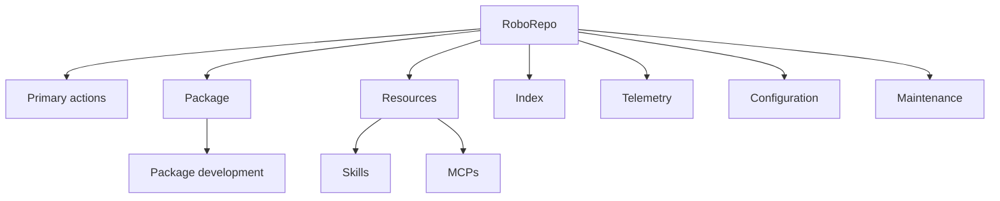
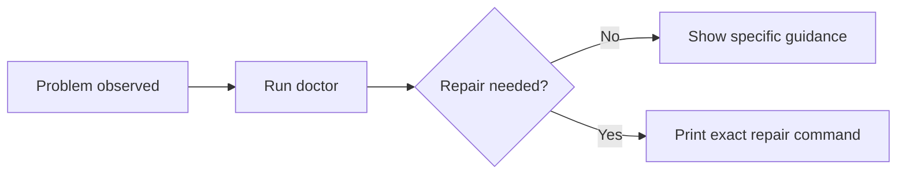
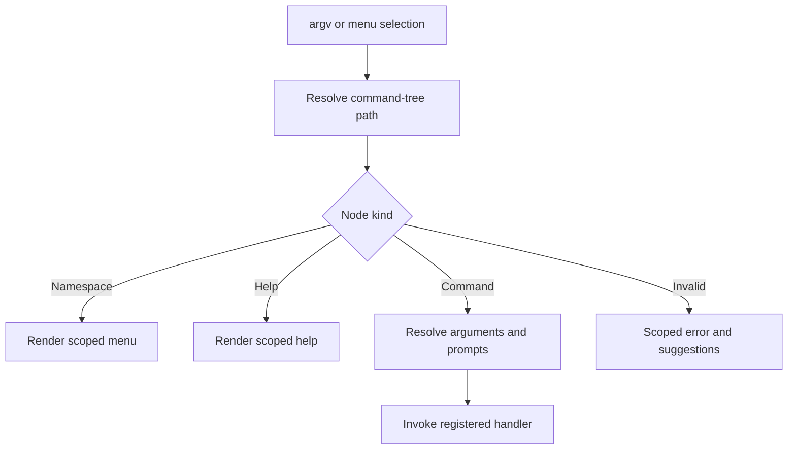
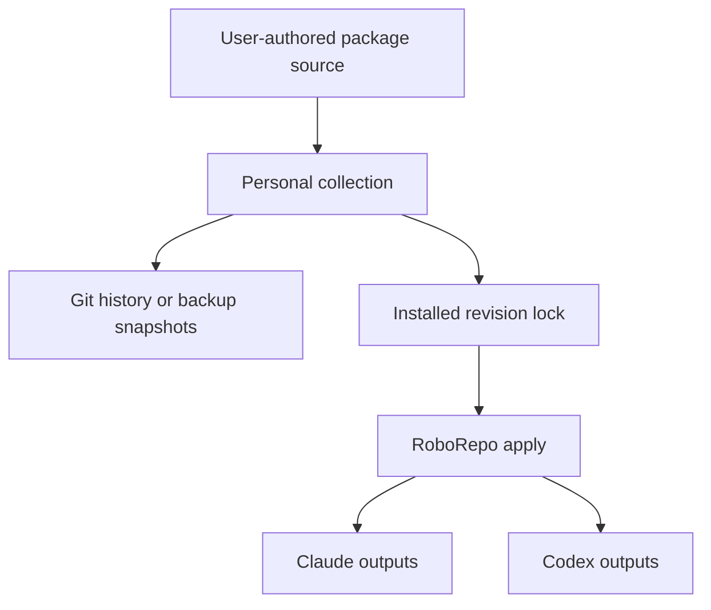

# RoboRepo CLI Surface Redesign — Comprehensive Implementation Plan

## Status

Proposed implementation plan. This document defines the target CLI architecture and migration work; it does not implement the changes.

## Purpose

Make RoboRepo's CLI easier to discover and navigate as its feature set grows.

The current CLI exposes approximately 35 interactive choices and a much larger flat help listing. Everyday workflows, package lifecycle commands, resource-development tools, diagnostics, internal operations, and compatibility aliases appear together. Users must understand RoboRepo's internal structure before they can choose the correct command.

This redesign will:

- Replace the flat interactive menu with recursive namespace menus.
- Replace full root help with concise, scoped help.
- Generate menus, help, routing metadata, and documentation references from one hierarchical command catalog.
- Clarify the difference between packages and package resources such as skills and MCPs.
- Preserve direct, noninteractive commands for agents and scripts.
- Remove obsolete commands immediately rather than carrying compatibility aliases.
- Consolidate overlapping diagnostics under `doctor`.
- Rename and reorganize commands so their intent is understandable.

User-content persistence and versioning are evaluated at the end of this document but are explicitly outside this implementation.

## Confirmed Product Decisions

1. The root interactive menu contains primary actions and namespaces, not every command.
2. `Open web portal` is the user-facing label.
3. `roborepo web` is the canonical portal command.
4. `roborepo web` runs in the foreground, shows logs, and opens the browser.
5. `roborepo web --detach` runs in the background.
6. `roborepo web --no-open` starts the server without opening the Mac browser.
7. The root-menu action `Open web portal` uses detached mode so the menu is not blocked.
8. `onboard` is removed. It is not retained as an alias.
9. The onboarding workflow becomes package/feature management.
10. `doctor` and `update` remain prominent root actions.
11. `repair` remains available under maintenance but is not a root action. `doctor` should recommend a specific repair command when appropriate.
12. User-facing `verify` is removed. Its unique checks move into `doctor`; any narrow post-install verifier that remains is internal.
13. Code watching becomes `roborepo index code --watch`.
14. `workspace` is not promoted as a user-facing concept in this redesign. Existing source-root flexibility may remain internally.
15. Calling any namespace or nested namespace with no remaining arguments opens its interactive submenu.
16. Every namespace supports equivalent scoped help forms:

    ```sh
    roborepo help package dev
    roborepo package dev help
    roborepo package dev --help
    ```

17. Old commands are removed immediately. There is no backward-compatibility layer.
18. All internal and user-facing documentation must migrate to the new command names through three explicit review passes.

## Current-State Findings

### Command catalog

`manifests/platform/cli-commands.json` currently has separate structures:

- `usage`: a flat list of usage strings.
- `menu`: a separate flat list of interactive choices.
- `repoScripts`: mappings from selected commands to shell or Node scripts.

Because help and the menu are authored separately, a command can be changed in one representation without changing the other. Neither structure represents recursive namespaces.

### Dispatcher

`scripts/cli/main.mjs` currently:

- Reads the catalog.
- Prints the entire `usage` array for root help.
- Renders one flat interactive menu.
- Special-cases interactive selections that lack required arguments by printing usage and returning.
- Dispatches commands through one large `switch` statement.
- Contains aliases and internal verbs alongside public commands.

The current menu is therefore only a launcher. It is not a complete interactive version of the CLI: selecting commands such as `skill inspect`, `skill adopt`, or `mcp add` prints a usage line instead of collecting the missing input.

### Package model

`scripts/cli/packages.mjs` already establishes the useful core model:

- A package has a manifest and owns one or more resources/components.
- A package can contain skills, slash commands, MCP setup, rules, permissions, hooks, plugins, services, runtime assets, and harness configuration.
- A package is the unit that RoboRepo can enable, disable, validate, compose through dependencies, reconcile, and inspect.
- `package create` writes built-in packages into `globals/packages/` in a development checkout and user packages into the portable package directory in package mode.

The CLI should describe and expose this model consistently.

### Skill surface

The current `skill` namespace combines several distinct intents:

- Authoring: `new`, `adopt`.
- Project integration: `export-to-project`, `link-project`.
- Global synchronization: `sync-global`.
- Inspection: `inspect`, `native`.
- Quality checks: `audit`, `triggers`, `render-commands`.

This is why simply placing all skill commands under either `skill` or `package dev` does not fully solve the usability problem.

### Diagnostics

The current user must choose between `doctor` and `verify` even though verification delegates substantial work to doctor and duplicates some checks. `repair` is also presented as a general action even though the safer workflow is diagnose first, then run the repair that doctor recommends.

### Portal commands

The current implementation makes `web` an implicit alias for `serve --detach`. This reverses the intuitive relationship between the user-facing portal command and the process-management option.

### Documentation drift

The README and reference documentation currently contain examples for `onboard`, `serve`, top-level `enable`/`disable`, `watch code`, `skill adopt`, and other commands affected by this redesign. Documentation migration must be treated as implementation work, not cleanup after implementation.

## Conceptual Model

### Package versus resource

A **package** is an owned deployment and lifecycle unit. A **resource** is a typed element that may exist inside a package or independently in a harness or project.

Examples of resources include:

- Skill
- MCP server configuration
- Hook
- Slash command
- Rule
- Permission policy
- Plugin configuration
- Service
- Runtime asset
- Harness configuration fragment

RoboRepo may discover, inspect, validate, or temporarily link an external resource without owning it. If the user wants RoboRepo to enable, disable, deploy, reconcile, remove, or distribute that resource, it must belong to a package whose manifest is its authoritative source.

“Lifecycle” means these concrete operations:

- Install into supported harnesses.
- Enable or disable as one unit.
- Apply source changes to installed outputs.
- Validate the source and generated outputs.
- Track ownership of installed files.
- Reconcile desired and observed state.
- Remove generated files cleanly.
- Compose related resources and dependencies.

Packaging does not need to imply complexity. A package containing one skill is valid when the user wants those lifecycle capabilities.

### Scope and ownership

Resource commands must distinguish where a resource comes from:

| Scope          | Meaning                                              | Ownership                                   |
| -------------- | ---------------------------------------------------- | ------------------------------------------- |
| Package        | Resource declared by a RoboRepo or user package      | Package manifest is authoritative           |
| User global    | Standalone resource available across projects        | External/user-owned source is authoritative |
| Project local  | Resource stored in the current repository            | Project is authoritative                    |
| Native harness | Resource discovered directly through Claude or Codex | Harness/external tool is authoritative      |

These are filters over resource inventory, not separate package managers.

## Target Information Architecture



`Resources` is the interactive grouping label. Direct commands can retain concise type namespaces such as `roborepo skill` and `roborepo mcp`; the command catalog can place both beneath the same presentation group without adding a required `resource` token.

This avoids two failures:

- Treating skills as a competing package manager.
- Hiding all type-specific inspection and integration tools inside package development.

## Target Root Interactive Menu

```text
RoboRepo

  Open web portal
  Manage packages and features
  Update
  Doctor

  Packages
  Resources
  Indexing
  Telemetry
  Configuration
  Maintenance

  Help
  Exit
```

Notes:

- `Open web portal` invokes `roborepo web --detach`.
- `Manage packages and features` opens the same management workflow as `roborepo package manage`.
- `Update` invokes `roborepo update`.
- `Doctor` invokes `roborepo doctor`.
- Selecting a namespace opens a submenu rather than running a command.
- `Help` renders the concise root help inside the menu and returns the user to the root menu.

## Target Command Tree

The exact low-level mapping should be validated during the inventory phase, but the public target is:

### Root actions

```sh
roborepo
roborepo web [--detach] [--no-open] [--port <n>]
roborepo update [--dry-run] [--verbose] [--on-conflict overwrite|keep|abort]
roborepo doctor [--installed] [--verbose]
roborepo help
roborepo version
```

### Packages

```sh
roborepo package
roborepo package list
roborepo package manage
roborepo package inspect <package-id>
roborepo package enable <package-id> [--dry-run]
roborepo package disable <package-id> [--dry-run] [--cascade]
roborepo package validate [package-id]
roborepo package dev
roborepo package dev create <package-id> [options]
roborepo package dev add <resource-type> --package <package-id> [options]
roborepo package dev import <resource-type> <path> --package <package-id> [options]
roborepo package dev validate [package-id]
```

`package manage` replaces `onboard` as the terminal wizard for enabling and disabling available packages. The web portal remains the preferred rich human interface. The CLI remains important for initial setup, recovery, headless use, agents, scripts, and keyboard-only workflows.

The interactive wizard and web portal must call the same domain operations used by `package enable` and `package disable`. The UI layer must not own package mutation logic.

`package dev add` creates a new resource within an existing package. `package dev import` adopts an existing standalone resource into a package. Import must explicitly resolve what happens to the original source: copy, move, or replace with a development link. It must not silently create two authoritative copies.

### Skills

```sh
roborepo skill
roborepo skill list [--scope package|global|project|native] [--package <id>]
roborepo skill inspect <skill-id> [--scope package|global|project|native] [--package <id>]
roborepo skill native [--full]
roborepo skill link-project [--dry-run] [--uninstall]
roborepo skill export-to-project [--yes] [--on-conflict skip|override]
roborepo skill sync-global
roborepo skill audit [--check]
roborepo skill triggers [--check]
roborepo skill render-commands [--check]
```

The namespace is retained because several operations are genuinely skill-specific and operate across package, global, project, and native scopes.

Changes from the current surface:

- `skill new` moves to `package dev add skill` because new RoboRepo-managed resources need explicit ownership.
- `skill adopt` moves to `package dev import skill` because adoption is a package-authoring operation.
- `skill inspect` gains explicit scope resolution and interactive prompting when ambiguity exists.
- `skill list --package <id>` lists skills within a package.
- `skill inspect <skill-id> --package <id>` inspects one skill in that package, including source, entrypoints, trigger metadata, install state, and validation findings.
- Existing project/global/native integration and quality operations remain in the skill namespace until a later review identifies a clearer generic resource abstraction.

Interactive skill navigation should lead with scope:

```text
Skills

  Package skills
  User-global skills
  Project-local skills
  Native harness entrypoints

  Link project skills
  Export skills to project
  Synchronize global skills
  Run skill checks

  Help
  Back
  Exit
```

### MCPs

```sh
roborepo mcp
roborepo mcp list [--scope package|global|project|native]
roborepo mcp inspect <mcp-id> [--scope package|global|project|native]
roborepo mcp add <name-or-url> [existing options]
roborepo mcp apply [--dry-run]
```

The implementation inventory must distinguish `mcp add`, which registers an external MCP configuration, from `package dev add mcp`, which authors an MCP resource inside a package.

### Indexing

```sh
roborepo index
roborepo index code [path] [--watch]
roborepo index docs [path]
```

`--watch` is a mode of code indexing, not a separate index type.

### Telemetry

```sh
roborepo telemetry
roborepo telemetry install
roborepo telemetry status
roborepo telemetry enable
roborepo telemetry disable
roborepo telemetry report
roborepo telemetry export
roborepo telemetry backup
roborepo telemetry purge --all [--backup]
```

Internal hot-path commands such as telemetry capture must remain dispatchable but hidden from menus and normal help.

### Configuration

```sh
roborepo config
roborepo config status
roborepo config apply [--dry-run]
roborepo config rules [--check]
roborepo config rules check-home
roborepo config permissions [--check]
roborepo config root inspect
```

`Apply configuration` must be described concretely: re-render and apply enabled packages and configuration to supported harnesses without downloading a newer RoboRepo source.

Do not expose `workspace use`, `workspace import`, or a renamed source-selection workflow as part of this redesign. Preserve only the internal source/root behavior required by existing install and development modes.

### Maintenance

```sh
roborepo maintenance
roborepo maintenance repair [existing options]
roborepo maintenance repair local-config [--dry-run|--apply]
roborepo maintenance uninstall [--dry-run]
roborepo maintenance version
```

`doctor` and `update` stay top-level. They may also appear as entries in the Maintenance interactive menu without creating duplicate command paths.

`repair` is an advanced command. Normal recovery flow is:



### Advanced command runner

`roborepo run <cmd> [args...]` should remain callable if it is still needed, but it should be hidden from the root interactive menu and placed in advanced help. It cannot be made interactive without defining what command discovery and argument collection mean.

## Help and Interactive Navigation Contract

### Invocation behavior

| Invocation                    | Behavior                                               |
| ----------------------------- | ------------------------------------------------------ |
| `roborepo`                    | Open root interactive menu                             |
| `roborepo package`            | Open Package submenu                                   |
| `roborepo package dev`        | Open Package Development submenu                       |
| `roborepo help`               | Print concise root help                                |
| `roborepo --help`             | Print concise root help                                |
| `roborepo help package dev`   | Print Package Development help                         |
| `roborepo package dev help`   | Print identical scoped help                            |
| `roborepo package dev --help` | Print identical scoped help                            |
| Invalid command               | Print concise error, suggestions, and scoped help hint |

The parser must normalize all help forms to a single namespace path before rendering.

### Interactive behavior

Every namespace menu contains:

- Its commands.
- Its child namespaces.
- Contextual Help.
- Back, except at root.
- Exit.

Commands with required inputs must prompt for those inputs. They must not print a usage line and terminate the menu. After a command finishes, the user should return to the current submenu unless the command explicitly exits or hands control to a foreground process.

### Root help example

```text
roborepo — manage Claude and Codex harness configuration

Usage:
  roborepo                       Open the interactive menu
  roborepo <namespace>           Open that namespace's menu
  roborepo <command> [options]   Run a command directly

Primary commands:
  web       Open the web portal
  update    Update and re-apply RoboRepo
  doctor    Diagnose installation and configuration problems

Namespaces:
  package      Manage and develop packages
  skill        Inspect and integrate skills
  mcp          Manage MCP registrations
  index        Index code and documentation
  telemetry    Manage local telemetry
  config       Inspect and apply configuration
  maintenance  Repair or uninstall RoboRepo

Run `roborepo help <namespace>` for scoped help.
```

Root help must not recursively print every command.

## Declarative Command Catalog

Replace the independent `usage` and `menu` arrays with one recursive command tree. A representative shape:

```json
{
  "schemaVersion": 2,
  "nodes": {
    "package": {
      "kind": "namespace",
      "title": "Packages",
      "description": "Manage and develop RoboRepo packages",
      "order": 100,
      "children": {
        "inspect": {
          "kind": "command",
          "description": "Inspect a package and its resources",
          "handler": "package.inspect",
          "arguments": [
            {
              "name": "package-id",
              "required": true,
              "interactive": {
                "prompt": "Choose a package",
                "provider": "package.list"
              }
            }
          ]
        }
      }
    }
  }
}
```

Each node must declare:

- `kind`: namespace, command, alias, or internal.
- User-facing title and description.
- Ordering and interactive visibility.
- Child nodes for namespaces.
- Handler identifier for executable commands.
- Positional arguments and flags.
- Interactive prompt/provider metadata.
- Requirements such as a development checkout.
- Documentation visibility.
- Optional examples and recovery hints.

The catalog must generate:

- Root and nested interactive menus.
- Root and scoped help.
- Usage lines.
- Command-path validation.
- Unknown-command suggestions.
- Documentation tables or reference data.
- Tests that enumerate all public commands.

Do not place executable functions in JSON. Map stable handler identifiers to imported functions in code.

## Router and Module Architecture



Refactor `scripts/cli/main.mjs` into a thin composition root. Suggested modules:

- `command-catalog.mjs`: load and validate the catalog.
- `command-resolver.mjs`: resolve command paths and normalize help syntax.
- `help-renderer.mjs`: render root and scoped help.
- `interactive-menu.mjs`: recursively render namespaces and collect missing arguments.
- `command-handlers.mjs`: map catalog handler IDs to domain functions.
- Existing domain modules such as `packages.mjs`, `skills.mjs`, `index.mjs`, `telemetry.mjs`, `config.mjs`, and `workspace.mjs` remain responsible for behavior.

The router must not recreate a large command switch in a different file. Handler registration should be declarative and validated so every public executable node has exactly one implementation.

## Domain-Layer Refactors

### Package management

Extract the enable/disable/list/inspect operations from CLI argument parsing where necessary so all interfaces can call typed functions:

- Direct CLI commands.
- Interactive package management.
- The web portal.
- Installation/setup flows.

The terminal wizard should translate user choices into the same operations rather than invoking another CLI process.

Rename `presetsCommand(["onboard", ...])` and related UI concepts to package management terminology. Audit `presets.mjs`, install-time introduction flows, portal labels, manifest language, tests, and docs. Internal preset bundles may retain their implementation name if it remains technically accurate and is never shown to users.

### Package development

Consolidate package scaffolding now split between `package create`, `skill new`, and `skill adopt`:

- `package dev create` creates a package.
- `package dev add <type>` adds a newly scaffolded resource.
- `package dev import <type>` adopts existing source.
- Type adapters own resource-specific scaffolding and validation.
- All operations update `package.config.json` atomically.
- Dry-run support should preview filesystem and manifest changes.
- Conflicts must fail safely with actionable paths.

This plan should reuse the package-development scaffold/generator work rather than create a second implementation.

### Skills

Refactor skill inventory into a normalized record containing:

- ID/name.
- Resource scope.
- Authoritative source path.
- Owning package when applicable.
- Claude and Codex entrypoints.
- Install/link state.
- Trigger metadata.
- Collision state.
- Validation findings.

Use the same inventory for `list`, `inspect`, menu choices, and package-development imports.

### Indexing

Change the router so `index code --watch` delegates to the current watch implementation. Remove the public `watch code` path.

### Web portal

Make `web` call the portal server directly with foreground defaults. Remove public `serve`. Interactive root launch passes `--detach` explicitly. Update startup output to include:

- Portal URL.
- Foreground/background state.
- Log location in detached mode.
- Process status or PID when available.
- Exact stop command.

### Configuration and source roots

Move public `apply`, `rules`, and `permissions` beneath `config`. Keep setup and workspace/source-root mechanics internal unless another existing install path requires an intentionally public command.

Do not remove source-root capabilities solely because they are no longer discoverable. First identify callers in install scripts, package mode, tests, and environment-variable resolution.

### Doctor, verify, and repair

Inventory every check in `scripts/doctor.sh` and `scripts/verify-install.sh`.

Then:

1. Move user-relevant unique verification checks into doctor.
2. Deduplicate local-config repair detection.
3. Support `doctor --installed` for installation-specific checks.
4. Support `doctor --verbose`; default output should remain concise and actionable.
5. Keep a minimal internal post-install verification entrypoint only if installation automation needs it.
6. Remove `verify` from public routing, menus, help, and documentation.
7. Make diagnostic failures include exact next commands when safe, such as `roborepo maintenance repair ...`.

## Commands to Remove or Replace

No compatibility aliases are retained.

| Current command                           | Target                                                          |
| ----------------------------------------- | --------------------------------------------------------------- |
| `roborepo onboard`                        | `roborepo package manage`                                       |
| `roborepo serve`                          | `roborepo web`                                                  |
| `roborepo web` as implicit detached alias | `roborepo web`; pass `--detach` explicitly                      |
| `roborepo enable <id>`                    | `roborepo package enable <id>`                                  |
| `roborepo disable <id>`                   | `roborepo package disable <id>`                                 |
| `roborepo watch code`                     | `roborepo index code --watch`                                   |
| `roborepo skill new`                      | `roborepo package dev add skill`                                |
| `roborepo skill adopt`                    | `roborepo package dev import skill`                             |
| `roborepo workspace ...`                  | Internal only for this iteration                                |
| `roborepo setup`                          | Internal/install flow unless inventory proves a public use case |
| `roborepo apply`                          | `roborepo config apply`                                         |
| `roborepo rules ...`                      | `roborepo config rules ...`                                     |
| `roborepo permissions ...`                | `roborepo config permissions ...`                               |
| `roborepo repair ...`                     | `roborepo maintenance repair ...`                               |
| `roborepo uninstall`                      | `roborepo maintenance uninstall`                                |
| `roborepo verify`                         | `roborepo doctor --installed` or internal verifier              |

Internal install-time verbs such as `bundle`, `presets`, `onboard-intro`, telemetry capture, reconcile, and live-state adoption must be explicitly marked internal in the catalog or moved outside the public command tree. Do not preserve public aliases merely because internal callers currently use the same path; update those callers.

## Implementation Phases

### Phase 0 — Inventory and freeze the migration map

1. Enumerate every dispatchable command in `scripts/cli/main.mjs`.
2. Enumerate subcommands implemented inside domain modules.
3. Classify each path as public action, public namespace, advanced command, internal command, removed command, or replacement.
4. Search shell scripts, Node scripts, portal code, manifests, tests, hooks, generated content, and docs for every affected path.
5. Record internal callers before deleting routes.
6. Resolve any command not covered by this plan before implementation.

Deliverable: a checked-in migration table used by tests and documentation review.

### Phase 1 — Introduce the recursive catalog

1. Define schema version 2.
2. Build catalog validation for node kinds, unique paths, handlers, arguments, flags, internal visibility, and ordering.
3. Migrate existing public commands into the new tree without changing behavior first.
4. Add a handler registry.
5. Add catalog snapshot/enumeration tests.

This phase creates the architecture while keeping failures easy to isolate.

### Phase 2 — Implement scoped help and recursive menus

1. Implement path resolution.
2. Normalize the three scoped help forms.
3. Generate root and namespace help.
4. Generate root and nested menus.
5. Implement Help, Back, and Exit navigation.
6. Implement interactive providers for required arguments.
7. Return to the current menu after command completion.
8. Add unknown-command suggestions scoped to the current namespace.

### Phase 3 — Migrate and rename commands

1. Introduce the target command paths.
2. Update internal callers.
3. Remove old routes in the same change.
4. Remove obsolete catalog entries and aliases.
5. Change `web` defaults and root-menu detached invocation.
6. Move code watching under `index code --watch`.
7. Move configuration and maintenance commands.

Because backward compatibility is explicitly not required, tests should assert that removed commands fail with a concise replacement hint during development. If replacement hints are considered a form of compatibility burden, remove them before release; do not dispatch old behavior.

### Phase 4 — Clarify packages and resources

1. Implement `package manage` over shared package domain operations.
2. Establish `package dev` namespace and migrate scaffolding/adoption.
3. Normalize skill inventory and scope filters.
4. Add resource-aware interactive prompts.
5. Clarify the semantic difference between MCP registration and package MCP authoring.
6. Ensure portal package management uses the same domain functions.

### Phase 5 — Consolidate diagnostics

1. Merge unique `verify` checks into doctor.
2. Remove duplicated checks.
3. Improve diagnostic-to-repair guidance.
4. Hide or remove internal verification routing as appropriate.
5. Update install scripts and smoke tests.

### Phase 6 — Documentation and generated-output migration

Perform three passes:

1. **Source pass:** search all authored source, manifests, tests, shell scripts, portal content, and documentation for removed commands and old labels.
2. **Generation pass:** regenerate CLI reference/help artifacts and search generated output again.
3. **Verification pass:** run CLI discovery tests, documentation link/reference tests, packaging smoke tests, and a final repository-wide search.

Documentation must explain:

- The concise root menu.
- How namespace drill-in works.
- Equivalent help forms.
- Package versus resource ownership.
- Resource scopes.
- Foreground and detached web behavior.
- Doctor-first recovery.
- Direct noninteractive equivalents for all interactive mutations.

## Repository Touchpoints

At minimum, inspect and update:

- `manifests/platform/cli-commands.json`
- `scripts/cli/main.mjs`
- `scripts/cli/skill-lib.mjs`
- `scripts/cli/packages.mjs`
- `scripts/cli/skills.mjs`
- `scripts/cli/skill-new.mjs`
- `scripts/cli/skill-audit.mjs`
- `scripts/cli/skill-trigger-check.mjs`
- `scripts/cli/presets.mjs`
- `scripts/cli/index.mjs`
- `scripts/cli/mcp.mjs`
- `scripts/cli/telemetry.mjs`
- `scripts/cli/config.mjs`
- `scripts/cli/workspace.mjs`
- `scripts/cli/repo-script-runner.mjs`
- `scripts/doctor.sh`
- `scripts/verify-install.sh`
- `scripts/install/main.sh`
- `scripts/install/repair.sh`
- `README.md`
- `docs/guides/`
- `docs/reference/services/roborepo-cli.md`
- `docs/reference/services/roborepo.md`
- `docs/reference/services/roborepo-skills.md`
- `docs/reference/internal/`
- `portal/`
- `scripts/test/`
- `package.json` packaged-file and test-script declarations

This list is a starting point, not a substitute for repository-wide discovery.

## Testing Strategy

### Catalog tests

- Schema validation succeeds.
- Every public command has a handler.
- Every handler referenced by the catalog exists.
- No duplicate command paths exist.
- Internal nodes never appear in normal help or menus.
- Namespace ordering is deterministic.
- Removed command paths do not exist.

### Help tests

- Root help is concise and nonrecursive.
- All three scoped help forms produce byte-equivalent content.
- Every namespace includes a drill-in hint.
- Nested namespaces render correct paths and examples.
- Internal and removed commands do not appear.

### Interactive tests

- Root selection opens nested namespaces.
- Nested Back returns to the parent.
- Help returns to the current menu.
- Commands with required arguments prompt and execute.
- Cancellation returns safely without mutation.
- Root `Open web portal` passes `--detach`.
- Package management calls shared domain operations.

### Direct-command tests

- Every interactive mutation has a noninteractive equivalent.
- `index code --watch` delegates to the watch implementation.
- `web`, `web --detach`, and `web --no-open` use the expected process/browser behavior.
- `package enable` and `package disable` preserve dry-run and cascade behavior.
- Package-development commands write valid manifests and avoid duplicate sources.
- Scope-aware skill list/inspect resolves package, global, project, and native records.

### Diagnostics tests

- Doctor includes all user-relevant checks formerly unique to verify.
- Duplicate checks execute once.
- Moved-checkout problems recommend maintenance repair.
- Local-config recovery findings recommend the exact scoped repair command.
- Install scripts still have a reliable internal verification path.

### Documentation migration tests

Maintain a denylist of removed forms, with contextual exceptions only where migration history explicitly discusses them. Search for at least:

```text
roborepo onboard
roborepo serve
roborepo enable
roborepo disable
roborepo watch code
roborepo skill new
roborepo skill adopt
roborepo workspace
roborepo verify
```

Add a generated command-reference test so documentation derives from the same catalog where practical.

### Regression suite

Run:

- Existing repository tests.
- Package catalog and lifecycle tests.
- Install/package-mode smoke tests.
- Portal tests.
- `npm pack --dry-run` and packaged CLI smoke tests.
- Tests from a development checkout and an installed package-mode layout.

## Acceptance Criteria

- Running `roborepo` displays no more than the agreed root actions, namespaces, Help, and Exit.
- Selecting any namespace opens a recursive submenu.
- Calling any namespace directly opens the same submenu.
- All supported help syntaxes render the same scoped content.
- Root help does not enumerate all descendant commands.
- Interactive commands collect required input instead of printing usage and quitting.
- Menus, help, routing metadata, and generated command docs come from one command tree.
- `roborepo web` is foreground by default; root menu launch is explicitly detached.
- `onboard`, `serve`, top-level package aliases, `watch code`, public `workspace`, and public `verify` are removed.
- `package manage` replaces onboarding.
- `package dev` owns package/resource creation and import.
- Skill inventory distinguishes package, global, project, and native scopes.
- Doctor is the single public diagnostic entrypoint and recommends scoped repair commands.
- Internal callers and installation workflows use current command paths.
- Three documentation review passes find no unintended stale references.
- Existing packages are migrated to the new command design with no orphaned package sources or installed outputs.

## Risks and Mitigations

| Risk                                                | Mitigation                                                                                                              |
| --------------------------------------------------- | ----------------------------------------------------------------------------------------------------------------------- |
| Recursive catalog becomes an oversized framework    | Keep schema focused on discovery, arguments, visibility, and handler IDs; domain logic stays in modules                 |
| Renaming breaks internal scripts                    | Complete command-call inventory before route deletion and test install/package modes                                    |
| Package and resource concepts remain confusing      | Use package for lifecycle ownership; use resource namespaces for typed inventory and integration; show scope explicitly |
| Interactive and direct behavior diverge             | Route both through typed domain functions and shared validation                                                         |
| Removing workspace commands breaks package mode     | Preserve internal root resolution and test both layouts before removing public routing                                  |
| Doctor becomes slow or noisy                        | Keep concise default output, add `--verbose`, and separate quick checks from details without splitting public commands  |
| Documentation regresses after later additions       | Generate reference content and discovery tests from the command tree                                                    |
| Imported resources acquire two authoritative copies | Require an explicit copy/move/link decision and record package ownership                                                |

## Explicit Non-Goals

- Supporting old CLI syntax.
- Creating a general plugin registry or remote package marketplace.
- Designing user-selectable configuration sources.
- Implementing cross-machine persistence or package versioning.
- Replacing the web portal.
- Converting every external standalone resource into a package automatically.
- Generalizing every resource type before concrete commands exist.

## Deferred Design: User Content Persistence and Versioning

### Problem

Today, a user-created package can live in a local RoboRepo workspace/package directory, but it has no first-class version history, remote origin, machine-to-machine synchronization, or restore workflow. Forking the entire RoboRepo repository works but couples personal content to upstream source and creates unnecessary merge work.

This problem applies whether the user creates packages manually, through AI, or through future `package dev` commands.

### Options

| Option                           | Strengths                                                                                | Limitations                                                                       | Best use                                         |
| -------------------------------- | ---------------------------------------------------------------------------------------- | --------------------------------------------------------------------------------- | ------------------------------------------------ |
| Local snapshots/exports          | Simple, portable, easy to understand                                                     | Manual, weak history, no automatic conflict handling                              | Baseline backup and transfer                     |
| Dropbox/iCloud-synced directory  | Low setup, automatic cross-Mac file sync, version recovery from provider                 | Sync conflicts, no semantic package versions, concurrent edits can corrupt intent | Single-user latest-state synchronization         |
| Dedicated private Git repository | Real history, branches, diffs, rollback, conflicts, remote backup, works across machines | Requires Git concepts and credentials                                             | Recommended durable personal collection          |
| One Git repository per package   | Independent releases and sharing                                                         | High repository-management overhead                                               | Public/reusable packages with separate ownership |
| Remote registry                  | Installable versions, dependency resolution, discovery                                   | Significant service, trust, publishing, and compatibility work                    | Future ecosystem, not near-term                  |
| Library/object-storage backup    | Managed backup and restore without exposing Git                                          | Requires a storage integration and does not automatically provide merge semantics | Future managed backup UX                         |

### Recommended progression

#### Stage 1: Exportable local collection

Define a portable user-content directory containing only user-authored package source and a small collection manifest. Do not place mutable installed outputs or machine-specific state in this directory.

Provide future commands such as:

```sh
roborepo package collection export <path>
roborepo package collection import <path>
roborepo package collection backup <archive>
roborepo package collection restore <archive>
```

The directory can be placed in Dropbox or backed up by any user-selected system. Export/import should include checksums, schema version, package manifests, and a dry-run conflict report.

#### Stage 2: Git-backed personal package collection

Allow the user-content directory to be its own Git repository, independent from the RoboRepo application repository.

Example:

```text
~/Developer/roborepo-personal/
  collection.json
  packages/
    my-review-tools/
      package.config.json
      skills/
```

RoboRepo would treat this as an additional package source, while installed outputs remain derived state. A private GitHub repository is a natural remote, but the model should not require GitHub specifically.

The CLI should initially avoid hiding Git. It can report repository status and provide exact commands while leaving commit, branch, merge, and push decisions to the user. Later, opt-in convenience commands could automate safe sync workflows.

#### Stage 3: Package provenance and locked versions

Add source metadata and an installation lockfile:

```json
{
  "id": "my-review-tools",
  "source": {
    "type": "git",
    "url": "git@github.com:user/roborepo-personal.git",
    "path": "packages/my-review-tools",
    "revision": "<commit-sha>"
  }
}
```

The lockfile should record the exact source revision and content checksum applied on a machine. This separates three concepts:

- Package schema version: format compatibility.
- Package release version: author-declared version such as `1.2.0`.
- Installed revision: exact commit/checksum deployed on this machine.

RoboRepo can then report drift, reproduce an installation on another machine, and roll back to a known revision.

#### Stage 4: Optional publishing and registry

Only after real sharing use cases exist, evaluate package discovery, signed releases, trust policy, dependency resolution, and a registry. A Git URL plus revision can support substantial sharing before a registry is necessary.

### Dropbox versus Git

Dropbox is reasonable for backup and one-person synchronization, especially as an early escape hatch. It should not be presented as the versioning model.

Recommended distinction:

- **Dropbox/iCloud:** synchronizes and recovers files.
- **Git:** versions authored source and resolves intentional changes.
- **RoboRepo lockfile:** records what was applied.

These can be combined: a Git repository can live in a normal local directory and push to a private remote; archives can also be copied to Dropbox.

Avoid placing an actively edited Git repository inside multiple simultaneously active file-sync clients. Provider conflict copies and Git operations can interact poorly. Prefer a normal Git remote for the active collection and use exported archives for secondary cloud backup.

### Persistence architecture



Only authored source is synchronized and versioned. Harness files and generated outputs remain reproducible derivatives and should not become competing sources of truth.

### Future requirements to preserve now

Although persistence is out of scope, this CLI redesign should avoid blocking it:

- Keep user-authored packages separate from built-in package source and installed outputs.
- Give every package a stable ID.
- Make manifests self-contained and validate relative paths.
- Avoid storing absolute machine paths in package manifests.
- Record clear source ownership when importing resources.
- Keep generated files reproducible and marked as managed.
- Make catalog loading capable of accepting multiple sources internally, without exposing source selection yet.
- Do not equate application version with package version.
- Leave room for package provenance and checksums in future schema revisions.

No persistence commands, Git automation, sync service, lockfile, or remote-source UI should be implemented as part of the CLI surface redesign.

## Recommended Follow-Up Decision

After the CLI redesign and package-development workflow have been exercised, run a separate discovery project around a **Git-backed personal package collection with exportable backups**. Validate these concrete user journeys before choosing an implementation:

1. Create a one-skill personal package on one Mac and restore it on another.
2. Update that package, inspect the diff, and roll back.
3. Edit the same package on two machines and resolve the conflict.
4. Import an existing project-local skill without creating two authoritative sources.
5. Reproduce exactly which package revision is installed in Claude and Codex.

This yields real requirements without expanding the present CLI redesign into a package registry or synchronization system.
