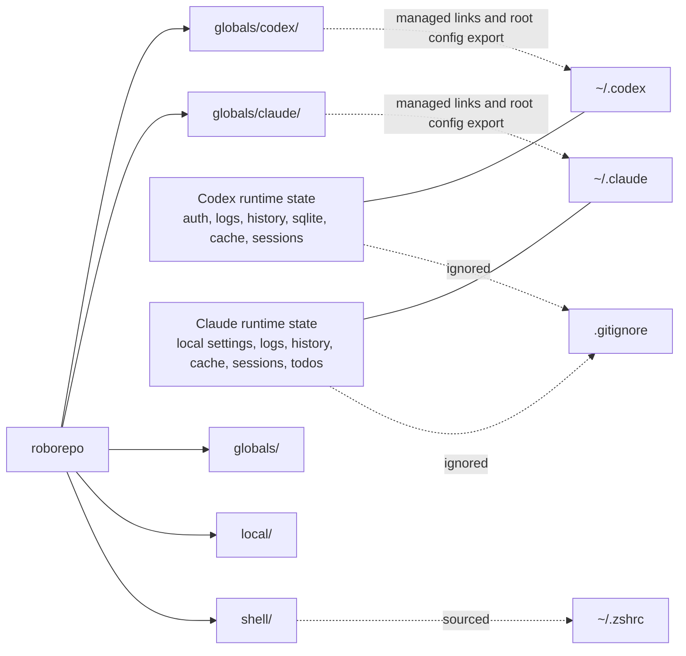

# How It Works

## Relationship



## Symlink Map

Most files are symlinked directly from the repo into the tool home directory. Root config files are different: `~/.claude/settings.json` and `~/.codex/config.toml` are mutable active files, so the installer copies repo baselines when missing or identical and asks before merging existing local content.

Codex (`~/.codex/` ← `globals/codex/`, plus per-skill links into `~/.codex/skills/`):

- `AGENTS.md`
- `config.toml` exported as a local active file
- `hooks.json`
- `MANAGED_BY_ROBOREPO.md`
- `commands/`
- `rules/`
- `skills/<name>/` — per-skill symlinks: `~/.codex/skills/<name> → globals/agents/skills/<name>`

Claude (`~/.claude/` ← `globals/claude/`):

- `CLAUDE.md`
- `settings.json` exported as a local active file
- `MANAGED_BY_ROBOREPO.md`
- `commands/`
- `hooks/`
- `skills/`

## Install Workflow Filesystem Shapes

Root config files are mutable user state. The repo keeps portable baseline templates, but active home files are local copies or user-owned files, not direct symlinks.

### Managed Read-Mostly Assets

Repo files are the source of truth for read-mostly assets. The global harness path observes them through symlinks.

```text
~/.codex/AGENTS.md              -> <repo>/globals/codex/AGENTS.md
~/.codex/commands               -> <repo>/globals/codex/commands
~/.codex/hooks.json             -> <repo>/globals/codex/hooks.json
~/.codex/rules                  -> <repo>/globals/codex/rules
~/.codex/skills/<name>          -> <repo>/globals/agents/skills/<name>   (per-skill, enumerate-step)
~/.claude/CLAUDE.md             -> <repo>/globals/claude/CLAUDE.md
~/.claude/commands              -> <repo>/globals/claude/commands
~/.claude/hooks                 -> <repo>/globals/claude/hooks
~/.claude/skills/<name>         -> <repo>/globals/agents/skills/<name>   (per-skill, enumerate-step)
```

Implication: updates in this repo become active globally for these assets. User edits at the global path edit the repo file through the symlink.

### Root Config Export

Repo files are portable baselines. Active global files are local copies or existing user-owned files.

```text
<repo>/globals/codex/config.toml                # repo baseline
~/.codex/config.toml                    # active local file

<repo>/globals/claude/settings.json             # repo baseline
~/.claude/settings.json                 # active local file
```

Implication: runtime trust, hook approvals, local profiles, and machine-specific state stay out of repo source. If both sides exist, the installer keeps the local file and prints merge guidance instead of replacing it.

Agent permission defaults are authored in `manifests/inventory/agent-permissions.json` and rendered by `scripts/build/render-agent-permissions.mjs`.

- `globals/codex/config.toml` receives the generated session profile block, such as `sandbox_mode`, `approval_policy`, and workspace network access.
- `globals/codex/rules/default.rules` receives generated shell command prefix policy such as allowed local commands and denied Git remote commands.
- `globals/claude/settings.json` receives generated `permissions.allow` and `permissions.deny` arrays from the same command, tool, MCP, and profile data.

Because `~/.codex/rules` is symlinked, command rule changes are live after repo edits. Because `~/.codex/config.toml` is root config, session default changes require the root config export or merge path before they affect an existing machine.

### Root Config Merge Options

#### Replace existing files

Repo version becomes active in the global config location. Existing local files are preserved in an archive folder.

```text
~/.codex/
  config.toml                    # copied/adopted repo version, active
  archived/
    config_archived_<timestamp>.toml

~/.claude/
  settings.json                  # copied/adopted repo version, active
  archived/
    settings_archived_<timestamp>.json
```

Implication: user does not lose old config, but must merge wanted local settings back from `archived/`.

#### Keep existing files

User-owned config remains active. Repo candidates are preserved in a staging folder for later merge.

```text
~/.codex/
  config.toml                    # existing local version, active
  not_adopted/
    config_repo_<timestamp>.toml

~/.claude/
  settings.json                  # existing local version, active
  not_adopted/
    settings_repo_<timestamp>.json
```

Implication: user keeps current behavior, but must merge wanted repo defaults from `not_adopted/`.

#### Merge review prompt

User-owned config remains active until the selected install mode or collision policy completes. The installer prints a merge prompt that points at both local and repo paths after actions that create backups or staged defaults.

```text
<repo>/globals/codex/config.toml                # repo candidate
~/.codex/config.toml                    # existing local version, active

<repo>/globals/claude/settings.json             # repo candidate
~/.claude/settings.json                 # existing local version, active
```

Implication: no automatic merge. The agent/user compares both sides and applies intentional edits after the installer finishes the backup-producing action.

### Future layered model

Desired but not implemented:

```text
repo baseline
        ↓ inherited by
user global config overlay
        ↓ refined by
local repo context
```

This needs either native harness include support or a generated/merged config pipeline. Track this in [../../plans/harness-parity-todo.md](../../plans/harness-parity-todo.md).

### Shared skills: canonical source + per-harness fan-out

The canonical shared source is `globals/agents/skills/<name>/` (each a folder with a `SKILL.md`).
Both harnesses reach skills via their native skill dirs:

- **Codex** reads `~/.codex/skills`. The installer creates `~/.codex/skills/<name> →
  globals/agents/skills/<name>` for each shared skill. Codex's own native skills are real
  directories at `~/.codex/skills/.system/` and are left untouched.
- **Claude** reads `~/.claude/skills`. The installer creates `~/.claude/skills/<name> →
  globals/agents/skills/<name>` for each shared skill.

Skills are linked by an **enumerate-step** (`install-lib.sh:link_global_skills`), not by
manifest rows. This keeps the manifest focused on static paths while skills grow dynamically.
`scripts/doctor.sh --installed` checks the live per-skill links; `scripts/doctor.sh` checks
that source dirs exist in the repo.

### Two skill layers: shared vs. internal

There are two distinct, firewalled skill layers:

- **Shared** — `globals/agents/skills/<name>/`, the canonical source. Linked per-skill into
  each harness's native skills dir at install time; global on both harnesses and exportable to
  other repos. Advisory coding skills any repo may receive.
- **Internal** — `local/skills/<name>/`, linked **only** into this repo's own project-scope
  dotdirs (`.claude/skills`, `.agents/skills`) by `link-skills.sh`. These describe how to
  develop/maintain this repo and are **never** global and **never** exported. The separation is
  structural: the export/installer tools read only `globals/agents/skills/`, with no code path
  to `local/skills/`.

### Client utilities (same model, for other repos)

One Node command, `roborepo`, is the consumer front door (see the README for the full subcommand
list). For the dual-harness skill model it offers:

- `skill export-to-local`: bundles shared skills into a `.zip` and copies them into a target repo's
  `.agents/skills` plus harness-specific skill folders.
- `skill symlink-repo`: treats the target repo's own `.agents/skills/<name>` as the canonical project
  skill source, then symlinks those skills into selected `.claude/skills` and/or `.codex/skills`
  folders. Existing `.claude` and `.codex` roots are used automatically; when run interactively and
  a root is missing, it asks whether to create/link that target. Noninteractive runs do not create
  new agent roots.

This is purely in-repo and never touches global `~/.claude` or `~/.codex`.

`roborepo` also folds in `mcp add`/`mcp apply`/`index`/`watch`/`run` and dispatches the lifecycle
verbs `update`/`sync`/`doctor`/`verify` to the existing bash scripts (the first install is the
shell bootstrap `install/main.sh`, so there is no root-level `install` verb). Shared skill logic
lives in `scripts/cli/skill-lib.mjs`.

## Sync Flow

```mermaid
sequenceDiagram
  participant Home as ~/.codex and ~/.claude
  participant Repo as roborepo
  participant Backup as ~/.roborepo-backups

  Home->>Repo: ./scripts/sync-from-home.sh reviews diffs before copying selected live config
  Repo->>Home: ./scripts/install/main.sh installs repo-owned config
  Home-->>Home: user-owned config collisions are preserved for adopt/agent merge
  Repo-->>Home: symlinks for read-mostly assets; local copies for root config
  Home-->>Home: runtime files remain local and ignored
```
